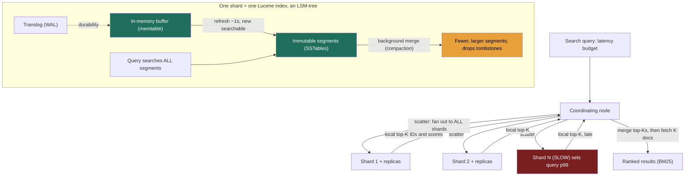

> A `WHERE description LIKE '%term%'` is a full table scan, O(n), no index helps it, and it dies the moment your corpus is real. Distributed search is the building block that turns "find the documents matching this text, ranked by relevance, in single-digit milliseconds across billions of docs" into something tractable. The data structure is the **inverted index** (the LSM-tree mindset from Lesson 2.3 reappears almost verbatim); the system is **Elasticsearch on Lucene**; and the Director-altitude tension is **indexing latency vs query latency** and the **scatter-gather tail**, both of which are cost and SLA decisions, not algorithm trivia.

### Learning objectives
- Explain the **inverted index** and why it makes text search O(matches) instead of O(corpus), and what it costs to build and keep fresh.
- Choose between **document-partitioned** (local) and **term-partitioned** (global) sharding, and justify the choice from the read:write ratio and query shape.
- Map the **Lucene/Elasticsearch** model, immutable segments, refresh, merges, onto the LSM-tree trade-off, and tune the **near-real-time refresh interval** as an indexing-vs-query knob.
- Reason about **relevance ranking (TF-IDF → BM25)** at the level needed to defend a design, not to re-derive the formula.
- Diagnose and bound the **scatter-gather tail-latency** problem, why p99 of a search cluster is governed by its slowest shard.

### Intuition first
A **back-of-book index** (Lesson 2.3) maps *a word → the pages it appears on*. Flip a book's table of contents inside out and you get the same idea: instead of "page 47 contains these words," you store "the word *latency* appears on pages 12, 47, 88." That inversion, from *document → words* to *word → documents*, is the entire trick. To answer "which pages mention *latency*?", you don't read all 400 pages (the table scan); you jump to one entry in the index and read off the page list.

Now scale it. One index for a 400-page book fits in your hand. An index for **every web page** does not, so you **split it across many librarians**. Two ways to split, and they trade off exactly opposite things:

- **Split by document (each librarian owns a shelf of books, and indexes only their own shelf).** To answer a query you must ask **every** librarian "what's on your shelf for *latency*?" and merge their answers. Writes are cheap (a new book goes to one librarian); reads are expensive (you bother everyone, **scatter-gather**).
- **Split by term (one librarian owns all entries for words A-F, another G-M…).** A single-word query asks **one** librarian. But filing a new book means touching **every** librarian whose letter-range it has words in, writes fan out, reads stay narrow.

Hold that fork. Almost every design decision below is "I picked document-partitioning, so now I own the scatter-gather tail," or "I keep the index fresh every second, so now I own the segment-merge tax." The mechanics are real Lucene features; the trade-offs are the interview.

### Deep explanation

**The inverted index, structure and cost.** A forward index is *document → terms* (what the DB already has). An **inverted index** is *term → postings list*, where a **postings list** is the sorted set of document IDs (plus positions, frequencies) containing that term. Building it: each document is **normalized, lowercase, stem (`running`→`run`), drop stop-words**, and every resulting term gets the doc appended to its postings list.

- **Why it's fast:** "find docs with *latency*" is now a single dictionary lookup returning a pre-sorted doc-ID list, **O(length of the postings list)**, i.e. O(number of matches), *independent of corpus size*. A multi-word query is a merge-intersection of sorted postings lists. Compare the scan it replaces: 1 billion docs × even 1 µs/doc = **1,000 seconds** per query. The inverted index turns that into microseconds-to-milliseconds.
- **What it costs:** the index is a **second copy** of your text, restructured, commonly **roughly 20-50% of the original text size** after compression (sorted doc IDs delta-encode superbly). And every write must update **every term's** postings list the document touches, a 200-word doc with 120 distinct terms is ~120 postings-list appends. *The same "indexes speed reads but tax writes and space" law from Lesson 2.3, applied to text.*
- **The alternative rejected:** a relational `LIKE '%x%'` or a btree on the text column. A btree indexes *whole values* left-anchored, it can serve `LIKE 'pre%'` but **not** `LIKE '%mid%'`, has no notion of relevance ranking, no stemming, no multi-term scoring. For substring/relevance text search it degrades to a full scan. You reach for an inverted index precisely when the query is "matching text, ranked," not "exact/prefix value lookup." (Postgres's `tsvector`/GIN is an inverted index bolted onto the RDBMS, fine to a few million docs; not a substitute for a search cluster at scale.)

**Sharding the index, document vs term partitioning.** One inverted index doesn't fit on one machine past a point, so you partition. The choice is the heart of distributed search.

- **Document-partitioned (local index).** Each shard owns a subset of *documents* and builds a **complete inverted index over just those docs**, what **Elasticsearch does by default.** *Writes are cheap and local:* a new doc routes to **one** shard (`hash(doc_id) % num_shards`); indexing scales linearly with shard count. *Reads are scatter-gather:* a term could match docs on **any** shard, so the coordinator fans the query out to **every** shard and merges the per-shard top-Ks. A 50-shard index means every search hits all 50 shards, the cost you sign up for.
- **Term-partitioned (global index).** The index is split by **term ranges** (or `hash(term)`). *Reads can be narrow:* a single-term query goes to the one shard owning that term. *Writes fan out and are the pain:* a single document's terms span the vocabulary, so each write updates **many shards' postings lists**, slow ingest, harder consistency, rebalancing headaches, and hot terms create **hotspot shards**.
- **The decision, stated as a trade:** **document-partitioning trades expensive reads (scatter-gather) for cheap, scalable writes**; **term-partitioning trades expensive writes (fan-out per document) for narrow reads**. The industry overwhelmingly chose **document-partitioning** (Elasticsearch, Solr) because write throughput and operational simplicity matter at ingest scale, the scatter-gather cost is mitigable (caching, routing, replicas), and most real queries are multi-term anyway, which erodes term-partitioning's narrow-read advantage. **Term-partitioning is rejected for general search** and survives only in specialized read-mostly systems. *Name this fork in an interview and you've shown you know where the bodies are buried.*

**Replication.** Each shard is a **primary** plus N **replicas** (Lesson 2.4); writes go to the primary, reads can hit either. The search-specific nuance: replicas don't just buy durability, they **add query throughput**, 50 shards × 2 replicas = 150 shard-copies to spread the scatter-gather load across, so adding replicas is the standard lever to raise QPS. The cost is the usual one: each replica is a full second copy of the index, paid in indexing work and storage.

**Lucene + Elasticsearch, segments, refresh, merges (this *is* an LSM-tree).** A single shard is one **Lucene index**, and Lucene's internals are the LSM-tree from Lesson 2.3 wearing a search hat, recognizing this is a strong-signal move.

- **Segments are immutable.** New docs buffer in memory (+ a **translog** write-ahead log for durability), and are periodically written out as new **immutable on-disk segments** (self-contained mini inverted indexes). *Segment ≈ SSTable. Translog ≈ WAL. Buffer ≈ memtable.*
- **A query searches *all* segments** of the shard and merges results, LSM read amplification. More segments = slower searches. Deletes/updates are tombstones (you can't edit an immutable segment), and stale data lingers until merged out.
- **Background merges are compaction by another name**, they fold small segments into large ones and drop tombstones, at a CPU/IO cost you capacity-plan and monitor. Tuning merge policy is the search team's job, not the whiteboard's; the Director statement is "search is fast, paid back later by segment merges you provision for."

**Near-real-time indexing, the refresh knob (the central trade).** A document just indexed is **not searchable until a `refresh`** opens a new searchable segment from the in-memory buffer.

- **Elasticsearch's default refresh interval is 1 second**, which is why it's **"near-real-time," not real-time**: a write is visible to search after ≤ ~1 s, not instantly.
- **The trade is direct.** Refresh more often → fresher results but more, smaller segments, more merge pressure, **lower indexing throughput**. Refresh less often (`30s`, or disabled entirely during a bulk load with one refresh at the end) → **much higher indexing throughput**, at the cost of staler search. The bulk-reindex pattern, `refresh_interval: -1`, then one final refresh, can multiply indexing throughput by removing per-second segment churn.
- **The Director framing:** refresh interval is a **per-index SLA decision tied to the requirement.** A logging index (Lesson 3.13) ingesting 500k docs/s where "visible within 30 s" is fine runs a long interval to protect ingest; a product-catalog index where a price edit must show "instantly" runs the 1 s default. You don't pick a number; you pick it **from the freshness requirement vs the ingest cost**, and you name the rejected end of the dial.

**Relevance and ranking, TF-IDF then BM25 (intuitions, not derivations).** Two intuitions drive lexical ranking: a doc that mentions a term often is more *about* it (**term frequency**), and a term that appears in few documents discriminates more than a common one (**inverse document frequency**, "the" is worthless). Their product is **TF-IDF**. **BM25**, the default in Lucene/Elasticsearch since 2016, keeps both intuitions and fixes TF-IDF's two real flaws: **term-frequency saturation** (the 1,000th occurrence shouldn't keep scoring linearly more) and **document-length normalization** (5 hits in a 50-word doc beat 5 in a 5,000-word doc), which is what makes it robust across mixed-length corpora. State that and stop. The altitude note: BM25 is the **baseline**, not the finish line, production relevance layers **boosting** (recency, popularity, business rules), **learning-to-rank** re-ranking of the top-K, and increasingly **hybrid lexical+vector retrieval** for semantic recall. The Director-credible statement is "BM25 for lexical recall; a re-ranking layer or hybrid retrieval *if* relevance is a product differentiator", you scope the investment, you don't re-derive BM25 at the whiteboard.

Go deeper, the TF-IDF and BM25 formulas (IC depth, optional)

TF-IDF scores a document D for query Q as `score(D,Q) = Σ_t tf(t,D) × log(N / df(t))`, term frequency times log-inverse document frequency, summed over query terms. Its flaws: tf is unbounded (linear forever) and long documents accumulate score for free.

BM25: `score(D,Q) = Σ_t IDF(t) × tf(t,D)·(k1+1) / (tf(t,D) + k1·(1 − b + b·|D|/avgdl))`. The `k1` term (typically ~1.2) caps term-frequency contribution asymptotically, saturation; the `b` term (typically ~0.75) scales the denominator by document length relative to the corpus average, length normalization. Set b=0 and k1→∞ and you're back at TF-IDF. Lucene's "classic" TF-IDF similarity was the default until Lucene 6 / Elasticsearch 5.0 (2016) switched to BM25.

**The scatter-gather query path and its tail.** Document-partitioning's bill comes due here; tail latency is the single most important operational fact about a search cluster.

1. A query hits a **coordinating node** (any node can coordinate).
2. **Query phase (scatter):** the coordinator fans the query to **one copy of every shard** (primary or replica); each shard locally finds its **top-K** by BM25 and returns just K doc IDs + scores (cheap, small).
3. The coordinator **merges** the per-shard top-Ks into the global top-K.
4. **Fetch phase (gather):** the coordinator fetches the **full documents** for just the final K winners.

The crucial consequence: **a query is as slow as the slowest shard it touches.** Fan-out turns a *rare* per-shard slowdown into a *common* per-query slowdown, the slowest shard governs the query's p99, and the effect compounds as fan-out grows (the Dean & Barroso "Tail at Scale" result). The mitigations are real and worth naming:

Go deeper, the tail-amplification math (IC depth, optional)

If each shard independently responds within 100 ms 99% of the time, the chance that **all 50** shards in a fan-out beat 100 ms is 0.99^50 ≈ **0.60**, so ~**40% of queries** wait on at least one straggler. The per-query probability of hitting a slow shard is `1 − (1 − p_slow)^fanout`, which is why over-sharding directly worsens query p99 even when every individual shard looks healthy, and why halving fan-out is often worth more than making each shard faster.

- **Bound the fan-out / shard count.** Fewer, larger shards = smaller fan-out = thinner tail (but each shard does more work). Over-sharding is the classic mistake, 1,000 tiny shards means 1,000 chances of a straggler per query.
- **Replicas + adaptive replica selection.** Route each shard's sub-query to the **replica that's currently fastest** (ES uses observed latency/load), avoid the node that's GC-pausing or hot.
- **Request hedging and timeouts.** Send a backup request to another replica if the first is slow, hedged requests cut the tail at the cost of a little extra load; or cap work per shard.
- **Routing to prune fan-out.** If a **routing key** can co-locate related docs on one shard (route all of a tenant's docs by `customer_id`), a tenant-scoped query hits **one** shard, fan-out collapses to 1, and the tail problem with it. The single biggest scatter-gather win when the access pattern allows it.
- **Caches.** A shard-level request cache and the OS page cache absorb repeated queries so fan-out is cheap on the common path.

### Diagram: document-partitioned scatter-gather, with the segment internals of one shard

### Worked example: product search for an e-commerce catalog
Requirements (the RESHADED **R** and **E** steps): **200M products**, **5,000 search QPS** at peak, p99 search **< 200 ms**, results ranked by relevance with business boosts (in-stock, sponsored), and a price/inventory edit visible **within ~1-2 s**. Write rate is modest, maybe **2,000 product updates/s** during catalog syncs.

- **Index data structure:** an **inverted index** over `title`, `description`, `brand`, `category`, normalized with stemming plus a curated synonym list (`tv` ↔ `television`). Numeric/keyword fields (`price`, `in_stock`) are stored for **filtering**, non-scored, cheap, and cacheable.
- **Sharding, and the rejected alternative:** **document-partitioned** (Elasticsearch default). 200M docs at ~2-4 KB each is a few hundred GB of index; size shards at **~20-40 GB each** → roughly **10-20 primary shards**, each replicated **×2** for read throughput and HA → ~30-60 shard-copies to spread 5,000 QPS across. *Term-partitioning rejected:* product queries are multi-word and we ingest continuous catalog updates, its per-document write fan-out would throttle catalog syncs and buy us nothing, since multi-term queries don't get the narrow-read benefit.
- **Freshness, the refresh trade made explicit:** keep the **1 s default refresh** so a price/stock edit is searchable within the required ~1-2 s. *Rejected:* a 30 s interval would raise ingest throughput and cut merge cost, but it violates the freshness requirement, so we pay the segment-churn tax deliberately, and use `refresh_interval: -1` **only** during a full bulk reindex, refreshing once at the end.
- **Relevance:** **BM25** baseline, wrapped in a **function-score** query that boosts **in-stock** and **recently-popular** items and applies sponsored placement, relevance *is* a product differentiator here, so the investment is justified; a learning-to-rank re-rank of the top-100 is a credible v2.
- **Tail latency, the headline risk:** 5,000 QPS each fanning out to ~15 shards = ~75,000 shard-sub-queries/s; the cluster p99 is hostage to the slowest of 15 shards per query. Mitigations: **adaptive replica selection** (route around a GC-pausing node), a **shard request cache** for hot/repeated queries, and modest shard count (15, not 500) to keep fan-out, and the tail, small. If most traffic were single-category, we'd **route by `category_id`** to collapse fan-out, but general catalog search spans categories, so we eat the scatter-gather and engineer the tail.
- **System-of-record caveat (a Director must say this):** Elasticsearch is **not the source of truth** for the catalog. It's a **derived, eventually-consistent read store**, the authoritative catalog lives in **Postgres/DynamoDB**, and the search index is **rebuildable** from it via a CDC/indexing pipeline. If the index is lost or corrupted, you reindex from the source; you never treat a search hit as a consistent, durable transaction.

### Trade-offs table: index sharding strategy
| Strategy | Write cost | Read cost | Hotspot risk | Used by | Use when… |
|---|---|---|---|---|---|
| **Document-partitioned** (local index) | **Low**, doc → one shard, scales linearly | **High**, scatter-gather to **all** shards; tail = slowest shard | Low (docs spread evenly) | **Elasticsearch, Solr** (default) | General search, high ingest, write throughput + ops simplicity matter (**almost always**) |
| **Term-partitioned** (global index) | **High**, each doc fans out to many term shards | **Low**, single-term query hits **one** shard | **High**, hot terms create hotspot shards | Rare / specialized read-mostly stores | Single-term, read-mostly, ingest is slow/batch and narrow reads are the priority |
| **Routed document-partitioned** (route by key) | Low | **Low for routed queries** (fan-out → 1 shard) | Medium, uneven key sizes can hotspot | ES with custom `routing` | A natural partition key (tenant, category) scopes most queries → collapses fan-out |

### What interviewers probe here
- **"Why not just index the text column in Postgres?"**, *Strong:* a btree/`LIKE` can't do unanchored substring, has no relevance ranking, stemming, or multi-term scoring; for "matching text, ranked," you need an **inverted index** (Postgres GIN/`tsvector` works to a few million docs, but a dedicated cluster past that). *Red flag:* "add an index on the column" with no awareness that text search isn't a btree value lookup.
- **"Shard by document or by term, which, and what do you give up?"**, *Strong:* document-partitioned (the real-world default) → **cheap writes, scatter-gather reads**; term-partitioned → narrow reads but **per-document write fan-out and hot-term hotspots**; picks document and names the tail-latency cost it's taking on. *Red flag:* doesn't know the distinction, or claims you can have cheap writes *and* narrow reads.
- **"How fresh are search results after a write, and how do you control it?"**, *Strong:* Elasticsearch is **near-real-time**, default **1 s refresh**; the refresh interval is the **indexing-throughput vs search-freshness knob**, set per index from the requirement. *Red flag:* assumes search is instantly consistent with the write, or has never heard of refresh/segments.
- **"Your search p99 is bad even though every shard looks healthy, why?"**, *Strong:* **scatter-gather tail amplification**, the query waits on the **slowest of N shards**, so per-query p99 degrades as fan-out grows even if each shard's own p99 is fine; mitigate with fewer shards, adaptive replica selection, hedged requests, routing, caches. *Red flag:* stares only at per-shard metrics, or "add more shards" (which **worsens** the tail).
- **"Is Elasticsearch your source of truth?"**, *Strong:* **no**, derived, eventually-consistent, availability-leaning read store, **rebuildable** from the authoritative DB via a CDC/indexing pipeline. *Red flag:* treats a search cluster as a durable system of record.
- **"How does relevance ranking work, and how far would you take it?"**, *Strong:* TF × IDF intuition, **BM25** as the modern default (saturation + length normalization), then **scopes** the investment, boosting/LTR/vector hybrid only if relevance is a product differentiator. *Red flag:* re-deriving BM25 by hand (too deep) or "it just sorts by match" (too shallow).

### Common mistakes / misconceptions
- **Treating search as strongly consistent / a system of record.** It's near-real-time and derived; a just-written doc isn't searchable until refresh, and the index is rebuildable from the real source.
- **Over-sharding.** Hundreds of tiny shards *worsen* tail latency (every query inherits hundreds of straggler chances) and waste overhead, size shards by data volume, not optimism.
- **Ignoring the refresh trade**, running the 1 s default during a billion-doc bulk load and wondering why ingest is slow (disable refresh during the load, refresh once at the end).
- **Assuming "add more nodes/shards" fixes search latency**, it can deepen the scatter-gather tail; the fix is often *fewer* shards + replica selection + routing.
- **Forgetting segment merges are a real operational tax**, the same compaction cost as LSM (CPU/IO, latency spikes, disk bloat); must be capacity-planned.

### Practice questions
**Q1.** Walk me through what happens, end to end, when a user searches "wireless headphones" across a 30-shard, document-partitioned index, and tell me where the latency risk is.
> *Model:* The query hits a **coordinating node**. **Scatter (query phase):** it fans out to **one copy of each of the 30 shards** (primary or replica, picked by adaptive replica selection); each shard intersects the postings lists for `wireless` and `headphones`, scores candidates with **BM25**, and returns just its **top-K doc IDs + scores**. The coordinator **merges** the 30 top-Ks into a global top-K. **Gather (fetch phase):** it fetches the **full documents** for only the final K winners. The latency risk is the **tail**: the query can't finish until the **slowest of the 30 shards** responds, so even if each shard's p99 is good, the *query's* p99 is dominated by the chance that any one of 30 is in its slow tail. Mitigate with replica selection, hedged requests, modest shard count, caches, and (if the access pattern allowed) routing to cut fan-out.

**Q2.** A teammate proposes term-partitioning ("each shard owns a slice of the vocabulary") to make searches hit fewer shards. You run a write-heavy product catalog. What do you say?
> *Model:* Term-partitioning *does* make **single-term** reads narrow, but it has two disqualifying costs for us. **(1) Write fan-out:** every indexed document has terms spanning many vocabulary slices, so each write must update **many shards' postings lists**, with continuous catalog syncs that cripples ingest and complicates consistency and rebalancing. **(2) Hot-term hotspots:** common/trending terms concentrate load on one shard. And our queries are **multi-word**, so we'd rarely get the narrow-read benefit anyway. The industry default is **document-partitioning** for exactly this reason: cheap, linearly-scalable writes, with the scatter-gather read cost mitigated by replicas, caching, and routing. I'd reject term-partitioning here and engineer the read tail instead.

**Q3.** Your logging cluster ingests 500k log lines/s but indexing keeps falling behind and search is slow. Two-part question: how do you relieve ingest, and why is search slow?
> *Model:* **Relieve ingest via the refresh knob.** Logs only need "searchable within tens of seconds," so raise `refresh_interval` from 1 s to e.g. **30 s**, far fewer, larger segments per second means less refresh overhead and merge pressure, multiplying indexing throughput. Use **time-based indices** (daily) so you write to one active index and the rest are read-only and fully merged. **Search is slow** for two compounding reasons: too **many segments** (frequent refresh → many small immutable segments, and a query must search *all* of them, LSM read amplification), and likely **over-sharding** (every query scatter-gathers across too many shards, inheriting a straggler tail). Fix: longer refresh, force-merge old indices, right-size shards, and search only the relevant time-range indices instead of all of them.

**Q4.** Why is Elasticsearch described as "near-real-time," and when does that property bite you?
> *Model:* Because a newly indexed document is **not searchable until a `refresh`** turns the in-memory buffer into a new searchable segment, and the default refresh interval is **1 second**, durability is immediate (translog WAL), but **search visibility lags** by up to ~1 s. It bites when a workflow assumes read-your-writes through search, "create order, immediately search for it, don't find it." Fixes: `?refresh=wait_for` on the critical write, read that doc by ID from the source DB instead of via search, or accept the window. The deeper point: search is a **derived, eventually-consistent** view, not a strongly-consistent store.

**Q5.** Defend BM25 over plain TF-IDF in two sentences, and tell me when you'd go beyond BM25.
> *Model:* BM25 keeps TF-IDF's two intuitions (frequent terms matter, rare terms discriminate) but fixes its two real flaws, **term-frequency saturation** and **document-length normalization**, which makes it robust across mixed-length corpora, hence the Lucene/ES default since 2016. I'd go beyond BM25 only when relevance is a **product differentiator**: function-score boosting (recency, popularity, business rules), a **learning-to-rank** re-rank of the top-K, or **hybrid lexical+vector retrieval** for semantic recall, scoping the investment to the requirement rather than gold-plating relevance everywhere.

### Key takeaways
- The **inverted index** (term → sorted postings list) makes text search **O(matches), not O(corpus)**, a copy-and-restructure of your text that, like any index, taxes writes and storage (Lesson 2.3's law applied to text).
- Sharding forks into **document-partitioned** (cheap writes, **scatter-gather reads**, the universal default in Elasticsearch/Solr) vs **term-partitioned** (narrow reads, **per-document write fan-out + hot-term hotspots**, a niche read-mostly choice); name the fork and the cost you're buying.
- A Lucene shard **is an LSM-tree**: immutable **segments** (≈ SSTables), a **translog** WAL, **refresh** (≈ flush, default **1 s** → "near-real-time"), tombstone deletes, and **segment merges** (≈ compaction, a background tax you provision for). The **refresh interval is the indexing-throughput vs search-freshness knob.**
- Relevance is **TF-IDF → BM25** (saturation + length normalization, the default since 2016); BM25 is the strong baseline, and boosting / LTR / vector-hybrid are scoped to whether relevance is a product differentiator.
- The defining operational fact is **scatter-gather tail amplification**, a query's p99 is the **slowest shard's** latency, and it worsens with fan-out; mitigate with **fewer shards, replicas + adaptive selection, hedged requests, routing, and caches**, and remember the cluster is a **derived, rebuildable, eventually-consistent** read store, never the source of truth.

> **Spaced-repetition recap:** Back-of-book index, inverted (word → pages). Split by **document** = cheap writes, ask **every** librarian (scatter-gather, tail = slowest shard), the default; split by **term** = ask one librarian but filing fans out (niche). A Lucene shard is an **LSM-tree**: segments ≈ SSTables, refresh ≈ flush (default **1 s** = near-real-time, the freshness-vs-ingest knob), merges ≈ compaction. Rank with **BM25** (TF saturation + length norm). It's a **derived, rebuildable** store, not the source of truth.
