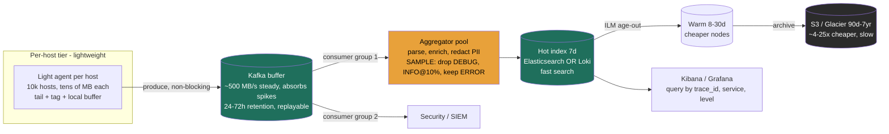

> Lesson 3.8 built the durable buffer (Kafka as load-leveler and replay log); Lesson 3.12 built the inverted index (Elasticsearch's full-text search). This lesson **assembles both into a logging pipeline** and confronts the dimension that actually gets logging projects killed: **cost**. At a 10,000-host fleet, naive "log everything to Elasticsearch" is a multi-million-dollar-a-year line item that also melts your indexer on the first traffic spike. The Director job here is not "stand up ELK" — it's **capping volume, retention, and queryability against a budget** while keeping the one log line that matters on the night of an incident.

### Learning objectives
- Justify the **two-tier collection** architecture (lightweight agent per host → centralized aggregator) and name what writing logs **direct to the index** costs you.
- Place a **Kafka buffer** in the pipeline and explain why it's the *same* load-leveling/replay argument as Lesson 3.8.
- **Quantify log volume** for a real fleet (events/s → TB/day → $/month) and cut it with **structured logging, sampling, and tiered retention** — with the math.
- Make the **ELK vs Loki vs managed-SaaS** call from the throughput/cost/queryability trade, and reason about the **cardinality trap**.
- Query across services with **correlation / trace IDs** (W3C Trace Context, OpenTelemetry), and place logs correctly in the observability triad vs metrics (3.14) and traces.

### Intuition first
A logging pipeline is the **black-box flight recorder for a distributed system** — but for an airline, not one aircraft. **Every plane (host) has a small, cheap onboard recorder (the agent)** that does almost nothing but scoop up events and forward them — it must be light, because it flies on the same engine doing the real work. The recorders all stream to a **central archive on the ground**, but you never let a thousand planes write *directly* into the archive's master index: if the archive hiccups, you don't want planes falling out of the sky (logs blocking the app) or events vanishing. So between the planes and the archive sits a **conveyor belt (Kafka)** that catches everything instantly, absorbs the rush-hour surge, and lets the archivists file at a steady pace — replaying the belt if they need to re-file.

Then the hard, unglamorous part: **you cannot keep every recording forever, or index every word for instant search.** So you triage: crash recordings (ERROR/WARN) kept in full and searchable, routine chatter (INFO) **sampled**, engine telemetry (DEBUG) **dropped**, and old recordings moved from the fast vault to **cheap deep storage (S3)**. The whole lesson is: *capture everything cheaply at the edge, triage hard in the middle, and pay for fast search only where it earns its keep.*

(One sharp distinction up front, developed at the end: this is **logs** — discrete, high-cardinality event records that answer *"why did **this** request fail?"* Aggregated numeric health — *"is the system healthy?"* — is **metrics**, Lesson 3.14, and it's 100–1000× cheaper. Conflating the two is the most expensive mistake in the space.)

### Deep explanation

#### The numeric thread — size it before you architect it
Everything that follows is governed by one estimation, so do it first (RESHADED's E step). Take a **10,000-host fleet** averaging **100 log events/s/host = 1,000,000 events/s**, each event **~500 bytes**:

- **Raw ingest:** 1M × 500 B = **500 MB/s** → **~43 TB/day raw** (~1.3 PB/month). This single number drives every decision below.
- **Indexed footprint in Elasticsearch:** a full-text **inverted index** (3.12) plus 1 replica inflates on-disk size — *assume ~2× raw* (a planning assumption, not a constant) → **~86 TB/day** of cluster storage if you index all of it.
- **The bill, unmanaged:** at a rough **$0.10/GB-month** for hot SSD-backed cluster storage, **30 days × 86 TB/day ≈ 2.6 PB resident → ~$260k/month just for hot storage**, before compute, ingest, and the SaaS markup. *That* is why "log everything to ELK forever" is a Director-level cost failure, not a config detail.

Hold these numbers. The rest of the lesson takes this from a quarter-million-dollar-a-month liability to a controlled budget — and **every move names what it gives up.**

#### Two-tier collection — why the agent must be dumb and light
You do **not** have applications POST logs straight into your indexing cluster. The architecture is two tiers:

1. **A lightweight forwarder/agent on every host** — **light agents written in C/Rust/Go** (Fluent Bit is the canonical example), taking tens of MB of RAM and near-zero CPU because they run on the **same node as your revenue-generating workload**. Their only jobs: tail logs, add host/pod metadata, buffer to local disk if the next hop is unreachable, forward.
2. **A heavyweight aggregator/processor, centralized** (e.g. Fluentd) — where the **expensive work** lives: parsing, enrichment, PII redaction, routing, reshaping into the index's schema. CPU-hungry, so it runs as a **fixed, autoscaled central pool**, not one per host.

**The rejected alternative: agents writing direct to Elasticsearch.** One fewer tier, so it looks simpler. It fails three ways: (a) **backpressure couples your app to your indexer** — when ES is slow or in a GC pause, the agent's buffer fills and either **blocks the application** or **drops logs at the source**; (b) a **traffic spike melts the indexer** — 10k hosts hammering ES during an incident, exactly when log volume spikes *and* you most need the logs; (c) **no replay** — a bad parse or mapping is already in ES badly, with no source of truth to re-process from. The two-tier split, plus the buffer below, fixes all three.

#### The Kafka buffer — the same load-leveling argument as Lesson 3.8
Between the agents and the aggregator/index sits **Kafka** (historically *exactly* what Kafka was built for — LinkedIn created it in 2011 to aggregate log data). Agents produce to topics; aggregators are consumer groups draining at their own pace:

- **Spike absorption (load-leveling).** Log volume is bursty and *correlated with incidents* — a bad deploy can 5× the log rate in seconds. **Kafka absorbs the burst in its durable partitions** at ~500 MB/s steady, and the indexer pool drains the backlog at a steady rate — sized for the **steady** rate, not the peak (the 3.8 fleet-vs-buffer cost argument). The visible signal is **consumer lag**; you autoscale aggregators on it.
- **Replay / reprocessing.** Kafka **retains** messages (time-based, not deleted on consume), so you can re-read the stream to backfill a new index, fix a bad parse, or feed a *second* consumer group (security SIEM, analytics) the same data independently.
- **Decoupling.** The index can be down for maintenance and **no logs are lost** — they sit in Kafka (say 24–72 h retention) until the consumer catches up.

**The rejected alternative: no buffer.** Fine at low volume. At 43 TB/day it can't absorb spikes (you'd size the indexer for peak — expensive and still fragile), and you lose replay entirely. The buffer is cheap insurance that converts "indexer hiccup" from an incident into a non-event.

#### Aggregation and indexing — ELK vs Loki, the central trade
The drained logs land in a **store + index + query** layer. Two dominant open-source shapes, and the choice *is* the throughput/cost/queryability trade:

**ELK / Elastic Stack.** Elasticsearch builds a **full-text inverted index over every field** (the 3.12 machinery): you can search arbitrary text across all logs fast — `message:"connection refused" AND service:checkout`. The price is **ingest cost and storage** (indexing is CPU-heavy; the inverted index roughly doubles storage) plus a **stateful, heavy cluster** to operate. The **maximum-queryability, maximum-cost** end.

**Grafana Loki — "Prometheus, but for logs."** Loki's defining choice: it **indexes only labels (metadata) — not the log content.** A stream is identified by a small label set (`{service="checkout", env="prod", level="error"}`); the **log lines themselves are compressed into chunks and written to object storage (S3)**. Querying selects streams by label, then **scans the compressed chunks** for the window. Consequences: **far cheaper ingest and storage** (~10× compression, no inverted index, cheap object store — our 43 TB/day raw might land as ~4 TB/day in S3), **far less operational state** — and **the cost is queryability**: an arbitrary text search over a wide window with few label filters means scanning lots of chunks, much slower than ES. Loki is fast *if* your query is **well-anchored by labels** and a bounded time window.

This is the crux: **ELK buys arbitrary fast search at high storage/ops cost; Loki buys cheap storage and ops at the cost of slower unstructured search.** A Director picks from *how engineers actually query* (mostly "errors for service X in the last hour" → Loki shines; mostly "find this string anywhere across 30 days" → ES earns its cost) and the **budget**.

**The cardinality rule, once:** labels (and ES faceted fields) are for **low-cardinality dimensions** you filter and group by — service, env, level, region; **high-cardinality identifiers (user_id, trace_id, request_id) go in the log line body**, where you search them within a label-narrowed stream. Putting them in the label set explodes the index.

<details>
<summary>Go deeper — the cardinality trap mechanics (IC depth, optional)</summary>

Loki creates a **separate stream — and index entry — per unique label-value combination**. Add `user_id` (millions of values) to the label set and you generate millions of streams: the label index explodes, chunk files fragment into tiny unbatchable pieces, ingestion slows, and Loki starts rejecting writes. The same mistake in Elasticsearch — making a high-cardinality field a faceted/aggregated dimension — bloats the inverted index and field-data heap. The fix is always the same: label `{service, level, env}`, and grep the line body for `user_id=u_8821` within that narrowed stream. Cardinality math is multiplicative across labels: 100 services × 5 levels × 3 envs = 1,500 streams (fine); add 1M user_ids and it's 1.5 billion (dead).

</details>

#### Structured logging — the prerequisite that makes everything cheaper
Logs should be emitted as **structured JSON**, not free text:

```
{"ts":"2026-06-08T10:00:00Z","level":"ERROR","service":"checkout",
 "trace_id":"4bf92f...","user_id":"u_8821","msg":"payment declined","latency_ms":812}
```

**The rejected alternative — free text parsed centrally:** unstructured lines need **brittle, CPU-expensive regex parsing** that silently breaks the moment a developer changes a log format — your dashboards go blank exactly when you need them. Structured fields are queryable with no parsing at all (`level=ERROR`, `latency_ms>500`), make **sampling and routing trivial** (filter on `level`), and make **PII redaction auditable** (redact named fields, not a regex guess). Emit structure at the source; don't reverse-engineer it in the middle.

#### Sampling and retention — where a Director actually controls the bill
This is the heart of the cost story. Two levers, each with a *both-ends* failure mode.

**Sampling — but logs are NOT traces; you cannot sample uniformly.** The policy in one line: **drop DEBUG in production, sample INFO (~10%), keep 100% of WARN/ERROR — roughly a ~5× volume cut (43 → ~8 TB/day)**, the difference between a ~$260k/month and a ~$50k/month hot tier, from a *policy* rather than new hardware. The non-negotiable: **the cardinal sin is sampling away the error you're paging on.** Unlike distributed traces (where sampling 1% of requests is standard because each trace is one of millions of equivalent paths), an error log is often **the unique record of a specific failure** — drop it and the incident is unexplainable. **The rejected alternatives, both ends:** *keep everything* (5× the bill, mostly DEBUG no one reads) and *blind uniform sampling* ("keep 10% of all logs" — you just threw away 90% of your errors). Level-aware sampling is a one-line filter once logging is structured.

<details>
<summary>Go deeper — the sampling arithmetic (IC depth, optional)</summary>

Assume the level mix is ~40% DEBUG, ~45% INFO, ~15% WARN+ERROR. Drop DEBUG (40% → 0), sample INFO at 10% (45% → 4.5%), keep WARN/ERROR (15%): retained ≈ 15 + 4.5 ≈ **~19.5% → a ~5× reduction**, taking 43 TB/day → ~8.4 TB/day. The mix varies by org (chatty frameworks skew DEBUG-heavy, making the cut bigger); measure your own mix from a day's ingest before promising finance a number.

</details>

**Retention — tiered, hot → warm → cold.** Don't keep all logs on fast storage:

| Tier | Store | Cost (~$/GB-mo) | Retention | Query speed |
|---|---|---|---|---|
| **Hot** | SSD-backed ES nodes / Loki recent chunks | ~$0.10 | **7 days** | instant |
| **Warm** | HDD-backed nodes / cheaper instances | ~$0.04 | 8–30 days | seconds–minutes |
| **Cold / archive** | **S3 / Glacier**, searchable on rehydrate | **~$0.023 → ~$0.004** (Glacier) | 90 d – 7 yr | minutes–hours |

Most queries hit the **last few hours**; 95%+ of value is in the **hot 7 days**. Rolling everything older to **S3 (~4× cheaper than hot, ~25× for Glacier)** drops the long-tail bill an order of magnitude. ES does this natively with index lifecycle management; Loki gets it almost free because chunks already live in object storage.

**The retention wrinkle that is *not* purely a cost knob — compliance.** Retention is "shortest we can afford," **except**: **audit and security logs carry a mandatory retention floor** — **SOX** (financial controls, often **7 years**), **PCI-DSS** (≥1 year, 3 months immediately available), **HIPAA**. You cannot sample or early-delete those. Conversely, **GDPR** can *require* deletion of personal data on request — which collides with immutable audit archives, so **PII gets redacted at the aggregator** while the audit *event* is retained. Naming "audit logs have a legal retention floor that overrides the cost-minimizing instinct" is strong Director signal — retention is a **risk/compliance** decision, not just a budget line.

#### Querying across services — correlation and trace IDs
A single user request fans out across 20 microservices; its log lines are scattered across 20 streams. To reconstruct *that one request*, every service must stamp every log line with a **correlation / trace ID** that's **propagated across service boundaries**:

- At the **edge** (gateway/LB), generate a trace ID if absent. Propagate it on every downstream call via the **W3C Trace Context** standard header (`traceparent`), implemented by **OpenTelemetry**. Each service includes `trace_id` in every structured log line.
- Now a query `trace_id="4bf92f..."` returns **the full cross-service story of one request, in order** — the difference between "checkout is throwing 500s somewhere" and "checkout→payment timed out after 800ms because the fraud service was slow."
- This is also the **join key between the three pillars**: the same `trace_id` ties a **log** line to its **trace** span and to a spike in a **metric** — Lesson 3.14's territory.

### Diagram — the logging pipeline, end to end


### Worked example — observability for a 10k-host microservices platform
Requirement (R/E of RESHADED): a **10,000-host** platform, **~1M log events/s (~43 TB/day raw)**, engineers must debug production incidents in **seconds-to-minutes**, security needs **1-year audit retention**, and the logging bill must be **bounded and charged back to teams**. Design the pipeline:

1. **Collection — two-tier.** A light agent on every host (~20 MB RAM), tagging each line with `host`, `pod`, `service`, buffering locally if the next hop blips. *Rejected: agents → ES direct* — an ES GC pause would backpressure into the apps and a spike would melt the cluster. A centralized aggregator pool does parsing/enrichment/redaction.
2. **Buffer — Kafka.** Agents produce to Kafka; aggregators drain at the steady rate, autoscaled on **consumer lag**. A bad deploy that 5×'s the log rate is **absorbed**, not dropped, and the **same stream feeds a second consumer group → the security SIEM**. *Rejected: no buffer* — couldn't absorb the spike or replay a bad parse.
3. **Structured logging mandated.** All services emit **JSON** with `trace_id`, `level`, `service`, `latency_ms`. *Rejected: free text parsed centrally* — brittle regex that breaks on format drift, expensive at 1M lines/s.
4. **Volume control — the cost decision.** Policy: **drop DEBUG, sample INFO at 10%, keep 100% of WARN/ERROR → ~5× cut, 43 → ~8 TB/day**. The single biggest lever, and it's a *policy*, set centrally. *Rejected: keep-everything (5× the bill) and blind 10% sampling (drops 90% of errors).*
5. **Index + retention — Loki, tiered.** Choose **Grafana Loki**: engineers' queries are overwhelmingly *"errors for service X in the last hour"* — label-anchored, Loki's sweet spot — and storage is **~10× cheaper** (compressed chunks in S3) than an ES full-text cluster at this volume. **Hot 7 days**, then chunks already sit in **S3** for the **1-year audit** window; rehydrate for the rare old-string search. *Rejected: ELK* — a heavy stateful cluster and ~2× storage to get arbitrary full-text search the team rarely needs; *rejected: Datadog/Splunk SaaS* — zero-ops, but per-GB ingest pricing makes it the most expensive option by far at this volume (order of $1–2/GB ingested — indicative, prices move). We keep the SaaS option open for the *security* subset where their analytics earn it.
6. **Cross-service query + chargeback.** `trace_id` (W3C Trace Context via OpenTelemetry) stamped at the edge ties one request across all services. **Per-team log volume is metered** off the `service` label and **charged back**, so teams that log 10× internalize the cost — the lever that actually changes behavior.

Net: a pipeline that would have been ~$260k/month of hot ELK storage is reduced by **structured logging + level-aware sampling + Loki + S3 tiering** to a small fraction of that, while *keeping every error*. Every step named its rejected alternative — that's the Director deliverable.

### Trade-offs table — ELK vs Loki vs managed SaaS
| Dimension | **ELK / Elastic Stack** | **Grafana Loki** | **Managed SaaS (Datadog / Splunk)** |
|---|---|---|---|
| Index model | **Full-text inverted index** over all fields | **Labels only**; log content = compressed chunks in object store | Proprietary, full-featured |
| Query power | **Highest** — fast arbitrary text search | Strong *if label-anchored*; **slower** for wide unstructured search | Highest + rich analytics/APM |
| Storage cost | **High** (~2× raw, SSD cluster) | **Low** (~10× compressed, S3) | N/A (you pay per ingest) |
| Ops cost | **High** (shards, JVM, tiers) | **Low** (less state, S3-backed) | **~Zero** (fully managed) |
| $ model | Self-run infra | Self-run infra (cheapest) | **Per-GB ingest** — most expensive at high volume |
| Use when… | Engineers need **fast arbitrary full-text search** over long windows; budget allows | **Cost-sensitive**, queries are **label/time-anchored**, already on Grafana/Prometheus | Want **zero ops** and willing to pay; or low-to-mid volume where the markup is tolerable |

### What interviewers probe here
- **"How do you keep logging from blocking the application?"** — *Strong:* **two-tier** (dumb light agent per host) **+ a Kafka buffer** so the indexer is decoupled — an ES outage or spike never backpressures into the app. *Red flag:* apps writing synchronously to Elasticsearch, or no awareness that a slow indexer can stall the app.
- **"43 TB/day of logs — how do you control the cost?"** — *Strong:* **structured logging → level-aware sampling (drop DEBUG, sample INFO, keep 100% ERROR) → tiered retention (hot 7d → S3)**, with the ~5× and ~4–25× multipliers, framed as a *policy* + *chargeback*. *Red flag:* "scale the cluster" / "storage is cheap" — it isn't, and they can't quantify it.
- **"ELK or Loki, and why?"** — *Strong:* frames it as **queryability vs storage/ops cost** — Loki indexes labels not content (cheap, fast *only if label-anchored*), ELK's inverted index buys arbitrary fast search at ~2× storage and heavy ops; picks from how engineers actually query and the budget. *Red flag:* "ELK, it's the standard" with no cost or query-pattern tie-back.
- **"You put `user_id` in your Loki labels — what happens?"** — *Strong:* the **cardinality trap** — high-cardinality values explode the index; they belong **in the log line**, searched within a label-narrowed stream. *Red flag:* unaware, or labels everything.
- **"How do you debug one request across 30 services?"** — *Strong:* **trace/correlation ID** generated at the edge, propagated via **W3C Trace Context / OpenTelemetry**, stamped on every structured line; query by `trace_id`. *Red flag:* "grep each service" with no propagated ID.
- **"Logs vs metrics — when which?"** — *Strong:* logs = discrete, high-cardinality, *"why did **this** fail"*, expensive; metrics (3.14) = aggregated numeric, *"is it healthy"*, 100–1000× cheaper — **don't use logs to compute what a metric should**. *Red flag:* proposes counting log lines to get a request rate.

### Common mistakes / misconceptions
- **Agents writing direct to the index** — couples app health to indexer health; a spike or GC pause backpressures or drops logs at the source. Use two-tier + a buffer.
- **No buffer (Kafka)** — can't absorb the incident-correlated spike, can't replay/reprocess a bad parse or backfill a new index.
- **The cardinality trap** — high-cardinality values (user_id, trace_id) in **Loki labels** or **ES faceted fields** explode the index. Keep them in the **log body**.
- **Sampling logs like traces** — uniform sampling drops the errors you page on. Sample **per level**: keep 100% ERROR/WARN, sample INFO, drop DEBUG.
- **"Storage is cheap, log everything forever"** — at 43 TB/day it's a six-figure monthly bill; retention must be tiered and capped — *except* audit/security logs, which have **legal retention floors** (SOX/PCI) you don't sample or early-delete.

### Practice questions
**Q1.** Your team wants every service to write its logs directly to Elasticsearch "to keep it simple." Talk them out of it (or into it).
> *Model:* Direct-to-ES couples **application health to indexer health**. When ES is slow (a GC pause, a shard rebalance, or an incident-driven log spike — exactly when you need logs most), the agent's send buffer fills and it must either **block the app** or **drop logs at the source**. It also gives **no replay**: a bad mapping or parse is already in ES badly, with no source of truth to reprocess from. The fix is **two-tier + Kafka**: a light agent that only tails/tags/forwards, a **Kafka buffer** that absorbs spikes and retains for replay, and a centralized aggregator pool draining at a steady rate (autoscaled on consumer lag). The indexer can now be down for maintenance with zero log loss. Direct-to-ES is acceptable only at toy scale.

**Q2.** You're at 43 TB/day of raw logs and finance wants the bill halved. Where do you cut, and what do you refuse to cut?
> *Model:* Two levers, in order of impact. **(1) Level-aware sampling**: drop DEBUG in prod, sample INFO ~10%, keep 100% WARN/ERROR — a **~5× cut (43 → ~8 TB/day)** that preserves every error. **(2) Tiered retention**: hot **7 days** on fast storage, then roll to **S3/Glacier (~4–25× cheaper)** for the long tail; 95% of query value is in the last few hours. What I **refuse to cut**: no **blind uniform sampling** (it throws away 90% of errors → the next sev-1 is unexplainable), and no touching **audit/security logs** below their **legal retention floor** (SOX ~7yr, PCI ≥1yr). I'd also add **per-team chargeback** so the teams generating the volume internalize the cost — the lever that actually changes logging behavior.

**Q3.** ELK or Loki for a platform whose engineers mostly ask "show me the errors for service X in the last hour"? When would your answer flip?
> *Model:* **Loki.** That query is **label-anchored** (`{service="X", level="error"}`) over a bounded recent window — Loki's sweet spot — and storage is **~10× cheaper** (compressed chunks in S3, no inverted index) with far less operational state. My answer **flips to ELK** when the dominant query is **"find this arbitrary string anywhere across 30 days"** — wide-window, unlabeled, full-text — because Loki would scan enormous numbers of chunks while ES's **inverted index** answers it fast. The decision is **query pattern × budget**: label/time-anchored + cost-sensitive → Loki; arbitrary full-text over long windows + budget for it → ELK.

**Q4.** A request fails intermittently and touches 20 services. How do you debug it, and what has to be in place beforehand?
> *Model:* Query by **trace ID**. For that to work, the platform must **propagate a correlation/trace ID across every service boundary**: generate it at the **edge** if absent, pass it on every downstream call via the **W3C Trace Context `traceparent`** header (standardized by OpenTelemetry), and have every service stamp `trace_id` into its **structured** log line. Then one query returns the **full ordered cross-service story** of that request — "checkout → payment timed out at 800ms waiting on a slow fraud check," not "checkout 500s somewhere." The same `trace_id` is the **join key to traces and metrics** (3.14). Without the propagated ID in place beforehand, you're grepping 20 services on fuzzy timestamps — which is why ID propagation is a platform prerequisite, not an afterthought.

### Key takeaways
- **Two-tier collection + a Kafka buffer** is the spine: a dumb, light agent per host → Kafka (load-leveling + replay, the 3.8 argument) → heavy centralized aggregator → index. Never let apps write direct to the index.
- **Quantify before you architect**: 10k hosts × 100 events/s × 500 B ≈ **43 TB/day raw**, ~2× in ES → a six-figure monthly bill unmanaged. Volume is the whole game.
- **Sampling is the biggest lever and logs aren't traces**: drop DEBUG, sample INFO, **keep 100% of ERROR/WARN** (~5× cut). Pair with **tiered retention** (hot 7d → S3/Glacier, ~4–25× cheaper). Both ends are wrong — keep-everything *and* blind sampling.
- **ELK vs Loki is queryability vs cost**: Loki indexes **labels only** (cheap chunks in S3, fast *if label-anchored*); ELK's **inverted index** buys arbitrary fast search at ~2× storage + heavy ops. Beware the **cardinality trap** — high-cardinality IDs go in the **log line**, not the labels.
- **Cross-service debugging needs a propagated trace ID** (W3C Trace Context / OpenTelemetry) on every structured line. And **logs ≠ metrics (3.14)**: logs answer *"why did **this** fail,"* metrics answer *"is it healthy"* 100–1000× cheaper — plus audit logs carry **legal retention floors** that override cost-cutting.

> **Spaced-repetition recap:** Flight recorders for a fleet: a tiny agent on every host → **Kafka buffer** (absorb spikes, replay — same as 3.8) → heavy central aggregator → index. Size it first: ~**43 TB/day** at 10k hosts, so triage hard — **drop DEBUG, sample INFO, keep 100% ERROR**, hot-7-days-then-S3 (~5× and ~4–25× cuts). **Loki = label index only, cheap, label-anchored queries; ELK = full-text inverted index, fast arbitrary search, ~2× storage.** Keep high-cardinality IDs in the **line** (cardinality trap), stamp a **trace_id** (W3C/OTel) to query across services, and never confuse logs with metrics — or forget audit logs' legal retention floor.
