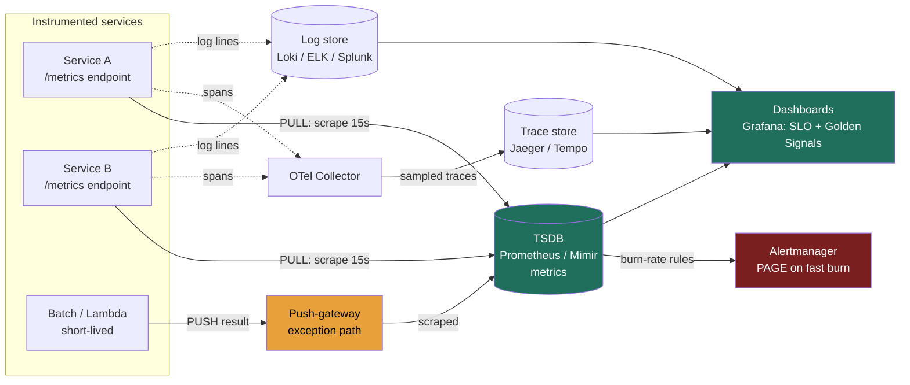

### Learning objectives
- Place the **three pillars** — metrics, logs, traces — on a single cost/detail/causality axis and state crisply **when each is the right tool**: metrics to *detect*, traces to *localize*, logs to *root-cause*.
- Reason about **time-series databases** and the **pull (Prometheus scrape) vs push (StatsD / push-gateway / OTel)** collection trade-off, including why pull gives you liveness detection for free.
- Treat **cardinality** as the dominant cost driver of any monitoring system — the one number that blows up both your TSDB heap and your SaaS invoice — and know what makes it explode.
- Own the two **Director-altitude decisions**: **build-vs-buy** (self-host Prometheus/Grafana vs Datadog/New Relic, priced against cardinality and headcount) and **signal-vs-noise** (alert on **SLO burn-rate** and symptoms, not on every CPU spike — because alert fatigue is an on-call-health and risk problem).

### Intuition first
Monitoring a distributed system is running a **hospital for your services**, and a hospital watches patients three different ways.

**Metrics are the wall of vital-sign monitors** — heart rate, blood pressure, O₂, one number per second per patient, trended on a screen. Cheap to capture, cheap to store, instantly aggregatable ("show me the average BP across the whole ward"), and perfect for **alarms** ("page the nurse if O₂ drops below 90"). But a vital sign tells you *something is wrong*, not *why* — a number can't explain itself.

**Logs are the patient's chart** — the detailed, timestamped notes every nurse and doctor writes: "08:14, administered 5mg, patient nauseous." Enormously detailed, the forensic record you read **after** an alarm fires to understand what actually happened. But you can't watch 10,000 charts in real time, and storing every note for every patient forever is the most expensive thing the hospital does.

**Traces follow one patient through every department** — ER → radiology → surgery → recovery — with a stopwatch on each handoff, so when the visit took 9 hours you can see the 6 of them were spent waiting outside radiology. In a system of 40 microservices where one user request fans out across a dozen of them, a trace is the **only** way to answer "*which* service made this request slow?"

The whole lesson is that axis: **metrics are cheap, aggregate, and bounded — you alarm on them; logs are detailed, expensive, and per-event — you root-cause on them; traces are about causality across services — you localize on them.** A mature system runs all three, and the Director's job is to spend money on each in proportion to the signal it actually returns. The fastest way to read as a junior engineer in this round is to reach for "just log everything and grep it" — that's the hospital trying to run alarms off the handwritten charts.

### Deep explanation

**The three pillars, on one decision axis.** Don't recite "metrics, logs, traces" as a list — frame them by **what question each answers cheaply**, because that's the design decision.

| Pillar | The question it answers | Data shape | Cost driver |
|---|---|---|---|
| **Metrics** | *Is something wrong, right now?* (detect + alert) | Numeric time series, pre-aggregated | **Cardinality** (number of series) |
| **Traces** | *Where in the call graph is it wrong?* (localize) | Per-request spans across services | Trace **volume × sampling rate** |
| **Logs** | *Why exactly did it break?* (root-cause) | High-detail per-event text/JSON | **Ingest volume** (GB/day) |

The strong-signal sequence in an incident is **metric → trace → log**: a metric alert tells you checkout error rate jumped; a trace tells you the failing requests all stall in the `payment-gateway` span; the logs on that service tell you it's a TLS handshake timeout to Stripe. Using the wrong pillar is expensive — alerting off logs means parsing gigabytes to compute a number you could have had for ~2 bytes as a counter; trying to root-cause from a metric is impossible because a number carries no context.

**Metrics and the time-series database (TSDB).** A metric is a named numeric series with a set of **labels** (dimensions): `http_requests_total{service="checkout", method="POST", status="500"}`. Each unique combination of label values is **one time series**, stored as a stream of `(timestamp, float64)` samples. TSDBs (Prometheus, InfluxDB, the horizontally-scaled Prometheus backends Thanos / Cortex / Grafana Mimir, and managed offerings) exploit two facts to be wildly more efficient than a general-purpose store: timestamps are monotonic and regular (delta-of-delta encoding), and adjacent float values change little (XOR/Gorilla compression). A raw `(int64 ts, float64 val)` is 16 bytes; a well-compressed TSDB sample lands around **~1–2 bytes** — an order-of-magnitude win that's *why* you use a TSDB and not Postgres for this. (Treat those byte figures as order-of-magnitude rules, not a spec — they move with the encoder and the data.)

The four metric **types** you should name: **counter** (monotonic, e.g. total requests — you rate() it), **gauge** (goes up and down, e.g. queue depth, memory), **histogram** (bucketed distribution — the *only* honest way to get **p99 latency**, because you cannot average percentiles across hosts), and **summary** (client-side quantiles, cheap to query but **not aggregatable** across hosts — which is why histograms are the default for fleet-wide p99). The histogram point matters: a Director who says "average latency is fine" while p99 is 4 seconds has missed the tail that the user actually feels.

**Pull vs push — the collection-model decision.** How do metrics get from a service into the TSDB?

- **Pull (the Prometheus model):** the TSDB **scrapes** each target's HTTP `/metrics` endpoint on a fixed interval (commonly every **15 s**). The server holds the list of targets (from service discovery — Kubernetes, Consul, EC2 tags) and goes and gets the data.
- **Push (StatsD, Graphite, the OpenTelemetry Collector, Datadog agent):** each service **sends** its metrics to a collector/aggregator, which forwards to the backend.

The decision turns on three things, and you state the trade, not a preference:

1. **Liveness for free (pull's killer feature).** With pull, a **failed scrape is itself a signal** — Prometheus records `up == 0` for that target, so you detect a *dead* instance with zero extra instrumentation. Push **cannot distinguish "dead" from "merely silent"** — a service that stopped pushing looks identical to a service with nothing to report. This is the single strongest reason pull dominates the cloud-native world.
2. **Service discovery and control live server-side** with pull (the monitoring system decides who to scrape, the cadence, and applies global relabeling), versus push putting that burden on every client.
3. **Short-lived and network-isolated jobs break pull**, and that's the honest limit: a batch job or a Lambda that runs for 4 seconds is gone before the 15 s scrape, and a target behind a NAT/firewall can't be reached. The Prometheus answer is the **push-gateway** — an explicit *exception*: the ephemeral job pushes its result to a gateway, which Prometheus then scrapes. The Director-level caveat is that the push-gateway is a **deliberate escape hatch, not the default** — it becomes a stale-metric trap and a single point of aggregation if you route normal service traffic through it. **Rejected default:** making everything push "because it's simpler for the app" — you forfeit free liveness detection and centralize a bottleneck.

One clarification that earns signal: **OpenTelemetry (OTel) is instrumentation and collection, not a backend.** It's the vendor-neutral SDK + Collector + OTLP wire protocol that emits metrics/traces/logs to *whatever* backend you choose. It's the **anti-lock-in** answer — instrument once with OTel, switch from Datadog to self-hosted without re-instrumenting — but it does not store or query anything itself.

**Cardinality — the dominant cost driver (the heart of this lesson).** **Cardinality is the number of unique time series**, and it is the product of the distinct values of every label. This is where monitoring systems die, and where a Director must intervene on design.

The killer is not a large *bounded* product — it's an **unbounded label**. Consider `http_requests_total`:

- Bounded and fine: `service` (50 values) × `method` (~5) × `status` (~10 common codes) × `instance` (200 pods) = 50 × 5 × 10 × 200 = **500,000 series**. Large but tractable.
- Catastrophic: add `user_id` as a label with **10 million** users, and you've multiplied by 10⁷ — you now have a series *per user per combination*, tens of billions of series. The TSDB falls over.

The classic self-inflicted blowups: putting a **raw URL path** (`/user/12345/orders/98765`) in a label instead of the **templated route** (`/user/:id/orders/:id`) — every unique path is a new series; or labeling by `request_id`, `email`, `session_id`, `pod_ip`, or anything per-event. **Labels are for bounded dimensions you'll group or filter by; per-event identifiers belong in logs and traces, never in metrics.**

Why it's the *cost* driver and not just a performance footnote: each **active series consumes memory** in the TSDB ingest path — on the order of **~1–4 KB of RAM per active series** for the in-memory head block and index (again, an order-of-magnitude figure). A single Prometheus node strains in the **low tens of millions of active series**; past that you shard with Thanos/Cortex/Mimir or you cut cardinality. And — this is the Director punchline — **the SaaS pricing model is cardinality.** Datadog and New Relic bill **per custom metric, where a custom metric is a unique series** (host × metric × tag combination). A cardinality blowup therefore doesn't just OOM your Prometheus; it **detonates your invoice** — a single careless `user_id` label has turned a $40k/year observability bill into a six-figure one overnight. Controlling cardinality (drop high-cardinality labels at the collector, aggregate away `instance` where you don't need it, enforce metric-naming review) is a budget lever, which is exactly why it's a Director's problem and not the on-call engineer's.

**What to measure — the canonical frameworks.** You don't invent metrics ad hoc; you apply a method, and naming the method is itself signal:

- **Four Golden Signals (Google SRE):** **Latency, Traffic, Errors, Saturation** — the default for any user-facing service.
- **RED (request-driven services):** **Rate, Errors, Duration** — the same idea, sharpened for an API/microservice.
- **USE (resources):** **Utilization, Saturation, Errors** — for a *resource* (CPU, disk, a connection pool), not a service.

Use RED/Golden Signals for the service surface, USE for the machines and pools underneath. A Director who frames a dashboard as "Golden Signals per service, USE for the fleet" sounds like they've run on-call; one who lists "CPU, memory, disk" sounds like they've watched a server, not a system.

**Alerting on SLIs/SLOs and burn-rate — the signal-vs-noise decision.** This is where most monitoring goes wrong and where Director altitude is judged. The hierarchy:

- An **SLI** (Service Level Indicator) is a *ratio of good events to valid events* — e.g. `(requests with status < 500 and latency < 300 ms) / (all valid requests)`.
- An **SLO** (Service Level Objective) is the *target* for that SLI over a window — e.g. **99.9% over 30 days**.
- The **error budget** is the inverse: `1 − SLO`. For 99.9% that's **0.1%**, which over a 30-day window (43,200 minutes) is **43.2 minutes** of "allowed" badness. The budget reframes reliability from "never fail" (impossible, and you'd never ship) to "fail at most this much" — a quantity you can *spend* on releases and risk.

The critical move is **what you alert on**. The wrong way — and the single biggest source of alert fatigue — is alerting on **causes**: "CPU > 80%", "a pod restarted", "disk 70% full". Most of those never affect a user and they page someone at 3am for nothing. The right way is to alert on **symptoms the user feels, via the rate you're burning the error budget** — the **burn rate**. Burn rate is *how fast you're consuming the budget relative to the even pace that would exactly exhaust it over the window*. Burn rate 1 means you'll spend exactly the whole budget over 30 days; burn rate 14.4 means you'd spend it 14.4× faster (exhausting the 30-day budget in ~50 hours).

The canonical **multi-window, multi-burn-rate** alerting policy (Google SRE) for a 99.9% / 30-day SLO:

| Severity | Long window | Burn rate | Budget consumed if sustained |
|---|---|---|---|
| **Page** (fast burn) | 1 hour | **14.4×** | 2% of the 30-day budget in 1h |
| **Page** (medium burn) | 6 hours | **6×** | 5% in 6h |
| **Ticket** (slow burn) | 3 days | **1×** | 10% in 3 days |

The arithmetic ties out: fraction burned = (window ÷ 720h) × burn rate, so 1/720 × 14.4 = 2%, 6/720 × 6 = 5%, 72/720 × 1 = 10%. **Fast burn pages** (you're about to blow a meaningful chunk of the month's budget in an hour — wake someone); **slow burn tickets** (you'll erode the budget over days — fix it in business hours). The "multi-window" refinement that separates strong from average: each alert is gated by **both a long window and a short window** (e.g. the 1h/14.4× page also requires a 5-minute window to still be burning), so the page **fires fast** when an incident starts **and resets fast** when it ends — it doesn't flap or keep paging after recovery.

The Director framing of signal-vs-noise is an **on-call-health and risk decision**, not a tooling preference: the metric you manage is **pages per on-call shift and the % that are actionable**. Every non-actionable page erodes responder trust and raises the odds the *real* page at 3am is dismissed as noise — a reliability risk created *by* your monitoring. **Rejected alternative:** the "alert on everything, better safe than sorry" posture — it reliably produces a team that has muted the pager, which is strictly worse than fewer, symptom-based, budget-driven alerts. You delegate the cause-level signals to **dashboards** (looked at during an investigation), and reserve **pages** for "the user is being hurt fast enough that the budget is in danger."

**Dashboards.** Dashboards are for **humans investigating**, not for machines deciding — that's the alert's job. A good dashboard hierarchy: a top-level **SLO / Golden-Signals** view per service (is the user okay, how much budget is left), drilling into **USE** views for the fleet and dependencies. The anti-pattern is the "wall of 200 graphs" nobody reads — every panel should answer a question someone actually asks during an incident, or it's noise that hides the signal.

### Diagram — collection topology and the three pillars

### Worked example — monitoring a checkout service at 1,000 req/s
Take the order/checkout pipeline from Lesson 3.8 and put a monitoring stack around it. Checkout sustains **1,000 requests/sec**; the product SLO is **99.9% of checkout requests succeed (status < 500, latency < 300 ms) over 30 days.**

**The budget math, carried consistently.** At 1,000 req/s, a 30-day month is ≈ 1,000 × 2.592M seconds = **~2.592 billion requests**. The error budget is 0.1% of that = **2,592,000 allowed bad requests/30d**. The even-pace **burn rate of 1 = exactly 1 bad request/sec** (0.1% of 1,000/s). Everything else falls out of that anchor.

- **Pillars, deployed by job:** **Metrics** via Prometheus scraping each checkout pod's `/metrics` every 15 s — counters for requests/errors, a **histogram** for latency (so p99 is honest, not an average). **Traces** via OTel, so a slow checkout can be localized to the `payment-gateway` or `inventory` span. **Logs** via Loki, sampled, read only when a trace points at a service. Metric to detect, trace to localize, log to root-cause — in that order.
- **Cardinality discipline:** the request counter is labeled `{service, method, route, status, instance}` with the **templated** route (`/checkout/:order_id`, never the raw path) — a few thousand bounded series. The team's proposed `order_id` label is **rejected at review**: 1,000 orders/sec → millions of new series/hour, which would OOM Prometheus *and* multiply the would-be Datadog bill. `order_id` lives in the trace and the log, where per-event identifiers belong.
- **The fast-burn page:** a **14.4× burn rate over 1 hour** means 14.4 × 1 = **14.4 bad requests/sec = a 1.44% error rate**, which is **51,840 bad requests in that hour** = 2% of the 30-day budget consumed in 60 minutes. That **pages** on-call — gated by a 5-minute short window so it fires within minutes of onset and clears when checkout recovers. A **1× slow burn over 3 days** (a steady ~1 bad req/s, eroding 10% of the budget over the window) opens a **ticket**, not a page — fix it Monday.
- **What does *not* page:** a checkout pod hitting 85% CPU, or one of 200 pods restarting. Those go to a **dashboard**; the users aren't hurt and the budget isn't moving, so waking someone is pure alert fatigue. (If saturation actually starts hurting latency, the SLO burn catches it as a *symptom* — which is the point.)
- **Build-vs-buy call:** at this scale the team self-hosts **Prometheus + Grafana + Loki + OTel/Tempo** — the metric volume is modest, they already run Kubernetes, and a careless Datadog custom-metric/host bill at this fleet size would dwarf the ~1 SRE of operating cost. Were this a 10-person startup with no platform team, the call flips to **Datadog** — burning headcount to run an observability stack is the more expensive mistake there. The decision is **cardinality-driven cost vs headcount**, stated both ways.

### Trade-offs table — the three pillars
| Dimension | **Metrics** | **Logs** | **Traces** |
|---|---|---|---|
| Answers | *Is it broken?* (detect) | *Why exactly?* (root-cause) | *Where in the graph?* (localize) |
| Data shape | Aggregated numeric series | High-detail per-event records | Per-request spans across services |
| Storage cost | **Lowest** (~1–2 B/sample) — until cardinality blows up | **Highest** — scales with GB/day ingested | Medium — controlled by **sampling** |
| Cost driver | **Cardinality** (unique series) | Ingest **volume** | Trace volume × **sampling rate** |
| Query latency | Milliseconds (alert on these) | Slow over big ranges | Fast per-trace, by trace ID |
| Use when… | **Alerting + dashboards**; the always-on SLO layer | **Forensics** after an alert; debugging a known incident | Latency attribution across **microservices** |

### Trade-offs table — collection model and trace sampling
| Decision | Option A | Option B | Use when… |
|---|---|---|---|
| **Metric collection** | **Pull** (Prometheus scrape): free liveness (`up`), server-side discovery/control | **Push** (StatsD/OTel/agent): works for short-lived & NAT'd jobs | Pull by default (cloud-native, K8s); push only for ephemeral/batch (via **push-gateway** as an exception) |
| **Trace sampling** | **Head sampling**: decide at request start (cheap, stateless) — but may miss the rare error trace | **Tail sampling**: decide after the request finishes — keep all errors/slow traces, drop the boring ones; but the collector must **buffer every span** (stateful, expensive) | Head when traffic is uniform and cost-sensitive; **tail** when you must guarantee every error/slow request is captured and can fund a stateful collector |

### What interviewers probe here
- **"You have metrics, logs, and traces — when do you reach for each?"** — *Strong:* "Metrics to **detect** and alert (cheap, aggregate, bounded cardinality), traces to **localize** the slow/failing service in the call graph, logs to **root-cause** the exact failure — in that order during an incident, because each is progressively more detailed and expensive." *Red flag:* "we log everything and grep it" — running alarms off the charts; no cost or aggregation awareness.
- **"How do you alert so on-call doesn't drown?"** — *Strong:* alert on **SLO burn-rate / symptoms the user feels**, multi-window multi-burn-rate (fast burn pages, slow burn tickets); cause-level signals (CPU, restarts) go to **dashboards**; the managed metric is **pages/shift and % actionable** because alert fatigue is itself a reliability risk. *Red flag:* "alert on CPU > 80% and every error" — the classic pager-muting machine; no SLO or budget framing.
- **"Why does your monitoring bill explode / Prometheus fall over?"** — *Strong:* **cardinality** — an unbounded label (`user_id`, raw URL, `request_id`) multiplies series; it OOMs the TSDB head *and* detonates per-custom-metric SaaS pricing; fix by dropping high-cardinality labels at the collector and templating routes. *Red flag:* doesn't know what cardinality is, or thinks "just add storage."
- **"Pull or push, and why?"** — *Strong:* pull by default for **free liveness detection** (`up == 0`) and server-side discovery; push (push-gateway) only for short-lived/firewalled jobs, named as an exception with its stale-metric caveat. *Red flag:* "push is simpler" with no mention of losing dead-vs-silent distinction.
- **"Build or buy observability?"** — *Strong:* frames it as **cardinality-driven cost vs headcount/ops** — self-host (Prometheus/Grafana, low license/high ops) when you have a platform team and the volume justifies it; SaaS (Datadog/New Relic) when headcount is the scarcer resource, while watching the per-series bill. *Red flag:* "build it, it's cheaper" or "buy Datadog, it's easier" with no cost model or scale tie-back.

### Common mistakes / misconceptions
- **Alerting on causes, not symptoms** — paging on CPU/disk/restarts instead of SLO burn; produces alert fatigue, a muted pager, and a *missed* real incident. The #1 Director-visible failure.
- **High-cardinality labels** — `user_id`, `email`, `request_id`, raw URL paths as metric labels; the dominant cause of both TSDB OOMs and runaway SaaS bills.
- **Averaging percentiles** — computing p99 by averaging per-host p99s (mathematically meaningless); use **histograms** aggregated server-side.
- **Treating logs as the primary signal** — trying to detect/alert by parsing logs instead of emitting a counter; expensive and slow. Logs are forensics, not alarms.
- **Push by default** — losing free liveness detection (a silent service looks identical to a dead one) and centralizing a bottleneck; the push-gateway is an exception, not the norm.
- **Confusing OTel with a backend** — OTel instruments and ships data; it doesn't store or query. It's the anti-lock-in layer, not the database.
- **Dashboard sprawl** — a wall of 200 graphs no one reads, hiding the few panels that matter behind noise.
- **Monitoring without SLOs** — no error budget means no principled line between "page now" and "fix later," so everything becomes urgent (or nothing does).

### Practice questions
**Q1.** Your on-call team is drowning — dozens of pages a night, most of them CPU and disk warnings — and they've started ignoring the pager. How do you fix this at a design level?
> *Model:* This is a **signal-vs-noise** failure, and it's a reliability risk because a muted pager misses the *real* incident. Stop alerting on **causes** (CPU, disk, restarts) and move those to **dashboards** for investigation. Define **SLIs/SLOs** for the user-facing services (e.g. 99.9% success over 30 days) and page only on **error-budget burn-rate**, multi-window/multi-burn-rate: a **14.4× burn over 1h pages** (about to spend 2% of the month's budget in an hour), a **1× slow burn tickets**. The target I manage is **pages per shift and % actionable** — drive non-actionable pages toward zero so responders trust the pager again. The principle: page when the **user is being hurt fast**, not when a machine metric twitched.

**Q2.** A team adds a `user_id` label to their main request counter "so we can break errors down per user." What happens, and what do you tell them?
> *Model:* **Cardinality explosion.** Cardinality is the number of unique time series = the product of all label values; `user_id` is **unbounded** (millions of users), so one metric becomes millions of series. That OOMs the Prometheus head (each active series costs on the order of low-KB of RAM; a node strains in the low tens of millions of series) **and**, on a SaaS like Datadog where you're billed **per unique series**, it can turn a modest bill into a six-figure one. The fix: **per-user identifiers belong in traces and logs, not metric labels.** Keep the counter labeled by **bounded** dimensions (service, method, **templated** route, status) and use a **trace** (filtered by `user_id` as a span attribute) or logs to investigate a specific user. Labels are for things you'll group/filter across a *bounded* set.

**Q3.** Walk me through what each pillar does during a real checkout-latency incident, and why you wouldn't just use one.
> *Model:* **Metrics detect:** the SLO burn-rate alert fires because checkout p99 latency (from a **histogram**, not an average) breached and the budget is burning fast — that's the page. **Traces localize:** I pull traces for the slow checkout requests and see they all stall in the `payment-gateway` span, not in `inventory` or the DB — so I know *where*, across a dozen services, without guessing. **Logs root-cause:** the `payment-gateway` logs for that window show TLS handshake timeouts to Stripe — the *why*. You can't collapse these: a metric is a number with no context (can't root-cause), logs can't be watched in real time or alerted on cheaply (can't detect), and neither metrics nor logs show the cross-service **causality** a trace does (can't localize in a 40-service graph). Cost rises with detail, so you use the cheap aggregate signal to decide *when* to pay for the expensive detailed one.

**Q4.** Why is Prometheus pull-based, and when do you break that model?
> *Model:* Pull's killer feature is **liveness for free**: Prometheus scrapes each target's `/metrics` every ~15s, and a **failed scrape is itself a signal** (`up == 0`) — so a dead instance is detected with zero extra instrumentation. Push **can't tell "dead" from "silent."** Pull also keeps **service discovery and scrape control server-side**. You break it for jobs pull can't reach: **short-lived** batch jobs/Lambdas that finish before a scrape, or targets behind a **NAT/firewall**. The escape hatch is the **push-gateway** — the ephemeral job pushes, Prometheus scrapes the gateway — but it's a deliberate **exception**: route normal service traffic through it and you get **stale metrics** (it remembers the last push forever) and a centralized bottleneck. So: pull by default, push-gateway only for ephemeral/unreachable jobs.

**Q5.** You're setting the observability budget for a 600-engineer org. Build or buy, and how do you decide?
> *Model:* It's a **cardinality-driven cost vs headcount** decision, and I'd state both sides. **Buy** (Datadog/New Relic): near-zero ops, fast to adopt, but priced on **hosts × custom metrics (unique series) × ingest GB** — at large fleet + high cardinality the bill goes **six or seven figures**, and a single careless high-cardinality label spikes it overnight. **Build** (Prometheus/Mimir + Grafana + Loki + OTel/Tempo): low license cost, full control, but real **platform headcount** to run and scale (sharding the TSDB, managing retention). My call hinges on (a) do I already have a platform team — if yes, self-host amortizes well at this size; (b) the cardinality profile — high cardinality makes SaaS pricing punishing and pushes toward self-host *with strict cardinality governance*; (c) speed-vs-control trade for the org's stage. Either way I'd put **cardinality controls and metric-naming review** in place, because that's the lever that governs cost on *both* paths — which is exactly why it's my problem and not the on-call engineer's.

### Key takeaways
- **Three pillars, one axis:** metrics to **detect** (cheap, aggregate, bounded), traces to **localize** (causality across services), logs to **root-cause** (detailed, expensive) — use them in that order and spend on each in proportion to the signal it returns.
- **Cardinality is the dominant cost driver** — unique series = the product of label values; an unbounded label (`user_id`, raw URL, `request_id`) OOMs the TSDB *and* detonates per-series SaaS bills. Keep labels bounded; per-event IDs go in logs/traces.
- **Pull (Prometheus) by default** for **free liveness detection** (`up == 0`) and server-side discovery; **push-gateway** is an explicit exception for short-lived/unreachable jobs, with a stale-metric caveat.
- **Alert on SLO burn-rate and symptoms, not causes** — multi-window/multi-burn-rate (fast burn pages at 14.4×/1h, slow burn tickets at 1×/3d); the metric you manage is **pages/shift and % actionable**, because alert fatigue is a reliability risk. Cause-level signals belong on **dashboards**.
- **Build-vs-buy is cardinality-cost vs headcount:** self-host (Prometheus/Grafana, low license/high ops) when you have a platform team and the volume justifies it; SaaS (Datadog) when headcount is scarcer — and govern cardinality on either path.

> **Spaced-repetition recap:** Hospital — vital-sign monitors (metrics: cheap, aggregate, *alarm* on them), patient charts (logs: detailed, expensive, *root-cause*), follow one patient across departments (traces: causality, *localize*). Detect → localize → root-cause. Pull by default (free liveness via `up`; push-gateway is the exception). **Cardinality** is the cost — kill unbounded labels (it OOMs the TSDB *and* the invoice). Page on **SLO burn-rate** symptoms (14.4×/1h pages, 1×/3d tickets), never on raw CPU. Build vs buy = cardinality-cost vs headcount.
