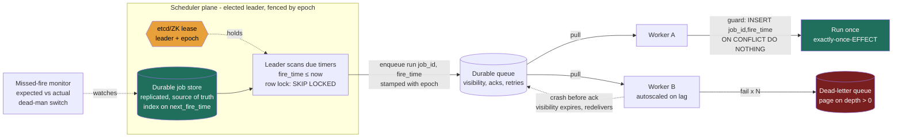
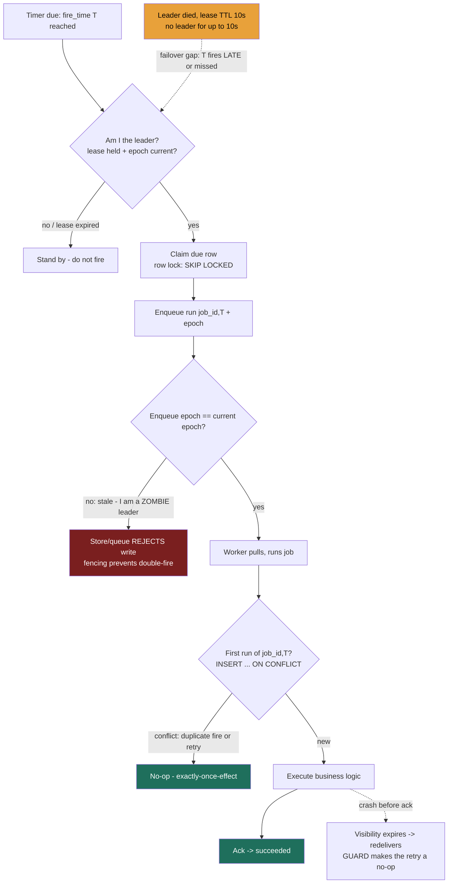

### Learning objectives
- Decompose a scheduler into two separable concerns, **deciding *when* a job is due** (the scheduler/timer) and **running it reliably** (the executor), routed through a durable queue so you **reuse the messaging-queue machinery** instead of re-deriving it.
- Reason precisely about the **two "once"s**: leader election dedupes *concurrent fires* but does **not** give exactly-once *firing*; workers run *at-least-once*; the net guarantee customers actually want, **exactly-once-effect**, is **at-least-once everywhere + idempotency keyed on `(job_id, scheduled_fire_time)`**.
- Choose a **scheduler topology**, single elected leader vs decentralized contention on a shared store vs partitioned/sharded, naming each rejected alternative's cost (failover gap, lock contention, rebalancing), and delegate consensus to **etcd/ZooKeeper** rather than rolling your own.
- Quantify the scheduler-specific failure modes: the **failover gap** vs lease TTL, the **thundering herd** at round cron times, and the **silent-miss** visibility problem a Director must monitor.

### Intuition first
A distributed scheduler is an **air-traffic control tower for a fleet of jobs.** Three things the tower does, and they're genuinely separate:

1. **The flight plan / clock.** Every flight (job) has a departure time, a fixed daily slot (`cron`) or a one-off ("depart in 40 minutes"). The tower keeps a board of *what is due next*, and the board is written in **permanent ink in a logbook bolted to the floor** (a durable store), not on a whiteboard. If the tower loses power and reboots, the scheduled flights must still be there; a scheduler that keeps timers only in memory loses every future job the instant it restarts, the cardinal sin.
2. **One controller on the radio at a time.** If two controllers clear the *same* flight for the *same* slot, you get two planes on the runway, a double-fire. So exactly one controller holds the microphone (the **leader**), chosen by an explicit election. But notice what the microphone does and doesn't buy: it stops two controllers clearing the same flight *simultaneously*. It does **not** guarantee every flight departs exactly once, if the controller faints mid-shift, flights due in that gap may never get cleared (a missed run), and a controller who thinks he's still on duty after being relieved can clear a flight the new controller *also* clears. Firing is a choice between *occasionally miss* and *occasionally double*.
3. **The ground crew that flies the plane.** Once cleared, real work happens, engine trouble, aborted takeoffs. That's *execution*: retries, backoff, and a hangar for planes that won't fly (the dead-letter queue). The tower doesn't fly planes; it hands a cleared flight to a **queue** and the crew owns the messy part.

Hold that split, **clock + microphone + ground crew**: a durable board, one elected controller, and at-least-once on both clearing *and* flying, so the only way to land each flight exactly once *in effect* is to **check the flight number before the plane leaves the gate** (idempotency on `(job_id, fire_time)`).

### Deep explanation

**Why a scheduler is its own building block.** "Run this later" sounds trivial, Unix `cron` on one box has done it since 1975. The block exists because at scale that single-box reflex fails on four axes at once: it's a **single point of failure**, has **no durability** beyond one disk, **cannot scale** past one machine's timers, and has **no visibility** into whether a job actually ran. Replace it and you inherit three of the hardest problems in distributed systems, durable state, leader election, and at-least-once delivery with idempotency, which is exactly why it's a favorite Director-level whiteboard. The requirements, precisely:

1. **Durability**, a job scheduled for next Tuesday fires next Tuesday even if every scheduler process is replaced twice before then. Timers live in a **replicated store, never only in RAM**.
2. **Correct firing**, each scheduled instant should fire (ideally) **exactly once**, on time: no concurrent double-fire, no silent miss.
3. **Reliable execution**, the work completes despite worker crashes, transient downstream failures, and poison payloads.
4. **Scale + visibility**, **100M+ live timers** firing at **tens of thousands per second**, and *proof* to on-call that a job that should have run did run (a missed job is **silent** by default, the worst kind of incident).

**The decomposition that makes it tractable, separate the scheduler from the executor.** The single most important architectural move, and the one that earns altitude points: **do not make the thing that knows the time also be the thing that does the work.** Split into:

- **The scheduler (timer plane):** its *only* job is to notice a job is **due** and move it from `scheduled` to **enqueued**. It owns the clock and the durable timer store. No business logic.
- **A durable queue (the seam):** the scheduler enqueues a "run this now" message (SQS/Kafka).
- **The executor (worker plane):** a stateless worker pool consumes the queue with **all the messaging-queue machinery**, visibility timeout, acks, retries, and a **dead-letter queue** for poison jobs.

Once a job is on the queue, "scheduled execution" **is** "queue consumption", a solved problem, and blast radius is isolated: a flood of slow jobs backs up in the queue and autoscales workers on lag; it does **not** stall the clock. **Rejected alternative:** a monolithic scheduler that fires *and* executes inline (what naive `cron` does). It couples timer accuracy to job duration, one slow 5-minute job blocks the next minute's fires, and gives you no independent scaling, no backpressure, no DLQ. Apache **Airflow** ships exactly this split (scheduler → executor → workers); naming it is the senior move.

**The durable job store, the board in permanent ink.** Two shapes of state: the **job definition** (the recurring rule, `job_id`, cron expression or one-shot timestamp, payload, retry policy; low write rate) and the **job instance** (one row per firing, `(job_id, scheduled_fire_time)`, status, attempt count; **high volume**, at 100M timers this is the table that must shard).

The hot operation is **"give me every job whose `next_fire_time ≤ now`."** The durable, replicated store is the **source of truth**, and the standard pattern is to **poll due timers on a 1-5 s tick with a row lock (the SKIP LOCKED pattern)**, multiple schedulers can share the table without double-claiming, at the cost of up-to-a-tick firing latency. Any in-memory structure, a Redis sorted set, or a hierarchical timing wheel at Kafka-scale timer volume, is only a **hot index over the durable table**, rebuilt on restart. "We'll keep all timers in Redis" is the cache-as-database anti-pattern.

<details>
<summary>Go deeper, the due-timer query and the index structures (IC depth, optional)</summary>

The relational poll, which Airflow and Quartz both build on:

```sql
SELECT * FROM job_instances
WHERE  next_fire_time <= now() AND status = 'scheduled'
ORDER  BY next_fire_time
FOR UPDATE SKIP LOCKED
LIMIT  :batch;
```

`FOR UPDATE` locks the claimed rows; `SKIP LOCKED` makes a competing scheduler skip rows another has locked instead of blocking on them, this is how Airflow 2.0 runs **multiple active HA schedulers** against one metadata DB. The clause is load-bearing: MySQL 5.x and pre-10.6 MariaDB lack it, so HA scheduling there is unsupported.

| Structure | Due-set lookup | Durable? | Scale | Use when… |
|---|---|---|---|---|
| **Relational time-index + poll** | O(log N) B-tree scan per tick | **yes**, system of record | millions of rows; capped by poll/lock throughput | durability + transactions first; ~tick firing latency acceptable |
| **Redis ZSET** (`ZRANGEBYSCORE timers -inf <now>`) | O(log N + M) | no, AP, async-replica loss window | very high, in-memory | hot index over a durable store; sub-second due-set |
| **Hierarchical timing wheel** | **O(1)** insert + tick | no, rebuild from store on restart | extreme (Kafka's millions of delayed-op timers) | huge volumes of in-flight short timers |

</details>

**Leader election, one controller on the radio.** If every scheduler replica independently scanned the store and fired every due job, each job fires *R* times for *R* replicas. The classic fix is **single-leader**: elect one active firer by delegating to a **consensus system** (etcd, ZooKeeper, Consul) via a **lease**: candidates race to acquire a lease key with a TTL; the holder is leader and renews it; on expiry a standby takes over. Never build election yourself. Two hazards transfer straight from leader-election:

- **The failover gap.** A leader dies; for up to the lease TTL, say **10 s**, *no one* is leader, and jobs due in that window fire **late or not at all**. Shorten the TTL and you risk **false failovers** (a GC pause looks like death). Too tight = flapping, too loose = long unavailability, you **cannot** make firing exactly-once-on-time across a leader death; you only choose the gap length.
- **The zombie leader (split-brain).** A paused leader can wake after its lease expired, still believing it leads, and fire jobs the new leader also fires. The principle, stated once: **epoch fencing makes a stale leader's writes rejectable**, every lease carries a monotonically increasing epoch, and the durable store refuses any claim/enqueue stamped with a stale one (fencing tokens, applied to the scheduler).

So leader election buys **no *concurrent* double-fire, and that's all it buys.** It prevents neither missed fires (the gap) nor, without fencing, handoff double-fires. Assuming "I elected a leader, therefore exactly-once firing" is the single most common altitude miss here, the direct analogue of the messaging-queue "exactly-once delivery is a checkbox."

<details>
<summary>Go deeper, the zombie-leader handoff, step by step (IC depth, optional)</summary>

1. Leader A holds the lease with **epoch 7** and stamps every claim/enqueue with it.
2. A hits a 30 s GC pause. Its lease (TTL 10 s) expires; B wins the election and the lease now carries **epoch 8**.
3. B starts firing due jobs, stamped epoch 8.
4. A wakes, still believing it's leader, and tries to claim/enqueue a job stamped epoch 7.
5. The store enforces a **conditional write / compare-and-set on the epoch**, "apply only IF current_epoch = 7." The current epoch is 8, so the CAS **fails**, A's write is refused, and A learns it was deposed and steps down.

The CAS lives in the *store*, not the queue, a vanilla queue like SQS won't fence by token on its own, so the claim row (or an outbox table) is where the epoch check happens. Same conditional-write machinery as quorum writes and Dynamo-style stores.

</details>

**The decentralized alternative, contention on the shared store.** Single-leader has a ceiling (one node scans and fires everything) and a built-in availability hole (the failover gap). The alternative is **no dedicated leader**: many active schedulers contend per-job on the durable store, each claiming due rows with the SKIP LOCKED pattern so the lock winner fires and the rest skip past, this is how Quartz clustering and Airflow 2.0's HA scheduler work. The trade is explicit: decentralized contention **eliminates the failover gap and the single-node ceiling** but makes the **store's lock throughput the new bottleneck** at very high fire rates. **Rejected vs single-leader:** single-leader is simpler to reason about but a SPOF with a failover gap. Pick based on whether your pain is *availability* (decentralize) or *lock contention at extreme scale* (partition, next).

**Partitioning the timer space, scaling past one store.** When 100M timers fire faster than a single store's lock/scan throughput, **shard the job space**: partition `job_id` across *P* shards (consistent hashing, adding a shard remaps only ~1/P of jobs), and scheduler *i* exclusively scans and fires shard *i*, with a lightweight **per-shard lease** so two schedulers never both own a shard. 10 shards → 10× fire throughput. The cost to name: **rebalancing on churn**, a dead scheduler's shards must be reassigned, each with a mini failover gap during handoff. Same "ownership per key, parallelism across keys" pattern as queue partitioning and Dynamo's ring. **Rejected alternative:** one global store for everything, simplest, but its lock/scan throughput is a hard ceiling no added scheduler node can exceed.

**Execution: at-least-once + the exactly-once-effect (the thesis).** The scheduler has enqueued "run job J for fire-time T." Execution is the consumer side of the messaging queue and inherits its iron law: **at-least-once delivery, duplicates guaranteed**, a worker can finish the job and crash before acking; the message redelivers; the job runs twice. Firing is *also* at-least-once if you catch up missed fires (and can double across a zombie handoff without fencing), **two independent sources of duplication.** The only guarantee that survives both, and the only one customers ever actually mean by "exactly-once," is **exactly-once-*effect***:

> **At-least-once everywhere + idempotency keyed on `(job_id, scheduled_fire_time)`.**

The **composite key is the entire trick**, and the scheduled instant *must* be in it. Key on `job_id` alone and a retry of the 09:00 run dedupes correctly, but so does the *legitimate* 10:00 recurrence, which you'd **silently suppress**. Key on a fresh random id per attempt and every retry looks new, you **double-run**. Keying on `(job_id, fire_time)` collapses the 09:00 firing and all its retries to **one** effect while 10:00 stays a distinct execution. Concretely, the worker's first act is an idempotent guard, `INSERT INTO job_runs (job_id, fire_time) … ON CONFLICT DO NOTHING`. This is the messaging-queue "effectively-once via a dedupe key," specialized: **the scheduled time is what distinguishes a retry from a recurrence.** That sentence is the highest-signal thing you can say in this interview.

**The firing choice, made explicit: at-least-once vs at-most-once firing.** Because the failover gap can cause missed fires, you choose how the scheduler behaves when it discovers a fire it slept through:

- **At-least-once firing (catch-up):** on recovery, fire every timer whose `fire_time` passed but never enqueued. No missed run; **costs duplicates**, which is fine, because idempotency on `(job_id, fire_time)` absorbs them. The default, and the right default, for jobs that must run (billing, reports).
- **At-most-once firing (skip):** on recovery, skip what you missed. No duplicate fire; **costs missed runs.** Correct only when a stale run is worse than no run, "send the *current* price every minute"; a 5-minute-old price is useless. (Kubernetes CronJob exposes exactly this policy knob, and deliberately refuses to stampede through a large backlog of missed schedules.)

The Director-altitude statement: *"Firing and execution are both at-least-once, so I make the worker idempotent on `(job_id, fire_time)` for exactly-once-*effect*. I default to catch-up firing for must-run jobs and skip-on-recovery only when a stale run is worthless, and I fence the leader with epochs so a zombie can't double-fire across a handoff."* That paragraph hits durability, the two "once"s, the idempotency key, the firing policy, and split-brain, the whole lesson.

**Retries, backoff, and the thundering herd.** Between retries, execution retries and re-fire attempts on a down dependency alike, use **exponential backoff with jitter**; one line, that's the policy. The scheduler-specific failure is the **thundering herd, and you must quantify it.** Humans write round cron times (`0 0 * * *`), so timers cluster massively at those instants. Suppose **10M daily jobs** and **30%** set to midnight UTC → **3M jobs due at 00:00:00** against a fleet sustaining **50k/s**: they enqueue at once and take **3M ÷ 50k ≈ 60 s** to drain, a daily latency spike and a synchronized load spike on every downstream. The fix is **jitter / a fire window**: smear each job's actual fire across a window (hash `job_id` into an offset within, say, 5 minutes), so 3M fires spread across ~300 s at **~10k/s** instead of a 60-second wall. A pure Director cost/risk call, a few minutes of fire imprecision for a flat load curve and a smaller fleet, and the gem that signals you've actually operated a scheduler.

**Visibility, the silent-miss problem (the operational point a Director owns).** A queue that backs up is *loud* (lag climbs, you alarm). A scheduler that **fails to fire** is **silent**, nothing happens, and "nothing happened" raises no alarm by default. So:

- **Missed-fire alerting:** track `expected_fire_time` vs `actual_enqueue_time` per job; alarm when a job is overdue. For critical jobs, a **dead-man's switch**: the job pings a watchdog on success, and the watchdog **pages if the ping doesn't arrive** by `fire_time + grace`, this catches "the scheduler never even tried."
- **Stuck-run detection:** a job stuck in `running` past its expected duration (worker died mid-job) needs a timeout → DLQ → page, exactly as the messaging-queue visibility timeout handles a dead consumer.
- **Execution lag** as a first-class metric, workers autoscaled on queue lag, and `DLQ depth > 0` as a paging signal.

The framing: *a missed batch job is discovered by the customer, not the alarm, unless you build the alarm.* Naming that is the on-call/risk signal interviewers want from a Director.

### Diagram: the scheduler / executor split with the durable store and queue


### Diagram: fire/claim/execute timeline, with the crash and zombie-leader branches

The happy path is plain: leader claims, enqueues, worker runs once. The three danger branches are the whole lesson, the **failover gap** (amber) makes a fire late or missed; the **zombie-leader** branch (red) is stopped only by **epoch fencing**; and the duplicate-execution branch is rendered harmless by the **idempotency guard on `(job_id, T)`** (green), which is why exactly-once-effect survives at-least-once on both sides.

### Worked example: a notifications / billing scheduler (100M timers)
A product needs two scheduled workloads on one platform: **(a)** user-set **one-shot reminders** ("remind me in 2 hours") at ~**100M live timers**, and **(b)** a **recurring nightly billing run** per account, ~**2M accounts**, all naturally wanting midnight. At building-block altitude:

- **Durable store, sharded.** Job instances `(job_id, fire_time, status, attempt)` live in a **replicated relational store** sharded by `job_id` (or DynamoDB with `fire_time` in the sort key), say **16 shards**, ~6M timers each, independently scanned. The store is the **source of truth**; a Redis ZSET per shard is an optional hot index rebuilt on restart, never the only copy.
- **Scheduler topology.** **Partitioned scheduling**: one scheduler owns each shard (consistent hashing) via a **per-shard lease in etcd**, polling due timers on a 2 s tick with the SKIP LOCKED pattern. This eliminates the single-leader ceiling (16× scan throughput) and confines a failover to one shard. **Rejected alternative:** a single global leader, simpler, but its throughput caps the platform and its failover gap stalls *all* firing, not 1/16th.
- **Firing → queue → execution.** A due timer enqueues `run(job_id, fire_time)` (stamped with the lease **epoch**) onto **SQS**; stateless workers consume with visibility timeout ≈ p99 job time × 4, 5 retry attempts, backoff + jitter, and a **DLQ** paged on depth > 0. The reminder worker is **idempotent on `(job_id, fire_time)`** via a unique constraint, so a redelivery after a lost ack does not send the push twice.
- **The billing thundering herd, quantified.** 2M nightly jobs at `0 0 * * *` against a **50k/s** fleet would drain in **40 s**, a nightly spike that also stampedes the payment gateway. Fix: **smear** each account's fire across a **30-minute window** by hashing `account_id` → offset: 2M fires at **~1,100/s** instead of a 40-second wall. We trade ±30 min of billing-time imprecision (irrelevant, the *date* is what matters) for a flat load curve and far smaller fleet and gateway capacity. **Rejected alternative:** provision for the 40-second peak, multiples of idle capacity the other 86,360 seconds of the day.
- **The exactly-once-effect, stated.** Both firing (catch-up after a gap) and execution (queue redelivery) are at-least-once. A billing run that fires twice **must not double-charge**: the worker's first act is `INSERT INTO billing_runs(account_id, billing_date) ON CONFLICT DO NOTHING`, keyed on the **scheduled date**, the retry is a no-op while tomorrow's run is a distinct row. Exactly-once *firing* across a leader death does not exist.
- **Visibility.** A **dead-man's switch** per account: if `billing_runs` has no row by `midnight + 2 h`, page, a *missed* billing run is silent and would otherwise be discovered by a customer or finance days later. This is the line that separates a Director answer from an IC one.

### Trade-offs table: scheduler topology (where leader election lives)
| Topology | How "fire once" is enforced | Scales by | Failover gap | Rejected vs… (cost) | Use when… |
|---|---|---|---|---|---|
| **Single elected leader** (etcd/ZK lease + epoch) | one leader fires; standbys idle | vertical only (one firer) | **yes**, lease TTL (e.g. 10 s) of no-fire on leader death | decentralized: simpler, but a SPOF + built-in failover gap | Modest scale; simplest correct design; one place to reason about firing |
| **Decentralized contention on shared store** (Quartz cluster, Airflow 2.0 HA) | nodes race for the row lock (SKIP LOCKED); winner fires | add scheduler nodes (until the **store's lock** saturates) | **none**, no single leader to lose | single-leader: no SPOF, but the **shared lock becomes the contention point** at high fire rates | High availability matters; fire rate within one store's lock throughput |
| **Partitioned / sharded by job_id** (consistent hashing, per-shard lease) | per-shard owner fires its slice; no cross-shard contention | **horizontal**, add shards (≈linear) | per-shard only (1/P of timers during a reassign) | global store: removes the throughput ceiling, but adds **rebalancing on churn** | 100M+ timers / tens-of-k fires/s; must scale past one store |

### What interviewers probe here
- **"How do you guarantee a job runs exactly once?"**, *Strong:* "Exactly-once *firing* doesn't exist, a failover gap can miss, a zombie leader can double. Both firing and execution are **at-least-once**; I make the worker **idempotent on `(job_id, scheduled_fire_time)`** for exactly-once-*effect*, the fire-time is *in* the key so a retry dedupes but the next recurrence doesn't." *Red flag:* "I elect a leader, so it fires exactly once", the exactly-once-delivery checkbox fallacy, and missing that there are *two* duplicate sources.
- **"The scheduler leader dies, what happens to jobs due in that window?"**, *Strong:* names the **failover gap** = lease TTL of no-fire; a standby acquires the lease and (with catch-up firing) re-fires the missed window, absorbed by idempotency; tunes TTL against false-failover risk; **fences with epochs** so the old leader can't double-fire on wake-up. *Red flag:* assumes failover is instant and lossless.
- **"How do you scale past one scheduler node / one store?"**, *Strong:* **partition the timer space** by `job_id` (consistent hashing) so each scheduler owns a shard, naming **rebalancing on churn** as the cost; knows the decentralized-contention option and that the **shared lock** is its ceiling. *Red flag:* "add more scheduler instances" with no story for double-firing or the lock bottleneck.
- **"Everything is scheduled for midnight, what breaks?"**, *Strong:* **thundering herd**; quantifies the backlog (3M fires ÷ 50k/s ≈ 60 s) and **smears with jitter**, trading fire precision for a flat load curve and a smaller fleet. *Red flag:* "we'll scale the workers" with no numbers and no jitter.
- **"A nightly job silently didn't run. How would you have caught it?"**, *Strong:* a **missed-fire monitor** plus a **dead-man's switch** for critical jobs, a missed run is *silent* and must be alarmed proactively. *Red flag:* relies on logs/luck; no observability for non-events.
- **"Where do you keep the timers?"**, *Strong:* **durable replicated store as source of truth**; an in-memory index (ZSET / timing wheel) only as an acceleration layer rebuilt on restart. *Red flag:* in-memory timers, or Redis as the sole record (async-replica loss window).

### Common mistakes / misconceptions
- **"Leader election gives exactly-once firing."** It prevents *concurrent* double-fire, nothing more. Failover gaps miss; and without **epoch fencing**, a paused-then-resumed zombie leader double-fires across the handoff.
- **Keying idempotency on `job_id` alone** (suppresses legitimate recurrences) **or a fresh id per attempt** (double-runs on retry). The key must be `(job_id, scheduled_fire_time)`.
- **In-memory or Redis-only timers**, a restart or async-replica loss drops future jobs; the durable store is the source of truth.
- **Coupling firing to execution** (monolithic `cron`-style), one slow job blocks the next minute's fires; no independent scaling, backpressure, or DLQ. Split scheduler from executor via a queue.
- **Ignoring the two operational blind spots**, the midnight thundering herd (quantify it, smear with jitter) and the silent miss (a job that *didn't* run raises no alarm; build the dead-man's switch).

### Practice questions
**Q1.** A teammate says "we'll elect a leader scheduler, so each job fires exactly once." Pressure-test that at the whiteboard.
> *Model:* Election only prevents two schedulers firing the same job *simultaneously*. Two gaps remain: (1) the **failover window**, for up to the lease TTL no one fires, so jobs due then are late or missed; (2) a **zombie leader** that paused, lost its lease, and resumed will double-fire unless every enqueue is **fenced with a monotonic epoch** the store rejects when stale. So firing is at-least-once at best, and execution is also at-least-once. The real guarantee is **exactly-once-*effect***: an idempotent guard on `(job_id, scheduled_fire_time)`, `INSERT … ON CONFLICT DO NOTHING`, so duplicates from either source collapse to one effect while the next recurrence (a different `fire_time`) still runs.

**Q2.** Design the firing path for 100M live timers at ~tens-of-thousands of fires/sec. Where's the bottleneck and how do you scale it?
> *Model:* Timers in a **durable, replicated store** (sharded by `job_id`), the source of truth; an in-memory ZSET/timing-wheel index accelerates the due-now lookup and is rebuilt on restart. A **single leader scanning everything** is the bottleneck, one node's scan/lock throughput caps the platform and its failover gap stalls all firing. So **partition the timer space**: shard `job_id` across *P* shards via consistent hashing, give each shard an etcd **lease**, and have each owner poll its shard with the SKIP LOCKED pattern. Throughput scales ~linearly in *P*; a failure affects only 1/P of timers. The cost to name: **rebalancing on churn**, with a brief per-shard gap during handoff. Firing enqueues onto a durable queue; stateless workers execute, autoscaled on lag.

**Q3.** Most jobs are scheduled for `0 0 * * *`. Walk me through what happens at midnight and how you'd fix it.
> *Model:* **Thundering herd.** Say 10M daily jobs, 30% at midnight UTC → **3M fires at 00:00:00** against a fleet sustaining **50k/s**, a **~60 s** drain, a daily latency spike, and a synchronized load spike on every downstream (DB, payment gateway, email). Fix: **jitter / a fire window**, hash `job_id` into an offset within, say, 5 minutes, smearing 3M fires across ~300 s at **~10k/s**. For most scheduled work the exact second is irrelevant (a report cares about the *date*), so I trade minutes of fire imprecision for a **flat load curve and a smaller fleet**, versus provisioning everything for a 60-second peak that sits idle the rest of the day.

**Q4.** When would you choose **at-most-once firing** (skip missed runs) over **at-least-once firing** (catch up)? Give a concrete example of each.
> *Model:* **Catch-up** when the run *must happen* and a late run still carries value, billing, reports, pipelines: if a failover gap missed the nightly billing fire, the recovered leader fires it late, and idempotency on `(account_id, billing_date)` makes any duplicate a no-op. **Skip** when a *stale* run is worse than no run, "emit the current price every minute": a 5-minute-old price is misleading, so resume from now. Kubernetes CronJob exposes exactly this knob and deliberately refuses to stampede through a big backlog of missed schedules. The decision is pure requirements: does a delayed run still carry value (catch up) or is freshness the point (skip)?

**Q5.** How do you detect that a scheduled job *failed to fire at all*, not that it ran and errored, but that it silently never ran?
> *Model:* The **silent-miss** problem, "nothing happened" raises no alarm, so build *proactive* observability. (1) A **missed-fire monitor**: compare `expected_fire_time` to `actual_enqueue_time` per job and alarm when overdue. (2) For critical jobs, a **dead-man's switch**: the job pings a watchdog on success; the watchdog **pages if the ping doesn't arrive** by `fire_time + grace`, stronger, because it fires even if the scheduler never tried (it's down entirely). Pair with `DLQ depth > 0` paging and **stuck-run detection** (a run in `running` past its expected duration). The Director framing: a missed batch job is otherwise discovered by the customer or finance days later, building the alarm for the *non-event* is the on-call discipline.

### Key takeaways
- **Split the scheduler from the executor** via a durable queue: the scheduler only moves a due job `scheduled → enqueued`; the queue + stateless workers own execution (retries, backoff, DLQ). This isolates blast radius and reuses, not rebuilds, the delivery machinery, Airflow's scheduler/executor/worker split is this shape.
- **Timers live in a durable, replicated store as the source of truth**, never RAM-only or Redis-only. An in-memory ZSET or timing wheel is an acceleration **index** rebuilt on restart; the hot operation is polling due timers with a row lock (SKIP LOCKED pattern).
- **Leader election (delegated to etcd/ZooKeeper) prevents *concurrent* double-fire, and nothing more.** A failover gap (≈ lease TTL) can miss fires; **epoch fencing makes a stale leader's writes rejectable**. Firing is therefore a choice: **at-least-once (catch up)** vs **at-most-once (skip)**.
- **Exactly-once-*effect* = at-least-once everywhere + idempotency keyed on `(job_id, scheduled_fire_time)`.** The scheduled instant must be *in* the key, a retry dedupes against its own firing while the next recurrence is a distinct execution. Exactly-once *firing* across a leader death does not exist.
- **Scale by partitioning the timer space** (consistent hashing by `job_id`, cost: rebalancing on churn); **quantify the thundering herd** at round cron times and **smear with jitter**; and **monitor for silent misses** (dead-man's switch), because a job that *didn't* fire raises no alarm by itself.

> **Spaced-repetition recap:** Air-traffic tower, board in permanent ink (durable store, never RAM-only), one controller on the radio (leader via etcd lease, fenced by epoch so a zombie can't double-clear), ground crew flies the plane (queue + workers). Leader election stops *concurrent* double-fires only; failover gaps miss, handoffs double, so the real guarantee is **exactly-once-*effect* = idempotency on `(job_id, fire_time)`**. Partition by job_id to scale, jitter the midnight herd, and add a dead-man's switch because a missed job is silent.
