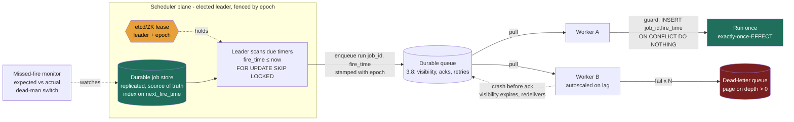
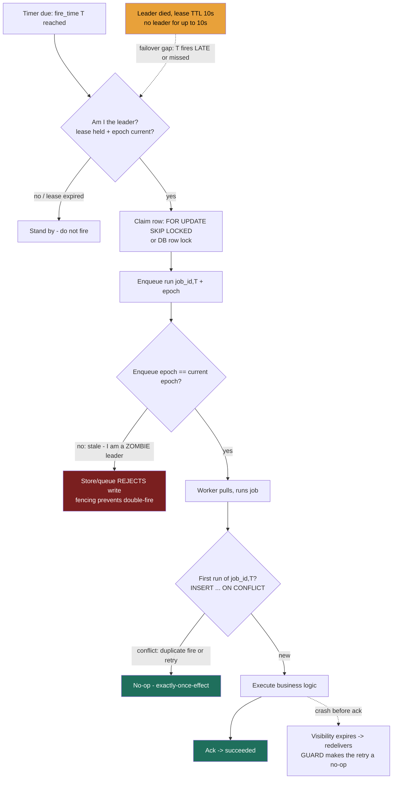

### Learning objectives
- Decompose a scheduler into two separable concerns — **deciding *when* a job is due** (the scheduler/timer) and **running it reliably** (the executor) — and route execution through a durable queue so you **reuse the messaging-queue machinery** (Lesson 3.8) instead of re-deriving it.
- Reason precisely about the **two "once"s**: leader election dedupes *concurrent fires* but does **not** give exactly-once *firing*; workers run *at-least-once*; the net guarantee customers actually want — **exactly-once-effect** — is **at-least-once everywhere + idempotency keyed on `(job_id, scheduled_fire_time)`**.
- Choose a **scheduler topology** — single elected leader vs decentralized contention on a shared store vs partitioned/sharded — and name the rejected alternative's cost (failover gap, lock contention, rebalancing) for each, delegating consensus to **etcd/ZooKeeper** rather than rolling your own.
- Quantify the scheduler-specific failure modes: the **failover gap** vs lease TTL, the **thundering herd** at round cron times, and the **silent-miss** visibility problem a Director must monitor.

### Intuition first
A distributed scheduler is an **air-traffic control tower for a fleet of jobs.** Three jobs the tower does, and they're genuinely separate:

1. **The flight plan / clock.** Every flight (job) has a departure time — a fixed daily slot (`cron`: "depart 09:00 every day") or a one-off ("depart once, 40 minutes from now"). The tower keeps a board of *what is due next* and watches the clock. Crucially, the board is written in **permanent ink in a logbook bolted to the floor** (a durable store), not on a whiteboard — because if the tower loses power and reboots, the flights that were scheduled must still be there. A scheduler that keeps its timers only in memory loses every future job the instant it restarts; that's the cardinal sin.
2. **One controller talking on the radio at a time.** If two controllers both clear the *same* flight for the *same* slot, you get two planes on the runway — a double-fire. So exactly one controller holds the microphone (the **leader**), chosen by an explicit election. But notice what the microphone does and doesn't buy you: it stops *two* controllers clearing the same flight *simultaneously*. It does **not** guarantee every flight departs exactly once — if the controller faints mid-shift, some flights in that gap may **never get cleared** (a missed run), and a confused controller who thinks he's still on duty after being relieved might clear a flight the new controller *also* clears (a double-fire across the handoff). Firing, it turns out, is a choice between *occasionally miss* and *occasionally double*.
3. **The ground crew that actually flies the plane.** Once a flight is cleared, real work happens — and planes have engine trouble, abort takeoff, and go around. That's *execution*: retries, backoff, and a hangar for planes that simply won't fly (the dead-letter queue). The tower doesn't fly planes; it hands a cleared flight to the crew (a **queue**) and the crew owns the messy part.

Hold that split — **clock + microphone + ground crew**. The whole lesson is: write the board in permanent ink (durable store), give the microphone to exactly one controller via a real election (leader election → consensus), and accept that both clearing *and* flying are **at-least-once**, so the only way to land each flight exactly once *in effect* is to **check the flight number before the plane leaves the gate** (idempotency on `(job_id, fire_time)`).

### Deep explanation

**Why a scheduler is its own building block.** "Run this later" and "run this every night" sound trivial — Unix `cron` on one box has done it since 1975. The block exists because at scale that single-box reflex fails on four axes at once: it's a **single point of failure** (the box dies, nothing fires), it has **no durability** beyond that box's disk, it **cannot scale** past one machine's timer capacity, and it has **no visibility** into whether a job actually ran. Replace it and you immediately inherit the three hardest problems in distributed systems — durable state, leader election, and at-least-once delivery with idempotency — which is exactly why it's a favorite Director-level whiteboard. State the requirements precisely:

1. **Durability** — a scheduled job must survive a process restart, a node loss, and an AZ outage. If a customer schedules a reminder for next Tuesday, it fires next Tuesday even if every scheduler process is replaced twice before then. Timers live in a **replicated store**, never only in RAM.
2. **Correct firing** — each scheduled instant should fire (ideally) **exactly once**, on time, with no concurrent double-fire and no silent miss.
3. **Reliable execution** — the job's actual work completes despite worker crashes, transient downstream failures, and poison payloads.
4. **Scale + visibility** — handle **100M+ live timers** firing at **tens of thousands per second**, and *prove* to on-call that a job that should have run did run (a missed job is **silent** by default — the worst kind of incident).

**The decomposition that makes it tractable — separate the scheduler from the executor.** The single most important architectural move, and the one that earns altitude points: **do not make the thing that knows the time also be the thing that does the work.** Split into:

- **The scheduler (timer plane):** its *only* job is to notice that a job is **due** and move it from `scheduled` to **enqueued**. It owns the clock and the durable timer store. It does no business logic.
- **A durable queue (the seam):** the scheduler enqueues a "run this now" message (SQS/Kafka/RabbitMQ — Lesson 3.8).
- **The executor (worker plane):** a stateless worker pool consumes the queue and runs the job, with **all of 3.8's machinery** — visibility timeout, acks, retries with exponential backoff + jitter, and a **dead-letter queue** for poison jobs.

This decomposition is why the lesson can *reference* 3.8 rather than rebuild it: once a job is on the queue, "scheduled execution" **is** "queue consumption," a solved problem. It also isolates blast radius — a flood of slow jobs backs up in the queue and autoscales workers on lag; it does **not** stall the clock. **Rejected alternative:** a monolithic scheduler that fires *and* executes inline (what naive `cron` does). It couples timer accuracy to job duration — one slow 5-minute job blocks the next minute's fires — and gives you no independent scaling, no backpressure, and no DLQ. Apache **Airflow** ships exactly this split: a **scheduler** decides what's runnable, an **executor** (Celery/Kubernetes) hands tasks to **workers**. Naming the split is the senior move.

**The durable job store — the board in permanent ink.** Two shapes of state and a "find what's due" access pattern:

- **Job definition** (the recurring rule): `job_id`, schedule (`cron` expr or one-shot timestamp), payload, owner, retry policy. Low write rate, read on every scan.
- **Job instance / run** (a single scheduled firing): `(job_id, scheduled_fire_time)`, `status` (`scheduled → enqueued → running → succeeded/failed`), `attempt_count`. **High volume — one row per firing per job.** At 100M timers this is the table that must shard.

The hot operation is **"give me every job whose `next_fire_time ≤ now`."** Three ways to answer it, and the choice is a real trade (full table in the second trade-offs table):

- **Relational time-index + poll.** Put a B-tree index on `next_fire_time`; a scheduler polls `SELECT … WHERE next_fire_time ≤ now() AND status = 'scheduled' … FOR UPDATE SKIP LOCKED LIMIT N` every *tick* (say every 1–5 s). Simple, durable, transactional, and the `FOR UPDATE SKIP LOCKED` is how multiple schedulers safely *share* the table without double-claiming a row. Cost: **polling latency** (a job due at 09:00:00.3 fires on the next tick, up to ~5 s late) and **scan cost** at high row counts. This is what Airflow and Quartz do.
- **Redis sorted set (ZSET).** Store timers as members scored by `fire_time`; `ZRANGEBYSCORE timers -inf <now>` returns the due set in **O(log N + M)**, then atomically move them to an in-flight set. Very low latency, very high throughput — but Redis is **AP-leaning, not a durable system of record** (Lesson 3.7): async replication can lose a just-written timer, so you back it with a durable store or accept a small loss window. Great as a hot **index over** the durable table, dangerous as the *only* copy.
- **Hierarchical timing wheel.** A clock-hand-over-buckets structure giving **O(1)** insert and tick — the data structure Kafka uses for its millions of in-flight delayed operations (request timeouts, delayed produce). Unbeatable at extreme timer counts, but it's an **in-memory index** you must rebuild from the durable store on restart, and it's overkill unless you're at Kafka-scale timer volume.

The Director read: the durable store is the **source of truth**; the ZSET or timing wheel is an **in-memory acceleration index** you rebuild on startup. Conflating the two — "we'll keep all timers in Redis" — is the same anti-pattern as treating a cache as a database (3.7).

**Leader election — one controller on the radio (callback to consensus).** If every scheduler replica independently scanned the store and fired every due job, each job fires *R* times for *R* replicas. The classic fix is **single-leader**: elect one scheduler as the active firer; the rest stand by. Election is **not something you build** — you delegate it to a **consensus system** (etcd, ZooKeeper, Consul) via a **lease/lock**: candidates race to acquire a lease key with a TTL; the holder is leader and **renews** the lease (a heartbeat); if it dies, the lease **expires** and a standby acquires it. This is precisely the split-brain/fencing machinery from Lesson 2.4 — and the two hazards transfer exactly:

- **The failover gap.** A leader dies. Its lease has a TTL — say **10 s**. For up to those 10 s, *no one* is leader, so any jobs due in that window are **not fired on time** (they fire late once the new leader catches up, or are missed if you don't catch up). Shorten the TTL and the gap shrinks, but you risk **false failovers** (a brief GC pause looks like death and triggers an unnecessary election). This is the same timeout-tuning trade as replica failover (2.4): too tight = flapping, too loose = long unavailability. You **cannot** make firing exactly-once-on-time across a leader death; you choose the gap length.
- **The zombie leader (split-brain) → fence with epochs.** A leader pauses (long GC, network blip), its lease expires, a new leader is elected — then the old one wakes up *still believing it's leader* and fires jobs the new leader also fires. The fix is **fencing tokens**: every lease carries a monotonically increasing **epoch**, and the **durable store rejects** any claim/enqueue stamped with a stale epoch — enforced as a **conditional write / compare-and-set on the epoch** (the same CAS machinery as 2.8/3.4: "fire this only IF current_epoch = mine"), since a vanilla queue like SQS won't fence by token on its own. Without fencing, a zombie leader double-fires; with it, the zombie's claim fails the CAS and its write is refused. This is the exact mechanism 2.4 prescribes for split-brain, applied to the scheduler.

So leader election buys you **no *concurrent* double-fire** — and that's *all* it buys. It does not prevent missed fires (failover gap) or, without fencing, handoff double-fires. **State that boundary explicitly**; assuming "I elected a leader, therefore exactly-once firing" is the single most common altitude miss here, and it's the *direct analogue* of "exactly-once delivery is a checkbox" from 3.8.

**The decentralized alternative — contention on the shared store.** Single-leader has a ceiling: one node does all the scanning and firing, so timer throughput is capped by one machine, and the failover gap is a built-in availability hole. The alternative is **no dedicated leader** — run *many* active schedulers that **contend per-job on the durable store**:

- **Quartz (JDBC-JobStore clustering):** every node shares one database; when a trigger is due, nodes race to acquire a **row lock** on it, and **only the node that wins the lock fires it** — exactly one fire per trigger, no separate election process. Missed fires (node was down at fire time) are handled by a **misfire policy** (default threshold **60 s** — past that the trigger is "misfired" and the policy decides whether to fire-now or skip), and an in-flight job whose node hard-crashes is re-run on restart **only if `requestsRecovery = true`**.
- **Airflow 2.0 HA scheduler:** runs **multiple active schedulers** simultaneously, coordinating through the metadata DB's critical section with **`SELECT … FOR UPDATE SKIP LOCKED`** — each scheduler grabs a disjoint set of runnable tasks and skips rows another scheduler has locked. (`SKIP LOCKED` is **load-bearing**: MySQL 5.x and pre-10.6 MariaDB lack it, so HA scheduling there is unsupported and deadlocks.) This removes the SPOF *and* the failover gap of the single-leader 1.x design — there's no "the scheduler" to lose.

The trade is explicit: decentralized contention **eliminates the failover gap and the single-node ceiling** but makes the **shared store's lock the contention point** — at very high fire rates, every scheduler hammering `FOR UPDATE` on the same hot rows becomes the bottleneck, and you've moved the scaling limit from "one leader's CPU" to "the database's lock throughput." **Rejected vs single-leader:** simpler to reason about (one firer, no lock storms) but a SPOF with a failover gap. You pick based on whether your pain is *availability* (go decentralized) or *lock contention at extreme scale* (consider partitioning, next).

**Partitioning the timer space — scaling past one store.** When 100M timers fire faster than a single store's lock/scan throughput, **shard the job space** so each scheduler owns a slice and there's *no* cross-shard contention. Partition `job_id` across *P* shards (consistent hashing — Lesson 2.6 — so adding a shard remaps only `~1/P` of jobs, not all of them); scheduler *i* exclusively scans and fires shard *i*'s timers. This is horizontal scale-out: 10 shards → 10× the fire throughput, each shard independently scanned. The costs you must name: **rebalancing on churn** (a scheduler dies → its shards must be reassigned, and during reassignment those shards have a mini failover gap), and you still want a lightweight leader/lease **per shard** so two schedulers don't both own shard *i*. This is the same "ordering/ownership per key, parallelism across keys" pattern as queue partitioning (3.8) and Dynamo's ring (3.4) — partition for parallelism, accept rebalancing cost. **Rejected alternative:** a single global store for everything — simplest, but its lock/scan throughput is a hard ceiling you cannot exceed by adding scheduler nodes.

**Execution: at-least-once + the exactly-once-effect (the thesis).** Now the seam. The scheduler has enqueued a "run job J for fire-time T" message. Execution is the consumer side of 3.8, so it inherits 3.8's iron law: **at-least-once delivery, duplicates guaranteed.** A worker can finish the job and crash *before* acking; the visibility timeout expires; the message redelivers; the job runs **twice**. Layer that on top of the *firing* side, which is *also* at-least-once if you choose "catch up missed fires" (and can double-fire across a zombie-leader handoff without fencing), and you have **two** independent sources of duplication. The only guarantee that survives both — and the only one customers ever actually mean by "exactly-once" — is **exactly-once-*effect***, achieved by:

> **At-least-once everywhere + idempotency keyed on `(job_id, scheduled_fire_time)`.**

The **composite key is the entire trick**, and the scheduled instant *must* be in it. Use `job_id` alone and a retry of the 09:00 run dedupes correctly — but so does the *legitimate* 10:00 recurrence of the same daily job, which you'd **silently suppress**. Use a fresh random key per attempt and every retry looks new, so you **double-run**. Keying on `(job_id, fire_time)` means: the 09:00 firing and all its retries collapse to **one** effect, while 10:00 is a **distinct** execution. Concretely, the worker's first action is an idempotent guard — `INSERT INTO job_runs (job_id, fire_time) … ON CONFLICT DO NOTHING`, or a unique constraint on `(job_id, fire_time)` — so the second delivery is a no-op. This is 3.8's "effectively-once via a dedupe key," specialized: **the dedupe key is `(job_id, fire_time)`**, because the scheduled time is what distinguishes a *retry* from a *recurrence*. That sentence is the highest-signal thing you can say in this interview.

**The firing choice, made explicit: at-least-once vs at-most-once firing.** Because the failover gap can cause missed fires, you choose how the scheduler behaves when it discovers a fire it slept through:

- **At-least-once firing (catch-up):** on recovery, the new leader fires every timer whose `fire_time` has passed but never enqueued. Guarantees no missed run; **costs duplicates** (a fire that *did* enqueue before the crash but whose status update was lost gets re-fired) — which is *fine*, because idempotency on `(job_id, fire_time)` absorbs it. This is the default and the right default for jobs that must run (billing, reports). Kubernetes **CronJob** does exactly this within a window: it documents "at least once" under `concurrencyPolicy: Allow` with a large/unset `startingDeadlineSeconds`.
- **At-most-once firing (skip):** on recovery, *skip* anything you missed (don't catch up). Guarantees no duplicate fire; **costs missed runs**. Correct only when a stale run is worse than no run — e.g., "send the *current* price every minute"; a 5-minute-old price is useless, so skip it. Kubernetes CronJob refuses to start a Job if it finds **more than 100 missed schedules** (it logs an error) — a deliberate "don't stampede with a backlog of stale runs" guardrail.

The Director-altitude statement: *"Firing and execution are both at-least-once, so I make the worker idempotent on `(job_id, fire_time)` for exactly-once-*effect*. I default to catch-up firing for must-run jobs and skip-on-recovery only when a stale run is worthless — and I fence the leader with epochs so a zombie can't double-fire across a handoff."* That one paragraph hits durability, the two "once"s, the idempotency key, the firing policy, and split-brain — the whole lesson.

**Retries, backoff, and the thundering herd.** Two failure-handling points beyond 3.8's DLQ:

- **Exponential backoff with jitter** between execution retries (3.8) — but also between *fire* attempts on a downstream that's down, so a transient outage isn't hammered by synchronized retries.
- **The scheduler-specific thundering herd — quantify it.** Humans write round cron times: `0 0 * * *` (midnight), `0 * * * *` (top of the hour). So timers cluster *massively* at those instants. Suppose **10M daily jobs** and **30%** are set to midnight UTC → **3M jobs all due at 00:00:00**, against a worker fleet sustaining **50k/s**. Naively they all enqueue at once and the fleet takes **3M ÷ 50k = ~60 s** to drain — a once-a-day latency spike and a load spike on every downstream the jobs touch. The fix is **jitter / a fire window**: spread each job's actual fire across a window (e.g., randomize within a 5-minute window, or hash `job_id` into sub-second offsets) so 3M fires smear across 300 s at **~10k/s** instead of a 60-second wall. This is a pure Director cost/risk call — trading a few minutes of fire imprecision for a flat load curve and a smaller fleet — and it's the gem that signals you've actually operated a scheduler.

**Visibility — the silent-miss problem (the operational point a Director owns).** A queue that backs up is *loud* (lag climbs, you alarm on it). A scheduler that **fails to fire** is **silent** — nothing happens, and "nothing happened" raises no alarm by default. So the scheduler must be **observable**:

- **Missed-fire alerting:** track, per job, `expected_fire_time` vs `actual_enqueue_time`; alarm when the gap exceeds a threshold (a job is overdue). For critical jobs, a **dead-man's switch / heartbeat monitor** (the job pings a watchdog on success; the watchdog pages if the ping doesn't arrive by `fire_time + grace`) — this catches "the scheduler never even tried."
- **Stuck / long-run detection:** a job stuck in `running` past its expected duration (the worker died mid-job, or it's hung) needs a timeout → DLQ → page, exactly as 3.8's visibility timeout handles a dead consumer.
- **Execution lag** as a first-class metric (how far behind is firing?), autoscaling workers on queue lag (3.8), and `DLQ depth > 0` as a paging signal.

The framing: *a missed batch job is discovered by the customer, not the alarm, unless you build the alarm.* Naming that is the on-call/risk signal interviewers want from a Director.

### Diagram — the scheduler / executor split with the durable store and queue

### Diagram — fire/claim/execute timeline, with the crash and zombie-leader branches

The happy path is plain: leader claims, enqueues, worker runs once. The three danger branches are the whole lesson — the **failover gap** (amber) means a fire can be late or missed across a leader death; the **zombie-leader** branch (red) is stopped only by **epoch fencing**; and the duplicate-execution branch is rendered harmless by the **idempotency guard on `(job_id, T)`** (green), which is why "exactly-once-effect" survives at-least-once on both sides.

### Worked example — a notifications / billing scheduler (100M timers)
A product needs two scheduled workloads on one platform: **(a)** user-set **one-shot reminders** ("remind me in 2 hours") at ~**100M live timers**, and **(b)** a **recurring nightly billing run** per account, ~**2M accounts**, all naturally wanting midnight. Walk the design at building-block altitude:

- **Durable store, sharded.** Job instances `(job_id, fire_time, status, attempt)` live in a **replicated relational store** sharded by `job_id` (or DynamoDB with `fire_time` in the sort key). 100M rows is the *instance* table — partitioned across, say, **16 shards**, each holding ~6M timers and independently scanned. The store is the **source of truth**; a **Redis ZSET per shard** is an optional hot index (`ZRANGEBYSCORE` for the due set) rebuilt from the store on restart — never the only copy (3.7: Redis can lose a just-written timer).
- **Scheduler topology.** Pick **partitioned scheduling**: one scheduler owns each of the 16 shards (consistent hashing, 2.6), holding a **per-shard lease in etcd** so exactly one node scans shard *i*. This **eliminates the single-leader ceiling** (16× scan throughput) and confines a failover to one shard. **Rejected alternative:** a single global leader — simpler, but its scan/fire throughput caps the whole platform and its failover gap stalls *all* firing, not 1/16th. Each shard polls due timers on a **2 s tick** with `FOR UPDATE SKIP LOCKED`.
- **Firing → queue → execution.** A due timer enqueues `run(job_id, fire_time)` (stamped with the lease **epoch**) onto **SQS**; stateless workers consume and run, with visibility timeout ≈ p99 job time × 4, **5 retry attempts**, exponential backoff + jitter, and a **DLQ** paged on depth > 0 (all 3.8). The reminder worker is **idempotent on `(job_id, fire_time)`** via a unique constraint, so a redelivery after a lost ack **does not send the push twice**.
- **The billing thundering herd — quantified.** 2M nightly jobs all wanting `0 0 * * *` against a worker fleet at **50k/s** would drain in **2M ÷ 50k = 40 s** — a nightly spike that also stampedes the payment gateway. Fix: **smear** each account's billing fire across a **30-minute window** by hashing `account_id` → offset, so 2M fires spread at **~1,100/s** instead of a 40-second wall. We trade ±30 min of billing-time imprecision (irrelevant — the *date* is what matters for billing) for a flat load curve and a far smaller fleet and gateway capacity. **Rejected alternative:** provision the fleet and gateway for the 40-second peak — multiples of idle capacity the other 86,360 seconds of the day.
- **The exactly-once-effect, stated.** Both firing (catch-up after a failover gap) and execution (queue redelivery) are at-least-once. A billing run that fires twice **must not double-charge**: the worker's first act is `INSERT INTO billing_runs(account_id, billing_date) ON CONFLICT DO NOTHING`, keying on the **scheduled date**, not a fresh id — so the retry is a no-op while *tomorrow's* run is a distinct row. That is exactly-once-effect; exactly-once *firing* across a leader death does not exist.
- **Visibility.** Per-account billing has a **dead-man's switch**: if `billing_runs` has no row for an account by `midnight + 2 h`, page — because a *missed* billing run is silent and would otherwise be discovered by a customer (or finance) days later. This is the operational line that separates a Director answer from an IC one.

### Trade-offs table — scheduler topology (where leader election lives)
| Topology | How "fire once" is enforced | Scales by | Failover gap | Rejected vs… (cost) | Use when… |
|---|---|---|---|---|---|
| **Single elected leader** (etcd/ZK lease + epoch) | one leader fires; standbys idle | vertical only (one firer) | **yes** — lease TTL (e.g. 10 s) of no-fire on leader death | decentralized: simpler, but a SPOF + built-in failover gap | Modest scale; simplest correct design; you want one place to reason about firing |
| **Decentralized contention on shared store** (Quartz cluster, Airflow 2.0 HA) | nodes race for a **row lock** / `FOR UPDATE SKIP LOCKED`; lock winner fires | add scheduler nodes (until the **store's lock** saturates) | **none** — no single leader to lose | single-leader: no SPOF, but the **shared lock becomes the contention point** at high fire rates | High availability matters; fire rate within one store's lock throughput |
| **Partitioned / sharded by job_id** (consistent hashing, per-shard lease) | per-shard owner fires its slice; no cross-shard contention | **horizontal** — add shards (≈linear) | per-shard only (1/P of timers during a shard reassign) | global store: removes the throughput ceiling, but adds **rebalancing on churn** | 100M+ timers / tens-of-k fires/s; must scale past one store |

### Trade-offs table — the "what's due now?" data structure
| Structure | Due-set lookup | Durable? | Throughput / scale | Use when… |
|---|---|---|---|---|
| **Relational time-index + poll** (`WHERE fire_time ≤ now FOR UPDATE SKIP LOCKED`) | O(log N) index scan per tick | **yes** (system of record) | millions of rows; capped by poll/scan + lock | Durability + transactions first; Airflow/Quartz default; poll latency (~tick) acceptable |
| **Redis sorted set (ZSET)** (`ZRANGEBYSCORE`) | **O(log N + M)**, very low latency | **no** — AP, async-replica loss window (3.7) | very high; in-memory | Hot **index over** a durable store; need sub-second due-set; back it durably |
| **Hierarchical timing wheel** | **O(1)** insert + tick | no — in-memory, rebuild on restart | extreme (Kafka's delayed-op timers) | Millions of in-flight short timers; rebuild-from-store on startup is fine |

### What interviewers probe here
- **"How do you guarantee a job runs exactly once?"** — *Strong:* "Exactly-once *firing* across a leader death doesn't exist — a failover gap can miss, a zombie leader can double. Both firing and execution are **at-least-once**; I make the worker **idempotent on `(job_id, scheduled_fire_time)`** for exactly-once-*effect*. The fire-time is *in* the key so a retry dedupes but the next recurrence doesn't." *Red flag:* "I elect a leader, so it fires exactly once" — the same checkbox fallacy as "exactly-once delivery" in 3.8, and missing that firing and execution are *two* duplicate sources.
- **"The scheduler leader dies — what happens to jobs due in that window?"** — *Strong:* names the **failover gap** = lease TTL of no-fire; a standby acquires the lease and (with catch-up firing) re-fires the missed window, absorbed by idempotency; tunes TTL against false-failover risk; **fences with epochs** so the old leader can't double-fire on wake-up. *Red flag:* assumes failover is instant and lossless, or has never heard of split-brain/fencing.
- **"How do you scale past one scheduler node / one store?"** — *Strong:* **partition the timer space** by `job_id` (consistent hashing, 2.6) so each scheduler owns a shard with no cross-shard contention; names **rebalancing on churn** as the cost. Knows the decentralized-contention option (Quartz/Airflow `FOR UPDATE SKIP LOCKED`) and that the **shared lock** is its ceiling. *Red flag:* "add more scheduler instances" with no story for double-firing or the store/lock bottleneck.
- **"Everything is scheduled for midnight — what breaks?"** — *Strong:* **thundering herd**; quantifies the backlog (e.g., 3M fires ÷ 50k/s ≈ 60 s) and **smears with jitter / a fire window**, trading fire precision for a flat load curve and a smaller fleet. *Red flag:* doesn't see the clustering, or "we'll scale the workers" with no numbers and no jitter.
- **"A nightly job silently didn't run. How would you have caught it?"** — *Strong:* a **missed-fire monitor** (expected vs actual fire) and a **dead-man's switch** for critical jobs — a missed run is *silent* and must be alarmed proactively, not discovered by the customer. *Red flag:* relies on logs/luck; no observability for non-events.
- **"Where do you keep the timers?"** — *Strong:* **durable replicated store as source of truth**; an in-memory index (ZSET / timing wheel) only as an acceleration layer rebuilt on restart; never Redis-only (3.7 loss window). *Red flag:* in-memory timers (lost on restart) or Redis as the sole record.

### Common mistakes / misconceptions
- **"Leader election gives exactly-once firing."** It gives no *concurrent* double-fire — nothing more. Failover gaps miss; zombie leaders double (without fencing). Net correctness needs idempotency, like 3.8's delivery story.
- **Keying idempotency on `job_id` alone** — suppresses legitimate recurrences. **Keying on a fresh id per attempt** — double-runs on retry. The key must be `(job_id, scheduled_fire_time)`.
- **In-memory or Redis-only timers** — a restart or an async-replica loss drops future jobs; the durable store is the source of truth (3.7).
- **Coupling firing to execution** (monolithic `cron`-style) — one slow job blocks the next minute's fires; no independent scaling, backpressure, or DLQ. Split scheduler from executor via a queue (3.8).
- **Ignoring the thundering herd** at round cron times — a daily latency/load spike; smear with jitter.
- **No missed-fire observability** — a job that *didn't* run is silent; without a dead-man's switch the customer finds the bug first.
- **No fencing on the leader lease** — a paused-then-resumed leader double-fires across the handoff; epochs/fencing tokens (2.4) are mandatory.
- **"Add scheduler nodes to scale"** without partitioning — they all fire every job (duplicates) or all contend on the same store lock (no speedup).

### Practice questions
**Q1.** A teammate says "we'll elect a leader scheduler, so each job fires exactly once." Pressure-test that at the whiteboard.
> *Model:* Leader election only prevents *two schedulers firing the same job at the same time* — it does **not** give exactly-once firing. Two gaps remain: (1) when the leader dies, there's a **failover window** equal to the lease TTL where *no one* fires, so jobs due then are **late or missed**; (2) a **zombie leader** — one that paused, lost its lease, and resumed thinking it's still leader — will **double-fire** unless every enqueue is **fenced with a monotonic epoch** the store rejects when stale. So firing is at-least-once at best, and execution (the queue, 3.8) is *also* at-least-once. The real guarantee is **exactly-once-*effect***: make the worker **idempotent on `(job_id, scheduled_fire_time)`** — an `INSERT … ON CONFLICT DO NOTHING` on that key — so duplicates from either source collapse to one effect, while the next scheduled recurrence (a different `fire_time`) still runs. That, plus epoch fencing and a chosen catch-up policy, is the correct claim — not "the leader makes it exactly-once."

**Q2.** Design the firing path for 100M live timers at ~tens-of-thousands of fires/sec. Where's the bottleneck and how do you scale it?
> *Model:* Keep timers in a **durable, replicated store** (relational sharded by `job_id`, or DynamoDB with `fire_time` in the sort key) — that's the source of truth; an in-memory **ZSET/timing-wheel** index per node accelerates the "due now" lookup and is rebuilt from the store on restart. A **single leader scanning everything** is the bottleneck — one node's scan + lock throughput caps the platform, and its failover gap stalls all firing. So **partition the timer space**: shard `job_id` across *P* shards via **consistent hashing** (2.6), give each shard a **lease** (etcd) so exactly one scheduler owns it, and each scheduler polls only its shard with `FOR UPDATE SKIP LOCKED`. Throughput scales ~linearly in *P* (16 shards → 16× scan/fire), and a failure affects only 1/P of timers. The cost to name is **rebalancing on churn** — a dead scheduler's shards must be reassigned, with a brief per-shard gap during handoff. Firing then enqueues onto a durable queue and stateless workers execute (3.8), autoscaled on lag.

**Q3.** Most jobs are scheduled for `0 0 * * *`. Walk me through what happens at midnight and how you'd fix it.
> *Model:* **Thundering herd.** Say 10M daily jobs, 30% at midnight UTC → **3M fires at 00:00:00** against a fleet sustaining **50k/s**; naively they enqueue at once and the fleet takes **3M ÷ 50k ≈ 60 s** to drain — a once-a-day latency spike *and* a synchronized load spike on every downstream those jobs hit (DB, payment gateway, email). Fix: **jitter / a fire window** — spread each job's actual fire across a window by hashing `job_id` into an offset (e.g., a 5-minute window), so 3M fires smear across ~300 s at **~10k/s** instead of a 60-second wall. For most scheduled work the exact second is irrelevant (a report or bill cares about the *date*, not 00:00:00.000), so I trade a few minutes of fire imprecision for a **flat load curve, a smaller worker fleet, and smaller downstream capacity** — a direct cost decision. The alternative — provisioning everything for the 60-second peak — is multiples of idle capacity the rest of the day.

**Q4.** When would you choose **at-most-once firing** (skip missed runs) over **at-least-once firing** (catch up)? Give a concrete example of each.
> *Model:* **At-least-once / catch-up** when the run *must happen* and a late run is still valuable — **billing, report generation, data pipelines**: if a failover gap caused a missed nightly billing fire, I want the recovered leader to fire it late; idempotency on `(account_id, billing_date)` makes any resulting duplicate a no-op, so catch-up is safe and correct. **At-most-once / skip** when a *stale* run is worse than no run — **"emit the current price/metric every minute"**: a 5-minute-old price emitted after a recovery is misleading, so I skip the missed fires and resume from now. Kubernetes CronJob exposes exactly this knob and even refuses to start if it finds **>100 missed schedules** (it won't stampede with a backlog of stale runs). The decision is purely *requirements*: does a delayed run still carry value (catch up) or is freshness the point (skip)?

**Q5.** How do you detect that a scheduled job *failed to fire at all* — not that it ran and errored, but that it silently never ran?
> *Model:* This is the **silent-miss** problem and it needs *proactive* observability, because "nothing happened" raises no alarm. Two mechanisms: (1) a **missed-fire monitor** that, per job, compares `expected_fire_time` to `actual_enqueue_time` and alarms when a job is overdue beyond a grace window — catches the scheduler sleeping through a fire; (2) for critical jobs, a **dead-man's switch / heartbeat**: the job pings a watchdog on success, and the watchdog **pages if the ping doesn't arrive** by `fire_time + grace`. The dead-man's switch is stronger because it fires even if the scheduler never *tried* (it's down entirely). I'd pair these with `DLQ depth > 0` paging (poison jobs) and **stuck-job detection** (a run stuck in `running` past its expected duration → the worker died mid-job). The Director framing: a missed batch job is otherwise discovered by the customer or finance days later — building the alarm for the *non-event* is the on-call/risk discipline that separates this from an IC answer.

### Key takeaways
- **Split the scheduler from the executor** via a durable queue: the scheduler only moves a due job `scheduled → enqueued`; the queue + stateless workers own execution (retries, backoff, DLQ — Lesson 3.8). This isolates blast radius and lets you reuse, not rebuild, the delivery machinery. Airflow's scheduler/executor/worker split is this shape.
- **Timers live in a durable, replicated store as the source of truth** — never in-memory-only or Redis-only (3.7's async-replica loss window). An in-memory ZSET or timing wheel is an acceleration **index** rebuilt on restart, and the hot query is "`fire_time ≤ now FOR UPDATE SKIP LOCKED`."
- **Leader election (delegate to etcd/ZooKeeper, don't roll your own) prevents *concurrent* double-fire — and nothing more.** A failover gap (≈ lease TTL) can miss fires; a zombie leader double-fires unless **fenced with epochs** (2.4). Firing is therefore a choice: **at-least-once (catch up)** vs **at-most-once (skip)**.
- **Exactly-once-*effect* = at-least-once everywhere + idempotency keyed on `(job_id, scheduled_fire_time)`.** The scheduled instant must be *in* the key — so a retry dedupes against its own firing while the next recurrence is a distinct execution. Exactly-once *firing* across a leader death does not exist (the 3.8 lesson, specialized).
- **Scale by partitioning the timer space** (consistent hashing by `job_id`, 2.6) — linear throughput, cost is rebalancing on churn; **quantify the thundering herd** at round cron times and **smear with jitter**; and **monitor for silent misses** (dead-man's switch) because a job that *didn't* fire raises no alarm by itself.

> **Spaced-repetition recap:** Air-traffic tower — board in permanent ink (durable store, never RAM-only), one controller on the radio (leader via etcd lease, fenced by epoch so a zombie can't double-clear), ground crew flies the plane (queue + workers = 3.8). Leader election stops *concurrent* double-fires only; failover gaps miss, handoffs double — so firing and execution are both at-least-once and the real guarantee is **exactly-once-*effect* = idempotency on `(job_id, fire_time)`**. Partition by job_id to scale (consistent hashing, rebalancing cost), jitter the midnight herd, and add a dead-man's switch because a missed job is silent.
