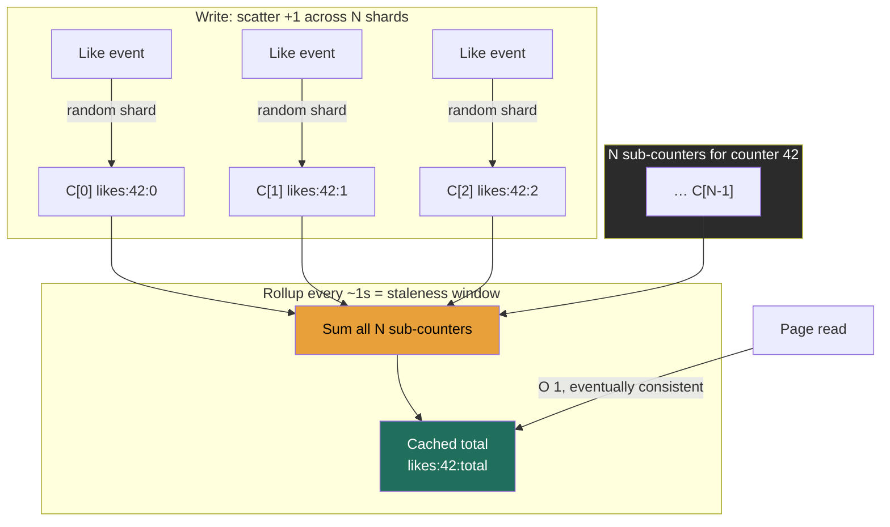

> A `likes` counter looks like the most trivial thing in the system, one integer, `+1` per like. It is, until a celebrity posts and a million people tap the heart in the same minute. Now that single integer is the hottest write key in your database, **every increment serializes on one row lock**, and your "trivial" counter is a throughput wall the rest of the design slams into. This is the **hot-key write-contention** problem, and the building block that beats it, **fan one logical counter into N physical sub-counters, summed on read**, is the same pattern AWS publishes as official DynamoDB guidance. The Director-altitude tension is **write-spread vs read-cost vs accuracy**, and the decision you actually own is *how much temporal staleness and how much error you'll trade for write throughput and cost.*

### Learning objectives
- Explain **why a single counter row/key cannot absorb millions of increments**, atomicity forces every increment through one serialization point with a real per-key ceiling.
- Apply the **sharded-counter pattern**, split one logical counter into N sub-counters, increment one at random, **sum N on read**, and quantify the write-spread-vs-read-cost trade, including how the **store choice swings N by 100×**.
- Distinguish two orthogonal kinds of "inexact": a sharded counter is **exact but eventually consistent** (temporal lag) vs **HyperLogLog / Count-Min Sketch**, which are **permanently approximate** (bounded error even at rest), and classify which solves *totals*, *distinct counts*, and *frequencies*.
- Reconcile sub-counters into a **cached canonical total**, and reason about the **staleness window as the eventual-consistency knob**.
- Pick the right tool per use case, likes/views vs unique-viewer counts vs rate-limit counters, and name when sharding **helps** writes and when its O(N) read **hurts** the hot path.

### Intuition first
Picture **one cash register at a stadium** and 50,000 fans trying to buy a drink at halftime. The register works perfectly, it's just that everyone has to **queue at the same till**, one at a time. The line is the bottleneck, not the cashier's speed. That single till is a counter row under `UPDATE … SET count = count + 1`: every increment takes the same lock, applies, releases, and lets the next one in. Add fans and the queue grows; the till's per-second rate is fixed.

The fix a stadium actually uses: **open 20 tills**. Each fan walks up to **whichever till is free** (pick one at random), and throughput goes up ~20×. The catch arrives when the manager wants the total takings: there's no single number to read, you must **walk all 20 tills and add them up**. That's the whole pattern: *many tills (sub-counters) to spread the writes; a sum across all of them to get the answer.* Writes get N× cheaper; reads get N× more expensive.

Two more facts complete the picture. While the night is in progress, any total you compute is **a snapshot that's already slightly behind**, fans are still paying at tills you already counted. The number is *exact once everyone settles*, just **temporally stale** in the moment (eventual consistency). And sometimes you don't need the till receipts at all, if the manager only wants "**roughly** how many *distinct* people came tonight," a tiny tally that's never exact but provably within ~1% (**HyperLogLog**) beats a guest book with 50,000 signatures. Hold those three ideas, *spread the writes, sum on read, and decide how much staleness or error you'll accept.*

### Deep explanation

#### Why one row/key melts: the contention is the point
A counter is read-modify-write, and every store enforces its atomicity the same way: **every increment serializes on one lock**, one row lock, one single-threaded Redis key, one DynamoDB partition. That serialization is the wall, and it's a **hot-key** problem, not a table problem: other rows scale fine in parallel. **Single-key ceilings range from ~1k increments/sec (a relational row, lock hold time plus commit fsync) to ~100k/sec (a Redis key, pinned to one core on one shard).** A higher ceiling delays the wall; nothing removes it.

The unifying statement an interviewer wants: **a logical counter is a single point of write serialization, and you cannot scale a single serialization point by adding hardware, you can only scale it by splitting it.** Replication (Lesson 2.4) doesn't help: replicas add read copies and durability, not write throughput to the one hot key (in single-leader it makes write latency *worse*).

Go deeper, per-store single-key ceilings (IC depth, optional)

- **Postgres row:** `UPDATE counters SET c = c + 1 WHERE id = 42` takes a **row-level write lock** for the transaction's duration; concurrent increments queue behind it, and each commit forces a **WAL append + fsync** (2.3). One row tops out around **a few hundred to low-thousands of updates/sec**, lock hold time + commit latency, not CPU, is the limit. Without the lock, two concurrent increments both read 100 and both write 101, the classic lost update.
- **Redis key:** `INCR` is atomic and one key sustains on the order of **~100k ops/sec**, but Redis is **single-threaded** for command execution, and in Redis Cluster a single key lives on exactly **one** hash-slot/shard. You cannot spread one key across the cluster; it's pinned to one core on one node.
- **DynamoDB item:** the cleanest published ceiling, **1,000 WCU/sec per partition** (1 WCU = one ≤1 KB write/sec), and a single partition-key value lives on one partition. One counter item caps at ~1,000 increments/sec; adaptive capacity smooths bursts but won't lift a sustained single-key hot spot.

#### The sharded-counter pattern: split, scatter, sum
Replace one logical counter **C** with **N physical sub-counters** `C[0..N-1]`, stored as N separate rows/keys/items:

- **Write (increment):** pick a shard, `shard = random(0, N-1)`, and increment **only that sub-counter**. Each sub-counter sees ~1/N of the traffic; N independent keys means N independent locks/partitions in parallel.
- **Read (get total):** the logical value is `C = Σ C[i]`, **read all N sub-counters and sum them.** A read now costs **N reads + an add**.

That is the entire trade, a clean inversion: **write cost ÷ N, read cost × N.** Choosing N is choosing where on that seesaw to sit, and the right N falls straight out of two requirement numbers:

> **N ≥ (peak increments/sec) / (per-key write ceiling)**

This is where the **store choice swings N by 100×**, and the swing is itself the teaching point. Take a **1,000,000 increments/sec** hot counter at peak: on **relational rows** (~1k/sec/row) or **DynamoDB items** (1k WCU/partition), N ≈ **1,000 shards**, and a read sums 1,000 rows, a real query you must engineer around. (The DynamoDB case is **exactly the example in AWS's own write-sharding guidance**: append a random suffix `metric_id-0 … metric_id-N` to the partition key.) On **Redis keys** (~100k/sec/key), N ≈ **10 shards**, a read sums 10 keys, trivial. The store with the higher per-key ceiling needs far fewer shards and therefore a far cheaper read, so "which store," "how many shards," and "how expensive is a read" are **one coupled decision**, not three. (The rest of the lesson anchors on Redis, N≈10, calling out N≈1000 where it changes the engineering.)

One refinement, one line: the mature pattern is **adaptive sharding**, start every counter at N=1 and promote to more shards only when contention is detected, so the 99.9% of cold counters keep a cheap 1-row read.

#### Reconciling on read: the cached total and the staleness window
Summing N sub-counters on **every** read is fine at N≈10 with modest reads, but it bites at N≈1000 or on read-heavy counters. The standard mitigation is a **periodic rollup**: a background job reads the N sub-counters every few seconds, sums them, and writes a **single cached canonical total** (`likes:42:total`) that all reads serve from. Reads become **O(1)** again; writes still scatter across N shards.

The thing a Director must say out loud: **the rollup interval is the eventual-consistency knob, and it equals your reconciliation lag.** Roll up every **1 s** and the displayed total trails reality by ≤ ~1 s; roll up every **30 s** and you cut rollup cost ~30× but the count visibly lags half a minute. You're picking, *from the product requirement*, how stale a like count may look versus how much rollup compute you'll spend, the same **freshness-vs-cost** dial as the search refresh interval in Lesson 3.12.

#### The sharp read:write nuance: when sharding *hurts*
Sharding optimizes the **write-heavy, read-rarely** counter: a like/view total is incremented millions of times and *read* only on page load (and then from the cached rollup), so the O(N) read amortizes to near-nothing. **Invert the ratio and the pattern turns against you.** A **rate-limit counter** (Lesson 3.10) is read **on every single request**, shard it and every check must fan out and sum N keys on the hottest path in the system. Worse, the contention argument barely applies: a *single user's* request rate rarely approaches one key's write ceiling. Keep it a **single atomic counter per key per window** (one `INCRBY` returning the new value). The signal: **sharded counters are a write-spreading tool that taxes reads, they fit additive totals read occasionally, not counters read on every event**, and a rate limiter is the canonical counter you should *not* shard.

#### When you can be approximate: two different "inexact" (don't conflate them)
Two orthogonal axes, and keeping them straight is exactly the precision an interviewer listens for:

- A **sharded counter is EXACT, but eventually consistent.** `Σ C[i]` is the *correct* number once in-flight increments land; any staleness is **temporal**. At rest it's dead accurate. **A sharded counter is not "approximate."**
- **HyperLogLog and Count-Min Sketch are PERMANENTLY approximate**, bounded error even fully at rest, traded for orders-of-magnitude less memory. A *different* trade than sharding, motivated by **space**, not write contention.

**HyperLogLog (HLL), distinct/unique counts (cardinality), motivated by memory.** "How many **unique** users viewed this video?" is *not* additive, the same user viewing twice must count once. The exact answer means storing the **set of all distinct user IDs**: 50M viewers × ~8 bytes ≈ **400 MB per video**, multiplied across every video. **HyperLogLog** estimates cardinality from a fixed sketch instead: in Redis (`PFADD`/`PFCOUNT`/`PFMERGE`), an HLL is **at most 12 KB regardless of cardinality** with a **0.81% standard error**, a ~30,000× memory win for a count within ~1% **in both directions**. The classifying point: **HLL is for *distinct* counts, not additive totals**, "unique visitors," not "total likes."

**Count-Min Sketch (CMS), per-item frequency and top-K heavy hitters** (trending hashtags, hot URLs, abusive IPs) in fixed sub-linear space. Its critical property, stated precisely: **CMS only ever *over*estimates, never under**, so the estimate is a one-sided upper bound, perfect for "is this *at least* this frequent?" top-K detection where a false-high on a rare key is harmless. **CMS is for *frequencies / top-K*, not totals or cardinality.**

Go deeper, Count-Min Sketch mechanics (IC depth, optional)

A CMS is a small 2-D array of counters: *d* rows, each with its own hash function over *w* columns. To add an item, hash it once per row and increment the *d* mapped cells. To read a frequency, hash the same way and take the **minimum** of the *d* cells. Hash collisions mean other items may have incremented your cells, which can only **inflate** the count, never deflate it; taking the min across rows limits how much inflation survives. Error scales with the total stream count and shrinks as you widen *w* (less collision) or deepen *d* (more independent estimates), both bounded, fixed-size choices made up front, independent of the number of distinct keys.

The decision rule to carry into an interview: **additive total, must be exact → sharded counter** (eventually consistent); **distinct count, ~1% is fine → HyperLogLog** (12 KB); **per-item frequency / heavy hitters → Count-Min Sketch** (overestimates only). Reaching for HLL to count likes, or a sharded counter to count *unique* viewers, is a category error.

### Diagram: sharded write path and summed read path

### Worked example: the YouTube view count
The public view count under a video is the canonical sharded-counter problem. Requirement (the R/E of RESHADED): a **viral video taking ~1,000,000 views/sec** at peak, displayed counts that may **lag a little** but must be **eventually correct**, plus a separate **"unique viewers"** analytics number.

1. **The total view count → sharded counter, not one row.** One row/item caps at ~1k/sec (relational/DynamoDB) or ~100k/sec (one Redis key), a million/sec overruns all of them by 10-1000×. On **Redis**, N ≥ 1e6/1e5 = **~10 shards**; clients increment `views:vid:0..9` at random. (On DynamoDB you'd land at ~1,000 suffixed partition keys, AWS's write-sharding recipe, with a correspondingly heavier read.) *Rejected alternative:* a single atomic counter, simplest and trivially consistent, but it physically cannot absorb the write rate; a hard throughput wall, not a tuning problem.
2. **Reconcile into a cached total.** A rollup job sums the ~10 sub-counters **every second** into `views:vid:total`; the page reads that one number in O(1). The displayed count trails reality by ≤ ~1 s, which is **why YouTube view counts visibly lag and "stick"** under heavy load; it's the rollup window, by design. *Rejected alternative:* summing all shards on every page load, fine at N=10, untenable at N=1000, and the cached total also shields against a read storm on a viral video.
3. **Unique viewers → HyperLogLog, not a sharded counter.** "Distinct viewers" is a **cardinality** question, `PFADD viewers:vid <user_id>` per view, `PFCOUNT` to read. At **12 KB and 0.81% error** per video vs hundreds of MB for the exact ID set, the memory case is overwhelming and ~1% error on a distinct-viewers stat is invisible. *Rejected alternative:* an exact `SET` of user IDs, perfectly accurate but ~30,000× the memory, which doesn't fit across millions of videos.
4. **The monetized count is reconciled separately and exactly.** The number that pays creators is **not** the fast display counter, it's recomputed from the durable **event log / warehouse** (every view event in Kafka → batch rollup), validated and deduped. The fast sharded counter is for *display*; the slow exact pipeline is for *money*. *This is the Director move:* "the view count" is really **two counters with two consistency contracts**, a cheap eventually-consistent display counter and an exactly-reconciled billing counter, and conflating them is the failure.

### Trade-offs table: the counter design spectrum
| Approach | Write cost | Read cost | Accuracy | Memory | Use when… | Rejected because… |
|---|---|---|---|---|---|---|
| **Single hot counter** | **contended** (one lock/partition; ~1k-100k/s ceiling) | O(1), cheap | exact, strongly consistent | tiny | low write rate, or a **rate-limit** counter read every request | melts under a hot key, single serialization point can't scale with hardware |
| **Sharded counter (N subs)** | **÷ N** (parallel keys) | **O(N)** sum, or O(1) via cached rollup | **exact but eventually consistent** (rollup/in-flight lag) | N × tiny | **additive totals** read occasionally, likes, views, retweets | O(N) read taxes read-heavy/per-request counters; adds a rollup job |
| **HyperLogLog** | O(1) `PFADD` | O(1) `PFCOUNT` | **~0.81% std error, both directions** | **fixed ~12 KB** any cardinality | **distinct/unique counts** where ~1% is fine, unique viewers/visitors | can't give an exact number; wrong tool for additive totals |
| **Count-Min Sketch** | O(1) | O(1) per key | **overestimates only** (one-sided upper bound) | fixed sub-linear | **per-item frequency / top-K heavy hitters**, trending tags, hot IPs | only approximate and only upward; not for totals or cardinality |
| **Append-only event log** | O(1) append (contention-free) | **expensive** (scan/aggregate) | exact + full audit trail | grows unbounded | the **exact, reconciled** count (billing, fraud) computed in batch | far too slow to read live; pair it with a display counter |

### What interviewers probe here
- **"A single celebrity post is getting a million likes a minute, what breaks and what do you do?"**, *Strong:* names the **hot-key write-contention** wall (every increment serializes on one lock, with a real per-key ceiling), then shards the counter into N ≈ rate ÷ ceiling sub-counters summed on read, **deriving N from the store's per-key limit** rather than guessing. *Red flag:* "scale the database horizontally" / "add replicas", replication doesn't relieve a hot **write** key; you must split the key.
- **"What does sharding the counter cost you, and how do you hide it?"**, *Strong:* frames it as **write ÷ N for read × N**, mitigated by a **periodic rollup into a cached total** whose interval **is** the eventual-consistency window; notes the store choice swings N (and read cost) ~100×. *Red flag:* presents sharding as free, or never mentions the O(N) read.
- **"When would sharding a counter be the wrong call?"**, *Strong:* a **rate limiter** or any counter **read on every request**, the O(N) fan-out lands on the hottest path; keep those a single atomic counter per key. *Red flag:* "always shard hot counters" with no read:write nuance.
- **"This count can be approximate, what changes?"**, *Strong:* distinguishes **sharded (exact, eventually consistent)** from **HLL/CMS (permanently bounded error)**, picks **HLL for distinct counts** (12 KB, 0.81%) and **CMS for frequencies/top-K** (overestimates only), and refuses to use either for an exact additive total. *Red flag:* "use HyperLogLog to count the likes", HLL is for *cardinality*, not totals.
- **"Who owns the number that pays creators?"** *(cost/risk/delegation signal)*, *Strong:* separates a cheap **eventually-consistent display counter** from an **exactly-reconciled billing/fraud counter** rebuilt from the event log, and won't let the fast path be the source of truth for money. *Red flag:* one counter for both display and billing.

### Common mistakes / misconceptions
- **Treating a counter as a trivial integer, or expecting replicas/"horizontal scaling" to fix it.** Under a hot key it's the most contended **write** in the system, and replication adds read capacity, not write throughput to one key. Only **splitting the key** helps.
- **Calling a sharded counter "approximate."** It's **exact, just eventually consistent**, temporal lag, not error. Conflating that with HLL/CMS error is the classic muddle.
- **Category errors across the three tools.** HLL = *cardinality*; CMS = *frequency* (and it **overestimates only**); sharded counter = *additive total*. Using HLL for likes or a plain counter for distinct viewers is wrong-tool.
- **Sharding a rate-limit counter.** It's read on every request, so the O(N) fan-out hits the hot path, keep it a single atomic per-key counter.
- **Trusting native distributed counter types blindly**, e.g. Cassandra's counter writes are **not idempotent: a timed-out increment can't be safely retried** (overcount risk), so blind retries must be disabled; reconcile money-grade counts from an idempotent event log instead.

### Practice questions
**Q1.** A like counter on one Postgres row is throttling at a few thousand writes/sec during a viral spike. Walk through your fix and quantify the new shape.
> *Model:* The row is a **single serialization point**, every increment serializes on one row lock plus a WAL commit, so ~1k-few-k/sec is the ceiling regardless of CPU; replicas won't help. **Shard the counter:** N sub-counter rows, each increment hits a random one. Size N from peak rate ÷ per-key ceiling, e.g. 1,000,000/sec ÷ ~1,000/sec ≈ **~1,000 shards** on Postgres (or ~10 on Redis at ~100k/key, store choice matters). **Read = sum the N rows**; since 1,000-row sums per page load are costly, add a **rollup job** that sums into a **cached total** every ~1 s, served in O(1). The cost I accept: the displayed count is **eventually consistent**, trailing by ≤ the rollup interval, fine for a like count.

**Q2.** Distinguish the "inexactness" of a sharded counter from that of HyperLogLog. When do you reach for each?
> *Model:* A **sharded counter is exact but eventually consistent**, `Σ C[i]` is the *correct* total once in-flight increments and the rollup settle; the gap is **temporal**, and at rest it's precise. **HyperLogLog is permanently approximate**, a bounded **~0.81% error even at rest**, traded for fixed **~12 KB** at any cardinality. They also answer **different questions**: a sharded counter gives an **additive total** (total likes); HLL gives **distinct cardinality** (unique viewers), which isn't additive because duplicates must collapse. Exact running total that can lag → sharded counter; "how many *unique*…?" where ~1% is invisible and the exact ID set costs hundreds of MB → HLL.

**Q3.** Your team wants to shard the rate-limiter's per-user counter "for the same reasons we sharded likes." What do you say?
> *Model:* Push back. Sharding trades **write ÷ N for read × N**, a great deal for a like total (millions of writes, read rarely, from a cached rollup). A **rate-limit counter is the opposite ratio, read on every request**, so sharding turns each check into an N-key fan-out on the hottest path in the system. And the contention argument barely applies: a single user's request rate almost never approaches one key's write ceiling. Keep it a **single atomic counter per key per window** (one `INCRBY` returning the new value). The rule: **shard write-heavy/read-rarely additive counters; never counters read on every event.**

**Q4.** YouTube's view count visibly lags and "sticks" at round numbers during a premiere, yet creators are paid an exact number. Reconcile these two facts.
> *Model:* **Two different counters with two consistency contracts.** The **displayed** count is a sharded counter + ~1 s rollup into a cached total, built for write throughput and **eventually consistent**, so the public number trails by the rollup window (the visible lag). The **monetized** count is recomputed **offline and exactly** from the durable **event log / warehouse**, where each view is validated, deduped, and fraud-filtered. The fast path optimizes write throughput and read cost and tolerates staleness; the slow path optimizes exactness and auditability and tolerates latency. The Director move is refusing to let the cheap display counter be the source of truth for money.

### Key takeaways
- A logical counter is a **single point of write serialization**, every increment serializes on one lock, with single-key ceilings from **~1k/s (relational row) to ~100k/s (Redis key)**. You **can't scale it with hardware or replicas, only by splitting the key.**
- **Sharded counter:** fan into **N sub-counters** (N ≈ peak rate ÷ per-key ceiling), increment one at random, **sum N on read**. The trade is **write ÷ N for read × N**; the **store choice swings N (and read cost) ~100×**, and AWS publishes this exact pattern for DynamoDB.
- Hide the O(N) read with a **periodic rollup into a cached total**, and that **rollup interval *is* the eventual-consistency window** (a freshness-vs-cost knob picked from the product requirement).
- **Two different inexacts:** a sharded counter is **exact but eventually consistent**; **HLL / CMS are permanently approximate**. HLL = **distinct counts** (~12 KB, 0.81%, both directions); CMS = **frequencies/top-K** (overestimates only, never under); sharded counter = **additive totals**. Don't mismatch them.
- **Shard write-heavy/read-rarely counters; don't shard counters read on every event** (the **rate limiter** is the canonical counter *not* to shard), and split the cheap **display** count from the exactly-reconciled **billing** count.

> **Spaced-repetition recap:** One counter = one till everyone queues at (a single write-serialization point, ~1k-100k/s). Open N tills (sub-counters): write ÷ N, but read must **sum all N**, hide it behind a **rollup-cached total**, whose interval *is* your eventual-consistency lag. The sum is **exact, just stale**; for **distinct** counts use **HyperLogLog** (12 KB, ~0.81%, by *memory* not contention), for **frequencies** use **Count-Min Sketch** (overestimates only). Shard write-heavy totals, **not** the rate limiter you read every request.
