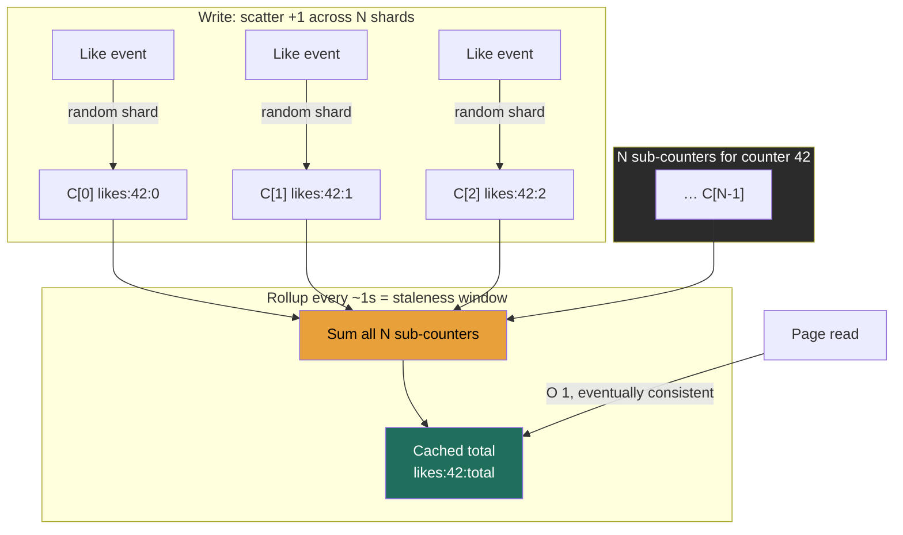

> A `likes` counter looks like the most trivial thing in the system — one integer, `+1` per like. It is, until a celebrity posts and a million people tap the heart in the same minute. Now that single integer is the hottest write key in your database, every increment is serializing behind every other increment on **one row lock**, and your "trivial" counter is a throughput wall the rest of the design slams into. This is the **hot-key write-contention** problem, and the building block that beats it — **fan one logical counter into N physical sub-counters, summed on read** — is the same pattern AWS publishes as official DynamoDB guidance. The Director-altitude tension is **write-spread vs read-cost vs accuracy**, and the decision you actually own is *how much temporal staleness and how much error you'll trade for write throughput and cost.*

### Learning objectives
- Explain **why a single counter row/key cannot absorb millions of increments** — the lock/coordination cost of `count = count + 1`, with real per-row throughput numbers.
- Apply the **sharded-counter pattern** — split one logical counter into N sub-counters, increment one at random, **sum N on read** — and quantify the write-spread-vs-read-cost trade, including how the **store choice swings N by 100×**.
- Distinguish two orthogonal kinds of "inexact": a sharded counter is **exact but eventually consistent** (temporal lag) vs **HyperLogLog / Count-Min Sketch**, which are **permanently approximate** (bounded error even at rest) — and classify which solves *totals*, *distinct counts*, and *frequencies*.
- Reconcile sub-counters into a **cached canonical total**, and reason about the **staleness window as the eventual-consistency knob**.
- Pick the right tool per use case — likes/views/retweets vs unique-viewer counts vs rate-limit counters — and name when sharding **helps** writes and when its O(N) read **hurts** the hot path.

### Intuition first
Picture **one cash register at a stadium** and 50,000 fans trying to buy a drink at halftime. The register works perfectly — it's just that everyone has to **queue at the same till**, one at a time. The line is the bottleneck, not the cashier's speed. That single till is a counter row under `UPDATE ... SET count = count + 1`: every increment must take the **same row lock**, apply its change, release it, and let the next one in. Add fans and the queue grows; the till's per-second rate is fixed.

The fix a stadium actually uses: **open 20 tills**. Each fan walks up to **whichever till is free** (pick one at random), and throughput goes up ~20×. The catch arrives at the end of the night when the manager wants the total takings: there's no single number to read — you must **walk all 20 tills and add them up**. That's the whole pattern. *Many tills (sub-counters) to spread the writes; a sum across all of them to get the answer.* Writes get N× cheaper; reads get N× more expensive.

Two more facts complete the picture. First, while the night is in progress, any total you compute is **a snapshot that's already slightly behind** — fans are still paying at tills you already counted. The number is *exact once everyone settles*, just **temporally stale** in the moment (eventual consistency). Second, sometimes you don't even need the till receipts — if the manager only wants "**roughly** how many *distinct* people came tonight," you can get that from a tiny tally that's never exact but is provably within ~1% (that's **HyperLogLog**), using a thimble of memory instead of a guest book with 50,000 signatures. Hold those three ideas — *spread the writes, sum on read, and decide how much staleness or error you'll accept* — because every decision below is one of them.

### Deep explanation

#### Why one row/key melts — the contention is the point
A counter is `read-modify-write`: to do `+1` you must read the current value, add one, and write it back **atomically**, or two concurrent increments both read 100, both write 101, and you've **lost an update** (the classic race). Every store enforces that atomicity with some form of **serialization on the single key**, and *that serialization is the wall*:

- **A single Postgres row.** `UPDATE counters SET c = c + 1 WHERE id = 42` takes a **row-level write lock** for the duration of the transaction; concurrent increments to row 42 **queue behind it**, and each commit also forces a **WAL append + fsync** (Lesson 2.3). The same row therefore tops out around **a few hundred to low-thousands of updates/sec** — lock hold time + commit latency, not CPU, is the limit. It is *not* that Postgres is slow; it's that *one row* is a single serialization point. (Other rows scale fine in parallel — this is a **hot-key** problem, not a table problem.)
- **A single Redis key.** `INCR likes:42` is atomic and Redis is fast — one key can sustain on the order of **~100k ops/sec**. But Redis is **single-threaded** for command execution, and in **Redis Cluster a single key lives on exactly one shard** (hash-slot). You **cannot** spread one key's load across the cluster; that key is pinned to one core on one node. So Redis raises the ceiling ~50–100× over a Postgres row but does **not** remove it.
- **A single DynamoDB item / partition.** This is the cleanest real-world ceiling: **every DynamoDB partition is capped at 1,000 write capacity units/sec** (1 WCU = one ≤1 KB write/sec), and a single partition-key value lives on one partition. So **one counter item caps at ~1,000 increments/sec**, full stop — adaptive capacity smooths brief bursts but won't lift a sustained single-key hot spot.

The unifying statement an interviewer wants: **a logical counter is a single point of write serialization, and you cannot scale a single serialization point by adding hardware — you can only scale it by splitting it.** Replication (Lesson 2.4) doesn't help: it adds read copies and durability, not write throughput to the one hot key (in single-leader it makes write latency *worse*).

#### The sharded-counter pattern — split, scatter, sum
Replace one logical counter **C** with **N physical sub-counters** `C[0..N-1]`, typically stored as N separate rows/keys/items:

- **Write (increment):** pick a shard — `shard = random(0, N-1)` (or `hash(writer_id) % N`) — and increment **only that sub-counter**. Each sub-counter now sees roughly **1/N of the write traffic**, so the contention on any single key drops ~N×. N independent keys means N independent locks/partitions running in parallel.
- **Read (get total):** the logical value is `C = Σ C[i]` for i in 0..N-1 — **read all N sub-counters and sum them.** A read now costs **N reads + an add**, where before it was one read.

That is the entire trade, and it is a clean inversion: **write cost ÷ N, read cost × N.** Choosing N is choosing where on that seesaw to sit, and the right N falls straight out of two requirement numbers — your **peak increment rate** and your **per-key write ceiling** in the chosen store:

> **N ≥ (peak increments/sec) / (per-key write ceiling)**

This is where the **store choice swings N by 100×**, and that swing is itself the teaching point. Take a **1,000,000 increments/sec** hot counter (a viral post at peak):

- On **Postgres rows** (~1k writes/sec/row): N ≥ 1,000,000 / 1,000 = **~1,000 shards.** A read now sums **1,000 rows** — that's a real query you must engineer around.
- On **Redis keys** (~100k ops/sec/key): N ≥ 1,000,000 / 100,000 = **~10 shards.** A read sums **10 keys** — trivial.
- On **DynamoDB items** (1k WCU/partition): N ≥ 1,000,000 / 1,000 = **~1,000 shards** — same arithmetic as Postgres, and **this is exactly the example in AWS's own "write sharding" best-practice page**, which tells you to append a random or calculated suffix (`metric_id-0` … `metric_id-N`) to the partition key to spread a hot write. *When the official cloud docs prescribe the pattern you're describing, you're on solid ground.*

The store with a **higher per-key ceiling needs far fewer shards**, which means a **far cheaper read** — so "which store" and "how many shards" and "how expensive is a read" are one coupled decision, not three. (For the rest of this lesson I'll anchor on the **Redis, N≈10** sizing for the running example, and call out the N≈1000 case where it changes the engineering.)

A refinement worth naming: **N need not be fixed.** Most counters are cold — a post with 12 likes does not need 10 shards, it needs 1 (and a 1-row read). The mature pattern is **adaptive sharding**: start hot keys at N=1 and **promote to more shards only when contention is detected** (write latency / throttling on that key crosses a threshold), and optionally demote when it cools. This keeps the read cheap for the 99.9% of counters that are cold and pays the O(N) read tax only on the genuinely hot few.

#### Reconciling on read — the cached total and the staleness window
Summing N sub-counters on **every** read is fine when N≈10 and reads are modest, but it's the part that bites at N≈1000 or on read-heavy counters. The standard mitigation is a **periodic rollup**: a background job (every few seconds) reads the N sub-counters, sums them, and writes the result to a **single cached canonical total** (`likes:42:total`) that all reads serve from. Reads become **O(1)** again; writes still scatter across N shards.

The thing a Director must say out loud: **that rollup interval is the eventual-consistency knob, and it equals your reconciliation lag.** Roll up every **1 s** and the displayed total trails reality by ≤ ~1 s (cheap staleness, more rollup work); roll up every **30 s** and you cut rollup cost ~30× but the count visibly lags half a minute. You're not picking a number — you're picking, *from the product requirement*, how stale a like/view count is allowed to look versus how much rollup compute you'll spend. This is the same **freshness-vs-cost** dial as the search refresh interval in Lesson 3.12, applied to a counter.

#### The sharp read:write nuance — when sharding *hurts*
Sharding optimizes the **write-heavy, read-rarely** counter: a like/view total is incremented millions of times and *read* only when someone loads the page (and even then served from the cached rollup). The O(N) read is amortized to near-nothing. **But invert the ratio and the pattern turns against you.**

A **rate-limit counter** (Lesson 3.10) is read **on every single request** — that's the whole job, "how many calls has this key made this window?" If you shard it across N keys, **every rate-limit check must fan out and sum N keys on the hottest path in the system**, turning one fast `INCR`+`GET` into N reads per request. Here sharding a counter is usually the **wrong** move: a rate limiter wants a single atomic counter per key per window (one `INCRBY` returning the new value), accepting the per-key write ceiling because a *single user's* request rate rarely approaches it. The signal is recognizing that **sharded counters are a write-spreading tool that taxes reads, so they fit additive totals read occasionally, not counters read on every event** — and that a rate limiter is the canonical counter you should *not* shard.

#### When you can be approximate — two different "inexact" (don't conflate them)
There are **two orthogonal axes** here, and keeping them straight is exactly the precision an interviewer is listening for:

- A **sharded counter is EXACT, but eventually consistent.** `Σ C[i]` is the *correct* number once all in-flight increments have landed; any staleness is **temporal** (in-flight writes, rollup lag). Fully at rest, it's dead accurate. **A sharded counter is not "approximate."**
- **HyperLogLog and Count-Min Sketch are PERMANENTLY approximate.** They carry a **bounded error even when completely at rest** — you trade accuracy for orders-of-magnitude less memory. This is a *different* trade than sharding, motivated by **space**, not write contention.

So they answer different questions:

**HyperLogLog (HLL) — distinct/unique counts (cardinality), motivated by memory.** The question "how many **unique** users viewed this video?" is *not* additive — you can't just `+1` per view, because the same user viewing twice must count once. The exact way is to store the **set of all distinct user IDs** and take its size: for 50M unique viewers at ~8 bytes/ID that's **~400 MB per video**, and you'd need it for every video — gigabytes-to-terabytes of RAM just to dedupe counts. **HyperLogLog** estimates cardinality from a fixed, tiny sketch instead. In Redis (`PFADD` to add, `PFCOUNT` to read, `PFMERGE` to union), an HLL is **at most 12 KB regardless of cardinality** — even for billions of distinct items — with a **0.81% standard error** (it uses 16,384 probabilistic registers; max cardinality 2⁶⁴). That's **400 MB → 12 KB**, a ~30,000× memory win, for a count that's within ~1% **in both directions**. The classifying point: **HLL is for *distinct* counts, not for additive totals** — "unique visitors," "distinct search terms," not "total likes."

**Count-Min Sketch (CMS) — per-item frequency, and it overestimates only.** The question "how many times did **each** item appear in this stream — and who are the top-K heavy hitters?" (trending hashtags, hot URLs, abusive IPs) is a *frequency* problem over a huge key space. Tracking an exact count per key costs memory linear in the number of distinct keys; **Count-Min Sketch** estimates per-key frequency in **fixed sub-linear space** (a small 2-D array of counters with several hash functions). Its critical property, and the thing to state precisely: **CMS only ever *over*estimates** — hash collisions can inflate a count but never deflate it, so the estimate is a **one-sided upper bound** (contrast HLL's two-sided ±error). That makes it perfect for "is this *at least* this frequent?" heavy-hitter detection where a false-high on a rare key is harmless. The classifying point: **CMS is for *frequencies / top-K*, not totals or cardinality.**

The decision rule to carry into an interview: **additive total, must be exact → sharded counter** (eventually consistent); **distinct count, ~1% is fine → HyperLogLog** (12 KB); **per-item frequency / heavy hitters → Count-Min Sketch** (sub-linear, overestimates). Reaching for HLL to count likes, or a sharded counter to count *unique* viewers, is a category error.

### Diagram — sharded write path and summed read path

### Worked example — the YouTube view count
The public view count under a video is the canonical sharded-counter problem, and it shows every part of the trade at once. Requirement (the R/E of RESHADED): a **viral video taking ~1,000,000 views/sec** at peak, displayed counts that may **lag a little** but must be **eventually correct**, plus a separate **"unique viewers"** analytics number.

1. **The total view count → sharded counter, not one row.** One row/item caps at ~1k writes/sec (Postgres/DynamoDB) or ~100k/sec (one Redis key) — a million/sec **overruns all of them by 10–1000×**. Shard it. On **Redis**, N ≥ 1e6/1e5 = **~10 shards**; a viewing client increments `views:vid:0..9` at random. (On DynamoDB you'd land at **~1,000** suffixed partition keys — AWS's exact write-sharding recipe — with a correspondingly heavier read.) *Rejected alternative:* a single atomic counter — simplest and trivially consistent, but it physically cannot absorb the write rate; it's a hard throughput wall, not a tuning problem.
2. **Reconcile into a cached total.** A rollup job sums the ~10 sub-counters **every second** into `views:vid:total`; the page reads that one number in O(1). The displayed count therefore trails reality by ≤ ~1 s — which is **why YouTube view counts visibly lag and "stick"** at round numbers under heavy load; it's the rollup/eventual-consistency window, by design. *Rejected alternative:* summing all shards on every page load — fine at N=10, but it would be untenable at the DynamoDB N=1000 sizing, and the cached total also shields you from a read storm on a viral video.
3. **Unique viewers → HyperLogLog, not a sharded counter.** "Distinct viewers" is a **cardinality** question, not additive — `PFADD viewers:vid <user_id>` per view, `PFCOUNT` to read. At **12 KB and 0.81% error** per video vs **hundreds of MB** to store the exact ID set, the memory case is overwhelming and a ~1% error on a *distinct-viewers* stat is invisible to users. *Rejected alternative:* an exact `SET` of user IDs — perfectly accurate but **~30,000× the memory** per video, which doesn't fit across millions of videos. Note these are **different tools for different questions**: the sharded counter gives the *exact total* views (eventually); HLL gives the *approximate distinct* viewers — using one for the other's job is the category error.
4. **The monetized count is reconciled separately and exactly.** The number that pays creators (and the one fraud cares about) is **not** the fast display counter — it's recomputed from the durable **event log / data warehouse** (every view event in Kafka → batch rollup) where each view is validated and deduped. The fast sharded counter is for *display*; the slow exact pipeline is for *money*. *This is the Director move:* recognize that "the view count" is really **two systems with two consistency contracts** — a cheap eventually-consistent display counter and an expensive exactly-reconciled billing counter — and not conflate them.

### Trade-offs table — the counter design spectrum
| Approach | Write cost | Read cost | Accuracy | Memory | Use when… | Rejected because… |
|---|---|---|---|---|---|---|
| **Single hot counter** | **contended** (one lock/partition; ~1k–100k/s ceiling) | O(1), cheap | exact, strongly consistent | tiny | low write rate, or a **rate-limit** counter read every request | melts under a hot key — single serialization point can't scale with hardware |
| **Sharded counter (N subs)** | **÷ N** (parallel keys) | **O(N)** sum, or O(1) via cached rollup | **exact but eventually consistent** (rollup/in-flight lag) | N × tiny | **additive totals** read occasionally — likes, views, retweets | O(N) read taxes read-heavy/per-request counters; adds a rollup job |
| **HyperLogLog** | O(1) `PFADD` | O(1) `PFCOUNT` | **~0.81% std error, both directions** | **fixed ~12 KB** any cardinality | **distinct/unique counts** where ~1% is fine — unique viewers/visitors | can't give an exact number; wrong tool for additive totals |
| **Count-Min Sketch** | O(1) | O(1) per key | **overestimates only** (one-sided upper bound) | fixed sub-linear | **per-item frequency / top-K heavy hitters** — trending tags, hot IPs | only approximate and only upward; not for totals or cardinality |
| **Append-only event log** | O(1) append (contention-free) | **expensive** (scan/aggregate) | exact + full audit trail | grows unbounded | the **exact, reconciled** count (billing, fraud) computed in batch | far too slow to read live; needs a rollup pipeline — pair it with a display counter |

### What interviewers probe here
- **"A single celebrity post is getting a million likes a minute — what breaks and what do you do?"** — *Strong:* names the **hot-key write-contention** wall (one row lock / one partition / one Redis shard, with a real per-key ceiling like DynamoDB's 1k WCU), then shards the counter into N≈(rate/ceiling) sub-counters summed on read, and **derives N from the store's per-key limit** rather than guessing. *Red flag:* "scale the database horizontally" / "add replicas" — replication doesn't relieve a single hot **write** key; you must split the key.
- **"What does sharding the counter cost you, and how do you hide it?"** — *Strong:* frames it as **write ÷ N for read × N**, mitigated by a **periodic rollup into a cached total** whose interval **is** the eventual-consistency window; notes the store choice swings N (and thus read cost) by ~100×. *Red flag:* presents sharding as free, or never mentions the O(N) read / reconciliation.
- **"When would sharding a counter be the wrong call?"** — *Strong:* a **rate limiter** or any counter **read on every request** — the O(N) fan-out lands on the hottest path; keep those as a single atomic counter per key. *Red flag:* "always shard hot counters" with no read:write nuance.
- **"This count can be approximate — what changes?"** — *Strong:* distinguishes **sharded (exact, eventually consistent)** from **HLL/CMS (permanently bounded error)**, picks **HLL for distinct counts** (12 KB, 0.81%, motivated by memory not contention) and **CMS for frequencies/top-K** (overestimates only), and refuses to use either for an exact additive total. *Red flag:* "use HyperLogLog to count the likes" — HLL is for *cardinality*, not totals.
- **"Who owns the number that pays creators?"** *(cost/risk/delegation signal)* — *Strong:* separates a cheap **eventually-consistent display counter** from an **exactly-reconciled billing/fraud counter** rebuilt from the event log, and won't let the fast path be the source of truth for money. *Red flag:* one counter for both display and billing.

### Common mistakes / misconceptions
- **Treating a counter as a trivial integer.** Under a hot key it's the single most contended **write** in the system — a throughput wall, not a one-liner.
- **Thinking replicas or "horizontal scaling" fix a hot write key.** They add read capacity/durability, not write throughput to the one key. Only **splitting the key** (sharding) helps.
- **Calling a sharded counter "approximate."** It's **exact, just eventually consistent** — temporal lag, not error. Conflating that with HLL/CMS error is the classic muddle.
- **Using HyperLogLog for additive totals,** or a plain counter for **distinct** counts. HLL = *cardinality*; CMS = *frequency*; sharded counter = *additive total*. Mismatching them is a category error.
- **Forgetting Count-Min Sketch overestimates only** (one-sided). Treating its output as a two-sided estimate, or as an exact frequency, is wrong.
- **Sharding a rate-limit counter.** It's read on every request, so the O(N) read fan-out hits the hot path — keep it a single atomic per-key counter.
- **Ignoring the non-idempotent-retry trap** (below) and double-counting on a retried increment after a timeout.
- **Setting the rollup interval without tying it to a requirement** — it *is* the staleness budget; pick it from the product, not arbitrarily.

### Practice questions
**Q1.** A like counter on one Postgres row is throttling at a few thousand writes/sec during a viral spike. Walk through your fix and quantify the new shape.
> *Model:* The row is a **single serialization point** — every `UPDATE … SET c = c+1` queues on the **same row lock** + WAL commit, so ~1k–few-k/sec is the ceiling regardless of CPU; replicas won't help (read-only). **Shard the counter:** N sub-counter rows, each increment hits a **random** one, so each row sees ~1/N of the load. Size N from the peak rate ÷ per-row ceiling — e.g. 1,000,000/sec ÷ ~1,000/sec ≈ **~1,000 shards** on Postgres (or ~10 on Redis at ~100k/key, which is why store choice matters). **Read = sum the N rows**, and since 1,000-row sums on every page load are costly, add a **rollup job** that sums them every ~1 s into a **cached total** that reads serve in O(1). The cost I'm accepting: the displayed count is **eventually consistent**, trailing by ≤ the rollup interval — which is fine for a like count.

**Q2.** Distinguish the "inexactness" of a sharded counter from that of HyperLogLog. When do you reach for each?
> *Model:* A **sharded counter is exact but eventually consistent** — `Σ C[i]` is the *correct* total once in-flight increments and the rollup settle; the only gap is **temporal** (lag), and at rest it's precise. **HyperLogLog is permanently approximate** — it carries a **bounded ~0.81% error even fully at rest**, traded for fixed **~12 KB** memory at any cardinality. They also answer **different questions**: the sharded counter is for an **additive total** (total likes/views); HLL is for **distinct cardinality** (unique viewers), which isn't additive because duplicates must collapse. So: exact running total that can lag → **sharded counter**; "how many *unique*…?" where ~1% is invisible and storing every ID would cost hundreds of MB → **HLL**. Using HLL for likes, or a counter for *unique* viewers, is a category error.

**Q3.** Your team wants to shard the rate-limiter's per-user counter "for the same reasons we sharded likes." What do you say?
> *Model:* Push back. Sharding trades **write ÷ N for read × N**, which is a great deal for a **like total** (millions of writes, read rarely and from a cached rollup). A **rate-limit counter is the opposite ratio — it's *read on every request*** ("how many calls this window?"), so sharding it turns each check into an **N-key fan-out + sum on the hottest path** in the system. Worse, the contention argument barely applies: a *single user's* request rate almost never approaches a single key's write ceiling, so there's little write pressure to relieve. Keep it a **single atomic counter per key per window** (one `INCRBY` returning the new value). The general rule: **shard write-heavy/read-rarely additive counters; do not shard counters read on every event.**

**Q4.** YouTube's view count visibly lags and "sticks" at round numbers during a premiere, yet creators are paid an exact number. Reconcile these two facts.
> *Model:* They're **two different counters with two consistency contracts.** The **displayed** count is a **sharded counter + ~1 s rollup into a cached total** — built for write throughput (millions of views/sec across N sub-counters) and **eventually consistent**, so the public number trails reality by the rollup window (the visible lag/"sticking"). The **monetized** count is recomputed **offline and exactly** from the durable **event log / warehouse** (every view event → batch rollup) where each view is **validated, deduped, and fraud-filtered**. The fast path optimizes *write throughput and read cost* and tolerates staleness; the slow path optimizes *exactness and auditability* and tolerates latency. The Director move is refusing to let the cheap display counter be the source of truth for money.

**Q5.** A teammate proposes Cassandra's native `counter` column type so you "don't have to build sharding yourself." What's the catch a Director should surface?
> *Model:* Cassandra's `counter` type does give you a distributed increment, but it carries a sharp operational trap: **counter writes are not idempotent and a timed-out write cannot be safely retried.** If an increment times out (coordinator/replica hiccup), the client **can't tell** whether it applied — and **replaying it risks an *overcount*** (the counter can't dedupe the retry the way a normal idempotent write can). At scale, an aggressive retry policy on counters has caused real **overcount + retry-storm incidents**. So the catch isn't "does it count" — it's that the **failure/ retry semantics are weaker**, and you must disable blind retries on counter writes and accept some increments are simply lost rather than risk inflation. For a count where **exactness matters more than convenience** (billing), I'd reconcile from an **idempotent event log** instead; for a best-effort display count, the native counter can be acceptable *if* the non-idempotent-retry behavior is understood and the client is configured for it. Naming that trade — convenience vs retry-safety/overcount risk — is the signal.

### Key takeaways
- A logical counter is a **single point of write serialization** (one row lock / one Redis shard / one DynamoDB partition ≈ **1k–100k writes/sec** per key). You **can't scale it with hardware or replicas — only by splitting the key.**
- **Sharded counter:** fan into **N sub-counters** (N ≈ peak-rate ÷ per-key ceiling), increment one at random, **sum N on read**. The trade is **write ÷ N for read × N**; the **store choice swings N (and read cost) ~100×**, and AWS publishes this exact pattern for DynamoDB.
- Hide the O(N) read with a **periodic rollup into a cached total** — and that **rollup interval *is* the eventual-consistency / reconciliation window** (a freshness-vs-cost knob).
- **Two different inexacts:** a sharded counter is **exact but eventually consistent** (temporal lag); **HyperLogLog / Count-Min Sketch are permanently approximate** (bounded error at rest). HLL = **distinct counts** (~12 KB, 0.81%, both directions); CMS = **frequencies/top-K** (overestimates only); sharded counter = **additive totals**. Don't mismatch them.
- **Shard write-heavy/read-rarely counters; don't shard counters read on every event** (a **rate limiter** is the canonical counter *not* to shard) — and split the cheap **display** count from the exactly-reconciled **billing** count.

> **Spaced-repetition recap:** One counter = one till everyone queues at (a single write-serialization point, ~1k–100k/s). Open N tills (sub-counters): write ÷ N, but read must **sum all N** — hide it behind a **rollup-cached total**, whose interval *is* your eventual-consistency lag. The sum is **exact, just stale**; for **distinct** counts use **HyperLogLog** (12 KB, ~0.81%, by *memory* not contention), for **frequencies** use **Count-Min Sketch** (overestimates only). Shard write-heavy totals, **not** the rate limiter you read every request.
