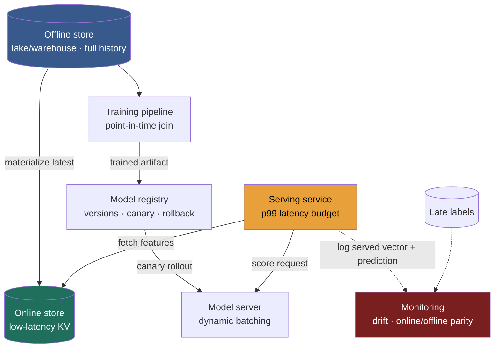

> A recommendation or ranking model looks like the glamorous part of the system, the neural net that decides what you see. In production it is mostly plumbing: a request tier that must fetch a few hundred features and run one matrix multiply inside a ~30 ms budget, backed by a store whose entire job is to make sure the number the model *trained* on and the number it is *served* are the same number. When those two quietly differ, the model degrades in production while every offline metric still looks fine, and no infra dashboard tells you why. That failure has a name, **training-serving skew**, and killing it is the reason a feature store exists. The Director-altitude tension is **freshness vs cost vs correctness**: how fresh each feature has to be, what that freshness costs in compute and complexity, and which data you refuse to serve from a stale copy.

### Learning objectives
- Split an ML system into its **offline (training) path** and **online (serving) path**, and size the online path as a **latency-budgeted request tier** (feature fetch + inference + post-processing inside a p99 budget), in real milliseconds.
- Explain the **feature store as a dual-store system** (an offline warehouse/lake for history, an online KV for serving) and why the split exists: to define each feature **once** and kill **training-serving skew**.
- Enforce **point-in-time correctness** when building training sets, and name the failure (label leakage, a model that looks great offline and fails online) when you skip it.
- Choose **feature freshness** (batch / streaming / on-demand) and a **serving mode** (online real-time vs batch precompute) against a requirement and a budget, quantifying the side you drop.
- Operate a model in production like any risky deploy, **registry + canary/shadow + instant rollback**, and monitor the **ML-specific** signals (feature/prediction drift, online-vs-offline parity) that infra dashboards miss.

### Intuition first
A feature store is a **shared kitchen with two counters.** There is an **offline pantry**, bulk-stocked, where features are batch-cooked over the full history of every ingredient, and that pantry is what you use to **train** the recipe. And there is an **online line-cook counter**, holding just a few things, always fresh, handed over in single-digit milliseconds, and that counter is what you use to **serve** a live order.

The cardinal sin is the two counters using **different recipes.** The chef perfects a dish tasting ingredients from the pantry, but at the pass the line cook substitutes a subtly different version of the same ingredient (chopped differently, measured differently, a day older). The dish that scored perfectly in the test kitchen now disappoints diners, and nobody can taste why. That mismatch is **training-serving skew**, and it silently wrecks model quality in production.

Model serving itself is the easier half to picture: it is just a **stateless request tier like any other**, except the "business logic" is a matrix multiply with a hard p99 latency budget and an expensive accelerator humming under it. Everything below is either keeping the two counters honest, or keeping that request tier inside its budget and its bill.

### Deep explanation

#### Two paths that must agree

Every ML system has two data paths, and the whole discipline of this building block is making the word "same" literally true between them.

- **Offline / training path.** Reads full history, computes features over months of events, trains a model. It runs as a batch pipeline (Spark, a warehouse SQL job), tolerates minutes-to-hours of latency, and pays cheap columnar-scan economics (pennies per GB scanned).
- **Online / serving path.** Given one entity (a user, a request), fetch its current features, run inference, return a score, all inside a per-request budget. A ranking model typically gets **~10 to 50 ms end to end**: feature fetch ~3 to 5 ms, inference ~10 to 20 ms, post-processing ~2 ms.

The two paths compute the "same" features from the "same" definitions. When they drift apart, you get skew. When the training-set join reaches across time, you get leakage. Those two failures are the heart of this lesson; the rest is serving the request tier cheaply and watching it for silent decay.

#### The feature store as a dual-store system

A feature store is four things wired together:

- **(a) Offline store** = a warehouse or lake, columnar (Parquet/Delta on S3, BigQuery), holding **full event-time history**. It powers training-set generation and backfills. Optimized for large scans, not point reads: a query is seconds and cheap per GB.
- **(b) Online store** = a low-latency KV (Redis, DynamoDB, Cassandra) holding the **latest** feature values keyed by entity, point-read in single-digit milliseconds. It powers serving, and holds current state (or a short window), not history.
- **(c) Registry / metadata** = the single definition of each feature (name, type, owner, freshness SLA, the transformation), so both paths reference **one** definition instead of two hand-written copies.
- **(d) Materialization jobs** = push offline-computed feature values into the online store, on a schedule (batch) or continuously (streaming). This is the seam where skew creeps in if the two paths transform data differently.

Real systems: **Feast** (open-source, bring your own stores), **Tecton** (managed, opinionated), **SageMaker Feature Store**, **Vertex AI Feature Store**.

**Online store choice** is a real decision with a clean trade. **Redis** gives sub-millisecond reads and rich types but is memory-bound and costs dollars per GB of RAM, so pick it when the active working set fits memory and the budget needs the lowest latency. **DynamoDB or Cassandra** give single-digit-ms disk-backed reads that scale to billions of entities cheaply, so pick them when the feature set is huge and a few ms is affordable. A tiny **in-process cache** is fastest of all (no network hop) but costs per-node memory and adds a second staleness layer, so reserve it for a handful of ultra-hot features. **Rejected alternative: one store for both paths.** A warehouse cannot serve point reads in single-digit ms, and a KV store cannot scan history for training economically. The dual store is not accidental duplication; each side is optimized for the opposite access pattern.

#### Training-serving skew, the failure the store exists to prevent

**Skew** is when the model is trained on feature values computed one way and served feature values computed a subtly different way, so the input distribution at serving diverges from training. Quality drops in production while offline metrics look fine.

Where it comes from: a feature like "user's 7-day average order value" is computed in a batch SQL job for training, then **re-implemented in online application code** for serving, with a different window boundary, a different null-handling rule, a different rounding, or a different timezone. Small differences, silent damage.

Two fixes, each with a trade:

- **Single definition, computed in both paths.** Define the transformation once (in the store's transformation layer or a shared library) and run that one definition in both the batch job and the online path. Trade: you constrain feature logic to what both engines can express, and you carry a shared-code dependency.
- **Log-and-serve.** Log the exact feature vector that was served, then train on those logs, so training sees precisely what serving saw. Trade: you can only train on features you already serve (a new feature has to be logged for a while before it has history), and you pay to store every served vector.

The Director signal is naming skew as the *reason* the store is dual, then picking the fix by whether you need historical backfill (single-definition) or absolute serving fidelity (log-and-serve).

#### Point-in-time correctness, or you leak the future

When you build a training set, each label (did the user click at time T?) must be joined to the feature values as they were **at time T**, never with values from after T. Join with "current" feature values and you leak the future into training: the model scores brilliantly offline and fails online, because at serving time the future does not exist yet.

Concrete: the label is "user churned on March 1." If you join their "total lifetime logins" as of today (which includes post-March-1 behavior), the model learns from data it will never have at prediction time. The correct join uses logins **as of Feb 28**. This is exactly why the offline store keeps event-time history and not just latest values: an as-of (time-travel) join reconstructs each feature's value at the label's timestamp.

**Rejected shortcut:** joining on latest feature values because it is a simpler query. It is the single most common way a model that scores 0.95 offline scores 0.6 online.

Go deeper, point-in-time joins and offline layout (IC depth, optional)

- The offline store is typically an append-only, event-time-partitioned table (partitioned by date, keyed by entity + timestamp). An as-of join is a backward `ASOF`/window join: for each label row at time `T`, take the most recent feature row with `feature_ts <= T`.
- A subtle second leak is the **feature computation window** crossing the label. "Clicks in the last 7 days" computed as of `T` must not include clicks after `T`, even if they fall in the same calendar window. Point-in-time correctness is about the *event time of every input*, not just the join key.
- This is why "just snapshot the feature table nightly" is not enough for high-frequency labels: nightly snapshots are as-of midnight, so a label at noon joins to stale features and, worse, may straddle the snapshot boundary inconsistently. Event-time history avoids both.

#### The feature-freshness spectrum and its cost

Three tiers, freshness rising, cost and complexity rising with it:

- **Batch features (hours to daily).** Computed in a scheduled Spark/dbt job, materialized to the online store. Cheapest and simplest. Example: "user's 30-day spend." Rejected when the signal moves fast (a fraud pattern in the last 60 seconds).
- **Streaming features (seconds).** A stream processor (Flink, Spark Streaming, Kafka Streams) updates the online store continuously. Example: "items clicked in the last 5 minutes." Costs a running streaming job and its operational surface. Pick it when seconds of recency change the decision.
- **On-demand / real-time features (per request).** Computed at serving time from the request payload. Example: "distance between the user's current GPS and the merchant." Freshest, but adds compute to the latency budget and is the easiest place to introduce skew, because that request-time computation must match the training-time computation exactly. Pick it when the feature only exists at request time.

The trade is explicit: **freshness is not free.** Each step up buys seconds of recency for the price of a running job or request-time compute. Most real systems mix all three, batch for slow aggregates, streaming for recent-activity signals, on-demand for request context, and the mistake is applying one tier everywhere (paying for streaming on a 30-day aggregate, or serving a 60-second signal from a daily batch).

#### Model serving as a latency-budgeted request tier

The serving service is stateless like any app tier; its "business logic" is a matrix multiply with a hard p99 budget and an expensive accelerator under it. Two dominant patterns:

- **Online real-time (sync gRPC/REST).** Score per request inside the budget. Freshest inputs, but you pay inference latency on the critical path and run the accelerator fleet hot. Pick it when the score depends on request context (ranking these candidates for this user now, a fraud call on this transaction).
- **Batch precompute (offline scoring).** Score every entity on a schedule, write results to a KV, then serve by point-read at ~1 to 5 ms with near-zero serving compute. Pick it when the prediction space is enumerable and stable (a daily "recommended for you" list, a churn score refreshed nightly). **Rejected** when inputs are request-time (you cannot precompute a score that depends on the current query) or the entity space is effectively unbounded.

Serving runtimes worth naming: **Triton, TF-Serving, TorchServe, KServe/Seldon** on Kubernetes, or managed endpoints (SageMaker, Vertex). **Dynamic (adaptive) batching** is the throughput lever: an accelerator is most efficient processing many inputs at once, so the server waits a few ms to gather a batch, then runs one big matmul. Trade: throughput up, **tail latency up** (a request may wait out the batch window), so tune the window against the p99 budget. On hardware, CPU is cheap and fine for small models (gradient-boosted trees, tiny nets); GPU and inference accelerators are needed for large models and cut per-inference latency, but a **GPU fleet is a real budget line**: a cloud GPU instance runs ~$1 to $3/hr, so 100 of them is roughly $1.5M to $2M/yr. Autoscale on QPS **and** latency, not CPU alone. For retrieval-style models, the serving primitive is an embedding lookup plus approximate-nearest-neighbor (ANN) search over a vector index.

Go deeper, dynamic batching and accelerator economics (IC depth, optional)

- The batching knob is `max_batch_size` and `max_queue_delay`. A larger delay fills bigger batches (better GPU utilization, lower cost per inference) at the cost of added tail latency; the right value is the largest delay that keeps p99 under budget.
- Cost per 1,000 inferences = (fleet $/hr) / (throughput in inferences/hr). Doubling batch efficiency roughly halves the fleet, which is why batching is a cost decision, not just a latency one.
- Quantization (fp16/int8) and distillation trade a little accuracy for large throughput and memory wins, often the difference between fitting a model on a cheaper accelerator and needing the top-tier one. These are IC levers; the Director owns the accuracy-per-millisecond-per-dollar envelope they serve.

#### Model lifecycle in serving

A model is a **versioned artifact in a registry** (MLflow, SageMaker or Vertex Model Registry). You never hot-swap a model in production, the same way you never push untested code straight to 100% of traffic:

- **Shadow / dark launch:** run the new model on live traffic but do not serve its output; compare it against the current model offline.
- **Canary:** route 1 to 5% of traffic to the new model, watch business and quality metrics, ramp only if healthy.
- **Champion / challenger, A/B:** run models side by side and measure the **business** metric (click-through, conversion), not just accuracy.
- **Instant rollback:** keep the previous version loaded so you can flip back in seconds.

**Rejected: hot-swapping without a canary.** A model can pass offline eval and still tank the business metric (a skewed feature, a distribution shift the eval set never covered). The canary is where you catch that cheaply, on 5% of traffic instead of all of it.

#### Monitoring that is ML-specific, not just infra

Latency, QPS, and error rate are necessary but nowhere near sufficient: a model can be perfectly healthy on every infra metric and quietly, expensively wrong. Add:

- **Feature drift:** the distribution of an input feature shifts away from training (a pipeline changed, user behavior moved).
- **Prediction / score drift:** the distribution of the model's outputs shifts (average predicted CTR creeps up).
- **Model staleness:** how long since the last retrain; a fixed model on a moving world decays.
- **Online-vs-offline parity:** the same input should produce the same score offline and online; a gap is a direct skew alarm.

The hard part is the **ground-truth delay.** The label ("was this prediction right?") arrives hours or days later, because you have to wait to see if the user actually clicked or whether the flagged transaction was truly fraud. So true quality monitoring **lags reality**, and drift monitoring is your early-warning proxy in the meantime. A Director who only asks for infra dashboards has bought a system that goes wrong invisibly.

### Diagram: the two-store feature architecture and the serving path

### Worked example, the ranking service for a personalized feed

A feed ranks ~**500 candidate items** per request, at a p99 budget of **30 ms** for the ranking call, and **40,000 requests/sec** at peak.

- **Serving mode: online real-time.** The score depends on the current session and the candidate set, which only exist at request time, so there is nothing to precompute. **Rejected batch-precompute** here for that reason. (Contrast: the daily "top picks" email *is* batch-precomputed, scored nightly and read from a KV at ~2 ms, because that list is stable for a day.)
- **Latency budget breakdown.** Feature fetch ~4 ms (one batched point-read to Redis for the user's ~50 features, with the 500 items' features prefetched/cached), inference ~18 ms (500 candidates in one dynamically-batched matmul on a GPU), post-processing ~3 ms (business rules, dedup), leaving ~5 ms of headroom in the 30 ms budget.
- **Feature freshness, mixed by how fast each signal moves.** The user's 30-day engagement is a **batch** feature (daily Spark job into the online store). "Items clicked in the last 5 minutes" is a **streaming** feature (Flink updates Redis within seconds). "Time since app open" is **on-demand** (computed from the request timestamp). We reject making everything streaming, because a 30-day aggregate does not need second-level freshness and the streaming job would cost far more.
- **Skew control.** The 30-day aggregate is defined **once** in the registry and computed by that one definition in both the batch job and any online recomputation. The on-demand "time since app open" is the skew risk (it lives in serving code), so we **log-and-serve** it, including the served value in training so the model sees exactly what it will be given.
- **Point-in-time correctness.** The training set joins each impression's label (clicked or not) to feature values **as of the impression timestamp**, never current values, or we would leak later engagement into the model.
- **Online store: Redis.** A 4 ms feature fetch inside a 30 ms budget needs sub-ms reads, and the active working set (tens of GB) fits memory. **Rejected DynamoDB** here: single-digit-ms per read would eat too much of the per-request budget, though we would pick it if the entity space were billions and did not fit RAM.
- **Lifecycle.** New ranking models ship via **shadow** (score live traffic, compare offline), then **canary at 5%** watching click-through and latency, with the previous version kept hot for **instant rollback**. We never hot-swap: a model can pass offline AUC and still drop CTR from a skewed feature.
- **Monitoring.** Infra (p99, QPS, errors) **plus** feature drift, prediction-score drift, and online-vs-offline parity. Because the click label lands minutes to hours later, drift is the early warning until true CTR settles.
- **Delegation.** "I do not design the model architecture. I would have the ML team own the model and its offline metrics; my prior is a gradient-boosted tree or a two-tower net. My job is the serving contract (the 30 ms budget), the dual store, and the skew and drift guardrails."

The signal is not any single pick. It is that **serving mode, freshness, store, and skew fix each fell out of the latency budget, how fast each signal moves, and the cost of a wrong score**, and each named what it gave up.

### Trade-offs table, feature freshness
| Tier | Latency to fresh | Cost / complexity | Use when… |
|---|---|---|---|
| **Batch** | hours to daily | cheapest, a scheduled job | slow-moving aggregates (30-day spend) |
| **Streaming** | seconds | a running stream processor to operate | recent-activity signals (clicks in last 5 min) |
| **On-demand** | per request | request-time compute + highest skew risk | feature only exists at request time (distance to merchant) |

### Trade-offs table, serving mode
| Mode | Serving latency | Freshness | Use when… |
|---|---|---|---|
| **Online real-time** | inference on the critical path (~10 to 50 ms) | inputs current at request | score depends on request context (ranking, fraud) |
| **Batch precompute** | ~1 to 5 ms (KV point-read) | stale to the last batch | prediction space enumerable and stable (daily recs, churn score) |

### Trade-offs table, build vs buy the feature store
| Option | What you get | Cost | Use when… |
|---|---|---|---|
| **Roll-your-own** (Redis + Spark + glue) | full control, no new vendor | you build point-in-time joins, registry, materialization, and skew tooling yourself | one or two feature sets and a strong platform team |
| **Feast** (open-source) | the dual-store abstraction + registry, bring your own stores | you operate it, but the hard parts are solved | you want the pattern without a vendor and can run the infra |
| **Tecton / SageMaker / Vertex** (managed) | streaming + point-in-time + serving, managed | vendor dollars + lock-in | many teams share features and time-to-value beats control |

### What interviewers probe here
- **"Where does training-serving skew come from, and how do you prevent it?"** *Strong:* names the two-path re-implementation (a feature computed differently in batch training and online serving code), and fixes it with a **single definition** run in both paths or **log-and-serve**, naming the trade of each. *Red flag:* no awareness of skew, or "we just compute features in the app," with one store feeding both training and serving.
- **"Batch-precompute predictions, or score online, and when do you pick which?"** *Strong:* precompute when the prediction space is enumerable and stable (daily recs, churn) for a ~1 to 5 ms KV read and no accelerator on the critical path; score online when inputs are request-time (ranking, fraud); names staleness vs hot-fleet cost. *Red flag:* always online (melts and overpays the accelerator fleet) or always precompute (cannot handle request context).
- **"Build a feature store, or buy Tecton/Feast/managed?"** *Strong:* recognizes the thing being bought is **point-in-time-correct training-set generation, one shared feature definition, and managed materialization**, not a KV cache; roll-your-own for a single feature set + strong team, Feast for the pattern without a vendor, managed to standardize across many teams. *Red flag:* "we will just use Redis," with no offline store, point-in-time, or skew story.
- **"How do you ship a new model safely?"** *Strong:* registry + shadow + canary + instant rollback, measured on the **business** metric, not just offline accuracy. *Red flag:* hot-swap on a deploy.
- **Where they delegate the model itself.** *Strong:* "I own the serving contract, the store, and the guardrails; I delegate model architecture to the ML team, with a prior (GBDT or two-tower), and I would have them benchmark it against our latency and cost envelope." *Red flag:* trying to design the neural net at the whiteboard, or having no opinion on the latency and cost envelope at all.
- **"You monitor latency and errors, what is missing?"** *Strong:* feature and prediction drift, online-vs-offline parity, and the **ground-truth-delay** problem (real labels arrive hours later, so drift is the proxy). *Red flag:* infra-only monitoring.

### Common mistakes / misconceptions
- **Training-serving skew.** Recomputing a feature differently in serving code than in the training job (window, nulls, timezone), so serving inputs drift from training. Fix with one definition run in both paths, or log-and-serve.
- **No point-in-time correctness.** Joining labels to current feature values leaks the future; the model looks great offline and fails online. Use as-of joins over event-time history.
- **Treating feature freshness as free.** Making everything streaming or on-demand when a daily batch feature would do (paying compute and skew risk for recency nobody needs), or the reverse, serving a signal that moves in seconds from a daily batch.
- **One store for both paths.** A warehouse cannot serve single-digit-ms point reads, and a KV cannot scan history economically; the dual store is deliberate, not duplication to eliminate.
- **No versioning/canary/rollback, or infra-only monitoring.** Hot-swapping a model and watching only p99 and errors while drift, staleness, and skew silently degrade quality with the dashboards all green.

### Practice questions
**Q1.** A ranking model scores AUC 0.94 offline but click-through drops after launch. Infra metrics are clean. Diagnose and fix.
> *Model:* Two prime suspects, both this building block. (1) **Training-serving skew:** a feature computed one way in the training pipeline and a subtly different way in serving code (window boundary, null-handling, timezone), so serving inputs differ from training. Check **online-vs-offline parity** on a sample of served vectors; fix by defining each feature once and computing it from that definition in both paths, or by log-and-serve. (2) **Label leakage / no point-in-time correctness:** the training set joined labels to current feature values, leaking post-label signal, so the 0.94 is inflated and unreachable online; fix with as-of joins on event-time history. Both produce exactly this signature (great offline, poor online). Infra is clean, so do not chase latency, chase the input distributions.

**Q2.** When do you batch-precompute predictions versus score online? Give an example of each.
> *Model:* **Precompute** when the prediction space is enumerable and stable over the refresh window: a daily "recommended for you" list or a nightly churn score, computed offline and written to a KV, served at ~1 to 5 ms with near-zero serving compute and no accelerator on the critical path. The cost is staleness (stale to the last batch) and an inability to use request context. **Score online** when the input only exists at request time: ranking these candidates for this session, or a fraud decision on this transaction, where a precomputed score is meaningless. The cost is inference on the critical path and a hot accelerator fleet you autoscale and pay for. Many systems do both: precompute the daily list, then score online when the user actually opens the app.

**Q3.** You are asked to build versus buy a feature store. Walk the decision.
> *Model:* The thing you are really buying is not a KV cache; it is **point-in-time-correct training-set generation, a single feature definition shared across both paths (skew prevention), and managed materialization** from offline to online. **Roll-your-own** (Redis + Spark + glue) is defensible for one or two feature sets with a strong platform team, but you will rebuild point-in-time joins and skew tooling, which is where teams underestimate the cost. **Feast** gives the dual-store abstraction and registry while you bring and operate your own stores, good when you want the pattern without a vendor. **Tecton or a cloud-managed store** adds streaming, point-in-time, and serving as a managed product, worth it when many teams share features and time-to-value beats control, at vendor cost and lock-in. Prior: for a single team, Feast; for an org standardizing across many teams, managed. I would have the platform team benchmark serving latency and materialization freshness against our budget before committing.

**Q4.** A teammate wants to put a large model directly in the request path with no latency budget, "because it is more accurate." Push back.
> *Model:* Accuracy off a budget is not a serving design. Every request-path model has a p99 budget (a ranking call ~30 ms) spent across feature fetch, inference, and post-processing. A large model may add tens to hundreds of ms of inference, blowing the budget and forcing a GPU fleet whose cost scales with QPS (a cloud GPU ~$1 to $3/hr, a fleet a seven-figure annual line). Options that keep the accuracy conversation honest: **dynamic batching** to use the accelerator efficiently (throughput up, tail latency up, tune the window against p99); a **smaller or distilled model** on the hot path with the large model reserved for a cheaper offline or lower-QPS stage; or **batch-precompute** if the prediction space allows. Decide on accuracy per millisecond per dollar, not accuracy alone, and **canary** any model before it takes real traffic.

### Key takeaways
- An ML system is **two paths that must agree**: an offline (training) path over full history and an online (serving) path that fetches features and runs inference inside a p99 budget (a ranking call ~30 ms). The feature store exists to make the features on both paths the **same**.
- The feature store is a **dual store by design**: an offline warehouse/lake (columnar, full event-time history, cheap scans for training) and an online KV (Redis/DynamoDB/Cassandra, single-digit-ms point reads for serving), joined by materialization jobs and **one shared feature definition**.
- **Training-serving skew** (a feature computed differently in each path) and **missing point-in-time correctness** (labels joined to future values) are the two silent model-killers: both look great offline and fail online. Fix skew with one definition or log-and-serve; fix leakage with as-of joins over event-time history.
- **Freshness** (batch / streaming / on-demand) and **serving mode** (online real-time vs batch precompute) are cost levers, not defaults: buy recency with a running job or request-time compute only where the signal moves fast, and precompute a score only when the prediction space is stable.
- **Model serving is a risky deploy like any other**: registry + shadow + canary + instant rollback, measured on the business metric; and monitor ML-specific signals (feature and prediction drift, online-vs-offline parity), because infra dashboards stay green while a skewed or stale model quietly decays and the real label lands hours later.

> **Spaced-repetition recap:** ML serving = a shared kitchen with two counters, an **offline pantry** (warehouse/lake, full history, for **training**) and an **online line-cook counter** (low-latency KV, single-digit ms, for **serving**). The cardinal sin is the two using different recipes, **training-serving skew**, killed by **one feature definition** or **log-and-serve**; and never join a label to feature values from after it (**point-in-time correctness**, or you leak the future). Freshness is a cost dial (batch → streaming → on-demand); serving is **online real-time** (request-context inputs, pay inference + a GPU fleet) vs **batch precompute** (stable predictions, ~1 to 5 ms KV read, stale to last batch). Ship models like risky code (**registry + canary + rollback**) and monitor **drift + online/offline parity**, not just latency, because the real label arrives hours late.
