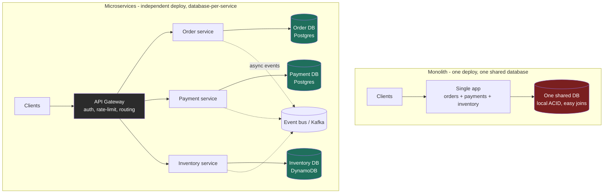
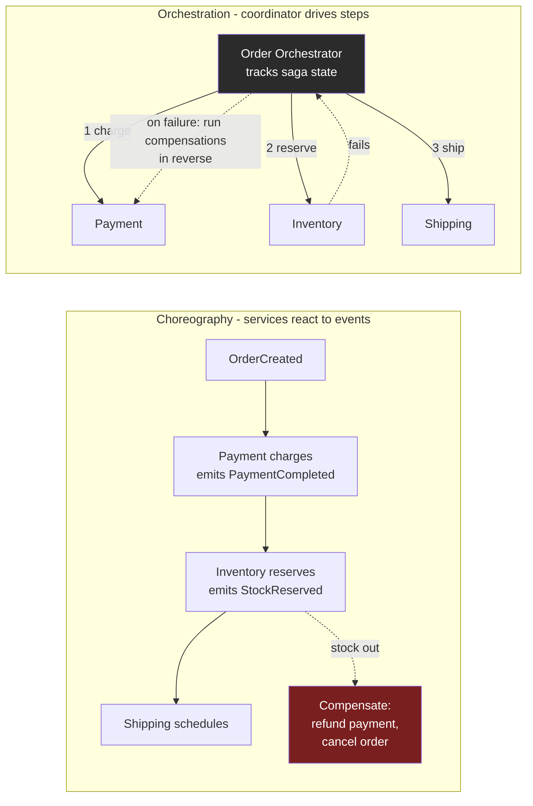

### Learning objectives
- Decide **when microservices earn their cost** and when a modular monolith is the right call, in terms of independent deployability, team autonomy, and fault isolation weighed against the distributed-systems tax.
- Draw service boundaries from **business capability and bounded context**, not from technical layers or table shapes, and recognize both failure sizes: nano-services and the **distributed monolith**.
- Explain **database-per-service** and why it forbids cross-service joins and two-phase commit, then keep data consistent across services with **sagas** (orchestration vs choreography) and the **outbox** pattern.
- Apply the resilience patterns that make a call graph survive partial failure, **timeouts, retries with backoff+jitter, circuit breakers, bulkheads, idempotency**, and name the fallacy each one defends against.

### Intuition first
A microservices system is a **food court**, not one giant restaurant with a single mega-kitchen.

In the mega-restaurant (the **monolith**), every dish is cooked in one kitchen sharing one pantry (one database). It is wonderfully simple: the chef can grab any ingredient and plate a combo order in one motion (an in-process function call, a local transaction). But you cannot renovate the grill without closing the whole restaurant (one deploy ships everything), a fire at the fryer takes down dinner service entirely (one crash, whole system), and you cannot have the sushi team and the pizza team move at different speeds, they share one kitchen and one release.

In the **food court**, each stall owns its own kitchen and its own inventory (**database-per-service**). The noodle stall renovates on Tuesday while pizza keeps serving (**independent deployment**); when the fryer at the burger stall dies, every other stall keeps taking orders (**fault isolation**); the dumpling team hires and moves at its own pace (**team autonomy**). That independence is the entire reason microservices exist.

But the food court is not free. A "combo meal" spanning three stalls now needs a **runner** carrying tickets between them and a rule for what to do when the drink stall is out halfway through (a **saga** with compensating steps, because there is no single cash register that atomically charges all three). And if one stall is slow, customers pile up in front of it and jam the walkways for everyone, unless you post a sign, "this stall is down, skip it" (a **circuit breaker**). Every hard part of this lesson, decomposition, data ownership, cross-service consistency, and resilience, is a literal feature of that food court.

### Deep explanation

#### 1. When microservices earn their cost, and the monolith-first default

Microservices buy exactly four things, and you should be able to name which one you are paying for:

1. **Independent deployability.** Each service ships on its own cadence. A checkout team deploys 20 times a day without a search-team release train. This is the single biggest reason large orgs adopt them, and it is really an **org-throughput** decision, not a technical one.
2. **Team autonomy.** A "two-pizza team" (roughly 6 to 8 people, the Amazon heuristic) owns a service end to end, its language, its schema, its on-call. Coordination cost across teams drops.
3. **Fault isolation.** A memory leak in the recommendations service degrades recommendations, not payments, *if* you wire the resilience patterns below. Without them you get the opposite (see the distributed monolith).
4. **Independent scaling and tech heterogeneity.** Scale the 50k-QPS (queries per second) feed service to 200 nodes while the 100-QPS admin service runs on 2, and let the ML team use Python while payments stays on the JVM.

Against that, the **distributed-systems tax** is real and permanent: a call that was a ~100 ns in-process function is now a ~0.5 to 1 ms network round trip (a ~1000x latency jump and a new failure mode), you lose local ACID (atomicity, consistency, isolation, durability) transactions across services, and you take on service discovery, distributed tracing, versioned contracts, and a much harder debugging story (no single stack trace).

The Director-altitude default is therefore **monolith-first**, or more precisely a **modular monolith**: one deployable, but with hard internal module boundaries and separate schemas per module, so the seams are visible before you pay to make them physical. Amazon, Netflix, and Shopify all began as monoliths and extracted services when a specific module's deploy cadence, scaling profile, or team ownership demanded it. Splitting on day one, before you understand the domain, is how you draw the boundaries in the wrong place and pay the tax with none of the benefit. The rejected alternative, "microservices from the start for a 5-person startup," buys distributed-systems complexity to solve an org-scaling problem you do not yet have.

#### 2. Decomposition, where to draw the boundary

This is the decision that makes or breaks the architecture, and it is a **domain** question, not a technical one.

- **Decompose by business capability / bounded context, not by technical layer.** The wrong cut is horizontal, a "UI service," an "API service," a "database service", because a single feature change then touches all three and they must deploy together (you built a distributed monolith). The right cut is vertical, each service owns a **business capability** end to end: Orders, Payments, Inventory, Shipping, Search. This is **Domain-Driven Design's bounded context**: a boundary inside which a term like "order" has one precise meaning and one owning model. Where two contexts use the same word differently ("order" means a shopping cart to Sales but a fulfillment job to Warehouse), that seam is a natural service boundary.
- **Right-size deliberately.** There are two failure sizes. Too coarse and you have a monolith with network calls in the middle. Too fine and you get **nano-services**: dozens of trivial services where a single user action fans out into a 15-hop synchronous call chain, and the operational and latency cost dwarfs the logic. A good test: a service should own a **cohesive capability and its data**, and a typical feature should be shippable by changing **one** service. If most features touch three services at once, your boundaries are wrong, that coupling is the signal to redraw them (or merge them back).
- **Minimize chatty coupling across boundaries.** If service A cannot do its job without three synchronous calls to service B on every request, A and B are one thing that has been sawed in half. High **cohesion within** a service and **loose coupling between** services is the whole game.

Go deeper - DDD tactical patterns for finding boundaries (IC depth, optional)

- **Ubiquitous language + bounded context:** map where the same word carries different meanings. Each distinct meaning is a candidate context. A **context map** documents the relationships (upstream/downstream, shared kernel, anti-corruption layer).
- **Aggregates** are the transactional unit *inside* a service: a cluster of objects (e.g. `Order` + its `LineItems`) that must stay consistent together and are always saved atomically. Aggregate boundaries often reveal service boundaries, one service typically owns one or a few aggregates.
- **Anti-corruption layer (ACL (access control list)):** when a new service must talk to a legacy or third-party model, an ACL translates the foreign model into your domain's language so the mess does not leak across the boundary.
- **Event storming** is the practical workshop technique: put every domain event on a wall in time order, cluster them, and the clusters surface the bounded contexts and their commands/events.

#### 3. Data ownership, database-per-service

The rule that separates real microservices from a shared-database mess: **each service owns its data privately, and no other service touches its store.** Peers get to the data only through the owning service's API or its published events, never by reading its tables.

Why this matters so much: a **shared database is the tightest coupling that exists.** If two services read and write the same tables, a schema change by one breaks the other, you cannot deploy them independently (the whole point is gone), and one service's runaway query starves the other. Private data per service is what actually delivers independent deployability.

The consequence you must own out loud is severe: **you lose cross-service joins and cross-service ACID transactions.** You can no longer write `SELECT ... JOIN` across Orders and Inventory (they are different databases, possibly different engines, Postgres here, DynamoDB there). And you cannot wrap "charge the card AND reserve stock" in one transaction that rolls back atomically, because no single database sees both. Two-phase commit (2PC) across services is the naive fix and it is **rejected at Director altitude**: it is a synchronous blocking protocol that holds locks across the network, so it multiplies your failure surface and tanks availability (the coordinator becomes a single point of failure that can leave participants locked). Instead you compose the data at read time (each service exposes its slice, the caller or a read model stitches them) and you keep writes consistent with sagas.

#### 4. Consistency across services, sagas and the outbox

Since you have given up the distributed transaction, a business operation that spans services (place order → charge payment → reserve inventory → schedule shipping) becomes a **saga**: a sequence of **local** transactions, one per service, where each step publishes an event that triggers the next, and every step has a **compensating transaction** that semantically undoes it if a later step fails. You do not get atomicity; you get **eventual consistency** with an explicit rollback story. If inventory reservation fails after the card was charged, the saga runs the compensation, **refund the payment**, rather than rolling back a transaction that never existed.

There are two ways to coordinate a saga, and naming the trade is the interview signal:

- **Choreography (event-driven, no central brain).** Each service listens for events and reacts, publishing its own. Payments hears `OrderCreated`, charges, and emits `PaymentCompleted`; Inventory hears that and reserves. Pros: no coupling to a coordinator, each service is autonomous, easy to add a new listener. Cons: the end-to-end flow is **implicit and hard to follow** (no one place shows the whole process), and cyclic event dependencies sneak in. Best for **simple, few-step** flows.
- **Orchestration (a central coordinator).** An **orchestrator** service explicitly issues commands, "charge," then "reserve," then "ship", and tracks saga state, invoking compensations on failure. Pros: the workflow lives in **one readable place**, easier to reason about, monitor, and debug. Cons: the orchestrator is another service to build and can become a smart hub that accretes logic. Best for **complex, many-step** flows with real branching. Durable-workflow engines (Temporal, AWS Step Functions, Camunda) are how teams run these in production so state survives crashes.

One trap sits under every event-driven saga: the **dual-write problem.** A service must both commit its local DB change *and* publish an event, and those are two systems, so a crash between them loses the event (DB updated, no event) or lies (event sent, DB rolled back). The fix is the **transactional outbox**: write the event into an `outbox` table **in the same local transaction** as the state change, then a separate relay (polling or change-data-capture off the DB log) publishes outbox rows to the broker. Now the event and the state change commit atomically, and delivery is **at-least-once**, which is exactly why every consumer must be **idempotent** (dedupe on the business key, because the same event will occasionally arrive twice).

#### 5. Cross-cutting infrastructure, the substrate

A handful of shared components keep a fleet of services operable. Keep these at the "know what and why" altitude:

- **API gateway** at the edge: one front door for external clients that handles auth, rate limiting, TLS termination, and routing/aggregation, so clients do not talk to 40 services directly and cross-cutting concerns live in one place. (A per-client variant is the backend-for-frontend.)
- **Service discovery:** services come and go and change IPs constantly, so callers resolve "the payments service" through a registry (Consul, Eureka, or Kubernetes DNS/Services) rather than hardcoding hosts.
- **Service mesh (sidecar proxy, e.g. Envoy under Istio or Linkerd):** pushes retries, timeouts, mutual-TLS, circuit breaking, and traffic-shaping *out of app code* into a sidecar proxy next to every service, so the resilience policy below is enforced uniformly and language-agnostically. The cost is real operational complexity, adopt it when you have enough services that per-service resilience code becomes unmanageable, not on day one.

#### 6. Resilience, defending against the fallacies of distributed computing

The classic **fallacies of distributed computing** ("the network is reliable, latency is zero, bandwidth is infinite...") are exactly the false assumptions a monolith let you make and a service call cannot. Each resilience pattern defends against one:

- **Timeouts** on every remote call. A call with no timeout waits forever on a dead peer and pins the thread. Defends against "latency is zero / the network is reliable." Set it from the callee's p99, not a random 30 s.
- **Retries with exponential backoff + jitter** for transient failures, bounded (2 to 3 attempts) and **only for idempotent operations**. Naive fixed-interval retries from thousands of callers create a synchronized **retry storm** that DDoSes a recovering service, jitter de-synchronizes them.
- **Circuit breaker.** Wrap calls to a dependency; when the failure rate crosses a threshold (say >50% of the last 20 calls), the breaker **trips open** and calls fail fast (or serve a fallback) instead of piling up waiting on a sick service. After a cooldown it goes **half-open**, lets a trickle through, and closes if they succeed. This is the single most important pattern for stopping **cascading failure**, the food-court sign that says "skip this stall." Netflix's Hystrix popularized it; resilience4j and Envoy implement it today.
- **Bulkhead.** Isolate resources (separate connection/thread pools per dependency) so that one slow dependency exhausting its pool cannot starve calls to healthy dependencies, like watertight compartments in a ship's hull.
- **Idempotency** everywhere, because at-least-once delivery and retries guarantee duplicates. Dedupe on a business key or idempotency token so "charge order 123" applied twice charges once.

Skip these and you build the thing microservices were supposed to prevent: a **distributed monolith**, services that must deploy together, share a database, or chain synchronously, so one service's failure cascades to all of them. You paid the full distributed tax and got none of the isolation. That anti-pattern, not "too many services," is the most common way microservices fail in practice.

### Diagram: monolith vs microservices (private data + gateway)

### Diagram: order saga, choreography vs orchestration (with compensation)

### Worked example: decomposing an e-commerce checkout
Take the mega-restaurant checkout monolith and open the food court. The domain has clear bounded contexts, so the boundaries almost draw themselves: **Order, Payment, Inventory, Shipping**, each owning its own database.

- **Boundaries from capability.** Order owns the order lifecycle and its `orders` table; Payment owns transactions and talks to Stripe; Inventory owns stock counts (in DynamoDB for high-write availability); Shipping owns fulfillment. Each is a two-pizza team's world. We reject a "database service" or "validation service", those horizontal cuts would force every feature to deploy three services at once.
- **Data ownership.** Order cannot `JOIN` against Inventory's stock table, they are different stores. To show "in stock" on the order page, Order calls Inventory's API or keeps a **read model** updated from Inventory's `StockChanged` events. We accept the eventual-consistency window (the badge can be a second stale) to keep the services independently deployable.
- **The write is a saga, not a transaction.** "Place order" spans four services, so there is no 2PC. We run an **orchestrated saga** (the flow is complex enough that one readable coordinator beats implicit choreography): charge payment → reserve inventory → schedule shipping, tracked in a durable workflow (Temporal / Step Functions). If **inventory reservation fails after the charge**, the orchestrator runs the **compensation**, refund the payment and mark the order cancelled, reaching a consistent end state without ever having had a distributed transaction.
- **No dual-write bug.** Payment writes its `charged` row and the `PaymentCompleted` event in **one local transaction** via the **outbox** table; a CDC relay publishes it to Kafka at-least-once. Inventory's consumer is **idempotent** on `order_id`, so a redelivered event reserves stock once.
- **Resilience on the seams.** Order's call to Payment has a **timeout** (~500 ms, from Payment's p99), **2 retries with jittered backoff**, and a **circuit breaker** that trips if Payment's failure rate crosses 50 percent, so a Stripe outage fails checkout fast with a "try again" instead of piling up threads and taking down the Order service too. A **bulkhead** keeps the Payment connection pool separate from the Inventory pool.

The signal is not "I used microservices." It is that **each boundary followed a bounded context, each service owned its data, the cross-service write became a saga with a named compensation, and every remote call carried a timeout, a bounded retry, and a breaker.**

### Trade-offs table: monolith vs modular monolith vs microservices
| Dimension | **Monolith** | **Modular monolith** | **Microservices** |
|---|---|---|---|
| Deploy unit | one artifact, all-or-nothing | one artifact, hard internal modules | many, independent per service |
| Data | one shared DB, easy joins + ACID | one DB, schema-per-module | **database-per-service**, no cross-service join/2PC |
| Cross-op consistency | local transaction | local transaction | **saga** + eventual consistency |
| Team scaling | contention on one codebase | lower contention | high autonomy, per-team ownership |
| Fault isolation | weak (one crash, all down) | weak (shared process) | **strong** (if resilience wired) |
| Latency | in-process (~100 ns calls) | in-process | network hops (~1 ms each), multiplies down a chain |
| Ops complexity | low | low-medium | **high** (discovery, tracing, mesh, versioning) |
| **Use when** | small team, early domain, one deploy cadence | domain still forming but you want visible seams | many teams, divergent scaling/deploy cadence, and you can afford the tax |

### Trade-offs table: choreography vs orchestration
| | **Choreography** | **Orchestration** |
|---|---|---|
| Control | decentralized, services react to events | central coordinator issues commands |
| Visibility of flow | implicit, spread across services (hard to trace) | explicit, one readable place |
| Coupling | loose, easy to add a listener | services coupled to the orchestrator |
| Failure handling | each service knows its own compensation | coordinator runs compensations in order |
| **Use when** | few steps, simple flow | many steps, branching, needs monitoring/audit |

### What interviewers probe here
- **"Should this even be microservices?"** - *Strong:* leads with **monolith-first / modular monolith**, names the real driver (independent deploy + team autonomy at org scale) and the tax (network latency, lost ACID, ops burden); splits only where a module's cadence, scaling, or ownership demands it. *Red flag:* "microservices are modern / more scalable," reaching for them by default for a small team.
- **"Where do you draw the boundaries?"** - *Strong:* by **business capability / bounded context**, one service owns a capability and its data, a typical feature ships by changing one service; calls out nano-services and the distributed monolith as the two failure sizes. *Red flag:* cutting by technical layer (UI/API/DB services) or one-service-per-table.
- **"How do two services share data / stay consistent?"** - *Strong:* **database-per-service**, no shared tables, no cross-service join; consistency via **saga** (names orchestration vs choreography and the compensating transaction), and explicitly **rejects 2PC**. *Red flag:* a shared database, or promising cross-service ACID.
- **"A service both updates its DB and emits an event, how do you not lose the event?"** - *Strong:* the **dual-write problem**, solved with the **transactional outbox** (+ CDC relay), at-least-once delivery, idempotent consumers. *Red flag:* "update the DB then call the broker," unaware of the crash window.
- **"One service gets slow, how do you stop it taking down the rest?"** - *Strong:* **timeout + bounded jittered retry + circuit breaker + bulkhead**, fail fast, isolate pools, name the cascading-failure / distributed-monolith risk. *Red flag:* unbounded synchronous calls with no timeout or breaker, "we'd just add retries" (a retry storm).

### Common mistakes / misconceptions
- **The distributed monolith.** Services that share a database, must deploy together, or chain synchronously, all the distributed tax, none of the independence. The most common real-world failure, and it comes from bad boundaries plus missing resilience.
- **Boundaries by technical layer or table.** A "UI service" and a "DB service," or one service per table, force cross-service coordination for every change. Cut by capability, not by tier.
- **Shared database across services.** The tightest coupling there is; it silently kills independent deployability. Private data per service is non-negotiable.
- **Assuming exactly-once / cross-service transactions.** There is no 2PC in practice; it is sagas + eventual consistency + idempotent, at-least-once consumers. Expecting distributed ACID is the give-away.
- **Synchronous call chains with no breakers.** A 5-hop sync chain multiplies latency (5 x 50 ms) and failure (availability is the product, ~99.5% at 99.9%/hop); without timeouts and circuit breakers, one slow dependency cascades into a full outage.

### Practice questions
**Q1.** A 6-person startup asks whether to build their new product as microservices "to scale later." What do you advise?
> *Model:* Start with a **modular monolith**, one deployable with hard internal module boundaries and a schema per module. At 6 people you have no team-autonomy or independent-deploy problem to solve, and the domain is still forming, so microservices would only buy you network latency, lost local transactions, and a discovery/tracing/mesh operational burden. The modular monolith makes the seams **visible** so that when a specific module later needs its own deploy cadence or scaling profile, you extract *that* service along a boundary you now actually understand. Splitting on day one draws the boundaries blind and is the fast path to a distributed monolith.

**Q2.** Two services, Orders and Inventory, need each other's data. A junior engineer proposes giving both read access to a shared `products` table. What is wrong and what do you do?
> *Model:* A shared table is the tightest possible coupling: a schema change by either breaks the other, they can no longer deploy independently (the entire point of splitting), and one service's heavy query starves the other. Fix: **one service owns the data**; the other gets it through the owner's **API** or by subscribing to its **events** and keeping a local **read model** (accepting a small eventual-consistency lag). No service reaches into another's store. If they genuinely cannot be untangled and always change together, that is a signal they are *one* bounded context and should be one service, not two.

**Q3.** Walk me through placing an order that must charge a card and reserve stock across two services, with no distributed transaction. What happens if the reserve fails?
> *Model:* Model it as a **saga** of local transactions. Order starts it; Payment charges (local txn) and, via the **outbox**, atomically emits `PaymentCompleted`; Inventory consumes it (idempotent on `order_id`) and tries to reserve. If the **reserve fails**, the saga runs the **compensating transaction**: refund the payment and mark the order cancelled, reaching a consistent end state. I would use an **orchestrated** saga (Temporal / Step Functions) so the flow and its compensations live in one auditable place. I explicitly avoid **2PC**, it holds cross-network locks and turns the coordinator into a single point of failure that can leave services locked. The guarantee is **eventual** consistency with an explicit rollback path, not atomicity.

**Q4.** During a Stripe slowdown, your entire checkout goes down, not just payments. Diagnose and fix.
> *Model:* This is **cascading failure**: Order calls Payment synchronously with (likely) no timeout, so threads pile up waiting on the slow dependency, exhaust Order's pool, and Order stops serving, a distributed monolith failure mode. Fix on the seam: a **timeout** derived from Payment's p99, **bounded retries with jittered backoff** (idempotent only), and a **circuit breaker** that trips when Payment's failure rate crosses a threshold so calls **fail fast** (or return a "try again shortly" fallback) instead of blocking. Add a **bulkhead** so the Payment pool is isolated from other dependencies. Now a Payment outage degrades *payments*, and the rest of checkout stays up.

**Q5.** How do you know your service boundaries are wrong?
> *Model:* The tell is **coupling that shows up as coordination**: most features require changing several services together and deploying them in lockstep; service A cannot serve a request without several synchronous calls to B on every hit; teams are constantly blocked on each other's releases; or you find a shared database. Any of these means you drew the boundary through the middle of one cohesive capability. The fix is to **redraw along bounded contexts**, often *merging* over-split services back together (fighting nano-services), until a typical feature ships by changing one service and cross-service chatter is the exception, not the rule.

### Key takeaways
- Microservices buy **independent deployability, team autonomy, and fault isolation** at the cost of a permanent **distributed-systems tax** (network latency, lost local ACID, ops burden). Default to a **modular monolith** and extract services only where cadence, scaling, or ownership demands it.
- Draw boundaries by **business capability / bounded context**, not technical layer or table; a typical feature should ship by changing **one** service. The two failure sizes are **nano-services** and the **distributed monolith**.
- **Database-per-service** is non-negotiable, it is what delivers independent deployability, and it forbids cross-service joins and 2PC. Compose data at read time; keep writes consistent with **sagas**.
- Cross-service consistency is **eventual**: a saga is local transactions plus **compensating transactions**, coordinated by **choreography** (few steps) or **orchestration** (complex flows); solve the dual-write problem with the **outbox** pattern and idempotent, at-least-once consumers.
- Every remote call needs **timeout + bounded jittered retry + circuit breaker + bulkhead + idempotency**, or partial failure cascades and you have built a distributed monolith, the most common way microservices actually fail.

> **Spaced-repetition recap:** Food court, not a mega-restaurant. Each stall owns its kitchen and pantry (**database-per-service**), renovates on its own schedule (**independent deploy**), and survives a neighbor's fryer fire (**fault isolation**), but a combo order across stalls needs a runner with a rollback rule (**saga** + compensating transaction, because there is no shared register / no 2PC), and a slow stall needs a "skip me" sign (**circuit breaker**) so it does not jam the whole court (**cascading failure / distributed monolith**). Cut boundaries by **bounded context**, not by layer; default to a **modular monolith** and split only when org scale demands it; write events via the **outbox** and consume them idempotently at-least-once.
