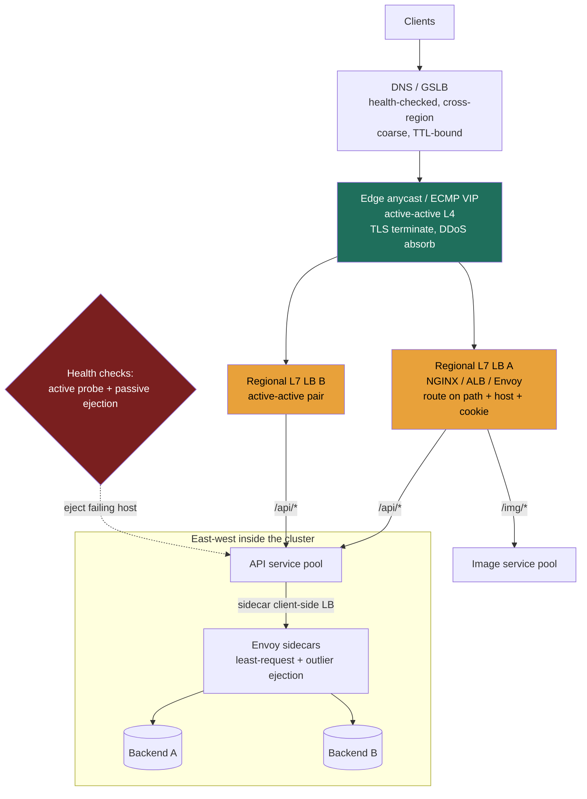

import LoadBalancerComparison from '@components/widgets/LoadBalancerComparison.jsx';

### Learning objectives
- Distinguish **L4** (transport) from **L7** (application) load balancing by exactly what each layer can *see* and therefore *route on*, and price the difference.
- Choose a balancing algorithm — round-robin, weighted, least-connections, least-response-time, IP/consistent hash — from the failure mode you are defending against, not by reflex.
- Reason about **health checks** (active vs passive / outlier ejection) and **sticky sessions vs stateless**, and name what each costs you on failover.
- Treat the load balancer as a **single point of failure** and make it HA (active-passive with a floating VIP, active-active via ECMP/anycast, DNS/GSLB) — and place LBs correctly across the request path (edge, internal, service mesh).

### Intuition first
A load balancer is the **host at the door of a busy restaurant**. Diners (requests) arrive; the host seats them across the open tables (servers) so no waiter is slammed while another idles.

How much the host *knows* changes what they can do. A **basic host** glances at the door, counts heads, and sends the next party to the next free table in rotation — fast, but they never look at *what* the party wants. That is **L4**: it sees the connection (who is at the door, which table) but not the order. A **maître d' who reads the reservation** can route the steakhouse party to the grill section and the dessert-only party to the patio — richer decisions, but they had to stop and read each ticket. That is **L7**: it opens the request, reads the URL and headers, and routes on *content* — at the cost of doing real work per request.

Two more instincts the host needs. They must notice when **a section's kitchen is backed up** and stop seating it (a health check / outlier ejection), or every new party walks into a stalled section. And if a party is mid-meal, you usually want them to **stay at the same table** rather than be moved (a sticky session) — unless the restaurant is designed so any table can pick up any meal (stateless), in which case moving them costs nothing. Finally: if there is **only one host and they go home sick, the whole restaurant jams at the door.** The load balancer that protects everything is the thing most able to take everything down — so the real work is making the host redundant.

### Deep explanation

**L4 vs L7 — the dividing line is what the device can see.** The OSI layer the balancer operates at determines what fields it can read, which determines what it can route on and how much it costs per request.

- **L4 (transport): routes on the connection 4-tuple** — source IP, source port, destination IP, destination port — plus protocol (TCP/UDP). It does **not** parse HTTP; it cannot see a URL path, a `Host` header, a cookie, or a method. It typically does **connection-level pass-through** (or NAT): pick a backend once at connect time, then shovel bytes. Because it does almost no per-packet work, it is **extremely fast and cheap** — single-digit microseconds of added latency, millions of concurrent flows on one box, line-rate throughput. Examples: **AWS Network Load Balancer (NLB)**, **HAProxy in TCP mode**, **LVS/IPVS**, Google's **Maglev**. This is your tool when you need raw throughput, non-HTTP protocols (gRPC-over-TCP framing aside, plain TCP/UDP, MQTT, database connections), or TLS *pass-through* where the backend must terminate.
- **L7 (application): terminates the connection, parses the protocol, routes on content** — `Host`, URL path, method, headers, cookies, even the body. This unlocks **content-based routing** (`/api/*` to one pool, `/img/*` to another, `mobile.*` host to a third), **TLS termination** at the edge, header injection (`X-Forwarded-For`, request IDs), retries, rate limiting, and request-level observability. The cost: it must do a TCP+TLS handshake and parse every request, so it adds **hundreds of microseconds to low single-digit milliseconds** per request and handles **fewer requests per box** than an L4 device. Examples: **AWS Application Load Balancer (ALB)**, **NGINX**, **HAProxy in HTTP mode**, **Envoy**. (Aside: AWS's **Gateway Load Balancer** is an L3 construct for inserting virtual appliances — firewalls/IDS — not a general app balancer.)

The Director-altitude statement: *L4 is a fast switchboard that knows who's calling; L7 is a receptionist who reads the message and routes on its contents.* You **reject L7 when** you don't need content routing and the per-request CPU/latency tax isn't worth it (a pure TCP service, a UDP game server, or a TLS-passthrough requirement) — L4 is cheaper and faster. You **reject L4 when** the routing decision lives inside the request (path/host/cookie), or you want TLS termination, retries, and HTTP-aware health checks at the balancer. A very common real topology is **both, in series**: an L4 device fans connections to a fleet of L7 proxies, which then do the smart routing — you get L4's throughput at the front and L7's intelligence behind it.

**The balancing algorithms — and the failure mode each one is for.** Picking an algorithm is picking what you optimize when servers are *not* identical.

- **Round-robin:** server = `i mod N`. Cycles servers in order. Even request *counts*, zero state, trivial to reason about. **Blind to load** — a slow or half-dead backend keeps getting its full share. Fine when servers are homogeneous and request cost is uniform.
- **Weighted round-robin:** each server appears proportional to a static **weight** (capacity). Sends more to a 32-vCPU box than a 8-vCPU box. Still blind to *live* load and to a server silently struggling — weights are config, not measurement. Use it for **known, fixed heterogeneity** (mixed instance types).
- **Least-connections:** route to the server with the fewest in-flight requests *right now*. The first algorithm here that **adapts to uneven request duration** — if one backend's requests stack up (a slow disk, a GC pause, a degraded dependency), it stops getting new work and the pool self-heals. Cost: the LB must track live per-server connection counts. Default choice when request durations vary or backends are flaky.
- **Least-response-time (a.k.a. least-time):** route on a blend of in-flight count *and* measured latency — NGINX Plus's `least_time` factors in an EWMA of response time; Envoy's `LEAST_REQUEST` uses power-of-two-choices on active request count. Catches a server that is *up and accepting connections but answering slowly* — which least-connections alone can miss. Cost: more state and tuning. Use when tail latency matters and "connected" isn't the same as "healthy."
- **IP hash / consistent hash:** server = `hash(key) mod N`, where the key is source IP, a header, or a cookie. Same key always lands on the same server → **stickiness for free** (session affinity, cache locality). Two costs: a **skewed key** (a celebrity user, one hot IP behind a corporate NAT) pins disproportionate traffic to one server and **hot-spots** it; and **plain `mod N` reshuffles *every* key when N changes** (a deploy, an autoscale event), blowing every cache and session. That second cost is exactly why you reach for a **consistent-hashing ring** (Module 2.6) — it bounds the remap to roughly `1/N` of keys instead of all of them.

There is **no "best" algorithm.** The signal is matching the algorithm to the failure you're defending: uneven duration / flaky backends → least-connections or least-response-time; fixed capacity skew → weighted; session or cache affinity → hashing, with a ring to survive resizing.

**Health checks — how the LB knows a backend is dead, and the two flavors.**

- **Active health checks:** the LB **probes** each backend on an interval (e.g., `GET /healthz` every 5s, mark unhealthy after 3 consecutive failures, healthy again after 2 successes). Simple, predictable, but it tests a synthetic path, adds probe traffic, and reacts on a delay (3 × 5s = 15s to eject). Always make the health endpoint a **deep-ish** check (can it reach its DB?) but **not so deep** that one slow dependency marks the whole fleet unhealthy and you brown out.
- **Passive health checks / outlier ejection:** the LB watches **real traffic** and ejects a backend that is actually failing — e.g., Envoy's *outlier detection* ejects a host after **5 consecutive 5xx** (or gateway failures), for a **base ejection time (say 30s) that grows with each repeat ejection**, and caps how much of the pool (`max_ejection_percent`) can be ejected at once so you don't eject everything during a global incident. This reacts to *what users actually see* and is faster than waiting for the next probe. Best practice is **both**: active to catch a backend that's down but receiving no traffic, passive to catch one that's up but erroring.

**Sticky sessions vs stateless — and why stateless wins at scale.** "Sticky" means a client is pinned to one backend across requests, two ways: **source-IP affinity** (L4; breaks behind NAT/CGNAT where thousands share an IP, and shifts on IP change) or **cookie-based** (L7; an app cookie or an LB-generated cookie like `AWSALB`/NGINX `sticky`). Stickiness exists because the backend holds **session state in local memory** (a logged-in session, an in-progress upload). The costs are real: **uneven load** (a sticky popular server can't shed), and a **brutal failover** — when that backend dies, **every session pinned to it is lost**, and autoscaling/deploys are disruptive because you can't freely move traffic. The architecturally cleaner answer is **stateless backends**: externalize session state to a shared store (**Redis/Memcached**, or a signed **JWT** the client carries), so *any* backend can serve *any* request. Then round-robin or least-connections is enough, failover loses nothing, and you scale by just adding boxes. The Director call: **prefer stateless; treat stickiness as a temporary crutch** for a legacy app you haven't externalized yet, and name the failover cost you're carrying until you do.

**The LB is a single point of failure — making it HA.** A single load balancer in front of N redundant servers means you took N redundant servers and put **one** thing in front of all of them that can take them all down. You must make the LB itself redundant. Three patterns, escalating:

- **Active-passive (failover pair):** two LBs share a **floating virtual IP (VIP)**; **VRRP/keepalived** heartbeats between them, and if the active dies the passive **claims the VIP** (gratuitous ARP) in **1–3 seconds**. Simple and battle-tested, but **half your LB capacity sits idle** as standby, and there's a brief failover gap. Good for a single data center.
- **Active-active via ECMP / anycast:** advertise the **same IP from multiple LBs** and let the network's **ECMP** (equal-cost multi-path, hashing flows across routers) or **BGP anycast** spread traffic across all of them — all boxes serve, capacity scales horizontally, and a dead LB simply stops being routed to. This is how Google's **Maglev** and edge networks like **Cloudflare/Fastly** run. Cost: it needs **BGP/network control** you may not have outside a cloud or your own backbone, and care so that **rehashing on membership change doesn't break live connections** (Maglev's consistent hashing exists precisely to minimize that).
- **DNS / GSLB:** hand out **multiple A/AAAA records** (or use a **health-checked GSLB** like **Route 53** / NS1 / Akamai) so clients resolve to different/region-local LBs. This is the only layer that balances **across regions** and survives a whole-site loss. Cost: **DNS TTL caching** means failover is **slow and partial** (clients keep using a cached dead record until the TTL — often 30–60s+ — expires), so DNS is a *coarse* layer used **above** a fast in-region LB, never as your only failover.

The real-world stack uses all three by altitude: **DNS/anycast at the global edge → active-active L7 LBs per region → an internal LB (or mesh) east-west.**

**Where LBs sit in the request path.** Same component, different jobs at different depths:
- **Edge / global:** anycast + GSLB terminate TLS close to users, balance across regions, absorb DDoS. (Often fronted by a CDN — Module 3.5.)
- **Regional / north-south:** the public-facing L7 LB (ALB/NGINX/Envoy) doing path/host routing into your services.
- **Internal / east-west:** service-to-service balancing inside the cluster.
- **Service mesh (client-side LB):** instead of a central internal LB, an **Envoy sidecar** next to each pod balances outbound calls itself, driven by a control plane (Istio). This removes the extra network hop and central choke point of a middle-proxy and gives per-call retries, circuit breaking, and outlier ejection **everywhere** — at the cost of running a mesh (a sidecar per pod, ~tens of MB RAM and some latency each, plus real operational complexity). The trade vs a **central internal LB**: the mesh is more scalable and granular but heavier to operate; you reject it when a simple internal LB suffices and you don't want to run a control plane.

### Diagram — L4/L7 split and where LBs sit in the path

### Interactive widget — the algorithms on one fixed stream

<LoadBalancerComparison client:load />

This widget runs **one fixed stream of 120 requests** through all four algorithms — round-robin, weighted RR, least-connections, and IP/key hash — so the comparison is exact rather than anecdotal. The bars show **live (active) connections** per backend, with `peak/avg` quantifying imbalance. The key move: **pause mid-stream and switch algorithm** — the *same* requests re-route, so you see the precise difference. Flip the preset to **"Skewed key + 1 slow server,"** where one backend is degraded (it holds each request 3× longer) and ~45% of traffic funnels onto one hot key. Watch round-robin and weighted RR keep feeding the degraded server until its in-flight requests pile into the red, then switch to **least-connections** on the same stream and watch the bars flatten as it routes around the backup — and switch to **hash** and watch the hot key slam its own server regardless of load. Move the **N slider** under hash to see plain `mod N` reshuffle every key on resize (the disruption a consistent-hashing ring exists to bound). Under the **uniform/healthy** preset, round-robin and least-connections become nearly indistinguishable — the lesson that an adaptive algorithm buys you nothing until servers actually differ.

### Worked example — a photo-sharing app's front door

Take a service at **50,000 requests/second**, mixed traffic: HTML pages, a JSON API, and large image GETs/uploads, with logged-in sessions, served from 3 regions.

- **Edge:** **anycast + Route 53 latency-based GSLB** routes each user to their nearest region and survives a region loss; TLS terminates here. Rejected alternative: a single region with DNS round-robin — fails the cross-region availability and latency requirements, and DNS TTLs make failover too slow to be the *only* mechanism.
- **Regional north-south:** an **active-active pair of L7 LBs** (ALB or NGINX) per region behind an **ECMP VIP**. L7 is required because routing is **content-based** — `/api/*` → the API pool, `/img/*` → the image pool, `Host: upload.*` → the upload pool — and we want TLS termination and HTTP health checks here. Rejected: a pure L4 LB — it can't see the path, so it can't split API from image traffic; we'd lose content routing and per-request observability. Active-active over active-passive because at 50k rps we won't leave half our LB capacity idle as a cold standby.
- **Algorithm:** **least-connections** (or least-response-time) for the API and image pools, because image uploads have **wildly uneven durations** — a 20 MB upload ties up a backend far longer than a 2 KB API call, and least-connections keeps long requests from stacking on one box. Round-robin is rejected here precisely because it's blind to that duration skew. For an internal **cache tier**, **consistent hashing on the object key** instead, for cache locality — with a ring so an autoscale event remaps only `~1/N` of keys, not all of them.
- **Sessions:** **stateless** — session state in **Redis**, JWT for the client — so any API backend serves any request, failover loses nothing, and we autoscale freely. Sticky sessions are rejected: with uneven upload load they'd worsen imbalance, and losing a backend would drop every session pinned to it.
- **Health:** **active** `GET /healthz` (deep enough to check Redis/DB reachability) **plus passive outlier ejection** (eject a backend after 5 consecutive 5xx for a growing base time, capped at `max_ejection_percent` so a global dependency blip can't eject the whole pool and take the site down).

Every choice falls out of the **requirements** — content routing (R), 50k rps and uneven duration (E), cross-region availability — which is why you pin those down first.

### Trade-offs table — L4 vs L7 vs service-mesh client-side LB

| Dimension | **L4 (NLB / IPVS)** | **L7 (ALB / NGINX / Envoy)** | **Service mesh (Envoy sidecar)** |
|---|---|---|---|
| Routes on | IP + port (4-tuple) | path, host, header, cookie | same as L7, **per service-to-service call** |
| Per-request cost | microseconds, line-rate | 100µs–few ms, fewer rps/box | L7 cost **+ a sidecar per pod** |
| Content routing / TLS term | no | yes | yes |
| Topology | central, north-south | central, north-south | **decentralized, east-west** |
| Failover/retry granularity | connection | request | per call, everywhere (circuit-break) |
| Op cost | lowest | moderate | **highest** (control plane + sidecars) |
| **Use when…** | raw throughput, non-HTTP, TLS passthrough | content routing, TLS, HTTP health/retries at the edge | many services, want per-call resilience and no central choke — and can afford a mesh |

### What interviewers probe here
- **"L4 or L7 in front of this — which and why?"** — *Strong signal:* ties the choice to *what the routing decision depends on* (content → L7; pure throughput/non-HTTP/TLS-passthrough → L4), names the per-request cost of L7, and may propose L4→L7 in series. *Red flag:* "use a load balancer" with no L4/L7 distinction, or "L7 is always better" with no cost awareness.
- **"How do you make the LB not a single point of failure?"** — *Strong:* names active-passive (VRRP/floating VIP) vs active-active (ECMP/anycast) and DNS/GSLB *by altitude*, and that DNS failover is TTL-bound and coarse. *Red flag:* adds a second LB but never explains how traffic fails over to it, or thinks "the LB makes it HA" while it's itself unreplicated.
- **"Which algorithm, and what does it cost you?"** — *Strong:* picks for the failure mode (uneven duration → least-conn/least-time; affinity → consistent hash with a ring; fixed capacity skew → weighted) and names the cost (state to track, hot-spotting, remap-on-resize). *Red flag:* "round-robin" by default with no awareness it's blind to load.
- **"Sticky or stateless?"** — *Strong:* prefers stateless (externalize to Redis/JWT), names the failover cost of stickiness (sessions die with the backend) and treats sticky as a legacy crutch. *Red flag:* reaches for sticky sessions as the *design*, unaware of the failover and imbalance cost.
- **"How does the LB know a backend is unhealthy?"** — *Strong:* active probe **and** passive outlier ejection, with ejection caps so a global blip can't eject everything. *Red flag:* assumes a dead backend is detected instantly, or has no ejection cap.

The through-line at Director altitude: **cost, risk, and delegation.** You're expected to name the per-request CPU tax of L7, the idle-capacity cost of active-passive, the failover blast radius of stickiness — and to say "I'd have the platform team benchmark NGINX vs Envoy for our path-routing rules; my prior is Envoy for the mesh integration" rather than tuning a config yourself.

### Common mistakes / misconceptions
- **Treating the LB as automatically HA.** It's the most concentrated single point of failure you have; it needs its own redundancy (VIP failover, anycast) and that's where outages actually happen.
- **Defaulting to round-robin** when request durations are uneven — long requests stack on one box; least-connections/least-response-time exist for exactly this.
- **Confusing "load balancing" with "content routing."** Only L7 can route on path/host/cookie; an L4 LB physically cannot see them.
- **Designing around sticky sessions** instead of going stateless — you inherit lossy failover, uneven load, and disruptive deploys.
- **Plain `mod N` hashing for affinity** — every resize reshuffles every key and blows all caches/sessions; use a consistent-hash ring.
- **Health checks too shallow or too deep** — a shallow check (TCP connect) misses a broken app; an over-deep check marks the whole fleet unhealthy when one shared dependency hiccups.
- **Relying on DNS for fast failover** — TTL caching means clients keep hitting a dead record for the TTL window; DNS is coarse, used above a fast in-region LB.

### Practice questions

**Q1.** You front 200 stateful app servers with a single load balancer using sticky sessions. Walk me through what happens when (a) one app server dies and (b) the load balancer dies — and how you'd fix both.
> *Model:* (a) Every session **pinned to that server is lost** — those users are logged out / lose in-progress work — and the LB reshuffles their stickiness to other servers, which may now be unevenly loaded. Fix: go **stateless** — move session state to **Redis** (or a signed JWT), so any server serves any user and a server death loses nothing. (b) The single LB is a **total outage** — all 200 servers are unreachable behind it. Fix: make the LB HA — an **active-passive pair with a floating VIP via keepalived** (1–3s failover) for one DC, or **active-active behind an ECMP/anycast VIP** so a dead LB just stops being routed to with no standby idle. Both fixes attack a different SPOF: stickiness makes the *backend* failure lossy; the single LB makes the *front door* a SPOF.

**Q2.** A team puts an L7 load balancer in front of a high-throughput plain-TCP service (a custom binary protocol / a database connection pool) and complains latency and CPU are higher than expected. What's going on and what would you change?
> *Model:* The L7 LB is **terminating TLS and trying to parse every request** to make a routing decision it doesn't actually need — the service has no path/host routing, it just needs connections spread across backends. That work is the added latency and CPU (and for a non-HTTP protocol the L7 parsing is wasted entirely). Switch the front to an **L4 LB (NLB/IPVS)** that routes on the 4-tuple at near-line-rate with microseconds of overhead, or use TLS **passthrough** so backends terminate. Keep L7 only where you genuinely route on content. The principle: **don't pay L7's per-request tax for a decision that lives at L4.** (Caveat: this reasoning is specific to short-lived or one-request-per-connection traffic. For **HTTP/2 / gRPC**, a single long-lived connection multiplexes many calls, so an L4/connection-level LB pins them all to one backend and never rebalances — there you want **L7 or client-side (mesh) balancing** precisely so each *call* is balanced.)

**Q3.** You're balancing across backends where one node has silently degraded — it still accepts connections but answers 3× slower. Which algorithms cope and which don't, and what else do you add?
> *Model:* **Round-robin** and **weighted RR** *don't* cope — they're blind to live load and keep sending the degraded node its full share, so its in-flight requests pile up. **Least-connections** copes: in-flight requests stack on the slow node, its active count rises, and the algorithm stops routing to it — the pool self-heals. **Least-response-time** copes even better because it reacts to *latency*, not just connection count, catching a node that's slow before connections fully back up. Add **passive outlier ejection** (eject after N consecutive 5xx / on a latency threshold) so a node that's not just slow but erroring is removed entirely — with a `max_ejection_percent` cap so a global slowdown doesn't eject the whole fleet.

**Q4.** Justify your load-balancer high-availability design for a 3-region service to a skeptical architect, and name the failure each layer covers and its cost.
> *Model:* **Three layers by altitude.** *DNS/GSLB (Route 53, health-checked, latency-based):* the only layer that survives a **whole-region loss** and routes users to their nearest region — *cost:* TTL caching makes it **coarse and slow** to fail over, so it's never the only mechanism. *ECMP/anycast active-active L7 LBs per region:* survives **a single LB failure** within a region with no idle standby and scales horizontally — *cost:* needs BGP/network control and care that membership changes don't reset live flows (consistent hashing mitigates). *Active-passive could replace active-active per region* — simpler, but **half the LB capacity sits idle** and there's a failover gap, which I reject at this scale. Net: DNS covers region loss, anycast covers LB-node loss, and the in-region L7 pool covers backend loss via health checks — each layer's blast radius is bounded by the one above it.

### Key takeaways
- **L4 sees the connection (4-tuple), L7 sees the content (path/host/cookie).** L4 is microsecond-cheap and high-throughput; L7 costs hundreds of µs–ms per request to buy content routing, TLS termination, and HTTP-aware health/retries. Often run both in series.
- **Pick the algorithm for the failure mode:** uneven duration / flaky backends → least-connections or least-response-time; fixed capacity skew → weighted; affinity → consistent hash with a **ring** (plain `mod N` remaps every key on resize). There is no universally best one.
- **Use active health checks *and* passive outlier ejection** — probe for down-but-idle backends, eject on real 5xx/latency for up-but-broken ones, and **cap ejection** so a global blip can't eject the whole pool.
- **Prefer stateless backends (session in Redis/JWT) over sticky sessions** — stickiness makes failover lossy, load uneven, and deploys disruptive; treat it as a legacy crutch and name the cost.
- **The LB is your most concentrated SPOF.** Make it HA by altitude: active-passive (VIP/keepalived) in one DC, active-active (ECMP/anycast) for scale, DNS/GSLB across regions — knowing DNS failover is TTL-bound and coarse.

> **Spaced-repetition recap:** Host at the restaurant door. L4 = sees the connection (fast, cheap, no content routing); L7 = reads the request (path/host/cookie, TLS, retries — costs CPU/latency). Match the algorithm to the failure (least-conn for uneven duration, consistent-hash + ring for affinity). Active + passive health checks. Go stateless, not sticky. And make the LB itself HA — it's the SPOF in front of everything (VIP failover → anycast → DNS by altitude).
