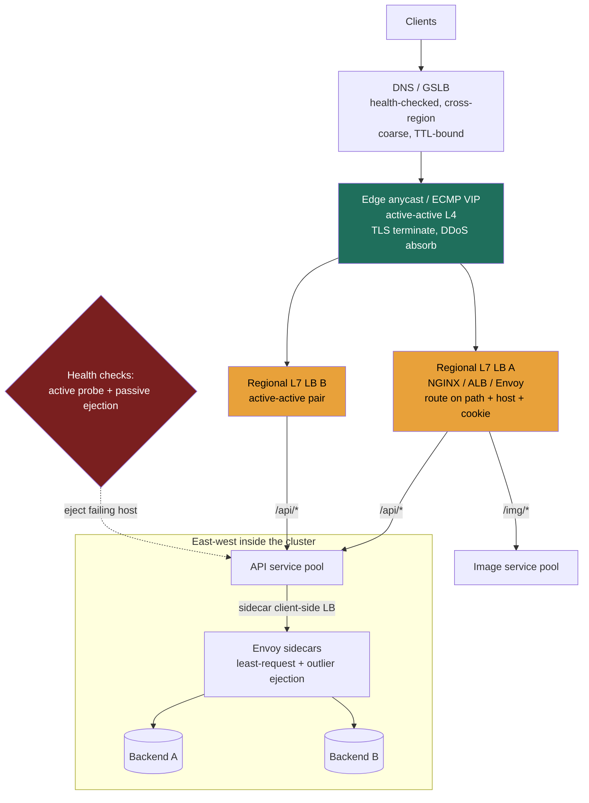

import LoadBalancerComparison from '@components/widgets/LoadBalancerComparison.jsx';

### Learning objectives
- Distinguish **L4** (transport) from **L7** (application) load balancing by what each layer can *see* and therefore *route on*, and price the difference.
- Choose a balancing algorithm, round-robin, weighted, least-connections, least-response-time, IP/consistent hash, from the failure mode you are defending against, not by reflex.
- Reason about **health checks** (active vs passive / outlier ejection) and **sticky sessions vs stateless**, and name what each costs you on failover.
- Treat the load balancer as a **single point of failure** and make it HA (active-passive with a floating VIP, active-active via ECMP/anycast, DNS/GSLB), and place LBs correctly across the request path (edge, internal, service mesh).

### Intuition first
A load balancer is the **host at the door of a busy restaurant**. Diners (requests) arrive; the host seats them across the open tables (servers) so no waiter is slammed while another idles.

How much the host *knows* changes what they can do. A **basic host** counts heads and sends the next party to the next free table in rotation, fast, but they never look at *what* the party wants. That is **L4**: it sees the connection but not the order. A **maître d' who reads the reservation** can route the steakhouse party to the grill section, richer decisions, but they had to stop and read each ticket. That is **L7**: it opens the request and routes on *content*, at the cost of doing real work per request.

Two more instincts: the host must notice when **a section's kitchen is backed up** and stop seating it (health checks), and a party mid-meal usually **stays at its table** (a sticky session), unless the restaurant is designed so any table can pick up any meal (stateless), in which case moving them costs nothing. Finally: if there is **only one host and they go home sick, the whole restaurant jams at the door.** The load balancer that protects everything is the thing most able to take everything down, so the real work is making the host redundant.

### Deep explanation

**L4 vs L7, the dividing line is what the device can see.**

- **L4 (transport): routes on the connection 4-tuple** (source/destination IP and port) plus protocol. It does **not** parse HTTP, it cannot see a URL path, `Host` header, or cookie. It picks a backend once at connect time, then shovels bytes. Because it does almost no per-packet work, it is **extremely fast and cheap**, single-digit microseconds added, millions of concurrent flows per box. Examples: **AWS NLB**, **HAProxy in TCP mode**, Google's **Maglev**. The tool for raw throughput, non-HTTP protocols (plain TCP/UDP, MQTT, database connections), or TLS *passthrough*.
- **L7 (application): terminates the connection, parses the protocol, routes on content**, `Host`, path, method, headers, cookies. This unlocks **content-based routing** (`/api/*` to one pool, `/img/*` to another), **TLS termination**, header injection (`X-Forwarded-For`, request IDs), retries, rate limiting, and request-level observability. The cost: a TCP+TLS handshake plus parsing every request, **hundreds of microseconds to low single-digit milliseconds** added, and fewer requests per box. Examples: **AWS ALB**, **NGINX**, **Envoy**.

The Director-altitude statement: *L4 is a fast switchboard that knows who's calling; L7 is a receptionist who reads the message and routes on its contents.* You **reject L7 when** nothing in the request drives the routing decision and the per-request CPU/latency tax buys nothing, L4 is cheaper and faster. You **reject L4 when** the routing decision lives inside the request (path/host/cookie), or you want TLS termination, retries, and HTTP-aware health checks at the balancer. A very common real topology is **both, in series**: an L4 device fans connections to a fleet of L7 proxies, L4's throughput at the front, L7's intelligence behind it.

**The balancing algorithms, pick for the failure mode you're defending against.**

- **Round-robin / weighted round-robin:** cycle servers in order; weights send proportionally more to bigger boxes. Even request *counts*, zero state, but **blind to live load**: a slow or half-dead backend keeps getting its full share. Fine for homogeneous servers and uniform request cost; weighted handles **known, fixed heterogeneity** (mixed instance types), not a server silently struggling.
- **Least-connections / least-response-time:** route to the backend with the fewest in-flight requests (or the best blend of in-flight count and measured latency). The first algorithms that **adapt to uneven request duration**, if one backend's requests stack up (slow disk, GC pause, degraded dependency), it stops getting new work and the pool self-heals. Least-response-time additionally catches a server that is *accepting connections but answering slowly*. Cost: live per-server state at the LB. Default choice when durations vary or backends can degrade.
- **IP hash / consistent hash:** hash a key (source IP, header, cookie) to a server, so the same key always lands on the same backend → **stickiness for free** (session affinity, cache locality). Two costs: a **skewed key** (a celebrity user, one hot IP behind a corporate NAT) hot-spots one server; and **plain `mod N` reshuffles *every* key when N changes** (a deploy, an autoscale event), blowing every cache and session. That second cost is exactly why you reach for a **consistent-hashing ring**, it bounds the remap to roughly `1/N` of keys.

There is **no "best" algorithm.** The signal is the match: uneven duration / flaky backends → least-connections or least-response-time; fixed capacity skew → weighted; session or cache affinity → hashing, with a ring to survive resizing.

**Health checks, two flavors, use both.** **Active checks** probe each backend on an interval (`GET /healthz`); simple and predictable, but they test a synthetic path and react on a delay, at a 5s interval with 3 failures to eject, you carry a dead backend ~15 seconds. **Passive checks / outlier ejection** watch *real traffic* and eject a backend that is actually returning errors, faster, and it reacts to what users see, with an **ejection cap** so a global dependency blip can't eject the whole pool at once. Active catches a backend that's down but receiving no traffic; passive catches one that's up but erroring. Make the health endpoint **deep enough** to catch a broken app (can it reach its DB?) but **not so deep** that one slow shared dependency marks the whole fleet unhealthy and you brown out.

**Sticky sessions vs stateless, and why stateless wins at scale.** "Sticky" pins a client to one backend, via source-IP affinity (L4; breaks behind NAT where thousands share an IP) or a cookie (L7). Stickiness exists because the backend holds **session state in local memory**. The costs are real: **uneven load** (a sticky popular server can't shed), and a **brutal failover**, when that backend dies, every session pinned to it is lost, and deploys are disruptive because you can't freely move traffic. The cleaner answer is **stateless backends**: externalize session state to a shared store (**Redis**, or a signed **JWT** the client carries), so any backend serves any request, failover loses nothing, and you scale by adding boxes. The Director call: **prefer stateless; treat stickiness as a temporary crutch** for a legacy app you haven't externalized yet, and name the failover cost you're carrying until you do.

**The LB is a single point of failure, making it HA.** A single load balancer in front of N redundant servers means one thing can take them all down. Three patterns, escalating:

- **Active-passive (failover pair):** two LBs share a **floating virtual IP**; heartbeats between them, and if the active dies the passive claims the VIP in **1-3 seconds**. Simple and battle-tested, but **half your LB capacity sits idle**, and there's a brief failover gap. Good for a single data center.
- **Active-active via ECMP / anycast:** advertise the **same IP from multiple LBs** and let the network spread flows across all of them, every box serves, capacity scales horizontally, and a dead LB simply stops being routed to. This is how Google's Maglev and edge networks like Cloudflare run. Cost: it needs **BGP/network control** you may not have outside a cloud or your own backbone.
- **DNS / GSLB:** hand out multiple records via a **health-checked GSLB** (e.g., Route 53) so clients resolve to region-local LBs. The only layer that balances **across regions** and survives a whole-site loss. Cost: **DNS TTL caching** makes failover **slow and partial** (clients keep hitting a cached dead record for the TTL, often 30-60s+), so DNS is a *coarse* layer used **above** a fast in-region LB, never your only failover.

The real-world stack uses all three by altitude: **DNS/anycast at the global edge → active-active L7 LBs per region → an internal LB (or mesh) east-west.**

**Where LBs sit in the request path.** Same component, different jobs by depth: **edge/global** (anycast + GSLB: TLS near users, cross-region balancing, DDoS absorption, often fronted by a CDN); **regional north-south** (the public L7 LB doing path/host routing into your services); **internal east-west** (service-to-service); and the **service mesh** variant, an Envoy sidecar next to each pod balances outbound calls itself, removing the central choke point and giving per-call retries, circuit breaking, and outlier ejection everywhere, at the cost of running a control plane and a sidecar per pod. You reject the mesh when a simple internal LB suffices and you don't want that operational weight.

Go deeper, algorithm, probe, and ejection mechanics (IC depth, optional)

- **Round-robin** is literally `server = i mod N`; **IP hash** is `server = hash(key) mod N`, the resize problem is the `mod N`.
- **Least-response-time implementations:** NGINX Plus `least_time` blends in-flight count with an EWMA of response time; Envoy's `LEAST_REQUEST` uses power-of-two-choices on active request count (pick two random hosts, route to the less loaded), near-optimal balance with O(1) work.
- **Sticky cookies:** either an app cookie or an LB-generated one (`AWSALB`, NGINX `sticky`). Source-IP affinity also shifts when a client's IP changes (mobile networks).
- **Active probe arithmetic:** mark unhealthy after k consecutive failures, healthy after m successes, detection latency ≈ k × interval; tighten the interval and you trade probe traffic for faster ejection.
- **Envoy outlier detection:** eject after 5 consecutive 5xx (or gateway failures) for a base ejection time (~30s) that grows with each repeat ejection; `max_ejection_percent` caps how much of the pool can be ejected at once.
- **HA mechanics:** active-passive uses VRRP/keepalived heartbeats and a gratuitous ARP when the standby claims the VIP. ECMP hashes flows across equal-cost routes; membership changes rehash flows, which can reset live connections, Maglev's consistent hashing exists precisely to minimize that. (AWS's Gateway Load Balancer is an L3 construct for inserting virtual appliances, firewalls/IDS, not a general app balancer.)

### Diagram: L4/L7 split and where LBs sit in the path

### Interactive widget: the algorithms on one fixed stream

<LoadBalancerComparison client:load />

The widget runs **one fixed stream of 120 requests** through all four algorithms, so the comparison is exact: bars show live connections per backend, `peak/avg` quantifies imbalance, and you can **pause mid-stream and switch algorithm** on the same requests. Flip to the **"Skewed key + 1 slow server"** preset: round-robin keeps feeding the degraded server until its in-flight pile turns red; least-connections routes around it; hash slams the hot key's server regardless of load. Move the **N slider** under hash to watch plain `mod N` reshuffle every key on resize, the disruption a consistent-hashing ring exists to bound. Under the uniform/healthy preset, round-robin and least-connections are nearly indistinguishable, an adaptive algorithm buys you nothing until servers actually differ.

### Worked example: a photo-sharing app's front door

Take a service at **50,000 requests/second**, mixed traffic: HTML, a JSON API, and large image GETs/uploads, with logged-in sessions, served from 3 regions.

- **Edge:** **anycast + Route 53 latency-based GSLB** routes each user to the nearest region and survives a region loss; TLS terminates here. Rejected alternative: a single region with DNS round-robin, fails cross-region availability, and DNS TTLs make failover too slow to be the *only* mechanism.
- **Regional north-south:** an **active-active pair of L7 LBs** per region behind an ECMP VIP. L7 because routing is **content-based**, `/api/*` → API pool, `/img/*` → image pool, and we want TLS termination and HTTP health checks here. Rejected: pure L4, it can't see the path, so it can't split API from image traffic. Active-active over active-passive because at 50k rps we won't leave half our LB capacity idle.
- **Algorithm:** **least-connections** for the API and image pools, because image uploads have **wildly uneven durations**, a 20 MB upload ties up a backend far longer than a 2 KB API call. Round-robin is rejected precisely because it's blind to that skew. For an internal **cache tier**, **consistent hashing on the object key** with a ring, so an autoscale event remaps only ~`1/N` of keys.
- **Sessions:** **stateless**, session state in **Redis**, JWT for the client, so any backend serves any request and failover loses nothing. Sticky sessions rejected: they'd worsen the upload imbalance, and losing a backend would drop every session pinned to it.
- **Health:** active `GET /healthz` (deep enough to check Redis/DB reachability) **plus** passive outlier ejection with an ejection cap, so a global dependency blip can't eject the whole pool.

Every choice falls out of the **requirements**, content routing (R), 50k rps and uneven duration (E), cross-region availability, which is why you pin those down first.

### Trade-offs table: L4 vs L7 vs service-mesh client-side LB

| Dimension | **L4 (NLB / IPVS)** | **L7 (ALB / NGINX / Envoy)** | **Service mesh (Envoy sidecar)** |
|---|---|---|---|
| Routes on | IP + port (4-tuple) | path, host, header, cookie | same as L7, **per service-to-service call** |
| Per-request cost | microseconds, line-rate | 100µs-few ms, fewer rps/box | L7 cost **+ a sidecar per pod** |
| Content routing / TLS term | no | yes | yes |
| Topology | central, north-south | central, north-south | **decentralized, east-west** |
| Failover/retry granularity | connection | request | per call, everywhere (circuit-break) |
| Op cost | lowest | moderate | **highest** (control plane + sidecars) |
| **Use when…** | raw throughput, non-HTTP, TLS passthrough | content routing, TLS, HTTP health/retries at the edge | many services, want per-call resilience and no central choke, and can afford a mesh |

### What interviewers probe here
- **"L4 or L7 in front of this, which and why?"**, *Strong signal:* ties the choice to *what the routing decision depends on* (content → L7; pure throughput/non-HTTP/TLS-passthrough → L4), names the per-request cost of L7, and may propose L4→L7 in series. *Red flag:* "use a load balancer" with no L4/L7 distinction, or "L7 is always better" with no cost awareness.
- **"How do you make the LB not a single point of failure?"**, *Strong:* names active-passive (floating VIP) vs active-active (ECMP/anycast) and DNS/GSLB *by altitude*, and that DNS failover is TTL-bound and coarse. *Red flag:* adds a second LB but never explains how traffic fails over to it.
- **"Which algorithm, and what does it cost you?"**, *Strong:* picks for the failure mode and names the cost (state to track, hot-spotting, remap-on-resize). *Red flag:* "round-robin" by default with no awareness it's blind to load.
- **"Sticky or stateless?"**, *Strong:* prefers stateless (externalize to Redis/JWT), names the failover cost of stickiness, treats sticky as a legacy crutch. *Red flag:* reaches for sticky sessions as the *design*.
- **"How does the LB know a backend is unhealthy?"**, *Strong:* active probe **and** passive ejection, with ejection caps. *Red flag:* assumes a dead backend is detected instantly.

The through-line at Director altitude: **cost, risk, and delegation.** Name the per-request CPU tax of L7, the idle-capacity cost of active-passive, the failover blast radius of stickiness, and say "I'd have the platform team benchmark NGINX vs Envoy for our path-routing rules; my prior is Envoy for the mesh integration" rather than tuning a config yourself.

### Common mistakes / misconceptions
- **Treating the LB as automatically HA.** It's the most concentrated single point of failure you have; it needs its own redundancy (VIP failover, anycast), and that's where outages actually happen.
- **Defaulting to round-robin** when request durations are uneven, long requests stack on one box; least-connections/least-response-time exist for exactly this.
- **Designing around sticky sessions** instead of going stateless, you inherit lossy failover, uneven load, and disruptive deploys. (And plain `mod N` hashing for affinity reshuffles every key on resize, use a ring.)
- **Health checks too shallow or too deep**, a TCP-connect check misses a broken app; an over-deep check marks the whole fleet unhealthy when one shared dependency hiccups.
- **Relying on DNS for fast failover**, TTL caching means clients keep hitting a dead record for the TTL window; DNS is coarse, used above a fast in-region LB.

### Practice questions

**Q1.** You front 200 stateful app servers with a single load balancer using sticky sessions. Walk me through what happens when (a) one app server dies and (b) the load balancer dies, and how you'd fix both.
> *Model:* (a) Every session **pinned to that server is lost**, those users are logged out or lose in-progress work. Fix: go **stateless**, move session state to **Redis** (or a signed JWT), so any server serves any user and a server death loses nothing. (b) The single LB is a **total outage**, all 200 servers are unreachable behind it. Fix: make the LB HA, an **active-passive pair with a floating VIP** (1-3s failover) for one DC, or **active-active behind an ECMP/anycast VIP** so a dead LB just stops being routed to. Each fix attacks a different SPOF: stickiness makes the *backend* failure lossy; the single LB makes the *front door* a SPOF.

**Q2.** A team puts an L7 load balancer in front of a high-throughput plain-TCP service and complains latency and CPU are higher than expected. What's going on and what would you change?
> *Model:* The L7 LB is **terminating TLS and parsing every request** to make a routing decision it doesn't need, there's no path/host routing, it just needs connections spread across backends. Switch to an **L4 LB** that routes on the 4-tuple at near-line-rate, or use TLS **passthrough**. The principle: **don't pay L7's per-request tax for a decision that lives at L4.** Caveat: for **HTTP/2 / gRPC**, one long-lived connection multiplexes many calls, so a connection-level LB pins them all to one backend, there you want **L7 or client-side (mesh) balancing** so each *call* is balanced.

**Q3.** One backend has silently degraded, it still accepts connections but answers 3× slower. Which algorithms cope and which don't, and what else do you add?
> *Model:* **Round-robin** and **weighted RR** don't cope, blind to live load, they keep sending the degraded node its full share. **Least-connections** copes: in-flight requests stack on the slow node, its count rises, and it stops receiving new work. **Least-response-time** copes even better, reacting to latency before connections fully back up. Add **passive outlier ejection** (eject on consecutive errors or a latency threshold) so a node that's erroring is removed entirely, with an ejection cap so a global slowdown doesn't eject the whole fleet.

**Q4.** Justify your load-balancer HA design for a 3-region service to a skeptical architect, the failure each layer covers, and its cost.
> *Model:* **Three layers by altitude.** *DNS/GSLB (health-checked, latency-based):* the only layer that survives a **whole-region loss**, cost: TTL caching makes it coarse and slow, so it's never the only mechanism. *ECMP/anycast active-active L7 LBs per region:* survives a **single LB failure** with no idle standby and scales horizontally, cost: needs BGP/network control. *Active-passive per region would be simpler*, but half the LB capacity sits idle and there's a failover gap, rejected at this scale. Net: DNS covers region loss, anycast covers LB-node loss, in-region health checks cover backend loss, each layer's blast radius is bounded by the one above it.

### Key takeaways
- **L4 sees the connection (4-tuple), L7 sees the content (path/host/cookie).** L4 is microsecond-cheap and high-throughput; L7 costs hundreds of µs-ms per request to buy content routing, TLS termination, and HTTP-aware health/retries. Often run both in series.
- **Pick the algorithm for the failure mode:** uneven duration / flaky backends → least-connections or least-response-time; fixed capacity skew → weighted; affinity → consistent hash with a **ring** (plain `mod N` remaps every key on resize). There is no universally best one.
- **Use active health checks *and* passive outlier ejection**, probe for down-but-idle backends, eject on real errors for up-but-broken ones, and **cap ejection** so a global blip can't eject the whole pool.
- **Prefer stateless backends (session in Redis/JWT) over sticky sessions**, stickiness makes failover lossy, load uneven, and deploys disruptive; treat it as a legacy crutch and name the cost.
- **The LB is your most concentrated SPOF.** Make it HA by altitude: active-passive (floating VIP) in one DC, active-active (ECMP/anycast) for scale, DNS/GSLB across regions, knowing DNS failover is TTL-bound and coarse.

> **Spaced-repetition recap:** Host at the restaurant door. L4 = sees the connection (fast, cheap, no content routing); L7 = reads the request (path/host/cookie, TLS, retries, costs CPU/latency). Match the algorithm to the failure (least-conn for uneven duration, consistent-hash + ring for affinity). Active + passive health checks. Go stateless, not sticky. And make the LB itself HA, it's the SPOF in front of everything (VIP failover → anycast → DNS by altitude).
