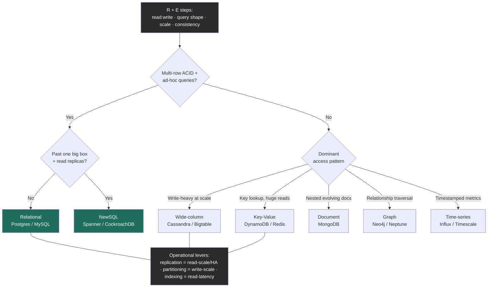

import ShardingVisualizer from '@components/widgets/ShardingVisualizer.jsx';

### Learning objectives
- Map the six datastore families, **relational, document, wide-column, key-value, graph, time-series**, to **quantified access-pattern signatures** (read:write, query shape, scale), and choose one from requirements rather than fashion.
- State **ACID vs BASE** precisely, know that **NewSQL** dissolves the "scale *or* ACID" dichotomy, and decide per data-flow which guarantee the workload actually needs.
- Reframe **replication, partitioning, and indexing** as the three **operational levers** you turn *after* picking a store, not as store-selection criteria.
- Quantify the **marginal cost of every additional store** in a polyglot estate, and make the **managed vs self-hosted** call on cost, on-call load, and lock-in, the dimensions a Director actually owns.

### Intuition first
Choosing a database is choosing a **vehicle for a specific journey**, not buying "the best car." A family hauling lumber buys a pickup; a courier weaving through a city buys a scooter; a coach moving forty people buys a bus. Nobody asks "which is the best vehicle?", they ask *what trip, how often, carrying what.*

A datastore is the same. The "trip" is your **dominant access pattern**, pinpoint key lookups, range scans over time, multi-table joins with strict integrity, or relationship traversal? The "how often" is your **read:write ratio and scale**. The "carrying what" is your **consistency requirement**, can a reader briefly see stale data, or must every read be correct to the cent? Get those three from the requirements and the store almost picks itself.

A second, quieter intuition separates a Director from a senior engineer: **owning a vehicle is not the same as driving it once.** Every car in the fleet needs its own fuel, mechanic, insurance, and a driver who knows its quirks. A garage of seven vehicles is *flexible* and *expensive to keep running.* That is polyglot persistence, and the cost of each new store, not the elegance of the match, is the part a Director is paid to weigh.

### Deep explanation

This lesson builds on the data-storage fundamentals: SQL vs NoSQL families, indexing engines, replication, and partitioning. Here we make the **decision** at Director altitude, *which store, why not the alternatives, and what it costs to run.*

**Step 1, derive the access-pattern signature (this is the whole game).** Before naming any technology, extract four numbers and one shape from RESHADED's **R** and **E** steps:

1. **Read:write ratio.** A social feed is ~`100:1` read-heavy; a metrics pipeline is ~`1:50` write-heavy. This single ratio steers you between read-optimized (B-tree) and write-optimized (LSM) engines before you even pick a family.
2. **Query shape.** Point lookup by key? Range scan over an ordered dimension? Multi-entity join? Graph traversal? Ad-hoc analytics? The shape eliminates whole families, a 4-hop traversal is nested joins blowing up in SQL, constant-time hops in a native graph store.
3. **Scale (bytes + throughput).** 50 GB fits on one box; 50 TB needs ~25 shards just to *hold*. 5k writes/s fits one Postgres node; 700k writes/s (the metrics-pipeline figure) does not, and replicas don't help writes, only partitioning does.
4. **Consistency requirement, *per operation*.** "Charge the card once" needs linearizability; "increment the view counter" tolerates seconds of staleness. This is the CAP/PACELC decision, made per data-flow, not per database.

The mistake juniors make is to start at "Cassandra vs Mongo." The mistake this lesson trains out is starting anywhere except the signature.

**Step 2, map the signature to a family.** Six families, each a *deliberate* trade of generality for a workload-shaped win:

- **Relational (Postgres, MySQL).** ACID, joins, ad-hoc SQL. *Signature:* moderate scale (one big box + read replicas reaches tens of TB and tens of thousands of writes/s), strong integrity, *unknown* future queries, multi-row transactions. The senior default, and the one to beat. *Reject when:* a single primary's write ceiling or a genuinely different shape is **proven, not assumed**.
- **Document (MongoDB).** Self-contained JSON-ish documents, flexible schema, shards the collection. *Signature:* one aggregate read/written together (an order with its line items), fast-evolving schema, few cross-document joins. *Reject when:* your data is highly relational and you keep reaching for joins, you've rebuilt a worse relational DB.
- **Wide-column (Cassandra, Bigtable).** LSM engine, partitioned wide rows, tunable consistency, built to scale out from day one. *Signature:* very write-heavy at massive scale (feeds, time-series, event logs), partition-by-a-known-key, eventual/quorum consistency acceptable, **tables designed around the read in advance**. *Reject when:* you need ad-hoc queries or strong multi-row transactions, you'll fight the model forever.
- **Key-value (DynamoDB, Redis).** Opaque value by key, O(1) lookup, huge read scale. *Signature:* pure `key → value`, sessions, caches, profiles, a URL shortener's `code → URL`. *Reject when:* you need to query *by* anything other than the key (KV is the *least* flexible family, that's the deal).
- **Graph (Neo4j, Neptune).** Nodes + edges with direct neighbor pointers, so a traversal hop is constant-time regardless of graph size. *Signature:* the *query itself is about relationships*, fraud rings, recommendations, N-hop social reach. *Reject when:* relationships are shallow (1-2 hops) and infrequent, a relational join handles that fine, sparing you a niche store for a non-niche problem.
- **Time-series (InfluxDB, TimescaleDB, Prometheus).** Append-mostly, timestamped, queried as recent ranges and roll-ups, with time-based compaction and downsampling built in. *Signature:* metrics, IoT, observability. *Reject a general store here when:* a metrics flood would bloat a B-tree and you'd hand-roll the downsampling a TSDB gives you free.

Go deeper, per-family mechanics (IC depth, optional)

- **Graph stores** win via **index-free adjacency**: each node stores direct pointers to its neighbors, so a hop is `O(1)` while the SQL equivalent is `O(joins^depth)`.
- **MongoDB** has had multi-document ACID transactions since 4.0, but they're costlier than single-document writes, you design aggregates to avoid needing them. Its join (`$lookup`) existing at all is usually the smell that the data wanted a relational store.
- **Time-series stores differ in ingestion model:** **TimescaleDB is a Postgres extension** (keep SQL and relational tooling); **Prometheus is pull-based** (scrapes `/metrics` endpoints, scrape failure is itself a health signal, plus service discovery); **InfluxDB is push-based** (agents like Telegraf push in, handles ephemeral jobs and edge devices that can't be scraped).
- **ACID isolation has levels**, read-committed → snapshot/repeatable-read → serializable, each stricter and costlier; most production Postgres runs read-committed, and "we use transactions" doesn't say which anomalies you've actually excluded.
- **Distributed secondary indexes:** DynamoDB's global secondary index is effectively a second replicated table you pay for; Cassandra secondary indexes are limited enough that the idiom is to denormalize into a second query-shaped table instead.

**Step 3, ACID vs BASE, stated precisely (and why the dichotomy is dissolving).** Two **contracts**, not a quality ranking. **ACID**: atomicity (all-or-nothing), consistency (constraints/invariants hold, *integrity, not CAP's linearizability; same word, different guarantee*), isolation (concurrent transactions don't corrupt each other), durability (committed = survives a crash). The contract of relational stores and the reason money lives there. **BASE**: basically available, soft-state, eventually consistent, prioritize availability and partition-tolerance, let replicas converge. The contract of Dynamo-style stores, exactly right for feeds, carts, and counters where a brief disagreement is invisible and uptime is sacred.

The line is blurring in both directions, DynamoDB and MongoDB both added ACID transactions, and most importantly, **NewSQL (Spanner, CockroachDB) delivers ACID *and* horizontal scale by running consensus per shard**: the "scale or transactions" framing is now false; you choose to *pay the coordination latency* for both. The Director move: **stop treating ACID/BASE as a property of a database and treat it as a requirement of a data-flow**, the ledger demands ACID (Postgres/Spanner), the feed is happy with BASE (Cassandra/Dynamo), in one product.

**Step 4, replication, partitioning, indexing are LEVERS, not the choice.** Once you've chosen a store from the signature, three knobs determine how it operates and scales, and a Director discusses them as dials with costs:

- **Replication** is the **availability + read-scale + durability** lever. More replicas absorb a `100:1` read load; sync replication buys durability at write-latency cost. It does **nothing** for write throughput, every replica absorbs every write.
- **Partitioning** is the **write-throughput + capacity** lever, the *only* knob that raises the write ceiling or lets bytes exceed one disk. Its cost is the rebalancing tax and the partition-key decision (the `mod N` cliff, the celebrity key), the subject of the widget below.
- **Indexing** is the **read-latency** lever, paid for in **write amplification + space**. Every secondary index speeds one read shape and taxes every write, and in distributed stores it gets expensive and constrained (denormalize instead).

The interview signal: when asked "how does this scale?", a Director doesn't say "add nodes." They say *which lever* for *which pressure*, "reads are the bottleneck → replicas; writes → shard, and here's my partition key and the query I just made expensive; this read is slow → an index, paid for in write cost."

**Step 5, polyglot persistence and the marginal cost of each store.** Real systems use several stores. The Director-level addition is **quantifying the cost of each one**: a new failure mode (one more thing that pages at 3am), a new on-call competency (Cassandra compaction tuning ≠ Postgres `VACUUM` ≠ Redis eviction), a new backup/DR/security posture, **cross-store consistency glue in application code** (no transaction spans Postgres *and* Dynamo), and a fixed dollar floor (a 3-node HA cluster + replicas + backups is rarely under a few hundred to low-thousands of dollars/month even lightly loaded). Rule of thumb worth saying out loud: **the right number of datastores is the smallest set that covers your access patterns, and the Nth store should clear a higher bar than the (N-1)th**, because operational surface compounds. "We could use a graph DB for this feature" is where a Director asks: *does a recursive CTE in the Postgres we already run get us 80% of it without a new on-call rotation?*

**Step 6, managed vs self-hosted (the budget-and-headcount decision).** **Managed** (Aurora, DynamoDB, Atlas): the provider runs HA, backups, patching, failover. You pay a premium of **roughly 2-4× raw compute/storage** and accept some lock-in, buying back the on-call burden and specialist headcount. **Self-hosted**: cheaper at the margin and fully controllable, but you now own node failure, upgrades, restore drills, and the 3am page, i.e., dedicated SRE/DBA headcount, which is far more expensive than the managed premium until you're at very large scale. The decision rule: **managed by default**, because engineer-time is the scarce resource; self-host only when (a) scale makes the premium dwarf a dedicated team's cost, (b) you need control the offering won't give (custom builds, data residency), or (c) no managed offering exists. The strong-signal sentence: *"I'd start on Aurora to avoid standing up a DBA function for v1; I'd revisit self-hosting only when the managed bill crosses the cost of the SRE headcount it's saving us, and I'd want that number on a dashboard."*

### Diagram: from access pattern to store, with the operational levers

The tree picks the *family* from the signature; the levers (grey) are how you then operate whatever you picked. Note the first question is "do you genuinely need ACID + ad-hoc queries?", answering "yes" routes you to the relational/NewSQL default you must have a *reason* to leave.

### Try it: partitioning is the write-scale lever, made visible
The widget below is the partitioning visualizer, here for a specific reason: once you've chosen a store, **partitioning is the lever that raises its write ceiling**, and its cost is skew. Flip the load to **skewed (celebrity / monotonic)** and watch range partitioning pile the hot band onto one shard (the `peak/avg` badge spikes to "HOT-SPOT"), hash scatter it flat, and directory rebalance it, each at its own cost (lost scans, a lookup-hop SPOF). The takeaway: choosing the store is step one; choosing the **partition key for your access pattern**, then naming *how it fails* and the mitigation, is the operating skill that separates "we'll shard it" from a defensible answer.

<ShardingVisualizer client:load />

### Worked example: picking the stores behind Uber's core trip flow
A ride-hailing request fans into data-flows with *opposite* signatures; the senior move is to match each deliberately rather than force one store to do everything.

- **Accounts, payment methods, trip ledger.** *Signature:* strong integrity, multi-row transactions ("charge once, credit the driver once"), ad-hoc finance queries, moderate write rate. → **Relational (Postgres, or CockroachDB at multi-region scale).** ACID is non-negotiable for money. **Rejected:** DynamoDB for scale, it would stay available under partition but risk a double-charge; the cost of a billing error dwarfs the cost of a brief "please retry," so we reject availability *here* on purpose.
- **Live driver GPS pings.** *Signature:* enormous write throughput (hundreds of thousands of writes/s globally), append-shaped, queried as "recent location," a second of staleness is fine. → **Wide-column (Cassandra)**, partitioned by `driver_id`, eventual consistency (BASE). **Rejected:** the relational ledger DB, a single primary can't absorb this write rate, and replicas don't raise the write ceiling. Nobody needs a transaction on a GPS ping.
- **"Drivers near this rider" (proximity search).** *Signature:* low-latency spatial lookup over hot, ephemeral data. → **In-memory KV with geospatial support (Redis geohash).** **Rejected:** a SQL spatial scan per request, fine at low QPS, but at dispatch scale the latency requirement earns the extra store.
- **Surge analytics / trip history for ML.** *Signature:* huge volume, batch-scanned, ad-hoc. → **Columnar warehouse / blob (S3 + a query engine).** Not the operational stores at all.

The interview-grade point: **one feature, four stores, each justified by its signature with its rejected alternative named, and a Director then immediately flags the cost**: four stores is four on-call competencies, so before approving I'd confirm each is *earning* its operational weight (could proximity be Postgres+PostGIS we already run, sparing a Redis rotation?). Polyglot is correct here; *unexamined* polyglot is how you end up paying for seven datastores to serve five access patterns.

### Trade-offs table: the families, by signature
| Family | Engine / model | Consistency default | Scale path | Use when… |
|---|---|---|---|---|
| **Relational** (Postgres, MySQL) | B-tree, ACID, joins | strong (ACID) | up + read replicas; sharding is hard | Integrity + multi-row txns + ad-hoc/unknown queries at moderate scale, *the default to beat* |
| **Document** (MongoDB) | flexible JSON docs | tunable; `w:majority` default | out (shard the collection) | One aggregate read/written together; fast-evolving schema; few cross-doc joins |
| **Wide-column** (Cassandra, Bigtable) | LSM, partitioned wide rows | tunable (quorum), BASE-leaning | out (built for it) | Very write-heavy at massive scale; design tables for the read; eventual OK |
| **Key-value** (DynamoDB, Redis) | opaque value by key | tunable, often eventual | out (built for it) | Pure `key → value`, sessions, cache, profiles; no scans/joins |
| **Graph** (Neo4j, Neptune) | nodes+edges, index-free adjacency | ACID (Neo4j) | scale-up / specialized | The *query is the relationship*, fraud, recs, N-hop social |
| **Time-series** (Influx, Timescale, Prometheus) | append + time-compaction/downsample | varies | out / retention-tiered | Metrics, IoT, observability, append-mostly, recent-range + roll-up reads |
| **NewSQL** (Spanner, CockroachDB) | consensus per shard, ACID | strong (PC/EC) | **out + ACID** | Need *both* horizontal scale and transactions, pay the coordination latency |

### What interviewers probe here
- **"You picked Cassandra/Mongo/Dynamo, why not Postgres?"**, *Strong:* a specific signature reason (a proven write ceiling, a genuinely different shape) *and* the honesty that Postgres would do until a named threshold ("past ~tens of thousands of writes/s on one primary, or tens of TB"). *Red flag:* "NoSQL scales, SQL doesn't", the myth NewSQL and sharded MySQL (Vitess) already killed.
- **"How does this scale when reads/writes grow 10×?"**, *Strong:* names the **right lever for the pressure**, replicas for reads, partitioning (with a stated key and the query it makes expensive) for writes, an index for a slow read, and the cost of each. *Red flag:* "scale it horizontally" with no read-scale/write-scale distinction.
- **"This data-flow, ACID or BASE?"**, *Strong:* decided *per flow* against the requirement (ledger = ACID, feed = BASE), aware NewSQL gives both at a latency cost, and distinguishes ACID's C from CAP's C. *Red flag:* one blanket answer for the whole system.
- **"Managed or self-hosted, and what does it cost us?"**, *Strong:* managed-by-default, with an explicit crossover (revisit when the managed bill exceeds the SRE headcount it saves) and lock-in named. *Red flag:* self-host "to save money" with no accounting for engineer-hours and 3am-page cost.
- **"You've proposed five stores, defend the operational cost."**, *Strong:* each store earns its place against an access pattern, *plus* willingness to collapse stores (a Postgres extension instead of a new engine) to shrink on-call surface. *Red flag:* polyglot for elegance, unaware each store is a new failure mode and on-call competency.

The throughline at Director altitude: choose from the **requirement**, **name the rejected alternative and its cost**, **delegate the benchmark credibly** ("I'd have the data team measure p99 at `QUORUM` vs `ONE` in our AZ topology; my prior is `LOCAL_QUORUM` for the ledger"), and always carry the **operational and dollar cost** of the choice.

### Common mistakes / misconceptions
- **Starting at the technology, not the signature.** "Cassandra vs Mongo" before you know the read:write ratio, query shape, scale, and consistency need is choosing a vehicle before knowing the trip.
- **Conflating the levers**, "add replicas" to fix a *write* ceiling (replicas scale reads; only partitioning scales writes).
- **Treating ACID/BASE as a database property instead of a per-data-flow requirement**, and believing "scale" forces you out of ACID (NewSQL disproves it). Related trap: confusing ACID's C (integrity) with CAP's C (linearizability).
- **Indexing as if it were free**, every secondary index taxes every write and costs space; distributed secondary indexes are worse (denormalize instead).
- **Unexamined polyglot and false-economy self-hosting**, adding a store for elegance while ignoring the on-call competency, backup posture, and cost floor it adds; or self-hosting "to save money" without pricing the SRE/DBA headcount and outage risk.

### Practice questions
**Q1.** A team wants to add Neo4j to power a "people you may know" feature on a product already running Postgres and Redis. Walk the decision.
> *Model:* First the signature: friends-of-friends at 2-3 hops is graph's sweet spot, constant-time hops where SQL needs nested joins that blow up with depth. So the *technical* match is real. But the Director question is **operational cost**: Neo4j is a new on-call competency, backup posture, and failure mode on top of two stores already run. If traversals are shallow and computable offline (a nightly batch into a table the serving path reads), a **recursive CTE or precomputed adjacency table in the Postgres we already operate** likely gets 80% of the value with *zero* new operational surface. Adopt Neo4j only if traversals are deep, real-time, and central enough to clear the bar of a new datastore rotation, and prefer **managed (Neptune/Aura)** to avoid standing up graph-DBA expertise. The signal: technical fit is necessary but not sufficient; marginal operational cost decides it.

**Q2.** Your orders service runs on a single Postgres primary, saturated at ~15k writes/s with p99 write latency climbing. The team proposes "add three read replicas." Right call?
> *Model:* No, **wrong lever for the pressure.** Replicas scale *reads*; every replica still absorbs every write, so they do nothing for a write ceiling. The lever is **partitioning**: shard on a high-cardinality key aligned to the dominant query (likely `user_id`, hashed). But before sharding, which adds cross-shard queries and rebalancing, exhaust the cheaper levers: is write amplification from over-indexing the real cause (drop unused indexes)? Is some load actually *read* load that replicas would offload? If a genuine write ceiling remains, choose **sharded SQL (Vitess/Citus)** vs **a write-scale store (Cassandra/Dynamo)** based on whether orders still need ACID, they likely do, so sharded SQL/NewSQL. The red flag in the proposal: reaching for "add nodes" without distinguishing read-scale from write-scale.

**Q3.** Finance asks why the data-tier bill is `$40k/month` when "it's just databases." How do you frame the managed-vs-self-hosted trade?
> *Model:* Reframe from "databases are expensive" to **"we're buying back engineering time and risk."** The managed premium (~2-4× raw compute) buys HA, automated failover, backups, patching, and point-in-time restore, otherwise a dedicated DBA/SRE function. A fully-loaded senior infra engineer is ~`$250k+/year`; two to run our stores 24/7 is `$500k+/year` ≈ `$40k+/month` *before* the cost of outages a less-practiced team would incur. So the managed bill is at or below the headcount it replaces, and it converts a variable risk (a botched failover mid-incident) into a fixed line item. My ask back: put **"managed premium vs equivalent headcount"** on a dashboard and revisit per-store, the highest-volume store is the first candidate to bring in-house when the math flips.

**Q4.** A candidate says "we'll use DynamoDB for everything, it scales infinitely and never goes down." What do you probe?
> *Model:* Two problems. First, **"for everything" ignores the signature**: Dynamo is superb for `key → value` at scale, but has no joins or ad-hoc queries, you model every access pattern up front, and the moment a flow needs relational integrity or reporting (the ledger), you're reinventing joins in application code. Second, **"never goes down" misreads the guarantees**: Dynamo is AP/EL by default, it favors availability and can serve stale reads, and "infinite scale" is conditional on a good partition key (a hot key still pins to one partition; mitigate with write-sharding/salting). Push for the **per-data-flow** decision: Dynamo for high-scale KV flows, relational/NewSQL for transactional ones, and an explicit hot-key plan. The red flag: treating one store as universal and confusing "highly available" with "always correct."

### Key takeaways
- **Derive the access-pattern signature first**, read:write ratio, query shape, scale (bytes + throughput), and per-operation consistency, *then* pick the family; never start at "Cassandra vs Mongo."
- **Six families, each a deliberate trade:** relational (integrity + ad-hoc, the default to beat), document (one evolving aggregate), wide-column (write-heavy at scale), KV (pure key lookup), graph (relationship traversal), time-series (timestamped metrics), and NewSQL when you need scale *and* ACID.
- **ACID vs BASE is a per-data-flow requirement, not a database identity**, ledger = ACID, feed/counter = BASE, in one product; NewSQL (Spanner/Cockroach) dissolves the "scale or ACID" choice at a coordination-latency cost.
- **Replication, partitioning, indexing are operational levers, not store-selection criteria**, reads → replicas, writes → partition (name the key and the query you made expensive), slow read → index (paid in write amplification + space).
- **Every new store has a marginal cost**, a failure mode, an on-call competency, a backup/DR posture, cross-store glue, and a dollar floor; default to **managed** to buy back engineer-time, self-host only when scale or control flips the math.

> **Spaced-repetition recap:** Pick the vehicle for the trip: derive the signature (read:write, query shape, scale, consistency) before naming a technology. Relational is the default to beat; leave it only for a proven write ceiling or a real KV/document/graph/time-series shape, and NewSQL gives scale *and* ACID. ACID vs BASE is per-data-flow, not per-database. Replication scales reads, partitioning scales writes, indexing scales a read (each with a cost). Every extra store costs an on-call competency and a failure mode; default to managed, self-host only when the math flips.

---

*End of Lesson 3.3. This building block, choosing and operating a datastore, feeds every design problem's **S** (Storage) and **D** (Data model) steps; the next blocks specialize it: the key-value store, then the distributed cache, queue, and search building blocks that sit in front of and beside the database you just chose.*
