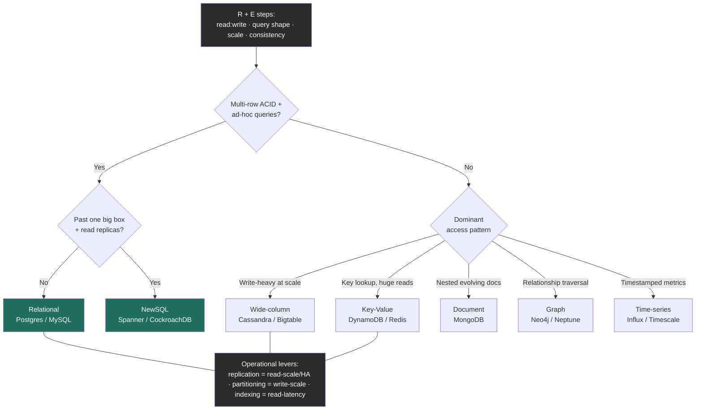

import ShardingVisualizer from '@components/widgets/ShardingVisualizer.jsx';

### Learning objectives
- Map the six datastore families — **relational, document, wide-column, key-value, graph, time-series** — to **quantified access-pattern signatures** (read:write, query shape, scale), and choose one from requirements rather than fashion.
- State **ACID vs BASE** precisely, know that **NewSQL** dissolves the "scale *or* ACID" dichotomy, and decide per data-flow which guarantee the workload actually needs.
- Reframe **replication (2.4), partitioning (2.5), and indexing (2.3)** as the three **operational levers** you turn *after* picking a store — not as store-selection criteria.
- Quantify the **marginal cost of every additional store** in a polyglot estate, and make the **managed vs self-hosted** call on cost, on-call load, and lock-in — the dimensions a Director actually owns.

### Intuition first
Choosing a database is choosing a **vehicle for a specific journey**, not buying "the best car." A family hauling lumber every weekend buys a pickup; a courier weaving through a city buys a scooter; a coach moving forty people buys a bus. Nobody asks "which is the best vehicle?" — they ask *what trip, how often, carrying what.* Pick the pickup for the city courier and you crawl through traffic burning fuel; pick the scooter for the lumber and it can't even hold the load.

A datastore is the same. The "trip" is your **dominant access pattern** — are you doing pinpoint key lookups, range scans over time, multi-table joins with strict integrity, or relationship traversal? The "how often" is your **read:write ratio and scale**. The "carrying what" is your **consistency requirement** — can a reader briefly see stale data, or must every read be correct to the cent? Get those three from the requirements and the store almost picks itself.

And there is a second, quieter intuition that separates a Director from a senior engineer: **owning a vehicle is not the same as driving it once.** Every car you add to the fleet needs its own fuel, its own mechanic, its own insurance, its own driver who knows its quirks. A garage of seven different vehicles is *flexible* and *expensive to keep running.* That is polyglot persistence — and the cost of each new store, not the elegance of the match, is the part a Director is paid to weigh.

### Deep explanation

This lesson assumes Lessons 2.1–2.5: SQL vs NoSQL families (2.2), indexing engines (2.3), replication (2.4), and partitioning (2.5). Here we stop describing the parts and start making the **decision** at Director altitude — *which store, why not the alternatives, and what it costs to run.*

**Step 1 — derive the access-pattern signature (this is the whole game).** Before naming any technology, extract four numbers and one shape from RESHADED's **R** and **E** steps:

1. **Read:write ratio.** A social feed read is ~`100:1` read-heavy; a metrics/audit-log pipeline is ~`1:50` write-heavy. This single ratio steers you between read-optimized (B-tree) and write-optimized (LSM) engines (2.3) before you even pick a family.
2. **Query shape.** Point lookup by key? Range scan over an ordered dimension (time, score)? Multi-entity join? Graph traversal (`friends-of-friends-of-friends`)? Ad-hoc/unknown-in-advance analytics? The shape eliminates whole families — a graph traversal that touches 4 hops is `O(joins⁴)` in SQL and `O(1)` per hop in a native graph store.
3. **Scale (bytes + throughput).** 50 GB fits on one box; 50 TB needs ~25 shards just to *hold* (2.5). 5k writes/s fits one Postgres node; 700k writes/s (the metrics figure from 1.3) does not — and replicas don't help writes, only partitioning does (2.5).
4. **Consistency requirement, *per operation*.** "Charge the card once" needs linearizability; "increment the view counter" tolerates seconds of staleness. This is the CAP/PACELC decision (2.7), made per data-flow, not per database.

The mistake juniors make is to start at "Cassandra vs Mongo." The mistake this lesson trains out is starting anywhere except the signature.

**Step 2 — map the signature to a family.** Six families, each a *deliberate* trade of generality for a workload-shaped win:

- **Relational (Postgres, MySQL/InnoDB, Aurora).** B-tree engine, ACID, joins, ad-hoc SQL. *Signature:* moderate scale (one big box + read replicas takes you to tens of TB and tens of thousands of writes/s), strong integrity, *unknown* future queries, multi-row transactions. The senior default — and the one to beat. *Reject when:* a single primary's write ceiling or a genuinely schemaless/relationship/time-series shape is proven, not assumed.
- **Document (MongoDB, Couchbase).** Self-contained JSON-ish documents, flexible schema, scales out by sharding the collection. *Signature:* one aggregate read/written together (a product with its variants, an order with its line items), fast-evolving schema, few cross-document joins. *Reject when:* your data is highly relational and you keep reaching for `$lookup` (Mongo's join) — you've rebuilt a worse relational DB. Note Mongo *has* multi-document ACID transactions since 4.0, but they're costlier and you design to avoid needing them.
- **Wide-column (Cassandra, HBase, Bigtable, ScyllaDB).** LSM engine, partitioned wide rows, tunable consistency, built to scale out from day one. *Signature:* very write-heavy at massive scale (feeds, time-series, messaging, event logs), partition-by-a-known-key, eventual/quorum consistency acceptable, **you design tables around the read in advance** (no ad-hoc joins). *Reject when:* you need ad-hoc queries or strong multi-row transactions — you'll fight the model forever.
- **Key-value (DynamoDB, Redis, Riak).** Opaque value by key, O(1) lookup, huge read scale. *Signature:* pure `key → value` access — sessions, caches, user profiles, a URL shortener's `code → URL` — no scans, no joins. *Reject when:* you need to query *by* anything other than the key (KV is the *least* flexible family — that's the deal).
- **Graph (Neo4j, Amazon Neptune).** Nodes + edges with **index-free adjacency** — each node holds direct pointers to its neighbors, so a traversal hop is `O(1)` regardless of total graph size. *Signature:* the *query itself is about relationships* — fraud rings, recommendations, social `N-hop` reach, dependency graphs. *Reject when:* relationships are shallow (1–2 hops) and infrequent — a relational join handles that fine, and you avoid operating a niche store for a non-niche problem.
- **Time-series (InfluxDB, TimescaleDB, Prometheus).** Append-mostly, timestamped, queried as recent ranges and roll-ups; aggressive time-based compaction and downsampling. *Signature:* metrics, IoT telemetry, observability — overwhelmingly append, reads dominated by "last 1h/24h/7d" windows and aggregates. Note **TimescaleDB is a Postgres extension** (you keep SQL + relational tooling), **Prometheus is *pull*-based** (it scrapes targets' `/metrics` endpoints on an interval), while **InfluxDB is *push*-based** (agents like Telegraf push in) — a real design difference, not trivia: pull gives you scrape-failure-as-a-signal and service discovery; push handles ephemeral jobs and edge devices that can't be scraped. *Reject a general store here when:* a metrics flood would bloat a B-tree and you'd hand-roll the downsampling a TSDB gives you free.

**Step 3 — ACID vs BASE, stated precisely (and why the dichotomy is dissolving).** These are two **contracts** a store offers, not a quality ranking.

- **ACID** — **A**tomicity (all-or-nothing), **C**onsistency (constraints/invariants hold — *this is integrity, not CAP's linearizability; same word, different guarantee, a classic confusion*), **I**solation (concurrent transactions don't corrupt each other — and isolation has *levels*: read-committed → snapshot/repeatable-read → serializable, each stricter and costlier), **D**urability (committed = survives a crash). The contract of relational stores and the reason money lives there.
- **BASE** — **B**asically **A**vailable, **S**oft-state, **E**ventually consistent. The pragmatic opposite: prioritize availability and partition-tolerance, let replicas converge over time. The contract of Dynamo-style stores (2.4), and exactly right for feeds, carts, and counters where a brief disagreement is invisible and uptime is sacred.

The line is *blurring in both directions.* DynamoDB added ACID transactions; MongoDB added multi-document ACID. Most importantly, **NewSQL (Google Spanner, CockroachDB, YugabyteDB)** delivers **ACID *and* horizontal scale** by running consensus (Paxos/Raft) per shard — the "you must choose scale or transactions" framing is now false, you choose to *pay the coordination latency* for it (Spanner's commit-wait, 2.7). The Director move is to **stop treating ACID/BASE as a property of a database and treat it as a requirement of a data-flow**: the ledger demands ACID (put it on Postgres/Spanner), the feed is happy with BASE (put it on Cassandra/Dynamo), in one product.

**Step 4 — replication, partitioning, indexing are LEVERS, not the choice.** This is the reframe that earns the lesson its place after 2.3–2.5. Once you've *chosen* a store from the signature, these three knobs determine how it *operates and scales* — and a Director discusses them as operational dials with costs, not as part of store selection:

- **Replication (2.4)** is the **availability + read-scale + durability** lever. Turn it up: more read replicas absorb a `100:1` read load; sync replication buys durability at write-latency cost; async buys latency at staleness/loss cost. It does **nothing** for write throughput — every replica absorbs every write.
- **Partitioning / sharding (2.5)** is the **write-throughput + capacity** lever. It's the *only* knob that raises the per-node write ceiling and lets total bytes exceed one disk. Its cost is the rebalancing tax and the partition-key decision (the `mod N` cliff, the celebrity key) — the subject of the widget below.
- **Indexing (2.3)** is the **read-latency** lever, paid for in **write amplification + space**. Every secondary index speeds one read shape and taxes every write. In distributed stores it gets expensive and constrained (DynamoDB's global secondary index is effectively a second replicated table; Cassandra secondary indexes are limited, so you denormalize into a query-shaped table instead).

The interview signal: when asked "how does this scale?", a Director doesn't say "add nodes." They say *which lever* for *which pressure* — "reads are the bottleneck → replicas; writes are the bottleneck → shard, and here's my partition key and the query I just made expensive; this read is slow → an index, paid for in write cost."

**Step 5 — polyglot persistence and the marginal cost of each store.** Real systems use several stores (2.2 established this). The Director-level addition is **quantifying the cost of each one** and resisting the urge to add stores for elegance:

Every new datastore in production costs, concretely: a **new failure mode** (one more thing that pages at 3am), a **new on-call competency** (the team must learn its quirks, backups, scaling, and tuning — Cassandra compaction tuning ≠ Postgres `VACUUM` ≠ Redis eviction policy), a **new backup/DR/security posture**, **data-consistency glue** across stores (now you own cross-store consistency in application code — no single transaction spans Postgres *and* Dynamo), and a **fixed dollar floor** (a 3-node HA cluster + replicas + backups is rarely under a few hundred to low-thousands of dollars/month even when lightly loaded). A rule of thumb worth saying out loud: **the right number of distinct datastores is the smallest set that covers your access patterns — and adding the Nth store should clear a higher bar than the (N-1)th**, because operational surface compounds. "We could use a graph DB for this one feature" is where a Director asks: *does a recursive CTE in the Postgres we already run get us 80% of it without a new on-call rotation?*

**Step 6 — managed vs self-hosted (the budget-and-headcount decision).** This is squarely a Director call because it trades **dollars against engineer-hours and risk.**

- **Managed** (RDS/Aurora, DynamoDB, MongoDB Atlas, Confluent, Datastax Astra): the provider runs HA, backups, patching, failover, scaling. You pay a **premium of roughly 2–4× the raw compute/storage** and accept some **lock-in** and less low-level control. You *buy back* the on-call burden and the specialist headcount you'd otherwise hire.
- **Self-hosted** (your own Cassandra/Postgres/Redis on EC2 or k8s): cheaper at the margin and fully controllable, but **you now own** node failure, upgrades, backup/restore drills, capacity planning, and the 3am page — which means **dedicated SRE/DBA headcount** (a fully-loaded engineer is far more expensive than the managed premium until you're at very large scale).

The decision rule: **managed by default**, because at most companies engineer-time is the scarce resource and the premium is cheaper than the headcount + risk. Self-host only when (a) scale makes the managed premium dwarf a dedicated team's cost, (b) you need control the managed offering won't give (custom builds, kernel tuning, data residency), or (c) no managed offering exists for your store. The strong-signal sentence: *"I'd start on Aurora to avoid standing up a DBA function for v1; I'd revisit self-hosting only when the managed bill crosses the cost of the SRE headcount it's saving us, and I'd want that number on a dashboard."*

### Diagram — from access pattern to store, with the operational levers

The tree picks the *family* from the signature; the levers (grey) are how you then operate whatever you picked. Note the first question is "do you genuinely need ACID + ad-hoc queries?" — answering "yes" routes you to the relational/NewSQL default you must have a *reason* to leave.

### Try it — partitioning is the write-scale lever, made visible
The widget below is the partitioning visualizer from Lesson 2.5, and it's here for a specific reason: once you've *chosen* a store, **partitioning is the lever that raises its write ceiling**, and its cost is skew. Place the same keys across N shards under **range**, **hash**, and **directory** strategies and watch the load distribution. Flip the load to **skewed (celebrity / monotonic)** and watch range partitioning pile the hot band onto one shard (the `peak/avg` badge spikes to "HOT-SPOT"), hash scatter it flat, and directory rebalance it — each at its own cost (lost scans, a lookup-hop SPOF). The Director takeaway the widget drives home: choosing the store is step one; choosing the **partition key for your access pattern**, then naming *how it fails* and the mitigation, is the operating skill that separates "we'll shard it" from a defensible answer.

<ShardingVisualizer client:load />

### Worked example — picking the stores behind Uber's core trip flow
A ride-hailing request fans into data-flows with *opposite* signatures, and the senior move is to match each deliberately rather than force one store to do everything.

- **Driver/rider accounts, payment methods, trip ledger (fares charged).** *Signature:* strong integrity, multi-row transactions ("charge once, credit the driver once"), ad-hoc support/finance queries, moderate write rate. → **Relational (Postgres / a NewSQL store like CockroachDB at multi-region scale).** ACID is non-negotiable for money. **Rejected alternative:** putting the ledger on DynamoDB for scale — it would stay available under partition but risk a double-charge or lost credit; the cost of a billing error (refunds, support, trust, regulators) dwarfs the cost of a brief "please retry," so we reject availability *here* on purpose.
- **Live driver GPS pings (every few seconds from every active driver).** *Signature:* enormous write throughput (hundreds of thousands of writes/s globally), append-shaped, queried as "recent location," staleness of a second is fine. → **Wide-column / time-series (Cassandra, or a geospatial-indexed store).** LSM absorbs the write flood with sequential flushes; we partition by `driver_id` to spread writes (2.5) and tolerate eventual consistency (BASE). **Rejected alternative:** the relational ledger DB — its B-tree would thrash on this write rate and a single primary can't absorb it; replicas wouldn't help because they don't raise the write ceiling (2.4/2.5). We reject ACID *here* because nobody needs a transaction on a GPS ping.
- **"Drivers near this rider right now" (proximity search).** *Signature:* low-latency spatial lookup over hot, ephemeral data. → **In-memory KV with geospatial support (Redis with geohash / a quadtree index).** **Rejected alternative:** a SQL `ST_DWithin` scan on every request — fine at low QPS, but at dispatch scale the per-request latency and load justify the in-memory index; we accept the extra store because the latency requirement earns it.
- **Surge-pricing analytics / completed-trip history for ML.** *Signature:* huge volume, scanned in batch, queried ad-hoc by data scientists. → **Columnar warehouse / blob (S3 + a query engine).** Not the operational stores at all.

The interview-grade point: **one feature, four stores, each justified by its signature and each with its rejected alternative named — and a Director then immediately flags the cost**: four stores means four on-call competencies and four failure modes, so before approving it I'd confirm each store is *earning* its operational weight (could the proximity layer be a Postgres+PostGIS extension we already run, sparing a Redis rotation?). Polyglot is correct here; *unexamined* polyglot is how you end up paying for seven datastores to serve five access patterns.

### Trade-offs table — the families, by signature
| Family | Engine / model | Consistency default | Scale path | Use when… |
|---|---|---|---|---|
| **Relational** (Postgres, MySQL) | B-tree, ACID, joins | strong (ACID) | up + read replicas; sharding is hard | Integrity + multi-row txns + ad-hoc/unknown queries at moderate scale — *the default to beat* |
| **Document** (MongoDB) | flexible JSON docs | tunable; `w:majority` default | out (shard the collection) | One aggregate read/written together; fast-evolving schema; few cross-doc joins |
| **Wide-column** (Cassandra, Bigtable) | LSM, partitioned wide rows | tunable (quorum), BASE-leaning | out (built for it) | Very write-heavy at massive scale; design tables for the read; eventual OK |
| **Key-value** (DynamoDB, Redis) | opaque value by key | tunable, often eventual | out (built for it) | Pure `key → value` — sessions, cache, profiles; no scans/joins |
| **Graph** (Neo4j, Neptune) | nodes+edges, index-free adjacency | ACID (Neo4j) | scale-up / specialized | The *query is the relationship* — fraud, recs, N-hop social |
| **Time-series** (Influx, Timescale, Prometheus) | append + time-compaction/downsample | varies | out / retention-tiered | Metrics, IoT, observability — append-mostly, recent-range + roll-up reads |
| **NewSQL** (Spanner, CockroachDB) | consensus per shard, ACID | strong (PC/EC) | **out + ACID** | Need *both* horizontal scale and transactions — pay the coordination latency |

### What interviewers probe here
- **"You picked Cassandra/Mongo/Dynamo — why not Postgres?"** — *Strong:* a specific signature reason (a proven write ceiling, a genuinely schemaless or relationship/time-series shape) *and* the honesty that Postgres would do until a named threshold (e.g. "past ~tens of thousands of writes/s on one primary, or past ~tens of TB"). *Red flag:* "NoSQL scales, SQL doesn't" — the myth NewSQL and sharded MySQL (Vitess) already killed.
- **"How does this scale when reads/writes grow 10×?"** — *Strong:* names the **right lever for the pressure** — replicas for a read ceiling, partitioning (with a stated key and the query it makes expensive) for a write ceiling, an index for a slow read, and the *cost* of each. *Red flag:* "scale it horizontally" / "add nodes" with no distinction between read-scale and write-scale (the 2.4-vs-2.5 confusion).
- **"This data-flow — ACID or BASE?"** — *Strong:* decided *per flow* against the requirement (ledger = ACID, feed/counter = BASE) and aware that NewSQL gives both at a latency cost; distinguishes ACID's C (constraints) from CAP's C (linearizability). *Red flag:* one blanket answer for the whole system, or "we'll just use transactions everywhere."
- **"Managed or self-hosted, and what does it cost us?"** — *Strong:* managed-by-default to avoid standing up a DBA function, with an explicit crossover (revisit self-host when the managed bill exceeds the SRE headcount it saves) and lock-in named. *Red flag:* defaulting to self-host "to save money" with no accounting for the engineer-hours and 3am-page cost it adds.
- **"You've proposed five stores — defend the operational cost."** — *Strong:* each store earns its place against an access pattern, *and* a willingness to collapse stores (a Postgres extension instead of a new engine) to shrink on-call surface; treats each new store as a higher bar than the last. *Red flag:* polyglot for elegance, unaware that each store is a new failure mode, backup posture, and on-call competency.

The throughline at Director altitude: you choose from the **requirement**, you **name the rejected alternative and its cost**, you **delegate the benchmark credibly** ("I'd have the data team measure p99 at `QUORUM` vs `ONE` in our AZ topology; my prior is `LOCAL_QUORUM` for the ledger"), and you always carry the **operational and dollar cost** of the choice — not just its technical fit.

### Common mistakes / misconceptions
- **Starting at the technology, not the signature.** "Cassandra vs Mongo" before you know the read:write ratio, query shape, scale, and consistency need is choosing a vehicle before knowing the trip.
- **Conflating the levers** — "add replicas" to fix a *write* ceiling (replicas scale reads; only partitioning scales writes), or "add a node" without saying read-scale vs write-scale.
- **Treating ACID/BASE as a database property instead of a per-data-flow requirement** — and believing "scale" forces you out of ACID (NewSQL disproves it).
- **Confusing ACID's C (integrity constraints) with CAP's C (linearizability)** — same letter, different guarantee.
- **Indexing as if it were free** — every secondary index taxes every write and costs space; distributed secondary indexes are worse (denormalize instead).
- **Unexamined polyglot persistence** — adding a store for elegance while ignoring that each one is a new failure mode, backup/DR posture, on-call competency, and fixed cost floor.
- **Self-hosting "to save money"** without pricing the SRE/DBA headcount and outage risk it adds — usually the false economy.

### Practice questions
**Q1.** A team wants to add Neo4j to power a "people you may know" feature on a product already running Postgres and Redis. Walk the decision.
> *Model:* First the signature: the query is genuinely relational-traversal (`friends-of-friends`, 2–3 hops), which is graph's sweet spot — index-free adjacency makes each hop `O(1)` while in SQL it's nested joins that blow up with depth. So the *technical* match is real for deep traversals. But the Director question is **operational cost**: Neo4j is a new on-call competency, backup/DR posture, and failure mode on top of two stores already run. I'd ask: how deep are the traversals and how hot is the query? If it's 1–2 hops and computed offline (a nightly batch into a Redis/Postgres table the serving path reads), a **recursive CTE or a precomputed adjacency table in the Postgres we already operate** likely gets 80% of the value with *zero* new operational surface. I'd adopt Neo4j only if traversals are deep, real-time, and central enough that the feature's value clears the bar of a new datastore rotation — and I'd prefer **managed (Neptune / Neo4j Aura)** to avoid standing up graph-DBA expertise. The signal: the technical fit is necessary but not sufficient; the marginal operational cost decides it.

**Q2.** Your orders service runs on a single Postgres primary. Writes have grown to where the primary is saturated at ~15k writes/s and p99 write latency is climbing. The team proposes "add three read replicas." Right call?
> *Model:* No — that's the **wrong lever for the pressure.** Read replicas scale *reads*; they do nothing for a *write* ceiling because every replica must absorb every write (2.4). The bottleneck is write throughput, so the lever is **partitioning** (2.5): shard the orders table on a high-cardinality key aligned to the dominant query (likely `user_id` if reads are "this user's orders," hashed for even spread), which raises the aggregate write ceiling by spreading writes across primaries. Before sharding (which adds real complexity — cross-shard queries, rebalancing), I'd first **exhaust the cheaper levers on the single node**: is write amplification from over-indexing the cause (drop unused secondary indexes, 2.3)? Can `VACUUM`/checkpoint tuning or faster storage buy headroom? Is some of this load actually *read* load that replicas *would* offload, relieving the primary? If a genuine write ceiling remains after that, the choices are **shard the Postgres (Vitess-style/Citus)** or **move the write-hot table to a store built for write-scale (Cassandra/Dynamo)** — and I'd pick based on whether those orders still need ACID (they likely do → sharded SQL / NewSQL, not Cassandra). The red flag the team is showing: reaching for replicas because "add nodes" feels like scaling, without distinguishing read-scale from write-scale.

**Q3.** Finance asks why the bill for your data tier is `$40k/month` when "it's just databases." How do you frame the managed-vs-self-hosted trade to them?
> *Model:* I'd reframe from "databases are expensive" to **"we're buying back engineering time and risk."** The managed premium (roughly 2–4× raw compute) buys HA, automated failover, backups, patching, and point-in-time restore — work that otherwise requires a dedicated DBA/SRE function. A fully-loaded senior infra engineer is ~`$250k+/year` all-in; two of them to run our stores 24/7 is `$500k+/year` ≈ `$40k+/month` *before* the cost of the outages a less-practiced team would incur. So at our scale the managed bill is **at or below** the headcount it replaces, and it converts a variable risk (a botched failover during an incident) into a fixed line item. The crossover where self-hosting wins is when scale makes the premium *dwarf* a dedicated team's cost, or when we need control the managed offering won't give (data residency, custom builds). My ask back: let's put **"managed premium vs equivalent headcount"** on a dashboard so we make this call on data, and revisit per-store — the highest-volume store is the first candidate to bring in-house when the math flips. That's the Director framing: it's a deliberate buy-vs-build on engineer-hours, not a line to cut blindly.

**Q4.** A candidate says "we'll use DynamoDB for everything — it scales infinitely and never goes down." What do you probe?
> *Model:* Two problems. First, **"for everything" ignores the signature**: DynamoDB is a KV/wide-column store — superb for `key → value` access at scale, but it has no joins, no ad-hoc queries, and you must model every access pattern (and its indexes) up front. The moment a flow needs multi-row ad-hoc queries or rich relational integrity (the ledger, reporting), Dynamo fights you — global secondary indexes are effectively extra replicated tables, and you'd reinvent joins in application code. Second, **"never goes down" misreads its guarantees**: Dynamo is AP/EL by default (2.7) — it favors availability and serves possibly-stale reads from the nearest replica; "scales infinitely" is also conditional on a good partition key (a celebrity/hot key still pins to one partition, 2.5 — you mitigate with write-sharding/salting). I'd push for the **per-data-flow** decision: Dynamo for the high-scale KV flows (sessions, the feed), a relational/NewSQL store for the transactional ones, and an explicit partition-key and hot-key plan. The red flag is treating one store as a universal answer and confusing "highly available" with "always correct."

### Key takeaways
- **Derive the access-pattern signature first** — read:write ratio, query shape, scale (bytes + throughput), and per-operation consistency — *then* pick the family; never start at "Cassandra vs Mongo."
- **Six families, each a deliberate trade:** relational (integrity + ad-hoc, the default to beat), document (one evolving aggregate), wide-column (write-heavy at scale), KV (pure key lookup), graph (relationship traversal), time-series (timestamped metrics) — and NewSQL when you need scale *and* ACID.
- **ACID vs BASE is a per-data-flow requirement, not a database identity** — ledger = ACID, feed/counter = BASE, in one product; NewSQL (Spanner/Cockroach) dissolves the "scale or ACID" choice at a coordination-latency cost.
- **Replication, partitioning, indexing are operational levers, not store-selection criteria** — reads → replicas, writes → partition (name the key and the query you made expensive), slow read → index (paid in write amplification + space).
- **Every new store has a marginal cost** — a failure mode, an on-call competency, a backup/DR posture, cross-store consistency glue, and a dollar floor; default to **managed** to buy back engineer-time, self-host only when scale or control flips the math.

> **Spaced-repetition recap:** Pick the vehicle for the trip: derive the signature (read:write, query shape, scale, consistency) before naming a technology. Relational is the default to beat; leave it only for a proven write ceiling or a real KV/document/graph/time-series shape — and NewSQL gives scale *and* ACID. ACID vs BASE is per-data-flow, not per-database. Replication scales reads, partitioning scales writes, indexing scales a read (each with a cost). Every extra store costs an on-call competency and a failure mode; default to managed to trade dollars for engineer-hours, self-host only when the math flips.

---

*End of Lesson 3.3. This building block — choosing and operating a datastore — feeds every Module 5 problem's **S** (Storage) and **D** (Data model) steps; the next blocks specialize it: 3.4 Key-Value Store, then the distributed cache, queue, and search building blocks that sit in front of and beside the database you just chose.*
