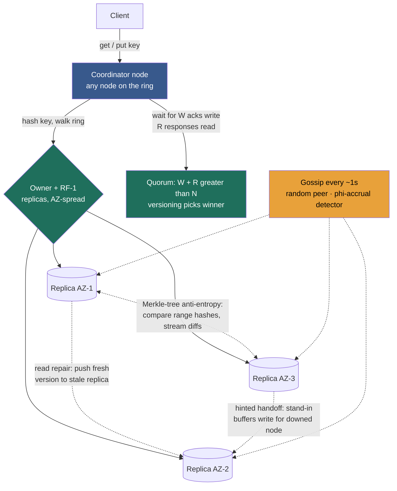

import ConsistentHashingRing from '@components/widgets/ConsistentHashingRing.jsx';

### Learning objectives
- Assemble a distributed key-value store from the Module 2 primitives: **partition** by consistent hashing (2.6), **replicate** to `RF` nodes (2.4), and read/write under a **quorum** `N/W/R` (2.8).
- Choose a **conflict-resolution** scheme — last-write-wins vs version vectors vs CRDTs — and name precisely what each silently loses.
- Explain the three **anti-entropy** mechanisms that keep replicas converging without a leader: **read repair**, **hinted handoff**, and **Merkle-tree** background repair, plus **gossip** for membership and failure detection.
- Treat the **tunable-consistency knobs** (`N/W/R`, conflict policy, repair cadence) as levers set against a requirement and a budget — and quantify the cost of the side you drop.

### Intuition first
Picture a **left-luggage counter that has outgrown one desk into a hall of identical desks.** A traveller hands over a bag (a `put(key, value)`); later someone returns with a ticket and asks for it back (a `get(key)`). Three questions run the whole operation, and they map one-to-one onto the machinery of this lesson:

1. **Which desk takes the bag?** You can't search every desk on return — that's an O(n) scan. So a rule maps each ticket number to a desk: the **partitioning** function. We use the consistent-hashing ring from Lesson 2.6 so that opening a new desk doesn't force the whole hall to re-file every bag.
2. **How many desks hold a copy of the bag?** One desk is a single point of failure — if it closes, the bag is gone. So you stash **identical copies at the next few desks clockwise**: the **replication factor**. And when you store or fetch, you decide *how many* of those copies you insist on touching — the **write/read quorum** `W` and `R`.
3. **Whose copy is the real one when two disagree?** If the same ticket's bag got swapped on two desks while the phone line between them was down, which copy wins on return? That's **conflict resolution** — and the honest answer is sometimes "we can't tell, so we hand you both bags and let you sort it out."

A key-value store is the smallest interesting distributed system because it strips away schemas, joins, and transactions and leaves exactly these three questions naked. Get them right and you have the **Dynamo** design — the lineage behind **Amazon DynamoDB, Apache Cassandra, Riak, and Voldemort** — and the substrate under most of the Module 3 building blocks that follow.

### Deep explanation

A key-value store exposes a deliberately tiny contract — `get(key)`, `put(key, value)`, `delete(key)` — over an opaque value (a blob the store never parses). That minimalism is the point: by giving up the relational model (no joins, no multi-row transactions, no rich query language), you buy the freedom to **partition and replicate almost arbitrarily**, which is what lets these stores hit single-digit-millisecond latency at millions of ops/sec across regions. The 2007 **Dynamo paper** (Amazon's internal store, the direct ancestor of DynamoDB and the design Cassandra and Riak copied) is the canonical reference, and the rest of this lesson is essentially a tour of its decisions — each one a Module 2 primitive snapped into place.

#### 1. Partitioning — consistent hashing, so growth is local

Spread `K` keys over `N` nodes by hashing the key onto the ring (2.6) and walking clockwise to the first node. Why the ring and not the obvious `hash(key) mod N`? Because `mod N` re-files **~90% of keys when you go 10→11 nodes and ~99% at 100→101** (2.6's measured numbers) — a near-total reshuffle every time you scale, which for a database means shipping your whole dataset across the network and for a cache means a total miss storm. The ring moves only **~K/N** keys (one node's fair share). **Virtual nodes** (100–256 per physical node, though Cassandra walked its default back from 256 to 16 for streaming/repair cost) smooth a lumpy ring from a ~1.7× hot-node peak toward ~1.1×, scatter a dead node's load across all survivors instead of dumping it on one neighbour, and let a 64-core box claim ~4× the keyspace of a 16-core box by owning ~4× the vnodes. **Rejected alternative:** range partitioning (HBase/Spanner) keeps keys ordered for cheap range scans, but a KV store's contract is point `get`/`put`, so we don't need ordering and we *do* want the ring's bounded-disruption rebalancing and even spread. We accept that range scans become expensive — the right trade for a point-lookup store.

#### 2. Replication — RF copies, placed for failure independence

For durability and availability (2.4's reasons to replicate), store each key on **RF** nodes — the **replication factor**, almost universally **3** in production. The ring gives you the placement for free: the **first** node clockwise is the primary, and the next `RF − 1` **distinct physical** nodes clockwise are the replicas. The subtlety that separates a real answer from a toy one is **failure independence**: you must skip nodes so the 3 copies land in **3 different availability zones / racks**, or a single AZ outage takes all three. Cassandra's `NetworkTopologyStrategy` does exactly this. With `RF = 3` across 3 AZs you survive a **full AZ loss** with two copies still serving — the table-stakes durability posture. **Rejected alternative:** `RF = 2` halves storage and write-amplification cost but leaves you one failure from data loss and zero headroom during a rolling deploy (a node down for an upgrade + one fault = unavailable); `RF = 5` buys more tolerance at ~67% more storage and write cost than `RF = 3` — reserved for the rare data that must survive two simultaneous AZ failures. `RF = 3` is the default precisely because it is the cheapest factor that tolerates one AZ loss.

#### 3. Reading and writing — the quorum dial `N/W/R`

There is no leader (the Dynamo choice — recall leaderless replication from 2.4). A **coordinator** node (any node the client reaches; it then forwards to the replicas) writes the value to the `N = RF` replicas and returns once **`W`** acknowledge; a read queries replicas and returns once **`R`** respond, taking the newest. The quorum rule from Lesson 2.8 governs recency:

- `W + R > N` forces the read set to overlap the write set, so a read **cannot miss** the latest acknowledged write. (It guarantees the latest value is *present* among the `R` responses — **version metadata still picks the winner**; overlap and conflict-resolution are two separate machines.)
- `W > N/2` (a majority write) forces two concurrent writes to collide on a shared replica so they can't both commit on disjoint sets and silently diverge.
- `W = R = 2` on `N = 3` (majority) satisfies **both** and is the canonical *strong* setting; `W = R = 1` is the canonical *fast, eventual* setting.

The cost is quantifiable and is the heart of the Director conversation: a `W = R = 1` read hits the nearest replica at **~1–5 ms**, while a `W = R = 2` read waits on the **2nd-fastest of 3** replicas (often cross-AZ) at **~5–15 ms**, and a cross-region strong read runs to **tens–hundreds of ms** (each cross-region RTT ~150 ms, from 1.4). Availability moves the opposite way: writes tolerate `N − W` replicas down, reads `N − R`. So the **same store, same three replicas, two settings** — and you pick per data-flow. This is the PACELC dial (2.7) expressed as numbers.

#### 4. Conflict resolution — what you keep when two writes race

Leaderless + always-writable means two clients can update the same key concurrently (or during a partition) and **both succeed on different replicas**. Now two versions exist and the store must reconcile them. Three strategies, weakest to strongest, and what each *loses*:

- **Last-write-wins (LWW).** Tag every write with a timestamp; the highest timestamp wins. Dead simple, no read-before-write, no metadata to carry — **Cassandra's choice, applied per *cell* (per column) with microsecond timestamps.** Cassandra picked LWW over vector clocks deliberately: vector clocks require a **read before every write** (to read the current version and increment it), so LWW **cuts writes from 2 round-trips to 1** — a large throughput win. The price you must name: LWW **silently discards** the losing concurrent write (one of two simultaneous updates just vanishes), and it **depends on synchronised clocks** — without tight NTP, a write with timestamp 1000 can clobber a *later* write carrying timestamp 999 from a laggy node's clock. LWW is correct only when last-writer-really-should-win (overwriting a user's profile field) and clock skew is bounded.
- **Version vectors (a.k.a. vector clocks in Dynamo's loose usage).** Attach a per-replica counter map, e.g. `{A:2, B:1}`, to each value. On a read, if one version's vector **dominates** another (≥ on every entry), it's strictly newer — keep it. If neither dominates, the writes are **concurrent** and *genuinely conflict* — the store returns **both siblings** and the application (or a CRDT) merges them. This is **Dynamo's and Riak's choice**: it never silently loses data, at the cost of carrying metadata, doing a read-before-write, and pushing merge logic up to the app. The Dynamo shopping cart is the canonical example — concurrent "add item" and "remove item" surface as siblings, and Amazon's documented policy was to **merge toward keeping the item** (a re-added deleted item wins) because dropping a sale costs more than showing one stale entry.
- **CRDTs (conflict-free replicated data types).** Pick data types whose merge is mathematically defined to converge regardless of order — a grow-only counter, an OR-set, a LWW-register — so concurrent writes **merge automatically** with no siblings and no app logic. Riak ships CRDT types; Redis Enterprise's active-active uses them. The cost: only *some* data shapes are expressible as CRDTs, and they carry their own metadata overhead.

The rule of thumb a Director should state: **LWW where overwrite semantics are correct and you want the cheapest write; version vectors where losing a concurrent write is unacceptable; CRDTs where the data type fits and you want automatic merge.** The rejected option in each case is named by the loss it would cause — discarded writes (LWW), app-side merge burden (vectors), or limited data shapes (CRDTs).

#### 5. Anti-entropy — converging replicas without a leader

`W = R = 1` (or any partition) leaves replicas temporarily disagreeing. Three mechanisms drag them back together, at three different cadences and costs:

- **Read repair (on the read path, opportunistic).** When a read gathers `R` responses and notices a replica returned a stale (or missing) version, the coordinator **writes the fresh value back** to the laggard before (or just after) replying. Cheap — it piggybacks on traffic — but it only heals keys that are actually being read. Frequently-read keys self-heal; cold keys stay divergent and need the next mechanism.
- **Hinted handoff (on the write path, for transient failures).** If a target replica is down when a write arrives, a reachable stand-in **accepts the write and stores a hint** ("this belongs to node X"); when X recovers, the stand-in **forwards the buffered write and deletes its copy**. This is what keeps the store **write-available** through a node bounce (2.8 named the trade: a *sloppy* quorum buys availability by accepting on non-home nodes, breaking `W + R > N` until the hint delivers). Hints are buffered with a TTL/cap — if the node is down longer than the hint window, the hint is dropped and the slower background repair takes over.
- **Merkle-tree anti-entropy (background, for cold/long-divergent data).** To reconcile two replicas' *entire* key ranges without shipping every key, each builds a **Merkle tree**: a binary hash tree whose leaves hash key-ranges and whose internal nodes hash their children. Two replicas compare **root hashes**; if equal, the ranges are identical and **zero data moves**. If they differ, they descend only the subtrees whose hashes differ, exchanging **O(log n) hashes** to localise the divergence to the few keys that actually differ, then stream only those. This turns "compare a billion keys" into "compare a handful of hashes plus the genuinely-divergent leaves" — the difference between a full-dataset transfer and a few kilobytes. Cassandra runs this as **repair** (`nodetool repair`); Dynamo and Riak use the same idea. The cost a Director plans for: building the tree is **CPU- and I/O-heavy** and competes with live traffic, so repair is **throttled and scheduled off-peak** — and skipping it lets `tombstones` (deletion markers) resurrect deleted data, the infamous **"zombie data"** failure.

#### 6. Membership and failure detection — gossip

How does every node learn the ring (who owns what, who's up) without a master directory that would itself be a single point of failure? **Gossip:** each node periodically (e.g., once per second) picks a **random** peer and exchanges state — known nodes, their ring tokens, and a heartbeat version. Information spreads **epidemically**: like a rumour, a fact reaches all `N` nodes in **O(log N)** rounds (a few seconds for thousands of nodes), with **no central coordinator** and graceful behaviour under partial failure. Failure detection rides the same channel — Cassandra's **phi-accrual failure detector** doesn't make a binary up/down call but outputs a *suspicion level* `phi` that rises as heartbeats go missing, so the threshold adapts to network jitter instead of flapping on one slow packet. **Rejected alternative:** a centralised membership service (or ZooKeeper/etcd-style coordination) gives a single authoritative view and stronger consistency of membership, but it's another tier to run, a potential bottleneck, and a coordination dependency — Dynamo deliberately chose decentralised gossip to keep the **AP, no-single-point-of-failure** posture end-to-end. The trade: gossip membership is itself only *eventually* consistent (nodes briefly disagree on the ring during churn), which is acceptable because the quorum/anti-entropy layers tolerate it.

Put together, those six decisions *are* a Dynamo-style key-value store: a decentralised, leaderless ring of nodes, each able to coordinate any request, replicating to `RF` AZ-spread copies, reading/writing under a per-operation quorum, reconciling with versioning, and self-healing via read repair + hinted handoff + Merkle anti-entropy, all glued by gossip.

### Diagram — request path plus the three background healers

### Interactive widget — feel the partitioning layer
The store's first decision is *which node owns a key*, and the ring below makes that tangible. Add and remove nodes and watch the keys' colored ownership: a membership change recolors only the **one arc** the new node steals (≈ K/N of the dots), not the whole ring — the difference between a survivable scale-out and the `hash mod N` miss storm. Slide the **virtual-nodes** count from 1 to 256 and watch the per-node load bars converge from a lumpy ~1.7× peak toward an even ~1.1×, and give one node extra weight to see it claim proportionally more keys (how a cluster runs mixed instance types). Mentally overlay the rest of the store on top: for `RF = 3`, each key's value also lives on the **next two distinct nodes clockwise** from its owner, and a quorum read consults `R` of those three. The counter reports the exact **percentage of keys that moved** on the last change — confirm for yourself that the ring stays near 1/N while naive modulo would blow past 90%.

<ConsistentHashingRing client:load />

### Worked example — Amazon DynamoDB and Cassandra, one design, two products
Both descend from the Dynamo paper; tracing a real write/read through each shows the knobs in action and where the bill lands.

**The shopping cart that started it all (Dynamo / DynamoDB).** Amazon's requirement (the RESHADED **R** step) was brutal: the *Add to Cart* button must **never** reject a write — not during a node failure, not during a network partition, because a refused add is a lost sale. That requirement *forces* an **AP, eventually-consistent** design: `N = 3`, `W = 1` (return on the first ack, survive 2 of 3 replicas down, ~1–5 ms), `R = 1`. Here `W + R = 2`, deliberately **not** `> 3` — staleness on a second device for a few hundred ms is invisible, uptime is sacred. Concurrent edits (phone adds an item, laptop removes it) surface as **version-vector siblings**, reconciled by merging toward keeping the item. Under partition this runs as a **sloppy quorum** with hinted handoff — the add lands on whatever node is reachable and is handed off home later. In DynamoDB terms, this is the default: **eventually-consistent reads cost 0.5 RCU per 4 KB**. **Rejected alternative:** a majority quorum on the cart would lift every write to cross-AZ ~5–15 ms and *refuse* adds when 2 of 3 replicas are unreachable — paying latency and availability to buy recency a cart doesn't need.

**The inventory decrement on the same cluster.** "Never sell the last unit twice" flips every knob: `N = 3, W = 2, R = 2` so `W + R = 4 > 3` (the decrement reads its own effect) and `W = 2 > 3/2` (two concurrent decrements collide on a shared replica). In DynamoDB this is a **strongly-consistent read at 1 RCU per 4 KB — literally 2× the cost** of the eventual read, the clearest possible illustration that *consistency has a dollar price*. The honest caveat (and the senior move) is that **quorum alone does not finish the job**: a decrement is a read-modify-write, and a majority quorum makes the *read* strong but not the *sequence* atomic — two decrements can each read `stock = 1` and each write `0`, overselling by one with `W + R > N` holding throughout. `W > N/2` only makes the collision *detectable* (and Cassandra's default LWW would silently *drop* one of the two writes by timestamp). To actually prevent the oversell you bolt a **conditional write / compare-and-set** on top — DynamoDB's `ConditionExpression` (`SET stock = stock − 1 IF stock > 0`) or a Cassandra **lightweight transaction** (`UPDATE … IF stock > 0`, a Paxos round). **Quorum delivers recency; serializing the read-modify-write is a separate machine you add.**

The interview-grade takeaway: **one store, one ring, three replicas — two opposite consistency contracts chosen per data-flow from the requirement, each with the rejected side's cost quantified.** And the Cassandra-vs-DynamoDB *flavour* difference matters too: Cassandra resolves conflicts with **LWW per cell** (cheap writes, silent loss, NTP-dependent), while the Dynamo/Riak lineage uses **version vectors** (no silent loss, app-side merge) — the same conflict problem, two answers, picked by whether a dropped concurrent write is tolerable.

### Trade-offs table — conflict-resolution strategy
| Strategy | Metadata / write cost | What it silently loses | Used by | Use when… |
|---|---|---|---|---|
| **Last-write-wins (LWW)** | Lowest — a timestamp, **no read-before-write** (1 round-trip) | A losing concurrent write **vanishes**; wrong winner under clock skew (needs NTP) | **Cassandra** (per cell) | Overwrite semantics are correct (profile field, config) and clocks are tight |
| **Version vectors / vector clocks** | Higher — per-replica counters + **read-before-write** | Nothing — surfaces **siblings** for app/CRDT merge | **Dynamo, Riak, Voldemort** | Losing a concurrent write is unacceptable (cart, collaborative state) |
| **CRDTs** | Higher — type-specific merge metadata | Nothing — **auto-merges**, no siblings | **Riak** types, **Redis** Enterprise active-active | The data fits a CRDT (counters, sets, registers) and you want hands-off merge |

### What interviewers probe here
- **"Walk me through a `get` and a `put` in a Dynamo-style store."** — *Strong:* coordinator hashes the key onto the ring, forwards to the `RF` AZ-spread replicas, waits for `W` acks (write) or `R` responses (read), versioning picks the winner; names the `N/W/R` knob and the latency it buys. *Red flag:* assumes a single leader or a single copy, or can't say where the value physically lives.
- **"Two clients write the same key concurrently. What happens, and what do you lose?"** — *Strong:* names the strategy and its loss — LWW silently drops one (and depends on clock sync); version vectors return siblings to merge; CRDTs auto-merge. *Red flag:* "last write wins" with no awareness that a write disappears, or thinking the quorum prevents the conflict.
- **"How do replicas converge with no leader?"** — *Strong:* read repair (opportunistic, on hot keys), hinted handoff (write-path, transient failures), Merkle-tree anti-entropy (background, cold data) — and names Merkle's win: compare root hashes, descend only differing subtrees, stream only divergent keys. *Red flag:* "they just sync," or unaware repair is a throttled, capacity-planned background tax.
- **"How does the cluster track membership and failures?"** — *Strong:* gossip — random peer exchange, O(log N) epidemic spread, no central directory, phi-accrual (adaptive suspicion, not binary up/down). *Red flag:* reaches for a central master/ZooKeeper without noting it reintroduces a coordination tier and SPOF the AP design avoided.
- **"You're picking the consistency level for a new data-flow — how, and who decides?"** — *Strong:* derive `N/W/R` from the requirement, quantify the dropped side (p99 lift, failures tolerated, RCU/$ cost, oversell risk), and **delegate the benchmark credibly** — "I'd have the storage team measure `LOCAL_QUORUM` vs `ONE` p99 across our AZ topology; my prior is majority for the ledger, `ONE` for the feed, but I want the tail numbers before we standardise." *Red flag:* one global consistency setting for everything, or no cost attached to "make it strongly consistent."

The throughline at Director altitude: you treat `N/W/R`, the conflict policy, and the repair cadence as **levers against a requirement and a budget**, you **quantify the side you drop**, and you **own the decision while delegating the IC-depth measurement.**

### Common mistakes / misconceptions
- **Thinking a KV store has one copy or one leader.** It's leaderless, `RF`-replicated, quorum-read; any node coordinates. "Where does the data live" is *RF nodes across RF AZs*, not "the server."
- **Believing the quorum resolves conflicts.** `W + R > N` only guarantees the latest write is *present* in the responses; **versioning** picks the winner — and `W > N/2` only makes concurrent writes *detectable*, not prevented.
- **Treating LWW as safe.** It silently **discards** a concurrent write and depends on synchronised clocks; an un-NTP'd cluster can have an older timestamp win. Use version vectors/CRDTs when a lost write is unacceptable.
- **Forgetting anti-entropy is an operational tax.** Read repair only heals read keys; hinted handoff hints expire; **Merkle repair is CPU/I-O heavy and must be scheduled** — skip it and deleted data resurrects (zombie tombstones).
- **Reaching for a central membership service.** Gossip exists precisely to avoid the SPOF/bottleneck of a master directory; adding ZooKeeper for membership re-imports the coordination tier the AP design dropped.
- **One consistency setting for the whole store.** The win is **per-operation** `N/W/R`: cart at `W=R=1`, ledger at `W=R=2` (+ a conditional write) — on the *same* cluster.
- **Using a KV store for relational access.** No joins, no ad-hoc queries, no multi-key transactions — model **one query-shaped key per access pattern**; if you need range scans or relations, the ring is the wrong partitioner (use range partitioning / a different store).

### Practice questions
**Q1.** Design the storage layer for a globally-available shopping cart that must never reject an *add to cart*. Specify partitioning, replication, `N/W/R`, and conflict handling, and name what you trade away.
> *Model:* Partition by **consistent hashing** so scaling the fleet moves only ~K/N keys (no miss storm). Replicate `RF = 3` across **3 AZs** so an AZ loss leaves two serving copies. Set `N = 3, W = 1, R = 1` — writes return on the first ack and survive 2 of 3 replicas down, giving ~1–5 ms and **always-writable** behaviour; this is deliberately `W + R = 2 < 3`, i.e. **eventually consistent**, which is fine because a few hundred ms of cross-device staleness is invisible. Under partition, run a **sloppy quorum + hinted handoff** so the add lands on a reachable node and is forwarded home later. Resolve concurrent edits with **version vectors**, merging toward *keeping* the item (a re-added deleted item wins) — never silently dropping a write, because a lost cart item is a lost sale. **Traded away:** read recency for other devices and the `W + R > N` overlap guarantee during the partition window — accepted on purpose, since the requirement prioritises availability over immediate consistency. (This is the original Dynamo motivation.)

**Q2.** A Cassandra cluster occasionally shows a row reverting to an old value after a node was down and recovered. No application bug. What's happening, and what's the fix?
> *Model:* Two suspects, both rooted in **LWW + clock**. (a) **Clock skew:** Cassandra resolves per-cell by **highest timestamp**; if the recovered node's clock was ahead, a stale write it accepted can carry a *higher* timestamp than the correct newer write and win on reconciliation — the fix is rigorous **NTP** across the fleet (and noting LWW is fundamentally clock-dependent). (b) **Missed repair / resurrected data:** if the node was down longer than the **hint window**, hinted handoff dropped the hints, and **read repair** only heals keys that are read; cold keys stay divergent until **Merkle-tree `nodetool repair`** runs — and if a `delete` tombstone expired (`gc_grace_seconds`) before repair propagated it, the old value **resurrects** (zombie data). Fix: run repair **within `gc_grace_seconds`** on a schedule, throttled and off-peak. The Director point: this is an *operational* failure of the anti-entropy cadence, not a code bug — it's owned by capacity-planning the repair job.

**Q3.** Your team wants to add a central membership directory "so every node has a consistent, authoritative view of the ring." Evaluate the proposal.
> *Model:* Push back, but acknowledge the real tension. **Gossip** already disseminates membership in **O(log N)** rounds with **no central coordinator and no SPOF** — exactly the AP, no-single-point-of-failure posture a Dynamo store is built for. A central directory (or ZooKeeper/etcd) gives a **strongly-consistent** membership view, which *is* genuinely nicer during rapid churn (gossip membership is only eventually consistent, so nodes briefly disagree on the ring) — but it reintroduces a **coordination tier**: another system to run and scale, a potential **bottleneck**, and a **dependency** whose outage can stall the cluster. The architecture deliberately tolerates eventually-consistent membership because the **quorum and anti-entropy layers below it absorb the transient disagreement**. So: keep gossip for membership; reserve a coordination service only for the narrow places that need real consensus (e.g., lightweight transactions / leader election for specific operations), not for the whole ring. The signal is weighing "stronger view" against "new SPOF + operational tier" rather than reflexively centralising.

**Q4.** You must store a per-user "items purchased" counter that is read constantly and incremented from many regions concurrently. LWW or version vectors or CRDT — and why?
> *Model:* **CRDT** — specifically a counter CRDT (e.g., a PN- or G-counter). The access pattern is **concurrent increments from many regions**, which is the worst case for both alternatives: **LWW** would treat two concurrent `+1`s as a conflict and **keep only one — undercounting** (silently losing increments); **version vectors** would surface the two increments as **siblings** and push the merge burden onto the application on every read. A **counter CRDT merges automatically and convergently** — each replica tracks per-replica sub-counts and the merged value is their sum, so concurrent increments **all count** with no siblings and no app logic. Cost named: it carries per-replica metadata and only works *because* "increment a counter" is a CRDT-expressible shape — if the operation were an arbitrary read-modify-write it wouldn't fit and you'd fall back to a conditional write / LWT. (Riak ships counter CRDTs; Redis Enterprise active-active uses them.) Rejected alternatives are rejected by their *loss*: undercount (LWW) and per-read merge burden (vectors).

### Key takeaways
- A Dynamo-lineage key-value store is the Module 2 primitives assembled: **consistent-hashing partitioning** (2.6) + **`RF`-replication across AZs** (2.4) + **per-operation quorum `N/W/R`** (2.8) + versioning + anti-entropy + gossip — leaderless, any node coordinates.
- **`RF = 3` across 3 AZs** is the default because it's the cheapest factor surviving one AZ loss; **`N/W/R` is the per-data-flow dial** — `W=R=1` (~1–5 ms, eventual, always-writable) vs `W=R=2` (~5–15 ms cross-AZ, strong) — the PACELC trade as numbers, and in DynamoDB a literal **2× RCU cost** for strong reads.
- **Conflict resolution is a named trade:** LWW (Cassandra, per cell — cheapest write, but **silently drops** a concurrent write and needs NTP) vs version vectors (Dynamo/Riak — **no loss**, app-merges siblings) vs CRDTs (auto-merge, limited data shapes).
- **Three healers keep replicas converging with no leader:** read repair (hot keys, on the read path), hinted handoff (transient failures, on the write path), and **Merkle-tree anti-entropy** (cold data — compare root hashes, descend only differing subtrees, stream only the diffs) — the last is a **throttled, scheduled operational tax** whose neglect resurrects deleted data.
- **Gossip** spreads membership/failure state in **O(log N)** rounds with **no central directory** (phi-accrual = adaptive suspicion, not binary up/down) — the decentralised choice that preserves the AP, no-SPOF posture; quorum alone gives recency, not atomic read-modify-write (add a conditional write / LWT for counters and decrements).

> **Spaced-repetition recap:** A KV store = a hall of left-luggage desks. Which desk? **Consistent-hashing ring** (~K/N moves, not 90%). How many copies? **RF = 3 across 3 AZs.** How many to touch? The **`N/W/R` quorum** (`W+R>N` for recency, the PACELC dial in numbers — 2× cost for DynamoDB strong reads). Whose copy wins? **LWW** (Cassandra, silent loss, needs NTP) / **version vectors** (Dynamo/Riak, siblings) / **CRDTs** (auto-merge). Converge with no leader via **read repair + hinted handoff + Merkle repair**, membership via **gossip** (O(log N), no master). Quorum ≠ atomic read-modify-write — add a conditional write/LWT.

---

*End of Lesson 3.4. The key-value store is the substrate beneath much of Module 3 — the Distributed Cache (3.7) is a KV store tuned for volatility, and the Sharded Counters (3.16) lesson is this conflict-resolution problem in miniature.*
