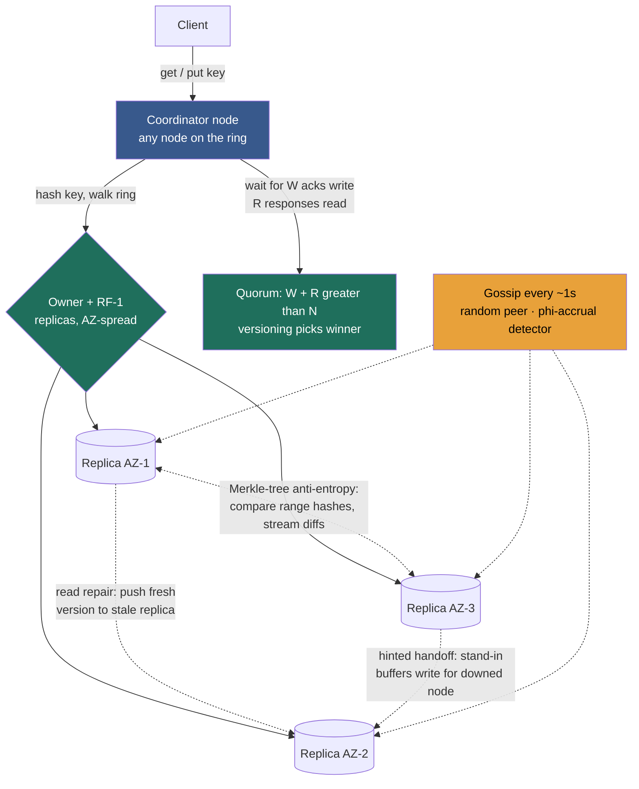

import ConsistentHashingRing from '@components/widgets/ConsistentHashingRing.jsx';

### Learning objectives
- Assemble a distributed key-value store from the Module 2 primitives: **partition** by consistent hashing (2.6), **replicate** to `RF` nodes (2.4), and read/write under a **quorum** `N/W/R` (2.8).
- Choose a **conflict-resolution** scheme — last-write-wins vs version vectors vs CRDTs — and name precisely what each silently loses.
- Explain the three **anti-entropy** mechanisms that keep replicas converging without a leader — **read repair**, **hinted handoff**, and **Merkle-tree** background repair — plus **gossip** for membership.
- Treat the **tunable-consistency knobs** (`N/W/R`, conflict policy, repair cadence) as levers set against a requirement and a budget — and quantify the cost of the side you drop.

### Intuition first
Picture a **left-luggage counter that has outgrown one desk into a hall of identical desks.** A traveller hands over a bag (a `put(key, value)`); later someone returns with a ticket and asks for it back (a `get(key)`). Three questions run the whole operation:

1. **Which desk takes the bag?** A rule maps each ticket number to a desk: the **partitioning** function — the consistent-hashing ring from Lesson 2.6, so opening a new desk doesn't force the hall to re-file every bag.
2. **How many desks hold a copy?** One desk is a single point of failure, so you stash **identical copies at the next few desks clockwise**: the **replication factor** — and when you store or fetch, you decide *how many* copies you insist on touching: the **quorum** `W` and `R`.
3. **Whose copy is the real one when two disagree?** If the same ticket's bag got swapped on two desks while the phone line between them was down, which wins on return? That's **conflict resolution** — and the honest answer is sometimes "we hand you both bags and let you sort it out."

A key-value store is the smallest interesting distributed system because it strips away schemas, joins, and transactions and leaves exactly these three questions naked. Get them right and you have the **Dynamo** design — the lineage behind **DynamoDB, Cassandra, Riak, and Voldemort** — and the substrate under most of the Module 3 building blocks that follow.

### Deep explanation

A key-value store exposes a deliberately tiny contract — `get(key)`, `put(key, value)`, `delete(key)` — over an opaque value. That minimalism is the point: by giving up joins, multi-row transactions, and a query language, you buy the freedom to **partition and replicate almost arbitrarily**, which is what lets these stores hit single-digit-millisecond latency at millions of ops/sec. The 2007 **Dynamo paper** is the canonical reference, and the rest of this lesson is a tour of its decisions — each one a Module 2 primitive snapped into place.

#### 1. Partitioning — consistent hashing, so growth is local

Hash each key onto the ring and walk clockwise to the first node — Lesson 2.6, applied verbatim. The ring, not `hash(key) mod N`, because `mod N` re-files ~90% of keys on a 10→11 node change (2.6's measured numbers) while the ring moves only **~K/N** — for a database, the difference between shipping your whole dataset and a survivable scale-out. **Virtual nodes** smooth the load spread and let heterogeneous boxes claim proportional keyspace. **Rejected alternative:** range partitioning (HBase/Spanner) keeps keys ordered for cheap range scans — but a KV store's contract is point `get`/`put`, so we trade away cheap scans for the ring's bounded-disruption rebalancing. The right trade for a point-lookup store.

#### 2. Replication — RF copies, placed for failure independence

Store each key on **RF** nodes (2.4) — almost universally **3** in production. The ring gives placement for free: the first node clockwise plus the next `RF − 1` **distinct physical** nodes. The subtlety that separates a real answer from a toy one is **failure independence**: skip nodes so the 3 copies land in **3 different AZs/racks** (Cassandra's `NetworkTopologyStrategy`), or a single AZ outage takes all three. **Rejected alternatives:** `RF = 2` halves storage cost but leaves you one failure from data loss and no headroom during a rolling deploy; `RF = 5` buys two-AZ-failure tolerance at ~67% more storage and write cost. `RF = 3` is the default precisely because it's the cheapest factor that tolerates one AZ loss.

#### 3. Reading and writing — the quorum dial `N/W/R`

There is no leader (the Dynamo choice — leaderless replication, 2.4). A **coordinator** (any node the client reaches) writes to the `N = RF` replicas and returns once **`W`** acknowledge; a read returns once **`R`** respond, taking the newest version. Lesson 2.8's quorum rule governs recency: `W + R > N` forces the read set to overlap the write set so a read cannot miss the latest acknowledged write (it guarantees the latest value is *present* — **version metadata still picks the winner**), and `W > N/2` makes concurrent writes collide on a shared replica rather than silently diverge. `W = R = 2` on `N = 3` is the canonical *strong* setting; `W = R = 1` the canonical *fast, eventual* one.

The cost is quantifiable, and it is the heart of the Director conversation: a `W = R = 1` read hits the nearest replica at **~1–5 ms**; a `W = R = 2` read waits on the 2nd-fastest of 3 replicas (often cross-AZ) at **~5–15 ms**; a cross-region strong read runs to **tens–hundreds of ms** (RTT ~150 ms, 1.4). Availability moves the opposite way: writes tolerate `N − W` replicas down, reads `N − R`. **Same store, same three replicas, two settings — picked per data-flow.** This is the PACELC dial (2.7) expressed as numbers.

#### 4. Conflict resolution — what you keep when two writes race

Leaderless + always-writable means two clients can update the same key concurrently and **both succeed on different replicas**. Three reconciliation strategies, weakest to strongest, each named by what it *loses*:

- **Last-write-wins (LWW).** Highest timestamp wins — **Cassandra's choice**, picked deliberately because version vectors need a read-before-write and LWW cuts writes to one round-trip. The price: LWW **silently discards** the losing concurrent write, and it **depends on synchronised clocks** — under skew, an older write can clobber a newer one. Correct only when last-writer-really-should-win (a profile field) and clock skew is bounded.
- **Version vectors.** Attach per-replica version counters; if one version strictly dominates, keep it — if neither does, the writes are genuinely concurrent and the store returns **both siblings** for the application (or a CRDT) to merge. **Dynamo's and Riak's choice**: never silently loses data, at the cost of metadata, a read-before-write, and merge logic pushed up to the app.
- **CRDTs.** Data types whose merge is mathematically convergent (counters, OR-sets) — concurrent writes **merge automatically**, no siblings, no app logic. The cost: only some data shapes are expressible, plus type-specific metadata.

The rule a Director states: **LWW where overwrite semantics are correct and you want the cheapest write; version vectors where losing a concurrent write is unacceptable; CRDTs where the type fits and you want hands-off merge.** Each rejected option is rejected by the loss it would cause.

#### 5. Anti-entropy — converging replicas without a leader

`W = R = 1` (or any partition) leaves replicas temporarily disagreeing. Three healers, at three cadences: **read repair** (on the read path — a coordinator that spots a stale replica writes the fresh value back; cheap, but only heals keys that are actually read), **hinted handoff** (on the write path — a reachable stand-in accepts a write for a downed node and forwards it on recovery, keeping the store write-available through a node bounce; 2.8's *sloppy quorum* trade), and **Merkle-tree background repair** (for cold, long-divergent data — replicas compare hash trees of their key ranges and stream only the keys that actually differ, turning "compare a billion keys" into a few kilobytes of hashes). The Director-relevant fact about the third: it is **CPU/IO-heavy, throttled, and scheduled off-peak** — an operational tax you capacity-plan — and skipping it lets deleted data resurrect (the "zombie data" failure).

#### 6. Membership — gossip, so there's no master directory

Every node learns the ring (who owns what, who's up) by **gossip**: each node periodically exchanges state with a random peer, so a fact spreads epidemically to all `N` nodes in **O(log N)** rounds with no central coordinator. Failure detection rides the same channel. **Rejected alternative:** a central membership service (ZooKeeper/etcd) gives a strongly-consistent view but reintroduces a coordination tier — a bottleneck and a dependency the AP, no-SPOF design deliberately avoids. The trade: gossip membership is itself only eventually consistent (nodes briefly disagree during churn), acceptable because the quorum and anti-entropy layers tolerate it.

Put together, those six decisions *are* a Dynamo-style key-value store: a leaderless ring, any node coordinating, `RF` AZ-spread copies, per-operation quorums, versioned conflict resolution, three background healers, glued by gossip.

Go deeper — vnodes, version vectors, Merkle and gossip mechanics (IC depth, optional)

- **Virtual nodes:** 100–256 vnodes per physical node smooth a lumpy ring from a ~1.7× hot-node peak toward ~1.1×, scatter a dead node's load across all survivors instead of one neighbour, and let a 64-core box own ~4× the keyspace of a 16-core box. Cassandra walked its default back from 256 to 16 because many vnodes inflate streaming/repair cost.
- **Version-vector dominance:** a value tagged `{A:2, B:1}` dominates `{A:1, B:1}` (≥ on every entry → strictly newer); `{A:2, B:1}` vs `{A:1, B:2}` is concurrent → siblings. Dynamo's cart merged siblings toward *keeping* the item (a re-added deleted item wins) because dropping a sale costs more than one stale entry.
- **Merkle repair:** each replica builds a binary hash tree over its key range; compare root hashes — equal means identical, zero data moves; different means descend only the differing subtrees, exchanging O(log n) hashes to localise divergence. Cassandra runs this as `nodetool repair`; it must complete within `gc_grace_seconds` or expired tombstones let deletes resurrect.
- **Hinted handoff details:** hints carry a TTL/cap — a node down longer than the hint window loses them, and Merkle repair takes over. While hints are outstanding, the sloppy quorum breaks `W + R > N` overlap.
- **Gossip/failure detection:** ~1s cadence, random peer, heartbeat versions. Cassandra's **phi-accrual detector** outputs a continuous suspicion level instead of binary up/down, so the threshold adapts to network jitter rather than flapping on one slow packet.

### Diagram — request path plus the three background healers

### Interactive widget — feel the partitioning layer
The store's first decision is *which node owns a key*, and the ring below makes that tangible. Add and remove nodes and watch ownership recolor only the **one arc** the new node steals (≈ K/N of the dots), not the whole ring. Slide the **virtual-nodes** count from 1 to 256 and watch the per-node load bars converge from a lumpy ~1.7× peak toward an even ~1.1×. Mentally overlay the rest of the store: for `RF = 3`, each key's value also lives on the **next two distinct nodes clockwise**, and a quorum read consults `R` of those three. The counter reports the exact **percentage of keys that moved** on the last change — confirm the ring stays near 1/N while naive modulo blows past 90%.

<ConsistentHashingRing client:load />

### Worked example — Amazon DynamoDB and Cassandra, one design, two products

**The shopping cart that started it all.** Amazon's requirement (the RESHADED **R** step) was brutal: *Add to Cart* must **never** reject a write — a refused add is a lost sale. That requirement *forces* an **AP, eventually-consistent** design: `N = 3, W = 1, R = 1` — return on the first ack, survive 2 of 3 replicas down, ~1–5 ms. `W + R = 2`, deliberately **not** `> 3` — staleness on a second device for a few hundred ms is invisible, uptime is sacred. Concurrent edits surface as **version-vector siblings**, merged toward keeping the item; under partition it runs as a sloppy quorum with hinted handoff. In DynamoDB terms this is the default: **eventually-consistent reads cost 0.5 RCU per 4 KB**. **Rejected alternative:** a majority quorum would lift every write to cross-AZ ~5–15 ms and *refuse* adds when 2 of 3 replicas are unreachable — paying latency and availability for recency a cart doesn't need.

**The inventory decrement on the same cluster.** "Never sell the last unit twice" flips every knob: `N = 3, W = 2, R = 2` so `W + R > N` and `W > N/2`. In DynamoDB this is a **strongly-consistent read at 1 RCU per 4 KB — literally 2× the cost** of the eventual read: *consistency has a dollar price.* The honest caveat (and the senior move): **quorum alone does not finish the job.** A decrement is a read-modify-write, and a quorum makes the *read* strong but not the *sequence* atomic — two decrements can each read `stock = 1` and each write `0`, overselling by one with `W + R > N` holding throughout. To actually prevent the oversell you bolt a **conditional write / compare-and-set** on top — DynamoDB's `ConditionExpression` or a Cassandra lightweight transaction (a Paxos round). **Quorum delivers recency; serializing the read-modify-write is a separate machine you add.**

The interview-grade takeaway: **one store, one ring, three replicas — two opposite consistency contracts chosen per data-flow from the requirement, each with the rejected side's cost quantified.** And the flavour difference matters: Cassandra resolves conflicts with **LWW per cell** (cheap writes, silent loss, NTP-dependent); the Dynamo/Riak lineage uses **version vectors** (no silent loss, app-side merge) — the same problem, two answers, picked by whether a dropped concurrent write is tolerable.

### Trade-offs table — conflict-resolution strategy
| Strategy | Metadata / write cost | What it silently loses | Used by | Use when… |
|---|---|---|---|---|
| **Last-write-wins (LWW)** | Lowest — a timestamp, **no read-before-write** (1 round-trip) | A losing concurrent write **vanishes**; wrong winner under clock skew (needs NTP) | **Cassandra** (per cell) | Overwrite semantics are correct (profile field, config) and clocks are tight |
| **Version vectors / vector clocks** | Higher — per-replica counters + **read-before-write** | Nothing — surfaces **siblings** for app/CRDT merge | **Dynamo, Riak, Voldemort** | Losing a concurrent write is unacceptable (cart, collaborative state) |
| **CRDTs** | Higher — type-specific merge metadata | Nothing — **auto-merges**, no siblings | **Riak** types, **Redis** Enterprise active-active | The data fits a CRDT (counters, sets, registers) and you want hands-off merge |

### What interviewers probe here
- **"Walk me through a `get` and a `put` in a Dynamo-style store."** — *Strong:* coordinator hashes the key onto the ring, forwards to the `RF` AZ-spread replicas, waits for `W` acks (write) or `R` responses (read), versioning picks the winner; names the `N/W/R` knob and the latency it buys. *Red flag:* assumes a single leader or a single copy, or can't say where the value physically lives.
- **"Two clients write the same key concurrently. What happens, and what do you lose?"** — *Strong:* names the strategy and its loss — LWW silently drops one (and depends on clock sync); version vectors return siblings; CRDTs auto-merge. *Red flag:* "last write wins" with no awareness that a write disappears, or thinking the quorum prevents the conflict.
- **"How do replicas converge with no leader?"** — *Strong:* read repair (hot keys), hinted handoff (transient failures), Merkle repair (cold data, background) — and knows the last is a throttled, capacity-planned tax. *Red flag:* "they just sync."
- **"How does the cluster track membership and failures?"** — *Strong:* gossip — random peer exchange, O(log N) spread, no central directory. *Red flag:* reaches for a central master/ZooKeeper without noting it reintroduces the coordination tier and SPOF the AP design avoided.
- **"You're picking the consistency level for a new data-flow — how, and who decides?"** — *Strong:* derive `N/W/R` from the requirement, quantify the dropped side (p99 lift, failures tolerated, RCU/$ cost, oversell risk), and **delegate the benchmark credibly** — "I'd have the storage team measure `LOCAL_QUORUM` vs `ONE` p99 across our AZ topology; my prior is majority for the ledger, `ONE` for the feed." *Red flag:* one global consistency setting, or no cost attached to "make it strongly consistent."

The throughline at Director altitude: treat `N/W/R`, the conflict policy, and the repair cadence as **levers against a requirement and a budget**, **quantify the side you drop**, and **own the decision while delegating the IC-depth measurement.**

### Common mistakes / misconceptions
- **Thinking a KV store has one copy or one leader.** It's leaderless, `RF`-replicated, quorum-read; any node coordinates. "Where does the data live" is *RF nodes across RF AZs*, not "the server."
- **Believing the quorum resolves conflicts.** `W + R > N` only guarantees the latest write is *present* in the responses; **versioning** picks the winner — and `W > N/2` only makes concurrent writes *detectable*, not prevented.
- **Treating LWW as safe.** It silently **discards** a concurrent write and depends on synchronised clocks. Use version vectors/CRDTs when a lost write is unacceptable.
- **Forgetting anti-entropy is an operational tax.** Read repair only heals read keys; hints expire; Merkle repair must be scheduled — skip it and deleted data resurrects.
- **One consistency setting for the whole store.** The win is **per-operation** `N/W/R`: cart at `W=R=1`, ledger at `W=R=2` (+ a conditional write) — on the *same* cluster.

### Practice questions
**Q1.** Design the storage layer for a globally-available shopping cart that must never reject an *add to cart*. Specify partitioning, replication, `N/W/R`, and conflict handling, and name what you trade away.
> *Model:* Partition by **consistent hashing** (scaling moves only ~K/N keys). Replicate `RF = 3` across **3 AZs** so an AZ loss leaves two serving copies. Set `N = 3, W = 1, R = 1` — ~1–5 ms, always-writable, surviving 2 of 3 replicas down; deliberately `W + R < N`, i.e. eventually consistent, because cross-device staleness of a few hundred ms is invisible. Under partition, a **sloppy quorum + hinted handoff** lands the add on a reachable node and forwards it home later. Resolve concurrent edits with **version vectors**, merging toward *keeping* the item — never silently dropping a write, because a lost cart item is a lost sale. **Traded away:** read recency and the quorum-overlap guarantee during the partition window — accepted on purpose; the requirement prioritises availability. (This is the original Dynamo motivation.)

**Q2.** A Cassandra cluster occasionally shows a row reverting to an old value after a node was down and recovered. No application bug. What's happening, and what's the fix?
> *Model:* Two suspects, both rooted in **LWW + operations**. (a) **Clock skew:** Cassandra resolves per cell by highest timestamp; if the recovered node's clock ran ahead, a stale write can carry a higher timestamp than the correct newer write and win — fix with rigorous **NTP**, and note LWW is fundamentally clock-dependent. (b) **Missed repair:** if the node was down longer than the hint window, hinted handoff dropped its hints, and read repair only heals keys that get read — cold keys stay divergent until Merkle repair runs, and if a delete's tombstone expired before repair propagated it, the old value **resurrects** (zombie data). Fix: run repair on a schedule inside the tombstone grace window, throttled and off-peak. The Director point: this is an *operational* failure of the anti-entropy cadence, owned by capacity-planning the repair job, not a code bug.

**Q3.** Your team wants a central membership directory "so every node has a consistent, authoritative view of the ring." Evaluate.
> *Model:* Push back, but acknowledge the real tension. **Gossip** already spreads membership in O(log N) rounds with **no SPOF** — the AP posture a Dynamo store is built for. A central directory (ZooKeeper/etcd) gives a strongly-consistent view, genuinely nicer during rapid churn — but it reintroduces a **coordination tier**: another system to run, a potential bottleneck, and a dependency whose outage can stall the cluster. The architecture deliberately tolerates eventually-consistent membership because the quorum and anti-entropy layers absorb the transient disagreement. So: keep gossip for membership; reserve a coordination service for the narrow places needing real consensus (lightweight transactions, leader election for specific operations). The signal is weighing "stronger view" against "new SPOF + operational tier" rather than reflexively centralising.

**Q4.** A per-user "items purchased" counter is read constantly and incremented from many regions concurrently. LWW, version vectors, or CRDT — and why?
> *Model:* **CRDT** — a counter type (PN-/G-counter). Concurrent increments from many regions are the worst case for both alternatives: **LWW** keeps only one of two concurrent `+1`s — **undercounting** — and **version vectors** surface every concurrent pair as siblings, pushing merge onto the application on every read. A counter CRDT merges automatically: each replica tracks per-replica sub-counts and the merged value is their sum, so all increments count with no siblings and no app logic. Cost named: per-replica metadata, and it only works because "increment" is a CRDT-expressible shape — an arbitrary read-modify-write wouldn't fit, and you'd fall back to a conditional write/LWT. Rejected alternatives rejected by their loss: undercount (LWW), per-read merge burden (vectors).

### Key takeaways
- A Dynamo-lineage key-value store is the Module 2 primitives assembled: **consistent-hashing partitioning** (2.6) + **`RF`-replication across AZs** (2.4) + **per-operation quorum `N/W/R`** (2.8) + versioning + anti-entropy + gossip — leaderless, any node coordinates.
- **`RF = 3` across 3 AZs** is the default because it's the cheapest factor surviving one AZ loss; **`N/W/R` is the per-data-flow dial** — `W=R=1` (~1–5 ms, eventual, always-writable) vs `W=R=2` (~5–15 ms, strong) — the PACELC trade as numbers, and in DynamoDB a literal **2× RCU cost** for strong reads.
- **Conflict resolution is a named trade:** LWW (cheapest write, **silently drops** a concurrent write, needs NTP) vs version vectors (**no loss**, app merges siblings) vs CRDTs (auto-merge, limited shapes).
- **Three healers converge replicas with no leader:** read repair (hot keys), hinted handoff (transient failures), Merkle-tree repair (cold data) — the last a **throttled, scheduled operational tax** whose neglect resurrects deleted data.
- **Gossip** spreads membership in O(log N) rounds with no central directory — the decentralised choice that preserves the no-SPOF posture; and quorum gives recency, not atomic read-modify-write (add a conditional write/LWT for counters and decrements).

> **Spaced-repetition recap:** A KV store = a hall of left-luggage desks. Which desk? **Consistent-hashing ring** (~K/N moves, not 90%). How many copies? **RF = 3 across 3 AZs.** How many to touch? The **`N/W/R` quorum** (`W+R>N` for recency — 2× cost for DynamoDB strong reads). Whose copy wins? **LWW** (silent loss, needs NTP) / **version vectors** (siblings) / **CRDTs** (auto-merge). Converge via **read repair + hinted handoff + Merkle repair**, membership via **gossip**. Quorum ≠ atomic read-modify-write — add a conditional write/LWT.

---

*End of Lesson 3.4. The key-value store is the substrate beneath much of Module 3 — the Distributed Cache (3.7) is a KV store tuned for volatility, and the Sharded Counters (3.16) lesson is this conflict-resolution problem in miniature.*
