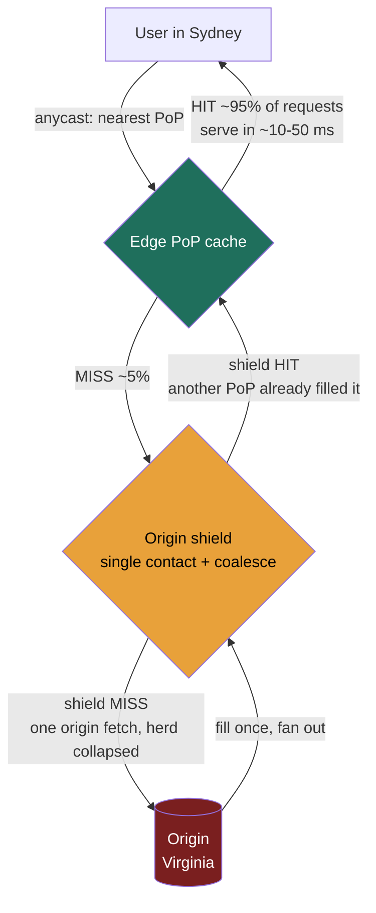
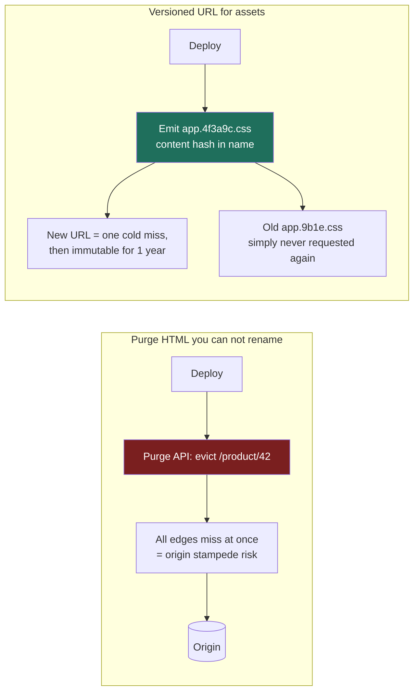

### Learning objectives
- Explain *why* a CDN exists — that it buys two things at once, **user-facing latency** and **origin offload** — and quantify both from the **cache-hit ratio**.
- Contrast **pull (origin-pull)** and **push** CDNs, and state which content and which operating model each one fits.
- Reason about the **cache key, TTLs, and invalidation** — `Cache-Control` semantics, `stale-while-revalidate`, and the two real-world invalidation strategies (**purge** vs **versioned/fingerprinted URLs**) and why one is vastly cheaper to operate.
- Use **origin shielding / tiered caches** and **anycast geo-distribution** to raise hit ratio and cut origin load, and decide **what does and does not belong on a CDN**, including the **cost model** a Director signs off on.

### Intuition first
Your origin is **one central warehouse**, and every customer order — a product image, a JavaScript bundle, a video segment — is a round trip to that one warehouse. If the warehouse is in Virginia and the customer is in Sydney, every order is a ~150 ms transcontinental flight (recall the latency ladder in Lesson 1.4), and the warehouse loading dock can only push so many pallets per hour before it jams.

**A CDN is a network of neighborhood corner stores — hundreds of them, one near every customer.** The first time anyone in Sydney asks for an item, the local store doesn't have it, so it fetches one copy from the warehouse and *keeps it on the shelf*. Every Sydney customer after that is served from the corner store down the street — a ~10–50 ms walk, not a ~150 ms flight — and, just as importantly, **the warehouse never sees those orders at all**. If the corner store satisfies 95 out of every 100 requests, the warehouse's loading dock now handles **5 pallets where it used to handle 100** — a 20× reduction in load for the same customer demand.

That second effect is the one beginners miss. A CDN is not only "make it faster for the user"; it is **"make the origin do 20× less work,"** and those two wins are the *same number* — the cache-hit ratio — read two different ways. The whole lesson is: how high can you push that ratio, what content is even *eligible* to sit on the shelf, how you take stale stock off the shelf, and what the corner-store network costs you per month.

### Deep explanation

**What a CDN actually is, and the two wins it buys.** A CDN is a globally distributed fleet of caching reverse proxies (Lesson 2.1) — **Points of Presence (PoPs)**, hundreds of them (Cloudflare ~330+ cities, Akamai ~4,000+ edge locations, AWS CloudFront ~600+ PoPs) — each holding cached copies of your content close to users. It buys two things from **one** mechanism (a cache hit at the edge):

1. **User-facing latency.** A hit is served from a PoP ~10–50 ms from the user (Lesson 1.4's CDN figure) instead of a ~150 ms transcontinental round trip to origin — and that's *before* you add origin processing, TLS handshake, and queueing. For a media-heavy page pulling 50 objects, moving them from origin to edge can cut **seconds** of wall-clock load time, because the objects parallelize against a nearby PoP instead of a distant origin.
2. **Origin offload.** Every hit is a request your origin **never sees**. This is the dimension a Director must foreground, because it's the one that shows up on the **bill** and in the **capacity plan**: origin servers, origin bandwidth (egress), and origin database load all scale with the *miss* rate, not the request rate.

**The hit-ratio math — the single most important number in this lesson.** Let total edge requests be **R** and the cache-hit ratio be **h**. Then:

> **Origin requests = R × (1 − h)**

This relationship is brutally non-linear near the top, and *that* is the senior insight. Take R = 1,000,000 req/s of static assets:

| Hit ratio **h** | Origin requests = R×(1−h) | Origin load vs. no CDN |
|---|---|---|
| 0% (no CDN) | 1,000,000 /s | 1× (baseline) |
| 90% | 100,000 /s | **10× less** |
| 95% | 50,000 /s | **20× less** |
| 99% | 10,000 /s | **100× less** |
| 99.9% | 1,000 /s | **1000× less** |

The headline: **going from 90% → 99% is not a 9% improvement — it cuts the origin load another *10×* (10×→100× vs. baseline, a further 10× drop).** The last few percent of hit ratio are where the origin-fleet savings live, which is exactly why origin shielding and tiered caches (below) — techniques that exist purely to claw back that last few percent — are worth real engineering. (This mirrors the Redis read-cache math from Lesson 2.10: a 90% hit rate cuts origin reads 10×; the CDN is the same lever, applied at the network edge to whole HTTP objects instead of in front of a database.)

**On latency, weight by the ratio too.** The user-perceived average isn't the edge number; it's `h × (edge latency) + (1−h) × (origin-fetch latency)`. At h = 95%, edge ~30 ms, origin fetch ~180 ms: `0.95×30 + 0.05×180 = 28.5 + 9 = ~37.5 ms` average — close to the edge number *because* most requests hit. Drop the hit ratio to 70% and the same formula gives `0.7×30 + 0.3×180 = 21 + 54 = 75 ms` — **2× worse**, driven entirely by the misses. **Hit ratio governs both axes**; a "fast CDN" with a poor hit ratio is neither fast nor cheap.

**Pull vs push — who puts content on the shelf.** This is the first real fork, and it's a requirements decision.

- **Pull (origin-pull) — lazy, fill-on-miss.** You change *nothing* about how you publish content; you just point the CDN at your origin and rewrite asset URLs to the CDN hostname. The **first** request for an object in a given PoP **misses**, the PoP fetches it from origin, caches it per the `Cache-Control` TTL, and serves every subsequent request locally until the TTL expires. *Win:* trivial to operate, no publish pipeline, the edge self-populates only what's actually requested (no wasted storage on cold objects). *Cost:* the **first user per PoP eats a cache-miss penalty** (a full origin round trip — the "cold cache" tax, paid once per object per PoP), and a traffic spike on a *new* object (a just-published viral asset) can briefly stampede the origin until the edges fill. This is the default for **CloudFront, Cloudflare, Fastly, Akamai** general web delivery — and the right default for ~95% of systems.
- **Push — eager, pre-positioned.** *You* proactively upload (or the CDN pre-fetches) content to the edge **before** any user asks, so there is **no first-request miss**. *Win:* no cold-cache penalty, full control over exactly what's where and when, and you can fill during **off-peak** hours to avoid competing with live traffic. *Cost:* you own a **distribution/publish pipeline**, you pay to store content at the edge **whether or not it's ever requested**, and you must decide placement. Push earns its keep for **large, predictable, high-value catalogs** — the canonical example is **Netflix Open Connect**: Netflix pushes its video catalog onto purpose-built appliances (placed inside ISP networks) **overnight**, predicting tomorrow's demand, so that at peak the bytes are already local and the origin/transit links are never the bottleneck. You would never pull-fill a 4 GB movie on the first Sydney viewer's request; you push it ahead of time.

The discriminating rule: **pull when content is long-tail, unpredictable, or cheap to miss once; push when content is large, predictable, and a first-request miss is unacceptable** (video, game patches, OS updates). Most teams are pull and shouldn't talk themselves into push's operational weight without that predictability.

**The cache key — what makes two requests "the same object."** A CDN serves a hit only when an incoming request matches a cached entry's **cache key**. By default the key is roughly the **host + path + query string**; from there it's a tuning surface with sharp edges:

- **Query strings:** if `?utm_source=…` analytics params are part of the key, the *same* image under 50 marketing campaigns becomes **50 separate cache entries** — hit ratio collapses and origin load multiplies. The fix: **strip or ignore** marketing/irrelevant query params from the key (every CDN supports a query-param allowlist). Conversely, params that genuinely change the response (`?w=400` for a resized image) *must* stay in the key.
- **`Vary` header:** tells the CDN to key on a request header too. `Vary: Accept-Encoding` (serve gzip vs brotli vs identity separately) is correct and necessary. `Vary: User-Agent` is a **classic foot-gun** — there are thousands of distinct UA strings, so you'd fragment the cache into thousands of near-duplicate entries and gut the hit ratio. `Vary: Cookie` effectively makes content **uncacheable** (every user has a unique cookie). **Cookies are the silent hit-ratio killer**: many CDNs won't cache a response that sets a cookie, so an analytics tag that stamps a cookie on your *static* assets can quietly drop them to 0% hit. A Director-level diagnosis of "our hit ratio is only 60%" usually ends at cookies, UA `Vary`, or unstripped query params.

**TTLs and freshness — how long stock stays on the shelf.** The origin controls cache lifetime via HTTP response headers (this is the same `Cache-Control`/`ETag` machinery REST gives you for free, from Lesson 2.10):

- **`Cache-Control: max-age=N`** — the object is fresh for N seconds at the edge (and browser). After that it's **stale** and the edge revalidates with origin.
- **`s-maxage=N`** — a *separate* TTL for **shared caches (the CDN)** vs the browser's `max-age`. You typically want a long edge TTL and a short browser TTL so you can purge the edge centrally without waiting for millions of browser caches to expire.
- **`ETag` + conditional `If-None-Match`** — on revalidation the edge asks origin "still the same?"; origin replies **`304 Not Modified`** (tiny, no body) if unchanged. So even a *miss-after-expiry* is cheap if the content didn't change — you pay headers, not the whole payload.
- **`stale-while-revalidate=N`** (RFC 5861) — the killer feature for latency: serve the **stale** copy **immediately** to the user while the edge revalidates **in the background**. The user never waits on the revalidation; the next user gets the fresh copy. **`stale-if-error=N`** likewise serves stale content if the origin is **down** — turning the CDN into a **shock absorber** that keeps your site up through an origin outage. Naming `stale-while-revalidate` is a strong signal: it decouples freshness from the user's critical path.

**Invalidation — taking stale stock off the shelf (the genuinely hard part).** "There are only two hard things in computer science: cache invalidation and naming things." On a CDN there are two strategies, and the choice has real operational and cost weight:

- **Purge (active invalidation).** You tell the CDN "evict this object (or this tag/prefix) **now**." Two flavors: by **URL/path** (purge `/css/app.css`) or by **surrogate key / cache tag** (purge everything tagged `product-42`, a Fastly/Akamai feature — invaluable for invalidating *all* pages that embedded a changed product). Modern CDNs purge globally in **seconds** (Fastly advertises ~150 ms; CloudFront historically minutes). *Cost:* purges can be **rate-limited and/or billed**, a purge **storm** on a deploy creates a **cache-miss stampede** against origin (everything you just evicted now misses at once), and "purge everything" is an availability foot-gun. You purge **content you can't rename** — chiefly **HTML pages** whose URL must stay stable (`/`, `/product/42`).
- **Versioned / fingerprinted URLs (the preferred default for assets).** Instead of evicting `app.css`, you publish `app.4f3a9c.css` — the content hash is **in the filename**. A new build produces a **new URL**, so the old cached entry is simply **never requested again** and the new URL is a guaranteed cache miss exactly once, then hot forever. *Win:* you can set `Cache-Control: max-age=31536000, immutable` (**one year**, never revalidate) on every asset, maximizing hit ratio, **with zero purge API calls** — invalidation becomes a *publish* step, not a *runtime* operation. This is what every modern bundler (webpack/Vite "content hashing") does, and it's the reason static-asset hit ratios can sit at **99%+**. *Cost:* requires a build/deploy step that rewrites references, and you must keep old versions around briefly for in-flight clients.

The senior framing: **version everything you can rename (assets), purge only what you can't (HTML).** A design that "purges the CDN on every deploy" for assets is reaching for the expensive, stampede-prone tool when fingerprinted URLs make invalidation free.

**Static vs dynamic at the edge — what's even cacheable.** The cleanest fit is **immutable static assets** — images, video segments, CSS/JS bundles, fonts — identical for every user, cache once, serve millions. But CDNs also accelerate a spectrum of *less* static content:

- **Personalized/dynamic API responses** (a logged-in user's feed) are **per-user** and typically **not cacheable** — caching them risks serving **user A's data to user B**, a security incident, not a performance bug. These you generally **don't** cache; you may still route them *through* the CDN to ride its optimized backbone (a warm, persistent origin connection, TLS termination at the edge, HTTP/2/3) — **dynamic acceleration / route optimization** without caching the body.
- **Semi-dynamic** content (a product page that's the same for everyone but changes hourly) caches well with a **short TTL** + `stale-while-revalidate` — accept seconds of staleness for a huge offload.
- **ESI (Edge Side Includes)** assembles a page at the edge from cacheable fragments (cache the page shell + product block for an hour, stitch in a per-user `<esi:include>` for the cart badge) — supported by Akamai/Fastly/Varnish. It's powerful but adds complexity; reach for it only when a page is *mostly* cacheable with a *small* personalized hole.

**Origin shielding and tiered caches — manufacturing the last few percent of hit ratio.** A flat CDN has a hidden flaw: with hundreds of PoPs, the **first** request for an object in **each** PoP is a miss that hits origin. For 300 PoPs, one new object can mean **300 origin fetches** — and on a viral object, that's a stampede. The fix is a **hierarchy**:

- **Origin shield** — designate **one** PoP (or a small tier) as the **single point of contact** for origin. Edge PoPs that miss don't go to origin; they go to the **shield**, which goes to origin **once** and fans the result back out. Now a new object causes **1** origin fetch, not 300. The shield also **collapses concurrent misses** (request coalescing): a thundering herd of simultaneous requests for the same uncached object becomes **one** origin request, the rest wait for it. This is the CDN-scale answer to the cache-stampede problem from Lesson 2.10.
- **Tiered cache** — generalizes the shield into edge → regional/mid-tier → shield → origin. Each tier absorbs the misses of the tier below, so the **effective** origin hit ratio climbs toward 99.9%+. Cost: an extra intra-CDN hop on a miss (a few ms) and, usually, a line item on the bill. You enable it precisely when **origin protection** (offload, stampede defense) matters more than shaving milliseconds off the rare miss — which, for any origin you're trying to keep small and cheap, it does.

**Geo-distribution and anycast — how a request finds the nearest PoP.** Two mechanisms route a user to a close edge:

- **Anycast (BGP).** The CDN announces the **same IP address** from **every** PoP, and the internet's routing (BGP) naturally delivers each user's packets to the **topologically nearest** PoP. *Win:* near-instant failover — if a PoP dies, BGP reconverges and traffic flows to the next-nearest PoP **with no DNS change** to wait on — and it doubles as **DDoS absorption** (attack traffic is spread across every PoP rather than concentrated). Used by **Cloudflare and Fastly** as their core model.
- **DNS-based routing.** The CDN's authoritative DNS resolves your asset hostname to **different PoP IPs** depending on the resolver's location (and real-time PoP health/load). *Win:* finer, load-and-health-aware steering. *Cost:* it's bounded by **DNS TTLs** — a failed PoP keeps getting traffic until cached DNS entries expire, so failover is slower than anycast's. Historically **Akamai's** core mechanism; **CloudFront** uses a mix. (This connects to Lesson 3.1/DNS and 3.2/load-balancing: a CDN is, in effect, global load balancing *plus* caching.)

Either way, the payoff is the same: terminate TLS and serve bytes from ~10–50 ms away instead of a single distant origin, for **every** user on **every** continent — which a single-region origin, however big, physically cannot do (the speed of light is not negotiable; ~150 ms transcontinental is a floor).

**The cost model — what a Director is actually signing.** A CDN bill has a few levers, and the headline is usually **net savings**, not net cost:

- **Egress (data transfer out)** — the dominant line. CDN egress runs roughly **$0.02–$0.12/GB** depending on provider, region, and committed volume (CloudFront's first tier is ~**$0.085/GB** in North America; cheaper at commit). That sounds like pure cost until you compare it to the alternative: serving the same bytes **straight from origin** pays the cloud's *own* egress (**~$0.09/GB** S3→internet on AWS) **plus** the origin compute and bandwidth to push them — and from one region, slowly. **Crucially, a byte served from an edge cache hit incurs *no origin egress at all*** — the CDN already has it. So at a 95% hit ratio you've moved **95% of your bytes off origin egress** and onto (often cheaper, often commit-discounted) CDN egress. For high-volume media, **the CDN bill is frequently *lower* than the origin-egress bill it replaces** — the rare infra line item that saves money rather than spends it.
- **Requests** — a small per-10,000-requests fee (e.g. ~$0.01 per 10k HTTPS requests on CloudFront), negligible unless you're serving tiny objects at extreme volume.
- **Premium features** — origin shield, tiered cache, real-time logs, image optimization, WAF, and **purge volume** can carry surcharges. Some providers (Cloudflare, and Bandwidth-Alliance members) **bundle or zero-rate** egress, changing the calculus entirely.

The number to keep in your head: **CDN cost scales with bytes served and the *miss* rate; origin cost scales with the *miss* rate.** Raising the hit ratio cuts *both* the origin bill and the slow path simultaneously — which is why hit ratio is the metric a Director instruments and reviews, not raw bandwidth.

### Diagram — request flow: edge → shield → origin (with the offload math on the edges)

Green = the ~95% of requests that **never leave the user's region** (the latency + offload win). Amber = the shield that turns *N PoPs' misses* into **one** origin fetch and **collapses** a thundering herd. Red = the origin you are deliberately shrinking — it sees only `R × (1 − effective hit ratio)`, which the shield/tier pushes toward 1% of total.

### Diagram — invalidation: purge vs versioned URL

Purge is a **runtime** operation (rate-limited, stampede-prone) for content with a fixed URL. Versioning makes invalidation a **publish-time** non-event — the old entry isn't evicted, it's **abandoned** — which is why fingerprinted assets get a one-year `immutable` TTL and ~99%+ hit ratios.

### Worked example — a media-heavy product page (CloudFront/Cloudflare) and Netflix's catalog (Open Connect)
**The web app (pull).** An e-commerce site serves a product page with ~50 static objects (images, CSS/JS bundles, fonts) plus a small personalized cart badge, to users on every continent, at peak **1,000,000 asset requests/s**.

- **Pull CDN, fingerprinted assets.** Bundles and images ship as `name.<hash>.ext` with `Cache-Control: public, max-age=31536000, immutable`; product images carry a 1-hour `s-maxage` so price/photo refreshes propagate. Cache key **strips** `utm_*`/session query params; **no** `Vary: User-Agent`; the analytics cookie is scoped to the API host, **not** the asset host, so assets stay cacheable. Result: **~99% hit ratio** on assets.
- **The offload, quantified.** Origin sees `1,000,000 × (1 − 0.99) = 10,000 req/s` instead of 1,000,000 — a **100×** reduction. Add an **origin shield** so a freshly deployed bundle is fetched from origin **once** (not once per PoP), eliminating the deploy-time stampede. The static-asset origin can now be a small S3 bucket behind the shield rather than a fleet.
- **The latency, quantified.** Sydney users get assets from a local PoP at ~30 ms instead of a ~150 ms+ Virginia round trip per object; across 50 parallelized objects that's the difference between a snappy page and a multi-second one.
- **The personalized hole.** The cart badge is **per-user** and **not cached** (caching it would leak one user's cart to another) — it's a small dynamic call routed *through* the CDN (warm origin connection, edge TLS) but served from origin, or assembled via **ESI** into the otherwise-cached shell. The page is *mostly* cached with a *small* dynamic hole — the right decomposition.
- **The bill.** ~99% of bytes leave origin egress and ride CDN egress (often commit-discounted and, on some providers, bundled). For this volume the CDN line item typically comes in **at or below** the origin-egress bill it replaces — you bought global latency *and* saved money.

**Netflix (push) — why the same playbook flips.** A 4 GB movie streamed by millions cannot be pull-filled on the first viewer's request (a 4 GB cold miss across a transit link at peak is exactly what you must avoid). Netflix runs **Open Connect**: it **pushes** the catalog onto appliances placed **inside ISP networks**, filled **overnight** by predicting tomorrow's demand. At peak, the bytes are already a few ms from the subscriber, transit links aren't saturated, and there is **no first-request miss** because nothing is filled on demand. The decision flips from pull to push for one reason named in the requirements: content is **large, predictable, and a cold miss is unacceptable** — the exact inverse of the long-tail web assets above.

The throughline across both: **choose pull vs push from the content profile, maximize hit ratio with key hygiene + versioning + shielding, and never cache per-user data.**

### Trade-offs table — pull vs push vs no-CDN
| | **Pull (origin-pull)** | **Push (pre-positioned)** | **No CDN (origin-direct)** |
|---|---|---|---|
| Who fills the edge | CDN, lazily on first miss | You, eagerly before requests | n/a |
| First-request penalty | **yes** (one cold miss per object per PoP) | **none** (already there) | n/a (always "cold" = origin) |
| Operational weight | low (point + rewrite URLs) | high (publish pipeline, placement) | lowest (nothing to run) but… |
| Edge storage cost | only what's requested | everything pushed, requested or not | none |
| User latency (global) | ~10–50 ms on hits | ~10–50 ms always | ~150 ms+ for distant users |
| Origin offload | high (scales with hit ratio) | **highest** (predictable, pre-filled) | **none** (origin sees 100%) |
| **Use when…** | long-tail, unpredictable, cold-miss-tolerable content — **~95% of systems** | large, predictable, high-value catalogs where a cold miss is unacceptable (video, game/OS updates) | tiny single-region audience, or truly per-user/uncacheable content where a CDN adds cost without offload |

### Trade-offs table — invalidation strategy
| | **Purge by URL/path** | **Purge by tag / surrogate key** | **Versioned / fingerprinted URL** |
|---|---|---|---|
| When it happens | runtime (deploy/publish) | runtime | publish/build time |
| Granularity | one object | all objects sharing a tag (e.g. `product-42`) | per-object (new hash = new object) |
| Origin-stampede risk | yes (evicted = misses) | yes, broader | **none** (old entry abandoned, not evicted) |
| Cost / limits | rate-limited, sometimes billed | rate-limited, sometimes billed | **free** (a publish step) |
| Max TTL you can safely set | short-ish (must be purgeable) | short-ish | **1 year, `immutable`** |
| **Use when…** | content with a **fixed URL** you can't rename — **HTML pages** | invalidate **many pages** that embedded one changed entity | anything you **can** rename — **static assets** (the default) |

### What interviewers probe here
- **"You add a CDN — what *two* things did it buy you, with numbers?"** — *Strong:* names **both** user latency (~30 ms edge vs ~150 ms+ origin) **and** origin offload, and quantifies offload as `R×(1−h)` — "at 95% hit ratio my origin sees 5% of traffic, 20× less; at 99%, 100× less." *Red flag:* "it makes the site faster" with no mention of origin offload or the hit-ratio math — the Director-altitude point is the **cost/capacity** win, not just speed.
- **"Pull or push, and why?"** — *Strong:* pull by default (long-tail, no publish pipeline, accept a one-time cold miss), push only for large/predictable catalogs where a cold miss is unacceptable, with Open Connect as the worked example. *Red flag:* pushing everything (needless operational weight) or not knowing the distinction.
- **"Your hit ratio is 60% — diagnose it."** — *Strong:* immediately reaches for the cache-key killers — **cookies on static assets**, **`Vary: User-Agent`**, **unstripped `utm_`/session query params** fragmenting entries — and proposes key hygiene + a shield/tier. *Red flag:* "buy a bigger CDN" — the bottleneck is configuration, not capacity.
- **"How do you invalidate, and what does it cost?"** — *Strong:* **version assets** (fingerprinted URLs, 1-year `immutable`, zero purge calls) and **purge only HTML** you can't rename; names the **purge-stampede** risk and `stale-while-revalidate` to absorb revalidation. *Red flag:* "purge the whole CDN on every deploy" — expensive, stampede-prone, and unnecessary for renameable assets.
- **"What does *not* belong on a CDN?"** — *Strong:* **per-user/personalized** responses (caching them is a **data-leak security risk**, not a perf bug) and rapidly-changing data where the TTL would be near-zero; route those *through* the CDN for connection/TLS optimization without caching the body. *Red flag:* "cache everything," or unawareness that caching authenticated content can serve user A's data to user B.
- **"What's the cost story you'd take to finance?"** — *Strong:* CDN egress (~$0.02–$0.12/GB) *replaces* origin egress (~$0.09/GB) **plus** origin compute, and at high hit ratio the CDN bill often comes in **at or below** the origin-egress bill it displaces — a cost *saver* for media, with hit ratio as the lever that cuts both bill and latency. *Red flag:* treating the CDN purely as added cost, or unable to connect hit ratio to dollars.

### Common mistakes / misconceptions
- **Seeing only the latency win, not the offload win.** The origin-load reduction (`R×(1−h)`) is the dimension that drives cost and capacity — and it's the Director-altitude half.
- **Treating 90%→99% as "a few percent."** It's a **further 10×** origin reduction (10×→100×); the last points of hit ratio are where the savings live, which is why shielding/tiering exist.
- **Caching personalized/authenticated content.** This serves one user's data to another — a **security incident**. Per-user data is routed through, not cached.
- **Letting cookies, `Vary: User-Agent`, or marketing query params into the cache key.** Each one fragments or disables the cache and silently tanks the hit ratio — the usual root cause of a "bad CDN."
- **Purging assets on every deploy** instead of versioning them — reaching for the rate-limited, stampede-prone runtime tool when fingerprinted URLs make invalidation a free publish step.
- **Forgetting the first-request (cold-cache) miss** in a pull CDN, and the stampede a viral new object causes without an **origin shield** to coalesce.
- **Ignoring the cold-miss / DNS-failover nuance** — anycast fails over without waiting on DNS TTLs; DNS-based steering keeps sending traffic to a dead PoP until TTLs expire.
- **Assuming a CDN improves write or dynamic API latency** — it accelerates **cacheable reads**; writes still go to origin (a CDN is not a substitute for regional replicas, Lesson 2.4).

### Practice questions
**Q1.** A static-asset workload serves 2,000,000 req/s. At a 92% hit ratio your origin fleet is saturated. Your boss says "add origin servers." What do you do instead, and quantify it?
> *Model:* Don't scale origin — **raise the hit ratio**, because origin load is `R×(1−h)`. At 92% the origin sees `2M×0.08 = 160k req/s`. Push the hit ratio to **99%** and it drops to `2M×0.01 = 20k req/s` — an **8× origin reduction** with **zero** added origin servers. Get there by (a) **cache-key hygiene** — strip `utm_`/session query params, kill `Vary: User-Agent`, move the cookie off the asset host (cookies are the most common cause of a depressed ratio); (b) **fingerprinted URLs** with `max-age=31536000, immutable` so assets are cached for a year and revalidation traffic vanishes; (c) an **origin shield / tiered cache** so a deploy or a viral object causes **one** origin fetch instead of one-per-PoP and concurrent misses **coalesce**. Adding origin servers treats the symptom (misses hitting origin) while leaving the cause (a low hit ratio) — and a Director who reaches for capacity before configuration is signaling the wrong instinct.

**Q2.** You're designing video delivery for a streaming service. Pull or push, and what breaks if you pick wrong?
> *Model:* **Push** (e.g. Netflix Open Connect). Video files are **large** (GBs), demand is **predictable** (you know the popular titles), and a **cold miss is unacceptable** — pull-filling a 4 GB movie on the first viewer's request means a multi-GB origin/transit fetch at peak, saturating the very links you're trying to protect, with the first viewer waiting. Push pre-positions the catalog onto edge appliances (placed in ISP networks) **overnight, off-peak**, so at peak the bytes are local and there's **no first-request miss**. If you pick **pull** here, the first viewer in every region eats a giant cold-miss penalty and a popular new release stampedes origin. (For long-tail web assets the logic **inverts** — pull is right there, because content is unpredictable and a one-time cold miss is cheap.) The decision falls out of the **content profile**: size, predictability, cold-miss tolerance.

**Q3.** After every deploy your team purges the entire CDN, and you see a latency spike and an origin load spike for ~30 seconds afterward. Explain the spikes and redesign the invalidation.
> *Model:* Purging everything **evicts every cached object at once**, so the first request for each now **misses** and stampedes origin simultaneously — that's the **origin load spike** — and users wait on full origin round trips until the edges refill — the **latency spike** (a self-inflicted cache-stampede). Redesign: **version your assets** (fingerprinted filenames, `max-age` one year `immutable`) so a deploy emits **new URLs** — old entries are simply **never requested again** (no eviction, no stampede) and new ones miss exactly once. **Purge only the HTML** that can't be renamed (the few entry-point pages), ideally by **surrogate key** so you evict precisely the changed pages, and use **`stale-while-revalidate`** so even those serve instantly while revalidating in the background. Invalidation moves from a risky **runtime** purge-everything to a safe **publish-time** non-event. An **origin shield** further ensures any unavoidable misses coalesce into one origin fetch.

**Q4.** Which of these belong on a CDN, and why: (a) JS/CSS bundles, (b) a logged-in user's personalized feed, (c) a product page that updates hourly, (d) a payment POST?
> *Model:* (a) **Yes** — immutable, identical for all users, the ideal case: fingerprint + 1-year TTL → ~99% hit. (c) **Yes, with a short TTL** (e.g. `s-maxage=3600`) + `stale-while-revalidate` — it's the same for everyone and a few minutes of staleness buys a large offload; accept bounded staleness for the win. (b) **No** — it's **per-user**; caching it risks serving user A's feed to user B (a **security incident**). Route it *through* the CDN for the warm origin connection/edge TLS, but don't cache the body (or assemble via **ESI** if the page is mostly static with a small personalized hole). (d) **No** — a **write/mutation** is non-idempotent and must reach origin; a CDN accelerates cacheable **reads**, never writes. The discriminating principle: cache only what is **identical across users** and **stale-tolerant**; everything per-user or mutating goes to origin (optionally *through* the edge, not *cached* at it).

**Q5.** Anycast vs DNS-based routing for getting users to a nearby PoP — what's the trade, and where does it bite during a PoP failure?
> *Model:* **Anycast** announces one IP from every PoP and lets **BGP** route each user to the topologically nearest one; on a PoP failure **BGP reconverges in seconds** and traffic shifts to the next-nearest PoP **with no DNS change to wait on** — and it spreads DDoS load across all PoPs (Cloudflare/Fastly). **DNS-based** routing resolves the hostname to different PoP IPs by geo/health/load, giving finer, load-aware steering — but failover is **bounded by DNS TTLs**: a dead PoP **keeps receiving traffic** until cached resolver entries expire (seconds to minutes, and some resolvers ignore low TTLs), so the failure bites **longer** (historically Akamai's model; CloudFront mixes both). The trade: anycast = faster failover + DDoS resilience but coarser steering; DNS = finer health/load awareness but TTL-bounded failover. For availability-critical edge, anycast's no-wait failover is the stronger default.

### Key takeaways
- A CDN buys **two** things from one mechanism (an edge hit): **user latency** (~10–50 ms edge vs ~150 ms+ origin) **and origin offload** — and both are the **hit ratio** read two ways. Origin load = `R × (1 − h)`, so 95% → 20× less, 99% → 100× less; **90%→99% is a further 10×**, which is why shielding/tiering exist.
- **Pull by default** (long-tail, no pipeline, accept a one-time cold miss); **push** only for large, predictable catalogs where a cold miss is unacceptable (Netflix Open Connect).
- **Cache-key hygiene is hit ratio:** strip marketing/session query params, avoid `Vary: User-Agent`, keep **cookies off static assets** — these are the usual causes of a "bad CDN."
- **Version what you can rename, purge what you can't:** fingerprinted URLs make invalidation a free **publish-time** non-event (1-year `immutable`, ~99% hit, no stampede); purge (rate-limited, stampede-prone) is for **HTML**. `stale-while-revalidate` keeps revalidation off the user's path; `stale-if-error` keeps you up through an origin outage.
- **Never cache per-user/authenticated content** (data-leak risk) — route it *through*, not *cached* at, the edge. And the **cost** story is a saver: CDN egress *replaces* origin egress + compute, so a high hit ratio cuts the bill and the latency together — the metric a Director instruments.

> **Spaced-repetition recap:** A CDN = corner stores near users; an edge **hit** buys latency (~30 ms vs ~150 ms) **and** origin offload (`origin = R×(1−h)`: 99% hit → origin sees 1%). **Pull** (lazy, default) vs **push** (pre-position; Netflix Open Connect). Protect the hit ratio: strip query params, no `Vary: UA`, **cookies kill caching**. **Version assets** (immutable, 1-yr, free invalidation), **purge only HTML**; `stale-while-revalidate` hides revalidation. **Origin shield/tiered cache** collapse N-PoP misses + herds into one origin fetch. **Never cache per-user data.** CDN egress *replaces* origin egress — high hit ratio cuts cost *and* latency.
