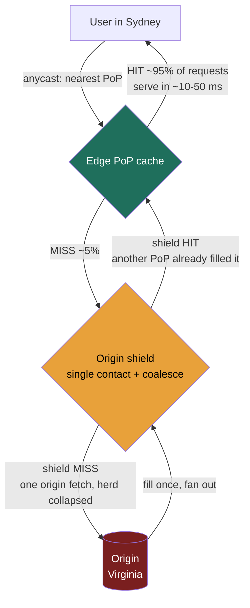
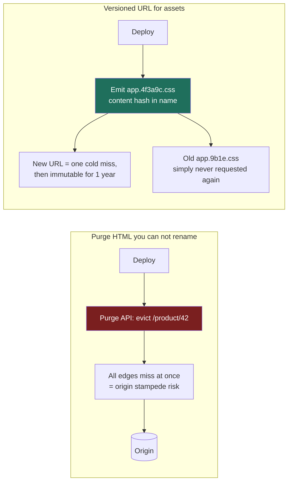

### Learning objectives
- Explain *why* a CDN exists — that it buys two things at once, **user-facing latency** and **origin offload** — and quantify both from the **cache-hit ratio**.
- Contrast **pull (origin-pull)** and **push** CDNs, and state which content and which operating model each one fits.
- Reason about the **cache key, TTLs, and invalidation** — `Cache-Control` semantics, `stale-while-revalidate`, and the two real-world invalidation strategies (**purge** vs **versioned/fingerprinted URLs**) and why one is vastly cheaper to operate.
- Use **origin shielding / tiered caches** and **anycast geo-distribution** to raise hit ratio and cut origin load, and decide **what does and does not belong on a CDN**, including the **cost model** a Director signs off on.

### Intuition first
Your origin is **one central warehouse**, and every customer order — a product image, a JavaScript bundle, a video segment — is a round trip to that one warehouse. If the warehouse is in Virginia and the customer is in Sydney, every order is a ~150 ms transcontinental flight (recall the latency ladder in Lesson 1.4), and the warehouse loading dock can only push so many pallets per hour before it jams.

**A CDN is a network of neighborhood corner stores — hundreds of them, one near every customer.** The first time anyone in Sydney asks for an item, the local store fetches one copy from the warehouse and *keeps it on the shelf*. Every Sydney customer after that is served from the corner store — a ~10–50 ms walk, not a ~150 ms flight — and, just as importantly, **the warehouse never sees those orders at all**. If the corner store satisfies 95 of every 100 requests, the loading dock handles **5 pallets where it used to handle 100**.

That second effect is the one beginners miss. A CDN is not only "make it faster for the user"; it is **"make the origin do 20× less work,"** and those two wins are the *same number* — the cache-hit ratio — read two different ways.

### Deep explanation

**What a CDN actually is, and the two wins it buys.** A CDN is a globally distributed fleet of caching reverse proxies (Lesson 2.1) — hundreds of **Points of Presence (PoPs)** worldwide (Cloudflare alone runs 300+ cities) — each holding cached copies of your content close to users. It buys two things from **one** mechanism (a cache hit at the edge):

1. **User-facing latency.** A hit is served from a PoP ~10–50 ms from the user (Lesson 1.4's CDN figure) instead of a ~150 ms transcontinental round trip to origin — and that's *before* you add origin processing, TLS handshake, and queueing. For a media-heavy page pulling 50 objects, moving them from origin to edge can cut **seconds** of wall-clock load time, because the objects parallelize against a nearby PoP instead of a distant origin.
2. **Origin offload.** Every hit is a request your origin **never sees**. This is the dimension a Director must foreground, because it's the one that shows up on the **bill** and in the **capacity plan**: origin servers, origin bandwidth (egress), and origin database load all scale with the *miss* rate, not the request rate.

**The hit-ratio math — the single most important number in this lesson.** Let total edge requests be **R** and the cache-hit ratio be **h**. Then:

> **Origin requests = R × (1 − h)**

This relationship is brutally non-linear near the top, and *that* is the senior insight. Take R = 1,000,000 req/s of static assets:

| Hit ratio **h** | Origin requests = R×(1−h) | Origin load vs. no CDN |
|---|---|---|
| 0% (no CDN) | 1,000,000 /s | 1× (baseline) |
| 90% | 100,000 /s | **10× less** |
| 95% | 50,000 /s | **20× less** |
| 99% | 10,000 /s | **100× less** |
| 99.9% | 1,000 /s | **1000× less** |

The headline: **going from 90% → 99% is not a 9% improvement — it cuts the origin load another *10×* (10×→100× vs. baseline, a further 10× drop).** The last few percent of hit ratio are where the origin-fleet savings live, which is exactly why origin shielding and tiered caches (below) — techniques that exist purely to claw back that last few percent — are worth real engineering. (This mirrors the Redis read-cache math from Lesson 2.10: a 90% hit rate cuts origin reads 10×; the CDN is the same lever, applied at the network edge to whole HTTP objects instead of in front of a database.)

**On latency, weight by the ratio too.** The user-perceived average isn't the edge number; it's `h × (edge latency) + (1−h) × (origin-fetch latency)`. At h = 95%, edge ~30 ms, origin fetch ~180 ms: `0.95×30 + 0.05×180 = 28.5 + 9 = ~37.5 ms` average — close to the edge number *because* most requests hit. Drop the hit ratio to 70% and the same formula gives `0.7×30 + 0.3×180 = 21 + 54 = 75 ms` — **2× worse**, driven entirely by the misses. **Hit ratio governs both axes**; a "fast CDN" with a poor hit ratio is neither fast nor cheap.

**Pull vs push — who puts content on the shelf.** This is the first real fork, and it's a requirements decision.

- **Pull (origin-pull) — lazy, fill-on-miss.** Point the CDN at your origin and rewrite asset URLs; the first request per PoP misses, fills from origin, and serves locally until the TTL expires. *Win:* trivial to operate, no publish pipeline, the edge stores only what's actually requested. *Cost:* the **first user per PoP eats a cold-miss penalty**, and a just-published viral object can briefly stampede the origin until the edges fill. This is the default model for CloudFront-style general web delivery — and the right one for ~95% of systems.
- **Push — eager, pre-positioned.** You upload content to the edge **before** any user asks, so there is **no first-request miss**, and you can fill during off-peak hours. *Cost:* you own a **distribution/publish pipeline** and pay to store content whether or not it's requested. Push earns its keep for **large, predictable, high-value catalogs** — canonically **Netflix Open Connect**, which pushes the catalog onto appliances inside ISP networks **overnight**, predicting tomorrow's demand, so at peak the bytes are already local. You would never pull-fill a 4 GB movie on the first Sydney viewer's request.

The discriminating rule: **pull when content is long-tail, unpredictable, or cheap to miss once; push when content is large, predictable, and a first-request miss is unacceptable** (video, game patches, OS updates). Most teams are pull and shouldn't talk themselves into push's operational weight without that predictability.

**The cache key — what makes two requests "the same object."** A CDN serves a hit only when a request matches a cached entry's **cache key** (roughly host + path + query string), and most "bad CDN" stories are key fragmentation. The **hit-ratio killers**, in the order you should check them:

- **Unstripped `utm_`/session query params** — the same image under 50 marketing campaigns becomes 50 separate cache entries.
- **`Vary: User-Agent`** — thousands of distinct UA strings fragment the cache into near-duplicates.
- **Cookies on static assets** — many CDNs won't cache a response that sets a cookie; one analytics tag can quietly drop your assets to 0% hit.

A Director-level diagnosis of "our hit ratio is only 60%" almost always ends at one of those three.

Go deeper — cache-key tuning mechanics (IC depth, optional)

- **Query strings:** configure a query-param **allowlist** (every CDN supports one) — strip marketing/session params from the key, but keep params that genuinely change the response (`?w=400` for a resized image).
- **`Vary`** keys the cache on a request header. `Vary: Accept-Encoding` (gzip vs brotli vs identity) is correct and necessary; `Vary: User-Agent` fragments; `Vary: Cookie` effectively makes content uncacheable, since every user carries a unique cookie.
- **Cookie fix:** scope analytics/session cookies to the API host, not the asset host, so asset responses stay cookie-free and cacheable.

**TTLs and freshness — how long stock stays on the shelf.** The origin controls cache lifetime via HTTP response headers (the same `Cache-Control`/`ETag` machinery from Lesson 2.10):

- **`Cache-Control: max-age=N`** — fresh for N seconds at the edge (and browser); after that the edge revalidates with origin. **`s-maxage=N`** sets a *separate* TTL for the CDN vs the browser — typically long at the edge (purgeable centrally) and short in browsers (which you can't purge). On revalidation, `ETag`/`304 Not Modified` means an expired-but-unchanged object costs headers, not the payload.
- **`stale-while-revalidate=N`** (RFC 5861) — the killer feature for latency: serve the **stale** copy **immediately** while the edge revalidates **in the background**; the user never waits on revalidation. **`stale-if-error=N`** likewise serves stale content if the origin is **down** — the CDN as a shock absorber through an origin outage. Naming `stale-while-revalidate` is a strong signal: it decouples freshness from the user's critical path.

**Invalidation — taking stale stock off the shelf (the genuinely hard part).** "There are only two hard things in computer science: cache invalidation and naming things." On a CDN there are two strategies, and the choice has real operational and cost weight:

- **Purge (active invalidation).** You tell the CDN "evict this object (or this tag/prefix) **now**." Two flavors: by **URL/path** (purge `/css/app.css`) or by **surrogate key / cache tag** (purge everything tagged `product-42`, a Fastly/Akamai feature — invaluable for invalidating *all* pages that embedded a changed product). Modern CDNs purge globally in **seconds** (Fastly advertises ~150 ms; CloudFront historically minutes). *Cost:* purges can be **rate-limited and/or billed**, a purge **storm** on a deploy creates a **cache-miss stampede** against origin (everything you just evicted now misses at once), and "purge everything" is an availability foot-gun. You purge **content you can't rename** — chiefly **HTML pages** whose URL must stay stable (`/`, `/product/42`).
- **Versioned / fingerprinted URLs (the preferred default for assets).** Instead of evicting `app.css`, you publish `app.4f3a9c.css` — the content hash is **in the filename**. A new build produces a **new URL**, so the old cached entry is simply **never requested again** and the new URL is a guaranteed cache miss exactly once, then hot forever. *Win:* you can set `Cache-Control: max-age=31536000, immutable` (**one year**, never revalidate) on every asset, maximizing hit ratio, **with zero purge API calls** — invalidation becomes a *publish* step, not a *runtime* operation. This is what every modern bundler (webpack/Vite "content hashing") does, and it's the reason static-asset hit ratios can sit at **99%+**. *Cost:* requires a build/deploy step that rewrites references, and you must keep old versions around briefly for in-flight clients.

The senior framing: **version everything you can rename (assets), purge only what you can't (HTML).** A design that "purges the CDN on every deploy" for assets is reaching for the expensive, stampede-prone tool when fingerprinted URLs make invalidation free.

**Static vs dynamic at the edge — what's even cacheable.** The cleanest fit is **immutable static assets** — images, video segments, CSS/JS bundles, fonts — identical for every user, cache once, serve millions. But CDNs also accelerate a spectrum of *less* static content:

- **Personalized/dynamic API responses** (a logged-in user's feed) are **per-user** and **not cacheable** — caching them risks serving **user A's data to user B**, a security incident, not a performance bug. You may still route them *through* the CDN to ride its optimized backbone (warm origin connection, edge TLS, HTTP/2/3) — **dynamic acceleration** without caching the body.
- **Semi-dynamic** content (a product page that's the same for everyone but changes hourly) caches well with a **short TTL** + `stale-while-revalidate` — accept seconds of staleness for a huge offload.
- **ESI (Edge Side Includes)** exists for the rare page that's ~90% cacheable with a small per-user hole (cache the shell, stitch in the cart badge at the edge) — reach for it only then.

**Origin shielding and tiered caches — manufacturing the last few percent of hit ratio.** A flat CDN has a hidden flaw: with hundreds of PoPs, the **first** request for an object in **each** PoP misses to origin — 300 PoPs can mean **300 origin fetches** for one new object, a stampede on anything viral. An **origin shield** fixes this: one designated PoP is the single point of contact for origin, so edge misses go to the shield, which fetches from origin **once** and fans the result out — and it **collapses concurrent misses** (request coalescing), the CDN-scale answer to the cache-stampede problem from Lesson 2.10. **Tiered caches** generalize the idea, pushing the *effective* origin hit ratio toward 99.9%+ at the cost of a few ms on the rare miss and a line item on the bill — worth it whenever origin protection matters more than shaving the miss path, which for any origin you're trying to keep small, it does.

Go deeper — tiered-cache mechanics (IC depth, optional)

- Tier layout: edge PoP → regional/mid-tier cache → shield → origin. Each tier absorbs the misses of the tier below, so effective origin hit ratio compounds: a 90%-hit edge in front of a 90%-hit mid-tier leaves origin with ~1% of requests.
- The shield/mid-tier is typically chosen near the origin region to keep the fill path short; some CDNs shard the tier by cache key so each object has one "home" shield node (consistent hashing), maximizing the chance an edge miss finds the object already at the tier.
- Request coalescing at each tier: concurrent misses for the same key block behind one in-flight origin fetch rather than fanning out.

**Geo-distribution and anycast — how a request finds the nearest PoP.** Two mechanisms route a user to a close edge. **Anycast (BGP)** — Cloudflare/Fastly's core model — announces the same IP from every PoP; routing delivers each user to the topologically nearest one, failover is near-instant (BGP reconverges with no DNS change to wait on), and DDoS load spreads across all PoPs. **DNS-based routing** — historically Akamai's — resolves the hostname to different PoP IPs by resolver location and PoP health/load: finer, load-aware steering, but failover is **bounded by DNS TTLs**, so a dead PoP keeps receiving traffic until cached entries expire. (This connects to Lessons 3.1 and 3.2: a CDN is global load balancing *plus* caching.) Either way the payoff is the same: serve bytes from ~10–50 ms away on every continent — which a single-region origin physically cannot do; ~150 ms transcontinental is a floor.

**The cost model — what a Director is actually signing.** A CDN bill has a few levers, and the headline is usually **net savings**, not net cost:

- **Egress (data transfer out)** — the dominant line. CDN egress runs roughly **$0.02–$0.12/GB** depending on provider, region, and committed volume (CloudFront's first tier is ~**$0.085/GB** in North America; cheaper at commit). That sounds like pure cost until you compare it to the alternative: serving the same bytes **straight from origin** pays the cloud's *own* egress (**~$0.09/GB** S3→internet on AWS) **plus** the origin compute and bandwidth to push them — and from one region, slowly. **Crucially, a byte served from an edge cache hit incurs *no origin egress at all*** — the CDN already has it. So at a 95% hit ratio you've moved **95% of your bytes off origin egress** and onto (often cheaper, often commit-discounted) CDN egress. For high-volume media, **the CDN bill is frequently *lower* than the origin-egress bill it replaces** — the rare infra line item that saves money rather than spends it.
- **Requests** — a small per-10,000-requests fee (e.g. ~$0.01 per 10k HTTPS requests on CloudFront), negligible unless you're serving tiny objects at extreme volume.
- **Premium features** — origin shield, tiered cache, real-time logs, image optimization, WAF, and **purge volume** can carry surcharges. Some providers (Cloudflare, and Bandwidth-Alliance members) **bundle or zero-rate** egress, changing the calculus entirely.

The number to keep in your head: **CDN cost scales with bytes served and the *miss* rate; origin cost scales with the *miss* rate.** Raising the hit ratio cuts *both* the origin bill and the slow path simultaneously — which is why hit ratio is the metric a Director instruments and reviews, not raw bandwidth.

### Diagram — request flow: edge → shield → origin (with the offload math on the edges)

Green = the ~95% of requests that **never leave the user's region** (the latency + offload win). Amber = the shield that turns *N PoPs' misses* into **one** origin fetch and **collapses** a thundering herd. Red = the origin you are deliberately shrinking — it sees only `R × (1 − effective hit ratio)`, which the shield/tier pushes toward 1% of total.

### Diagram — invalidation: purge vs versioned URL

Purge is a **runtime** operation (rate-limited, stampede-prone) for content with a fixed URL. Versioning makes invalidation a **publish-time** non-event — the old entry isn't evicted, it's **abandoned** — which is why fingerprinted assets get a one-year `immutable` TTL and ~99%+ hit ratios.

### Worked example — a media-heavy product page (CloudFront/Cloudflare) and Netflix's catalog (Open Connect)
**The web app (pull).** An e-commerce site serves a product page with ~50 static objects (images, CSS/JS bundles, fonts) plus a small personalized cart badge, to users on every continent, at peak **1,000,000 asset requests/s**.

- **Pull CDN, fingerprinted assets.** Bundles and images ship as `name.<hash>.ext` with `max-age=31536000, immutable`; product images carry a 1-hour `s-maxage`. The cache key strips `utm_*` params, no `Vary: User-Agent`, and the analytics cookie is scoped to the API host, not the asset host. Result: **~99% hit ratio** on assets.
- **The offload, quantified.** Origin sees `1,000,000 × (1 − 0.99) = 10,000 req/s` — a **100×** reduction. An **origin shield** means a freshly deployed bundle is fetched from origin **once**, not once per PoP, so the static-asset origin can be a small S3 bucket rather than a fleet.
- **The latency, quantified.** Sydney users get assets from a local PoP at ~30 ms instead of ~150 ms+ to Virginia; across 50 parallelized objects that's a snappy page vs a multi-second one.
- **The personalized hole.** The cart badge is per-user and **not cached** (caching it would leak one user's cart to another) — routed *through* the CDN but served from origin. The page is *mostly* cached with a *small* dynamic hole — the right decomposition.
- **The bill.** ~99% of bytes leave origin egress and ride (often commit-discounted) CDN egress; at this volume the CDN line item typically comes in **at or below** the origin-egress bill it replaces.

**Netflix (push) — why the same playbook flips.** A 4 GB movie streamed by millions cannot be pull-filled on the first viewer's request — a multi-GB cold miss across a transit link at peak is exactly what you must avoid. **Open Connect** pushes the catalog onto appliances inside ISP networks overnight, predicting tomorrow's demand, so at peak the bytes are already local and there is no first-request miss. The decision flips for one reason named in the requirements: content is **large, predictable, and a cold miss is unacceptable** — the exact inverse of long-tail web assets.

The throughline across both: **choose pull vs push from the content profile, maximize hit ratio with key hygiene + versioning + shielding, and never cache per-user data.**

### Trade-offs table — pull vs push vs no-CDN
| | **Pull (origin-pull)** | **Push (pre-positioned)** | **No CDN (origin-direct)** |
|---|---|---|---|
| Who fills the edge | CDN, lazily on first miss | You, eagerly before requests | n/a |
| First-request penalty | **yes** (one cold miss per object per PoP) | **none** (already there) | n/a (always "cold" = origin) |
| Operational weight | low (point + rewrite URLs) | high (publish pipeline, placement) | lowest (nothing to run) but… |
| Edge storage cost | only what's requested | everything pushed, requested or not | none |
| User latency (global) | ~10–50 ms on hits | ~10–50 ms always | ~150 ms+ for distant users |
| Origin offload | high (scales with hit ratio) | **highest** (predictable, pre-filled) | **none** (origin sees 100%) |
| **Use when…** | long-tail, unpredictable, cold-miss-tolerable content — **~95% of systems** | large, predictable, high-value catalogs where a cold miss is unacceptable (video, game/OS updates) | tiny single-region audience, or truly per-user/uncacheable content where a CDN adds cost without offload |

### Trade-offs table — invalidation strategy
| | **Purge by URL/path** | **Purge by tag / surrogate key** | **Versioned / fingerprinted URL** |
|---|---|---|---|
| When it happens | runtime (deploy/publish) | runtime | publish/build time |
| Granularity | one object | all objects sharing a tag (e.g. `product-42`) | per-object (new hash = new object) |
| Origin-stampede risk | yes (evicted = misses) | yes, broader | **none** (old entry abandoned, not evicted) |
| Cost / limits | rate-limited, sometimes billed | rate-limited, sometimes billed | **free** (a publish step) |
| Max TTL you can safely set | short-ish (must be purgeable) | short-ish | **1 year, `immutable`** |
| **Use when…** | content with a **fixed URL** you can't rename — **HTML pages** | invalidate **many pages** that embedded one changed entity | anything you **can** rename — **static assets** (the default) |

### What interviewers probe here
- **"You add a CDN — what *two* things did it buy you, with numbers?"** — *Strong:* names **both** user latency (~30 ms edge vs ~150 ms+ origin) **and** origin offload via `R×(1−h)` — "at 95% hit my origin sees 5% of traffic; at 99%, 1%." *Red flag:* "it makes the site faster" with no offload math — the Director-altitude point is the cost/capacity win.
- **"Pull or push, and why?"** — *Strong:* pull by default; push only for large/predictable catalogs where a cold miss is unacceptable (Open Connect). *Red flag:* pushing everything, or not knowing the distinction.
- **"Your hit ratio is 60% — diagnose it."** — *Strong:* reaches straight for the key killers — cookies on static assets, `Vary: User-Agent`, unstripped query params — then key hygiene + a shield. *Red flag:* "buy a bigger CDN" — the bottleneck is configuration, not capacity.
- **"How do you invalidate, and what does it cost?"** — *Strong:* version assets (fingerprinted URLs, 1-year `immutable`, zero purge calls), purge only HTML; names the purge-stampede risk and `stale-while-revalidate`. *Red flag:* "purge the whole CDN on every deploy."
- **"What does *not* belong on a CDN?"** — *Strong:* per-user responses (caching them is a **data-leak**, not a perf bug); route those *through* the CDN without caching the body. *Red flag:* "cache everything."
- **"What's the cost story you'd take to finance?"** — *Strong:* CDN egress (~$0.02–$0.12/GB) *replaces* origin egress (~$0.09/GB) plus origin compute; at high hit ratio the CDN bill often lands **at or below** the bill it displaces. *Red flag:* treating the CDN purely as added cost, or unable to connect hit ratio to dollars.

### Common mistakes / misconceptions
- **Seeing only the latency win, not the offload win.** The origin-load reduction (`R×(1−h)`) is the dimension that drives cost and capacity — and it's the Director-altitude half.
- **Treating 90%→99% as "a few percent."** It's a **further 10×** origin reduction (10×→100×); the last points of hit ratio are where the savings live, which is why shielding/tiering exist.
- **Caching personalized/authenticated content.** This serves one user's data to another — a **security incident**. Per-user data is routed through, not cached.
- **Letting cookies, `Vary: User-Agent`, or marketing query params into the cache key.** Each one fragments or disables the cache — the usual root cause of a "bad CDN."
- **Purging assets on every deploy** instead of versioning them — the rate-limited, stampede-prone runtime tool where fingerprinted URLs make invalidation a free publish step (and without an origin shield, every purge or viral object is a coalescing-free stampede).

### Practice questions
**Q1.** A static-asset workload serves 2,000,000 req/s. At a 92% hit ratio your origin fleet is saturated. Your boss says "add origin servers." What do you do instead, and quantify it?
> *Model:* Don't scale origin — **raise the hit ratio**, because origin load is `R×(1−h)`. At 92% the origin sees `2M×0.08 = 160k req/s`; at **99%** it's `20k req/s` — an **8× origin reduction** with zero added servers. Get there by (a) **cache-key hygiene** — strip `utm_` params, kill `Vary: User-Agent`, move the cookie off the asset host; (b) **fingerprinted URLs** with `max-age=31536000, immutable`; (c) an **origin shield** so a deploy or viral object causes one origin fetch, not one-per-PoP. Adding origin servers treats the symptom and leaves the cause — capacity before configuration is the wrong instinct.

**Q2.** You're designing video delivery for a streaming service. Pull or push, and what breaks if you pick wrong?
> *Model:* **Push** (Netflix Open Connect). Video is **large**, demand is **predictable**, and a **cold miss is unacceptable** — pull-filling a 4 GB movie on the first viewer's request saturates the very transit links you're protecting, at peak, with the first viewer waiting. Push pre-positions the catalog overnight, off-peak, so there's no first-request miss. For long-tail web assets the logic inverts — pull, because content is unpredictable and a one-time cold miss is cheap. The decision falls out of the **content profile**: size, predictability, cold-miss tolerance.

**Q3.** After every deploy your team purges the entire CDN, and you see a latency spike and an origin load spike for ~30 seconds afterward. Explain the spikes and redesign the invalidation.
> *Model:* Purging everything evicts every cached object at once, so everything misses and stampedes origin simultaneously (the load spike) while users wait on full origin round trips until the edges refill (the latency spike) — a self-inflicted cache stampede. Redesign: **version assets** (fingerprinted filenames, 1-year `immutable`) so a deploy emits new URLs and old entries are simply never requested again; **purge only the HTML** you can't rename, ideally by surrogate key; add **`stale-while-revalidate`** so even those serve instantly while revalidating; keep an **origin shield** so unavoidable misses coalesce into one fetch. Invalidation moves from a risky runtime operation to a publish-time non-event.

**Q4.** Which of these belong on a CDN, and why: (a) JS/CSS bundles, (b) a logged-in user's personalized feed, (c) a product page that updates hourly, (d) a payment POST?
> *Model:* (a) **Yes** — immutable, identical for all users: fingerprint + 1-year TTL → ~99% hit. (c) **Yes, short TTL** (`s-maxage=3600`) + `stale-while-revalidate` — same for everyone; minutes of staleness buys a large offload. (b) **No** — per-user; caching it risks serving user A's feed to user B (a security incident). Route it *through* the CDN, don't cache the body. (d) **No** — a write must reach origin; a CDN accelerates cacheable reads, never writes. Principle: cache only what is **identical across users** and **stale-tolerant**.

**Q5.** Anycast vs DNS-based routing for getting users to a nearby PoP — what's the trade, and where does it bite during a PoP failure?
> *Model:* **Anycast** (Cloudflare/Fastly) announces one IP from every PoP; on failure BGP reconverges in seconds with no DNS change to wait on, and DDoS load spreads across all PoPs. **DNS-based** routing (historically Akamai) gives finer, load-aware steering but failover is **bounded by DNS TTLs** — a dead PoP keeps receiving traffic until cached resolver entries expire, and some resolvers ignore low TTLs. Trade: anycast = faster failover + DDoS resilience, coarser steering; DNS = finer health/load awareness, TTL-bounded failover. For availability-critical edge, anycast's no-wait failover is the stronger default.

### Key takeaways
- A CDN buys **two** things from one mechanism (an edge hit): **user latency** (~10–50 ms edge vs ~150 ms+ origin) **and origin offload** — and both are the **hit ratio** read two ways. Origin load = `R × (1 − h)`, so 95% → 20× less, 99% → 100× less; **90%→99% is a further 10×**, which is why shielding/tiering exist.
- **Pull by default** (long-tail, no pipeline, accept a one-time cold miss); **push** only for large, predictable catalogs where a cold miss is unacceptable (Netflix Open Connect).
- **Cache-key hygiene is hit ratio:** strip marketing/session query params, avoid `Vary: User-Agent`, keep **cookies off static assets** — these are the usual causes of a "bad CDN."
- **Version what you can rename, purge what you can't:** fingerprinted URLs make invalidation a free **publish-time** non-event (1-year `immutable`, ~99% hit, no stampede); purge (rate-limited, stampede-prone) is for **HTML**. `stale-while-revalidate` keeps revalidation off the user's path; `stale-if-error` keeps you up through an origin outage.
- **Never cache per-user/authenticated content** (data-leak risk) — route it *through*, not *cached* at, the edge. And the **cost** story is a saver: CDN egress *replaces* origin egress + compute, so a high hit ratio cuts the bill and the latency together — the metric a Director instruments.

> **Spaced-repetition recap:** A CDN = corner stores near users; an edge **hit** buys latency (~30 ms vs ~150 ms) **and** origin offload (`origin = R×(1−h)`: 99% hit → origin sees 1%). **Pull** (lazy, default) vs **push** (pre-position; Netflix Open Connect). Protect the hit ratio: strip query params, no `Vary: UA`, **cookies kill caching**. **Version assets** (immutable, 1-yr, free invalidation), **purge only HTML**; `stale-while-revalidate` hides revalidation. **Origin shield/tiered cache** collapse N-PoP misses + herds into one origin fetch. **Never cache per-user data.** CDN egress *replaces* origin egress — high hit ratio cuts cost *and* latency.
