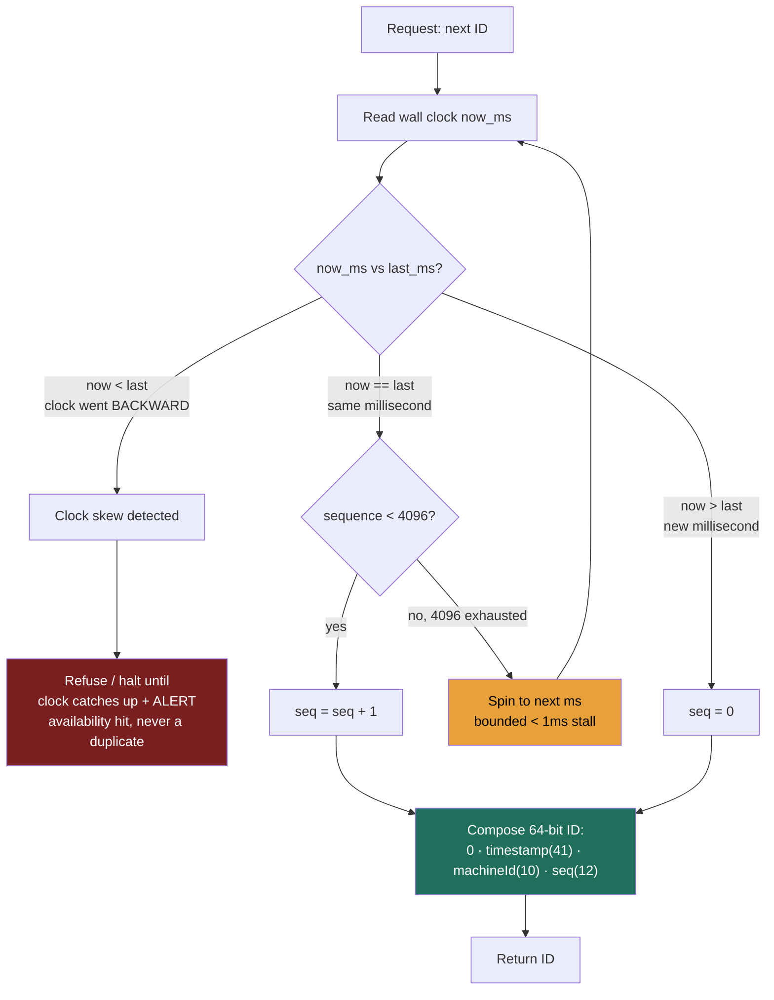

### Learning objectives
- State the four requirements a distributed ID sequencer must satisfy, **uniqueness**, **rough sortability (k-sorted)**, **high throughput**, and **no single point of failure**, and recognize they pull against each other.
- Contrast the four canonical approaches, **UUIDv4**, **DB auto-increment**, **ticket/range servers** (Flickr), and **Snowflake-style timestamp+machine+sequence** (with **UUIDv7** as its 128-bit cousin), and place each on the *coordination-cost vs sortability* spectrum.
- Explain *why monotonic sortability matters*, index/storage locality on a B-tree, by connecting it straight back to the write-amplification argument of Lesson 2.3.
- Reason about **clock-skew hazards** (duplicate-or-halt) and the **causality limit** of any wall-clock ID, k-sorted is *approximate temporal order*, never happens-before.

### Intuition first
Think of a **deli counter that hands out paper tickets.** Every customer must get a *unique* number (uniqueness), the numbers should come out *roughly in arrival order* so the line stays fair (sortability), the dispenser must keep up *even on the Saturday morning rush* (throughput), and if the one dispenser by the door jams, the whole shop grinds to a halt (single point of failure).

Now scale that deli to a thousand counters in a thousand cities, all part of one chain, and the rule "every ticket number in the entire chain must be globally unique *and* roughly time-ordered", without the counters phoning a central office for every single ticket, because that phone call is the bottleneck. That is the entire sequencer problem. The four families of answers differ only in **how much they talk to each other to stay unique:**

- **UUIDv4**: every counter rolls a die so big that a collision is astronomically unlikely, **zero phone calls**, but numbers come out in *random* order, useless for keeping the line fair.
- **A single auto-increment database**: one master dispenser, perfectly ordered, but every ticket is a phone call to one box, and if it dies, nobody gets a number.
- **A ticket/range server**: the master hands each counter a *book of 1,000 pre-torn tickets*, so the counter serves locally and phones home every thousandth customer.
- **Snowflake**: stamp each ticket `[current minute][counter ID][local tick]`, time and identity baked *into the number itself*, unique and time-ordered with **no phone call at all**, provided every counter agrees on what time it is, which is exactly where the hazard lives.

The lesson is that choice, *how much coordination you pay to buy uniqueness and order*, not the bit-twiddling of any one scheme.

### Deep explanation

**Why a "sequencer" is its own building block.** Almost every system needs to mint identifiers, a tweet ID, an order ID, a message ID, an idempotency key, a row's primary key. At small scale you reach for the database's auto-increment column and never think about it. The block exists because at scale that reflex **breaks on all four requirements at once**, and the fix is a genuine distributed-systems problem. State the four requirements precisely, because the interview turns on knowing they conflict:

1. **Uniqueness**, never collide, *ever*. A duplicate primary key is a correctness bug, often a silent data-corruption or security one (two orders sharing an ID).
2. **Roughly sortable / k-sorted**, IDs generated later should *generally* sort after earlier ones (within some bounded window `k`). This is the requirement people forget, and it is the one that quietly governs storage cost (below). Note "**k-sorted**," not "strictly sorted", across machines we deliberately accept being *approximately* ordered to avoid the coordination that strict ordering demands.
3. **High throughput, low latency**, a hot system mints IDs constantly. If you need **1M IDs/s** and minting one adds **5 ms** of round-trip to a central server, you've added a 5 ms tax to every create and capped yourself at that server's rate. ID generation must be effectively free and local.
4. **No single point of failure**, the ID service cannot be the thing whose death takes down every write in the company. If nothing can be *created* without an ID, the sequencer's availability *is* the write path's availability.

The tension: **uniqueness without coordination** pushes you toward huge random numbers (which kills sortability); **strict sortability** pushes you toward a single coordinator (which kills throughput and availability). Every scheme below is a different point on that line.

**Approach 1, UUIDv4 (random): zero coordination, zero sortability.** A version-4 UUID is **122 random bits**, generated locally with no coordination whatsoever, and collisions are **astronomically unlikely**, treat uniqueness, throughput, and no-SPOF as free and perfect.

The catch is requirement 2: UUIDv4 is **maximally unsortable**, consecutive IDs have *no* temporal relationship. And that is not cosmetic: **random primary keys wreck B-tree index locality**, every insert lands on a random page, maximizing page splits and write amplification (the Lesson 2.3 argument), which can mean several-fold higher write cost on a large table versus sorted inserts. UUIDv4 is genuinely great when you need decentralized uniqueness and *don't* index on it as the clustered/primary key (a trace ID, an S3 object key, an idempotency token), and a genuine foot-gun as a high-volume table's primary key.

Go deeper, the birthday-bound collision math (IC depth, optional)

UUIDv4 carries 122 random bits (128 minus 6 for version/variant). By the birthday bound on 2^122, you'd need to mint on the order of a *billion UUIDs per second for ~85 years* to reach a 50% chance of a single collision anywhere in the system. That's why "astronomically unlikely" is an engineering certainty, not a hope, and why no production system budgets for UUIDv4 collisions.

**Approach 2, Database auto-increment: perfect order, a SPOF and a write ceiling.** A single `AUTO_INCREMENT`/`SERIAL` sequence is strictly monotonic, perfectly sortable, dense and compact (64-bit int, far smaller than a 128-bit UUID, which matters for index size). It fails the *other* two requirements. It is a **single point of failure**, every insert funnels through one sequence on one primary; if that node is down, nothing can be created. And it is a **throughput ceiling**: a durable, `fsync`'d counter does *thousands* of allocations/s, not millions, against a **1M IDs/s** target, a **~100× non-starter**. It also leaks volume (sequential IDs are enumerable) and **cannot be made multi-master cleanly**. Fine for one box; it does not survive sharding, which motivates the next two.

**Approach 3, Ticket / range servers (the Flickr scheme): batch the coordination away.** You don't have to coordinate *per ID*, coordinate *per batch*. A central allocator hands out **ranges** ("you own 1-1000"); each app server mints locally from its range and returns only for a new block, a central round-trip every 1000th ID instead of every ID.

The SPOF objection remains, one allocator, and **Flickr's production fix is the elegant part worth naming**: **two MySQL ticket servers** splitting the number space by parity, one issuing odd (1, 3, 5, …), the other even (2, 4, 6, …). Either server alone can keep minting unique IDs, so one can die and the system stays up. The cost: IDs are unique and *broadly* time-ascending but **no longer strictly monotonic** (you might see 5 then 4 then 7), **you've traded strict order for HA**, and articulating that trade is the strong signal. Reach for the range/ticket pattern when you want **dense, compact, mostly-ordered** IDs and can tolerate a little cross-server reordering.

**Approach 4, Snowflake (timestamp + machine + sequence): order baked into the bits, no coordination per ID.** Twitter's Snowflake is the canonical high-scale answer: a **64-bit integer** composed of a **millisecond timestamp** in the high bits, a **machine ID**, and a **per-millisecond sequence counter**. The key results to carry into the room: **41 timestamp bits ≈ 69 years** of headroom from a custom epoch, **1,024 machines**, and **4,096 IDs/ms/machine → ~4M IDs/s/node**, billions/sec across the fleet, dwarfing a 1M/s target.

The magic: because the **timestamp is the high-order bits**, IDs sort by time *automatically*, and because each machine carries its own machine-ID bits and sequence, two machines minting in the same millisecond *cannot* collide. So you get uniqueness **and** k-sorted order with **zero coordination on the ID path**, the best of approaches 1 and 2 at once, which is why Snowflake and its descendants (Instagram's variant below, and many in-house "flake" libraries) are the default at scale.

Go deeper, the Snowflake bit layout and budget (IC depth, optional)

| Bits | Field | Meaning |
|---:|---|---|
| 1 | sign | always **0**, keeps the ID a positive signed 64-bit int (plays nice with languages/DBs lacking unsigned ints) |
| 41 | timestamp | ms since a **custom epoch** (not 1970, a recent epoch buys more years of headroom) |
| 10 | machine ID | which node minted this, originally 5 bits datacenter + 5 bits worker |
| 12 | sequence | per-millisecond counter on that machine, reset every ms |

The arithmetic: 2^41 ms ≈ 69.7 years; 2^10 = 1,024 machines (a real ceiling you must respect); 2^12 = 4,096 IDs/ms → ~4.096M IDs/s/node. If a machine needs more than 4,096 IDs in one millisecond, it spins to the next millisecond, a bounded sub-ms stall.

But notice the coordination **didn't vanish, it moved.** The 10 machine-ID bits must be **uniquely assigned, once, at startup**, via ZooKeeper, etcd, config, or a deploy-time assignment. Two nodes that boot with the *same* machine ID will mint *duplicate* IDs the instant they hit the same millisecond + sequence. So Snowflake trades *per-ID* coordination for *per-startup* coordination, a vastly better trade (once per node-lifetime vs. once per ID), but recognizing *where the coordination went* is precisely the Director-altitude read.

**The clock-skew hazard, Snowflake's sharp edge.** The timestamp bits assume the machine's wall clock **only moves forward.** Real clocks don't. NTP corrections, leap seconds, and VM live-migration can step a clock **backward**. If a node's clock jumps back, the timestamp bits *repeat a value it already used*, and now it risks re-issuing an ID it already minted (a **duplicate** → correctness violation). A correct Snowflake implementation refuses to let that happen, which forces a choice between the two failure modes:

- **Halt / refuse to issue** until the clock catches back up to the last timestamp it saw. Safe (no duplicate) but a **brief availability hit**, that node stops minting IDs for the duration of the skew.
- **Reject and error** the request, letting the caller retry once the clock recovers.

Either way, a backward clock costs you *availability on that node*, never *correctness*, assuming the implementation is correct. Operational mitigations, in one line: run NTP in **slew mode, not step mode** (corrections never go backward), alert on drift, and use smeared leap seconds. The Director signal is *naming clock skew as the operational risk of the whole scheme*, and knowing the safe resolution is "refuse and alert," not "issue anyway."

**The causality limit, k-sorted is approximate order, NOT happens-before.** This is the subtle, senior point. A Snowflake ID is **strictly monotonic *per node*** but only **roughly ordered *across nodes***, two nodes' clocks can disagree by tens of milliseconds, so node A (clock 50 ms fast) can mint a *larger* ID than a genuinely later event on node B. Wall-clock ordering captures *approximate temporal proximity*, **not causality**. The rule: **never build business logic that assumes ID order equals causal order across nodes.** True happens-before ordering requires logical clocks, Lamport or vector clocks (Lesson 2.4), which are real tools but **usually overkill** for ID generation; adopt them only when the business *requires* causal correctness. For the overwhelming majority of systems, "roughly time-ordered, strictly unique" is exactly the right amount, and pretending it's more is the trap.

Go deeper, clock-smearing and logical clocks (IC depth, optional)

- **Leap-second smearing:** rather than repeating a second (which steps clocks backward), Google/AWS NTP services stretch the surrounding hours so each second is fractionally longer, the clock never goes backward, and Snowflake-style generators never see a rewind. If you run your own NTP, configure slew (`ntpd -x` style gradual adjustment) over step.
- **Lamport clocks** assign each event a counter that increments locally and takes `max(local, received)+1` on message receipt, guaranteeing `caused-by → smaller timestamp`, but not the converse. **Vector clocks** carry one counter per node and can additionally *detect concurrency* (neither event caused the other), at O(nodes) space per ID, the reason they're reserved for genuine causal-correctness needs like CRDT conflict resolution, not for minting primary keys.

**Why monotonic sortability is worth all this, storage locality, restated.** A k-sorted primary key means new rows **append to the B-tree's right edge**, minimal page splits and write amplification (Lesson 2.3, in one phrase), and it makes **time-range scans nearly free** while pairing naturally with time-bucketed sharding (Lesson 2.5). Random UUIDv4 forfeits all of that. "Roughly sortable" isn't aesthetic, it's a direct, quantifiable win on write cost and read locality, which is why every high-scale house reinvents some flavor of Snowflake rather than living with random keys.

### Diagram: Snowflake generation path, including the clock-rewind branch

The happy path (green) is pure local arithmetic, no network, no coordination. The two danger branches: sequence exhaustion within a millisecond is a *bounded sub-millisecond stall* (amber), while a *backward* clock is the real hazard (red), the only safe response is to refuse and alert, trading this node's availability to protect uniqueness.

### Worked example: Instagram's IDs (sharding baked into the ID)
Instagram needed primary keys for tens of billions of photos that (a) were **sortable by time** (feeds and "recent media" queries want a contiguous, time-ordered scan), (b) fit a **64-bit** column to keep indexes compact, and (c) could be minted **inside their sharded Postgres** with no separate ID service. Their scheme is a Snowflake variant generated by a **PL/pgSQL stored procedure inside each shard**, splitting the 64 bits as:

| Bits | Field | Why |
|---:|---|---|
| 41 | timestamp | ms since a custom Instagram epoch → time-sortable, ~69 yrs of headroom |
| 13 | **logical shard ID** | **which of up to 8,192 logical shards** this row lives on, *embedded in the ID itself* |
| 10 | sequence | per-shard counter mod 1,024 → 1,024 IDs per ms per shard |

The clever twist over vanilla Snowflake is the **13-bit shard ID** replacing the machine-ID bits. Because the shard number is *encoded in the primary key*, the ID **carries its own routing information**, mask 13 bits and you know which shard holds the photo, with no lookup table (the Lesson 2.5 *directory*, folded into the key for free). ID generation and shard routing become one decision. The trade-offs they accepted: **8,192 logical shards** is a hard ceiling baked into the bit budget, and **1,024 IDs/ms/shard** caps per-shard mint rate, both ample for their write volume, and worth the 64-bit, self-routing, time-sortable key. A textbook *quantify-the-ceiling-and-decide* call. (Twitter's plain Snowflake is the canonical fallback to cite without the sharding twist.)

### Trade-offs table: UUIDv4 vs ticket server vs Snowflake/UUIDv7
| | **UUIDv4 (random)** | **Ticket / range server (Flickr)** | **Snowflake (ts+machine+seq)** | **UUIDv7 (time-ordered UUID)** |
|---|---|---|---|---|
| Size | 128-bit | 64-bit (compact, dense) | **64-bit** | 128-bit |
| Coordination | **none** | per-*batch* (every ~1000th ID) | per-*startup* (assign machine ID once) | **none** |
| Sortable? | **no** (random) | broadly yes, not strict | **k-sorted** (ms granular) | **k-sorted** (ms granular; random within ms) |
| Throughput | unlimited, local | high (local between blocks) | ~4M/s/node → billions/s | unlimited, local |
| SPOF | none | none (2 servers, odd/even) | none (each node independent) | none |
| Clock-skew risk | none | none | **yes**, backward clock → halt to avoid dup | low, backward clock just *mis-sorts*, **no dup** |
| Density / enumerable? | sparse, opaque | **dense, enumerable** (leaks volume) | sparse-ish, time visible | sparse, opaque-ish |
| **Use when…** | decentralized uniqueness, *not* a hot clustered PK (trace IDs, idempotency keys, S3 keys) | want compact dense ordered IDs, single-org, tolerate tiny reorder | high-scale PK needing time-order + no coordination + 64-bit compactness (tweets, messages, orders) | want Snowflake-like order with **zero coordination** and don't mind 128 bits / off-the-shelf lib |

The decision falls out of *where you sit on the coordination↔sortability line*: need order and compactness at scale → **Snowflake**; want that order with no machine-ID assignment hassle and can spend 128 bits → **UUIDv7**; just need uniqueness and won't index on it → **UUIDv4**; single-org and want dense ordered ints → **ticket server**.

### What interviewers probe here
- **"Why not just use the database's auto-increment?"**, *Strong:* names it as a **SPOF and a write ceiling** (~thousands/s through one durable sequence vs a 1M/s need), enumerable, and not multi-master-able, fine for one box, breaks under sharding. *Red flag:* "it scales fine" or no awareness that a single sequence funnels every write.
- **"How does Snowflake stay unique with no central coordinator, where did the coordination go?"**, *Strong:* it didn't vanish, it **moved to startup**, the 10 machine-ID bits must be uniquely assigned once (ZooKeeper/etcd/config); duplicate machine ID → duplicate IDs. *Red flag:* "it's just random" (it isn't) or not knowing the machine bits need assignment.
- **"What breaks Snowflake, operationally?"**, *Strong:* **clock skew**, a backward NTP/leap-second step risks a duplicate, so a correct impl **halts and alerts** (availability hit, never corruption); mitigate with NTP *slew not step* and leap-second smearing. *Red flag:* unaware the wall clock is load-bearing.
- **"Can I trust that a smaller ID means it happened first?"**, *Strong:* **only per-node**, across nodes IDs are *k-sorted, not causal*; tens-of-ms skew can order two events backward; true happens-before needs Lamport/vector clocks (usually overkill). *Red flag:* building business logic on cross-node ID ordering.
- **"Why do we care if IDs are sortable at all?"**, *Strong:* **storage locality**, sortable keys append to the B-tree's right edge (minimal page splits / write amplification, Lesson 2.3) and make time-range scans + time-bucketed sharding cheap; random keys forfeit all of it. *Red flag:* treating sortability as cosmetic.

### Common mistakes / misconceptions
- **Using UUIDv4 as a high-volume clustered primary key**, random inserts scatter across the B-tree, multiplying page splits and write amplification (the exact 2.3 anti-pattern). Use **UUIDv7** if you want a UUID *and* locality.
- **Treating a single DB sequence as scalable**, it's a SPOF and a thousands/s ceiling; it does not survive sharding or a 1M/s target.
- **Assuming Snowflake needs zero coordination**, it needs **machine-ID assignment at startup**; duplicate machine IDs silently mint duplicate keys.
- **Forgetting the wall clock is a dependency**, no clock-skew handling means a backward clock yields duplicates; the safe behavior is **halt + alert**, not issue-anyway.
- **Believing ID order = event order across nodes**, it's k-sorted, not causal; clock skew reorders cross-node events. Don't found correctness on it (and don't over-correct into vector clocks unless the business genuinely needs causal ordering).

### Practice questions
**Q1.** A service mints primary keys via a single Postgres `SERIAL`. It's now the bottleneck and a SPOF as you shard the write path. Walk through your options and pick one for a system needing ~1M IDs/s, time-ordered.
> *Model:* The single sequence is a **~100× non-starter** (thousands/s, not 1M/s) and a SPOF. The ladder: (a) **UUIDv4**, fixes throughput/SPOF with zero coordination but is **unsortable**, killing the time-order requirement and B-tree locality, out for a clustered PK; (b) **ticket/range servers**, batch the coordination, kill the SPOF with two odd/even servers, dense mostly-ordered IDs, viable but still a light central dependency; (c) **Snowflake**, **the pick**: 64-bit, ~4M IDs/s/node, k-sorted, no per-ID coordination, no SPOF. Accept its two costs explicitly: **machine-ID assignment at startup** (etcd/config) and **clock-skew handling** (refuse-and-alert, NTP slew). If 128 bits is acceptable and you want to skip machine-ID bookkeeping, **UUIDv7** is the zero-coordination near-equivalent.

**Q2.** Your Snowflake-based ID service starts throwing errors and refusing to issue IDs on one node after a maintenance window. No duplicate IDs were observed. What happened, and was the system behaving correctly?
> *Model:* Almost certainly **clock skew**, maintenance (NTP correction, leap second, VM migration) stepped that node's wall clock **backward**, so `now_ms < last_ms`, and a correct implementation **refuses to issue** rather than risk re-using a timestamp. So yes, it behaved *correctly*: it traded **availability on one node** to protect **uniqueness**. The fix is operational, not code: NTP in **slew** mode, leap-second smearing, drift alerts. A backward clock is the known sharp edge of any wall-clock ID scheme; "halt + alert" is the *designed* safe response, issuing anyway would be the actual bug.

**Q3.** A teammate wants to use Snowflake IDs to decide "which of two events across two services happened first" for audit ordering. Is that safe? When would it break, and what's the correct tool if it isn't?
> *Model:* **Not safe across services.** Snowflake is strictly monotonic *within one node* but only **k-sorted across nodes**, clocks can differ by tens of ms, so "smaller ID happened first" is *backward* for any pair inside the skew window. It works most of the time and fails silently exactly when two events are close in time, the worst kind of bug. If the business genuinely needs **happens-before** ordering, that's **logical clocks** (Lamport/vector, Lesson 2.4), real complexity, usually overkill. If "roughly time-ordered" is acceptable, keep Snowflake and *document* that cross-node order is approximate. The senior move is naming the limit, not silently building on the wrong guarantee.

**Q4.** When is UUIDv4 the *right* call, and when is it a foot-gun, and what does UUIDv7 change?
> *Model:* **Right** for decentralized uniqueness with zero coordination where it's not a hot clustered key: trace IDs, idempotency keys, client-generated offline IDs, object keys. **Foot-gun** as a high-volume table's primary key: random inserts scatter across the B-tree (page splits, write amplification, Lesson 2.3), and 128 bits bloats every index vs a 64-bit int. **UUIDv7** (RFC 9562) puts a Unix-millisecond timestamp in the high bits with randomness below, **k-sorted** like Snowflake, still **zero coordination** (no machine-ID assignment). Price vs Snowflake: 128 bits (2× index footprint) and only ms-granular order. So: UUIDv4 for opaque uncoordinated tokens; UUIDv7 for no-coordination *plus* locality; Snowflake when 64-bit compactness matters at very high scale.

### Key takeaways
- A sequencer must satisfy four *conflicting* requirements, **uniqueness, k-sorted order, high throughput, no SPOF**, and every scheme is a point on the **coordination-cost vs sortability** line.
- **UUIDv4** = zero coordination, infinite scale, but **unsortable** → great for opaque/uncoordinated tokens, a foot-gun as a high-volume clustered key (random B-tree inserts, 2.3). **UUIDv7** restores k-sorted order with still-zero coordination, at 128 bits.
- **Single DB auto-increment** = perfectly ordered but a **SPOF and a ~thousands/s ceiling** (a ~100× miss against 1M/s); **ticket/range servers** (Flickr's odd/even MySQL) batch the coordination away and kill the SPOF, trading strict monotonicity for HA.
- **Snowflake** (64-bit: 1 sign + 41 ts + 10 machine + 12 seq → ~4M IDs/s/node, ~69 yrs, 1,024 nodes) gets uniqueness **and** order with **no per-ID coordination**, but the coordination *moved to startup* (machine-ID assignment) and the **wall clock is load-bearing** (backward clock → halt-and-alert to avoid duplicates).
- **k-sorted is approximate temporal order, not causality**, cross-node IDs can be reordered by clock skew; never build correctness on "smaller ID = happened first"; true happens-before needs Lamport/vector clocks (usually overkill).

> **Spaced-repetition recap:** Deli-ticket problem, unique + roughly-ordered + fast + no-SPOF, and those conflict. UUIDv4 = zero coordination but unsortable (kills B-tree locality); UUIDv7 fixes order, still 128-bit. Single auto-increment = ordered but SPOF + thousands/s ceiling; Flickr ticket servers (odd/even) batch coordination away. Snowflake bakes `time·machine·seq` into 64 bits → ~4M/s/node, no per-ID coordination, but machine IDs need startup assignment and a backward clock means halt-and-alert. ID order ≠ causal order across nodes.
