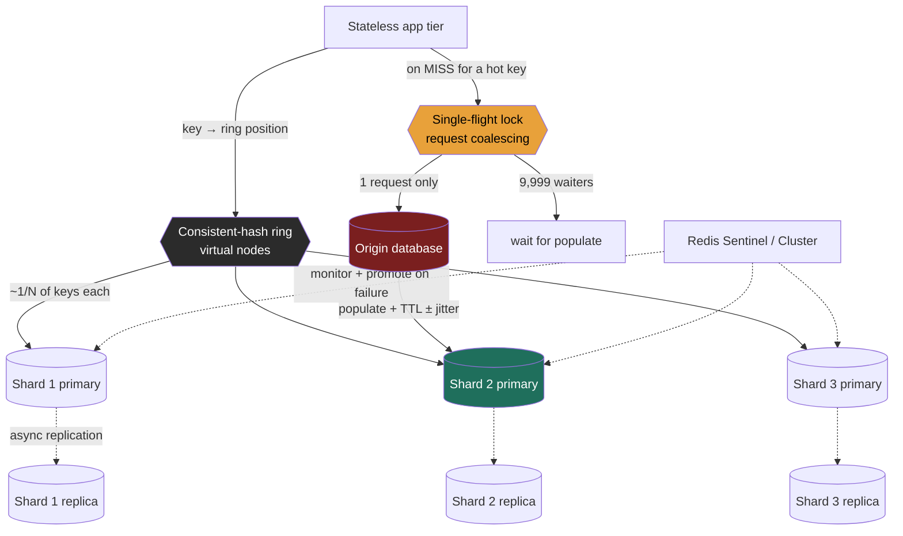

import CachingStrategiesSimulator from '@components/widgets/CachingStrategiesSimulator.jsx';

### Learning objectives
- Size a **distributed cache tier** from a read:write ratio and a target hit rate, and justify *why* a cache is the highest-leverage move for a read-heavy system - in real numbers (QPS shed, latency dropped, origin nodes saved).
- Choose an **eviction policy** (LRU vs LFU vs TTL) from the access pattern, and reason about its **hit-rate impact**.
- **Shard** the cache fleet with **consistent hashing** so that adding or losing a node remaps a minimal slice of keys, and contrast Redis Cluster (server-side) with Memcached (client-side).
- Engineer **replication and failover** for the cache, and decide whether the cache even *deserves* HA.
- Defend against **hot keys** and **cache stampede / thundering herd** with request coalescing, TTL jitter, and early refresh - and state the **consistency cost** of caching authoritative data.

### Intuition first
A distributed cache is the **front-of-house at a busy restaurant**, and the database is the **kitchen**. Most diners order the same ten dishes, so the front-of-house keeps those plated under a heat lamp: a request for the popular dish is served in **seconds from the lamp (a cache hit)** instead of **minutes from the kitchen (an origin read)**. The cache absorbs the repetitive demand so the slow, expensive kitchen only does the rare or genuinely new work.

Scale the front-of-house past one counter, and four hard questions appear - and they *are* this lesson:

- **The lamp is finite.** It holds 200 plates; the menu has 50,000 dishes. When it fills, *which plate do you throw out*? The dish nobody's ordered in an hour (**LRU**), the dish rarely ordered overall (**LFU**), or simply bin every plate after ten minutes (**TTL**)? That choice directly sets how often you hit the lamp vs. trudge to the kitchen.
- **One counter can't serve the crowd**, so you run **many counters** - and each plate needs a *home counter* every server agrees on. When you add a counter on a busy night, you do **not** want to re-assign all 50,000 dishes - just a fair slice. That is **consistent hashing**.
- **A counter catches fire.** Were its plates the *only* copy (that part of the menu is suddenly slow), or did a backup counter hold them (HA, at double the heat-lamp cost)?
- **One dish goes viral** and 10,000 diners ask for it in the same second, *just as* its plate was binned. Without coordination, all 10,000 orders stampede the kitchen at once. The fix: let **one** order go to the kitchen and have the other 9,999 **wait for that single plate** (request coalescing), plus stagger expiry so the whole menu doesn't bin at once (TTL jitter).

Every decision below trades **hit rate, latency, memory cost, and freshness** against each other.

### Deep explanation

A distributed cache is an in-memory key-value tier - **Redis** or **Memcached** (the key-value family) - sitting between the stateless app tier and the origin database. It earns its place on one number: the **hit rate**.

#### Why a cache, in numbers (the leverage)

Take a read-heavy service at **50,000 read QPS**. An origin Postgres read costs ~**10 ms**; a Redis hit costs ~**0.5-1 ms** (the latency hierarchy). Put a read-through cache in front at a **90% hit rate**:

- **Origin load:** the database sees only the 10% misses = **5,000 QPS** instead of 50,000 - a **10x reduction**. If one Postgres replica handles ~5,000 read QPS, you've gone from ~10 read replicas to ~1. That is real money and real operational surface removed.
- **Latency:** blended p50 ≈ `0.9 × 1ms + 0.1 × 10ms ≈ 1.9 ms`, down from a flat ~10 ms.
- **The hit-rate cliff is non-linear.** Misses, not hits, size your origin. Going **90% → 95%** halves miss traffic and halves origin cost; **99% → 99.9%** is another 10x. This is why a few points of hit rate is worth fighting for, and why **eviction policy and stampede control - which directly move the hit rate - are Director-level cost levers, not tuning trivia.**

#### Write strategies - the recap (full treatment in the caching-strategies lesson, and in the widget below)

The cache is a **second copy of the truth**, so every write must decide how cache and database stay in agreement and who pays the latency:

- **Cache-aside (lazy load):** app writes the DB, then **invalidates** the cache key; next read reloads it. Durable, DB is source of truth, cache only stale via a race. **The sensible default.** (Rejected for write-heavy hot keys: it pays a miss + reload after every write.)
- **Write-through:** app writes cache **and** DB before ack. Read-after-write is always fresh and warm. (Rejected when writes are frequent and reads rare: highest write latency, churns the cache.)
- **Write-back (write-behind):** app writes cache only, flushes DB async. Lowest write latency, absorbs bursts. (Rejected for authoritative data: a crash before flush **loses** every dirty write.)

This lesson builds the *fleet* around that recap: eviction, sharding, replication, and stampede control are the same on top of any write strategy.

#### Eviction policies and their hit-rate impact

A cache is finite memory; the **working set** almost never fits the whole keyspace. When memory is full, the eviction policy decides what to discard - chosen from the **access pattern**, because it directly moves the hit rate:

- **LRU (least recently used):** captures **temporal locality** (recently used → likely used again). The default, and usually right - sessions, timelines, "recent is hot." Weakness: a **scan** (a backup job walking every key once) floods it with one-hit keys and evicts the genuinely hot set.
- **LFU (least frequently used):** better when popularity is **stable and skewed** (a Zipfian catalog where the top 1% of items take half the traffic), and scan-resistant - a swept-once key has count 1 and goes first. Weakness: **stale popularity** - yesterday's viral item squats in memory after demand moves on (mitigated by aging counters, which Redis's LFU has).
- **TTL:** not a capacity policy but an **expiry** - each key self-destructs after N seconds, bounding **staleness** regardless of memory pressure. TTL and LRU/LFU **compose**: TTL bounds *staleness*, LRU/LFU manages *capacity*.

The decision rule: **LRU is the safe default; switch to LFU for a stable, skewed-popularity catalog; always set TTLs as the freshness dial.** One honest caveat worth naming in an interview: production caches don't track a perfect global ordering - Redis *approximates* LRU/LFU by sampling, and Memcached's LRU is per-slab - so neither is exact, and that's a deliberate hot-path cost trade.

Go deeper, eviction internals (IC depth, optional)

- **Redis approximated eviction:** maintaining a true global LRU/LFU order over millions of keys on every access is too expensive, so Redis **samples** a handful of keys (default 5, tunable via `maxmemory-samples`) and evicts the best candidate among them - close to true LRU/LFU at a fraction of the cost.
- **`maxmemory-policy` variants:** `allkeys-lru`, `allkeys-lfu`, `volatile-lru`, `volatile-lfu`, `volatile-ttl`, `allkeys-random`, `noeviction`. `volatile-*` only evicts keys that have a TTL set (so keys without expiry are pinned). `noeviction` **rejects writes** when full - correct for Redis-as-primary-store, dangerous for a pure cache.
- **Memcached slab LRU:** memory is carved into fixed size-classes (slabs); eviction is LRU *within* a slab. A badly-tuned slab layout can evict hot items in one size-class while another slab sits half-empty - "slab calcification."

#### Sharding the fleet with consistent hashing

One cache node has a memory ceiling (say **64 GB** usable) and a throughput ceiling; a 500 GB working set or 1M+ QPS needs a **fleet**, and the fleet needs a key→node rule **every client agrees on**, or you cache the same key in five places and serve stale copies.

The naive rule, `hash(key) mod N`, has a fatal property for a cache: change `N` and **almost every key remaps** (~90%+ going 10→11 nodes). Every remapped key is a **miss**, so scaling the fleet flushes the cache and stampedes the origin at the worst moment - you're scaling *because* you're under load. **Consistent hashing** bounds the damage: adding or removing a node moves only ~`1/N` of the keyspace, so a capacity change costs a small, bounded miss blip instead of a full cold-load surge. Virtual nodes smooth the distribution and weight bigger machines.

Two implementations, and the choice is architectural: **Memcached** keeps servers dumb and puts **sharding in the client library** - simple, but every client must share the same ring config and the client owns rebalancing. **Redis Cluster** shards **server-side** with managed hash slots and redirects clients - server-coordinated, fine-grained rebalancing, plus Redis's data structures, at the cost of more moving parts. Reject cluster mode when a single primary + replica meets your throughput and memory needs - it adds operational weight you don't need yet.

Go deeper, Redis Cluster slots and client-side rings (IC depth, optional)

- **Redis Cluster:** 16,384 hash slots, `slot = CRC16(key) mod 16384`, slots assigned to nodes; clients are redirected with `MOVED`/`ASK` to the right node. Slots are the unit of online rebalancing. **Multi-key operations only work within one slot** - use hash tags (`{user123}:timeline`, `{user123}:counts`) to co-locate related keys.
- **Memcached client-side:** ketama-style consistent hashing in the client library; all clients must agree on the ring (a config-drift hazard), and Memcached stores only opaque blobs - no structures.

#### Replication and failover - does the cache deserve HA?

A cache node holds only a *copy* of data that lives authoritatively in the database, so the first Director question is: **what happens if a shard just disappears?** Two philosophies:

- **No replication (Memcached, or Redis without replicas).** Lose a node and that shard's reads **miss through to the origin** until the cache refills. This is *acceptable and even correct* when the origin can absorb the temporary miss surge - the cache is a pure performance layer, and replicating it doubles memory cost for a failure the database survives. Size the risk: losing a shard at peak can stampede the origin, so pair this choice with stampede control.
- **Replication + failover (Redis).** Each primary has replicas kept in sync by **asynchronous** replication; on failure a replica is promoted (Redis Sentinel for non-clustered setups, Cluster internally per slot range). This keeps the cache **warm** across a node loss - at **2x memory** and a failover system to operate.

The critical caveat - and a favorite probe: **Redis replication is asynchronous**, so a primary can ack a write, die before the replica receives it, and the promoted replica **loses that write**. Redis is AP-leaning, not a CP store. The implication: **never treat the cache as the durable source of truth.** If a value must not be lost, it lives in the database; the cache is allowed to lose it.

#### Hot keys and cache stampede (thundering herd)

Two failure modes that bring down "well-cached" systems:

**Hot key.** One key is so popular (a celebrity's profile, a flash-sale item) that its single owning shard saturates while others idle - **consistent hashing balances *keys*, not load on one key.** Mitigations, each with a trade: **replicate the hot key to multiple nodes** and read from a random copy (memory + cross-copy staleness); a small **in-process L1 cache** in front of the shared tier (per-node memory + a second invalidation layer); or **split one logical key into N suffixed physical keys** (N× writes to keep in sync). The interview signal is recognizing that consistent hashing does nothing for a single hot key and naming a deliberate fix.

**Cache stampede.** A hot key **expires** (or its shard dies), and the N concurrent requests it was absorbing **simultaneously miss and hit the origin for the same key** - 10,000 identical queries in the expiry instant, against a DB sized for ~1 QPS of real misses. The origin falls over, and the cache can't refill because the origin is down: a self-sustaining outage. Three mitigations, used together:

- **Request coalescing (single-flight):** the first miss takes a short lock, fetches, and populates; concurrent requests **wait for that one fetch**. 10,000 misses collapse to **1** origin read. (Trade: waiters block briefly; give the lock a TTL so a crashed fetcher can't wedge it.)
- **TTL jitter:** set TTL to `base ± random` (e.g. `300 s ± 30 s`) so batch-warmed keys never expire in lockstep. (Trade: slightly less predictable freshness; nearly free, always worth it.)
- **Early / probabilistic refresh:** refresh the hottest keys just *before* expiry so they're never actually cold under load. (Trade: extra recomputes and machinery; reserve for the hottest keys.)

The Director framing: stampede control is **availability engineering**, not micro-optimization. A cache without it converts a routine TTL expiry into an origin-down incident.

#### The consistency cost of caching authoritative data

A cache buys latency by holding a copy, and the copy can be **wrong** - the PACELC Else-side made concrete: lockstep with the database costs latency; drift serves **stale** data.

- **Staleness window.** With cache-aside + TTL, a value can be stale for up to its TTL after the row changes. Make this an explicit product decision: a like-count stale for 30 s is fine; a bank balance or an authz check is **not**.
- **Invalidation is the hard part.** Invalidate too little → stale reads; too aggressively → you destroy your own hit rate. The patterns, in rising freshness/cost order: **TTL** (bounded staleness, no coordination - the default), **explicit invalidation on write** (fresh, but you must catch *every* write path), **write-through** (fresh and warm, at write latency), **versioned keys** (a write bumps the version so old keys age out - sidesteps invalidation races at the cost of key churn).
- **The boundary rule.** Cache derived, read-mostly, staleness-tolerant data aggressively (rendered pages, feeds, counts, catalogs). For data where a stale read is a correctness or safety bug (balances, inventory at the moment of sale, authz), don't cache it loosely - short TTL + write-through, or read from source on the critical decision. **Stating which data you refuse to cache, and why, is the strongest single signal here.**

### Diagram - the cache fleet: consistent-hash ring, replication, and stampede control

### Run the write-strategy trade yourself

The widget below is a single-writer **caching write-strategy simulator**. The read path is identical across strategies; the **write** path is the entire trade, and the simulator makes it visible by giving every key a monotonically increasing **version** - whenever cache and database disagree, you see it as an integer of staleness. Pick a strategy (**cache-aside**, **write-through**, **write-back**) and a workload, then step or auto-run the stream. Watch the **hit/miss rate** (the number that sizes your origin), the per-key **version skew** (the staleness meter), and the **write-latency bars** (~1 ms cache vs ~10 ms DB - what the client waits for). The discriminating move: run the **write-heavy** preset, hit **Crash** mid-stream, and watch **only write-back** report lost versions - the reason you never make a single-replica, write-back cache your system of record.

<CachingStrategiesSimulator client:load />

### Worked example - the timeline + counts cache for a social feed (Twitter-scale read path)

Continue the photo/feed app. The read path is ~**100:1** reads:writes on timelines, so caching is the load-bearing decision.

- **Estimation (the E step).** **40,000 timeline read QPS** at peak, ~**2 KB** per rendered timeline, working set ~**10 GB** (the ~5M active users). A target **95% hit rate** means the origin (Cassandra) sees only **2,000 QPS** of misses - a **20x** shed. We pick **4 shards** for throughput headroom and blast radius, not capacity.
- **Sharding.** Key as `timeline:{userId}`, shard with **consistent hashing** (Redis Cluster; the `{userId}` hash tag co-locates a user's timeline and counts). We reject `mod N` explicitly: adding the 5th shard remaps ~20% of keys (a bounded miss blip) instead of ~90% - a flush that would stampede Cassandra exactly when we're scaling because we're hot.
- **Eviction.** **LRU** - timeline access has strong temporal locality (active users churn the working set; dormant users age out). We reject LFU because popularity isn't stable here, and we route analytics scans **off** the cache so they can't pollute LRU.
- **Replication & failover.** One replica per shard with automated failover - a deliberate **2x memory** spend, because losing an un-replicated shard at 40,000 QPS would dump ~10,000 QPS of cold misses onto Cassandra instantly. (For a smaller, miss-tolerant service we'd reject replication and let the origin absorb the loss.)
- **Hot key.** A celebrity's timeline pins one shard, so we **replicate that key across shards** and add a tiny **in-process L1** for the top handful of keys - extra memory and bounded cross-copy staleness, accepted to avoid saturating a single shard.
- **Stampede control.** TTLs carry **jitter** (`60 s ± 10 s`) and misses go through a **single-flight lock**, so a viral timeline's expiry triggers **one** Cassandra read, not 10,000.
- **Consistency boundary.** Timelines and like-counts are **cache-aside with short TTL** - seconds of staleness, stated as fine. But **follower/blocked-user authz** is **not** cached loosely: a stale "allowed" is a privacy bug, so that check is write-through with tight invalidation or read from source.

The signal isn't any single pick - it's that **eviction, sharding, replication, hot-key, and the consistency boundary each fell out of the read:write ratio, the hit-rate target, and the cost of a stale read**, and each named what it gave up.

### Trade-offs table - eviction policies
| Policy | Evicts | Best when | Weakness | Use when… |
|---|---|---|---|---|
| **LRU** | least-recently-used | temporal locality (recent = hot) | a scan floods it with one-hit keys | General default; sessions, timelines, "recent is hot" |
| **LFU** | least-frequently-used | stable, skewed (Zipfian) popularity; scan-resistant | stale popularity squats (use aging) | Catalogs/CDN-origin where top items are durably hot |
| **TTL (expiry)** | keys past their lifetime | you must bound **staleness** | not a capacity policy on its own | Always - composed with LRU/LFU to cap freshness |

### Trade-offs table - cache fleet topology
| Dimension | Memcached (client-side) | Redis Cluster (server-side) | Use when… |
|---|---|---|---|
| Sharding | client library, consistent hash | server-managed hash slots | Memcached: dumb-server simplicity; Redis: server-coordinated rebalancing |
| Replication / failover | **none** (lose node → lose shard) | replicas + Sentinel/Cluster failover | Memcached: origin can absorb a lost shard; Redis: keep cache warm across node loss |
| Data model | opaque blobs only | strings, hashes, sorted sets, etc. | Redis when you need structures (rate limiters, leaderboards) |
| **Cost/complexity** | low | higher (topology, slots, hash tags) | Start simple; Redis Cluster when scale + features justify the weight |

### What interviewers probe here
- **"You add a cache and the DB still falls over - why?"** - *Strong:* low hit rate or a **stampede** - a hot key expiring sends N concurrent misses to the origin; fix with coalescing + TTL jitter, and check the working set fits memory. *Red flag:* "add more cache nodes" with no notion of hit rate or the herd.
- **"How do you scale the cache fleet without flushing it?"** - *Strong:* **consistent hashing** so adding a node remaps ~`1/N` of keys, naming `mod N`'s mass-invalidation as the rejected baseline. *Red flag:* `hash mod N`, unaware that growing N invalidates nearly everything.
- **"One key is taking 30% of traffic - now what?"** - *Strong:* recognizes **consistent hashing doesn't help a single hot key** and names a fix - replicate the key, L1 in-process cache, or key-splitting - each with its memory/staleness cost. *Red flag:* "consistent hashing balances it" - it does not.
- **"What happens when a cache node dies?"** - *Strong:* with replicas, failover keeps the cache warm; without, that shard **misses through** and you'd better have stampede control - and names that **Redis replication is async**, so a failover can lose acked writes; the cache is never the source of truth. *Red flag:* treating the cache as durable.
- **"What should this cache *not* hold?"** - *Strong:* data where a stale read is a correctness/safety bug (balances, authz, inventory-at-sale). *Red flag:* "cache everything," no staleness boundary.
- **"What does the cache cost you, beyond the box?"** - *Strong:* a **second copy** to keep coherent - invalidation, staleness windows, stampede surface, hot-key skew, and (if replicated) 2x memory plus a failover system to run. *Red flag:* "caching is free performance."

### Common mistakes / misconceptions
- **`hash mod N` sharding.** Works until you change N, then it invalidates ~90% of keys and stampedes the origin during a scale-out. Use consistent hashing.
- **No stampede protection.** A single hot-key TTL expiry becomes an origin-down incident; coalesce + jitter. (Bulk-warming with one fixed TTL guarantees a synchronized herd later - always jitter.)
- **Treating the cache as durable / a system of record.** Redis replication is **async** and eviction can drop keys - a write-back, single-replica cache *will* eventually lose data. Authoritative state lives in the database.
- **Assuming consistent hashing fixes hot keys.** It balances *keys across nodes*, not *load on one key* - a single hot key still pins one shard.
- **Caching authoritative, safety-critical data with loose TTLs** - a stale authz or balance read is a bug, not a latency win - and **ignoring eviction as a cost lever**: a wrong policy quietly tanks the hit rate, which silently multiplies origin cost.

### Practice questions
**Q1.** You front Postgres with Redis at 50,000 read QPS and a 90% hit rate. A product launch makes one item 100x as popular; minutes later the site is down with database timeouts. Diagnose and fix.
> *Model:* Two coupled problems. (1) **Hot key:** the launch item pins a single shard - consistent hashing balances keys, not load on one key - so that shard saturates. (2) **Stampede:** when the hot key's TTL expires, the thousands of requests it was absorbing all **miss simultaneously** and hit Postgres for the same row; Postgres, sized for the normal miss rate, falls over, and the cache can't refill while it's down - a self-sustaining outage. Fixes, layered: **request coalescing** so one miss does the origin read; **TTL jitter** so keys don't expire in lockstep; **replicate the hot key** across nodes or add an in-process L1. Each costs something (waiter latency, memory, cross-copy staleness), but they convert a hot-key expiry from an outage into a one-query blip.

**Q2.** When would you run the cache with **no replication** at all, and when is that negligent?
> *Model:* No replication is right when the cache is a **pure performance layer** over an origin that **can absorb a lost shard's miss surge** - replicating doubles memory cost to defend a failure the database already survives. It becomes **negligent** when (a) the origin can't absorb the surge - losing a shard at peak stampedes it into an outage - or (b) the data is expensive to recompute, so a cold shard cripples latency for minutes. Then you pay **2x memory** + a failover system. The tie-breaker is **blast radius**: compute the QPS a lost shard dumps on the origin and ask whether the origin survives it *with* stampede control. Crucially, replication here is **not** about durability - Redis replicates async and can lose acked writes on failover - it's about keeping the cache **warm**.

**Q3.** A teammate proposes write-back to Redis as the system of record for a shopping cart "to make writes instant." Walk them through the risk.
> *Model:* Write-back acks at cache speed and flushes the database asynchronously, so between ack and flush the **only** copy of the write is in Redis memory. Two compounding hazards: (1) **eviction** can drop a not-yet-flushed key under memory pressure, and (2) **async replication** means a primary can ack, die, and the promoted replica **never had** the write. Either way the cart write is gone with no origin to recover from. The fix: the **database is the source of truth** - use cache-aside or write-through so every cart write is durably persisted before (or with) the cache, accepting higher write latency for a cart you cannot lose. Write-back is acceptable only for **reconstructable** data with a tolerable loss window (view counters) - never authoritative state.

**Q4.** Same Redis cache, two keys: a product's `like_count` and a user's `can_view_account` authorization result. Same caching policy for both? Justify.
> *Model:* No - the **cost of a stale read differs**, so the consistency boundary differs. `like_count` is derived and tolerant: a few seconds stale is invisible, so **cache-aside with a short TTL** (plus stampede control if hot) maximizes hit rate at negligible correctness cost. `can_view_account` is an **authorization** decision: a stale "allowed" after revocation is a **privacy bug**, not a latency trade. Either don't cache it, or cache with a very short TTL + write-through and tight invalidation on any permission change, or read from source on the access decision. Applying one blanket TTL to both is the mistake.

### Key takeaways
- A cache earns its place on **hit rate**: 90% sheds 10x of origin reads; because **misses size the origin**, a few points of hit rate is a real cost lever, and **eviction + stampede control are how you move it** - not tuning trivia.
- **Eviction is chosen from the access pattern:** LRU for temporal locality (scan-vulnerable), LFU for stable skewed popularity (stale-popularity, fixed with aging), TTL to bound staleness - and production LRU/LFU is approximated, not a perfect global ordering.
- **Shard with consistent hashing**, never `mod N`: a capacity change remaps ~`1/N` of keys instead of ~all of them - a bounded miss blip, not an origin stampede.
- **Replication keeps the cache warm across node loss** at 2x memory and a failover system - but Redis replication is **async**, so the cache is **never the durable source of truth**; size the no-replication choice by the miss surge a lost shard dumps on the origin.
- **Hot keys** (consistent hashing does **not** help - replicate/split/L1) and **stampedes** (coalesce + jitter + early refresh) are availability engineering; and caching authoritative data has a **consistency cost** - state the data you refuse to cache loosely (balances, authz) and why.

> **Spaced-repetition recap:** Cache = heat lamp over the kitchen; it pays off on **hit rate** (misses size the origin, so eviction and stampede control are cost levers). Finite lamp → **eviction** (LRU temporal / LFU stable-skew / TTL staleness). Many counters → **consistent hashing** (remap ~`1/N`, never `mod N`). Backup counters → **replication** (warm across failure, but Redis is **async/AP**, never the source of truth). Viral dish → **coalescing + TTL jitter** so one TTL expiry isn't an outage. And a cache is a copy that may be wrong - never cache balances/authz loosely.

---

*End of Lesson 3.7. The cache tier built here - sharded by consistent hashing, replicated like any leader-follower store, and bounded by the PACELC/quorum consistency dials - is the read-path workhorse the design problems (Twitter/feed, Instagram, Typeahead) lean on. The asynchronous, burst-absorbing seam comes next in the distributed messaging queue and publish-subscribe building blocks.*
