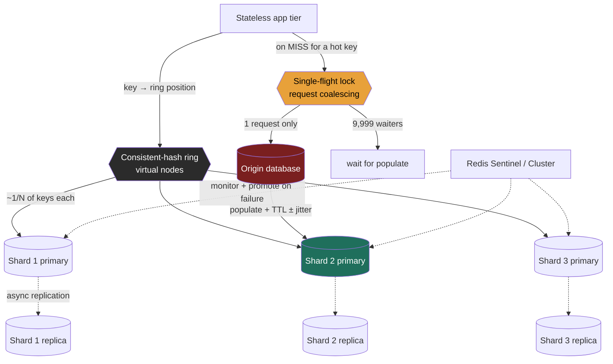

import CachingStrategiesSimulator from '@components/widgets/CachingStrategiesSimulator.jsx';

### Learning objectives
- Size a **distributed cache tier** from a read:write ratio and a target hit rate, and justify *why* a cache is the highest-leverage move for a read-heavy system - in real numbers (QPS shed, latency dropped, origin nodes saved).
- Choose an **eviction policy** (LRU vs LFU vs TTL) from the access pattern, and reason about its **hit-rate impact** and the difference between *exact* and *approximated* eviction.
- **Shard** the cache fleet with **consistent hashing** so that adding or losing a node remaps a minimal slice of keys, and contrast Redis Cluster (server-side) with Memcached (client-side).
- Engineer **replication and failover** for the cache (Redis Sentinel / Cluster vs. Memcached's "just lose the shard"), and decide whether the cache even *deserves* HA.
- Defend against **hot keys** and **cache stampede / thundering herd** with request coalescing, TTL jitter, and locks - and state the **consistency cost** of caching authoritative data.

### Intuition first
A distributed cache is the **front-of-house at a busy restaurant**, and the database is the **kitchen**. Most diners order the same ten dishes, so the front-of-house keeps those plated and ready under a heat lamp: a request for the popular dish is served in **seconds from the lamp (a cache hit)** instead of **minutes from the kitchen (an origin read)**. That is the whole reason the cache exists - it absorbs the repetitive demand so the slow, expensive kitchen only does the rare or genuinely new work.

Now scale the front-of-house past one counter, and four hard questions appear - and they *are* this lesson:

- **The lamp is finite.** It holds maybe 200 plates; the menu has 50,000 dishes. When it fills, *which plate do you throw out* to make room? Toss the dish nobody's ordered in an hour (**LRU**), or the dish that's *rarely* ordered overall even if someone just asked once (**LFU**), or simply let each plate sit for ten minutes and then bin it (**TTL**)? That choice directly sets how often you hit the lamp vs. trudge to the kitchen.
- **One counter can't serve the crowd**, so you run **many counters** (a fleet). But each plate must have a *home counter* every server agrees on, or you'll plate the same dish at five counters and waste the lamp. When you add a counter on a busy night, you do **not** want to re-assign all 50,000 dishes - just a fair slice. That is **consistent hashing**.
- **A counter catches fire.** Were its plates the *only* copy (then that part of the menu is suddenly slow until the kitchen catches up), or did a backup counter hold the same plates (HA, at double the heat-lamp cost)?
- **One dish goes viral** and 10,000 diners ask for it in the same second, *just as* its plate was binned. Without coordination, all 10,000 orders stampede the kitchen at once for the same dish - and the kitchen, sized for the steady trickle, falls over. The fix is to let **one** order go to the kitchen and have the other 9,999 **wait for that single plate** (request coalescing), plus stagger expiry so the whole menu doesn't bin at once (TTL jitter).

Hold the picture: a finite heat lamp (eviction), many counters with agreed homes (consistent-hash sharding), backup counters (replication/failover), and a coalescing rule for the viral dish (stampede control). Every decision below trades **hit rate, latency, memory cost, and freshness** against each other.

### Deep explanation

A distributed cache is an in-memory key-value tier - **Redis** or **Memcached** are the canonical choices (the key-value family from Lesson 2.2) - sitting between the stateless app tier (Lesson 2.10) and the origin database. It earns its place on one number: the **hit rate**.

#### Why a cache, in numbers (the leverage)

Take a read-heavy service at **50,000 read QPS**. An origin Postgres read costs ~**10 ms**; a Redis hit costs ~**0.5-1 ms** (recall the latency hierarchy of Lesson 1.4 - memory and a same-DC network hop are orders of magnitude under a disk-backed query). Put a read-through cache in front and assume a **90% hit rate**:

- **Origin load:** the database now sees only the 10% misses = **5,000 QPS** instead of 50,000 - a **10x reduction**. If one Postgres replica handles ~5,000 read QPS, you've gone from needing ~10 read replicas to ~1. That is real money and real operational surface removed.
- **Latency:** blended p50 ≈ `0.9 × 1ms + 0.1 × 10ms ≈ 1.9 ms`, down from a flat ~10 ms. The tail is what users feel, and the cache flattens it for the common path.
- **The hit-rate cliff is non-linear.** Misses, not hits, size your origin. Going **90% → 95%** halves the miss traffic (5,000 → 2,500 QPS) and halves origin cost; **99% → 99.9%** is another 10x on misses. This is why a few points of hit rate is worth fighting for, and why **eviction policy and stampede control - which directly move the hit rate - are Director-level cost levers, not tuning trivia.**

#### Write strategies - the recap (full treatment in 2.10, and in the widget below)

The cache is a **second copy of the truth**, so every write must decide how cache and database stay in agreement and who pays the latency. Three strategies, recapped:

- **Cache-aside (lazy load):** app writes the DB, then **invalidates** the cache key; next read reloads it. Durable, DB is source of truth, cache only stale via a race. The sensible default. (Rejected for write-heavy hot keys: it pays a miss + reload after every write.)
- **Write-through (sync both):** app writes cache **and** DB before ack. Read-after-write is always fresh and warm. (Rejected when writes are frequent and reads rare: highest write latency, churns the cache.)
- **Write-back (write-behind):** app writes cache only, flushes DB async. Lowest write latency, absorbs bursts. (Rejected for authoritative data: a crash before flush **loses** every dirty write.)

This lesson assumes that recap and builds the *fleet* around it: eviction, sharding, replication, and stampede control are the same on top of any write strategy.

#### Eviction policies and their hit-rate impact

A cache is finite memory; the **working set** (the keys actually being hit) almost never fits the whole keyspace. When `maxmemory` is reached, an **eviction policy** decides what to discard. The policy is chosen from the **access pattern**, and it directly moves the hit rate.

- **LRU (Least Recently Used):** evict the key untouched for the longest. The default mental model and usually the right one - it captures **temporal locality** (recently used → likely used again). Strong for "recent activity is hot" workloads (timelines, sessions, trending content). Weakness: a **scan** (a backup job, a crawler walking every key once) floods the cache with one-hit keys and **evicts the genuinely hot set** - LRU can't tell a one-shot scan from real demand.
- **LFU (Least Frequently Used):** evict the key with the **lowest access count**. Better when popularity is **stable and skewed** (a Zipfian catalog where the top 1% of items take 50% of traffic) and scan-resistant, because a swept-once key has count 1 and is evicted first, protecting the hot set. Weakness: **stale popularity** - yesterday's viral item keeps a high count and squats in memory after demand has moved on (mitigated by a decaying/aging counter, which Redis's LFU does).
- **TTL (Time-To-Live):** not a replacement-on-full policy but an **expiry**: each key self-destructs after N seconds, capping **staleness** regardless of memory pressure. TTL is the freshness dial - the answer to "how stale may this be?" A 30 s TTL on a feed bounds staleness to 30 s; a 24 h TTL on a rarely-changing product page maximizes hit rate. TTL and LRU/LFU **compose**: TTL bounds *staleness*, LRU/LFU manages *capacity*.

**Exact vs. approximated - the detail that separates altitudes.** Tracking true global LRU/LFU means maintaining an ordered structure over millions of keys on every access - too expensive on the hot path. So **Redis approximates**: it **samples** a handful of keys (default 5, tunable via `maxmemory-samples`) and evicts the best candidate among them - close to true LRU/LFU at a fraction of the cost. **Memcached** uses a **per-slab LRU** (memory is carved into fixed size-classes; eviction is LRU *within* a slab), which is why a badly-tuned slab layout can evict hot items while another slab sits half-empty - "slab calcification." Naming "Redis LRU is sampled/approximated, and Memcached's LRU is per-slab" is a strong signal; assuming either is a perfect global ordering is a red flag.

Redis names these as `maxmemory-policy`: `allkeys-lru`, `allkeys-lfu`, `volatile-lru`, `volatile-lfu`, `volatile-ttl`, `allkeys-random`, `noeviction`. The `allkeys-*` variants consider every key; the `volatile-*` variants only evict keys that have a TTL set (so you can pin keys by giving them no expiry). `noeviction` **rejects writes** when full - correct for a cache used as a primary store, dangerous for a pure cache (writes start failing). The decision: **`allkeys-lru` is the safe default** for a general cache; switch to **`allkeys-lfu`** for a stable, skewed-popularity catalog; use **`volatile-ttl`** when you've set deliberate TTLs and want the soonest-to-expire evicted first.

#### Sharding the fleet with consistent hashing

One cache node has a memory ceiling (say **64 GB** usable) and a throughput ceiling. A 500 GB working set or 1M+ QPS needs a **fleet** - and the fleet needs a rule mapping each key to a node that **every client agrees on**, or different clients cache the same key in different places and you waste memory and serve stale copies.

The naive rule is **`node = hash(key) mod N`**. It distributes evenly but has a fatal property: change `N` (add a node, lose a node) and **almost every key remaps** - because `mod N` and `mod (N+1)` agree for very few keys. Going from 10 to 11 nodes remaps ~**90%+** of keys; every remapped key is now a **miss**, so the origin database is hit by a near-total cache flush at the worst moment (you're scaling *because* you're under load). That mass-invalidation is the reason `mod N` is rejected for a cache fleet.

**Consistent hashing** (Lesson 2.6) fixes this. Hash both keys and nodes onto the same ring; a key is owned by the next node clockwise. Add or remove a node and only the keys **between that node and its predecessor** move - roughly **`1/N`** of the keyspace - instead of all of it. Going from 10 to 11 nodes remaps ~`1/11` ≈ **9%** of keys, not 90%. **Virtual nodes** (each physical node placed at many points on the ring) smooth the otherwise-lumpy distribution and let you weight bigger machines. This is precisely the property a cache needs: scaling the fleet should cost a small, bounded miss spike, not a full stampede.

Two implementations, and the choice is architectural:

- **Memcached** has no cluster awareness - **sharding is client-side**. The client library (e.g. ketama-style consistent hashing) decides which node holds each key. Simple, dumb servers, but every client must share the **same ring config**, and the client owns rebalancing logic. (Rejected when you want server-managed topology and data structures - Memcached only does opaque blobs.)
- **Redis Cluster** shards **server-side** across **16,384 hash slots** (`slot = CRC16(key) mod 16384`), slots assigned to nodes; clients are redirected (`MOVED`/`ASK`) to the right node. Slots are the unit of rebalancing, giving fine-grained, server-coordinated movement. Cost: more moving parts, and **multi-key operations only work within one slot** (you use **hash tags** `{user123}` to co-locate related keys). (Rejected when a single node suffices - cluster mode adds operational weight you don't need under ~the throughput/memory ceiling of one primary + replica.)

#### Replication and failover - does the cache deserve HA?

A cache node holds only a *copy* of data that lives authoritatively in the database, so the first Director question is: **what happens if a shard just disappears?** Two philosophies:

- **No replication (Memcached, or Redis without replicas).** Lose a node and you lose that shard's cached keys. Those reads now **miss through to the origin** until the cache refills. This is *acceptable* and even *correct* when the origin can absorb the temporary miss surge - the cache is a pure performance layer, and replicating it doubles memory cost for a failure mode the database can survive. The risk to size: losing a shard at peak can stampede the origin (so pair this choice with stampede control, below).
- **Replication + failover (Redis).** Each primary has one or more **replicas** kept in sync by **asynchronous** replication. On primary failure, a replica is promoted. For a non-clustered setup, **Redis Sentinel** monitors, elects, and reconfigures clients to the new primary; **Redis Cluster** does failover internally per slot range. This keeps the cache warm across a node loss (no miss surge) - at **2x memory** and added operational complexity.

The critical caveat - and a favorite probe: **Redis replication is asynchronous**, so a primary can ack a write, then die before the replica receives it; the promoted replica **loses that write**. Redis is therefore **AP-leaning, not a CP store** - `WAIT` can block for replica acks but doesn't make it a consensus system, and during a partition Cluster favors availability within reason. The implication: **never treat the cache as the durable source of truth.** If a value must not be lost, it lives in the database; the cache is allowed to lose it. (Rejected pattern: using write-back to a single-replica Redis as a system of record - an async-replication window plus an eviction policy means guaranteed eventual data loss.)

#### Hot keys and cache stampede (thundering herd)

Two failure modes that bring down "well-cached" systems:

**Hot key.** One key is so popular (a celebrity's profile, a flash-sale item, a global config) that its single owning shard is saturated while others idle - consistent hashing balances *keys*, not *load on one key*. The whole point of sharding is defeated by one key taking 30% of traffic. Mitigations, each with a trade: **replicate the hot key to multiple nodes and read from a random replica** (spreads read load; costs memory and adds staleness across copies); **add a small local/in-process cache** (L1) in front of the shared cache so the hottest keys are served without even a network hop (costs per-node memory and a second invalidation layer); or **append a random suffix** (`config:{0..9}`) to spread one logical key across 10 physical keys (costs 10x writes to keep them in sync). The interview signal is *recognizing that consistent hashing does nothing for a single hot key* and naming a deliberate fix.

**Cache stampede / thundering herd.** A hot key **expires** (or its node is lost), and the N concurrent requests that were all being served from cache **simultaneously miss and hit the origin for the same key**. At 10,000 QPS on one key, the origin gets 10,000 identical queries in the TTL-expiry instant - for a DB sized to the ~1 QPS of actual misses. The origin falls over, every request times out, and the cache can't refill because the origin is down: a self-sustaining outage. Three mitigations, used together:

- **Request coalescing (single-flight / "dogpile" lock):** when a key misses, the **first** request acquires a short lock, fetches from the origin, and populates the cache; concurrent requests for the same key **wait** for that single fetch instead of all hitting the origin. 10,000 misses collapse to **1** origin read. (Trade: the 9,999 waiters block briefly; a botched lock can serialize a hot key. Implement the lock with a TTL so a crashed fetcher can't wedge it.)
- **TTL jitter:** never give a batch of keys the *same* TTL, or they all expire in the same second and stampede together (a *synchronized* herd, e.g. after a bulk warm). Set TTL to `base ± random(0, jitter)` (e.g. `300 s ± 30 s`) so expiries **spread out** and only a trickle of keys is ever cold at once. (Trade: slightly less predictable freshness; nearly free, almost always worth it.)
- **Early / probabilistic recomputation:** refresh a hot key **just before** it expires (a background refresh, or each request recomputes with a small probability that rises as expiry nears) so the value is **never actually cold** under load. (Trade: extra recomputes and added machinery; reserved for the hottest keys.)

The Director framing: stampede control is **availability engineering**, not micro-optimization. A cache without it converts a routine TTL expiry into an origin-down incident, and that failure mode is exactly what an interviewer at this level wants you to pre-empt.

#### The consistency cost of caching authoritative data

A cache buys latency by holding a copy, and the copy can be **wrong**. The tension is the **PACELC** trade from Lesson 2.7 made concrete (Else-side: even with no partition, you trade Latency for Consistency) and the same dial as the quorum trade in Lesson 2.8: keep the copy in lockstep with the database and pay latency, or let it drift and serve **stale** data.

- **Staleness window.** With cache-aside + TTL, a value can be stale for up to its TTL after the underlying row changes (until invalidation or expiry). You make this an explicit product decision: a like-count stale for 30 s is fine; a bank balance or a permission/authz check is **not** - those bypass the cache or use write-through with tight invalidation.
- **Invalidation is the hard part.** "There are only two hard things in computer science: cache invalidation and naming things" is a cliché because it's true. Invalidate too little → stale reads; invalidate too aggressively → you destroy your own hit rate. Patterns: **TTL** (simple, bounded staleness, no coordination - the default); **explicit invalidation** on write (fresh, but you must catch *every* write path, and a missed one silently rots); **write-through** (fresh and warm, at write latency); **versioned keys** (`product:42:v7` - a write bumps the version so old keys are unreachable and age out, sidestepping invalidation races at the cost of key churn).
- **The boundary rule.** Cache derived, read-mostly, tolerant-of-staleness data aggressively (rendered pages, feeds, counts, catalogs). For data where a stale read is a correctness or safety bug (balances, inventory at the moment of sale, authz), either don't cache it, cache it with very short TTL + write-through, or read it from the source on the critical decision. **Stating which data you refuse to cache, and why, is the strongest single signal here** - it shows you treat the cache as a copy that is *allowed to be wrong*, and you've decided where that's unacceptable.

### Diagram - the cache fleet: consistent-hash ring, replication, and stampede control

### Run the write-strategy trade yourself

The widget below is a single-writer **caching write-strategy simulator** - the foundation this whole fleet sits on. The **read** path is identical across strategies (check cache, return on hit; on miss read the database, populate, return), so reads are not where they differ. The **write** path is the entire trade, and the simulator makes it visible by giving every key a monotonically increasing **version**: whenever cache and database disagree, you see it as an integer of staleness (cache `v5` / db `v3` means the database is two versions behind).

Pick a strategy (**cache-aside**, **write-through**, **write-back**) and a **workload** (read-after-write on a hot key, write-heavy, or read-heavy), then step or auto-run the operation stream. Watch three things that map straight onto this lesson:

- The **hit/miss rate** - the number that sizes your origin. Run **read-after-write** and see cache-aside take a post-write miss (it invalidated) while write-through stays warm at 100%.
- The per-key **cache-vs-db version skew** - the **staleness meter** from the consistency section, made into an integer.
- The **write-latency bars** (model: ~1 ms cache write, ~10 ms DB write - what the client waits for before ack), the latency half of the trade.

The discriminating move for the durability point above: run the **write-heavy** preset, then hit **Crash** mid-stream and watch **only write-back** report lost versions while cache-aside and write-through lose nothing - the reason you never make a single-replica, write-back cache your system of record.

<CachingStrategiesSimulator client:load />

### Worked example - the timeline + counts cache for a social feed (Twitter-scale read path)

Continue the photo/feed app from Lessons 2.2 and 2.10. The read path is overwhelmingly read-heavy (~**100:1** reads:writes on timelines), so caching is the load-bearing decision.

- **Estimation (the E step).** Assume **40,000 timeline read QPS** at peak, each timeline ~**2 KB** rendered, and a working set of the **~5M** active users' recent timelines = ~**10 GB** hot. A target **95% hit rate** means the origin (Cassandra timeline store) sees only **2,000 QPS** of misses instead of 40,000 - a **20x** shed. 10 GB + counters + headroom fits comfortably on a small Redis fleet; we pick **4 shards** for throughput headroom and blast radius, not capacity.
- **Sharding.** Key timelines as `timeline:{userId}` and shard with **consistent hashing** (Redis Cluster's 16,384 slots; the `{userId}` hash tag co-locates a user's timeline and counts in one slot so we can read them together). We reject `mod N` explicitly: when we add the 5th shard during a growth spike, consistent hashing remaps ~`1/5` of keys (a ~20% bounded miss blip) instead of `mod N`'s ~90% flush, which would stampede Cassandra exactly when we're scaling because we're hot.
- **Eviction.** **`allkeys-lru`** - timeline access has strong temporal locality (active users churn the working set; dormant users age out). We reject LFU here because popularity isn't stable: a user active today may be idle next week, and LFU would let stale-but-high-count timelines squat. We accept that a large scan (an analytics sweep) could pollute LRU, and route such jobs **off** the cache.
- **Replication & failover.** Each shard gets **one replica** with **Sentinel/Cluster failover**. This is the deliberate call to spend **2x memory**: at 40,000 QPS, losing an un-replicated shard would dump ~10,000 QPS of cold misses onto Cassandra instantly - a stampede we'd rather pay memory to avoid. (For a smaller, miss-tolerant service we'd reject replication and let the origin absorb the loss.)
- **Hot key.** A celebrity's timeline/counts is a hot key that pins one shard. We **replicate that key across all shards and read from a random one**, and add a tiny **in-process L1** on the app nodes for the top handful of keys. We accept the extra memory and a bounded cross-copy staleness to avoid saturating a single shard.
- **Stampede control.** Counts and timelines carry **TTL with jitter** (`60 s ± 10 s`) so a bulk warm doesn't expire in lockstep, and misses go through a **single-flight lock** per key so a viral timeline's expiry triggers **one** Cassandra read, not 10,000. This converts the scariest failure mode (hot-key expiry under load) from an outage into a 1-query blip.
- **Consistency boundary.** Timelines and like-counts are **cache-aside with short TTL** - a few seconds of staleness on a like-count is fine and stated as such. But **follower/blocked-user authz** (can this viewer see this account?) is **not** cached loosely: a stale "allowed" is a privacy bug, so that check is write-through with tight invalidation or read from source. Naming the data we **refuse** to cache loosely is the point.

The signal isn't any single pick - it's that **eviction, sharding, replication, hot-key, and the consistency boundary each fell out of the read:write ratio, the hit-rate target, and the cost of a stale read**, and each named what it gave up.

### Trade-offs table - eviction policies
| Policy | Evicts | Best when | Weakness | Use when… |
|---|---|---|---|---|
| **LRU** | least-recently-used | temporal locality (recent = hot) | a scan floods it with one-hit keys | General default; sessions, timelines, "recent is hot" |
| **LFU** | least-frequently-used | stable, skewed (Zipfian) popularity; scan-resistant | stale popularity squats (use aging) | Catalogs/CDN-origin where top items are durably hot |
| **TTL (expiry)** | keys past their lifetime | you must bound **staleness** | not a capacity policy on its own | Always - composed with LRU/LFU to cap freshness |

### Trade-offs table - cache fleet topology
| Dimension | Memcached (client-side) | Redis Cluster (server-side) | Use when… |
|---|---|---|---|
| Sharding | client library, consistent hash (ketama) | 16,384 server-managed hash slots | Memcached: dumb-server simplicity; Redis: server-coordinated rebalancing + data structures |
| Replication / failover | **none** (lose node → lose shard) | replicas + Sentinel/Cluster failover | Memcached: origin can absorb a lost shard; Redis: keep cache warm across node loss |
| Data model | opaque blobs only | strings, hashes, sorted sets, etc. | Redis when you need structures (rate limiters, leaderboards, queues) |
| Threading | multi-threaded per node | per-shard mostly single-threaded | Memcached for raw blob throughput per node; Redis for richness + cluster |
| **Cost/complexity** | low | higher (topology, slots, hash tags) | Start Memcached/simple; Redis Cluster when scale + features justify the weight |

### Trade-offs table - stampede mitigation
| Technique | How | Cost / trade | Use when… |
|---|---|---|---|
| **Request coalescing** (single-flight) | first miss locks + fetches; others wait | waiters block briefly; lock needs a TTL so a crash can't wedge it | Any hot key that can expire under concurrent load |
| **TTL jitter** | `base ± random` expiry | slightly less predictable freshness; nearly free | Always for any batch-warmed / synchronized keys |
| **Early/probabilistic refresh** | recompute just before expiry | extra recomputes + machinery | The very hottest keys that must never go cold |

### What interviewers probe here
- **"You add a cache and it's still slow / the DB still falls over - why?"** - *Strong:* low hit rate or a **stampede** - a hot key expiring sends N concurrent misses to the origin; fix with coalescing + TTL jitter, and check the working set fits memory. *Red flag:* "add more cache nodes" with no notion of hit rate or the herd.
- **"How do you scale the cache fleet without flushing it?"** - *Strong:* **consistent hashing** so adding a node remaps ~`1/N` of keys, not ~all of them (names `mod N`'s mass-invalidation as the rejected baseline); virtual nodes to balance. *Red flag:* `hash mod N`, unaware that growing N invalidates nearly everything.
- **"One key is taking 30% of traffic - now what?"** - *Strong:* recognizes **consistent hashing doesn't help a single hot key** (it balances keys, not load on one key) and names a fix: replicate the key across nodes, L1 in-process cache, or key-splitting - each with its memory/staleness cost. *Red flag:* "consistent hashing balances it" - it does not.
- **"What happens when a cache node dies?"** - *Strong:* depends on replication: with replicas, Sentinel/Cluster promotes one and the cache stays warm; without, that shard's reads **miss through** and you'd better have stampede control. Names that **Redis replication is async**, so a failover can lose acked writes - therefore the cache is never the source of truth. *Red flag:* treating the cache as durable, or not knowing a lost shard stampedes the origin.
- **"LRU or LFU, and why?"** - *Strong:* LRU for temporal locality (and notes scan-pollution); LFU for stable skewed popularity (and notes stale-popularity, fixed by aging); both are **approximated/sampled** in Redis, per-slab in Memcached. *Red flag:* picking one with no access-pattern reasoning, or assuming exact global ordering.
- **"What should this cache *not* hold?"** - *Strong:* data where a stale read is a correctness/safety bug (balances, authz, inventory-at-sale) - don't cache loosely; short TTL + write-through or read from source. *Red flag:* "cache everything," no staleness boundary.
- **"What does the cache cost you, beyond the box?"** - *Strong:* a **second copy** to keep coherent - invalidation, staleness windows, stampede surface, hot-key skew, and (if replicated) 2x memory plus a failover system to run. *Red flag:* "caching is free performance."

### Common mistakes / misconceptions
- **`hash mod N` sharding.** Works until you change N, then it invalidates ~90% of keys and stampedes the origin during a scale-out. Use consistent hashing.
- **No stampede protection.** A single hot-key TTL expiry becomes an origin-down incident as thousands of concurrent misses hit at once. Coalesce + jitter.
- **Synchronized TTLs.** Bulk-warming a cache with one fixed TTL guarantees a synchronized expiry herd later. Always jitter.
- **Treating the cache as durable / a system of record.** Redis replication is **async** and eviction can drop keys - a write-back, single-replica cache *will* eventually lose data. Authoritative state lives in the database.
- **Assuming consistent hashing fixes hot keys.** It balances *keys across nodes*, not *load on one key* - a single hot key still pins one shard.
- **Believing LRU/LFU is a perfect global ordering.** Redis **samples** (approximate LRU/LFU); Memcached is **per-slab** LRU. Tune `maxmemory-samples`/slabs accordingly.
- **Caching authoritative, safety-critical data with loose TTLs.** A stale authz or balance read is a bug, not a latency win.
- **Ignoring eviction as a cost lever.** A wrong policy quietly tanks the hit rate, which silently multiplies origin cost and latency.

### Practice questions
**Q1.** You front Postgres with Redis at 50,000 read QPS and a 90% hit rate. A product launch makes one item 100x as popular; minutes later the site is down with database timeouts. Diagnose and fix.
> *Model:* Two coupled problems. (1) **Hot key:** the launch item's key pins a single shard - consistent hashing balances keys, not load on one key - so that shard saturates. (2) **Stampede:** when that hot key's TTL expires (or its shard is lost), the thousands of concurrent requests that were cache-served all **miss simultaneously** and hit Postgres for the same row; Postgres, sized for the ~normal miss rate, falls over, and the cache can't refill while it's down - a self-sustaining outage. Fixes, layered: **request coalescing** (single-flight lock) so one miss does the origin read and the rest wait → thousands of queries collapse to one; **TTL jitter** so keys don't expire in lockstep; **replicate the hot key** across nodes (or an in-process L1) to spread its read load. Each costs something (waiter latency, memory, cross-copy staleness), but they convert a hot-key expiry from an outage into a one-query blip. State the boundary: the cache is a copy that may be wrong, sized to shed load - it must fail soft.

**Q2.** Your cache fleet is 8 Redis nodes sharded by `hash(key) mod 8`. You need to add 4 nodes for capacity. What goes wrong, and what should you have done?
> *Model:* Going from `mod 8` to `mod 12` remaps **almost every key** (the two moduli agree for very few keys), so the moment you reshard, the cache is effectively **flushed** - nearly all reads miss and slam the origin database with a full cold-load surge, precisely while you're scaling because you're already hot. The right design is **consistent hashing** (hash keys and nodes onto a ring; a key is owned by the next node clockwise, with virtual nodes to balance): adding 4 nodes to 8 remaps only ~`4/12` ≈ **33%** of keys - and far less if you add them one at a time (~`1/N` each) - so the miss blip is bounded and the origin survives. Redis Cluster expresses this as moving a subset of the 16,384 **hash slots** to the new nodes, online. The rejected alternative (`mod N`) is simpler to write but makes every capacity change an outage risk.

**Q3.** When would you run the cache with **no replication** at all, and when is that negligent?
> *Model:* No replication is the right call when the cache is a **pure performance layer** over an origin that **can absorb a lost shard's miss surge**: replicating doubles memory cost to defend a failure the database already survives. Concretely: a moderate-QPS service where losing one of N shards adds, say, `(1/N) × totalQPS` of origin misses that the DB can take - spend the money elsewhere. It becomes **negligent** when (a) the origin **cannot** absorb the surge - losing a shard at peak stampedes it into an outage - or (b) the data is expensive/slow to recompute, so a cold shard cripples latency for minutes. Then you pay **2x memory** for replicas + a failover system (Sentinel/Cluster). The tie-breaker is the **blast radius**: compute the QPS a lost shard dumps on the origin and ask whether the origin survives it *with* stampede control. Crucially, replication is **not** about durability here - Redis replicates async and can lose acked writes on failover - it's about keeping the cache **warm**.

**Q4.** A teammate proposes write-back to Redis as the system of record for a shopping cart "to make writes instant." Walk them through the risk.
> *Model:* Write-back acks at cache speed and flushes the database asynchronously, so between the ack and the flush the **only** copy of that write is in Redis memory. Two compounding hazards make Redis unsafe as the **sole** record: (1) **eviction** - under memory pressure the eviction policy can drop a not-yet-flushed key (unless carefully pinned), and (2) **async replication** - a primary can ack, then die before the replica syncs, and the promoted replica **never had** the write. Either way the cart write is **gone** with no origin to recover from - and Redis is **AP-leaning, not CP**, so it offers no consensus guarantee here. The fix: the **database is the source of truth**; use **cache-aside** or **write-through** so every cart write is durably persisted before (or synchronously with) the cache, accepting slightly higher write latency for a cart you cannot lose. Write-back is acceptable only for **reconstructable** data with a tolerable loss window (e.g. view counters you can re-derive) - never authoritative state.

**Q5.** Same Redis cache, two keys: a product's `like_count` and a user's `can_view_account` authorization result. Same caching policy for both? Justify.
> *Model:* No - the **cost of a stale read differs**, so the consistency boundary differs. `like_count` is derived, read-mostly, and tolerant: a few seconds stale is invisible to users, so **cache-aside with a short TTL** (and stampede control if it's hot) maximizes hit rate at negligible correctness cost. `can_view_account` is an **authorization** decision: a stale "allowed" after access was revoked is a **privacy/security bug**, not a latency trade. So either don't cache it, or cache with a **very short TTL + write-through and tight invalidation on any permission change**, or read it from source on the access decision. This is the boundary rule: cache derived/tolerant data aggressively; for data where a wrong copy is a correctness or safety failure, refuse to cache loosely and say why. Applying one blanket TTL to both is the mistake.

### Key takeaways
- A cache earns its place on **hit rate**: 90% sheds 10x of origin reads and flattens p50; because **misses size the origin**, a few points of hit rate is a real cost lever, and **eviction + stampede control are how you move it** - not tuning trivia.
- **Eviction** is chosen from the access pattern: **LRU** for temporal locality (scan-vulnerable), **LFU** for stable skewed popularity (stale-popularity, fix with aging), **TTL** to bound staleness; Redis eviction is **sampled/approximate**, Memcached is **per-slab** - neither is a perfect global ordering.
- **Shard with consistent hashing**, never `mod N`: adding/removing a node remaps ~`1/N` of keys instead of ~all of them, so scaling costs a bounded miss blip, not a full origin stampede (Redis Cluster = 16,384 server-side slots; Memcached = client-side ring).
- **Replication keeps the cache warm across node loss** at 2x memory and a failover system (Sentinel/Cluster) - but Redis replication is **async**, so it is **never the durable source of truth**; size the no-replication choice by the miss surge a lost shard dumps on the origin.
- **Hot keys** (consistent hashing does **not** help them - replicate/split/L1) and **stampedes** (coalesce + TTL jitter + early refresh) are availability engineering; and caching authoritative data has a **consistency cost** - state the data you refuse to cache loosely (balances, authz) and why.

> **Spaced-repetition recap:** Cache = heat lamp over the kitchen; it pays off on **hit rate** (misses size the origin, so eviction and stampede control are cost levers). Finite lamp → **eviction** (LRU temporal / LFU stable-skew / TTL staleness; Redis samples, Memcached per-slab). Many counters → **consistent hashing** (remap ~`1/N`, never `mod N`). Backup counters → **replication** (warm across failure, but Redis is **async/AP**, never the source of truth). Viral dish → **coalescing + TTL jitter** so one TTL expiry isn't an outage. And a cache is a copy that may be wrong - never cache balances/authz loosely.

---

*End of Lesson 3.7. The cache tier built here - sharded by consistent hashing (2.6), replicated like any leader-follower store (2.4), and bounded by the PACELC/quorum consistency dials (2.7, 2.8) - is the read-path workhorse the Module 5 problems (Twitter/feed, Instagram, Typeahead) lean on. Next building blocks: 3.8 Distributed Messaging Queue and 3.9 Publish-Subscribe, the asynchronous, burst-absorbing seam introduced in 2.10.*
