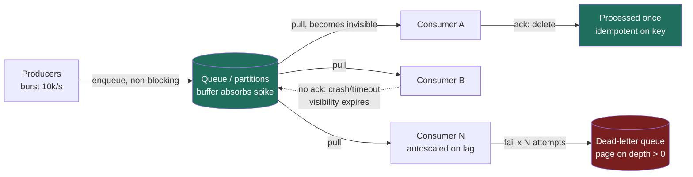

### Learning objectives
- Explain why a point-to-point queue exists: **decoupling** producers from consumers and **load-leveling** bursty traffic against finite worker capacity.
- Reason precisely about delivery semantics, **at-most-once / at-least-once / exactly-once**, and why "exactly-once" in a distributed system is really **effectively-once via idempotency**.
- Engineer the consumer contract: **visibility timeout, acks, retries, dead-letter queues**, and **ordering via partitions**.
- Make the **Kafka vs SQS vs RabbitMQ** call from requirements, and quantify **backpressure** and **consumer scaling** limits.

### Intuition first
A point-to-point queue is the **kitchen ticket rail in a busy restaurant.** Waiters (producers) clip orders to the rail and walk away immediately, they don't wait for the food. Cooks (consumers) pull the next ticket when they're free. The rail **decouples** the two: a lunch rush of 40 orders in two minutes doesn't make a waiter stand and block; the tickets queue up and the cooks **drain the backlog at their own pace** (load-leveling). Each ticket is worked by **exactly one cook**, that's the "point-to-point" part, work distribution, not broadcast. And a quiet rule: a cook **pulls a ticket down only when the plate is up** (the ack). If a cook collapses mid-order, their ticket **reappears on the rail** after a while (the visibility timeout) so someone else finishes it, which is why the same order can occasionally be cooked twice, and why the expediter checks the order number at the pass (idempotency).

Hold that image, every mechanic below is a literal feature of that rail. (Broadcasting one ticket to *every* station is publish-subscribe, the publish-subscribe building block; this lesson stays point-to-point.)

### Deep explanation

**Why a queue at all, the two jobs it does.** A queue is asynchronous middleware between a producer and a consumer. It buys you two things, and you should always name which one you're invoking:

1. **Decoupling.** The producer doesn't call the consumer directly; it writes a message and returns. The consumer can be down, redeployed, or scaled to zero and the producer is unaffected. This converts a **synchronous fan-out of failures** ("the email service is slow, so checkout is slow") into an isolated boundary. Without it, a 200 ms third-party call sitting inside a 50 ms checkout path means your p99 is now hostage to a vendor.
2. **Load-leveling (the buffer).** Traffic is bursty; worker capacity is fixed. A queue absorbs a spike and lets a fixed pool of workers process at a **steady rate**. Concretely: a flash sale drives **10,000 orders/sec for 30 seconds** (300k orders), but your fulfillment workers sustain **2,000/sec**. Without a queue you must provision for the 10k peak (5× the steady fleet, idle 99% of the day) or drop 80% of orders. With a queue, the 300k messages land in the buffer and the 2,000/sec fleet **drains the backlog in ~150 seconds** (300k ÷ 2,000). You traded a few minutes of latency for a 5× smaller, cheaper fleet, a direct cost decision a Director owns.

**The alternative rejected:** a synchronous call (REST/RPC) is simpler and lower-latency, and you should prefer it when the caller needs the result *now*. Reach for a queue when the work can be **deferred**, the producer **must not block**, and the load is **spiky**, otherwise the queue is just added latency and an extra system to operate.

**Delivery semantics, the heart of the lesson.** Three guarantees, and the gap between them is where interview signal lives.

- **At-most-once:** deliver and forget; if processing fails, the message is *lost*. Cheapest, lowest latency, no retries. Acceptable only when loss is tolerable, high-volume metrics, sampled telemetry, best-effort notifications. *Rejected for anything financial or state-mutating.*
- **At-least-once:** the message is redelivered until the consumer acknowledges success. **This is the default and the right default for almost everything.** The cost: **duplicates are guaranteed to happen**, a consumer can finish the work and then crash *before* its ack lands, so the broker, never having seen the ack, redelivers. You do not get to wish duplicates away.
- **Exactly-once:** each message affects the system once and only once. **Exactly-once *delivery* over an unreliable network is provably impossible**, the classic result: the ack can always be the message that's lost, so the sender can never distinguish "delivered, ack lost" from "not delivered," and must choose to risk a duplicate (at-least-once) or a loss (at-most-once). What is achievable is exactly-once **processing**, by one of two routes:
  - **Idempotent consumers (effectively-once).** The consumer is built so that processing the same message twice has the same effect as once, dedupe on a business key. `charge_order(order_id=123)` first checks "have I already charged 123?" in a dedupe table or via a unique constraint, and the second delivery is a no-op. This is the **only** route that works when the side effect crosses out of the messaging system (writing to Postgres, calling Stripe). **At-least-once delivery + idempotent processing = effectively-once**, and that phrase is the answer interviewers want.
  - **Transactional exactly-once *within* the broker's boundary.** Kafka offers EOS (exactly-once semantics) via an **idempotent producer** (sequence numbers dedupe producer retries) plus **transactions** that atomically commit "consume from topic A, produce to topic B, advance the offset." This is genuine exactly-once **but only while you stay inside Kafka** (stream processing, topic→topic). The moment you write to an external store, you're back to needing idempotency.

The Director-altitude statement: *"I'll run at-least-once and make the consumer idempotent on the order ID, exactly-once delivery isn't a real thing across a network; effectively-once via a dedupe key is."* That one sentence separates signal from hand-waving.

**Visibility timeout, acks, retries, the redelivery machinery.** At-least-once is implemented by *withholding* the message until the consumer confirms.

- A consumer **receives** (pulls) a message; the broker makes it **invisible** to other consumers for a **visibility timeout** (SQS default **30 s**, max **12 h**).
- The consumer processes and sends an **ack** (SQS: deletes the message). The message is gone for good.
- If the consumer **crashes, times out, or never acks**, the visibility timeout expires and the message **becomes visible again**, redelivered to another consumer. This is exactly why duplicates exist under at-least-once.
- **Tuning is a real trap:** set the timeout *shorter* than your processing time and the message redelivers **while you're still working it** → two workers process the same item concurrently (possible double-charge). Set it *too long* and a failed message sits invisible for minutes before retry. Rule of thumb: visibility timeout ≈ **p99 processing time × 2-6**, and for long jobs, **heartbeat** by extending the timeout mid-flight.

**Retries and the poison message → dead-letter queue.** Some messages will *never* succeed, malformed payload, a deleted row, a bug, and under naive at-least-once they **redeliver forever**, burning CPU and head-of-line-blocking the queue. The fix is a **retry budget + DLQ**: track the delivery count, and after **N attempts** (commonly 3-5) route the message to a **dead-letter queue** (SQS: redrive policy; RabbitMQ: dead-letter exchange). The DLQ **isolates bad messages** so the main queue keeps flowing, and gives on-call a place to inspect, alarm on (`DLQ depth > 0` is a paging signal), fix, and **redrive**. Add **exponential backoff with jitter** between retries so a transient downstream outage isn't hammered by synchronized retry storms. *Rejected alternative: infinite retries*, one bad message becomes a permanent throughput sink and an outage.

**Ordering and partitions.** A naive distributed queue gives **no global ordering**, messages spread across brokers and parallel consumers, so order is best-effort at best. Strict ordering and parallelism are in tension, and the resolution is **partitioning**:

- A **partition** (Kafka) or **message group** (SQS FIFO) is the **unit of ordering**: same key → same partition → delivered **in order**, and **one partition is consumed by exactly one consumer in a group** at a time. Across partitions there is no order guarantee.
- This is the key insight: **you get ordering *per key*, and parallelism *across keys*.** Partition by `user_id` and every user's events are ordered, while different users process in parallel. You **cannot** have both total ordering *and* horizontal parallelism, total order forces a single partition, hence a single consumer, hence no scale-out.
- **The capacity decision:** in Kafka the number of active consumers in a group is **capped by the partition count**, extra consumers sit idle. So partition count is provisioned for **peak future parallelism**, and raising it later is painful (it re-shuffles key→partition mapping and breaks per-key ordering for in-flight data). Choosing 50 vs 200 partitions up front is a Director-level cost/risk call, not an afterthought.

**Backpressure and consumer scaling.** What happens when producers outrun consumers?

- **Pull-based brokers (Kafka, SQS)** give **backpressure for free.** Consumers pull at *their* rate; if they're slow, the **backlog grows in the durable queue** and nothing upstream breaks. The visible signal is **consumer lag** (Kafka: offset lag; SQS: `ApproximateNumberOfMessagesVisible` / `ApproximateAgeOfOldestMessage`). You **autoscale consumers on that lag**, this is exactly the load-leveling story, made operational. The queue is the shock absorber.
- **Push-based brokers (RabbitMQ)** flood consumers unless you bound them: set a **prefetch / QoS limit** (e.g. `prefetch=10`) so the broker only pushes N un-acked messages per consumer and waits. Forget it and a fast producer + slow consumer = the consumer OOMs on an unbounded in-flight backlog. Push is lower-latency but you **own the flow control**.
- **Scaling has a ceiling, and you must name it:** Kafka consumers don't help past the **partition count**; SQS standard scales nearly unboundedly but **SQS FIFO default tops out at ~300 msg/s per queue** (3,000/s with 10-message batching) unless you enable **high-throughput FIFO** (per-message-group partitioning, scaling to tens of thousands/sec). "Just add consumers" is a red flag if you can't state the limiter.

### Diagram: point-to-point queue with visibility, retries, and DLQ

### Worked example: a checkout / order-fulfillment pipeline
A checkout service must, on each order, **charge the card, reserve inventory, and queue a confirmation email.** Synchronous fan-out would chain three external calls into the user's request path; a vendor blip spikes checkout p99. Instead checkout does the minimum (validate, persist the order) and **enqueues an `OrderPlaced` message**, returning in ~40 ms. Fulfillment workers consume and do the slow work.

- **Load-leveling:** Black Friday drives **8,000 orders/sec for one minute** (~480k orders) against a fleet that sustains **2,000/sec**. The queue absorbs the backlog; the steady fleet **drains it in ~4 minutes** (480k ÷ 2,000). Alternative rejected, provisioning for the 8k peak, is a **4× idle fleet** the other 364 days; we accept minutes of fulfillment latency to avoid that cost.
- **Ordering:** payment and refund events for the **same order** must apply in order, so partition by **`order_id`**, per-order ordering, full parallelism across orders. (Global ordering is unnecessary and would serialize the whole pipeline to one consumer.)
- **Delivery + idempotency:** run **at-least-once**; the charge step is **idempotent on `order_id`** via a unique constraint on a `charges` table, so a redelivery after a lost ack is a no-op rather than a **double charge**. This is the effectively-once guarantee, not exactly-once delivery, which doesn't exist across the network to the payment gateway.
- **Failure path:** a malformed order fails. Visibility timeout (**90 s** ≈ p99 processing of ~15 s × 6) expires, it redelivers, fails again; after **5 attempts** it lands in the **DLQ**. On-call is paged on `DLQ depth > 0`, fixes, and **redrives**, the main queue never stalls behind the poison message.
- **Tech choice:** managed **SQS**, point-to-point work distribution, throughput well within standard-queue limits, **zero ops**, built-in DLQ/redrive, not a Kafka cluster to run. (If multiple independent subscribers needed to replay the same stream, fraud, analytics, fulfillment, that's the pub-sub case for Kafka in 3.9.)

### Trade-offs table: Kafka vs SQS vs RabbitMQ
| Dimension | **Kafka** | **Amazon SQS** | **RabbitMQ** |
|---|---|---|---|
| Model | Distributed **log** (partitioned, replayable) | Managed cloud queue | Smart **broker** (AMQP), routing-rich |
| Delivery | Pull; at-least-once; **EOS** within Kafka | Pull; std = at-least-once, **FIFO** = exactly-once processing + order | Push (+prefetch); at-least-once |
| Ordering | **Per partition** | Best-effort (std) / **per message-group** (FIFO) | Per queue |
| Throughput | **Very high**, 100k-millions msg/s | Std: ~unbounded; **FIFO: ~300/s (3k batched)** unless high-throughput | Tens of thousands msg/s/queue |
| Retention | **Time/size-based**, re-readable (msg not deleted on consume) | Deleted on ack; max **14 days** | Deleted on ack (transient) |
| Ops cost | High (run/scale cluster) | **~Zero** (fully managed) | Medium (self-host or managed) |
| Use when… | High-volume streaming, **replay**, multiple consumer groups, event sourcing | AWS-native, point-to-point, **want zero ops** + built-in DLQ | **Complex routing**, low-latency push, per-message priority, protocol flexibility |

### What interviewers probe here
- **"How do you get exactly-once?"**, *Strong:* "Exactly-once **delivery** is impossible over a network; I run **at-least-once** and make the consumer **idempotent** on a business key, effectively-once. Kafka EOS works only inside Kafka; an external write is back to idempotency." *Red flag:* "I'll set the queue to exactly-once mode" with no mention of duplicates or idempotency.
- **"A consumer crashes mid-processing, what happens?"**, *Strong:* names the **visibility timeout** expiring and the message **redelivering**, hence at-least-once and duplicates, hence idempotency; tunes the timeout to p99 processing time and heartbeats long jobs. *Red flag:* assumes the message is just lost, or that redelivery never causes double-processing.
- **"How does the queue help under a 10× spike?"**, *Strong:* **load-leveling**, queue absorbs the burst, fixed fleet drains the backlog, **autoscale on consumer lag**; quantifies fleet size and drain time vs the cost of provisioning for peak. *Red flag:* "it scales horizontally" with no buffer/backpressure story or numbers.
- **"Why partitions, and what's the cost?"**, *Strong:* ordering per key + parallelism across keys; **active consumers ≤ partition count**; partition count is a **peak-capacity decision** that's painful to change later. *Red flag:* promises both total ordering and unlimited parallelism.
- **"Kafka or SQS for this?"**, *Strong:* frames it as **replay + multiple consumer groups + throughput vs ops cost**, Kafka for a re-readable log with many independent readers, SQS for zero-ops point-to-point. *Red flag:* "Kafka, it's the best" with no requirement tie-back or cost awareness.

### Common mistakes / misconceptions
- **Believing exactly-once delivery is a checkbox.** It isn't; at-least-once + idempotent consumer = effectively-once. Not making consumers idempotent under at-least-once is the #1 production bug.
- **Visibility timeout shorter than processing time** → concurrent duplicate processing of the same message.
- **No DLQ / infinite retries** → a single poison message head-of-line-blocks the queue and burns the fleet.
- **Expecting global ordering for free, or "just add consumers" past the partition count**, ordering is per partition/group, extra consumers idle, and total order kills parallelism; the partition count is the real ceiling.
- **Confusing point-to-point with pub-sub**, a queue delivers each message to **one** consumer in the group; broadcasting to many subscribers is the publish-subscribe building block, and reaching for Kafka when SQS suffices buys real ops cost for nothing.

### Practice questions
**Q1.** Your team says "we need exactly-once delivery for payments." How do you respond at a whiteboard?
> *Model:* Reframe: exactly-once **delivery** is impossible across an unreliable network (the ack can always be the lost message). I'll guarantee **at-least-once delivery** and make the charge **idempotent**, dedupe on `order_id` with a unique constraint, so a redelivery after a lost ack is a no-op. That's **effectively-once**, which is what "exactly-once for payments" actually means. Kafka's transactional EOS would apply only topic→topic; we call an external gateway, so idempotency on the business key is the real mechanism.

**Q2.** A message in your queue fails every time and your consumers are pinned at 100% CPU. What's happening and what do you do?
> *Model:* A **poison message** under at-least-once is redelivering forever and the fleet is burning cycles retrying it. Fix: a **retry budget**, after N attempts (say 5) route it to a **dead-letter queue** so the main queue keeps flowing, plus **exponential backoff with jitter** between attempts. Alarm on **DLQ depth > 0**; on-call inspects, fixes, **redrives**. The DLQ converts a silent outage into a visible, bounded operational task.

**Q3.** You must process events for 1M users; same-user events must stay ordered, but you need throughput. How do you design the queue, and what's the scaling limit?
> *Model:* **Partition by `user_id`**, same user → same partition → in-order; different users spread across partitions → parallel. I get **ordering per key, parallelism across keys**, which is exactly the requirement (no need for global order). The **ceiling is the partition count**: active consumers in a group ≤ partitions, so I size partitions for **peak future parallelism** (e.g. 100-200), knowing that increasing them later re-keys the mapping and disrupts per-user ordering for in-flight data. I autoscale consumers up to that cap on **consumer lag**.

**Q4.** When would you *not* use a queue and call the service synchronously instead?
> *Model:* When the caller **needs the result now** (a read, or a write whose outcome gates the user's next step), latency must be minimal, and load isn't spiky. A queue adds latency, an extra system to operate, and duplicate/ordering handling, pure cost if the work can't be deferred. Use the queue for **deferrable, bursty, fire-and-forget** work where decoupling and load-leveling pay for that complexity; otherwise REST/RPC is simpler and faster.

**Q5.** Producers are enqueuing faster than consumers can drain. Walk me through what happens and how you'd respond, contrast pull vs push brokers.
> *Model:* With a **pull** broker (Kafka/SQS), the backlog simply **grows in the durable queue**, natural backpressure. The signal is **consumer lag**; I **autoscale consumers** on it up to the partition-count cap, and the buffer covers transient bursts. With a **push** broker (RabbitMQ), unbounded push **floods and OOMs** slow consumers, so I must set a **prefetch/QoS limit**, flow control is my responsibility. If lag grows structurally (not a spike), consumers are under-provisioned or a downstream dependency is the true bottleneck, and adding consumers past the partition count won't help.

### Key takeaways
- A point-to-point queue does two jobs: **decoupling** (producer never blocks on the consumer) and **load-leveling** (a buffer lets a fixed fleet drain a spike), name which one you're using, with numbers.
- **At-least-once is the default**; duplicates are guaranteed. **Exactly-once delivery is impossible** across a network, you get **effectively-once** via at-least-once + an **idempotent** consumer keyed on a business ID.
- The redelivery machinery is **visibility timeout → ack → retry budget → DLQ**; tune the timeout to p99 processing time, and a DLQ (paged on depth > 0) is your poison-message safety net.
- **Ordering is per partition/message-group**, not global: ordering per key, parallelism across keys, and **active consumers ≤ partition count** is the real scaling ceiling.
- **Kafka** for high-volume replayable logs with many consumer groups; **SQS** for zero-ops AWS-native point-to-point (FIFO ~300/s/queue unless high-throughput); **RabbitMQ** for complex routing and low-latency push, choose on replay, throughput, and **ops cost**.

> **Spaced-repetition recap:** Kitchen ticket rail, clip and walk away (decouple), cooks drain at their pace (load-level), one cook per ticket (point-to-point), pull the ticket only when the plate's up (ack), dropped tickets reappear (visibility timeout → at-least-once → make it idempotent for *effectively*-once). Order per key via partitions; consumers ≤ partitions; poison tickets go to the DLQ. Kafka = replayable log, SQS = zero-ops queue, RabbitMQ = smart routing.
