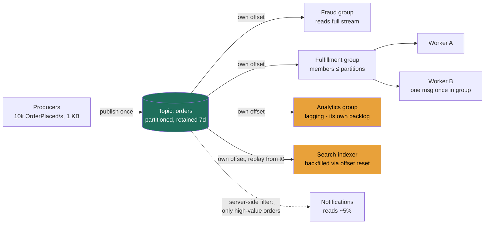

### Learning objectives
- Draw the bright line between a **point-to-point queue** (one message → one consumer, work distribution) and **publish-subscribe** (one message → *every* subscriber, broadcast), and explain why the same distributed log can do both.
- Reason precisely about **topics, subscriptions, and consumer groups**, what gets its own copy of the stream, what shares one, and where the offset lives.
- Carry the delivery and ordering rules forward from Lesson 3.8 (**at-least-once + idempotency**, **ordering per partition/key**) into a fan-out world, and add the two new axes: **push vs pull delivery** and **retention/replay**.
- Make the **Kafka vs Google Pub/Sub vs SNS vs Pulsar** call from requirements, and **quantify fan-out amplification**, the read/compute/egress cost a Director owns when one publish becomes N downstream reads.

### Intuition first
If a point-to-point queue is the kitchen ticket rail from Lesson 3.8, one ticket, one cook, then publish-subscribe is a **magazine subscription**. The publisher prints **one issue** of *The Topic* and drops it at the post office. Every **subscriber** gets **their own copy** in their own mailbox, and each reads it whenever they like, the sports desk reads it Monday, the archive clerk files it Friday, a new subscriber who signs up next year can request the **back issues** (that's replay, if the publisher keeps an archive). The publisher never knows or cares who the readers are or how many there are; it prints once and walks away (**decoupling**, exactly as in 3.8). Adding a tenth subscriber changes **nothing** about the printing, but it does mean the post office now delivers **ten copies instead of nine**, and *that* is the quiet cost this lesson keeps coming back to: broadcasting is cheap to publish and **expensive to deliver at fan-out**.

Two refinements complete the picture, and they map to the next two sections:
- A single subscriber (say, the sports desk) might be a **team of five reporters** who split the issue among themselves so no two read the same article, that's a **consumer group**: one logical subscriber, many workers, the message processed once *within* the group. Pub-sub *across* subscribers, queue-like work-splitting *inside* each one.
- "Do they keep an archive?" is the **retention** question, and it's the deepest difference between the tools below: some brokers are a durable, re-readable **log** (keep every back issue for days), and some are a fire-and-forget **mail drop** (deliver once, keep nothing).

Hold the magazine image, every mechanic below is a feature of it.

### Deep explanation

**Queue vs pub-sub, one message, one consumer *or* every subscriber.** This is the headline, and the cleanest way an interviewer can tell you understand messaging:

- **Point-to-point queue (3.8):** a message is delivered to **exactly one** consumer in the pool. N workers **compete** to drain the queue; each message is worked once. This is **work distribution**, scale throughput by adding competing workers.
- **Publish-subscribe (this lesson):** a message is delivered to **every** subscriber. Five independent subscribers all receive **every** message and process it for their own purpose. This is **broadcast / fan-out**, one event, many independent reactions.

The non-obvious unification, and the thing worth saying out loud at a whiteboard: **a partitioned log like Kafka is *both*, depending on how many consumer groups read the topic.** One topic, **one** consumer group → the group's members split the partitions among themselves → it behaves as a **queue** (competing consumers, message handled once). The **same** topic with **five** consumer groups → each group independently reads the **full** stream, with its **own offset** → it behaves as **pub-sub** (five independent copies of the stream). The message isn't physically duplicated five times in storage; it's read five times, each group tracking its own position. *Pub-sub vs queue is therefore not two systems, it's the number of independent subscriptions reading the same log.* That single sentence is the lesson.

**The alternative rejected, N point-to-point queues, or N synchronous calls.** Synchronous fan-out is rejected because it re-couples the producer to *every* consumer's availability and latency, the "email service is slow, so checkout is slow" failure 3.8 killed, multiplied by N. Writing to N explicit queues is rejected because the **producer must know all N subscribers** and be redeployed every time one is added, the exact coupling pub-sub exists to remove. Pub-sub's value proposition: **subscribers are added and removed with zero producer changes.** Reach for it when **one event must trigger several *independent* reactions** and the set of reactions **changes over time**.

**This is the backbone of event-driven architecture (EDA).** When services communicate by **publishing events** ("OrderPlaced") rather than calling each other, pub-sub *is* the nervous system, and it forces a choice between two coordination styles. **Orchestration**, a central workflow/saga coordinator tells each service what to do, buys end-to-end visibility and one place to reason about retries and compensation, at the cost of a coupling point that must know every step. **Choreography**, services react to events with no central brain, buys loose coupling and the zero-producer-change extensibility above, at the cost that **no single place sees the whole flow**: you pay in observability what you save in coupling. The decision rule: orchestrate complex multi-step transactions that need compensation (a saga that must roll back); choreograph broadcast-style notifications where reactions are genuinely independent, which is what the worked example below does.

**Topics, subscriptions, consumer groups, where the copy and the offset live.** The vocabulary differs across vendors and the differences are exactly what trips candidates up, so pin the concepts first:

- A **topic** is the named stream, the magazine title. Producers publish to it; they never address a subscriber.
- A **subscription** is one independent reader's *claim* on the topic, **with its own delivery position**. Each subscription receives every message published after it was created (and earlier ones, if retained). N subscriptions = N independent copies of the stream = the fan-out factor.
- A **consumer group** is the set of worker processes that **collectively** drain *one* subscription, splitting partitions so each message is handled **once within the group**. It's how a single subscriber scales horizontally without re-reading its own data.

Crucially, **"subscription" is a different kind of object in each system**, and the two-line version is all the room needs: in **Kafka** the subscription is *implicit*, a `group.id` plus a consumer-committed **offset**, which is exactly why **replay is trivial** (reset the offset); in **Google Pub/Sub and Pulsar** it's a **durable broker-side object** (acks/cursor) so the broker drives redelivery, and in **SNS** a "subscription" is just a **push endpoint with no stored stream at all**, which is why SNS cannot replay (more below).

Go deeper, vendor subscription semantics, side by side (IC depth, optional)

| Concept | **Kafka** | **Google Pub/Sub** | **Amazon SNS** | **Apache Pulsar** |
|---|---|---|---|---|
| Topic | Topic (partitioned) | Topic | Topic | Topic (partitioned) |
| Subscription | **Implicit**, a `group.id` + committed **offset** (no first-class object) | **First-class durable object**, independent of subscribers | **An endpoint** (SQS/Lambda/HTTP), no stored stream | **First-class named object** on the topic |
| Per-subscriber work-splitting | **Consumer group** (members ≤ partitions) | Multiple subscriber clients on one subscription (auto load-balanced) | The downstream consumer's own concern (e.g. an SQS queue's workers) | Multiple consumers on one subscription |
| Where the position lives | **Consumer-committed offset** | **Broker-tracked acks** per subscription | **Not tracked**, SNS pushes and forgets | **Broker-tracked cursor** per subscription |

The load-bearing consequence: consumer-owned offsets (Kafka) make replay a client-side operation; broker-owned cursors (Pub/Sub, Pulsar) make redelivery a broker behavior you configure rather than drive.

**Delivery guarantees and ordering, carried forward from 3.8, not re-derived.** Lesson 3.8 established the rules and they hold identically here, so the Director move is to **reference** them, not re-explain:
- **At-least-once is still the default; duplicates still happen; you still make consumers idempotent on a business key for *effectively*-once.** Generic exactly-once *delivery* across an arbitrary network is still impossible. (Google Pub/Sub's opt-in "exactly-once delivery" holds only inside Pub/Sub's boundary, within a region, the instant your handler writes to Postgres or Stripe you're back to needing idempotency, exactly as in 3.8.)
- **Ordering is still per-partition / per-key, never global.** The fan-out twist: each subscriber/group gets the *same* per-partition order **independently**. Partition by `user_id` and every subscriber sees that user's events in order, while different users (and different subscribers) proceed in parallel. **Ordering is off-by-default and opt-in in the cloud services**, Google Pub/Sub orders only messages sharing an **ordering key** (and only within a region), and SNS orders only via a **FIFO topic** + message group. Turning ordering on universally serializes the stream and kills the parallelism, so you scope it to the keys that actually need it.

**Push vs pull delivery, the new axis pub-sub forces you to choose.** The one-line rule: **push for latency, pull for throughput.** **Pull** (Kafka; Pub/Sub pull mode) means the consumer fetches at its own rate, backpressure is free, a slow subscriber just **lags on its own offset** while the backlog sits durably in the log, and a slow analytics consumer never slows a fast fraud consumer. **Push** (SNS; Pub/Sub push mode) delivers to an endpoint as messages arrive, lower latency, no polling, the natural fit for serverless/webhook fan-out (SNS → Lambda), but the broker now owns flow control, so a slow or failing endpoint means retry-with-backoff and a **dead-letter target**, or messages drop after the retry budget.

**Retention and replay, log vs mail-drop, the deepest split.** This is where the four tools genuinely diverge, and it drives the build-vs-buy call:

- **Re-readable log (Kafka, Pulsar):** a consumed message is **not deleted**, it stays for a **retention window** (Kafka default **7 days**, tunable by time or size; Pulsar similar, *plus* **tiered storage** that offloads old segments to S3/GCS for effectively **unbounded, cheap** retention). Consumption is just **advancing an offset/cursor**, so you can **rewind**: replay a topic from an offset/timestamp to **backfill a new subscriber**, **reprocess after a consumer bug**, or **bootstrap event sourcing**. Replay is a first-class operation. This is the property 3.8 flagged as the reason to pick Kafka.
- **Google Pub/Sub:** durable but **subscription-scoped** retention, default **7 days**, max **31 days**, with **seek** (to a timestamp or a **snapshot**) for replay. Re-readable, but bounded to 31 days unless you also archive elsewhere.
- **Amazon SNS:** **no retention, no replay.** SNS is a **push fan-out router**, not a log, once it has attempted delivery to each subscriber, the message is **gone**. This is the single most important fact about SNS and the most common interview error: *SNS alone is fire-and-forget.* The durable AWS pattern is therefore **SNS → multiple SQS queues** ("fan-out"): SNS does the broadcast, and each **SQS queue gives each subscriber its own durable buffer**, backpressure, retries, and DLQ (all from 3.8). If you need a **replayable AWS log** with many consumer groups, the right answer is **Kinesis or MSK (managed Kafka)**, *not* SNS, naming that distinction is strong signal.

**Fan-out amplification, the operational cost a Director must price.** The defining cost of pub-sub: **one publish becomes N downstream reads**, so compute, read bandwidth, and especially **cross-AZ/region egress** multiply with the number of subscribers, invisibly to the producer. The headline number, off 3.8's checkout volume: 10k events/s × 1 KB × 5 consumer groups is a 5× read amplification ≈ **~$1,300/month of cross-AZ egress for *one* topic** (at ~$0.01/GB each way), before storage or compute, and a 6th subscriber adds ~20% with zero producer change or approval; cross-region egress runs 2-9× worse per GB. The lever is **broker-side filtering**: **SNS filter policies** and **Pub/Sub subscription filters** let a subscriber that wants 5% of events avoid paying to read 100%. **Kafka has no server-side filtering**, every group reads the whole partition and filters client-side, so you mitigate with **topic granularity** instead. Choosing the broker partly *is* choosing your amplification-control mechanism.

This is the cost/risk framing the round rewards: "pub-sub decoupled the producer for free, but **every new subscriber is a recurring read+egress cost that no one approves**, so I'd govern subscriptions, push filtering to the broker where I can, and watch per-subscriber lag and egress as first-class SLOs."

### Diagram: one topic, many independent subscriptions (fan-out)

### Worked example: fan-out on the checkout pipeline (continuing 3.8)
Lesson 3.8 ended its checkout example with the tee-up: *if fraud, analytics, and fulfillment all need to read every order, that's pub-sub.* Here it is. The same `OrderPlaced` event must now drive **five independent reactions**, each owned by a different team, and the set will grow.

- **Why pub-sub, not the 3.8 queue:** fraud, fulfillment, analytics, search-indexing, and notifications must *each* see **every** order, independently, at their own pace. Five separate SQS queues would force checkout to know and enqueue to all five (and redeploy for a sixth); synchronous fan-out would chain five teams' latency into checkout. Checkout publishes **one** `OrderPlaced` and returns in ~40 ms; **adding a sixth consumer requires zero checkout changes**, the entire point.
- **Same numbers as 3.8, extended:** steady state **2,000 orders/sec**, Black Friday **8,000/sec** for a minute. Each group is *itself* a 3.8-style competing-consumer pool load-leveling its own backlog off its **own offset**, fulfillment drains in ~4 min, while analytics (sustaining only 500/sec) simply **lags further behind on the same log** without affecting anyone else.
- **Ordering:** per-order events (placed → paid → refunded) must stay ordered, so partition by **`order_id`** (3.8's rule), per-order order for every group, full parallelism across orders.
- **Delivery + idempotency:** **at-least-once**; each consumer is **idempotent on `order_id`**, *effectively-once*, identical to 3.8, except now **five** consumers each need their own idempotency.
- **Retention/replay, the new capability:** three weeks later a new "loyalty-points" subscriber launches and **replays the last 7 days from an offset** to backfill, impossible with a fire-and-forget router. When the search-indexer ships a bug, you **reset its offset** and reprocess *only that group*.
- **Amplification, priced:** five groups is the **5× read+egress** cost above (~$1.3k/month/topic cross-AZ); notifications only wants high-value orders, so it gets a **broker-side filter** rather than reading 100% and discarding 95%.
- **Tech choice:** AWS + zero-ops appetite → **SNS → 5 SQS queues** (broadcast + per-team durable buffer/DLQ + filter policies). Multi-day replay, event sourcing, very high throughput across many groups → **Kafka/MSK**, at the cost of running a cluster. The decision is **replay depth + ops appetite + throughput**, not fashion.

### Trade-offs table: Kafka vs Google Pub/Sub vs SNS vs Pulsar
| Dimension | **Kafka** | **Google Pub/Sub** | **Amazon SNS** | **Apache Pulsar** |
|---|---|---|---|---|
| Model | Distributed **log** (partitioned, replayable) | Managed global **log** (serverless) | Managed **push fan-out router** (no log) | **Log + queue**, compute/storage split (BookKeeper) |
| Delivery | **Pull**; at-least-once; EOS within Kafka | **Push *or* pull**; at-least-once; **opt-in exactly-once delivery** (in-boundary) | **Push only** (SQS/Lambda/HTTP); at-least-once | Broker-pushed with consumer backpressure; at-least-once |
| Ordering | Per partition | **Per ordering key** (opt-in, per region) | Best-effort; **FIFO topic** for order (~300/s per group) | Per partition |
| Retention / replay | **7d default, tunable; replay via offset** | **7d default, 31d max; replay via seek/snapshot** | **None, no replay** | **Tunable + tiered storage to S3/GCS ≈ unbounded** |
| Multi-subscriber | **Consumer groups** (≤ partitions each) | Multiple **durable subscriptions** per topic | **Subscriptions = endpoints**; durable only via SQS | Multiple **named broker-side subscriptions** |
| Server-side filtering | **None** (filter client-side) | **Yes** (subscription filters) | **Yes** (filter policies) | **Yes** (EntryFilter plugin) |
| Ops cost | High (run/scale cluster) | **~Zero** (fully managed, no provisioning) | **~Zero** (fully managed) | High (run brokers **and** BookKeeper) |
| Use when… | High-throughput **replayable** streams, **many consumer groups**, event sourcing | GCP-native, **zero-ops** global fan-out with bounded replay + filtering | **AWS-native push fan-out** (notifications, SNS→SQS), serverless triggers | **Unbounded retention + queue *and* stream semantics** in one system, geo-replication |

### What interviewers probe here
- **"What's the difference between a queue and pub-sub, and can one system do both?"**, *Strong:* queue = one message to **one** competing consumer; pub-sub = one message to **every** subscriber; **a partitioned log is a queue with one consumer group and pub-sub with many**, the difference is the number of independent offsets. *Red flag:* "Kafka is a queue" with no notion of fan-out vs work-splitting.
- **"You need to add a new consumer of an existing event stream a year from now, what does that cost?"**, *Strong:* on a **retained log**, zero producer change + an **offset reset to backfill**; the recurring cost is **read+egress amplification**, which I'd govern and price. *Red flag:* assumes adding a subscriber is free, or doesn't know a backfill needs retention.
- **"SNS or Kafka for this fan-out?"**, *Strong:* frames it as **replay + throughput + ops**: SNS has no replay and is push-only, great for AWS-native notifications and **SNS→SQS** durable fan-out; a multi-day replayable log with many groups wants **Kafka/MSK or Kinesis**. *Red flag:* treating SNS as a durable log.
- **"How do you keep one slow subscriber from affecting the others?"**, *Strong:* **per-subscription offsets/cursors** on a pull log, the slow consumer just **lags**; autoscale it on lag; nothing upstream or sideways breaks. *Red flag:* a design where one slow consumer back-pressures the producer or stalls peers.
- **"Push or pull, and why?"**, *Strong:* **push for latency, pull for throughput**, pull for high-volume stream consumers (free backpressure), push for serverless/webhook fan-out where the broker owns retries + a DLQ. *Red flag:* a blanket "push is better/worse" with no backpressure reasoning.
- **"What's the operational cost of fan-out at scale?"**, *Strong:* **amplification**, N× read/compute/egress off a 1× write, dominated by cross-AZ/region egress; mitigate with **server-side filtering** (SNS/Pub/Sub) or **topic granularity** (Kafka), and watch per-subscriber lag + egress as SLOs. *Red flag:* unaware that broadcast multiplies downstream cost.

### Common mistakes / misconceptions
- **Treating SNS as a replayable log.** SNS is **push, no retention, no replay**, it broadcasts and forgets. Durable fan-out is **SNS→SQS**; replayable AWS logs are **Kinesis/MSK**. This is the single most common pub-sub error.
- **"Kafka is a message queue."** Kafka is a **log**; it *acts* as a queue with one consumer group and as pub-sub with many. Calling it just a queue hides the entire fan-out/replay story.
- **Forgetting fan-out amplification.** One publish → N reads → N× egress and compute; a "free" new subscriber is a recurring, unapproved cost.
- **Assuming ordering is on and global.** It's **per key and opt-in** (Pub/Sub ordering keys, SNS FIFO); global ordering serializes the stream and kills parallelism. And delivery/ordering rules are *unchanged from 3.8*, don't spend the whiteboard re-deriving exactly-once.
- **Confusing a consumer group with a subscription.** Many **groups** = fan-out (each gets the full stream); many **members in one group** = work-splitting (message handled once), mixing these up inverts the design. Related: choosing push without per-subscriber isolation lets one slow consumer affect its peers.

### Practice questions
**Q1.** A teammate says "let's use SNS so we can replay the order stream for a new analytics consumer next quarter." What do you correct, and what do you propose?
> *Model:* SNS **can't replay**, it's a push fan-out router with **no retention**; once it has delivered to current subscribers the message is gone, so there's nothing to replay for a future consumer. Two fixes: (1) if we just need **durable buffering today**, **SNS→SQS** gives each subscriber its own queue with retries/DLQ, but SQS still tops out at **14 days** and isn't a true replay log. (2) If the requirement is genuinely **"backfill a brand-new consumer from history,"** we need a **retained log**, **Kafka/MSK** (default 7d, tunable, replay by offset) or **Kinesis**, or **Google Pub/Sub** (7d default / 31d max via seek/snapshot) if bounded replay suffices. The choice is **how far back** we must replay and our **ops appetite**.

**Q2.** Explain how the *same* Kafka topic can behave as a queue for one team and as pub-sub for the company. What's the mechanism?
> *Model:* It's the number of **consumer groups**. One topic read by **one** consumer group → the group's members **split the partitions** and **compete** to drain it → each message handled **once** → that's a **queue** (work distribution, bounded by partition count as in 3.8). The **same** topic read by **multiple** consumer groups → each group keeps its **own committed offset** and **independently reads the full stream** → each gets every message → that's **pub-sub** (fan-out). The data isn't copied per group; it's read multiple times, each group tracking its own position. So "queue vs pub-sub" reduces to **how many independent offsets read the log.**

**Q3.** Your event topic has 5 consumer groups today and product wants to add 4 more. Walk me through the cost and how you'd manage it.
> *Model:* Fan-out is **read+egress amplification**: 9 groups means **9×** the publish bandwidth in downstream reads off the **same 1× write**, with the producer entirely unaffected, at this topic's volume that's roughly doubling today's ~$1.3k/month cross-AZ egress line, and cross-region/internet egress runs 2-9× worse. Management levers: **server-side filtering** (Pub/Sub/SNS filters, or narrower Kafka topics) so a group that wants 10% of events doesn't read 100%; **co-locate** heavy consumers in the producer's AZ/region; and treat **per-subscriber lag and egress as SLOs** with a lightweight subscription-governance step, because each new subscriber is a recurring cost nobody explicitly approves.

**Q4.** When is push delivery the right call, and when does it bite you?
> *Model:* The rule: **push for latency, pull for throughput.** **Push** wins for low-latency serverless/webhook fan-out, **SNS→Lambda** or an HTTP endpoint where you want delivery as events arrive without polling. It bites when the consumer is **slow or flaky**: the broker owns flow control, falls back to retry-with-backoff, and you **must** configure a **dead-letter** target or messages drop after the retry budget, unbounded push at a slow endpoint is the flooding problem from 3.8. **Pull** (Kafka, Pub/Sub pull) is better for high-throughput stream consumers: they fetch at their own rate, **lag** under load with free backpressure, and stay isolated from peers.

**Q5.** Same-key ordering matters but you have 9 subscribers and need throughput. How do you design it, and what stays unchanged from the queue lesson (3.8)?
> *Model:* **Partition by the ordering key** (e.g. `user_id`/`order_id`) so same-key events land on one partition and are delivered **in order**; different keys spread across partitions for parallelism, **ordering per key, parallelism across keys**, *unchanged from 3.8*. The **fan-out twist:** each of the 9 subscribers gets that **same per-partition order independently**, off its **own offset**, so they don't interfere. Within any one subscriber, members of its **consumer group ≤ partitions** (the 3.8 ceiling still applies *per group*). Also unchanged: **at-least-once + idempotency per consumer** for effectively-once. New from this lesson: ordering is **opt-in** (Pub/Sub ordering keys / SNS FIFO), I scope it only to keys that need it, and I price the **9× amplification**.

### Key takeaways
- **Queue = one message to one competing consumer (work distribution); pub-sub = one message to every subscriber (broadcast).** A partitioned log is a **queue with one consumer group and pub-sub with many**, the difference is the number of independent subscriptions/offsets reading the same log.
- **Delivery and ordering are unchanged from 3.8:** at-least-once + **idempotency** for effectively-once, and **ordering per partition/key** (opt-in in the cloud services). The genuinely new axes are **push/pull**, **retention/replay**, and **amplification**.
- **Retention/replay is the deepest split:** Kafka/Pulsar are **re-readable logs** (replay by offset; Pulsar adds tiered storage ≈ unbounded), Pub/Sub retains **7d/31d max** (seek/snapshot), and **SNS has no replay at all**, durable AWS fan-out is **SNS→SQS**, replayable logs are **Kinesis/MSK**.
- **Fan-out amplification is the Director cost:** one publish → **N× read/compute/egress** (cross-AZ ~$0.01/GB each way; cross-region 2-9× worse), growing with **subscribers** invisibly to the producer, govern subscriptions, push **server-side filtering** where available (none in Kafka → use topic granularity), and watch per-subscriber lag + egress as SLOs.
- **Pick on replay + throughput + ops + filtering:** Kafka for replayable high-throughput multi-group streams (high ops), **Google Pub/Sub** for zero-ops global fan-out with bounded replay, **SNS** for AWS-native push/notifications (no replay), **Pulsar** for unbounded retention plus queue-and-stream semantics in one system.

> **Spaced-repetition recap:** Magazine subscription, publish one issue, every subscriber gets their own copy and reads at their own pace; a team sharing one copy = a consumer group (queue-like splitting *inside* a subscriber, pub-sub *across* them). Same log = queue with one group, pub-sub with many. Delivery/ordering carry over from 3.8 (at-least-once + idempotent, order per key). New axes: push (SNS, low-latency, broker owns retries) vs pull (Kafka, free backpressure, per-consumer offset); retention/replay (Kafka/Pulsar log; Pub/Sub 7d/31d; SNS none → SNS→SQS); and **fan-out amplification**, one publish, N× read+egress, the cost no one approves.
