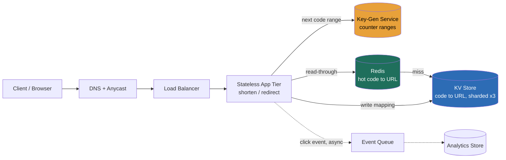

> This is the **method lesson**. Earlier lessons built the vocabulary (estimation, storage engines, replication, sharding, caching, sequencers, DNS, load balancers). This lesson is where we run the whole **RESHADED** spine, **R**equirements, **E**stimation, **S**torage, **H**igh-level design, **A**PI, **D**ata model, **E**valuation, **D**esign evolution, once, slowly, on a deliberately *easy* problem so the **sequence becomes muscle memory**. TinyURL is the canonical warm-up precisely because the business logic is trivial; all the signal is in *how you run the steps, quantify the calls, and name the trade-offs.* At each step I add one sentence on **what the step is for** and **how to approach it in general**, then apply it here.

### Learning objectives
- Run all **eight RESHADED steps in order**, naming each, and feel where the interview signal actually lives (the back-end E and D steps, not the boxes).
- Derive the design from **numbers**: turn "read-heavy URL shortener" into QPS, storage, bandwidth, and a cache working set, and let those numbers *make* the decisions.
- Defend the pivotal call, **short-code generation**, against its two rejected alternatives, and explain why a counter-based **key-generation service** beats hash-and-check.
- Practise the **Director moves**: tie every decision to a requirement, name the cost/operational dimension, stress your own design for hot keys and single points of failure, and say where you'd delegate a deep-dive.

### Intuition first
A URL shortener is, at its core, **a giant dictionary**: you hand it a long, unwieldy phrase (`https://example.com/very/long/path?utm=…`) and it hands back a short nickname (`bit.ly/3xR9aQ`); later, anyone who says the nickname gets the original phrase back. That's it, **one writer puts a word in the dictionary, a crowd of readers looks words up.** The crowd is enormous relative to the writers: a marketing link is created **once** and clicked **millions** of times, so the system is overwhelmingly a *lookup* engine, read-skewed on the order of **100:1**. Two questions carry the whole problem. First, **how do you mint a short, unique nickname** fast, without two writers ever picking the same one and without asking the database "is this taken?" on every write? Second, **how do you serve the lookup-and-redirect blisteringly fast and cheaply** when it's 99% of your traffic? Everything else, custom aliases, expiry, click analytics, is garnish on those two. Hold that picture: a write-once, read-a-million dictionary whose only hard parts are *naming* and *fast lookup at scale*.

---

## R: Requirements

> **What the step is for:** pin down *what you're building and for whom* before you build anything, and explicitly **cut scope** to a defensible core so you don't drown in features. **How to approach it generally:** separate **functional** (what it does) from **non-functional** (how well, latency, availability, durability, scale), ask 2-3 sharp clarifying questions, then state the read:write skew and scale assumptions out loud because *those two numbers drive every later step.*

**Clarifying questions I'd actually ask the interviewer** (and the answers I'll assume so we can proceed):
- *Public service like Bitly, or an internal link-shortener?* → Assume **public, internet-scale**.
- *Expected new-URL volume and lifetime?* → Assume **~100M new URLs/month**, links live **~5 years** by default.
- *Read:write ratio?* → Assume **~100:1** (the defining characteristic; if they push back, the whole estimation flexes off this number).
- *Do we need custom aliases, expiry, analytics?* → Treat as **stretch**, explicitly out of the v1 core.
- *Latency target on redirect?* → Assume **p99 < ~100 ms** end-to-end; a redirect that feels slow is a broken product.

**Functional requirements (the defensible core):**
1. **Shorten:** given a long URL, return a unique short URL.
2. **Redirect:** given a short URL, return the original long URL (an HTTP redirect).

**Stretch (named, then parked, a Director scopes ruthlessly):**
3. **Custom alias** (`bit.ly/my-brand`). 4. **Expiry / TTL** on a link. 5. **Click analytics** (counts, geo, referrer).

**Non-functional requirements (this is where the design pressure comes from):**
- **High availability**, redirect is in the critical path of *someone else's* product; aim for **~99.99%** on reads (~52 min/yr down). A failed redirect is a dead link in an email blast.
- **Low latency**, **p99 < ~100 ms** on redirect; this forces caching and pushes us toward an in-memory hot path.
- **Read-scaled**, **~100:1 read:write**; the architecture must make *reads* cheap, not writes.
- **Durability / no-collision**, a short code, once issued, must map to exactly one URL forever; **two URLs must never collide on a code** (a correctness invariant, not a nice-to-have).
- **Scale**, billions of stored mappings over the link lifetime; codes must not run out.

**The scope cut, stated explicitly:** v1 is *shorten + redirect*. Analytics and custom aliases are bolt-ons I'll show *where* to attach in the D steps but won't let bloat the core. **Naming the cut is itself the signal**, it says I scope before I build.

## E: Estimation

> **What the step is for:** to reason about size *in numbers* so the design is "enough math to make a defensible call," never "it scales." **How to approach it generally:** compute **QPS (read and write), storage (with growth), bandwidth, cache working set, and a rough server count**, round aggressively, state every assumption, and carry the read:write skew through.

**Assumptions (stated, then used):** 100M new URLs/month; 100:1 read:write; ~500 bytes stored per mapping (7-byte code + ~100-byte avg URL + timestamps + owner + metadata, rounded *up* for safety); 5-year retention; peak ≈ 2× average.

**Write QPS.**
`100M / month ÷ (30 × 24 × 3600 s) ≈ 100M / 2.6M s ≈ 40 writes/s` average → **~40 writes/s**, **~80-100/s peak.** This is *tiny*. The writes are a rounding error; **do not over-engineer the write path.**

**Read QPS.**
`40 writes/s × 100 = 4,000 reads/s` average → **~4k reads/s**, **~8-10k/s peak.** Still modest by web-scale standards, but it's **100× the writes**, which is the entire architectural point: optimise the read path, leave writes simple.

**Storage (with growth).**
`100M/month × 12 × 5 yr = 6B mappings` over the retention window. At ~500 bytes each: `6B × 500 B = 3 TB` of raw data. With **3× replication** for durability/availability: **~9 TB.** That's small enough to **shard across a handful of nodes**, not a special-systems problem, a useful early signal that this is a *modest-storage, high-read* system.

**Bandwidth.**
Redirect responses are tiny (HTTP 301/302 + a `Location` header, ~500 bytes). `4k reads/s × 500 B ≈ 2 MB/s` egress average, ~4 MB/s peak, **negligible**; bandwidth is not a constraint here (contrast a video service, where it's *the* constraint).

**Cache working set.**
Daily reads ≈ `4k × 86,400 ≈ 350M reads/day`. Link popularity is **heavily skewed** (a few viral links dominate; classic ~80/20). Cache the hot set, say **~100M hot entries at ~512 B = ~50 GB.** That fits in **one or two commodity 64 GB cache nodes** with room to spare. The headline: **the hot working set fits in RAM cheaply**, which is why caching, not sharding, is the lever that makes this design fly.

**Code-space sanity check (will we run out of nicknames?).**
With **base62** (`a-z A-Z 0-9`) and **7 characters**: `62^7 ≈ 3.5 trillion` codes. Against 6B mappings in 5 years that's **~590× headroom**; at 100M/month we'd take **~3,000 years** to exhaust 7 characters. So **7 base62 chars is the right code length**, short enough to be tidy, long enough to never run out. (6 chars = 56B, still ~9× our 5-year need but tighter; 8 chars = 218T, needless.)

**Server count (order-of-magnitude).**
Redirect is a cache-lookup-and-respond, cheap. At ~2k req/s per modest app node, **~10k peak reads ⇒ ~5-6 nodes**, doubled for HA/headroom ⇒ **~10-12 stateless app nodes** behind a load balancer. Writes need almost nothing. **Round numbers, defensible call.**

**What the estimation *decided* for us:** writes are trivial (don't coordinate per-write if avoidable); reads are 100× and latency-bound (cache + read replicas); storage is ~9 TB (shard lightly, nothing exotic); the hot set fits in RAM (caching is the highest-leverage move). The numbers, not taste, drove every one of those.

## S: Storage

> **What the step is for:** decide **what must persist** and pick the **store type(s)** that match the data shape and access pattern, then name real systems. **How to approach it generally:** describe the access pattern first (here: *point lookup by key*), then choose the simplest store that serves it, and reject the alternatives on the access pattern, not on fashion.

**What must persist:** the **code → long-URL mapping** (the source of truth), plus per-link metadata for the stretch features (owner, `created_at`, `expires_at`, click count). That's the durable state. The cache and the analytics pipeline are *derived* and can be rebuilt.

**The access pattern is the whole argument.** The dominant operation, 99% of traffic, is *"given this short code, give me the long URL."* That is a **single-key point lookup**: no joins, no range scans, no multi-row transactions, no ad-hoc queries. The data is a **flat dictionary keyed by a short string.** When the access pattern is "get the value for this key, billions of times, fast," the answer is a **key-value store.**

**Decision: a horizontally-scalable key-value store**, **DynamoDB** or **Cassandra** (a managed KV/wide-column store). Justification against the data + access pattern: O(1)-ish keyed reads, trivially sharded by the code as partition key, and an **LSM-tree engine** whose write path is cheap, though writes are tiny here so that's a bonus, not the driver. These stores give us the read scale and the horizontal partitioning the estimation said we'd eventually need, with no relational machinery we won't use.

**Rejected alternative, a relational database (Postgres/MySQL):** *why considered*, it works, the schema is one table, and at 40 writes/s + a read-replica fan-out it would genuinely cope for a long time. *Why rejected as the primary store*, we get **zero value from its strengths** (joins, transactions, rich secondary indexes, ad-hoc SQL) and pay for them in **harder horizontal scaling**: past one node you're hand-rolling sharding and managing leader-follower failover, whereas a KV store shards by key natively. We're paying for a Swiss-army knife to do one cut. *Caveat I'd state:* for an internal tool at thousands-not-billions scale, **Postgres + read replicas is the right boring choice**, the relational store is only "wrong" at this scale and access shape.

**Rejected alternative, a graph or document database:** there are no relationships to traverse and no nested-document needs; a flat key→value pair is the entire model. Reaching for either is **solving a problem we don't have.**

**Cache layer (named here, justified in H/E):** a distributed in-memory cache, **Redis** or **Memcached**, fronts the KV store to serve the hot set from RAM, because the estimation showed a ~50 GB working set that comfortably fits in memory and a 100:1 read skew that *demands* it.

## H: High-level design

> **What the step is for:** show the **components and the happy path** so the interviewer can see you *think in boxes and flows*, not implementation detail. **How to approach it generally:** draw the request entering, the layers it traverses (LB → app → cache → store), and the two flows (write and read), keep labels minimal; the diagram is a map, not a blueprint.



**Happy-path, write (shorten), the rare flow (~40/s):** the client `POST`s a long URL → load balancer → an app node. The app node takes the **next short code from its pre-allocated counter range** served by the **Key-Generation Service** (the KGS hands out *blocks* of counter values; see the A/D steps and the ticket-server idea, this is how we avoid per-write coordination *and* collision checks), base62-encodes it, **writes `code → long_url` to the KV store**, optionally warms the cache, and returns the short URL. **No "is this code taken?" read**, the counter guarantees uniqueness by construction.

**Happy-path, read (redirect), the hot flow (~4k/s):** the client `GET`s `bit.ly/{code}` → load balancer → app node → **check Redis first**. **Cache hit (the ~90%+ case):** return the long URL immediately as an HTTP redirect, sub-millisecond, never touches the database. **Cache miss:** read the KV store by `code`, populate the cache (read-through), return the redirect. A **click event is emitted asynchronously** to a queue so analytics never sits on the redirect's critical path. The redirect itself is an HTTP **301 or 302**, which one is a real trade-off, dissected in Evaluation.

**The shape to notice:** stateless app tier (scale by adding nodes), cache in front of store (absorb the 100:1 skew), code generation off the write path, analytics off the read path. Every box exists because a *number* from the E step put it there.

## A: API design

> **What the step is for:** define the **interface contract**, the endpoints, their inputs/outputs, and the status codes that carry the semantics. **How to approach it generally:** keep it to the two or three calls the functional requirements demand, use REST verbs that match the action, and be explicit about the **status code**, because for a redirect service the status code *is* the product.

**Create a short URL.**
```
POST /api/v1/urls
Body:  { "long_url": "https://…", "custom_alias": "my-brand"?, "expires_at": <ts>? }
→ 201 Created
Body:  { "short_url": "https://bit.ly/3xR9aQ", "code": "3xR9aQ" }
Errors: 400 (malformed URL), 409 (custom_alias already taken), 429 (rate-limited)
```

**Redirect (the hot endpoint).**
```
GET /{code}
→ 301 Moved Permanently   (or 302 Found — see Evaluation)
   Location: https://example.com/original/long/url
→ 404 Not Found           (unknown or expired code)
```

**Stretch, analytics read.**
```
GET /api/v1/urls/{code}/stats
→ 200 OK  { "code": "3xR9aQ", "clicks": 184522, "by_day": […], "top_referrers": […] }
```

**API-design calls worth voicing:** (1) the redirect is a **bare `GET /{code}`** at the domain root, not `/api/...`, because real clients (email, browsers) hit the short link directly, the path *is* the code. (2) **Idempotency:** if `POST /urls` is retried (client timeout), do we mint a second code for the same URL? Decision: **dedup is a stretch, not a default**, by default identical long URLs get *distinct* codes (counter-based generation makes this the natural, cheap behaviour); offer an *opt-in* "reuse existing" only if a requirement demands it, because forced dedup means a **read-before-write on every create** (the very cost we're avoiding, see S). (3) **Rate-limit `POST`** hard (it's the abuse surface; see Evaluation), `GET` lightly.

## D: Data model

> **What the step is for:** nail the **schema, the keys, the indexes, and, critically, the partition/shard key**, i.e. *where each row physically lives.* **How to approach it generally:** define the primary key from the dominant access pattern, then choose the **shard key** so the hot operation hits a *single partition*, and call out any secondary access that needs its own table or index.

**Primary table, the mapping (in the KV store):**

| Field | Type | Notes |
|---|---|---|
| `code` | string (7 chars) | **partition key**, every lookup is `WHERE code = ?` |
| `long_url` | string | the destination |
| `created_at` | timestamp | for TTL / housekeeping |
| `expires_at` | timestamp (nullable) | stretch: expiry |
| `owner_id` | string (nullable) | stretch: who created it |

**Partition / shard key = `code`.** This is the load-bearing decision. Because the hot operation is *"get the row for this exact code,"* keying the partition on `code` (hashed) means **every redirect resolves to a single partition on a single node**, no scatter-gather, no cross-shard fan-out. With `62^7` codes hashed across N shards, load spreads evenly *by construction* (a hash of a near-random-looking code is uniform), so **no natural hot partition** for storage, the only hotness is *per-key read* hotness (a viral link), which the **cache**, not the shard layout, absorbs.

**Rejected sharding alternative, shard by `created_at` (time-range):** *why considered*, it makes "expire old links" a cheap range-drop. *Why rejected*, it creates a brutal **hot shard**: all *new* writes hit the newest time-bucket, and recently-created links are also the most-read, so one shard takes the write *and* read heat (the classic time-key hot-spot). Hash-on-`code` spreads both. We handle expiry with a **TTL attribute** (DynamoDB TTL / Cassandra TTL auto-evicts) instead, trading cheap range-deletes for even load, the right trade when reads dominate.

**Secondary access patterns and where their data lives:**
- **Custom alias** (`my-brand`): same table, the alias *is* the `code`, but now uniqueness isn't free (the counter doesn't own custom strings), so a custom alias **does** require a conditional write / existence check (`409` on conflict). That read-before-write is acceptable because custom aliases are **rare and user-initiated**, not the 40/s firehose.
- **Analytics:** a **separate store**, never the primary table. Click events stream to a queue → an analytics store (a columnar/time-series store, or pre-aggregated counters, sharded counters for the raw click count to avoid a single hot row). Keeping analytics out of the mapping table is what keeps the redirect path clean.

## E: Evaluation

> **What the step is for:** turn on yourself, **re-check the design against the non-functional requirements and hunt the bottlenecks** (hot keys, single points of failure, tail latency, write amplification), then **fix each fix naming the trade-off it makes.** **How to approach it generally:** walk the NFR list, ask "what breaks first as load grows or a component dies?", and for every fix say what you're *giving up*. This step (with D-evolution) is where Director signal concentrates.

**Re-check vs the NFRs:** latency (p99 < 100 ms), met on cache hits (sub-ms), at risk on misses and on a cold cache; availability (99.99% reads), at risk wherever a *single* component sits in the path; durability/no-collision, met by counter-based codes + replicated KV. Now the bottlenecks:

**Bottleneck 1, hot key (a viral link).** One link in a Super Bowl ad gets millions of clicks/min, a single `code` far hotter than any other. *Fix:* it's a **cache** problem, and the cache already absorbs it, a hot key lives in Redis and is served from RAM; we additionally **replicate hot keys across cache nodes** (or front with a small local in-process cache on app nodes) to spread a single key's read load. *Trade-off:* local caches add **staleness** on updates, fine here, because a code→URL mapping is **effectively immutable** (you rarely repoint a short link), so caching it hard is nearly free of consistency cost. *This immutability is the property that makes the whole read path cheap, name it.*

**Bottleneck 2, the Key-Generation Service as a single point of failure.** If every write must phone one counter, that counter's death **stops all creation** (exactly the SPOF + ~10k/s ceiling we flagged for DB auto-increment). *Fix:* the KGS hands out **pre-allocated ranges** (e.g., a block of 1,000 counter values) to each app node; nodes mint locally from their block and only refetch every 1,000th create. Run the KGS itself as a **replicated, range-partitioned** service (or replace it with **Snowflake-style** generation, timestamp+machine+sequence, for *zero* coordination). *Trade-off:* pre-allocated ranges mean **codes aren't strictly sequential and some are wasted** on a node crash (an unused block is lost), a trivial price given `62^7` headroom, bought in exchange for removing per-write coordination *and* the SPOF.

**Bottleneck 3, single points of failure generally.** Stateless app tier behind a load balancer → **N+ nodes, lose one freely.** KV store → **3× replication** across AZs; reads stay available through a node loss. Cache → **clustered/replicated Redis**; on total cache loss the KV store still answers, just hotter (a **thundering-herd** risk on cold start). *Fix for the herd:* **request coalescing / single-flight** on misses (one miss per key fills the cache; concurrent requests for the same key wait) plus gradual cache warm-up. *Trade-off:* coalescing adds a hair of latency on the *first* miss to save the store from a stampede.

**Bottleneck 4, tail latency on cache misses.** A miss costs a KV round-trip (~5-10 ms), fine at p99 *if* the hit rate is high. *Fix:* size the cache for the working set (the E step already showed ~50 GB fits), use **read-through with a sane TTL**, and accept that a tiny fraction of reads pay the store latency. *Trade-off:* a bigger cache costs RAM/money, a **cost-vs-tail-latency** dial a Director sets deliberately, not maximally.

**Bottleneck 5, abuse / open-redirect, the security NFR people forget.** A shortener is an **open redirect**, spammers love it (mask phishing behind your trusted domain) and bots can hammer `POST` to mint millions of codes. *Fixes:* **rate-limit creation** per user/IP (token bucket, e.g., *N* creates/min/account); **scan submitted URLs** against a safe-browsing/malware blocklist on create; **require auth** for high-volume creators; optionally **strip codes** flagged as malicious. *Trade-off:* URL scanning adds **latency and a third-party dependency on the create path**, acceptable because creates are rare (40/s) and the abuse cost (your domain blocklisted everywhere) is existential.

**The 301-vs-302 trade-off (the redirect decision, and a favourite probe).** **301 Moved Permanently** lets the *browser cache the mapping*, repeat visits skip your server entirely, slashing read load and latency. **302 Found** is non-cached, *every* click comes back to your server. The tension: **301 is cheaper and faster but blinds your analytics** (cached repeat-clicks never reach you) and makes a link **hard to repoint or revoke** (clients cached the old target). **302 costs you the full read load but preserves per-click analytics and lets you change/expire/disable a link at any time.** *The Director call:* if analytics or revocation is a product requirement → **302** (and make sure the cache/read tier is sized for the full click volume the E step computed); if raw scale/cost is king and links are fire-and-forget → **301.** **Bitly uses 301-style caching selectively but leans on tracking redirects** because click data is the business. *Name which you pick and why*, picking one silently is the red flag.

## D: Design evolution

> **What the step is for:** show you **think past v1**, how the design holds at 10× or under new constraints, which trade-offs were the hard ones, what you'd revisit, and **where you'd delegate a deep-dive.** **How to approach it generally:** push each dimension up an order of magnitude, find what breaks first, and be explicit about the calls you'd hand to a specialist team (the Director move, depth where the decision turns on it, credible delegation elsewhere).

**At 10× reads (≈40k-100k QPS):** the cache hit-rate is doing the heavy lifting, so 10× the reads is mostly **more cache nodes + more stateless app nodes**, both scale horizontally, neither is a redesign. The real work shifts to **geography**: at global scale, redirect latency is dominated by the *network*, so push the read path to the **edge**, replicate the hot mapping into a **CDN / edge KV** (Cloudflare Workers KV, a CDN with compute) so a redirect resolves in the user's region without crossing an ocean. *Trade-off:* edge replication adds **propagation lag** when a mapping changes, acceptable given near-immutable mappings, exactly the property Evaluation leaned on.

**At 10× writes (≈400/s) or 10× retention:** still small, but the **code space and KGS** want a second look, confirm code length against the new exhaustion horizon, and confirm the KGS range-allocation keeps coordination off the write path. **Multi-region writes** raise the only genuinely hard distributed question here: if two regions mint codes independently, **how do you keep codes globally unique without coordinating per write?** *Answer to have ready:* **partition the code space by region** (region A draws from one counter range, region B from another) or use **Snowflake-style machine-ID bits** so region identity is baked into the ID, uniqueness with zero cross-region chatter. *This is the trade-off I'd flag as hardest:* global uniqueness vs. no cross-region coordination, resolved by partitioning the namespace.

**The hardest trade-offs, named:** (1) **301 vs 302**, cost/latency vs. analytics/revocation; the answer is a *product* decision, not a technical one, which is why I'd surface it to stakeholders rather than decide it in a vacuum. (2) **dedup or not**, read-before-write on every create vs. wasted code space; default to no-dedup because writes-cheap is the design's spine. (3) **strong vs. eventual** on the mapping, we chose **eventual** (cache + async replication) because mappings are immutable and a stale read is harmless; if a requirement demanded instant revocation, that assumption breaks and I'd revisit it.

**What I'd revisit first if requirements changed:** if **analytics becomes the product** (Bitly's actual business), the click pipeline graduates from a footnote to a first-class system, a streaming pipeline (Kafka → stream processor → columnar store), pre-aggregated **sharded counters** to avoid a hot count row, and very likely a forced move to **302** to capture every click. That's a whole design of its own.

**Where I'd delegate (the explicit Director move):** I'd own the *architecture and the trade-off calls* above, and **delegate the deep-dives**: "I'd have the **storage team** benchmark **DynamoDB vs. a self-managed Cassandra ring** on our read mix and on-call cost, my prior is managed DynamoDB to cut operational load, but it's a cost/ops call worth real numbers." "I'd have the **abuse/security team** own URL-scanning vendor selection and the rate-limit policy, my prior is token-bucket per account plus a safe-browsing feed." "I'd have the **analytics team** decide pre-aggregation vs. raw-event retention against query needs and cost." Naming *what* I keep (the spine) and *what* I hand off, *with a stated prior*, is the altitude, not personally tuning the Cassandra compaction strategy at the whiteboard.

---

### Trade-offs table: the pivotal decisions

| Decision | A | B | C | Use when… |
|---|---|---|---|---|
| **Short-code generation** | **Counter + base62 via KGS** (no collision check; ranges pre-allocated) | **Hash(URL) + truncate + collision-check** (dedup-friendly) | **Random base62 + collision-check** | **A** when writes must stay cheap & codes short (our case); **B** when you *want* identical-URL dedup and can pay a read-before-write; **C** rarely, collision-check cost without B's dedup upside |
| **Primary store** | **KV / wide-column** (DynamoDB, Cassandra) | **Relational** (Postgres + read replicas) | **Document/graph DB** | **A** at billions-scale point-lookups (our case); **B** at thousands-scale or when you need transactions/SQL; **C** essentially never, no relationships or nesting exist |
| **Redirect status code** | **301 Moved Permanently** (browser-cached) | **302 Found** (always hits server) |, | **301** when scale/cost dominates and links are fire-and-forget; **302** when analytics or revocation/repointing is a requirement (Bitly-style) |

### What interviewers probe here (Director altitude)

- **"Why a counter-based KGS over hashing the URL?"**, *Strong:* counter guarantees uniqueness *by construction* with **no read-before-write**, keeping the create path cheap; ranges remove the SPOF/throughput ceiling; hashing forces a collision-check read on every write and collision rate grows. *Red flag:* "hash it with MD5" with no mention of the collision-check read or the birthday problem.
- **"301 or 302, pick one and defend it."**, *Strong:* names the **analytics/revocation vs. cost/latency** trade explicitly and ties the choice to a requirement. *Red flag:* picks one with no awareness that 301 caching blinds analytics and freezes the target.
- **"Where's the bottleneck, and is anything a single point of failure?"**, *Strong:* identifies the **KGS** and the **cache**, fixes the KGS with ranges/replication and the hot key with cache replication, *naming the trade-off each fix makes.* *Red flag:* declares it "stateless so it scales" and finds no SPOF.
- **"What does this cost to run, and what would you delegate?"**, *Strong:* ~9 TB replicated storage + ~50 GB cache + ~10 app nodes is **cheap**; delegates the DynamoDB-vs-Cassandra benchmark and the abuse policy *with a stated prior.* *Red flag:* no cost instinct, or insists on personally tuning the store.
- **"How does it behave globally / at 10×?"**, *Strong:* push reads to the **edge/CDN** (mappings are near-immutable), partition the **code namespace by region** for write uniqueness without coordination. *Red flag:* "add more servers" with no edge or namespace reasoning.

### Common mistakes

- **Over-engineering the write path.** The math says ~40 writes/s, building a heavyweight write pipeline ignores the numbers the E step produced.
- **Hashing the URL and forgetting the collision-check read** (and the growing birthday-collision rate), then claiming it's collision-free.
- **Treating the redirect status code as an afterthought**, 301 vs 302 is a genuine product/architecture trade, not a default.
- **Sharding by `created_at`** "to expire old links cheaply," creating a hot shard on the newest bucket, use a hashed `code` key + TTL attribute instead.
- **Ignoring abuse**, a shortener is an open redirect; no rate-limiting or URL-scanning gets your domain blocklisted, an existential operational failure.
- **Putting analytics on the redirect critical path**, click counting belongs on an async queue, never in the synchronous redirect.
- **Reaching for a relational DB by reflex** without noting you'll get zero value from joins/transactions and pay in horizontal-scaling pain.

### Interviewer follow-up questions (with model answers)

**Q1. Same long URL submitted twice, one code or two? Defend it.**
> *Model:* By default, **two distinct codes.** Counter-based generation makes that the natural, free behaviour; forcing one code means a **read-before-write on every create** (look up "does this URL already exist?"), which is the exact cost the whole design avoids and which doesn't scale as a default. I'd offer **opt-in dedup** only if a requirement demanded it, and implement it with a secondary `url → code` index that's *consulted only when the caller asks for reuse*, so the firehose path stays clean. The trade is **wasted code space (trivial at `62^7` headroom) vs. a guaranteed extra read per create**, and code space is the cheap side.

**Q2. The Key-Generation Service is a single point of failure. Fix it without making writes coordinate.**
> *Model:* Hand each app node a **pre-allocated range** of counter values (a block of, say, 1,000); nodes mint locally and only call the KGS every 1,000th create, so a brief KGS outage doesn't stop creation. Run the KGS itself **replicated and range-partitioned**, or drop it entirely for **Snowflake-style** generation (timestamp + machine-ID + per-ms sequence) which needs *zero* runtime coordination, the only coordination is assigning machine-ID bits once at startup. The cost of ranges is **a few wasted codes per node crash** (an unused block is lost), negligible against the headroom, and it buys both no-SPOF and no per-write coordination.

**Q3. A single link goes viral, millions of clicks a minute. What happens, and what do you do?**
> *Model:* It becomes a **hot key.** First line of defence is already there, it lives in **Redis** and serves from RAM. To stop a single cache node becoming the hotspot, **replicate that key across cache nodes** (or add a tiny **in-process cache** on each app node so the hottest keys never leave the box). Because a `code → URL` mapping is **effectively immutable**, caching it aggressively costs almost nothing in staleness, that immutability is *why* the read path is cheap. The only real risk is a **cold-cache thundering herd** if the cache restarts; mitigate with **request coalescing** (single-flight per key) so one miss, not a million, hits the store.

**Q4. Walk me from typing `bit.ly/3xR9aQ` to landing on the page.**
> *Model:* DNS (anycast) resolves `bit.ly` → load balancer → a stateless app node → **Redis lookup on `3xR9aQ`**. Hit (the common case): app returns an HTTP **301/302** with `Location:` the long URL; browser follows it to the destination. Miss: app reads the **KV store** by code (single partition, since `code` is the shard key), **populates the cache** read-through, returns the redirect. A **click event fires asynchronously** to a queue for analytics, never blocking the redirect. End-to-end p99 target < 100 ms, met because the hot path is an in-memory lookup.

**Q5. Make Bitly's analytics first-class, what changes?**
> *Model:* Three things. (1) Likely move to **302** so *every* click reaches the server (301's browser caching would hide repeat clicks). (2) Build a real **streaming pipeline**, emit each click to **Kafka**, process with a stream processor, land it in a **columnar/time-series store** for slice-and-dice by day/geo/referrer. (3) For the raw per-link **click count**, use **sharded counters**, incrementing one row per viral link is a write-hotspot, so spread the count across shards and sum on read. This graduates analytics from an async footnote into its own system, and I'd **delegate its detailed design to the analytics/data team** with the prior that pre-aggregation beats raw-event scans for the common dashboards.

### Key takeaways
- **RESHADED is a sequence, not a checklist**, run R→E→S→H→A→D→E→D in order; the warm-up exists to make that order automatic, with the *signal concentrated in the back-end E (Evaluation) and D (Design evolution) steps.*
- **Let the numbers decide.** ~40 writes/s, ~4k reads/s (100:1), ~9 TB, ~50 GB hot set, those figures *chose* the cache-first, KV-store, don't-touch-the-write-path design. No unquantified "it scales."
- **The crux is short-code generation:** counter + base62 via a range-allocating **key-gen service** beats hash-and-check because it's unique *by construction* with **no read-before-write**, and ranges kill the SPOF.
- **Read-skew is absorbed by caching, not sharding**, the mapping is near-immutable, so cache it hard; shard the store by **hashed `code`** so every lookup is a single-partition hit and storage load is even.
- **Director moves throughout:** tie each call to a requirement, name the cost/abuse/operational dimension, **stress your own design** (hot key, KGS SPOF, 301-vs-302, open-redirect abuse), and **delegate deep-dives with a stated prior.**

> **Spaced-repetition recap:** TinyURL is a write-once, read-a-million **dictionary**, 100:1 read-skew. RESHADED in order; numbers drive it (~40 w/s, ~4k r/s, ~9 TB, ~50 GB cache). Crux = **counter+base62 via a key-gen service** (unique by construction, no collision check; ranges remove the SPOF) over hash-and-check. **Cache** absorbs the skew (mappings are immutable); shard by **hashed code**. Stress points: hot key, KGS SPOF, **301 (cheap, blind) vs 302 (costly, trackable)**, open-redirect abuse. Director: tie to requirements, name cost, delegate the benchmarks.

---

*End of Lesson 4.1. This warm-up taught the method; the next problems run full RESHADED at speed, starting with a deeper TinyURL/Pastebin and moving through Instagram, Twitter, WhatsApp, Uber, YouTube, the web crawler, and LLM serving.*
