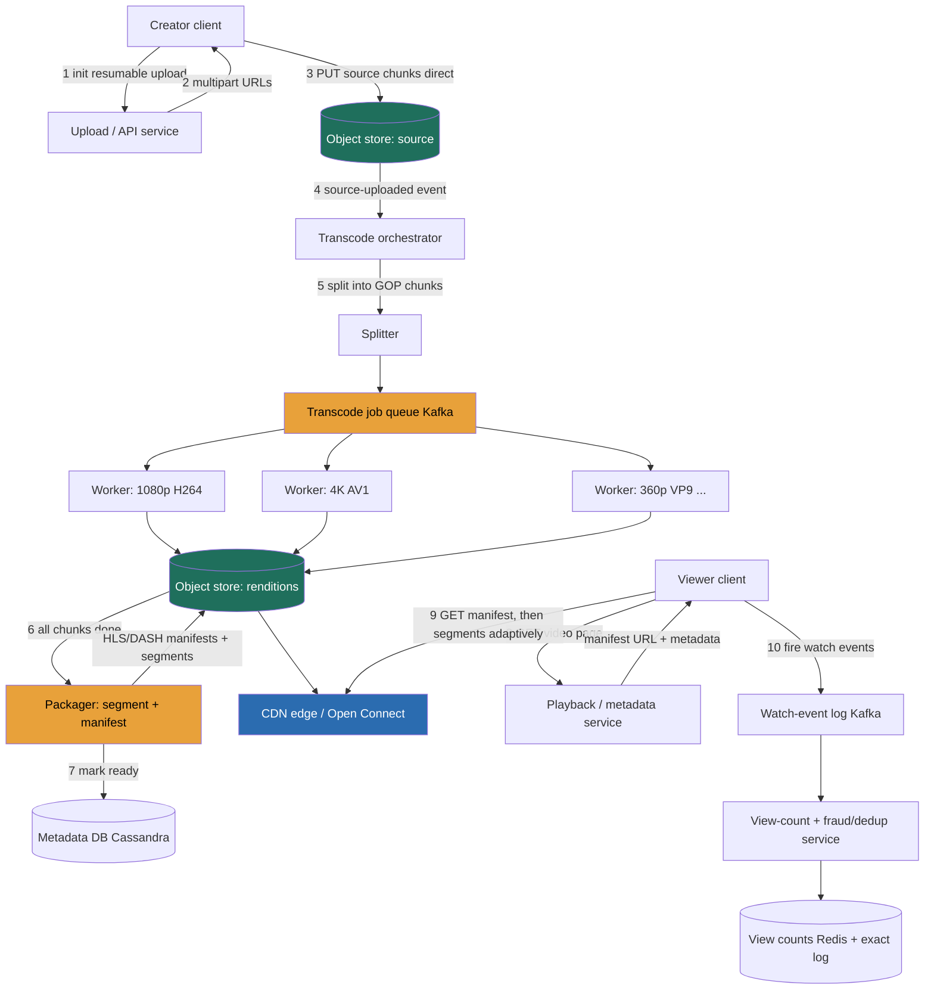

> Video looks like a streaming problem and is actually a **batch-encoding-plus-static-file-delivery** problem. The mental flip that separates a Director answer from a junior one: **you do not stream video from a server.** You **pre-chop** each source, offline, into a *ladder* of small static segments, one rung per resolution, several per codec, and the client **adaptively pulls** them from a CDN like any other static file. The engine is a **transcoding pipeline** (one source → N resolutions × M codecs, run as parallel async jobs on chunks); the thing that forces the whole architecture is **bandwidth**, **~125 Tbps of egress**. The blob-store building block (blob store), 3.5 (CDN), 3.8/3.9 (queues/pub-sub), and 3.16 (sharded counters) built the parts. We build **YouTube** (upload-driven UGC, hot view counts) as the primary system, with **Netflix** (finite curated catalog, pre-positioned at the ISP edge) as the contrast in Design evolution.

### Learning objectives
- Run a full **RESHADED** pass on a video platform, deriving every structural decision from a stated requirement and its rejected alternative.
- Quantify the system from first principles, **~500 hours uploaded/min**, **~1B watch-hours/day**, a **~1,400:1 watch:upload skew**, **~125 Tbps egress**, **~2 EB/year** of media, and use those numbers to *force* the architecture.
- Make the pivotal **delivery + encode** decision: **adaptive bitrate (HLS/DASH) over a pre-built static ladder** vs transcode-on-the-fly vs single-bitrate download, and design the transcode pipeline as **chunked parallel jobs**.
- Make the **codec-economics call as a budget owner**: AV1 saves ~30% of bytes (~37 Tbps at our scale) but costs far more encode compute, gate expensive codecs behind popularity and delegate the ladder.
- Handle **view counts at hot-key scale with fraud/dedup**, split the **upload path** from the **metadata store**, and know where to **delegate**, codec matrix, recommendation model, ABR heuristics.

### Intuition first
Forget "streaming", picture a **printing-and-distribution operation for a magazine** that must be readable on a billboard, a laptop, and a cracked phone on a subway with one bar of signal. When an author submits one master manuscript (your uploaded source), the plant does **not** re-typeset a custom edition per reader on demand, that would melt the presses. **Once, up front and in the background, it prints the content at every size and paper stock it might ever need** (the resolution × codec ladder), **cuts each edition into small numbered pages** (segments), and ships pallets to **thousands of local newsstands** (CDN edges). Your reader app looks at how good your light is (current bandwidth) and **grabs the next page at whatever size you can handle** from the nearest newsstand, entering a tunnel, it grabs the tiny low-ink page, seamlessly, mid-article. That is **adaptive bitrate**.

Three consequences fall out and drive the entire design: the expensive work (**printing every edition** = transcoding) happens **once, offline, on a job queue**, never on the request path; readers pull **dumb static pages from local shelves**, so the read path is a file server, the only way to serve a billion watch-hours a day; and **the pallets of paper are the cost**, ~125 terabits per second of egress, orders of magnitude more bytes than the records describing the videos.

---

## R: Requirements

RESHADED starts by scoping *before* building, the signal is **cutting** to a defensible core and naming the watch:upload reality and bandwidth dominance that dictate everything downstream.

**Functional (the core we will actually build):**
1. **Upload a video** (with metadata + thumbnail), transcoded into the full streaming ladder.
2. **Watch a video**, adaptive-bitrate playback, served from near the user.
3. **View count** per video (plus likes), displayed with acceptable lag.
4. **Browse / search / recommend**, treated as a **side path**, mostly delegated.

**Explicitly cut (stated out loud, so it reads as choice, not omission):**
- **Live streaming**, real-time/low-latency transcode, LL-HLS, no offline ladder; I'd reuse the byte plane and CDN but rebuild the encode path. A Design-evolution extension, not v1.
- **DRM** (Widevine/FairPlay/PlayReady), non-negotiable for *Netflix* (studios won't license without it), a bolt-on for UGC. Named as a **delegated workstream** (player-security team owns key exchange; my pipeline produces encrypted segments) so the omission reads as scope control.
- **The recommendation model itself**, I build the serving system and log the signals; the ranking model is a **delegated deep-dive**.
- **Comments, channels/monetization, Shorts**, known patterns or separate systems; cut for time.

**Clarifying questions (and assumptions if waved on):**
- *Scale?* **~2B monthly users, ~500 hours uploaded/min, ~1B watch-hours/day.**
- *VOD or live?* **VOD.** This single answer *permits* the entire offline-ladder approach.
- *Start-up latency?* **Time-to-first-frame p99 ≲ 2 s, rebuffer < ~0.5%** of watch time.
- *View-count semantics?* **Eventually-consistent display is fine**, but counts must be **deduplicated and fraud-filtered**, they drive creator payouts and trending, so a view is *not* a casual `+1`. This forces a separate exact reconciliation path.

**Non-functional requirements:**
- **Read-heavy, extreme:** watch dominates upload **~1,400:1** (derived next), a byte-delivery machine with a tiny upload pipeline and a huge encode pipeline behind it.
- **Bandwidth is the dominant constraint:** **~125 Tbps average egress** (peak ~2.5×), the single biggest budget line a Director owns.
- **Playback quality:** TTFF p99 ≲ 2 s, rebuffer < 0.5%, delivered by ABR + CDN proximity, not a faster origin.
- **Durability:** losing a creator's upload is unforgivable; **11 nines** on the object store. The *source* is the irreplaceable master.
- **Availability over strict consistency** on the watch path (AP lean); the *upload commit* and *billing-grade count* want stronger guarantees.

> The requirement that secretly licenses the whole architecture is **"VOD, and a new upload need not be instantly watchable."** It is what makes offline, asynchronous, chunked transcode legal. Juniors skip it and then can't justify why the expensive encode is allowed to be slow.

---

## E: Estimation

Enough math to make a defensible call. Three anchors, everything derived from them: **(1) 500 hours uploaded/min, (2) 1B watch-hours/day, (3) ~7 GB stored per source-hour across the full ladder×codecs.**

**Upload (write) side, tiny:** 500 hrs/min → **~720,000 hours/day**; at ~5 min average length, ~8.6M videos/day ≈ **~100 uploads/s** (peak ~200/s). Uploads are a trickle, the scaling problem is what each upload *triggers*.

**Watch (read) side, enormous:** 1B watch-hours/day → **watch:upload ≈ 1,400:1**, the headline ratio; and ÷24 → **~42M concurrent streams** on average.

**Egress bandwidth (the number that dominates everything):**
- Blended ABR bitrate ≈ **3 Mbps** (stated assumption). 42M × 3 Mbps = **~125 Tbps average**, peak ~2.5× ≈ **~310 Tbps**; per day, **~1.35 EB of video egress**. **This is the system.** Serving it from origin is latency-fatal and budget-fatal, the CDN/edge *is* the read architecture.
- **CDN offload:** at a **95% edge hit ratio**, origin sees ~5% = **~70 PB/day**; the edge absorbs ~1,280 PB/day. Every point of hit ratio is a multi-million-dollar line item.

**Media storage:** 720k hrs/day × ~7 GB/source-hour = **~5 PB/day → ~1.8 EB/year**, growing forever (UGC is kept ~indefinitely). **Erasure coding (~1.4×) over 3× replication** saves on the order of **~3 EB/year of raw disk**, a budget number, justified in S.

**Metadata storage (the deliberate contrast):** ~2 KB/video × 8.6M/day ≈ **~6 TB/year**. **Media is ~5 orders of magnitude larger than metadata** (~2 EB vs ~6 TB), the entire justification for splitting bytes (object store + CDN) from records (a database).

**Transcode compute (the hidden fleet):** encoding is slower than real time, and naively encoding the **full ladder × 3 codecs for every upload works out to ~1.5M cores running continuously, a nine-figure compute line.** That is precisely why we don't: run a **cheap H.264 pass for every upload** (fleet ~an order of magnitude smaller) so the video is watchable fast, and **backfill expensive VP9/AV1 rungs only for content that earns views**, most uploads get a handful of views, and encoding AV1 for them is pure waste. The popularity-gated backfill keeps the fleet sane, and it's why the pipeline must be **chunked and parallel** (H) so wall-clock latency stays minutes and a failure doesn't restart a movie.

> The three numbers I carry into every later decision: **~1,400:1 watch:upload** (→ edge-served static segments), **~125 Tbps egress** (→ the dominant cost), and **media ≫ metadata by ~5 orders of magnitude** (→ two completely different stores).

---

## S: Storage

Five distinct data shapes, each with a different access pattern, naming them separately, and rejecting one-database-for-everything, is the signal.

| Data | Shape & access pattern | Store **type** | Real system | Rejected alternative (and why) |
|---|---|---|---|---|
| **Video segments + manifests** | Enormous, immutable, write-once read-many-billions | **Object store + CDN/edge** | **S3 / GCS** behind **CloudFront** / private CDN (Netflix: **Open Connect** in ISPs) | DB BLOBs / NFS, melts at EB scale, can't reach 11 nines economically, can't sit at the edge. |
| **Source / mezzanine masters** | Huge, immutable, *cold*, irreplaceable | **Object store, archive tier** | **S3 Glacier-class** | Hot storage for sources, read maybe once after upload; pure waste. |
| **Video & channel metadata** | Small (~2 KB) rows, keyed point reads, very high read rate | **Wide-column / partitioned KV** | **Cassandra** / Bigtable / DynamoDB | A single Postgres, holds 6 TB fine, but can't absorb the read rate or partition across regions without sharding work the store should own. |
| **View counts (+ likes)** | Hot write keys, display-tolerant lag, exact for payouts | **Sharded counters + exact recompute from a log** | **Redis** shards + **Kafka** → batch recompute | A single `UPDATE count+1` row, hot-key wall on a viral video, no fraud/dedup hook. |
| **Watch events / signals** | Append-only firehose, analytics + recommendations | **Log → columnar warehouse** | **Kafka** → BigQuery / S3+Spark | Writing events into the OLTP store, pollutes serving with analytics load. |

Two sub-decisions worth defending:
- **Erasure coding vs 3× replication**: ~11 nines at **~1.4× overhead instead of 3×**, **~3 EB/year of raw disk saved**, accepting slower reconstruction on the rare degraded read. *Rejected:* 3× everywhere; at EB scale the 200% overhead is a budget I won't sign.
- **Keep the source as a cold mezzanine.** *Rejected:* discarding it after encode, adding a new codec or rung later would mean re-encoding from a lossy rendition, or not at all. Cold storage is cheap; keep the master.

---

## H: High-level design

Three flows matter, **upload**, the **transcode pipeline** (the engine, where I go deep), and **watch**, and the key statement is that **transcode happens offline as chunked parallel jobs, and the watch path is a dumb CDN of static segments.**



**Upload.** A **resumable multipart upload** PUTs the source **directly to the object store** (app servers never touch the bytes; a dropped connection retries one chunk, not a 10 GB file). Completion fires a `source-uploaded` event and commits a metadata row (`status: processing`), the video exists immediately, just not yet watchable.

**Transcode (the engine, go deep here).** The orchestrator **splits the source at GOP/keyframe boundaries** (each chunk independently decodable) and emits one job per **(chunk × rung × codec)** onto a Kafka queue; a **stateless worker fleet** encodes in parallel. Because the work is chunked, a 2-hour movie's ladder finishes in **minutes of wall-clock, not hours**, and a worker crash re-queues **one chunk**, idempotent by chunk id. A **packager** stitches completed rungs, cuts 2-6 s streaming segments, writes the **HLS/DASH manifests**, and flips the row to `ready`. **This chunked-parallel DAG is the heart of the problem**, fast, fault-isolated, elastically scalable.

**Watch.** The client gets metadata plus a **manifest URL** from us, then fetches the manifest and **segments adaptively from the CDN**, starting low for a fast first frame, climbing as throughput allows. **Every byte of video comes from the edge, never from us.** In parallel the client fires watch events to Kafka; the view-count service **dedups, fraud-filters**, and updates the sharded count. Tiny metadata call to us, all bytes from the edge, ABR on the client, that's what makes p99 TTFF ≲ 2 s feasible.

---

## A: API design

Keep it small; the non-obvious choices are the **resumable multipart upload**, **manifest-based playback**, and the **fire-and-forget watch beacon**.

```
# --- Upload (resumable / multipart) ---
POST /v1/uploads:init
  body: { filename, size_bytes, content_type }
  -> { upload_id, part_urls[], part_size }          # client PUTs source chunks straight to object store

POST /v1/uploads/{upload_id}:complete
  body: { parts:[{part_number, etag}] }
  -> { video_id, status: "processing" }              # returns BEFORE transcode finishes

POST /v1/videos
  body: { video_id, title, description, tags[], thumbnail_upload_id }
  -> { video_id, status: "processing" }

GET  /v1/videos/{video_id}
  -> { video_id, title, channel, status, manifest_url, thumbnails, view_count, created_at }

# --- Playback (we return a MANIFEST URL; bytes come from the CDN) ---
GET /v1/videos/{video_id}/manifest
  -> 302 redirect to  https://cdn.example.com/<video_id>/master.m3u8   (HLS) or /manifest.mpd (DASH)

# --- Watch events (fire-and-forget beacon; powers counts + recommendations) ---
POST /v1/videos/{video_id}/events           body: { session_id, type: play|seek|heartbeat|complete, position_ms }
  -> 202                                            # never on the critical playback path

# --- Engagement / browse ---
POST /v1/videos/{video_id}/likes            -> 202   # idempotent per (user, video)
GET /v1/search?q=&cursor=&limit=20          -> { results:[...], next_cursor }
GET /v1/recommendations?cursor=&limit=20    -> { videos:[...], next_cursor }    # ranking owned by ML team
```

Three decisions worth defending. **Resumable multipart, not a single presigned PUT:** a multi-GB source over mobile *will* drop mid-upload; multipart retries one part. *Rejected:* single-shot PUT, a failed 10 GB upload is a furious creator. **Playback returns a manifest URL (302 to the CDN), not a byte stream:** the manifest *is* the ABR mechanism. *Rejected:* proxying bytes through us, that puts us in the 125 Tbps path and defeats the CDN. **Watch events are 202 fire-and-forget.** *Rejected:* a synchronous "register view" returning the new count, a hot, fraud-checked counter on the critical playback path (the 3.16 anti-pattern).

---

## D: Data model

**Partition keys, not column inventories, are the load-bearing detail:**
- `videos`, **PK `video_id`** for point reads, with a second query-shaped table **`videos_by_chan` (PK `channel_id`, clustered by `created_at DESC`)**, the denormalize-by-query Cassandra idiom, not secondary indexes. Manifest/rendition fields are **object-store paths; the bytes are never in the DB.**
- `transcode_jobs`, **PK `video_id`**, clustered **(rung, codec, chunk_idx)**: all of one video's job state in one bounded partition, and idempotency per `(video_id, rung, codec, chunk_idx)`, a re-run overwrites the same output key.
- **View counts**, *not* a column you `UPDATE`: **N sharded sub-counters per `video_id`** in Redis, summed on read, with **dedup per `session_id` applied before the increment**, plus the authoritative count recomputed from the event log.
- `watch_events`, Kafka, **keyed by `video_id`** (a hot video streams through a bounded set of partitions; videos parallelize), and the log is what lets the exact count be recomputed independently of the display counter.

<details>
<summary>Go deeper, full table layouts (IC depth, optional)</summary>

```
videos:          PK = video_id
                 (channel_id, title, description, tags, status,
                  manifest_keys{hls,dash}, rendition_keys[], thumbnail_keys[], created_at)
videos_by_chan:  PK = channel_id, clustering key = created_at DESC   # "show me a channel's uploads"

transcode_jobs:  PK = video_id, clustering = (rung, codec, chunk_idx)
                 (status: queued|running|done|failed, attempt, worker_id, output_key)
                 # a 2-hour movie at 6 s chunks × 6 rungs × 3 codecs ≈ 20,000 rows — a bounded partition

view_count:{video_id}:{shard}   shard in 0..N-1     # increment a deduped shard; sum on read for display
# authoritative count = batch recompute from the Kafka watch-event log (deduped per session, bot-filtered)

watch_events:  key = video_id, value = {session_id, user_id, type, position_ms, ts}
```

Rendition keys look like `s3://renditions/ab/cd/<video_id>/1080p_h264/seg_0007.m4s`.

</details>

---

## E: Evaluation

Stress your own design: re-check the NFRs, hunt the bottlenecks, fix each **naming the trade**. An architecture with no self-identified failure modes reads as untested.

**Bottleneck 1, Egress cost and origin meltdown (the headline failure).** ~125 Tbps (peak ~310) cannot be served from origin; a single popular video could saturate origin egress.
> **Fix, push ~all bytes to the edge, and raise the hit ratio relentlessly.** Static segments on a CDN take 95%+; **origin shielding / tiered caches** stop a viral first-view stampede; **predictive pre-positioning** pushes anticipated-hot content to edges (the Open Connect model, appliances *inside* ISPs). **Trade:** edge storage + a pre-positioning system for collapsing ~1.3 EB/day to ~70 PB/day at origin. *Rejected:* a few big origin regions, the egress bill and cross-ocean latency both kill it.

**Bottleneck 2, Transcode throughput, latency, and cost.** Whole-file serial encoding of a 2-hour 4K source takes *hours*, and one failure restarts the lot.
> **Fix, chunked parallel transcode** (the engine from H): split at GOP boundaries, fan independent chunk jobs across a stateless fleet, idempotent per chunk, package when complete. **H.264 first** so the video is watchable on anything within minutes; **VP9/AV1 backfill asynchronously**, so first-watchability never waits on slow codecs. **Trade:** orchestration complexity (split/track/stitch) for minutes-not-hours latency and fault isolation. *Rejected:* whole-file serial, simplest, but hours of latency and all-or-nothing failure.

**Bottleneck 3, Codec economics (a bandwidth/compute trade worth real money).** The Director call: **AV1 saves ~30% of bytes ≈ ~37 Tbps at our scale, but costs far more encode compute, so serve a multi-codec ladder (H.264 universal floor, VP9/AV1 for capable clients), gate the expensive codecs behind popularity so the savings land where the egress is, and delegate the ladder design to the media team with a cost SLA.** *Rejected:* one codec either way, H.264-only overpays egress forever; AV1-only breaks old devices and melts the encode fleet.

<details>
<summary>Go deeper, the codec comparison (IC depth, optional)</summary>

- **H.264:** plays on effectively every device ever made; cheapest to encode (a few CPU-hours per source-hour across a ladder); ~30% more bytes than AV1 for the same quality. The universal floor and the v1 watchability gate.
- **VP9:** broad modern support (Chrome, Android, most smart TVs); ~20-25% better compression than H.264; moderate encode cost. The middle rung.
- **AV1:** best compression (~30% under H.264, ~10-15% under VP9) but **10-100× slower than real time per rendition on CPU**, summed across a 6-rung ladder, tens to >100 CPU-hours per source-hour. At 720k source-hours/day, full-ladder AV1 for everything ≈ ~1.5M continuous cores (range ~0.9-3M), the math that forces popularity gating. GPU/ASIC encode shifts the curve but not the conclusion.
- **Per-title / per-scene encoding** (Netflix's refinement): instead of one fixed bitrate ladder, analyze each title (or shot) and spend bits only where complexity demands, worth it when each title is watched millions of times, so the extra encode amortizes to nothing per view. YouTube applies it only to the popular head for the same reason.
- The manifest advertises all codecs; the client picks the best it supports. Encode cost ~2-3×, storage ~2-3×, egress −~30% on the modern share of traffic, at terabit scale egress savings dwarf both.

</details>

**Bottleneck 4, Hot view-count key + fraud.** A viral video takes views faster than one Redis key or row can serialize, *and* naive counting is trivially gamed, counts drive payouts.
> **Fix, dedup + sharded display counter + exact log reconciliation**: dedup per `session_id` and fraud-filter *before* counting; display = N sub-counters summed on read; the **payout-grade count is recomputed exactly, offline, from the Kafka event log**, bot-filtered. **Trade:** the display number is approximate and lagging (allowed by R) while the money number is exact but delayed, two numbers on purpose. *Rejected:* one atomic counter, a hot-key wall *and* no place for fraud logic.

**Bottleneck 5, Tail latency: TTFF and rebuffering.** A cold segment or an over-ambitious first rung spikes startup and stalls.
> **Fix:** **start low, climb fast**, short initial segments, edge proximity, healthy buffer-ahead. **Trade:** a slightly-lower-quality first few seconds for a stall-free start, the ABR bargain. The player heuristic itself I **delegate** to the client/media team (prior: buffer-based + throughput-estimate hybrid).

**Bottleneck 6, Single points / availability.** Object store and CDN are managed/multi-region; the risks are the **orchestrator** and the **count path**. Both are **stateless and replayable from Kafka**: a backlogged transcode means uploads go watchable late (degraded, not broken); a lost Redis counter is recomputed from the log. **Trade:** late uploads / briefly-stale counts under failure, in exchange for never losing source bytes or a payout-grade view, Redis and the encode fleet are accelerators, never the source of truth.

**Re-check vs NFRs:** 1,400:1 + 125 Tbps → static segments on CDN absorbing ~95% ✓; TTFF/rebuffer → ABR + edge proximity ✓; 11-nines durability → erasure-coded object store, cold source master ✓; availability → Kafka-replayable transcode + counts ✓; cost → edge offload, AV1 (~37 Tbps), erasure coding (~3 EB/yr raw) are the levers a budget owner pulls ✓.

---

## D: Design evolution

**At 10× (~1.25 Pbps egress, ~10B watch-hours/day):**
- **Egress is the wall, and it's physical/commercial, not just software.** The lever becomes **owning the edge**: ISP-embedded appliances (Open Connect model) so bytes never traverse paid transit, hit ratio pushed toward 99% with predictive pre-positioning, and harder AV1 adoption (every point is terabits). Nine-figure budget lines a Director defends to finance; I'd **delegate edge placement/peering to the network team** with the prior "embed at the ISP for the top-N regional titles; CDN for the tail."
- **Transcode scales out cheaply** (embarrassingly parallel); the lever is **encode efficiency**, per-title encoding and prioritizing codec backfill toward the most-watched content.
- **Storage lifecycle-tiers aggressively**, most UGC is hot for days then near-never watched; at ~2 EB/year the tiering policy is itself a multi-million-dollar/year line.

**The Netflix contrast (same byte plane, opposite encode/serve economics, the "new constraint" lens):**
- **Finite, curated catalog, not a UGC firehose.** No 500-hours-a-minute ingest and **no hot view-count problem** (a fixed catalog; counts aren't the product). The upload pipeline shrinks to an **internal ingest** of studio masters.
- **Encode once, optimize obsessively.** With a finite catalog you can afford **per-title and per-shot encoding**, bespoke ladders per title, because each title is watched millions of times; the encode cost amortizes to nothing per view. (YouTube can't: most uploads get a handful of views, so it uses a cheaper one-size ladder and only re-encodes the winners.)
- **Pre-position the whole catalog at the ISP edge (Open Connect).** Demand is predictable, so Netflix ships appliances into ISPs and **pre-loads tonight's likely-watched titles overnight**, peak-evening traffic is served from a box inside your ISP. YouTube's long-tail catalog can't be fully pre-positioned, so it leans on a general CDN + caching.
- **DRM and recommendations move to the core.** Studio licensing **mandates DRM** (the scope cut from R becomes central), and with a finite shelf the **recommendation model is the product**, not a side path.

**The hardest trade-offs (genuinely contested):**
1. **How rich a ladder, which codecs, per content tier.** Full ladder × 3 codecs for a 12-view video is pure waste; under-encoding a viral hit overpays egress forever. The senior answer is **adaptive**: cheap H.264 for everything, richer rungs/AV1 backfilled by popularity, a monitored policy, not a constant.
2. **Pre-positioning vs on-demand edge caching.** Pays off for predictable demand (Netflix, YouTube's head); wastes edge storage on the tail. A per-region, per-tier call.
3. **Erasure coding vs replication for *hot* renditions.** Erasure coding saves EB-scale disk but slows degraded reads; replicate the hottest, erasure-code the warm/cold bulk, per-tier, not global.

**What I'd revisit first:** the **view-count fraud pipeline** (it feeds payouts and trending; adversaries actively game it, a security surface, not a nice-to-have), and **codec-backfill prioritization** (getting AV1 onto the *right* content is where the terabits are).

**Where I'd delegate (explicit Director signal):** the **codec/encoder matrix + per-title encoding** → media team (prior: chunked, idempotent, H.264-first-then-backfill, with a cost SLA); the **ABR player heuristic** → client team (prior: hybrid start-low-climb); the **recommendation model** → ML team (my system delivers candidates and logs signals); **edge placement / ISP peering** → network team (prior: embed for the head, CDN for the tail). Going deep on the transcode DAG and the edge/codec cost levers, and handing off the rest with a stated prior, is the altitude this round scores.

---

### Trade-offs table: the pivotal decisions

| Decision | Option A | Option B | Option C (chosen, usually) | Use when… |
|---|---|---|---|---|
| **Delivery model** | **Transcode-on-the-fly** | **Single-bitrate progressive download** | **ABR (HLS/DASH) over a pre-built static ladder** | A: ~never at scale (uncacheable, melts compute). B: tiny scale, uniform networks. **C: any real VOD platform.** |
| **Encode pipeline** | **Whole-file serial** |, | **Chunked parallel (split at GOP, fan out, stitch)** | A: short clips, low volume. **C: anything longer than a clip, minutes-not-hours, fault isolation, elastic scale.** |
| **Codecs** | **H.264 only** | **AV1 only** | **Multi-codec, serve best supported, popularity-gated backfill** | A: egress not the bottleneck. B: closed modern-only ecosystem. **C: huge egress + mixed devices, pay encode compute to save ~30% of bytes.** |
| **View count** | **Single atomic counter** | **Sharded display counter** | **Dedup + sharded display + exact log reconciliation** | A: low write rate, no fraud. B: viral, display-only. **C: counts that feed payouts/trending and must resist fraud.** |

---

### What interviewers probe here (Director altitude)

They are not checking whether you can name HLS, they're checking that you grasp video as offline-encode + static-edge-delivery, can **price** the bandwidth, and know what to delegate.

- **"How does video get from upload to a viewer's screen?"**, *Strong:* "we don't stream from a server", pre-built ABR ladder of static segments on a CDN, offline chunked-parallel transcode, client adapts via a manifest; names ~125 Tbps as why the edge is the architecture. *Red flag:* "the server streams the video" with no ladder, no CDN.
- **"Walk me through the transcode pipeline."**, *Strong:* split at keyframes → idempotent chunk jobs across a stateless fleet → package + manifest → H.264-first then backfill. *Red flag:* "run ffmpeg on the file", serial, no fault model, hours of latency.
- **"What's your egress, and what does it cost?"**, *Strong:* ~125 Tbps avg, 95% offload → ~70 PB/day origin, AV1 ≈ −37 Tbps, Open-Connect-style edge for the head, a latency *and* nine-figure budget story. *Red flag:* "use a CDN, it's faster" with no numbers.
- **"A video goes viral, what breaks?"**, *Strong:* the **hot view-count write key** (shard, dedup, fraud-filter, log-reconcile) *and* the **origin stampede** (shielding/pre-positioning). *Red flag:* "add read replicas", replicas don't relieve a hot *write* key, and the bytes are on the CDN anyway.
- **"What would you not build yourself?"**, *Strong:* codec matrix, ABR heuristic, recommendation model, ISP peering, each with **a stated prior**. *Red flag:* hand-tuning an AV1 encoder live, or "the team handles it" with no prior.

---

### Common mistakes

- **Thinking video is "streamed" from a server.** It's pre-encoded into a static ladder served as files from a CDN; the client adapts. Missing this misses the whole problem.
- **Transcode-on-the-fly or whole-file serial encode.** Uncacheable / hours of latency with all-or-nothing failure. Chunked parallel jobs off a queue.
- **Putting app servers, the origin, or the database in the byte path.** 125 Tbps through your servers, or EB-scale bytes in a DB, is self-inflicted and impossible. Bytes → object store + edge; records → DB.
- **Counting views with one atomic counter and no dedup.** A hot-key wall *and* trivially gamed, shard, dedup per session, fraud-filter, keep an exact log-reconciled number for payouts.
- **Discarding the source after encoding.** You can't add a new codec/rung later without the master. Keep it cold.

---

### Interviewer follow-up questions (with model answers)

**Q1. A user uploads a 2-hour 4K film. Walk me from the PUT to it being watchable, where does the time go?**
> *Model:* Resumable multipart PUT straight to the object store (app servers out of the byte path); completion fires `source-uploaded` and commits a `processing` metadata row. The orchestrator splits at GOP boundaries and fans **thousands of (chunk × rung × codec) jobs** across a stateless fleet via Kafka, that parallelism is why the ladder finishes in **minutes, not hours**. To minimize time-to-watchable, the **universal H.264 ladder encodes first** and the row flips to `ready` when it's packaged; VP9/AV1 backfill asynchronously. The time goes into encode CPU, exactly why it's chunked, and why the cheap codec gates watchability. A worker crash re-queues one idempotent chunk, not the film.

**Q2. Your CDN bill is the biggest line in the budget. Where do you cut without hurting playback?**
> *Model:* Three levers, biggest first. (1) **Raise the edge hit ratio** toward 99, tiered caching, origin shielding, pre-positioning anticipated-hot content (ISP-embedded appliances so bytes skip transit); every point at ~125 Tbps is huge. (2) **Drive AV1 adoption** where clients support it, ~30% fewer bytes ≈ **~37 Tbps**, prioritizing backfill toward the most-watched content so savings land where the egress is. (3) **Per-title encoding** for popular titles. I would *not* drop low-bandwidth rungs or shrink the buffer, that spikes rebuffering. Cut bytes-on-the-wire and placement, where the cost lives and the viewer never notices.

**Q3. How do you count views accurately when a video is viral and people are gaming the counter for payouts?**
> *Model:* Two numbers on purpose. **Display:** dedup per `session_id`, apply fraud heuristics *before* incrementing a **sharded** counter, sum on read, fast, approximate, allowed to lag. **Payout-grade:** recomputed exactly, in batch, from the **Kafka watch-event log**, fully deduped and bot-filtered (the anti-fraud models themselves are a delegated workstream), that's the number that touches money and trending. The live counter is an accelerator; the immutable log is the source of truth.

**Q4. The same blockbuster drops globally at 8pm and everyone hits play at once. Why is that not an outage?**
> *Model:* Two stampedes. **Bytes:** the segments are static and **already at the edge**, for a planned drop, pre-positioned overnight to ISP-embedded appliances; for an unplanned spike, origin shielding means the first edge miss pulls once and everyone after is served from cache. Origin sees a trickle. **Metadata/counts:** the metadata read is tiny and cached; view-count writes are sharded and async (a beacon, off the playback path). Worst case is a slightly slower first segment for the first viewers in a region, the heavy bytes were positioned ahead of demand and the counting never blocks playback.

---

### Key takeaways

- **Video is offline-encode + static-edge-delivery, not server-side streaming.** Pre-chop into a **ladder of static segments** (resolutions × codecs) on a **CDN/edge**, and let the **client adapt** (HLS/DASH), the read path is a file server, the only way to serve ~1B watch-hours/day.
- **Drive it with three numbers:** **~1,400:1 watch:upload**, **~125 Tbps egress** (the dominant cost; AV1 ≈ −37 Tbps), and **media ≫ metadata by ~5 orders of magnitude** (~2 EB/yr vs ~6 TB/yr). The architecture falls out of the arithmetic.
- **The transcode pipeline is the engine, chunked and parallel:** split at GOP boundaries, idempotent chunk jobs on a stateless fleet, package + manifest, **H.264-first then popularity-gated backfill**.
- **Keep heavy work off the critical paths:** resumable multipart straight to the object store, async transcode on a queue, fire-and-forget watch beacons.
- **Director moves:** price the egress as a budget owner, **shard + dedup + fraud-filter** the count with an exact log-reconciled number for payouts, and delegate the **codec matrix, ABR heuristic, recommendation model, and ISP peering** with stated priors.

> **Spaced-repetition recap:** A printing plant prints every edition (resolution × codec) **once, offline**, cuts it into numbered pages (segments), and ships pallets to local newsstands (**CDN/edge**); your reader grabs the right-size next page for its signal (**ABR**). Encode is a **chunked-parallel** job fabric off the request path; the watch path is a **dumb CDN of static files**, because egress is **~125 Tbps** and media outweighs metadata by ~5 orders of magnitude. **Multi-codec** (H.264 floor; AV1 −30%, popularity-gated), **sharded + deduped + fraud-filtered** counts with an exact log behind them. **YouTube** = UGC firehose + hot counts; **Netflix** = finite catalog, per-title encode, **pre-positioned at the ISP edge**, DRM + recommendations core.
