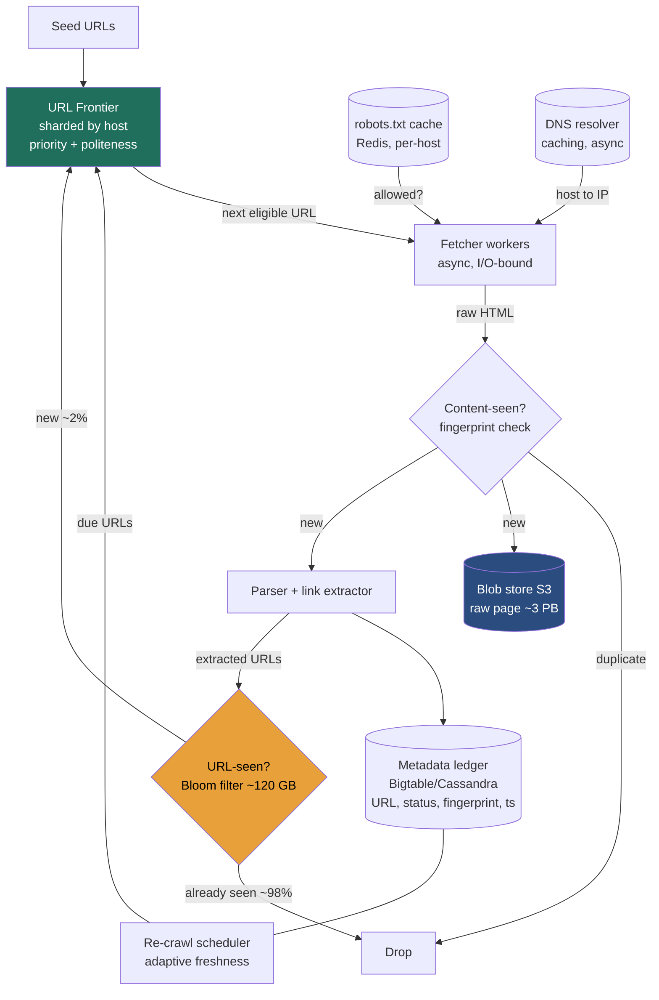

### Learning objectives
- Run the **RESHADED** spine on a large-scale web crawler and defend every call against requirements, cost, and risk.
- Internalize the crux: **the URL frontier** must simultaneously **prioritize**, enforce **politeness (per-host rate-limiting)**, and never re-fetch the billions of URLs already **seen**, cheaply.
- Quantify the system: **~30B pages over 30 days ≈ 12k pages/sec**, **~720k URL-seen checks/sec**, **~10 Gbps** ingest, **~3 PB** raw storage, **~120 GB Bloom filter**, and show why each number picks a component.
- Explain why **partitioning the frontier by hostname** is the decision that makes politeness a *local* property requiring no cross-node coordination.
- Identify where a Director goes deep (frontier design, Bloom false-positive direction) and where they delegate (SimHash tuning, the JS-render farm) with a stated prior.

### Intuition first
A web crawler is not a downloader, downloading is the easy 5%. It is a **politeness-constrained breadth-first search over a hostile graph**. Picture a very well-mannered librarian photocopying the entire web. The work itself (fetch, copy, write down the links, fetch those next) is trivial. Three things make it brutal at scale. **Manners**: fire 12,000 requests a second at one server and you've DDoSed it, so you cap yourself at roughly **one request per second per host** and obey `robots.txt`. **Memory**: the web is one giant loop, so before fetching anything you must ask "have I seen this URL?" about **120 billion** discovered links without a disk seek each time. **The web fights back**: infinite calendars, session-id URLs that look new forever, deliberate **spider traps**. So the heart of the system is one component, the **URL frontier**, a sharded, prioritized, politeness-aware to-do list, fronted by a **Bloom filter** that cheaply remembers what you've seen. Everything else is plumbing around that to-do list.

Two framing notes. **One:** a crawler is almost **pure write**, it *produces* a corpus; the only "read" is the downstream indexer consuming it offline in batch. Size for **fetch rate and storage growth**, not query QPS. **Two:** the entire design hangs off one tension, maximize throughput while never violating per-host politeness, and the resolution is **partition the frontier by hostname**, so "1 req/s for this host" is a decision one worker makes alone, with **zero global coordination**.

---

## R: Requirements

"Build a web crawler" hides several products (search-corpus builder, focused scraper, archiver, malware scanner). The Director signal is cutting to a defensible core and saying why.

**Clarifying questions (with assumed answers):**
- *What's it for?* → **A fresh corpus for a search index.** Broad coverage, periodic re-crawl, store raw + extracted text. Rules out focused crawling and pure archiving.
- *Scale and cadence?* → **~30 billion pages, re-crawled roughly monthly.** This pair drives the entire E step.
- *HTML only, or render JavaScript?* → **HTML in scope; JS rendering delegated** to a separate render tier, rendering is 10-50× more expensive per page. Stating this cut is itself signal.
- *Media?* → **Record media URLs, don't download bytes.** The crawler stores the ~100 KB page, not the ~2 MB of assets.
- *Politeness?* → **Non-negotiable.** Violate it and you get IP-banned, legally threatened, and you take sites down. This is the defining non-functional requirement, not a nicety, the architecture is *built around* it.

**CUT from scope (stated, with reason):** JS rendering (delegated tier), indexing/ranking/PageRank (the *search* problem, the crawler ends at "store page + links"), media bytes (blob pipeline), authenticated/paywalled crawling (policy out of scope), real-time crawling (this is batch ingest).

**Functional requirements:**
1. **Fetch** a URL honoring `robots.txt` and per-host rate limits.
2. **Parse** and **extract outbound links**.
3. **Dedup**: never re-enqueue a seen URL; never store a duplicate page.
4. **Store** raw page + extracted text/metadata durably.
5. **Prioritize** (not pure FIFO) and **re-crawl** adaptively for freshness.
6. **Avoid traps/loops**: per-host budgets, depth limits, near-dup detection.

**Non-functional requirements:**
- **Politeness (the headline NFR):** ≤ ~1 req/s/host (tunable from `Crawl-delay`), obey `robots.txt`.
- **Throughput:** sustain ~12k pages/s; scale to 10× by adding workers, no global bottleneck.
- **Robustness:** survive malformed HTML, traps, and worker failures without losing the frontier.
- **Freshness:** adaptive re-crawl, important pages often, stable pages rarely.
- **Read:write skew:** **pure ingest**, ~12k page-writes/s, no external reads on the hot path.

The decisive requirement is **politeness × throughput**: ≤1 req/s/host *and* 12k pages/s together force a design that spreads work across thousands of hosts at once and partitions the frontier by host. That tension is the architectural fork everything else hangs off.

---

## E: Estimation

Enough math to make a defensible call; round hard, state assumptions. **One consistency rule: ~100 KB per page over the wire** (the HTML document, not its assets), bandwidth and storage both derive from it.

**Assumptions:** 30B pages/crawl over 30 days; ~60 outbound links/page; ~120B distinct URLs discovered (discovered ≈ 3-4× crawled); peak ≈ 2× average.

**Fetch rate and host concurrency, the crux, stated once:**
```
30B ÷ (30 × 86,400 s) ≈ 12k pages/s sustained (peak ~25k)
12k pages/s ÷ 1 req/s/host = 12,000 hosts crawled concurrently
```
Politeness ≤1 req/s/host means throughput is bought entirely with **host-breadth, never depth**, and it's why the frontier is **sharded by host so politeness is local**. This is the crux. (Little's Law cross-checks it: at ~1 s fetch latency, 12k/s × 1 s ≈ 12k in-flight fetches, the same constraint viewed two ways.)

**URL-seen checks/sec, the number that makes the Bloom filter non-optional:**
```
12k pages/s × 60 links = 720k seen-checks/s (peak ~1.5M/s)
…but only ~12k/s are new and get enqueued.
```
You **check 720k/s but enqueue only 12k/s**, ~98% of links are already seen. A DB lookup at 720k/s is ~720k random IOPS; the seen-set **must be an in-RAM probabilistic filter**.

**Seen-set sizing, Bloom vs the rejected exact stores:**
```
Bloom, 120B URLs @ 1% FP ≈ 9.6 bits/key → ~144 GB (call it ~120–150 GB, sharded)
Exact 64-bit-hash set (reject): ~960 GB RAM    Full-URL set (reject): ~12 TB
```
The Bloom filter is an **8× RAM saving** over the exact set, bought with ~1% false positives (direction analyzed in Evaluation).

**Bandwidth:** 12k/s × 100 KB = **~10 Gbps sustained** (peak ~20), meaningful but not exotic, a handful of well-connected boxes. Rendering JS or fetching assets would be ~20× higher; another reason that tier is delegated.

**Storage:** 30B × 100 KB = **~3 PB raw (~1 PB gzipped) per crawl**, plus ~30 TB metadata (~1 KB/page). With monthly re-crawls you either overwrite or retain history (×N). This is the number that says "blob store, not a database, for page bodies."

**Worker fleet:** fetching is **I/O-bound** (async, ~2-3k concurrent fetches/box → ~5-8 fetcher boxes); parsing is **CPU-bound** (~3 ms/page → ~40-60 cores). Run ~30-50 mixed boxes for headroom. Naming the I/O-vs-CPU split picks the instance shapes.

**One-line takeaway:** **720k seen-checks/s** ⇒ RAM Bloom filter; **3 PB** ⇒ blob store; **12k concurrent hosts** ⇒ host-partitioned frontier, the number that defines the architecture.

---

## S: Storage

Four distinct data shapes; conflating them into one database is the classic mistake.

**1. Raw page bodies (~3 PB/crawl).** Enormous write volume, write-once, read-rarely-and-in-batch by the downstream indexer; large immutable blobs keyed by URL/content-hash.
- **Choice: blob store, S3 (or HDFS/GCS).** Precisely what object storage is for, at $/TB an order of magnitude below a database.
- **Rejected, any database (SQL or wide-column) for bodies:** databases are built for indexed point/range queries and updates, none of which we need on 100 KB blobs you only ever scan sequentially. *Trade-off:* no per-page query/update, we don't need it.

**2. URL/crawl metadata (~30 TB).** One row per URL (status, fingerprint, last-crawled, next-recrawl, priority); ~12k writes/s; point-lookups plus per-domain scans by the re-crawl scheduler.
- **Choice: wide-column LSM, Bigtable/Cassandra/HBase** (LSM absorbs the write rate, the indexing lesson), partitioned by domain hash. The crawl's source-of-truth ledger of "what have we seen and when."
- **Rejected, Postgres:** a single-leader B-tree store can't absorb 12k+ churning writes/s over tens of billions of rows; we need neither joins nor multi-row transactions. *Trade-off:* lose ad-hoc SQL for linear write scale and partition locality.

**3. The seen-URL set.** ~720k membership checks/s, approximate-OK, must be RAM.
- **Choice: in-memory Bloom filter** (~120 GB sharded), optionally backed by an exact ledger check on positives.
- **Rejected, exact RAM hash-set (~960 GB) or DB lookup (720k IOPS).** *Trade-off:* ~1% false positives, we accept ~1% coverage loss for the 8× RAM saving, or layer an exact check where coverage matters.

**4. The URL frontier.** Billions of small items, enqueued/dequeued constantly, prioritized, grouped by host.
- **Choice: durable sharded queue (Kafka) + per-host state in Redis/the ledger.**
- **Rejected, a single in-memory queue:** not durable (a crash loses the crawl's progress), can't shard, can't express per-host rate-limiting. *Trade-off:* more moving parts, but losing the frontier means re-crawling petabytes.

**Director framing: four data shapes, four stores**, S3, Bigtable/Cassandra, RAM Bloom, durable queue, each matched to its access pattern.

---

## H: High-level design

The architecture is a **pipeline around the frontier**: frontier hands out a polite, prioritized URL; the page flows through dedup → parse → store; new links pass the Bloom filter and re-enter the frontier.



**Happy path, compressed:** the frontier's host-shard locally picks the next *eligible* URL (host out of its 1 s cool-down, highest priority), no global lock, because that shard owns the host. The fetcher checks the per-host `robots.txt` cache (Redis, TTL'd) and the caching async DNS resolver, neither blocks the worker, then GETs ~100 KB. The body is fingerprinted against the **content-seen** set (mirrors, syndication, session-id variants drop here without being stored or re-parsed); new pages go to S3 and the parser, which extracts links. Each link is normalized and run through the **Bloom filter**, ~98% drop as already-seen; the ~2% genuinely new URLs are added to the filter and enqueued into their host-shard and priority band. Separately, the **re-crawl scheduler** reads the ledger and re-injects URLs whose adaptive `next_crawl` time has arrived, that's what keeps the corpus fresh between full passes.

**The two design choices that define this diagram:** **(a)** the **frontier is sharded by host**, so politeness is a purely local decision, no global rate-limiter; **(b)** a **RAM Bloom filter sits in front of the frontier**, so the 720k-checks/s dedup never touches disk and only ~12k/s of new URLs hit the queue.

---

## A: API design

One honest caveat that is itself signal: **a crawler is not a user-facing service**. The "API" is an operator control plane plus the internal frontier↔worker contract; the *output* is the corpus in S3, consumed offline.

**Operator / control plane (REST, not latency-critical):**
```
POST /v1/seeds            { urls[], priority, crawl_id }
POST /v1/crawls           { name, scope_rules, recrawl_policy }
GET  /v1/crawls/{id}/status
PUT  /v1/policy/host/{host} { crawl_delay_s, max_pages, enabled }
POST /v1/recrawl          { url | domain }
```

**Internal frontier ↔ worker contract (the hot path, queue/RPC, not REST):**
```
frontier.next(worker_id) -> { url, host, priority, attempt }
frontier.add(url, source_url, priority)
frontier.complete(url, status, fetched_at, fingerprint)
frontier.retry(url, reason, backoff)
```

A durable queue gives **at-least-once delivery, back-pressure, and crash-safety** at 12k ops/s, which stateless REST would not. The `attempt`/`retry` fields make transient-vs-permanent failure explicit, a crawler that can't tell them apart loses pages or retries dead URLs forever. *Rejected, a public crawl-on-demand REST API:* turns batch ingest into a synchronous service it isn't.

---

## D: Data model

The partition keys are the decisions here; the frontier's host-bucketing is *the* pivotal one.

**The URL frontier, Mercator-style two-tier:** **front queues encode priority, back queues encode politeness** (one host per back-queue, drained no faster than its `crawl_delay`), **host-sharded; Kafka for durability + Redis for host state**. Priority and politeness cleanly separated into the two tiers, that separation is the design's elegance.

<details>
<summary>Go deeper, Mercator two-tier frontier mechanics (IC depth, optional)</summary>

```
FRONT QUEUES (priority):   F[1..k]   # k priority bands; a URL routes to a band by score
BACK QUEUES (politeness):  B[1..n]   # each back-queue holds URLs for EXACTLY ONE host
HOST TABLE:                host -> { back_queue_id, next_eligible_at }   # Redis
HEAP:                      min-heap of (next_eligible_at, back_queue_id)
```

A worker pops the host whose `next_eligible_at` is soonest from the heap, fetches one URL from that host's back-queue, then re-inserts the host with `next_eligible_at = now + crawl_delay`. A single host is *physically* incapable of being fetched faster than its delay. When a back-queue drains, it's refilled with the next host's URLs from the front queues, preserving priority order.

</details>

**Frontier partitioning, the pivotal decision: shard by HOST.**
```
shard = hash(host) % num_frontier_nodes
```
All URLs for `example.com` live on one node, so that node alone enforces its rate limit, **politeness becomes a local invariant with zero cross-node coordination.** *Rejected, partition by URL-hash:* perfect load-balance, but a host's URLs scatter across every node, forcing a **distributed rate-limiter at 12k/s** on the hottest path. We accept slightly worse balance (mega-host hot-spots, fixed in Evaluation) to make politeness free. This is the strongest trade-off in the design.

**URL metadata ledger, Bigtable/Cassandra:** partition key `domain_hash` (scheduler and budget logic scan per domain), clustering key `url_hash`; columns: url, status, content fingerprint, `last_crawled`, `next_crawl`, priority.

**Seen-URL set, Bloom filter:** ~120 GB bit-array, sharded by `hash(url)` so 720k checks/s spread across the fleet. A miss is a *certain* "never seen."

**Content-seen set:** keyed by **SimHash content fingerprint** → first_url, first_seen, catches exact and near-duplicates whose URLs differ. Threshold tuning delegated (Design evolution).

**Summary:** frontier = durable queue + Redis (by host); ledger = Cassandra (by domain); seen-set = RAM Bloom (by url-hash); bodies = S3. Four partition keys, each chosen for its access pattern.

---

## E: Evaluation

Stress the design against the NFRs; fix each bottleneck, naming the trade-off the fix makes.

**Bottleneck 1, a giant host hot-spots one frontier node (the cost of partition-by-host).**
We chose host-partitioning for free politeness, but a mega-site (a domain with billions of URLs, a wiki, a forum, a marketplace) lands its entire frontier on one node, which falls behind while peers idle.
- **Fix:** **per-host page budget + depth limit**, bounds any host's frontier footprint; for legitimately huge sites, sub-shard by URL-path prefix while keeping the politeness delay coordinated per host. *Trade-off:* we may not fully crawl the largest sites in one pass, we take the top *X* pages by priority, a deliberate coverage-for-balance trade. The budget **also doubles as trap defense** (Bottleneck 4).

**Bottleneck 2, DNS stalls workers (a latency/blocking problem, not a QPS one).**
A cold resolve is 50-200 ms of synchronous wait; a worker blocked 100 ms does ~10 fetches/s, not 1,000.
- **Fix:** a **dedicated caching, asynchronous resolver**, hosts repeat constantly so most resolves hit cache; misses are issued async so workers never block. *Trade-off:* a cached IP can go stale → rare failed fetch, retried after re-resolve. Framing this as *blocking, not QPS* is the Director-grade insight.

**Bottleneck 3, Bloom false positives (state the direction).**
A false positive says "seen" for a never-crawled URL: **FPs drop new pages, coverage loss, never a double-crawl** (Bloom filters have no false negatives). At 120B URLs and 1% FP, that's up to ~1.2B pages wrongly skipped. If coverage is critical, **layer an exact ledger check behind positives**, only ~1% of 720k ≈ 7.2k extra lookups/s, affordable, or raise the bit budget (12 bits/key → ~0.3% FP at ~180 GB). *Trade-off:* exact-behind-positive costs DB load on hits; more bits costs RAM. Tune FP rate against how much coverage loss the product tolerates, fine for a search corpus, not for an archival crawl.

**Bottleneck 4, spider traps and near-duplicate floods.**
Infinite calendars, session-id URLs, link mazes.
- **Fix (layered):** per-host **budget + depth limit** caps blast radius; **URL normalization** (strip session ids, sort params) collapses trivial variants pre-Bloom; **SimHash content dedup** stops near-identical bodies even when URLs differ; a **trap heuristic** quarantines hosts emitting huge fan-out of near-identical content. *Trade-off:* aggressive dedup risks collapsing genuinely different pages, we tune toward bounded loss, because an unbounded trap can consume the fleet while an incomplete crawl is merely suboptimal.

**Bottleneck 5, losing the frontier (durability).**
The frontier *is* the crawl's progress; losing it means re-crawling petabytes. A worker dying mid-fetch must not lose its in-flight URLs.
- **Fix:** durable replicated queue; workers are **at-least-once**, acking `complete` only after the page is in S3 + ledger, so a crash redelivers the URL and content-dedup makes the re-fetch harmless and idempotent. Checkpoint the Bloom filter periodically (rebuildable from the ledger, but a snapshot avoids the full rebuild). *Trade-off:* occasional duplicate fetch on crash, far cheaper than at-most-once losing URLs.

**Re-check vs NFRs:** politeness ✓ (host-sharded back-queues, no coordinator); throughput ✓ (12k concurrent hosts, scales by adding shards); robustness ✓ (budgets + normalization + SimHash + durable queue); freshness ✓ (adaptive scheduler); storage ✓ (S3 + LSM ledger). Residual costs, mega-site under-coverage, DNS staleness, ~1% false-skips, bounded trap-loss, are **named and priced**.

---

## D: Design evolution

**Scaling to 10× (~300B pages, ~120k pages/s):** the fetch/parse fleet is shared-nothing and scales linearly, add host-shards and workers. Pressure moves to two places. **(a) The Bloom filter** (~120 GB → ~1.2 TB for ~1.2T discovered URLs): keep it sharded by url-hash; consider a two-level filter (small hot per-worker filter + larger shared one) to cut cross-node check traffic, accepting a rare, harmless double-enqueue during the staleness window. **(b) Geo-distribution**, run regional fetcher fleets crawling network-near sites (lower fetch latency, friendlier to regional sites), pinning each host to one home region so a single politeness budget per host stays local, the same partition-by-host principle, applied geographically.

**The hardest trade-offs:**
1. **Politeness vs throughput vs coverage**, the central tension. The resolution, partition by host, buy throughput with breadth, is the core bet. The rejected global rate-limiter over a URL-hash frontier load-balances perfectly but puts coordination on the 12k/s hot path; I'd revisit only if host-skew made the imbalance worse than the coordination cost.
2. **Uniform vs adaptive re-crawl.** Uniform wastes most fetches on pages that never change and misses fast-changers between passes. Adaptive (estimate each page's change rate from fingerprint history, schedule `next_crawl` accordingly, news hourly, an archived PDF yearly) maximizes freshness-per-fetch at the cost of change-history state and a prediction model. Start uniform; evolve to adaptive once the ledger has history.
3. **Render JavaScript or not.** HTML-only misses client-rendered content; a headless-Chrome farm sees it but costs 10-50× per page, at 12k/s, an enormous separate fleet. Don't render by default, classify SPA-like pages and route only that slice to a bounded render tier, accepting some missed JS content to keep the main crawler cheap.

**Where I'd delegate (with a stated prior):**
- *"Data team: benchmark **SimHash near-dup thresholds** on our corpus, my prior is a Hamming-distance-3 band, but I want the precision/recall curve, because over-aggressive dedup silently drops real pages."*
- *"Infra: benchmark the **frontier queue**, Kafka vs purpose-built, at 12k ops/s with billions of items; my prior is Kafka for durability + partitioning."*
- *"A dedicated team owns the **JS-render farm** and the SPA classifier; my job is routing the JS slice to it and keeping the HTML majority cheap."*

---

## Trade-offs table: the pivotal decisions

| Decision | Option A | Option B | Option C | Use when… |
|---|---|---|---|---|
| **Frontier partitioning** | **Shard by host** (politeness is local, zero coordination) ✅ | Shard by URL-hash (perfect load-balance) | Single global queue + global rate-limiter | **Shard by host** for coordination-free politeness; accept mega-host hot-spots (fix with budgets). **URL-hash** only if politeness weren't required. **Single queue** never at this scale. |
| **Seen-URL dedup** | **In-RAM Bloom filter** (~120 GB, ~1% FP) ✅ | Exact hash-set in RAM (~960 GB) | DB lookup per URL | **Bloom** at 720k checks/s; accept ~1% false-skip (layer exact check if coverage critical). **Exact set** only if memory is free. **DB-per-URL** never, 720k random IOPS. |
| **Page-body storage** | **Blob store (S3/HDFS)** ✅ | Wide-column DB | Relational DB | **Blob store** for ~3 PB of write-once immutable HTML. **Wide-column** is for the *ledger*, not bodies. **Relational**, wrong tool, wrong cost. |
| **Freshness re-crawl** | **Adaptive (per-page change rate)** ✅ | Uniform fixed cycle | Crawl-once | **Adaptive** maximizes freshness-per-fetch; needs change history. **Uniform** to start. **Crawl-once** only for a one-shot archive. |

---

## What interviewers probe here

At Director altitude the probes are about trade-off articulation, cost ownership, and delegation, not whether you can recite an HTTP GET.

- **"How do you crawl 12k pages/sec without DDoSing any single website?"**, *Strong:* derives ≤1 req/s/host ⇒ ≥12k concurrent hosts (throughput = breadth), **partitions the frontier by host** so politeness is local, names the per-host back-queue. *Red flag:* "just add more workers" (hammers the same hosts harder), or a global rate-limiter without acknowledging the coordination cost.
- **"You discover ~720k links/sec. How do you dedup that?"**, *Strong:* names the **check-720k/enqueue-12k asymmetry**, puts a RAM Bloom filter in front, states the **false-positive direction** (drops new pages, never double-crawls). *Red flag:* "look it up in the database," or claiming Bloom causes double-crawls.
- **"DNS, a real problem at this scale?"**, *Strong:* frames it as **latency/blocking** (a synchronous resolve stalls the worker), fixed by a caching async resolver. *Red flag:* "scale up DNS query capacity", blocking, not query rate, is the enemy.
- **"How does your crawler not fall into traps?"**, *Strong:* layered budgets + depth limits + URL normalization + SimHash dedup + quarantine heuristic; names the false-dedup-vs-trap-damage trade. *Red flag:* "blocklist bad sites", doesn't scale, misses generated traps.
- **"What would you *not* build yourself?"**, *Strong:* delegates SimHash tuning, the queue benchmark, and the render farm with a stated prior and a number to settle each. *Red flag:* tuning Hamming distances on the whiteboard, or "it scales horizontally."

---

## Common mistakes

- **Treating it as a download loop.** The hard part is the **frontier** (priority + politeness + dedup), not the HTTP GET.
- **Partitioning the frontier by URL-hash.** It scatters each host across nodes, forcing a global rate-limiter on the hot path. Partition by **host** so politeness is local.
- **Putting the seen-set in a database.** 720k checks/s is ~720k random IOPS. It must be an in-RAM Bloom filter.
- **Getting the Bloom false-positive direction backwards.** A FP **silently drops a new page** (coverage loss); it can never cause a double-crawl.
- **Inconsistent page-size math.** Pick one number (~100 KB) and derive both bandwidth (~10 Gbps) and storage (~3 PB) from it.

---

## Interviewer follow-up questions (with model answers)

**Q1. How does the frontier enforce "≤1 req/s per host" while hitting 12k pages/sec, and why does partitioning matter?**
> *Model:* Two ideas. The **two-tier frontier**: front queues encode priority, back queues encode politeness, each back-queue serves exactly one host, drained no faster than its `crawl_delay`, scheduled by a min-heap of next-eligible times. A host *physically can't* be fetched faster than its delay. And **partition by host**: all of `example.com` lives on one node, which enforces its limit locally, no global coordinator. Throughput comes from breadth: 12k/s ÷ 1 req/s/host = ~12k hosts drained concurrently. Sharding by URL-hash instead would scatter each host across nodes and demand a distributed rate-limiter at 12k/s; I traded perfect balance for coordination-free politeness, handling mega-host hot-spots with budgets.

**Q2. The Bloom filter says "seen" for a URL you've never crawled. What happened and how do you bound it?**
> *Model:* A **false positive**, and the direction matters: Bloom has no false negatives, so a FP means I **silently skip a real page**, lost coverage, never a double-crawl. At 120B URLs and 1% FP that's up to ~1.2B wrongly dropped. Three levers: accept it (often fine for a search corpus); **layer an exact ledger check behind positives**, only ~1% of 720k ≈ 7.2k extra lookups/s, eliminating false-skips; or raise the bit budget (12 bits/key → ~0.3% FP, ~180 GB). Archival crawl → exact check; search corpus → live with ~1%.

**Q3. One site has 5 billion URLs. What breaks?**
> *Model:* Load balance, all 5B URLs hash to one frontier node while peers idle. And at 1 req/s, that host could never drain anyway (30 days ≈ 2.6M fetches, not 5B). Fixes: a **per-host budget + depth limit**, crawl the top *X* pages by priority, accepting incomplete coverage of mega-sites; the budget also caps any trap there. For genuinely important huge sites, **sub-shard by URL-path prefix** to parallelize fan-out, but keep the politeness delay coordinated so the host still sees ≤1 req/s in aggregate. Politeness stays a per-host property; I'm just bounding how much of one host I take.

**Q4. How do you keep 30B pages fresh without wasting the fetch budget?**
> *Model:* Uniform monthly re-crawl wastes most fetches on pages that never change and misses fast-changers between passes. **Adaptive re-crawl**: the ledger records whether each page's fingerprint changed since last crawl; estimate per-page change rate and set `next_crawl` accordingly, news hourly, an archived PDF yearly. The scheduler re-injects due URLs into the frontier. That maximizes freshness-per-fetch, the metric that matters, at the cost of change-history state and a prediction model, so start uniform, evolve to adaptive once history accumulates, and delegate the change-rate model to the data team (prior: a simple exponential estimator).

**Q5. The crawler keeps fetching near-identical content under thousands of URLs (an infinite calendar). How do you stop it?**
> *Model:* A **spider trap**, URL dedup fails because every URL is genuinely new. Defend in layers: **URL normalization** (strip session ids, sort params) before the Bloom check; **SimHash content fingerprinting**, the calendar's pages are near-identical, so they hit the content-seen set even with distinct URLs; **per-host budget + depth limit** caps the blast radius to one host's allowance; and a **quarantine heuristic** for hosts emitting huge fan-out of near-identical content. The trade: aggressive near-dup detection risks false-deduping genuinely different pages, tune conservatively and delegate the threshold to the data team, because an unbounded trap is catastrophic while a slightly-incomplete crawl is merely suboptimal.

---

## Key takeaways
- **A crawler is a politeness-constrained BFS, not a downloader.** ≤1 req/s/host + 12k pages/s ⇒ **≥12k concurrent hosts**, throughput is bought with host-breadth, not depth.
- **Partition the frontier by host** so politeness is a local invariant with zero coordination, the pivotal decision; rejected URL-hash partitioning forces a global rate-limiter on the hot path.
- **The seen-set is a RAM Bloom filter (~120 GB), not a database**, 720k checks/s vs 12k enqueues/s; a false positive drops a new page (coverage loss), never double-crawls; the filter is an 8× RAM saving over an exact set.
- **Four data shapes, four stores:** S3 for ~3 PB bodies, Cassandra ledger by domain, RAM Bloom, durable queue frontier. DNS is a **latency/blocking** problem, not QPS.
- **Director altitude:** go deep on the frontier/politeness/Bloom-direction arguments and trap defenses; delegate SimHash tuning, the queue benchmark, and the render farm with stated priors; keep the math internally consistent (one ~100 KB page size driving both ~10 Gbps and ~3 PB).

> **Spaced-repetition recap:** Politeness-constrained BFS, not a downloader. **≤1 req/s/host + 12k pages/s ⇒ 12k concurrent hosts** (throughput = breadth). **Partition the frontier by host** → politeness is local, no global coordinator. **Bloom filter in RAM** absorbs **720k seen-checks/s**; false positive = silently skip a page, never double-crawl. Stores: S3 bodies, Cassandra ledger, durable queue frontier. DNS = latency/blocking. Traps → budgets + normalization + SimHash. Go deep on the frontier; delegate SimHash + render farm.
