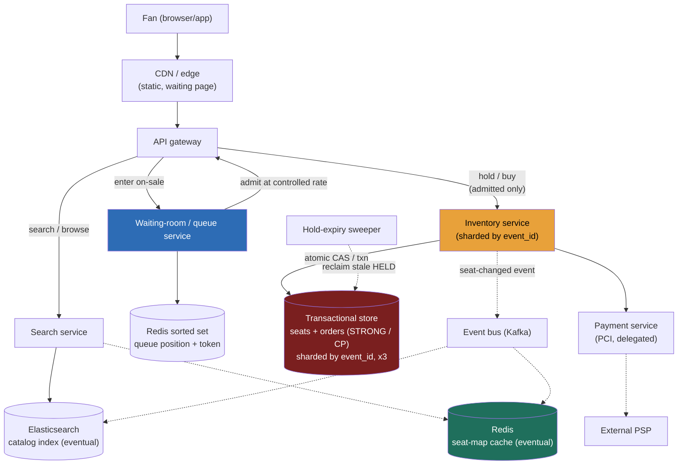

### Learning objectives
- Run the full **RESHADED** spine on a problem whose crux is **contention, not a read:write ratio** - steady-state traffic is boring; the entire design exists for a single-event **flash crowd**.
- Prevent **oversell** with an **atomic seat-state transition** (`AVAILABLE -> HELD(ttl) -> SOLD`), choosing optimistic CAS over pessimistic locking against the contention shape.
- Design **TTL holds** with **lazy-expiry** reclaim, and place the payment flow so a slow processor never causes an oversell.
- See the virtual waiting room's real job: not fairness garnish but the **device that caps the admitted rate**, bounding the per-event write rate so the strongly-consistent inventory shard survives.
- Draw the **strong-vs-eventual boundary** exactly where money and seats demand strong - and operate at Director altitude: quantify the cost, delegate payments/PCI and fraud.

### Intuition first
Picture a stadium with **60,000 seats** going on sale at 10:00:00, and **two million** fans hammering refresh. Demand outnumbers supply **33:1**, and almost all of it arrives in the *same second*. That is the whole problem: not "serve a lot of traffic" (steady state is a sleepy ~115 bookings/sec) but **"how do two million people fight over sixty thousand seats without the same seat being sold twice, and without the stampede flattening the system."** Two mechanisms carry the design, and they are *partners*. First, **a seat can be claimed by exactly one person at a time** - a temporary **hold** (a 10-minute reservation that auto-expires if you don't pay), where the moment of claiming is **atomic**: of a thousand people clicking the same green seat, the database lets exactly one win. Second, you don't let two million people onto the buying floor at once - a **virtual waiting room** admits a controlled trickle. The insight most people miss: the line isn't there to be polite. **The line is what makes the atomic-claim core survivable** - by capping arrivals per second, it bounds how hard the strongly-consistent inventory is hammered. Hold that picture: a tiny strongly-consistent core (seats, money) protected behind a big, cheap, edge-scalable front gate (the queue).

That asymmetry is the opposite of the read-heavy, cache-everything intuition from Instagram/Twitter - and caching your way out of a *correctness-under-contention* problem is the first thing this question tests.

---

## R - Requirements

> Pin down what you're building, cut scope to a defensible core, and state the skew out loud - but here the load-bearing fact isn't a ratio, it's the **contention profile of a flash sale**.

**Clarifying questions I'd ask (with assumed answers):**
- *Steady bookings, or flash on-sales?* → **Flash on-sales are the design driver.** One event with **2M fans for 60K seats** is the problem; steady state is easy.
- *Reserved seating or general admission?* → **Both** - different contention shapes (per-seat rows vs one hot counter). Reserved is the main case; GA a variant.
- *How long to complete payment?* → A **hold TTL of ~10 minutes** - long enough to clear a payment processor, short enough that abandoned seats return fast.
- *Is overselling ever acceptable?* → **No. Selling the same seat twice is the cardinal sin** - a correctness invariant (contrast airlines, which oversell deliberately).
- *Latency bar?* → Browse p99 < ~200 ms; the seat-claim transaction < ~500 ms even under contention.

**Functional requirements:**
1. **Browse/search** events by artist, venue, city, date.
2. **View the seat map** with current availability.
3. **Hold** seats temporarily (TTL reservation) during checkout.
4. **Purchase** held seats - never overselling.
5. **Release** holds (explicitly or on TTL expiry).
6. **Admission control:** a waiting room that meters the flash crowd.

**Explicitly CUT (scoping *is* the signal):** dynamic pricing, resale marketplace, transfers, seat recommendations, map rendering, refunds UX, season tickets, fraud onboarding. I scope to **search → seat map → hold → pay → release**, gated by the waiting room, and say so.

**Non-functional requirements:**
- **Strong consistency on inventory and money** - linearizable at the seat level: no oversell, no double-charge. A deliberate **CP** choice for the core.
- **High availability for browse/search** - this tier is **AP**, cache-fronted, eventual.
- **Flash-crowd tolerance** - absorb a 33:1 spike on one event without collapse or oversell.
- **Low latency** - browse p99 < 200 ms; claim p99 < 500 ms.
- **Fairness + abuse resistance** - roughly first-come, and resistant to bots/scalpers (the security NFR people forget).

**The skew, stated - and why the usual framing is a trap.** Steady state is read-heavy, ~200:1 browse:book. But that ratio is **not** what drives the architecture - the crux is **contention concentration**: 2M fans converging on 60K seats in one second (~33K req/s onto *one event's inventory*). The design follows: a small **strongly-consistent** core behind a big **eventually-consistent, edge-scalable** front, with a queue bounding the rate at which they meet.

---

## E - Estimation

> Enough math to make a defensible call. The headline isn't an average; it's the **flash spike** and the **admission rate** that tames it.

**Assumptions:** 500K events on sale; ~5K avg seats/event; 10M DAU browsing ~20 pages/day; ~1M tickets sold/day; 10-min hold TTL.

**Steady browse QPS:** `10M × 20 ÷ 86,400 ≈ 2.3K reads/s`, peak ~5× → **~12K reads/s.** A cached catalog/search tier eats this.

**Steady booking QPS:** `1M ÷ 86,400 ≈ 12 writes/s`; even a 10× peak is **~115 writes/s** - *tiny*. Which is exactly why "just use one Postgres" feels fine and then dies on the flash sale.

**The flash sale (the real headline).**
- One stadium: **60K seats**, **~2M** fans at on-sale → **33:1 demand:supply**.
- Unthrottled, 2M arrivals in the first 60 s ≈ **33K req/s onto a single event's inventory** - and the arrival is a spike at `t=0`, so the instantaneous peak is higher. One strongly-consistent shard would thrash and risk oversell.
- **The waiting room is the lever.** Admit at a controlled **~2,000/s**: 60K seats sell out in ~30 s of buying-floor time while the 2M-deep queue drains over ~15 min (most fans never reach the floor - seats are gone). The number that matters is **not 33K/s - it's the admission rate we choose**, because that is the write rate the inventory core actually sustains.

**Storage:** seats `500K × 5K × ~200 B ≈ 0.5 TB` raw, **~1.5 TB replicated ×3**; orders `~0.4 TB/yr`. **Small** - a sharded transactional store, not a big-data problem. The hardness is contention, not volume.

**Bandwidth:** `12K reads/s × ~5 KB ≈ 60 MB/s` peak - negligible, CDN-absorbable.

**Cache working set:** ~10K hot events × 5K seats × ~50 B ≈ **2.5 GB** - fits in RAM on a couple of cache nodes. Cache the browse; never the authoritative seat state.

**Instance count:** browse tier ~10-15 stateless nodes + cache + search cluster; inventory at a metered ~2K writes/s is **a handful of shards**; the waiting-room tier is edge + Redis, **scaled for the spike, not the average**. The spend is the **front gate and search tier, not the inventory database**.

**What estimation decided:** steady load is trivial; the flash spike on one event is everything; the **admission rate (~2K/s)** is the write rate the core must serve; storage is small; the hot set fits in RAM. The numbers, not taste, drew the strong/eventual line.

---

## S - Storage

> Three data classes with different consistency needs; pick stores by access pattern, not fashion.

**1. Seat inventory + orders + payment state (strongly consistent, write-contended).**
- *Access pattern:* atomically flip a seat `AVAILABLE -> HELD` (one winner under contention); multi-seat purchases **all-or-nothing**; orders durable and linearizable. Volume small (~1.5 TB), correctness absolute.
- *Choice:* a **relational/NewSQL transactional store** - **Postgres/MySQL sharded by `event_id`**, or CockroachDB/Spanner. The pattern needs exactly what relational stores do best: **row-level atomic conditional updates** and **multi-row transactions** (adjacent seats).
- *Rejected - eventually-consistent KV/wide-column (Cassandra LWW) as inventory truth:* last-write-wins can **oversell** - two replicas accept the same seat and converge too late. DynamoDB's conditional writes make a *single-seat* design defensible, but multi-seat atomicity wants real transactions. Choose the store that makes the invariant cheap to hold, not the one that scales easiest for data we don't have much of.

**2. Event catalog + search (read-heavy, AP).**
- *Choice:* **Elasticsearch/OpenSearch** for full-text + faceted search, fronted by Redis/CDN. Staleness of seconds is invisible.
- *Rejected - serving search from the inventory store:* couples the sleepy-but-sacred inventory DB to the 12K-reads/s browse firehose and `LIKE` scans it's terrible at.

**3. The displayed seat map (best-effort, cached).**
- *Choice:* a **Redis seat-map cache** updated from inventory-change events. It is *expected and correct* that two fans see the same seat green and one loses the CAS at claim time - **the cache is a hint; the transaction is the truth.**
- *Rejected - a strongly-consistent displayed map:* serializes every map read against the core under flash load, pointlessly - the authoritative check happens at claim anyway.

**Queue/waiting-room state** lives in a **Redis sorted set** (position = score) - low-state, fast, edge-near.

---

## H - High-level design

> The shape to make visible: a **big eventually-consistent front** (CDN, search, queue) protecting a **small strongly-consistent core** (inventory, orders, payments).



**Happy path, compressed:** browse rides the **CDN → search → Elasticsearch + cached seat map** and never touches the core. At on-sale, fans land in the **waiting room** (Redis sorted set, CDN-served "position N" page); the queue **releases admission tokens at ~2K/s** - the step that bounds the inventory write rate. An admitted fan's seat selection runs as an **atomic conditional update** per seat (one transaction, all-or-nothing for multi-seat); exactly one fan wins, losers get an instant **409 "seat gone, pick another"** with no lock held. Within the TTL, payment goes through the **delegated, PCI-scoped payment service** with an **idempotency key**; on success the same transaction flips `HELD -> SOLD` and writes the order. On failure or expiry the hold releases. Every seat-state change emits to **Kafka**, which repaints the seat-map cache and search index asynchronously.

**The shape to notice:** the load-bearing wall runs between **queue/search/cache (eventual, edge-scaled)** and **inventory/orders/payments (strong, deliberately small)**. The queue keeps traffic crossing that wall at a rate the strong side can serve.

---

## A - API design

> Keep to the calls the requirements demand; status codes and idempotency *are* the correctness story.

```
# --- Browse (eventual, cached) ---
GET  /v1/events?artist=&city=&date=            -> 200 { events:[...] }
GET  /v1/events/{eventId}/seatmap              -> 200 { sections:[{seatId,status}], asOf: <ts> }
                                                  # status is a HINT (cached, eventual)

# --- Enter the on-sale (waiting room) ---
POST /v1/events/{eventId}/queue                -> 200 { queueToken, position, etaSeconds }
GET  /v1/queue/{queueToken}                    -> 200 { position, admitted: false }
                                                  -> 200 { admitted: true, accessToken }  # your turn

# --- Hold (atomic claim; admitted fans only) ---
POST /v1/events/{eventId}/holds                 # requires valid accessToken
  body: { seatIds: ["14F","14G"], accessToken }
  -> 201 { holdId, seatIds, expiresAt }         # all-or-nothing
  -> 409 { takenSeats: ["14G"] }                # at least one lost the CAS -> pick another
  -> 403                                         # no/expired admission token

# --- Purchase (convert hold -> sold, with payment) ---
POST /v1/holds/{holdId}/purchase
  headers: { Idempotency-Key: <uuid> }
  body: { paymentToken }
  -> 200 { orderId, tickets:[...] }
  -> 410 Gone                                    # hold expired before payment (TTL)
  -> 402                                         # payment declined; hold released

# --- Release ---
DELETE /v1/holds/{holdId}                        -> 204
```

**Design notes (each with its rejected alternative):**
- **Hold and purchase are two calls, not one.** *Rejected: a single "buy" call.* Seats must stay claimed while a human enters payment - slow and fallible. Splitting hold (instant, atomic) from purchase (slow, external PSP) lets checkout run under a TTL without holding a DB lock.
- **`Idempotency-Key` on purchase is mandatory.** Double-clicks and client retries otherwise double-charge and could double-book. *Rejected: trusting clients not to retry* - they always retry.
- **The seat-map `status` is explicitly a hint** (`asOf`); the **409 on hold is the real arbiter**.
- **Admission token ≠ a seat.** Reaching the front of the line grants *permission to try*; the seat is won at the atomic hold (the most common point of confusion - see Common mistakes).

---

## D - Data model

> The shard key is the most consequential decision in the problem, because it interacts directly with the flash crowd.

**`seats`** - primary key **`(event_id, seat_id)`**, shard key **`event_id`**; one row per seat carrying `status` (`AVAILABLE`/`HELD`/`SOLD`), the current `hold_id`, the hold's `expires_at` (drives lazy reclaim), price tier, and a `version` for optimistic concurrency.

**`orders`** - primary key `order_id`, sharded by **`event_id`** (colocated with the seats it bought); carries buyer, seat list, `payment_status`, and a **unique `idempotency_key`** - the index that makes purchase exactly-once.

<details>
<summary>Go deeper, full column schemas (IC depth, optional)</summary>

**`seats`:**

| Field | Type | Notes |
|---|---|---|
| `event_id` | int64 | **partition / shard key** |
| `seat_id` | string | e.g. `"S12-R14-14F"`; `(event_id, seat_id)` = primary key |
| `status` | enum | `AVAILABLE` / `HELD` / `SOLD` |
| `hold_id` | uuid (nullable) | current holder, when `HELD` |
| `expires_at` | timestamp (nullable) | TTL of the current hold (drives lazy reclaim) |
| `price_tier` | int | section/price band |
| `version` | int64 | optimistic-concurrency token (CAS) |

**`orders`:**

| Field | Type | Notes |
|---|---|---|
| `order_id` | uuid | primary key |
| `event_id` | int64 | shard key (colocated with the seats it bought) |
| `user_id` | int64 | buyer |
| `seat_ids` | string[] | seats sold |
| `payment_status` | enum | `PENDING` / `PAID` / `REFUNDED` |
| `idempotency_key` | string | unique; dedups retried purchases |
| `created_at` | timestamp | |

**Indexes:** the primary key `(event_id, seat_id)` serves the point CAS; a secondary index on `(event_id, status)` (or a partial index on `status='AVAILABLE'`) speeds seat-map builds and the expiry sweep.

</details>

**Partition / shard key = `event_id`. The load-bearing decision - and it cuts both ways.**
- *Why it's right:* the two hot operations - render a seat map, transact over adjacent seats - are both **scoped to one event**. Event-sharding colocates an event's seats and orders on **one shard**: no cross-shard 2PC, no scatter-gather; order + inventory commit together.
- *Why it looks like a disaster - and isn't:* one mega-event's entire inventory on one shard is a textbook **hot shard** under a 33K/s crowd. **The waiting room is precisely what rescues this**: capping admission to ~2K/s bounds the write rate onto that shard. *The shard key and the queue are co-designed* - event-sharding is only viable **because** the queue caps the per-event rate. Name that link; it's the heart of the problem.
- *Rejected: shard by `seat_id` hash.* It would scatter a hot event's writes evenly - but it **shatters multi-seat atomicity**: 4 adjacent seats now span 4 shards → a **distributed transaction (2PC) on the hottest path**. Shard key buys transaction locality; the queue buys rate control - a different tool for each problem.

**General-admission variant (different contention shape):** GA has no per-seat rows - one availability counter per section, claimed with a conditional decrement that can't go negative (`... SET avail=avail-1 WHERE ... avail > 0`). At extreme contention that single row serializes, so **shard the counter**: split capacity across N shards, decrement a random one, sum on read. *Trade-off:* the exact remaining count becomes approximate to read in exchange for **N× write throughput** - acceptable, since "sold out" only needs all shards drained.

---

## E - Evaluation

> Re-check against the NFRs and hunt the bottlenecks, fixing each while naming its trade-off.

**Re-check vs NFRs:** no-oversell - the atomic seat transition; flash tolerance - the queue capping admission; money - single-shard transactions on `event_id`; browse availability - the decoupled cache/search tier. Now the bottlenecks.

**Bottleneck 1 - oversell / double-booking (the cardinal correctness risk).**
Two fans claim seat 14F in the same millisecond.
*Fix:* an **atomic conditional write (CAS)** - a single statement that tests and sets: `UPDATE seats SET status='HELD', hold_id=?, expires_at=? WHERE ... AND status='AVAILABLE'`. **One winner per seat; losers affect 0 rows and fail fast with a 409**, no lock held; multi-seat is the same predicate in one all-or-nothing transaction. *Rejected:* pessimistic `SELECT FOR UPDATE` - **pessimistic locks form convoys under contention**, serializing losers who should be bouncing to other seats. (On a quorum store the same invariant is a conditional put with W+R>N, the CAP/PACELC lesson-2.8.)

<details>
<summary>Go deeper, CAS vs SELECT FOR UPDATE under 33:1 contention (IC depth, optional)</summary>

With `SELECT ... FOR UPDATE`, every contender for seat 14F acquires (or queues on) a row lock, holds it across its read-decide-write window, and blocks the rest - a **lock convoy**: hundreds of transactions serialized behind one row, inflating p99 dramatically and holding DB connections hostage. The optimistic CAS inverts the failure cost: the database still serializes writes to the row internally, but losers learn "0 rows updated" immediately and retry on a *different* seat - no held lock, no queueing, no connection pinned.

The caveat worth stating: the reason even pessimistic locking *would* survive here at all is that the waiting room has already capped contention to ~2K/s. So the choice is about **failure cost**, not raw survival - and optimistic wins because under 33:1 demand most contenders *should* fail cheaply and move on, not wait in line for a seat that is already gone. Pessimistic locking earns its keep only when most contenders genuinely need *that one* row and must serialize (e.g., balance updates on one account).

</details>

**Bottleneck 2 - the hot event-shard.**
Event-sharding puts a mega-event's inventory on one node; 33K/s would melt it.
*Fix:* the **queue caps admission (~2K/s)** - that's the primary defense; replicate the hot shard for eventual seat-map reads; and **sub-shard by section only if one event exceeds a single shard's write budget**. *Trade-off:* the queue trades immediacy for survivability - fans wait in line, the explicit cost of protecting the core.

**Bottleneck 3 - stale holds (the abandoned-cart leak).**
A fan holds 2 seats and closes the tab; without expiry those seats are dead inventory during the one sale that matters.
*Fix - **lazy expiry as the correctness mechanism**, a sweeper only for hygiene.* The claim condition already reclaims expired holds at write time: `... WHERE status='AVAILABLE' OR (status='HELD' AND expires_at < now())` - the next claimant takes the seat without waiting for any background job. The sweeper just flips long-expired holds so the **cache repaints**. *Rejected:* sweeper-only expiry - a held-then-crashed seat sits dead until the next sweep, intolerable mid-flash-sale. Lazy reclaim costs a slightly richer `WHERE` clause for zero correctness dependence on a timer.

**Bottleneck 4 - the payment race (slow PSP vs the TTL).**
Payment succeeds just as the hold expires - you might sell a seat you already resold.
*Fixes:* (a) **TTL sized far above worst-case PSP latency** (10 min ≫ seconds); (b) **idempotent purchase** (unique key) so retries don't double-charge; (c) at `HELD -> SOLD`, **re-assert the hold in the same transaction** (`WHERE hold_id=? AND status='HELD' AND expires_at>now()`) - if it expired and was resold, the conversion fails and triggers an automatic refund/reconcile (rare); (d) **delegate payments + PCI** behind a clean interface. *Trade-off:* a generous TTL locks abandoned seats longer - accepted to make the race vanishingly rare.

**Bottleneck 5 - the waiting room as a single point / fairness + abuse.**
If the queue dies, the gate fails open (stampede) or closed (no sales).
*Fixes:* replicated Redis, deliberately **low-state and edge-scalable** so it survives the spike that would kill the origin; **fail closed** (throttle to a trickle) on queue loss. For **anti-scalper**: verified-fan pre-registration, per-account/IP rate limits, CAPTCHA/bot detection at the gate, and purchase caps enforced in the transaction. *Trade-off:* verification adds friction and a fraud-vendor dependency - acceptable, because bots draining inventory in seconds is the actual Ticketmaster failure mode. *Delegate the fraud detail to trust-and-safety* with a stated prior (verified-fan + behavioral scoring).

**Closing re-check:** oversell impossible (CAS + re-assert on convert); flash spike survivable (queue-capped rate); money correct (single-shard txn + idempotency); holds self-heal (lazy reclaim); browse unaffected. The CP core stays small; everything that *can* be AP *is*.

---

## D - Design evolution

> Push each dimension up an order of magnitude, find what breaks first, and name what you'd hand to a specialist.

**At 10× (a global mega-tour: 10M fans, multiple stadiums, ~20K admits/s):**
- **The queue, not the database, is what scales.** Push the waiting room fully to the edge (CDN waiting page + regional queue shards), admit per-region, and tune the admission knob to actual sell-through. The inventory core barely changes - admission still caps its rate. *Trade-off:* regional queues mean approximate cross-region fairness, accepted for a horizontally scalable gate.
- **Section-level sub-sharding becomes routine** for the very largest events; cross-section purchases (rare) span shards. **Read path goes global** - regional seat-map caches fed by the Kafka stream; a fan elsewhere sees a seat fill a beat later, fine for a map that was always a hint.

**Hardest trade-offs to defend:**
- **The strong/eventual boundary.** Drawn tight around inventory + orders + payments; everything else AP. The discipline is resisting the urge to make the *displayed map* strong - the claim is the only place truth must hold, and strong map reads would re-couple the browse firehose to the CP core. **Keep the strongly-consistent surface as small as the invariant demands - no larger.**
- **The admission rate.** Too fast re-exposes the core to stampede; too slow enrages fans queuing for seats still available. It's a **live tuning knob** driven by sell-through telemetry - arguably the most operationally important dial in the system.
- **Event-sharding vs seat-distribution.** We bought transaction locality and paid with hot-shard risk that only the queue makes safe - a genuine coupling between two subsystems a naive design treats as independent.

**What I'd revisit if requirements changed:** resale/transfers add an ownership-and-provenance layer (a design of its own); airline-style controlled oversell would invert the invariant and relax the CP core; dynamic pricing would split price from seat-state to avoid contention on the same row.

**Where I'd delegate (the explicit Director move):**
- **Payments/PCI:** *"The payments team owns the PSP integration behind `charge(idempotencyKey, amount, token)`; my prior is tokenized cards + idempotent capture with async reconcile for the rare post-expiry race - they own the SLA and compliance surface."*
- **Fraud/anti-scalper:** *"Trust-and-safety owns bot detection and verified-fan gating; my prior is pre-registration tokens plus behavioral scoring at the queue."*
- **The store bake-off:** *"Storage benchmarks sharded Postgres vs CockroachDB/Spanner on our seat-claim contention and multi-seat p99 under a simulated on-sale; my prior is sharded Postgres for operational familiarity, escalating only if cross-shard transactions become common."* What I keep - the strong/eventual boundary, queue-as-rate-limiter, the atomic claim - and what I hand off, with a stated prior, is the altitude.

---

### Trade-offs table - the pivotal decisions

| Decision | Option A | Option B | Option C | Use when... |
|---|---|---|---|---|
| **Seat-claim concurrency** | **Optimistic conditional write / CAS** (loser fails fast, no lock) | **Pessimistic `SELECT FOR UPDATE`** | **Distributed lock** (Redis/ZooKeeper per seat) | **A** as default - losers bounce cheaply, no lock convoy (our choice). **B** only when contenders must serialize on *that one* row. **C** only if seat truth lives outside one transactional store. |
| **Inventory shard key** | **`event_id`** - single-shard seat map + multi-seat txn | **`seat_id` hash** - spreads one event everywhere | **Section-level sub-shard** | **A** as default, with the **queue** taming the hot shard (our choice). **B** forces 2PC on multi-seat buys. **C** for the largest events exceeding one node. |
| **Inventory store** | **Transactional SQL/NewSQL** (sharded Postgres, CockroachDB, Spanner) | **KV w/ conditional writes** (DynamoDB CAS) | **Eventually-consistent wide-column** (Cassandra LWW) | **A** - row-atomic CAS *and* multi-row transactions (our choice). **B** defensible for single-seat-only. **C** **rejected** - LWW can oversell. |

---

### What interviewers probe here (Director altitude)

- **"What actually prevents two people buying the same seat?"** - *Strong:* the atomic conditional write - the DB serializes the row, exactly one update hits 1 row, the rest fail fast; multi-seat is one transaction; names the CP choice and that **the queue does not prevent oversell** - admission ≠ a seat. *Red flag:* "the queue handles it," or an eventually-consistent store.
- **"What's the real job of the waiting room?"** - *Strong:* it **bounds the per-event write rate** (~2K/s) so the `event_id`-sharded inventory - otherwise a hot partition under 33K/s - survives; it's the device that makes event-sharding viable, not fairness UX. *Red flag:* treats the queue as cosmetic.
- **"Where is your strong/eventual boundary, and why there?"** - *Strong:* strong on inventory + orders + payments; eventual on catalog, search, and the *displayed* map (a hint; the claim is the truth); keeps the CP surface as small as the invariant requires. *Red flag:* "strong everywhere" (melts) or "eventual everywhere" (oversells).
- **"How do holds expire if the sweeper is down?"** - *Strong:* lazy reclaim at write time - correctness never depends on the sweeper; it only repaints the cache. *Red flag:* sweeper-only.
- **"What does this cost, and what would you delegate?"** - *Strong:* the spend is the **edge/queue + search tier**, not the ~1.5 TB inventory DB; delegates payments/PCI and fraud with stated priors; proposes a measured store bake-off. *Red flag:* sizes a giant database, or insists on hand-tuning the DB.

---

### Common mistakes

- **Thinking the queue prevents oversell.** Admission grants *permission to try*, not a seat. Only the atomic seat-state transition prevents oversell - conflating the two is the most common error.
- **Caching your way out of a contention problem.** The crux is correctness under write contention; the cache serves browse and must never be the seat's source of truth.
- **Eventually-consistent inventory.** An AP store with last-write-wins *will* oversell under concurrent claims. Seats are a CP invariant.
- **Sharding inventory by `seat_id`** - it shatters multi-seat atomicity into a distributed transaction on the hottest path. Shard by `event_id`; let the queue tame the heat.
- **No idempotency on purchase / sweeper-only expiry.** Retries double-charge; dead seats wait for a job. Idempotency keys and lazy reclaim are both mandatory.

---

### Interviewer follow-up questions (with model answers)

**Q1. Two fans click the same seat in the same instant. What stops a double-sell?**
> *Model:* The claim is a single atomic conditional update, not a read-then-write: `UPDATE seats SET status='HELD', ... WHERE event_id=? AND seat_id=? AND (status='AVAILABLE' OR (status='HELD' AND expires_at<now()))`. The store serializes writes to the row: exactly one statement affects 1 row; the loser sees 0 rows and instantly returns **409 - pick another seat**, holding no lock. Multi-seat is the same predicate inside one transaction, all-or-nothing. This is a deliberate CP posture - I chose a strongly-consistent store precisely so this single-statement CAS is the entire oversell defense. The queue is *not* part of it; it only controls how many attempts arrive per second.

**Q2. Justify the waiting room beyond "fairness."**
> *Model:* Its real job is **rate control on the strongly-consistent core**. I shard inventory by `event_id` for transaction locality, which puts a mega-event on one shard - a hot partition a 33K/s spike would melt. The waiting room admits ~2K/s, bounding the write rate onto that shard to what a CP node sustains. **Event-sharding is only safe *because* the queue caps the per-event rate - they're co-designed.** Fairness and bot-gating are bonuses. It's also deliberately low-state and edge-scalable (Redis sorted set behind a CDN page) so it survives the spike that would kill the origin, and it fails closed if it degrades.

**Q3. Your payment processor takes 9 seconds. What goes wrong?**
> *Model:* The risk is a race between the hold TTL and payment completion. Three defenses: (1) the TTL (10 min) sits far above worst-case PSP latency, so the common case never races; (2) purchase is idempotent via a unique key, so a timeout retry doesn't double-charge; (3) the `HELD -> SOLD` conversion re-asserts the hold inside the same transaction - if it expired and the seat was resold, conversion fails and triggers an automatic refund/reconcile, which is rare. Payments and PCI I delegate behind `charge(idempotencyKey, amount, token)`. The trade: a generous TTL locks abandoned seats longer - accepted to make the race vanishingly rare.

**Q4. General admission, 10,000 capacity. What changes?**
> *Model:* The contention shape flips from many seat-rows to **one hot counter**: a single `avail` per section, claimed with a conditional decrement that can't go negative (`... SET avail=avail-1 WHERE avail>0`). Same CAS principle - one decrement wins per unit; 0 rows means sold out. The new problem is that one row is the whole section's write hotspot, so I **shard the counter**: split 10,000 across ~10 shards, decrement a random shard, sum on read. Trade-off: the exact remaining count becomes approximate (you sum shards) in exchange for ~N× write throughput - fine, because "sold out" only needs all shards drained.

**Q5. Why not just one big Postgres? Steady state is ~115 writes/s.**
> *Model:* Steady state *is* trivial - that's the trap. The design exists for the **33K/s flash spike concentrated on one event's rows**, which would saturate one node with brutal lock contention, and for keeping the 12K-reads/s browse/search firehose off the sacred inventory DB. So: a small, strongly-consistent, `event_id`-sharded store for inventory + orders + payments only, fed at a queue-capped ~2K/s, with catalog/search/seat-map pushed to an eventually-consistent edge tier. One Postgres conflates a CP correctness core with an AP read firehose - the whole design is about keeping those apart.

---

### Key takeaways
- The crux is **contention, not a read:write ratio.** Steady state is sleepy (~115 bookings/s); the design exists for a single-event flash crowd - 2M fans, 60K seats, **33:1**, ~33K/s at one instant. The lever is the **admission rate (~2K/s)** we choose, not the raw spike.
- **Oversell is prevented by an atomic seat transition, full stop:** `AVAILABLE -> HELD(ttl) -> SOLD` via conditional write/CAS - one winner per seat, losers fail fast with 409, multi-seat = one transaction; a deliberate **CP** choice. Pessimistic locks form convoys; optimistic CAS lets losers bounce.
- **The waiting room's real job is rate control:** it bounds the per-event write rate so the `event_id`-sharded core survives. **Event-sharding and the queue are co-designed.** Admission ≠ a seat.
- **Holds self-heal via lazy reclaim at write time** - correctness never depends on a sweeper; **idempotency keys** make purchase exactly-once; a generous TTL beats the PSP race.
- **Draw the strong/eventual boundary tight:** strong on inventory + orders + payments; eventual on catalog, search, and the displayed map. The spend is the edge/queue + search tier, not the ~1.5 TB DB; **delegate payments/PCI and anti-scalper** with stated priors.

> **Spaced-repetition recap:** Ticketmaster = **high-contention seat reservation** - 2M fans fighting over 60K seats in one instant (33:1), not a steady ratio. Prevent oversell with an **atomic CAS** transition `AVAILABLE->HELD(ttl)->SOLD` (one winner; multi-seat = one txn; **CP**; optimistic over pessimistic). **TTL holds with lazy reclaim** + idempotent purchase. The **waiting room admits ~2K/s** - its real job is bounding the write rate so the **`event_id`-sharded** core survives (queue and shard key co-designed). Strong on inventory/orders/payments; eventual on search + the displayed map (a hint). Delegate payments/PCI and anti-scalper.

---

*End of Lesson 4.14. Ticketmaster inverts the cache-everything reflex of the social-feed problems: the hard part is **correctness under write contention**, solved by a tiny strongly-consistent core (atomic CAS + TTL holds) protected by a big eventually-consistent front gate (the waiting room as rate limiter) - reusing conditional writes and quorum reasoning from 2.7-2.8, sharded counters from 3.16, and search from 3.13. Next: 5.14 Distributed Job Scheduler - the at-least-once / exactly-once execution and time-wheel problem.*
