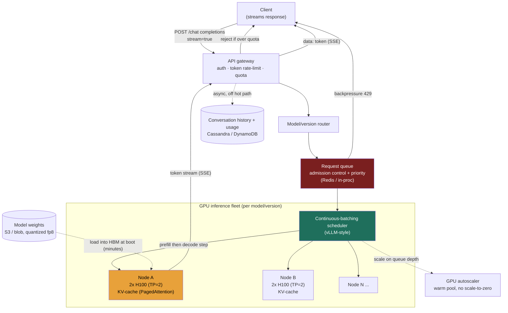

### Learning objectives
- Run the full **RESHADED** spine on a problem where the bottleneck is not storage or network I/O but **GPU compute and HBM** - an inversion that changes which numbers matter.
- **Estimate** the headline figure - **output tokens/sec across the fleet** - from DAU and tokens-per-response, then convert it to a **GPU/node count and a cost floor** ($/GPU-hour, $/1M tokens).
- Explain why the **KV-cache** bounds batch size (and therefore throughput), and why **continuous (in-flight) batching** is the single biggest utilization lever - each against its rejected alternative.
- Design the **SSE token-streaming** path, the **request queue / admission control**, model/version routing, context-length limits, and **token-based rate-limiting** - and articulate the **TTFT-vs-throughput** trade that governs the whole system.
- Operate at **Director altitude**: GPUs are the budget; name the autoscaling cold-start problem, and delegate the inference engine and the model-quality eval.

### Intuition first
Imagine a small fleet of extraordinarily expensive chefs (the GPUs), each of whom can cook for many diners at once - but only if their prep counter (the **KV-cache**, a slab of fast memory) has room. Every diner's order arrives as a sentence the chef must first **read in full** (the prompt - cheap and fast, one parallel glance: *prefill*) and then **answer one word at a time, out loud, while the diner listens** (the response - slow, sequential: *decode*). The genius trick: a chef doesn't cook one order start-to-finish before taking the next; on **every** word-step they drop a word into each in-progress order, **clear finished orders the instant they're done**, and **slide a new order into the freed spot mid-stream**. That is *continuous batching* - the difference between a chef idling between orders and a chef whose hands never stop. The hard constraints are physical: the prep counter only holds so many simultaneous orders (KV-cache memory caps the batch), and there's a tug-of-war between **answering the diner at the table faster** (low time-to-first-word) and **packing more diners around the counter** (high total throughput).

That asymmetry - **a cheap parallel read (prefill) feeding a slow sequential generation (decode), both fighting for a fixed slab of GPU memory** - is the crux. There's no read:write database skew here; the skew that matters is **prefill vs decode**, and the resource that runs out first is **HBM**, not disk. Getting *that* right is the first thing this problem tests.

---

## R - Requirements

**Functional (the defensible core):**
1. A client **submits a prompt** (chat completion, optionally with history and a target `model`) and gets a generated response.
2. The response is **streamed token-by-token** (the user watches words appear).
3. The system **routes** to the correct **model and version** and **enforces context-length limits**.
4. The system **rate-limits / meters** usage per API key - measured in **tokens**, not just requests - with quotas and tiered priority.

**Explicitly CUT (scoping *is* the signal):** model training/fine-tuning, RLHF, the data pipeline, the model architecture itself, multimodal input, tool-calling orchestration, RAG, safety/moderation classifiers, and the chat UI. I scope to **API → queue/admission → GPU inference (batching + KV-cache) → token streaming**, plus routing, limits, autoscaling, and cost - and I say so out loud.

**Clarifying questions (with assumptions):**
- *Which model size?* → a **~70B-parameter** model on a **2-GPU node** (it doesn't fit on one - derived in E). Model size is the biggest cost driver, so I pin it.
- *What latency does the user feel?* → two distinct SLOs: **TTFT (time-to-first-token) < ~1 s p95** and **ITL (inter-token latency) ~30-50 ms** (~20-30 tokens/sec, faster than a person reads). Two budgets, not one latency number.
- *Typical lengths?* → **~1,000 input tokens, ~500 output tokens** per response - this sets the prefill-vs-decode balance.
- *Consistency/durability?* → generation is **best-effort and idempotent on retry**; conversation history persists durably, **off the inference hot path**.

**Non-functional requirements:**
- **High GPU utilization** - GPUs are the budget; idle GPU-seconds are burned money. The entire design exists to keep the fleet busy.
- **Low TTFT** on the interactive path *and* **high aggregate token throughput** - they pull against each other (the central trade).
- **Streaming delivery** over a long-lived connection.
- **Graceful overload** - queue and shed with backpressure (429), never melt the fleet.
- **Elastic but cold-start-aware** - a node takes **minutes to load weights**; you cannot scale to zero and react instantly.
- **Cost-bounded** - a per-1M-token floor the business can defend.

**The skew that matters, stated up front.** No read:write database skew - almost no durable write on the hot path. The asymmetry is **prefill vs decode**: 1,000 input tokens processed in one parallel compute burst (prefill - compute-bound, hundreds of ms), then 500 output tokens generated one at a time (decode - memory-bandwidth-bound, ~30-50 ms each, so ~15-25 s of streaming). Decode dominates wall-clock and is where batching pays; prefill dominates the TTFT budget. The resource that saturates first is **GPU HBM** (holding weights *and* KV-cache), not storage or bandwidth.

---

## E - Estimation

*Enough math to make a defensible call - round hard, state assumptions, flex the knobs.*

**Demand (the headline: output tokens/sec):**
- Assume **30M DAU**, ~10 messages/user/day → **300M requests/day** (the *formula* is the signal; the constant is a dial).
- `300M ÷ 86,400 ≈` **~3,500 req/s average**, peak ~5× → **~20K req/s peak**.
- At ~500 output tokens each: **`300M × 500 ÷ 86,400 ≈ 1.7M output tokens/sec` average, ~10M tokens/sec peak.** *This is the number the fleet is sized against.*
- Prefill is ~3.5M input tokens/sec - 2× the output rate but processed in parallel bursts, so it shows up as TTFT cost, not sustained throughput cost.

**The serving unit (decide once, use everywhere):**
- A **70B** model in fp16 is `70B × 2 B =` **140 GB of weights** - does **not** fit one 80 GB H100. So the **serving unit = one node = 2× H100 = 160 GB HBM**, tensor-parallel (TP=2). Every number below is **per node**. (The consistency trap: size "per GPU" when the model needs two and your fleet count and cost are off by 2×.)

**KV-cache - why it bounds the batch (the heart of the estimate):**
The KV-cache stores attention keys/values for every token already seen, so generating token *N+1* doesn't re-read tokens 1..*N* - and it lives in HBM next to the weights. For a 70B model the result is **~320 KB/token with GQA** (the modern default), i.e. **~1.3 GB per 4K-token sequence**. At fp16 weights (140 GB) only ~20 GB of HBM is left → **~15 concurrent sequences - too few to keep the GPUs busy**. **Quantization + paging + GQA together grow the batch ~15 → ~65 sequences**, which is what saturates the node. This is a real decision with a rejected alternative (fp16 quality purity), eval-gated - see S and Trade-offs.

<details>
<summary>Go deeper, KV-cache byte math, MHA vs GQA (IC depth, optional)</summary>

KV bytes per token = `2 (K and V) × layers × kv_dim × bytes_per_value`. For a 70B-class model (80 layers, 8K hidden, fp16): full multi-head attention (MHA) keeps a K and V vector per attention head → ~`2 × 80 × 8192 × 2 B ≈ 2.5 MB/token`. **Grouped-query attention (GQA)** shares each K/V head across a group of ~8 query heads, shrinking `kv_dim` ~8× → **~320 KB/token**. A 4,096-token sequence: `320 KB × 4,096 ≈ 1.3 GB` (GQA) vs ~10 GB (MHA).

HBM budget per 2×H100 node: 160 GB total. fp16 weights (140 GB) leave ~20 GB → `20 GB ÷ 1.3 GB ≈ 15` concurrent 4K sequences. fp8/int8 weights (~70 GB) leave ~90 GB → `90 ÷ 1.3 ≈ 65-67` sequences, ~4× the batch for a small, eval-gated accuracy cost. PagedAttention's defragmentation adds another ~2-4× *effective* capacity on top, because real sequences rarely use their full reserved length.

</details>

**Per-node throughput, and the node count:**
- At a batch of ~64 with ITL ≈ 33 ms (~30 tok/s per sequence), aggregate node decode ≈ **~2,000 output tokens/sec per node**. (Decode is memory-bandwidth-bound; the batch shares each weight-matrix load across all 64 sequences - *why* batching multiplies throughput.)
- **Average:** `1.7M ÷ 2,000 ≈` **~850 → round ~1,000 nodes**. **Peak:** `9M ÷ 2,000 ≈` **~4,500 nodes ≈ ~9,000 GPUs**.
- *Flex:* an 8-13B model fits one GPU and serves several× the tokens/sec/GPU - the fleet drops an order of magnitude. **The formula `fleet_token_rate ÷ per_node_token_rate` is the thing to show; model size dials it hard.**

**Cost (the line item a Director owns):**
- At ~$3/GPU-hour, a node is **~$6/node-hour** producing `2,000 × 3,600 =` 7.2M output tokens/node-hour.
- **Cost floor ≈ ~$0.85 per 1M output tokens** (compute only) - well below public API prices (~$10-15/1M), which carry margin, input-token cost, and different model economics; the floor reads as defensible, not invented.
- **Peak fleet ≈ `4,500 × $6 ≈` ~$27K/hour ≈ ~$0.65M/day.** Sizing for peak 24/7 is **~$0.2B/year** - exactly why autoscaling and utilization are not optional; the peak-vs-average gap is the whole budget conversation.

**Storage & bandwidth (small, by design):**
- Weights: ~70-140 GB per version in a blob store - trivial to store, but *loading* takes **minutes** (the autoscaling cold-start tax).
- Conversation history: `300M msgs/day × ~2 KB ≈ ~220 TB/year` - sharded durable store, off the hot path.
- Streaming payload: `10M tokens/s × ~4 B ≈ 40 MB/s` - negligible. The cost is **GPU-seconds, not bytes**.

**One-line takeaway from E:** **~1.7M output tokens/sec (≈10M peak) from ~1,000-4,500 two-GPU nodes**, bounded by **KV-cache memory** (hence quantization + batching) at a **~$0.85/1M-token compute floor** - optimize **GPU utilization**, and treat the **peak-vs-average gap** as the budget.

---

## S - Storage

The binding resource is **GPU HBM**, not disk - so the S step is about *what lives in fast memory vs off the hot path*. Four data classes.

**1. The KV-cache (ephemeral, in HBM, the real "hot store").**
- *Access pattern:* written every decode step for every in-flight sequence, read on every subsequent step, discarded on completion; ~1.3 GB per 4K sequence; never leaves the GPU.
- *Choice:* **KV lives in HBM, paged on demand (PagedAttention, vLLM); the batch is the bounded resource.** Its layout *is* the throughput lever.
- *Rejected:* contiguous per-sequence KV allocation - it reserves for the *max* sequence length up front, so a 4K-capacity slot holding a 200-token reply wastes ~95% of its memory to fragmentation. HBM is the scarce resource; fragmentation is pure waste of it.

<details>
<summary>Go deeper, PagedAttention block-table mechanics (IC depth, optional)</summary>

PagedAttention manages KV like OS virtual memory: HBM is divided into fixed-size **blocks** (e.g. 16 tokens of KV each), and each sequence carries a **block table** mapping logical token positions → physical blocks. Memory is allocated block-by-block as the sequence grows, never reserved for the max length, and freed blocks return to a shared pool instantly on eviction. The cost is one level of indirection (a block-table lookup per KV access) and slightly more complex attention kernels; the win is near-zero internal/external fragmentation, which in practice packs ~2-4× more concurrent sequences into the same HBM. Shared prefixes (system prompts) can also map multiple sequences' block tables to the same physical blocks, copy-on-write, which is the mechanism behind prefix caching.

</details>

**2. Model weights (read-mostly, large, must load fast into HBM).**
- *Choice:* a **blob store (S3/GCS)** + local NVMe cache on the node; loaded into HBM at boot; **quantized fp8/int8** to halve the HBM footprint and multiply the KV budget (the E decision).
- *Rejected:* fp32 serving (280 GB - four GPUs, zero KV room) for cost; and re-downloading weights from blob storage on every scale-up with no local cache - it turns the cold-start tax from minutes into many minutes.

**3. The request queue (in-memory, transient, the backpressure point).**
- *Choice:* an **in-memory queue - Redis** or in-process priority queue per replica, depth-based backpressure. Holds requests for milliseconds-to-seconds; a lost request is retried by the client (idempotent).
- *Rejected:* a durable log (**Kafka**) as the *primary* queue - a request older than its TTFT budget is useless, so durable replayable queuing buys a guarantee the use case doesn't need and adds latency. (Kafka *is* right for the async `/batches` path - Evolution.)

**4. Conversation history + usage logs (durable, off the hot path).**
- *Choice:* a **partitioned KV/document store - DynamoDB or Cassandra**, sharded by `userId`/`conversationId`. System of record for chats, billing, audit; the inference path reads assembled context but never blocks on writes here.
- *Rejected:* history in the in-memory tier - losing chat history on a node crash is unacceptable (unlike the KV-cache, which is disposable). Different durability requirement → different store.

---

## H - High-level design



**Happy path, compressed:** the gateway authenticates, checks the **token-based quota** (estimating the request's token cost up front, 429 if over), and the **router** maps the requested `model` to its fleet - each model+version is its own pool because each holds different weights in HBM. The request waits in that pool's **queue**; admission control applies backpressure rather than overloading the GPUs. The **continuous-batching scheduler** pulls it the moment a KV slot frees, runs **prefill** (full prompt, one parallel pass - queue wait + prefill = the TTFT), then each decode step generates one token per in-flight sequence, pushed to clients over **SSE**; finished sequences are **evicted immediately**, freeing their KV slot for a waiting request. On completion the gateway closes the stream and **asynchronously** records the conversation turn and token usage for billing.

The asymmetry is visible: the hot, expensive edge is **scheduler ↔ GPU nodes** (~10M tokens/sec fleet-wide); history and billing hang off the side, asynchronous and cheap.

---

## A - API design

Deliberately small - mirroring the OpenAI-style contract candidates will recognize.

```
# Streaming chat completion (the hot path)
POST /v1/chat/completions
  headers: { Authorization: Bearer <api-key> }
  body: {
    model: "gpt-x",                 # routed to that model+version's fleet
    messages: [ {role, content}... ],  # conversation context (counts toward input tokens)
    stream: true,                   # SSE token streaming
    max_tokens: 500,                # caps output length (and KV growth → cost)
    temperature, top_p, stop        # sampling controls
  }
  → 200  Content-Type: text/event-stream
     data: {"delta":{"content":"Hel"}}      # one chunk per token (or few)
     data: {"delta":{"content":"lo"}}
     ...
     data: {"usage":{"prompt_tokens":1000,"completion_tokens":500}}
     data: [DONE]
  → 429  if over rate limit / quota, or fleet at capacity (with Retry-After)
  → 400  if input + max_tokens exceeds the model's context window

# Non-streaming variant
POST /v1/chat/completions   (stream:false)  → 200 { choices:[...], usage:{...} }

# List models / versions
GET  /v1/models  → 200 { data: [ { id, context_window, ... } ] }

# Async / batch completions (high-throughput, latency-relaxed; separate path)
POST /v1/batches   body: { input_file_id }   → 202 { batch_id, status:"queued" }
GET  /v1/batches/{batch_id}                  → 200 { status, output_file_id? }
```

**Design notes (each a choice with a rejected alternative):**
- **SSE, not WebSocket.** Generation is server→client only; SSE is one-directional, rides plain HTTP/2, auto-reconnects, no custom framing. **Reject WebSocket** (bidirectionality is unused weight) and **reject buffering the full response** on the interactive path - it inflates perceived latency from TTFT to total-generation-time and discards the UX win.
- **`max_tokens` enforced.** Not a UX knob - it **bounds KV-cache growth**, the scarce resource; unbounded generation is a cost and capacity hazard.
- **Token-based rate limiting (TPM alongside RPM).** A "request" can be 50 or 50,000 tokens; metering by tokens is the only way to bound actual GPU consumption. **Reject** request-count-only limits - a few huge-context requests starve the fleet while looking "within limits."
- **A separate async `/batches` path** with no TTFT SLO - queued durably (Kafka), run at giant batch sizes off-peak, much cheaper. **Reject** forcing batch traffic through the interactive path: it either blows the TTFT budget or wastes the cheap-throughput opportunity.

---

## D - Data model

**KV-cache (in HBM, per in-flight sequence):** sequence id, paged K/V tensors managed by a PagedAttention block table, tokens-generated vs `max_tokens`, and a priority tier (interactive vs batch). **No shard key** - it's node-local, disposable scratchpad, never indexed or queried (block-table mechanics in the S-step Go deeper).

**Routing + control-plane data (small, fast, mostly read):**

| Table | Key | Where it lives | Notes |
|---|---|---|---|
| `model_registry` | `model+version` | config store / etcd | maps a `model` to its fleet, context window, weight blob |
| `rate_limits` | `apiKey` | **Redis** | TPM/RPM counters, sliding window; the quota hot path |
| `routing_table` | `model` → pool | gateway memory / etcd | which GPU pool serves which version (A/B weights) |

**Durable entities (off the hot path):**

| Table | Key | Shard key | Store |
|---|---|---|---|
| `conversations` | `conversationId` | `userId` hash | DynamoDB / Cassandra |
| `messages` | `(conversationId, ts)` | `conversationId` | DynamoDB / Cassandra |
| `usage_ledger` | `(apiKey, window)` | `apiKey` hash | durable KV; source of truth for billing |

- **Shard keys:** chat data by `userId`/`conversationId` (a user's history co-located, no cross-shard reads); rate-limit counters by `apiKey` in Redis. The **GPU fleet "shards" by `model+version`** - the load-bearing operational fact: each version is a separate pool because it holds different weights in HBM. **Reject** one undifferentiated GPU pool serving all models - constant multi-GB weight swaps would be catastrophic for utilization.

---

## E - Evaluation

Re-check against the NFRs and break the design on purpose. Five bottlenecks, each fixed with a *named* trade-off.

**Bottleneck 1 - GPU under-utilization from static batching (the central problem).**
With **static batching**, a batch of *N* runs to completion before the next is admitted. Generations vary wildly in length (20 vs 800 tokens), so the batch is held hostage by the **longest** sequence while finished ones idle in KV slots - utilization craters (often <30%), and at ~$6/node-hour that idle time is the budget bleeding out.
*Fix - **continuous (in-flight) batching** (vLLM/Orca-style):* the scheduler works at **per-token granularity** - every decode step can evict a finished sequence and admit a waiting one into the freed KV slot. Typically lifts throughput **2-4×** on the same hardware. *Trade:* a far more complex scheduler (interleaving prefill and decode, managing a dynamic batch); accepted because it's the single biggest cost lever in the system. *Rejected:* static batching - simple, but leaves most of the budget idle.

**Bottleneck 2 - KV-cache exhaustion caps the batch (HBM runs out before compute).**
At fp16 weights only ~15 sequences fit - memory-bound, not compute-bound, throughput low.
*Fix:* the three levers from E - **(a) quantize weights to fp8/int8** (~15 → ~65 sequences), **(b) PagedAttention** (kills fragmentation, ~2-4× effective capacity), **(c) GQA** (~8× smaller KV/token). *Trade:* a small, **eval-gated** accuracy loss and one level of paging indirection - accepted to turn a memory-bound node compute-bound, which is the only way E's numbers hold. *Rejected:* brute-forcing capacity with more/bigger-HBM GPUs - it linearly inflates the most expensive line item; quantization + paging get the capacity nearly free.

**Bottleneck 3 - the TTFT-vs-throughput tension (the trade you must name).**
Bigger batches amortize weight loads → higher throughput, lower $/token - but new requests wait longer for a KV slot and large prefills block the decode loop → higher TTFT. Smaller batches → snappy TTFT, expensive idle GPUs.
*Fix:* (a) cap the interactive batch / set an admission deadline so TTFT stays in budget; (b) **chunked prefill - an inference-team lever** for keeping long prompts from stalling everyone's streaming; (c) **separate interactive vs batch pools** (the `/batches` path runs giant batches with no TTFT SLO). *Trade:* you deliberately leave throughput on the table on the interactive fleet to protect TTFT - a product decision paid in slightly higher $/token. *Rejected:* one global batch size - optimized for throughput it breaks the product (TTFT ≫ 1 s); optimized for TTFT it burns money.

**Bottleneck 4 - autoscaling cold start (you can't scale to zero, can't react in seconds).**
GPUs are too expensive to pin at peak (~$0.2B/yr), but a new node takes **minutes** to load 70-140 GB of weights - reactive autoscaling lags a spike badly.
*Fix:* scale on **queue depth / pending-token backlog** (a leading indicator, not CPU); keep a **warm pool** of pre-loaded standbys; **never scale to zero** for an active model - keep a warm floor and absorb spikes with the queue + backpressure while the pool spins up. *Trade:* the warm pool and floor are **idle GPU cost paid for responsiveness** - the explicit $-vs-latency lever a Director owns. *Rejected:* scale-to-zero (minutes-long cold starts make the product unusable after any lull) and peak-provisioning-always (the reason the bill is a headline).

**Bottleneck 5 - a noisy tenant or huge-context request starves the fleet.**
One client firing 100K-token prompts can monopolize KV and decode cycles - a hot key, in tokens.
*Fix:* **TPM limits** per key in Redis, **per-request context caps** (400 over the window), **priority tiers** in the queue, and **fair-share scheduling** so no tenant's sequences dominate the batch. *Trade:* fairness machinery adds overhead and can delay a legitimate burst; bounded per-tenant throughput protects aggregate fleet health. *Rejected:* request-count-only limiting.

**Re-check vs NFRs:** utilization ✓ (continuous batching + quantization + paging → compute-bound); TTFT *and* throughput ✓ (segmented pools + bounded interactive batch); streaming ✓ (SSE); graceful overload ✓ (queue + 429, never melt); cold-start-aware elasticity ✓ (queue-depth scaling + warm pool, no scale-to-zero); cost floor ✓ (~$0.85/1M tokens, warm-pool idle cost named as the responsiveness premium).

---

## D - Design evolution

**At 10× (≈100M tokens/sec peak, tens of thousands of GPUs):**
- **Disaggregate prefill and decode onto separate fleets.** Prefill is compute-bound and bursty; decode is memory-bandwidth-bound and steady; on one node they contend (Bottleneck 3). At scale a **prefill cluster** produces the KV-cache and hands it to a **decode cluster** (Splitwise/DistServe-style). *Trade:* shipping KV between fleets needs a fast interconnect (NVLink/InfiniBand) - real engineering and bandwidth cost, bought so each stage scales and tunes independently.
- **Prefix-cache shared context.** Many requests share a system prompt or conversation prefix; cache that prefix's KV and reuse it instead of re-running prefill. *Trade:* a prefix cache to manage and invalidate - worth it because prefill is the TTFT cost.
- **Multi-region + GPU-supply routing.** GPUs are scarce and priced unevenly; route by **capacity and cost**, not just latency, with weights pre-staged regionally to dodge the cold-start tax.

**Hardest trade-offs to defend:**
- **TTFT vs throughput vs cost** is a genuine trilemma - you cannot maximize all three. The honest answer is **segment the traffic**: interactive (TTFT-first, smaller batches, warm pools, higher $/token) vs async-batch (throughput-first, giant batches, off-peak, cheapest) - *that's why a serious LLM API exposes both a streaming and a `/batches` endpoint.*
- **Quantization vs quality:** fp8/int8 doubles or quadruples the effective fleet for a "small" accuracy hit - but small must be **measured per model on real evals**, not assumed. A data-quality call gated by an eval suite, not a pure systems decision.
- **Warm-pool size:** every standby is idle money; too few and spikes break TTFT. A direct $/responsiveness dial, set from real traffic spikiness.

**What I'd revisit:** whether the model still fits the 2-GPU unit (a larger frontier model may need 4-8-way parallelism, changing every number). (Speculative decoding - a small draft model proposing tokens the big model verifies in batch - is a further ITL lever I'd have the inference team benchmark before adopting.)

**Where I'd delegate the deep-dive (the Director move):**
- **The inference engine / CUDA kernels:** *"the inference-systems team owns the serving engine behind `generate(prompt, params) → token_stream` - my prior is a vLLM/TensorRT-LLM-class stack with PagedAttention and continuous batching, benchmarked on fp8-vs-fp16 throughput and the TTFT/ITL curve on our real traffic - but I'm not hand-writing attention kernels on the whiteboard."*
- **Model quality / quantization eval** belongs to the **ML/eval team**: they own the accuracy SLO and sign off fp8 vs fp16 per model; my job is supplying the throughput/cost delta so it's an informed trade.
- **Capacity/GPU procurement** (reservations, spot, multi-cloud) is a finance+infra partnership - the single biggest cost decision, owned jointly.

---

## Trade-offs table - the pivotal decisions

| Decision | Option A | Option B | Option C | Use when… |
|---|---|---|---|---|
| **Batching strategy** | **Static batching** - fixed batch run to completion; simple | **Continuous / in-flight batching** - per-token admit/evict (vLLM/Orca) | **Disaggregated prefill+decode** - separate fleets per stage | Static: never, for interactive (kills utilization). **Continuous: the default - 2-4× utilization (the right call).** Disaggregated: very large scale, when prefill/decode contention dominates. |
| **Weight precision** | **fp16** - full quality, 140 GB, ~15 KV seqs/node | **fp8 / int8** - ~70 GB, ~65 KV seqs/node, small accuracy hit | **int4** - smallest, biggest batch, larger accuracy hit | fp16: when the quality SLO forbids any loss and you'll pay the GPUs. **fp8: the usual sweet spot - ~4× batch for a small, eval-gated loss (the right call).** int4: extreme cost pressure, loss-tolerant tasks. |
| **Overload handling** | **Queue + backpressure (429)** - shed gracefully | **Unbounded queue** - accept everything | **Drop/auto-scale only** - rely purely on adding GPUs | **Queue + backpressure + warm-pool autoscale: the right call** - bound latency, never melt GPUs. Unbounded queue: never (TTFT → minutes). Scale-only: cold start makes it too slow alone. |

---

## What interviewers probe here (Director altitude)

- **"What's the bottleneck resource, and what's the relevant 'skew'?"** - *Strong:* **GPU compute + HBM**, not disk/network; the skew is **prefill (cheap parallel burst) vs decode (slow sequential, ~30-50 ms/token)**, and **KV-cache memory caps the batch** → caps throughput. *Red flag:* reaching for a read:write ratio and a giant read cache, as if this were a CRUD app.
- **"Walk me through continuous batching and why it matters."** - *Strong:* static batching waits on the longest generation while finished sequences hold KV slots; continuous batching admits/evicts at per-token granularity, lifting utilization 2-4× - the single biggest cost lever. *Red flag:* "just send bigger batches" with no awareness of the variable-length problem or the TTFT cost.
- **"Estimate the GPU count and cost per million tokens."** - *Strong:* derives output-token rate from DAU (~1.7M/s, ~10M peak), pins the **serving unit** (2-GPU node for 70B), divides by per-node throughput (~2,000 tok/s) → **~1,000-4,500 nodes**, lands the **~$0.85/1M floor**, and names the **peak-vs-average gap** as the budget. *Red flag:* sizes "per GPU" when the model needs two, or quotes numbers with no formula.
- **"How do you autoscale GPUs that cost this much?"** - *Strong:* scale on **queue depth**, keep a **warm pool**, **never scale to zero** (weights take minutes), absorb spikes with queue + backpressure - and names the warm-pool idle cost as the explicit $/responsiveness trade. *Red flag:* "autoscale on CPU" or "scale to zero off-peak."
- **"Where would you delegate?"** - *Strong:* the **inference engine** to a systems team behind `generate()` (prior: vLLM/TensorRT-LLM + PagedAttention), the **quantization eval** to the ML team, while owning the capacity/cost decision. *Red flag:* whiteboarding attention-kernel math (too deep), or "the GPU serves it" with no engine, interface, or cost.

---

## Common mistakes

- **Treating it like a CRUD/read-heavy service.** The bottleneck is GPU HBM + compute; the asymmetry is prefill vs decode. Mis-framing this mis-sizes everything.
- **Sizing "per GPU" for a model that needs several.** 70B fp16 = 140 GB > 80 GB HBM → 2 GPUs/node; ignore it and the fleet and cost are 2× wrong.
- **Forgetting the KV-cache bounds the batch.** Throughput is capped by HBM, not raw FLOPs - which is *why* quantization, PagedAttention, and GQA matter. And static batching leaves the GPU idle on the longest sequence; continuous batching is the default.
- **Request-count rate limits only.** A request can be 50 or 50,000 tokens - meter by **tokens (TPM)** or huge requests starve the fleet; cap `max_tokens` and context, since unbounded generation = unbounded KV growth.
- **Scaling GPUs to zero / reacting in seconds.** Weights take minutes to load - warm pool, queue-depth scaling, never to zero for an active model.

---

## Interviewer follow-up questions (with model answers)

**Q1. Estimate the fleet size and the cost floor, and explain what drives the numbers.**
> *Model:* **30M DAU × 10 msgs/day = 300M requests/day**; at ~500 output tokens that's **1.7M output tokens/sec average, ~10M peak**. Pin the serving unit: 70B fp16 = 140 GB > 80 GB, so a **2-GPU node (TP=2)**. A node does ~**2,000 tok/s** (batch ~64 × ~30 tok/s), so **~850 nodes average → ~4,500 peak (~9K GPUs)**. At ~$3/GPU-hr, ~$6/node-hr ÷ 7.2M tokens/hr → **~$0.85 per 1M output tokens** as a compute floor (public prices ~$10-15/1M add margin + input tokens). The two biggest dials: **model size** (an 8-13B model cuts the fleet ~10×) and the **~5× peak-vs-average gap** - which is exactly why autoscaling and utilization are the budget conversation.

**Q2. Why is the KV-cache the thing that limits throughput, and what do you do about it?**
> *Model:* Generating token *N+1* needs the keys/values of all prior tokens; the KV-cache holds them in **HBM next to the weights**, so concurrency is capped by what fits. For a 70B model it's **~320 KB/token with GQA (~1.3 GB per 4K sequence)**; at fp16 weights only ~15 sequences fit - too few to keep the GPU busy. The three levers: **quantize weights to fp8**, **PagedAttention** to kill fragmentation, and **GQA** - together they grow the batch **~15 → ~65 sequences**, turning a memory-bound node compute-bound. The trade is a small, **eval-gated** accuracy loss; I'd have the ML team sign off per model.

**Q3. Explain the TTFT-vs-throughput trade and how you'd hit both SLOs.**
> *Model:* TTFT is queue wait + prefill; throughput comes from large batches amortizing weight loads. They fight: bigger batches mean new requests wait for KV slots and big prefills block the decode loop. I hit both by **segmenting**: an **interactive pool** with smaller, latency-bounded batches (chunked prefill as an inference-team lever for long prompts) keeping TTFT < ~1 s, and a separate **async `/batches` pool** running giant batches off-peak with no TTFT SLO for the cheapest throughput. I deliberately leave throughput on the table on the interactive fleet - a product decision paid in slightly higher $/token. A single global batch size can't satisfy both.

**Q4. How do you autoscale a fleet where each node costs ~$6/hour and takes minutes to start?**
> *Model:* Not like a stateless web service. Weights are 70-140 GB and take **minutes** to load, so reactive scaling lags spikes and you can't scale to zero for an active model. I scale on **queue depth / pending-token backlog** (a leading indicator, not CPU), keep a **warm pool** of pre-loaded standbys, and a **warm floor** always running; spikes are absorbed by the queue + backpressure (429) while the pool spins up. The warm capacity is **idle GPU cost paid for responsiveness** - the explicit dial, sized from real traffic spikiness. Pinning at peak 24/7 would be ~$0.2B/yr; the entire point is riding between average and peak.

**Q5. Why stream over SSE rather than WebSocket or returning the full response?**
> *Model:* During generation the flow is **server→client only** - the client already sent the whole prompt - so SSE gives exactly what's needed: one-way over plain HTTP/2, auto-reconnect, no custom framing, one `data:` event per token. WebSocket's bidirectionality is unused weight (its own protocol, keep-alives, framing). Buffering the full response discards the core UX - watching words appear - and inflates perceived latency from **TTFT (~1 s)** to **total generation (~15-25 s)**. The wrinkle SSE adds is operational: long-lived streams complicate load-balancer draining and rollouts (in-flight streams must finish), handled with graceful drain.

---

### Key takeaways
- The bottleneck is **GPU compute + HBM**, not disk - no read:write skew; the asymmetry is **prefill (parallel burst) vs decode (sequential, ~30-50 ms/token)**. Size against **output tokens/sec** (~1.7M avg, ~10M peak) and **pin the serving unit** (70B = a 2-GPU node, or your numbers are 2× wrong).
- The **KV-cache (~320 KB/token GQA, ~1.3 GB per 4K sequence) lives in HBM and bounds the batch, hence throughput.** The three levers - **fp8 quantization, PagedAttention, GQA** - grow the batch ~15 → ~65 sequences and turn a memory-bound node compute-bound.
- **Continuous (in-flight) batching** is the single biggest utilization lever (2-4× over static). **Stream tokens over SSE** (reject WebSocket and reject buffering).
- The governing trade is **TTFT vs throughput vs cost**: segment into an **interactive pool** (small batches, warm pools, low TTFT) and an **async `/batches` pool** (giant batches, off-peak, cheapest). Meter by **tokens (TPM)**; cap context and `max_tokens` to bound KV.
- **Director moves:** the cost floor is **~$0.85/1M output tokens** and **~$27K/hr at peak** - utilization and the peak-vs-average gap *are* the budget; autoscale on **queue depth** with a **warm pool, never scale-to-zero**; **delegate the inference engine** behind `generate()` and the **quantization eval** to the ML team - own the cost decision, not the CUDA.

> **Spaced-repetition recap:** LLM serving = a **GPU/HBM-bound** problem, not an I/O one. The skew is **prefill vs decode (~30-50 ms/token)**; size on **output tokens/sec** (~1.7M avg, ~10M peak) over **2-GPU nodes** (~1,000 avg → ~4,500 peak), at a **~$0.85/1M-token floor**. The **KV-cache in HBM caps the batch** → **fp8 + PagedAttention + GQA** grow it ~15 → ~65; **continuous batching** keeps the GPU full (2-4×). **Stream over SSE**, meter by **tokens**, cap context. Autoscale on **queue depth** with a **warm pool, never to zero**. Segment **interactive (low TTFT)** vs **async batch (cheap throughput)** - the trilemma resolved.

---

*End of Lesson 4.16. This problem breaks the read:write framing that drove Twitter and Instagram: here the scarce resource is **GPU HBM**, the "index" that bounds throughput is the **KV-cache**, and the cost line is **GPU-hours**, not storage - a reminder that **RESHADED's R and E steps decide the architecture before any box is drawn.** This concludes the problem set; next is the capstone - the capstone, where you drive and the AI critiques.*
