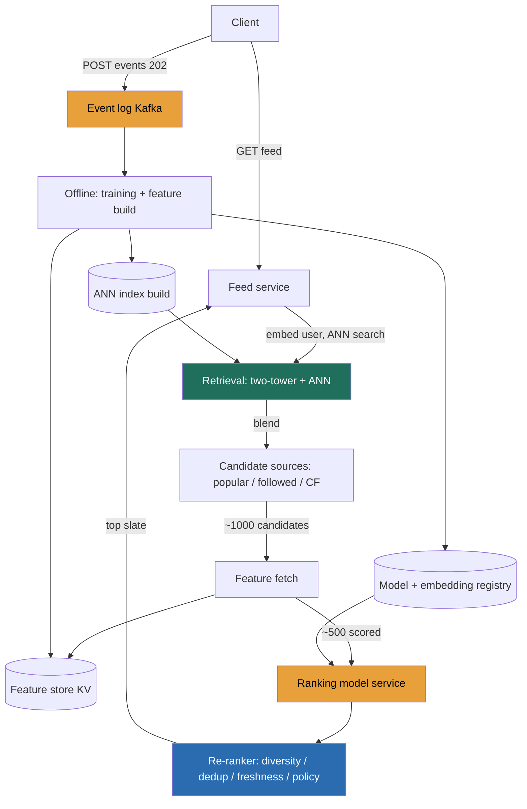

> A recommendation feed looks like a search problem and is actually a **funnel** problem. The mental flip that separates a Director answer from a junior one: **you cannot score the whole catalog on the request path.** There is no world where you run a heavy engagement model over 1-10 billion items in 100 ms. So the system is three stages, each cheaper-per-item than the last is expensive: **retrieval** (candidate generation) casts a wide, cheap net that cuts billions to a few hundred or low thousands; **ranking** scores just those with a heavy model that predicts engagement; **re-ranking** applies diversity, freshness, dedup, and business or policy rules to the top slate. The thing that forces the entire architecture is one sentence, **"you can't score everything,"** and every structural decision below falls out of it: precompute item embeddings offline, retrieve with an approximate nearest-neighbor index, rank a small set, and treat the online A/B test as the only real judge.

### Learning objectives
- Run a full **RESHADED** pass on a "For You" recommender, deriving every structural decision from the impossibility of scoring the whole catalog per request.
- Quantify the system from first principles, **~500M DAU**, **~60k feed QPS** (peak ~150k), a **~50B/day** interaction firehose, **retrieve ~1,000, rank ~500**, and a **100-200 ms** budget, and use those numbers to *force* the funnel.
- Design the pivotal **retrieval** stage: **two-tower candidate generation over an ANN index** blended with cheaper sources, and defend it against inverted-index, collaborative-filtering, and graph alternatives.
- Handle the two problems that decide whether the answer reads as senior: **cold start** (new user, new item) and the **feedback loop** (the model trains on what it showed, so it reinforces itself), plus the **online-vs-offline metric gap** that makes an A/B test the only truth.
- Know where to **build vs delegate**: the serving system, the funnel, and signal logging are yours; the **ranking model architecture, feature engineering, and exploration policy** go to the ranking-ML team with a stated prior.

### Intuition first
Picture a busy **newsroom** the hour before the front page is set. You have a wire that carries millions of stories a day and one front page with room for maybe thirty. Nobody reads all million stories to pick thirty, that would never ship. So the room works in stages. **Interns** grab a big, rough stack of "maybe relevant to our readers" stories fast, by beat, by trending topic, by what this section usually runs (that is **retrieval**, cheap, wide, approximate, cutting a million down to a few hundred). An **editor** then reads that stack closely and orders it by predicted reader interest, using judgment that is far too slow to have applied to the whole wire (that is **ranking**, expensive, applied only to the shortlist). Finally the **front-page editor** enforces the things the ranker doesn't care about: don't run five stories on the same event, keep some variety, respect legal and policy rules, put something fresh above the fold (that is **re-ranking**).

Two consequences fall out and drive the entire design. First, the expensive judgment (the editor and front-page editor) is only ever applied to a **shortlist**, never the firehose, because applying it to the firehose is physically impossible, exactly why retrieval exists and exactly why item "embeddings" (the interns' sense of what each story is about) are computed **once, offline**, not per request. Second, the room only knows if it did well by **watching what readers actually do** the next morning, not by how confident the editor felt, which is why the only honest scoreboard is a live experiment, not an offline metric.

---

## R: Requirements

RESHADED starts by scoping *before* building. The signal is **cutting** to a defensible core and naming, out loud, that scoring the whole catalog per request is off the table, because that single fact dictates everything downstream.

**Functional (the core we will actually build):**
1. **Return a personalized ranked feed** for a user session, a slate of items with a cursor for the next page.
2. **Ingest and log interactions** (impression, click, watch-time, like, skip), the fuel for both training and real-time signals.
3. **Reflect changing interests reasonably fast**, a new interest a user shows should influence the feed within minutes, not the next daily batch.

**Explicitly cut (stated as choices and delegations, not omissions):**
- **The ranking model itself**, its architecture, loss function, and feature engineering. I build the **serving system**, the retrieval-ranking-rerank funnel, and the **signal logging** that feeds training. The model goes to the **ranking-ML team** with a stated prior (in Design evolution). Pretending to design the model on the whiteboard burns the session on the one thing this round should delegate.
- **Content ingestion and creation** (how items enter the catalog). We consume the catalog and its metadata; producing it is a separate system.
- **Moderation and policy classification**. We *consume* a policy or safety signal per item in re-rank; the classifiers that produce it are their own workstream.

**Clarifying questions (and the assumptions if waved on):**
- *Scale?* **~500M DAU**, roughly **10 feed requests/user/day**, catalog **~1-10B items**.
- *Latency?* **Feed request p99 ~100-200 ms** end to end. This is the product; it is why the funnel exists.
- *Freshness?* A new item should be **discoverable within minutes** of publish, and a user's recent behavior should move the feed within minutes.
- *Cold start?* Must degrade **gracefully** for a brand-new user (no history) and a brand-new item (no engagement), not return an empty or broken feed.

**Non-functional requirements:**
- **Read-heavy at extreme scale**: ~60k feed QPS average, peak ~150k, each request fanning out to retrieval + a batch of feature reads + model inference.
- **Tight tail latency**: p99 100-200 ms across the whole funnel, which is the constraint that sizes every stage's budget.
- **Freshness on two axes**: item freshness (minutes to be servable) and signal freshness (recent behavior reflected in minutes).
- **Availability over strict consistency** on the feed path: a slightly stale feed or a slightly stale count is fine; the feed being *down* or *empty* is not. **AP-leaning.** The interaction log, by contrast, must be **durable** (it is the training data and the source of truth for what happened).

> The requirement that secretly licenses the whole architecture is **"the feed must return in ~150 ms and the catalog is billions of items."** Those two together make it *illegal* to score everything, which is what forces retrieval, precomputed embeddings, and a small ranked set. Juniors skip straight to "rank the items" and never explain how the item set got small enough to rank.

---

## E: Estimation

Enough math to make a defensible call. Four anchors, everything derived from them: **(1) 500M DAU, (2) ~10 feed requests/user/day, (3) catalog ~1-10B items, (4) retrieve ~1,000 candidates and rank ~500 per request.**

**Feed request (read) QPS:** 500M × 10 = **5B feed requests/day** → 5B / 86,400 s ≈ **~58k QPS average**, round to **~60k**; peak ~2.5× ≈ **~150k QPS**. Each request drives one retrieval, ~1,000 feature lookups, and ~500 model scorings, so the *internal* work is orders of magnitude larger than the request count.

**The number that makes brute force impossible:** 60k requests/s × a 1B-item catalog = **~6 × 10¹³ item-scorings/s** if you scored everything. Even at an optimistic 1M scorings/core/s for a heavy model, that is **~60 million cores running continuously**, a physical and financial impossibility. Retrieval cutting to ~1,000 drops it to 60k × 1,000 = **~6 × 10⁷ scorings/s**, six orders of magnitude smaller, and *that* is a fleet you can actually build. This one comparison is the entire justification for the funnel.

**Interaction event firehose (write side):** ~500M DAU each generating many impressions/clicks/watches per session, call it **~50B events/day** → 50B / 86,400 ≈ **~580k events/s average**, round **~600k**, peak **~1.5M/s**. At ~200 bytes/event that is **~10 TB/day** landing in the log, **~3.6 PB/year** to the lake. This is a Kafka-class firehose, not a database write path.

**Latency budget (the p99 you must fit ~150 ms into):**
- **Retrieval (ANN + blend):** ~20 ms.
- **Feature fetch** for ~1,000 candidates (batched KV reads): ~10 ms.
- **Ranking model** over ~500 candidates (batched inference): ~30-50 ms, the biggest single slice.
- **Re-rank** (diversity, dedup, freshness, policy): ~5 ms.
- Plus network, serialization, and headroom. The budget is why ranking scores hundreds, not thousands, and why features are precomputed, not computed inline.

**Embedding and feature storage:**
- **Item embeddings for ANN:** ~1B servable items × a 256-dim vector. At float32 (4 bytes) that is ~1 KB/item ≈ **~1 TB**; int8-quantized ≈ **~256 GB**. Fits in RAM across a sharded ANN cluster, which is exactly why retrieval can be ~20 ms.
- **Online feature store:** user features ~500M × ~2 KB ≈ **~1 TB**; item features ~1B × ~2 KB ≈ **~2 TB**. A low-latency KV, sized for ~60M feature reads/s at peak (60k requests × 1,000 candidates), which forces batched multi-get and heavy caching of hot item features.

**Why the funnel and precomputed embeddings are *mandatory*, not merely nice:** you cannot run the item-side model per request (that is the 60M-core wall), so item embeddings are computed **offline** and indexed; you cannot score the retrieved-and-unfiltered billions, so retrieval must be an **approximate** vector search, not exact; and you cannot fetch and score more than ~hundreds inside 150 ms, so ranking operates on a **small** set. Every one of these is arithmetic, not taste.

> The three numbers I carry into every later decision: **~60k feed QPS** (peak ~150k, the read machine), **~50B events/day** (the training + real-time firehose), and **~6 × 10¹³ vs ~6 × 10⁷ scorings/s** (brute force vs funnel, six orders of magnitude, the reason retrieval exists).

---

## S: Storage

Five distinct data shapes, each with a different access pattern. Naming them separately, and rejecting one-database-for-everything, is the signal.

| Data | Shape & access pattern | Store **type** | Real system | Rejected alternative (and why) |
|---|---|---|---|---|
| **Item embeddings** (retrieval index) | ~1B fixed-length vectors, queried by approximate nearest-neighbor at ~60k QPS, rebuilt offline | **ANN vector index** | **FAISS / ScaNN / HNSW**, served as a sharded index | A relational or KV store with a similarity `ORDER BY`, no store does billion-scale vector search in ~20 ms; you need an ANN structure, not exact scan. |
| **User + item features** (online) | Point/batch reads by id, ~60M reads/s at peak, refreshed continuously | **Low-latency KV / feature store** | **Redis / DynamoDB / a feature store (Feast-style)** | Computing features inline from raw events per request, blows the 10 ms fetch budget; features must be **materialized** ahead of the request. |
| **Candidate lists** (precomputed sources) | Small ranked lists (popular, followed-source, per-segment), read per request, refreshed every few minutes | **KV / cache** | **Redis** with short TTLs | Recomputing "trending" on every request, wasted work; these lists change slowly relative to request rate. |
| **Interaction event log** | Append-only firehose, ~600k/s, consumed by training + analytics + real-time features | **Log → lake/warehouse** | **Kafka** → S3/BigQuery/Spark | Writing engagement into the serving KV, pollutes the low-latency path with analytics load and can't be replayed for training. |
| **Model + embedding artifacts** | Large, versioned, write-rarely read-on-deploy, must roll back | **Object store + registry** | **S3 + a model registry** | Baking the model into the service image, no clean versioning, no fast rollback, no A/B of two model versions side by side. |

Two sub-decisions worth defending:
- **ANN, not exact nearest neighbor.** Approximate search trades a small, measurable recall loss (say 95-98% of the true top-K) for a ~100-1000× latency win. *Rejected:* exact search, correct but far too slow at billion scale; the recall we lose is invisible next to the ranker re-scoring the set anyway.
- **A feature store between events and serving.** Features are **materialized** (batch for slow-moving, streaming for session-fresh) and read by id at serving time. *Rejected:* computing features from the raw log inline, it cannot meet the 10 ms budget and couples serving to the analytics pipeline.

---

## H: High-level design

Two planes matter, an **online serving plane** (the funnel that answers each feed request in ~150 ms) and an **offline plane** (training, embedding, index build, feature materialization). The key statement is that **retrieval reads a precomputed ANN index and cheap candidate lists, ranking scores only the retrieved set, and everything expensive was computed offline.**



**Retrieval (candidate generation, ~20 ms).** A **two-tower** model is trained offline: a **user tower** turns the user's features and recent history into an embedding, and an **item tower** turns each item into an embedding. The item embeddings are computed **offline** and loaded into an **ANN index**. At serving time we embed the *user* on the fly (one cheap forward pass) and do an **ANN search** for the nearest few hundred item vectors. This is blended with cheaper candidate sources, recently-popular items, items from sources the user follows, and collaborative-filtering neighbors, so the funnel isn't hostage to one model. The blend of sources yields ~1,000 candidates.

**Feature fetch (~10 ms).** For the ~1,000 candidates, the feed service does a **batched multi-get** against the feature store for item features, joined with the already-loaded user features. Hot item features are cached aggressively; nothing is computed from raw events here.

**Ranking (~30-50 ms, the heavy stage).** A **ranking service** scores the ~500 top candidates with the heavy model, predicting engagement, for example p(watch), p(like), predicted watch-time, as a **batched inference** call (GPU/accelerator, one batch per request). Because the set is small and batched, the heavy model fits the budget.

**Re-ranking (~5 ms).** The top-scored slate passes through a **re-ranker** that applies rules the pointwise ranker ignores: **diversity** (don't return ten near-identical items), **dedup** (drop items already seen), **freshness** boosts, and **policy/business** constraints. The result is the returned page.

**Offline plane.** The interaction log trains the two-tower and ranking models, rebuilds the **item-embedding ANN index** (batch nightly plus a near-real-time path for new items), materializes **features** into the store, and publishes **versioned artifacts** to the registry that the serving plane loads. Every expensive computation lives here, off the request path.

---

## A: API design

Keep it small. The non-obvious choices are the **cursor-based feed**, the **fire-and-forget event beacon**, and the **internal ranking RPC** that keeps the model behind a stable contract.

```
# --- Feed (the read path) ---
GET /v1/feed?cursor=<opaque>&limit=20
  -> 200 { items: [{ item_id, score, reason }], next_cursor }
     # personalized ranked slate; cursor encodes session + position, NOT an offset

# --- Interaction events (fire-and-forget beacon) ---
POST /v1/events
  body: { session_id, item_id, type: impression|click|watch|like|skip, dwell_ms, position }
  -> 202                        # accepted, off the critical path; powers counts, features, training

# --- Internal: ranking RPC (service-to-service) ---
POST /internal/rank
  body: { user_context, candidates:[item_id...], model_version }
  -> { scored:[{ item_id, score }] }   # feed service calls this; model swappable behind the contract
```

Three decisions worth defending. **Events are 202 fire-and-forget, not synchronous.** A feed session generates dozens of impression/dwell beacons; blocking the client on each, or worse routing them through a synchronous "record and re-rank" call, would put a ~600k/s firehose on the critical path and couple playback to the write side. *Rejected:* synchronous event writes that return an updated feed, the beacon must never gate the experience, and the log's job is durability plus asynchronous consumption. **The feed uses an opaque cursor, not an offset.** The feed is a live, mutating stream; offset pagination re-shows or skips items as the underlying candidate set changes, and it forces re-running the funnel from the top. *Rejected:* page-number pagination, broken on a personalized live feed. **Ranking is an internal RPC behind a version pointer**, so the ML team can ship a new model or A/B two versions without the feed service changing. *Rejected:* embedding the model in the feed service, no clean rollout, rollback, or side-by-side experiment.

---

## D: Data model

**Partition keys and the event schema are the load-bearing details, not column inventories:**

- **User profile / features**, **PK `user_id`**: point read per request (the user tower input and ranking features), so key by user and colocate the whole profile in one lookup. Refreshed by the offline + streaming feature pipelines.
- **Item features + embedding**, **PK `item_id`**: batch-read per request for the ~1,000 candidates, so key by item for even spread and cacheable hot items. The embedding is a field here for training/rebuild, but the *served* copy lives in the ANN index.
- **Interaction events**, an append-only log **keyed by `user_id`** (or `session_id`) for partitioning: a user's events stream through a bounded set of partitions, users parallelize across the cluster, and the log is replayable for training and for recomputing features. Each event carries `{user_id, item_id, type, dwell_ms, position, model_version, ts}`, and `model_version` and `position` are non-negotiable (they are what let training *correct for position bias* and attribute engagement to the model that produced it).
- **Model / embedding version pointer**, a small record naming the currently-serving `model_version` and `index_version`, so serving, logging, and rollback all agree on which artifacts are live.

<details>
<summary>Go deeper, why the event log logs position and model_version (IC depth, optional)</summary>

Training data for the ranker is "we showed item X at position P and the user did/didn't engage." If you train on that naively, the model learns that **position** predicts engagement (top slots get more clicks regardless of relevance), so it just re-learns your old ranking, a feedback loop. Logging `position` lets training apply **position-bias correction** (for example inverse-propensity weighting), estimating engagement as if position were neutral. Logging `model_version` lets you attribute logged engagement to the exact model that produced the slate, which is what makes **counterfactual** evaluation and clean A/B attribution possible. Dropping these two fields quietly bakes the current ranking into the next model.

</details>

---

## E: Evaluation

Stress your own design: re-check the NFRs, hunt the bottlenecks, fix each **naming the trade**. An architecture with no self-identified failure modes reads as untested, and for a recommender the failures are subtle (they show up as flat metrics, not crashes).

**Bottleneck 1, latency across the funnel.** Scoring must fit ~150 ms p99 while touching ~1,000 candidates and a heavy model.
> **Fix, the funnel plus ANN plus batched inference.** Retrieval is an ANN lookup (~20 ms) against a precomputed index, features are a batched multi-get (~10 ms), and the ranker scores a **small** set (~500) as one batched forward pass (~30-50 ms). **Trade:** approximate retrieval (a few percent recall loss) and a capped candidate set for a budget you can actually hit. *Rejected:* scoring more items or exact NN, both blow the budget for gains the ranker erases anyway.

**Bottleneck 2, cold start (the question that separates senior answers).** A brand-new user has no history for the user tower; a brand-new item has no engagement and no learned embedding.
> **Fix, two different paths.** *New user:* fall back to **popularity, context, and onboarding signals**, geo/device/time-of-day popular items and any declared interests, then converge to personalized as the first interactions arrive within minutes. *New item:* give it a **content-based embedding** (from its metadata/media, so the item tower can place it without engagement history) and route a slice of traffic to it via **exploration** so it can earn signal. **Trade:** cold users/items get a slightly less tuned feed and exploration spends some impressions on unproven items, in exchange for never returning an empty feed and never starving new content. *Rejected:* requiring history before serving, that is a dead feed on day one and a catalog where new items can never break in.

**Bottleneck 3, the feedback loop, popularity bias, and filter bubbles.** The model trains on **what it chose to show**. Items it shows get engagement, which trains it to show them more; items it never shows get no signal and vanish. Left alone the system narrows to a self-reinforcing bubble and over-concentrates on already-popular items.
> **Fix, break the loop deliberately in three places.** **Exploration** (epsilon-greedy or contextual bandits) spends a small budget showing uncertain items to gather unbiased signal; **position-bias correction** in training (log and de-weight position, per the data-model note) stops the model from just re-learning its own ranking; **diversity in re-rank** caps near-duplicates and over-concentration. **Trade:** exploration and diversity cost some short-term engagement (you show items you're less sure about) to buy long-term catalog health and model freshness. *Rejected:* pure exploitation (always show the current best guess), highest short-term CTR, guaranteed long-term collapse into a bubble.

**Bottleneck 4, embedding/feature staleness and index rebuild cadence.** Item embeddings and the ANN index are built offline; a purely nightly rebuild means new items and shifting interests are invisible for hours, violating the minutes-freshness NFR.
> **Fix, a two-speed pipeline.** A **batch rebuild** (nightly) for the bulk index, plus a **near-real-time path** that embeds and inserts new items and refreshes session features within minutes, and **streaming features** for recent behavior. **Trade:** a more complex two-path pipeline and eventual (minutes-lagged) freshness for meeting the freshness NFR without rebuilding a billion-vector index continuously. *Rejected:* rebuild-everything-continuously (impossibly expensive) or nightly-only (stale by hours).

**Bottleneck 5, hot items and thundering herd.** A viral item is a hot feature key and a hot candidate; a synchronized event (a trending moment) spikes retrieval and feature reads.
> **Fix, cache hot item features and candidate lists with short TTLs, and shard the ANN index** so no single node owns the hot set alone. **Trade:** slightly stale hot-item features (a few seconds) for absorbing the spike. *Rejected:* recomputing hot candidates per request, which turns a trend into a self-inflicted overload.

**The online-vs-offline metric gap (say this explicitly, it is the strongest Director signal here).** Offline you can measure AUC or NDCG on held-out logs, and they can **rise while online engagement stays flat or drops**. Three reasons: **position bias** (offline labels came from what the old model showed, at the positions it showed them), the **feedback loop** (offline data is not what the *new* model would have shown), and **proxy-metric mismatch** (optimizing p(click) offline can hurt the metric you actually care about, retention, satisfaction, creator health). The consequence is a hard rule: **the only real judge of a recommender is an online A/B test** on live traffic, with guardrail metrics, not an offline score. A candidate who ships on offline gains alone is a red flag; a Director says "offline gates the experiment, the A/B decides the launch."

**Re-check vs NFRs:** 150 ms p99 → funnel + ANN + batched inference within budget ✓; freshness in minutes → two-speed index + streaming features ✓; graceful cold start → popularity/context for new users, content-based embedding + exploration for new items ✓; huge read scale → precomputed embeddings, cached hot features, sharded ANN ✓; durability of signal → append-only replayable event log ✓; and the guardrail that the *launch* decision is an online A/B, not an offline metric ✓.

---

## D: Design evolution

**At 10× (~600k feed QPS, ~500B events/day, a fatter catalog):**
- **Add a cheap pre-ranker between retrieval and the heavy ranker**, making it a **three-stage funnel**: retrieval yields ~thousands, a **lightweight model** cuts to ~hundreds, the heavy ranker scores those. This is the standard way to widen the candidate set (better recall) without paying the heavy model on thousands of items. **Trade:** a third model to train and keep calibrated for a much wider top-of-funnel; worth it once the heavy ranker's budget is the wall.
- **Real-time session features via streaming.** As behavior data grows, the biggest freshness win is folding *this session's* clicks into features within seconds, so the feed reacts mid-session. **Trade:** a streaming feature path (more moving parts) for within-session responsiveness.
- **Multi-objective ranking** replaces single-objective CTR. Optimizing pure CTR is a trap: it rewards clickbait, punishes long-form value, ignores creator equity, and erodes long-term retention. The evolved ranker predicts several objectives (engagement, dwell/watch-time, diversity, creator equity, predicted long-term retention) and combines them with tunable weights, and **those weights are a product/leadership decision, not an ML detail**, because they encode what the business values. **Trade:** a harder-to-tune, harder-to-explain objective for a feed that optimizes the real goal instead of a clickable proxy.
- **Privacy and on-device trends.** As privacy constraints tighten, expect pressure toward on-device re-ranking and less centralized raw-signal collection; the funnel survives, but some personalization moves to the edge.

**Delegation with stated priors (the explicit Director signal):**
- **Ranking model architecture + feature engineering → the ranking-ML team.** My prior: **two-tower retrieval + a gradient-boosted or deep ranker, multi-objective, and calibrated** (so scores mean probabilities you can threshold and combine). I own the serving contract, the latency budget the model must fit, and the signal logging; they own the model.
- **Exploration policy → the same team.** My prior: **contextual bandits over epsilon-greedy** once the infrastructure supports it, with a bounded exploration budget I set as a product lever.
- **Content-based item embeddings for cold start → the same team**, my prior: embed from item metadata/media so a brand-new item is placeable on day zero.

**The hardest trade-offs (genuinely contested):**
1. **How wide to retrieve.** Wider recall finds more good items but costs pre-ranker/ranker compute; the three-stage funnel exists precisely to push recall up without paying the heavy model for it.
2. **Exploration budget.** Too little and the model bubbles and starves new content; too much and short-term engagement drops. A monitored dial, not a constant.
3. **Objective weights.** Every extra objective (diversity, creator equity, retention) trades measurable short-term engagement for harder-to-measure long-term health, the call a Director actually owns.

**What I'd revisit first:** the **feedback-loop and exploration machinery** (it decides whether the system stays healthy or collapses into a bubble over months, and it is where adversaries and popularity bias both live), and the **online experimentation platform** (because it is the only thing that tells the truth about a launch).

---

### Trade-offs table: the pivotal decisions

| Decision | Option A | Option B | Option C (chosen, usually) | Use when… |
|---|---|---|---|---|
| **Retrieval approach** | **Inverted-index / tag match** | **Collaborative filtering** | **Two-tower ANN**, blended with popular/followed/CF | A: strong explicit tags, small catalog. B: dense interaction data, weak content signal. **C: billion-scale personalized retrieval in ~20 ms; blend sources so the funnel isn't hostage to one model.** |
| **Ranking objective** | **Pointwise CTR** | **Pairwise / listwise** | **Multi-objective, calibrated** (engagement + dwell + diversity + retention) | A: simplest, but clickbait-prone. B: better ordering when relative order is what matters. **C: any real feed, because pure CTR is a trap that optimizes the wrong thing.** |
| **Serving model** | **Precomputed feed** (rank offline, store per user) | **Fully online per request** | **Online funnel with precomputed embeddings + cached candidates** | A: low request rate, slow-moving interests. B: never at this scale (too expensive per request). **C: real-time personalization at ~60k QPS with a freshness NFR.** |
| **Exploration** | **None (pure exploit)** | **Epsilon-greedy** | **Contextual bandits** | A: never at scale, guarantees a bubble. B: simple, decent unbiased signal. **C: mature infra, best exploration/exploitation trade and per-context targeting.** |

---

### What interviewers probe here (Director altitude)

They are not checking whether you can name "two-tower", they're checking that you grasp the feed as a **funnel forced by "you can't score everything"**, can reason about **cold start** and the **feedback loop**, know that **online A/B is the only truth**, and know what to delegate.

- **"You can't score 10B items in 100 ms. How do you build the feed?"** *Strong:* the three-part funnel, retrieval (two-tower + ANN over precomputed embeddings) cuts billions to ~1,000, ranking scores ~500 with the heavy model, re-rank applies diversity/policy; cites the ~6 × 10¹³ vs ~6 × 10⁷ scorings/s comparison. *Red flag:* "score all the items and sort," no retrieval stage, no sense of the scale wall.
- **"How do you handle a brand-new user and a brand-new item?"** *Strong:* new user → popularity/context/onboarding, converge in minutes; new item → content-based embedding + exploration to earn signal. *Red flag:* "wait until we have data," a dead feed and a catalog new items can't enter.
- **"Your offline metrics improved but online engagement is flat. Why?"** *Strong:* position bias in the logs, the feedback loop (offline data isn't what the new model would show), proxy-metric mismatch, therefore **you must A/B**; offline only gates the experiment. *Red flag:* "ship it, AUC went up."
- **"What do you build vs delegate?"** *Strong:* build the serving system, the funnel, and signal logging; **delegate the ranking model, feature engineering, and exploration policy** to the ML team with a prior (two-tower + calibrated multi-objective ranker, bandits). *Red flag:* claiming to design the model architecture live, or delegating with no prior.

---

### Common mistakes

- **Scoring the whole catalog (no retrieval stage).** The single biggest tell. You cannot run a heavy model over billions of items per request; retrieval to ~1,000 is what makes ranking possible, and precomputed embeddings are what make retrieval fast.
- **Optimizing raw CTR only.** Pure CTR rewards clickbait and short-term engagement, erodes retention, diversity, and creator health. Real feeds are multi-objective, and the weights are a leadership call.
- **Ignoring the feedback loop.** Training only on what you showed reinforces itself into a popularity bubble and starves new content; without exploration, position-bias correction, and diversity, the feed narrows over months.
- **Trusting offline metrics.** Offline AUC/NDCG can rise while online engagement is flat because of position bias, the feedback loop, and proxy mismatch. The online A/B test is the only judge of a launch.
- **Computing features or item embeddings on the request path.** Both blow the latency budget; features are materialized ahead of time and item embeddings are precomputed offline and indexed.

---

### Interviewer follow-up questions (with model answers)

**Q1. Walk me from a feed request to the returned slate, and tell me where the 150 ms goes.**
> *Model:* Embed the user (one cheap forward pass) and **ANN-search** the precomputed item index, blended with cached popular/followed/CF lists, to get ~1,000 candidates (~20 ms). **Batch-fetch** their features from the feature store, joined with the already-loaded user features (~10 ms). Score the top ~500 with the **heavy ranker** as one batched inference call (~30-50 ms, the biggest slice). **Re-rank** for diversity, dedup, freshness, and policy (~5 ms), and return a page with a cursor. The budget is why ranking sees hundreds not thousands, and why nothing is computed from raw events inline, the expensive work (embeddings, index, features, model) was all done offline.

**Q2. A new short-video creator uploads their first clip. How does it ever get seen if the model has no engagement data for it?**
> *Model:* Two mechanisms. First, a **content-based embedding** from the clip's metadata and media, so the item tower can place it near similar items in the ANN index without any engagement history, it's retrievable from minute one. Second, an **exploration budget** (bandit or epsilon-greedy) deliberately routes a small slice of impressions to uncertain items so the clip earns real signal; if engagement is good it graduates into normal ranking, if not it fades. The trade is spending some impressions on unproven content to keep the catalog alive and escape the popularity bubble; the alternative, requiring engagement before showing it, means new creators can never break in.

**Q3. Your team shipped a ranker with a clear offline AUC win, but the A/B test shows engagement flat and session length down. What happened?**
> *Model:* Classic online-vs-offline gap. The offline win came from held-out logs that were generated by the *old* model at the positions it chose, so the new model may just be better at predicting the old model's behavior (position bias and the feedback loop), not at driving real engagement. And AUC is a proxy: a model can rank clicks better while surfacing lower-satisfaction content, so click proxy up, session length down. The fix is process, not panic: offline metrics only **gate** which candidates reach an experiment; the **A/B test with guardrail metrics** (session length, retention, diversity) decides the launch. Here the guardrails caught it, so we don't ship, and we look at whether the objective needs to include dwell/retention rather than click alone.

**Q4. What is the single thing most likely to make this system degrade badly over six months, and how do you prevent it?**
> *Model:* The **feedback loop**. The model trains on what it showed, so without intervention it concentrates on already-popular items, starves everything it didn't surface, and narrows into a filter bubble, and the metrics can look fine the whole way down because you're measuring engagement on an ever-narrowing set. Prevention is three deliberate leaks: an **exploration budget** to gather unbiased signal on uncertain items, **position-bias correction** in training so the model doesn't just re-learn its own ranking, and **diversity constraints** in re-rank. These cost short-term engagement, which is exactly why it's a Director-level call to fund them: you're spending measurable near-term metric for unmeasurable long-term health.

---

### Key takeaways

- **A recommender is a funnel, not a sort.** You cannot score billions of items per request (~6 × 10¹³ scorings/s), so **retrieval** cuts to ~1,000, **ranking** scores ~500 with a heavy model, and **re-rank** applies diversity/policy, all inside ~150 ms. The whole architecture falls out of "you can't score everything."
- **Retrieval is two-tower + ANN over precomputed embeddings, blended with cheap sources.** Item embeddings are computed **offline** and indexed; the user is embedded per request; approximate search buys a ~100-1000× latency win for a few percent recall the ranker erases anyway.
- **Cold start and the feedback loop are the real problems.** New users get popularity/context, new items get content-based embeddings + exploration; and exploration, position-bias correction, and diversity are what keep the model from collapsing into a self-reinforcing bubble.
- **Online A/B is the only judge.** Offline AUC/NDCG can rise while online engagement is flat (position bias, feedback loop, proxy mismatch), so offline gates the experiment and the live test decides the launch, and the ranking objective must be **multi-objective**, not raw CTR.
- **Director moves:** own the serving system, the funnel, the latency budget, and the objective weights (a product decision); **delegate the model architecture, feature engineering, and exploration policy** to the ML team with a stated prior (two-tower retrieval + calibrated multi-objective ranker, bandits).

> **Spaced-repetition recap:** A newsroom can't read a million wire stories, so interns pull a rough stack (**retrieval**: two-tower + ANN over **precomputed** embeddings, ~1,000 candidates), an editor ranks the shortlist by predicted interest (**ranking**: a heavy multi-objective model on ~500, ~30-50 ms), and the front-page editor enforces variety and policy (**re-rank**). It's a **funnel** because you can't score billions per request. **Cold start** (popularity + content embeddings + exploration) and the **feedback loop** (exploration + position-bias correction + diversity) decide long-term health, and the **online A/B test**, not offline AUC, is the only truth. Build the system; delegate the model with a prior.
