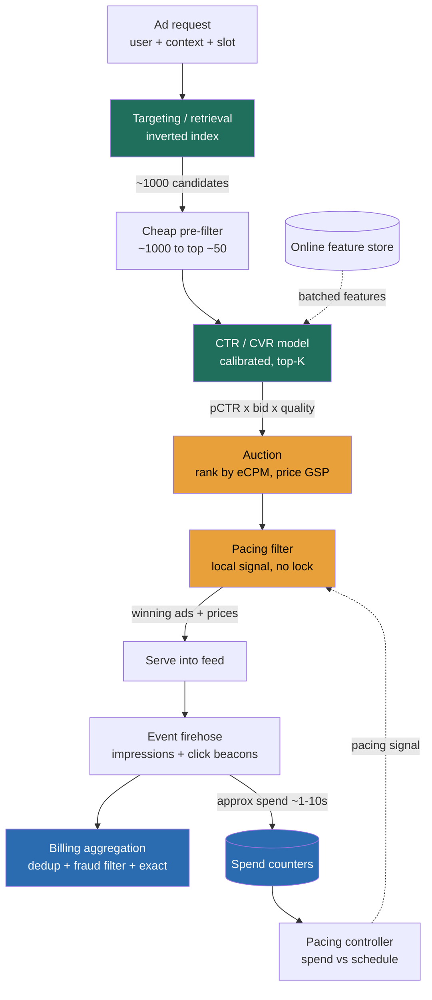

> Ad serving looks like a recommendation problem and is actually a **sealed-bid auction** run per ad slot in a few milliseconds, decided by **expected value, not the raw bid**. The mental flip that separates a Director answer from a junior one: **you never rank ads by who bids the most.** You rank by **eCPM ≈ pCTR × bid × quality**, so a $0.50 bid that gets clicked can beat a $5 bid nobody touches. The platform is balancing **three parties at once**, advertiser ROI, user experience, and platform revenue, and ranking by bid alone destroys two of the three. The engine is a **prediction-then-auction pipeline** (retrieve eligible ads → predict click/conversion probability → rank by expected value → price → check the budget), and the thing that forces the whole architecture is that **the predicted probability is not a suggestion, the auction charges money against it**, so it has to be *calibrated*, budgets have to be enforced across thousands of servers with **no global lock**, and clicks have to be counted **exactly and fraud-filtered** because that count is the invoice.

### Learning objectives
- Run a full **RESHADED** pass on a real-time ad-ranking system, deriving every structural decision from a stated requirement and its rejected alternative.
- Quantify the system from first principles, **~100k ad requests/s peak**, **~1,000 eligible candidates scored per request** (≈100M scorings/s), **~5B impressions/day**, **~75M clicks/day**, **~$40M/day of spend**, and use those numbers to *force* the two-model prediction stack and the no-global-lock pacing loop.
- Make the pivotal ranking call: **eCPM = pCTR × bid × quality** over bid-only or pCTR-only, and price the winner with a **second-price / GSP** rule.
- Explain, as a budget owner, **why the predicted CTR must be calibrated** (a predicted 2% must realize ~2%), because the auction *prices on it*, and why miscalibration means mispriced auctions and advertiser churn.
- Enforce budgets across a serving fleet with **probabilistic pacing feedback control** (accept bounded over/underspend), handle **cold-start ads** with exploration, and split the **fast approximate spend number** (for pacing) from the **exact fraud-filtered click count** (for billing).

### Intuition first
Forget "recommendation". Picture a **split-second auctioneer standing in front of one empty billboard slot** that a user is about to look at. In the time it takes the page to paint, the auctioneer has to: pull the posters that are even *allowed* on this billboard for this viewer (**targeting / retrieval**); glance at each and estimate how likely *this* viewer is to actually look at and click it (**CTR prediction**); rank them not by the price printed on the poster but by **how much money each is expected to make** (a cheap poster everybody clicks beats an expensive one nobody does); sell the slot to the winner but charge them only the **minimum they needed to bid to keep the spot** (**second-price / GSP**); refuse to hang the poster at all if that advertiser has already spent today's budget (**pacing**); and then, hours later, count the **real** clicks, throwing out the ones that were a bot mashing the poster, so the invoice is honest (**billing**).

Three consequences fall out and drive the whole design. First, the auctioneer's *estimate of clicks is load-bearing money*, the sale price is computed from it, so a 2% estimate that is really 1% means every advertiser in that slot is systematically mischarged. Second, there is not **one** auctioneer, there are **thousands** (one per serving host), all selling against the **same** daily budgets, and they cannot phone a central bank on every sale to ask "any budget left?" without blowing the millisecond deadline, so budget enforcement is a **feedback loop that tolerates a little slop**, not a lock. Third, the click count is **the bill**, so it must be exact and fraud-filtered, which is a completely different job from the fast, approximate number the auctioneer uses to know when to stop selling.

---

## R: Requirements

RESHADED starts by scoping *before* building. The signal here is **cutting** to a defensible core and naming, out loud, that the predicted probability is money (so it must be calibrated) and that budget enforcement cannot be a global lock.

**Functional (the core we will actually build):**
1. **Select ads for a request.** Given a request (user, context, slot(s)), return the winning ad(s) and the **price** each pays.
2. **Predict engagement.** Predict **CTR** (probability of click) and **CVR** (probability of conversion) per candidate, *calibrated*.
3. **Run and price the auction.** Rank candidates by expected value and price the winner (second-price / GSP with a reserve).
4. **Enforce budget + pacing.** Keep each campaign inside its daily budget and spread spend across the day, in near-real-time, across the whole serving fleet.
5. **Count for billing.** Log impressions and clicks, deduplicate and fraud-filter them, and produce an **exact** billable count per campaign.

**Explicitly cut or delegated (stated out loud, so it reads as choice, not omission):**
- **The CTR/CVR model architecture itself.** I own the *serving system, the calibration requirement, and the latency budget*; the deep model (feature crosses, embeddings, architecture) is a **delegated deep-dive** to the ads-ML team. My prior: a calibrated deep model with a cheap pre-filter stage in front of it.
- **The auction / mechanism-design theory.** Whether the exact mechanism is GSP, VCG, or a bespoke variant is a **delegated** workstream to a mechanism-design team; my prior is **second-price / GSP with a reserve**, which is incentive-reasonable and well understood. I own that it must be truthful enough that advertisers do not need to game their bids.
- **Creative rendering and the advertiser-facing campaign UI.** Known product surfaces, out of scope for the serving/ranking core.
- **Organic feed ranking.** We slot ads *into* a feed the content system already ranked; blending policy (how many ad slots, where) is a product decision I take as an input.

**Clarifying questions (and assumptions if waved on):**
- *Scale and surface?* A feed or search platform serving **~100k ad requests/s at peak** (~40k/s average), millions of active ads. Assume feed for concreteness.
- *Latency?* Ad selection is **on the page critical path**: **p99 ≲ 50-100 ms added**. A slow ad slot delays the whole page, so this budget is hard.
- *Budget semantics?* Campaigns must **not materially overspend** their daily budget; a few percent of drift is tolerable, a 2× overspend is a refund and a furious advertiser. Spend must be **near-real-time** (seconds, not hours) so a campaign stops when it is out of money.
- *Billing semantics?* The billable click count must be **exact and fraud-filtered**. This is money and it is audited, so "approximately N clicks" is not acceptable for the invoice.

**Non-functional requirements (where the design turns):**
- **Latency is a hard budget on the read path:** p99 ≲ 50-100 ms for the whole select call. This is what forbids a synchronous budget lock and forces a cheap pre-filter before the heavy model.
- **Calibrated predictions, not just ranked ones.** Because the auction *prices* on pCTR, a predicted probability must mean what it says. Rank-only accuracy (AUC) is not enough; **calibration** is a first-class requirement.
- **Budget accuracy is near-real-time and approximate-under-load.** We accept a bounded over/underspend (target within ~1-5%) in exchange for never putting a global counter on the request path.
- **Billing is exact and fraud-resistant.** Two numbers on purpose: a fast approximate spend signal for pacing, and an exact, deduplicated, fraud-filtered count for the invoice.
- **Availability leans AP on selection** (better to serve a slightly-stale-priced ad than to blank the slot), while the **billing count is the source of truth** and is reconciled exactly, offline.

> The requirement that secretly licenses the whole architecture is **"budgets may drift by a few percent, but the invoice must be exact."** It is what lets pacing be a cheap feedback loop while billing is a separate, exact, delayed pipeline. Juniors collapse the two into one counter and then either melt a hot key or send a wrong invoice.

---

## E: Estimation

Enough math to make a defensible call; round hard, state assumptions. Four anchors drive everything: **(1) 100k ad requests/s peak, (2) ~1,000 eligible candidates scored per request, (3) ~5B impressions/day at ~1.5% CTR, (4) daily spend on the order of tens of millions of dollars.**

**Request and scoring load (the number that shapes the prediction stack).**
- **~100k ad requests/s peak** (~40k/s average → ~3.5B requests/day; at ~1-2 ad slots each, **~5B ad impressions/day**).
- Targeting narrows a corpus of millions of active ads down to **~1,000 eligible candidates per request**. Scoring all of them with a heavy model is **100k × 1,000 = ~100M candidate scorings/s**, a non-starter for a deep model. That single number forces a **two-stage funnel**: a *cheap* model (or precomputed score) ranks the ~1,000 down to a **top ~50-100**, and the *heavy, calibrated* model scores only those (**100k × ~50 = ~5M heavy scorings/s**). The heavy model runs on ~1/20th of the candidates.

**Latency budget (the ~50-100 ms, spent).** Retrieval ~5-10 ms, feature fetch (one batched multi-get) ~5-10 ms, cheap pre-filter scoring ~5-10 ms, heavy top-K scoring ~10-20 ms, auction + pricing ~1 ms, pacing filter ~1 ms. That sums to a **~40-50 ms p99** with headroom to ~100 ms. Every stage that is not the model is deliberately cheap because the model is the expensive part.

**Click and revenue volume (the billing pipeline's load).** 5B impressions/day × **~1.5% CTR ≈ ~75M clicks/day** (~870 clicks/s average, multiples of that at peak). At an average **~$0.55 cost-per-click**, that is **~$40M/day ≈ ~$15B/year** of spend flowing through the billing pipeline. Every click is a line item on an invoice, which is exactly why the count must be exact and fraud-filtered.

**Why a synchronous global budget check per request is impossible (the key derivation).** Budgets live per campaign. Many of the ~1,000 candidates per request belong to budget-constrained campaigns, so a "does this campaign still have money?" check is needed on a large fraction of candidates. Even at one check per *winning* candidate, that is ~100k check-and-decrement operations/s against shared per-campaign counters, and hot campaigns (a big-brand launch) concentrate a huge share onto **one** counter. Putting that on the request path means either an extra network round-trip (blowing the ~50 ms budget) or serializing thousands of serving hosts on one hot key. **Conclusion: budget enforcement cannot be a synchronous global counter.** It must be a **feedback loop**, spend is aggregated centrally every ~1-10 s, and each serving host is handed a **pacing signal** (a probability of serving, or a bid multiplier) it applies locally with zero round-trips. The cost is bounded drift; the requirements said we can pay it.

**Storage sizes (sanity, not the point).** Campaign/ad metadata: millions of ads × a few KB ≈ single-digit TB, small and relational. Targeting index: an in-memory inverted index over active ads, tens to low-hundreds of GB sharded. Online feature store: hot user/ad/context features, hundreds of GB to a few TB in a low-latency KV. Spend/pacing counters: one small record per active campaign, well under a GB, bounded by *active* campaigns not by time. Impression/click log: ~5B events/day × ~1 KB ≈ **~5 TB/day** into an append-only firehose, retained for reconciliation and audit.

> The three numbers I carry into every later decision: **~100M candidate scorings/s** (→ a cheap pre-filter in front of the heavy calibrated model), **~50-100 ms hard latency** (→ no global budget lock; pacing is a feedback loop), and **~$40M/day billed on ~75M clicks** (→ exact, fraud-filtered counting, separate from the fast pacing number).

---

## S: Storage

R and E already split the problem; S names the distinct stores and rejects one-database-for-everything. Six data shapes, each with a different access pattern, is the signal.

| Data | Shape & access pattern | Store **type** | Real system | Rejected alternative (and why) |
|---|---|---|---|---|
| **Ad / targeting index** | Millions of ads, retrieve the ~1,000 matching a request's targeting predicates in a few ms | **In-memory inverted index, sharded** | ElasticSearch-class / a bespoke retrieval service | A relational `WHERE targeting LIKE …` per request, cannot scan millions of ads in single-digit ms; the query pattern is set-intersection, not row lookup. |
| **Online features** | Point/multi-get of user + ad + context features, ~100k user reads/s, sub-ms | **Low-latency KV / feature store** | Redis / a feature store (e.g. Feast-style) | Recomputing features per request from raw logs, blows the latency budget; features must be precomputed and served. |
| **CTR/CVR model + versions** | Read-mostly, loaded into serving hosts, versioned | **Model registry + in-host serving** | A model store; models served in-process or via a co-located inference tier | Calling a remote model service per candidate, an extra hop × millions of scorings/s. |
| **Spend / pacing counters** | Near-real-time spend per campaign, hot writes, approximate, seconds-fresh | **Sharded in-memory counters + feedback aggregator** | Redis counters, aggregated centrally | A durable ACID row updated per impression, hot-key wall on a viral campaign, and durability wasted on a number that is deliberately approximate. |
| **Impression / click log** | Append-only firehose, ~5B events/day, exact, deduped, fraud-filtered | **Log → batch/stream aggregation** | Kafka → warehouse / Spark or Flink | Counting into an OLTP row on the serving path, no place for dedup or fraud logic, and it pollutes serving with billing load. |
| **Campaign / advertiser metadata** | Budgets, bids, targeting rules, billing account; transactional | **Relational (ACID)** | Postgres / MySQL | A KV store, budgets and billing are money and want transactions, foreign keys, and audit. |

Two sub-decisions worth defending:
- **Two numbers for spend, on purpose.** A fast **approximate** spend counter (Redis, seconds-fresh) drives pacing; the **exact** billable spend is recomputed from the immutable event log. *Rejected:* one counter serving both, either it is fast and inexact (wrong invoice) or exact and slow (dead serving path). The split is the whole billing insight.
- **Keep the raw event log immutable and long-retained.** *Rejected:* aggregating on ingest and discarding raw events, then a fraud rule change or a billing dispute has nothing to recompute from. The immutable log is the source of truth the invoice is rebuilt from.

---

## H: High-level design

Three flows matter: **select** (the millisecond read path, where I go deep), **pace** (the feedback loop that enforces budgets without a lock), and **count** (the exact, delayed billing pipeline). The key statement is that **selection ranks by expected value and never touches a global lock, while billing is a separate exact pipeline off the request path.**



**Select (the engine, go deep here).** A request arrives with the viewer, context (surface, device, position), and the slot(s) to fill. **Retrieval** intersects the request against the inverted index to pull the ~1,000 ads whose targeting predicates match (geo, audience, keyword, budget-not-yet-exhausted). A **cheap pre-filter** (a lightweight model or precomputed quality/pCTR estimate) trims those ~1,000 to a **top ~50-100**, because scoring all 1,000 with the heavy model would blow the latency budget. The **CTR/CVR model** scores just those top candidates, pulling user/ad/context features in **one batched multi-get** from the feature store, and it must be **calibrated**. The **auction** ranks by **eCPM = pCTR × bid × quality** and prices the winner via **GSP / second-price with a reserve**. The **pacing filter** then drops or down-weights any winner whose campaign is out of budget or running ahead of schedule, using a **locally-cached pacing signal**, no network round-trip. The surviving winners and their prices are returned. This whole path is a **funnel** (thousands → ~1,000 → ~50 → winners) precisely so the expensive model runs on the fewest possible candidates.

**Pace (the feedback loop, not a lock).** Every served impression and click flows into the event firehose. A **pacing controller** aggregates near-real-time spend per campaign every ~1-10 s, compares it to where the campaign *should* be on its daily schedule, and computes a **pacing signal** per campaign (for example, "serve this campaign with probability 0.6" or "multiply its bid by 0.8"). That signal is pushed to every serving host, which applies it locally. No serving host ever holds a lock or waits on a central counter, so the ~50 ms budget is safe. The cost is bounded drift, which the feedback loop keeps small.

**Count (the exact, delayed pipeline).** Impressions are logged when served; **click beacons** arrive asynchronously (202, off the critical path) when the user actually clicks. The billing aggregation **deduplicates** (one click per impression, idempotent on a click id), **fraud-filters** (bots, click farms, impossible click rates), and recomputes the **exact** billable count and spend per campaign from the immutable log. That exact number is the invoice; the fast Redis counter was only ever an accelerator for pacing.

---

## A: API design

Keep it small; the non-obvious choices are the **select call that returns a price**, the **fire-and-forget event beacon**, and treating **campaign/budget management as a transactional surface** separate from the hot path.

```
# --- Ad selection (the hot, latency-bound path) ---
POST /v1/ads:select
  body: {
    user_id, context: { surface, device, geo, position },
    slots: [ { slot_id, floor_price? } ],
    request_id
  }
  -> {
    slots: [ { slot_id,
               ad_id, advertiser_id,
               price,              # what the winner pays (GSP / second-price)
               pCTR, pCVR,         # for logging / debugging, not shown to advertiser
               tracking_token } ]  # ties the future impression/click back to this auction
  }

# --- Events (fire-and-forget beacon; powers pacing + billing) ---
POST /v1/events
  body: { tracking_token, type: impression|click|conversion, ts, session_id, signals{...} }
  -> 202                          # never on the critical selection path

# --- Campaign / budget management (transactional, operator-facing) ---
POST  /v1/campaigns              body: { advertiser_id, daily_budget, bid, bid_type, targeting{...} }
PATCH /v1/campaigns/{id}         body: { daily_budget?, bid?, status?, targeting? }
GET   /v1/campaigns/{id}/spend   -> { approx_spend_today, billable_spend_yesterday, pacing_state }
```

Three decisions worth defending. **`:select` returns a price, not just a winner.** The price *is* the auction output (GSP computes it from the runner-up's eCPM); returning it makes billing verifiable and the contract auditable. *Rejected:* returning only the winning ad and computing the price later, the price depends on the exact candidate set at auction time, which is gone by then. **Events are a 202 fire-and-forget beacon.** *Rejected:* a synchronous "register this click and confirm the charge" call, that puts a fraud-checked, exact billing write on the user's critical path, and a slow billing backend would then stall the page. The beacon feeds an async pipeline; billing correctness is achieved by exact recompute from the log, not by a synchronous write. **Campaign management is a separate transactional API.** Budgets and bids are money and want ACID semantics and audit; they change on a human timescale (seconds to minutes), so there is no reason to couple them to the millisecond hot path, the serving fleet reads them via a cache with a short refresh.

---

## D: Data model

**Partition keys and dedup keys, not column inventories, are the load-bearing details:**
- **`campaigns`**, **PK `campaign_id`** in a relational store: `advertiser_id`, `daily_budget`, `bid`, `bid_type` (CPC/CPM/CPA), `targeting`, `status`, `billing_account_id`. Read-mostly on the hot path (served from a short-TTL cache), transactional on the management path.
- **`ads`**, **PK `ad_id`**, `campaign_id`, creative refs, `targeting_predicates`. The targeting predicates are what the **inverted index** is built from (predicate → posting list of ad ids), so retrieval is a set-intersection, not a scan.
- **Ad features / user features**, keyed by `ad_id` and `user_id` in the feature store; the per-request read is a **batched multi-get** of the winning-set ads plus the one user, so feature fetch is one round-trip regardless of candidate count.
- **`ctr_model`**, versioned by `model_id`/`version`; serving hosts pin a version so a bad model can be rolled back without a redeploy, and logged predictions carry the version for calibration monitoring.
- **Spend / pacing counters**, keyed by `campaign_id` and **sharded into N sub-counters** (`spend:{campaign_id}:{shard}`) so a hot campaign's writes spread across shards; summed on read by the pacing controller. Bounded by *active* campaigns, with a daily reset, not cumulative.
- **Impression / click log**, an append-only event keyed (partitioned) by `campaign_id` so each campaign's events land in a bounded set of partitions and campaigns parallelize. The **idempotent dedup key is the `tracking_token`** minted at auction time: one impression per token, one click per token, so a double-fired beacon or a retry cannot double-bill.

<details>
<summary>Go deeper, the event schema and dedup / fraud key (IC depth, optional)</summary>

```
tracking_token = sign(auction_id + slot_id + ad_id + ts)   # minted at :select, opaque to the client
event:  { tracking_token, campaign_id, ad_id, user_id (hashed),
          type: impression|click|conversion, ts, session_id,
          signals: { ip_hash, user_agent_class, dwell_ms, position, ... } }

# Billing dedup: GROUP BY tracking_token, keep first valid click; a click without a
# matching impression, or many clicks per token, is dropped as invalid.
# Fraud filter (delegated model): flags bot user-agents, impossible click-through rates
# per ip_hash/session, and click timing anomalies BEFORE the exact count is committed.
# Exact billable spend per campaign = SUM over deduped, fraud-passed clicks × price.
```

The `tracking_token` is the single thread that ties a future impression and click back to the exact auction that produced them (which ad, which price), which is what makes the click chargeable and dedupable. Signing it prevents a client from forging clicks against arbitrary ads.

</details>

**Where data lives:** targeting index and features in RAM (sharded, hot, rebuilt from source), spend counters in RAM (ephemeral, sharded, daily-reset), campaigns/billing in a relational store (durable, transactional), and the event firehose in an append-only log feeding both the fast counter and the exact billing recompute.

---

## E: Evaluation

Stress your own design: re-check the NFRs, hunt the bottlenecks, fix each **naming the trade**. An architecture with no self-identified failure modes reads as untested.

**Bottleneck 1, model latency at ~100M candidate scorings/s.** Scoring ~1,000 candidates per request with a deep model, at 100k req/s, is ~100M heavy inferences/s, impossible inside 50 ms.
> **Fix, a two-stage funnel plus batching and feature caching.** A **cheap pre-filter** (lightweight model or precomputed pCTR/quality) trims ~1,000 → top ~50, and only those hit the **heavy calibrated model**, cutting heavy inferences ~20×. Score the top-K as **one batched forward pass** (not 50 sequential calls), and fetch all features in **one multi-get** with hot user/ad features cached. **Trade:** the pre-filter can discard a candidate the heavy model would have loved (recall loss at the top), so the two models are co-tuned to keep that rare. *Rejected:* one heavy model over all 1,000, correct but ~20× the compute and well over the latency budget.

**Bottleneck 2, probability calibration (the key Director point).** The auction **prices on pCTR**: in GSP, the winner's cost-per-click is derived by dividing the runner-up's eCPM by the winner's pCTR. So if pCTR is systematically 2× too high, eCPM is inflated, the wrong ad wins, and the computed price is wrong, advertisers pay for clicks that do not materialize, budgets drain without results, and they churn. A model can have excellent ranking accuracy (AUC) and still be badly *miscalibrated*.
> **Fix, calibrate and monitor calibration as a first-class SLO.** Apply a calibration layer (isotonic / Platt-style) on top of the raw model, and continuously compare **predicted vs realized** click-through per bucket (a predicted-2% bucket must click ~2%). Recalibrate on a schedule and alert on drift. **Trade:** an extra calibration stage and constant monitoring, in exchange for auctions that price fairly and advertisers who stay. *Rejected:* optimizing rank accuracy only, it wins offline metrics and quietly misprices every auction. The model architecture is delegated; **calibration is a requirement I own and will not delegate.**

**Bottleneck 3, budget overspend under distributed serving.** Thousands of serving hosts sell against one daily budget with no global lock; naively they collectively blow past it before the central counter catches up.
> **Fix, probabilistic pacing feedback control.** The pacing controller compares near-real-time spend to the campaign's ideal daily schedule and emits a **pacing signal** (a serve-probability or a bid multiplier) that each host applies locally with zero round-trips. As a campaign approaches its budget or runs ahead of schedule, the signal throttles it down; **bid-shading** can smooth spend near the cap. **Trade:** accept bounded over/underspend (target ~1-5%), the feedback lag means a burst can slightly overshoot, and we cap the day and reconcile the exact number for billing. *Rejected:* a synchronous global counter or lock per request, exact, but an extra hop and a hot-key wall on big campaigns that kills the ~50 ms budget.

**Bottleneck 4, cold-start ads.** A brand-new ad or advertiser has **no click history**, so the model's engagement features are empty and it will rank near zero forever, never earning the impressions it needs to learn.
> **Fix, exploration plus priors.** Seed the prediction with **content and advertiser priors** (creative features, category, the advertiser's historical CTR on similar ads), and add **explicit exploration** (a small budget of impressions allocated to under-served ads, e.g. Thompson-sampling / UCB-style, or an exploration boost) so new ads get sampled and gather labels. **Trade:** exploration spends some revenue showing unproven ads, in exchange for not starving every new advertiser (an existential fairness/marketplace issue). *Rejected:* rank purely on observed CTR, new ads never surface, advertisers leave, the marketplace ossifies.

**Bottleneck 5, click fraud and billing integrity.** Clicks are money and are actively gamed (bots, click farms, competitors draining a rival's budget). A single counter is both a hot key and trivially fraudulent.
> **Fix, the two-number split with exact recompute.** A **fast approximate spend counter** (sharded Redis, seconds-fresh) drives pacing; the **exact billable count** is recomputed offline from the **immutable event log**, deduped on the `tracking_token` and passed through a fraud filter (bot user-agents, impossible click-through per session/IP, timing anomalies) before it becomes an invoice. **Trade:** the billable number lags by hours and the pacing number is approximate, deliberately, versus one number that cannot be both fast and exact. *Rejected:* bill directly off the live counter, fast but unaudited and gameable. The fraud *models* are delegated to trust-and-safety; the *pipeline* that keeps billing exact is mine.

**Bottleneck 6, delayed conversions.** CVR labels arrive **days** after the click (a purchase can happen 1-7 days later), so at training time recent clicks look like non-conversions simply because the conversion has not happened yet.
> **Fix, attribution windows and delayed-label handling.** Define an attribution window (for example 7 days), and train the CVR model with **delayed-feedback** techniques that account for labels still arriving, rather than treating a not-yet-converted click as a negative. **Trade:** attribution latency (CVR-based optimization reacts more slowly) and modeling complexity, in exchange for not systematically under-counting conversions. *Rejected:* a short fixed window that labels everything not-yet-converted as a miss, it biases CVR down and misallocates spend.

**Re-check vs NFRs:** ~100M scorings/s → funnel + batching keeps heavy inference to ~5M/s inside 50 ms ✓; calibration → calibration layer + predicted-vs-realized monitoring so pricing is fair ✓; budget → probabilistic pacing feedback, bounded drift, no lock ✓; billing → exact recompute from the immutable log, deduped + fraud-filtered ✓; availability → serving leans AP (a slightly stale price beats a blank slot), the log is the billing source of truth ✓.

---

## D: Design evolution

**At 10× (~1M ad requests/s, ~50B impressions/day):**
- **The scoring funnel is the wall, and it is a compute-cost lever a Director owns.** At 10× the ~100M scorings/s becomes ~1B/s; the pre-filter must get cheaper and the heavy model must run on fewer candidates, so retrieval and pre-filtering carry more of the pruning. Inference moves to **accelerators (GPU/ASIC)** with tighter batching, a nine-figure fleet decision. I would **delegate the model + serving-hardware curve to ads-ML** with the prior "cheap retrieval-time pruning, a small calibrated heavy model on a tight top-K, batched on accelerators."
- **Pacing goes to sub-second control.** Faster spend aggregation and finer pacing signals shrink the drift band; the feedback-control loop (setpoint = ideal spend schedule) is tuned, not rebuilt.
- **Whole-page / multi-slot allocation.** With multiple ad slots per page, the optimal set is not "top-K independently", ads compete and complement, so this becomes a **slate optimization** (diversity, no near-duplicate ads adjacent, position effects). A genuinely harder problem, delegated to ads-ML with the prior "greedy top-K with diversity constraints first, joint optimization only if it pays."
- **Auction variants and brand safety.** Reserve prices, first-price experiments for some inventory, and **brand-safety filters** (an advertiser must not appear next to unsafe content) become first-class ranking constraints.

**Under a new constraint, privacy (a genuine 2026 pressure):**
- **Third-party cookies are deprecated and cross-site identity is shrinking.** Targeting and measurement can no longer lean on a stable cross-site user id. The system shifts toward **first-party and contextual signals**, **on-device** candidate selection or ranking for some surfaces, and **aggregated / differentially-private measurement** (conversions reported in privacy-preserving aggregates rather than per-user joins).
- **Effect on the design:** retrieval leans more on **contextual** predicates (what the content is) than on cross-site behavioral history; the CTR/CVR features shift toward first-party and cohort-level signals; and **conversion attribution** moves to noisy, aggregated reports (differential privacy adds noise, so CVR estimates get noisier and need more volume to stabilize). **Trade:** measurable degradation in targeting precision and attribution fidelity, accepted as a **hard constraint** (regulatory and platform-mandated), not an engineering choice, so the design optimizes *within* it rather than fighting it.

**Where I'd delegate (explicit Director signal):** the **CTR/CVR model architecture** → ads-ML (prior: calibrated deep model behind a cheap pre-filter, batched on accelerators); the **auction mechanism** → mechanism-design team (prior: GSP / second-price with a reserve, truthful enough that advertisers need not game bids); the **pacing control law** → an infra/optimization team (prior: feedback control on the spend schedule, tuned to a ~1-5% drift SLO); the **fraud models** → trust-and-safety (my pipeline gives them the immutable log and enforces exactness). Going deep on the **funnel, the calibration requirement, and the no-lock pacing loop**, and handing off the rest with a stated prior, is the altitude this round scores.

---

### Trade-offs table: the pivotal decisions

| Decision | Option A | Option B | Option C (chosen, usually) | Use when… |
|---|---|---|---|---|
| **Ranking score** | **Bid only** | **eCPM = pCTR × bid** | **eCPM = pCTR × bid × quality** | A: never at scale (rewards spam that nobody clicks, wrecks UX + revenue). B: pure marketplace efficiency. **C: real feed/search, where user experience and relevance must be protected too.** |
| **Pricing** | **First-price** (pay your bid) | **Second-price / GSP** (pay just enough to hold rank) | GSP **with a reserve** | A: some modern header-bidding inventory, but incentivizes bid-shading games. **B/C: default, truthful-ish, stable, reserve protects revenue on thin auctions.** |
| **Budget pacing** | **Hard global counter / lock** | **Probabilistic throttling** (serve-probability) | **Bid-shading + feedback control** | A: never on the hot path (extra hop, hot key). **B: simple, effective, bounded drift. C: when spend must be smooth *and* competitive near the cap.** |
| **Click counting** | **Single live counter** | **Sharded approximate counter** | **Sharded approx (pacing) + exact log recompute (billing)** | A: never (hot key + unaudited). B: pacing only. **C: always, when the count is both a control signal and an invoice.** |

---

### What interviewers probe here (Director altitude)

They are not checking whether you can name "GSP", they are checking that you grasp ad serving as **expected-value auction + calibrated prediction + no-lock pacing + exact fraud-filtered billing**, and know what to delegate.

- **"How do you stop a campaign overspending across 1,000 servers in real time?"**, *Strong:* no global lock, a **pacing feedback loop**, near-real-time spend aggregated centrally, a per-campaign pacing signal pushed to hosts and applied locally, accept ~1-5% bounded drift, cap the day, reconcile exact spend from the log for billing. *Red flag:* "a synchronous atomic decrement per request", a hot key that blows the latency budget.
- **"Why must CTR be calibrated, isn't ranking enough?"**, *Strong:* the auction **prices** on pCTR (GSP divides the runner-up's eCPM by the winner's pCTR), so miscalibration misprices every auction, drains budgets without clicks, and churns advertisers; monitor predicted-vs-realized as an SLO. *Red flag:* "AUC is high, so we're fine", conflates rank accuracy with calibration.
- **"A brand-new advertiser with no data, how do you rank them?"**, *Strong:* **priors** (creative/category/advertiser history) plus **explicit exploration** (a small impression budget, Thompson/UCB-style) so they earn labels, naming the exploration-cost trade. *Red flag:* "rank on observed CTR", new ads never surface and the marketplace starves.
- **"How do you bill accurately when clicks can be faked?"**, *Strong:* **two numbers**, a fast approximate counter for pacing and an **exact count recomputed from the immutable log**, deduped on a signed tracking token and fraud-filtered before it becomes an invoice. *Red flag:* "bill off the live counter", fast, gameable, and unauditable.

---

### Common mistakes

- **Ranking by bid alone.** Rewards whoever pays most regardless of relevance, tanks user experience and platform revenue; rank by **eCPM = pCTR × bid × quality**.
- **Treating pCTR as a ranking score, not a price input.** The auction charges money against it, so an uncalibrated probability misprices every auction, calibration is a requirement, not a nice-to-have.
- **A synchronous global budget check per request.** An extra hop and a hot key on big campaigns; enforce budgets with a **pacing feedback loop** that tolerates bounded drift.
- **One counter for pacing and billing.** It cannot be both fast/approximate and exact/fraud-filtered; keep **two numbers** with an exact recompute from the immutable log.
- **Ignoring cold start and fraud.** No exploration means new advertisers never surface; no dedup/fraud filter means the invoice is gameable, both are core, not edge cases.

---

### Interviewer follow-up questions (with model answers)

**Q1. Walk me from an ad request to a served ad in under 50 ms. Where does the time go?**
> *Model:* A **funnel**. Retrieval intersects the request against an inverted index to ~1,000 eligible ads (~5-10 ms). A **cheap pre-filter** trims that to a top ~50 (~5-10 ms), because scoring all 1,000 with the heavy model is ~100M inferences/s across the fleet, impossible in budget. The **calibrated heavy model** scores just the top ~50 as one batched pass, with features fetched in a single multi-get (~10-20 ms). The **auction** ranks by eCPM = pCTR × bid × quality and prices via GSP (~1 ms), and the **pacing filter** drops any winner whose campaign is out of budget using a locally-cached signal, no round-trip (~1 ms). Time goes into model inference, which is exactly why the funnel exists, to run the expensive model on the fewest candidates.

**Q2. Your predicted CTRs are well-ranked but poorly calibrated (predicted 4%, actual 2%). What breaks, and how do you fix it without touching the model?**
> *Model:* Pricing breaks. GSP computes the winner's cost-per-click from the runner-up's eCPM divided by the winner's pCTR, so a 2× inflated pCTR inflates eCPM (the wrong ads win) and mis-derives the price, advertisers pay for clicks that do not come, budgets drain, they churn. Without retraining, add a **calibration layer** (isotonic / Platt) that maps raw scores to calibrated probabilities using recent predicted-vs-realized data, and monitor calibration per bucket as an SLO with drift alerts. The deep model stays; the calibration layer makes its outputs pricing-safe.

**Q3. A big-brand campaign with a huge daily budget launches and floods a few hot campaigns' counters. How do you keep pacing correct without a hot key or blowing latency?**
> *Model:* Never a synchronous counter on the request path. Spend goes through the event firehose to a **pacing controller** that aggregates near-real-time per-campaign spend (using **sharded** sub-counters so a hot campaign's writes spread), compares it to the campaign's ideal daily schedule, and pushes a **pacing signal** (serve-probability or bid multiplier) to every host, applied locally with zero round-trips. As the campaign nears its cap, the signal throttles it and bid-shading smooths the approach. I accept ~1-5% drift from the feedback lag and reconcile the **exact** spend from the immutable log for the invoice. No host ever waits on a shared counter, so the ~50 ms budget holds.

**Q4. Someone is click-bombing a competitor's ad to drain its budget. How does your billing stay honest?**
> *Model:* The fast pacing counter may briefly see the inflated clicks, that only throttles the victim's serving, which we can detect. The **invoice** is never taken from that counter. Billing recomputes the **exact** count offline from the immutable event log, deduped on the signed **tracking token** (one click per legitimate impression) and passed through a **fraud filter** (bot user-agents, impossible click-through per IP/session, timing anomalies) before any charge. Fraudulent clicks are dropped pre-billing, and because the raw log is retained, a fraud-rule update can re-run against history to issue a correction. The fraud models are trust-and-safety's; the exact, auditable pipeline is mine.

---

### Key takeaways

- **Ad serving is a per-slot sealed-bid auction decided by expected value, not the raw bid.** Rank by **eCPM = pCTR × bid × quality** and price with **GSP / second-price**, so a cheap ad that gets clicked beats an expensive one that does not, protecting advertiser ROI, user experience, and platform revenue at once.
- **The predicted probability is money, so it must be calibrated.** The auction *prices* on pCTR; miscalibration misprices every auction, drains budgets without clicks, and churns advertisers. Monitor predicted-vs-realized as a first-class SLO.
- **Drive it with the numbers:** ~100M candidate scorings/s forces a **two-stage funnel** (cheap pre-filter → calibrated heavy model on a top ~50); a ~50-100 ms hard latency budget forbids a global budget lock.
- **Enforce budgets with a pacing feedback loop, not a lock.** Aggregate near-real-time spend, push a per-campaign pacing signal applied locally, accept ~1-5% bounded drift; use **bid-shading** to smooth the approach to the cap.
- **Two numbers on purpose:** a fast approximate spend counter for pacing, and an **exact, deduped, fraud-filtered count recomputed from the immutable log** for the invoice. Delegate the model, the auction mechanism, and the fraud models, each with a stated prior.

> **Spaced-repetition recap:** A split-second auctioneer fills one slot: pull the eligible posters (**targeting/retrieval**), estimate clicks (**calibrated pCTR**), rank by **expected money (eCPM = pCTR × bid × quality)**, sell at the runner-up price (**GSP/second-price**), refuse if the budget is spent (**pacing**), and later count real clicks for the bill (**billing**). The prediction is *money*, so it must be **calibrated** (the auction prices on it). ~100M scorings/s forces a **funnel** (cheap pre-filter → heavy model on top ~50) inside a ~50 ms budget, so budgets are enforced by a **feedback pacing loop** (bounded drift), never a global lock. Keep **two numbers**: fast approximate spend for pacing, **exact fraud-filtered** count from the immutable log for the invoice. Cold-start via **priors + exploration**; privacy (cookie deprecation) pushes toward contextual signals and aggregated, differentially-private measurement.
