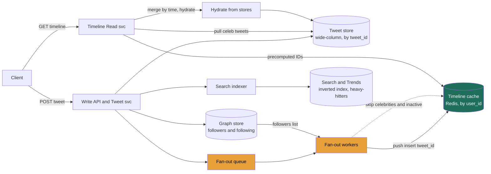

### Learning objectives
- Run the **RESHADED** spine on the home-timeline problem and come out with a defensible **hybrid fan-out** design, not just "push" or "pull."
- **Quantify** the central trade: push (fan-out-on-write, ~925K timeline inserts/s) vs pull (fan-out-on-read, ~4.6M tweet-fetches/s), and explain why a **5:1 read-heavy** workload makes push the default.
- Name the inversion that *is* this problem: the system is read-heavy to users but push turns the **backend write-heavy**, and a single celebrity tweet becomes a **100M-write bomb**, and engineer around it.
- Model the **follow graph** (both adjacency directions), the **timeline cache**, and the **read-time merge** of pulled celebrity tweets with the precomputed timeline.
- Decide where you'd **delegate a deep-dive** (the merge/pagination path, the graph store), the Director move.

### Intuition first
A home timeline is a **personalized newspaper** that has to be ready the instant the reader opens the app. There are only two ways to have it ready. **Push (fan-out-on-write):** the moment someone tweets, you run to every one of their followers' doorsteps and slip the new item into each one's pre-printed paper. When a follower opens the app, their paper is already assembled, reads are instant, but a celebrity with 100 million followers means 100 million doorstep visits for *one* tweet. **Pull (fan-out-on-read):** you print nothing in advance; when a reader opens the app you sprint to all 200 people they follow, grab everyone's latest, sort by time, and print on the spot, writes are trivial but every single app-open is expensive, and the celebrity problem vanishes only to reappear as "every reader re-fetches the celebrity's tweets, over and over." Because people **read their timeline far more often than they tweet** (about 5 reads per write here), you want to pay the expensive fan-out work on the *rarer* operation, so push is the default. The whole lesson is then one sentence: **push for the 99.9% of normal accounts, pull for the handful of celebrities, and merge the two at read time.** Everything else is making that sentence survive contact with 200M daily users.

We will reference **RESHADED** by name at each step.

---

## R: Requirements

**Functional (the defensible core):**
- **Post a tweet** (≤ 280 chars, optional media pointer).
- **Home timeline**, a reverse-chronological (we will *not* attempt the ML-ranked feed in v1) merge of tweets from everyone a user follows, paginated.
- **Follow / unfollow** a user; the follow graph is the input to fan-out.
- **User timeline**, a single user's own tweets (trivial: one partition, by author).

**Explicitly CUT from the core (state the cut, defend it):**
- **ML relevance ranking / "For You"**, cut to keep the fan-out problem the centerpiece; reverse-chron is the honest v1 and ranking is a re-scoring layer bolted on later (noted in the D step). Pretending to design the ranker burns the whiteboard on the wrong thing.
- **Replies/threads, retweets, likes counts, DMs, notifications**, acknowledged as edges; the like/retweet *counters* are a sharded-counter problem, notifications are their own system. We mention them, we don't build them.
- **Search & trends**, a **side path**, sketched in the H/D steps, delegated to Distributed Search. Not the core.

**Non-functional (these drive every later decision):**
- **Timeline read latency:** p99 < ~200 ms. This is the product; it's why push exists.
- **Availability over consistency** for the timeline: a few seconds of staleness (your follower sees your tweet 5 s late) is fine; the timeline being *down* is not. **AP-leaning** (recall CAP, the CAP/PACELC lesson).
- **Eventual timeline consistency** is acceptable; **tweet durability** is not, a posted tweet must never be lost.
- **Read-heavy at the request level, ~5:1.** This is the single most important number in the room, and it has a twist (below).

**The read:write skew and the inversion, say this out loud:**
At the *user-facing* level the system is **read-heavy, ~5:1** (people refresh far more than they post). But the design choice we are about to make, **push**, *inverts* that on the backend: every write fans out to ~200 timelines, so the backend becomes overwhelmingly **write-heavy** (~925K timeline inserts/s vs ~25K timeline cache reads/s ≈ **~37:1 the other way**). **That tension is the problem.** We choose to pay a large write-amplification cost precisely *because* reads are more frequent and more latency-sensitive than writes, but that bargain breaks for celebrities, where one write fans out to millions. Holding both halves of that sentence is the strong signal here.

**Clarifying questions a Director asks first** (each changes the design): How skewed is the follower distribution, is there a power-law tail of celebrities? (Yes, it forces hybrid.) Reverse-chron or ranked? (Reverse-chron v1.) How stale can a timeline be? (Seconds.) DAU and average followers? (Below.) Do we own media storage or offload to a blob store? (Offload, the blob-store building block.)

---

## E: Estimation

*Enough math to make a defensible call, round hard, state assumptions.*

**Scale assumptions:** 500M registered users, **200M DAU**, average **200 followers/user** (with a power-law tail, a few accounts have 10M-100M). Each DAU posts **~2 tweets/day** and opens the timeline **~10×/day**.

**Write QPS (tweets):**
- 200M DAU × 2 = **400M tweets/day** → 400M / 86,400 s ≈ **~5K tweets/s** average.
- Peak ≈ 3× average → **~15K tweets/s**.

**Read QPS (timeline fetches):**
- 200M DAU × 10 = **2B timeline reads/day** → 2B / 86,400 ≈ **~25K reads/s** average; peak ~3× → **~75K reads/s**.
- **Read:write = 2B : 400M = 5:1.** ✓ (peak 75K:15K = 5:1 ✓)

**The headline number, fan-out write amplification (push):**
- Every non-celebrity tweet inserts into ~200 followers' timelines: 400M tweets/day × 200 = **80B timeline inserts/day**.
- 80B / 86,400 ≈ **~925K inserts/s average**; peak 15K tweets/s × 200 = **~3M inserts/s**. *This is the cost push buys.*

**The rejected alternative, also priced, fan-out read amplification (pull):**
- Every timeline read fetches from ~200 followees: 2B reads/day × 200 = **400B tweet-fetches/day** → **~4.6M fetches/s** average.
- **Push 925K inserts/s vs pull 4.6M fetches/s → pull is ~5× more work**, exactly because the workload is 5:1 read-heavy. Quantified, that's *why* push is the default. (Rule 2: the rejected alternative is named *and* its cost shown.)

**Storage (tweets, 5-year horizon):**
- Per tweet ~**1 KB** (id, author_id, 280-char text, timestamps, counts, media pointer, text is ~300 B, round up for overhead/indexes).
- 400M/day × 1 KB = **~400 GB/day** → **~150 TB/year** of tweet metadata → **sub-PB at 5 years (~0.75 PB)**. **Media bytes (images/video) are far larger but live in a blob store**, not here, we store only pointers.

**Timeline cache working set (the precomputed timelines):**
- Store **tweet IDs only**, not full tweets, and **cap each materialized timeline at ~800 IDs** (nobody scrolls further; older pages fall back to pull).
- 8 B/ID × 800 = **6.4 KB/user**; for 200M active users → 200M × 6.4 KB ≈ **~1.3 TB**. Fits comfortably in a **Redis cluster** (a few TB of RAM across nodes). This is the working set that must stay hot.

**Bandwidth (read egress):**
- Peak 75K reads/s × ~20 hydrated tweets/page × ~1 KB ≈ **~1.5 GB/s** of timeline egress at peak. Round **~1-2 GB/s**.

**Instance counts (order-of-magnitude, for capacity planning):**
- **Fan-out workers:** ~925K inserts/s avg (3M peak); if one worker sustains ~10K inserts/s → **~100 workers avg, ~300 at peak**.
- **Timeline read service:** 75K reads/s peak; if a node serves ~5K reads/s (cache lookup + hydration) → **~15-20 nodes** with headroom.
- **Timeline cache:** ~1.3 TB hot + replication → a Redis cluster of a few dozen nodes.

These numbers are the evidence base for every decision below.

---

## S: Storage

*Match each data shape to a store* **type** *and name a real system; justify against the access pattern.*

| Data | Access pattern | Store **type** | Real system | Why (and what's rejected) |
|---|---|---|---|---|
| **Tweets** (the durable record) | Write-once, read-by-id, huge volume (~925K writes/s fan-out reads), never updated except counters | **Wide-column / distributed KV** (LSM-backed) | **Cassandra** / **Manhattan** (Twitter's own) / DynamoDB | Write-optimized LSM absorbs the firehose; key-by-`tweet_id` reads are O(1). *Rejected:* a single Postgres, can't take 925K reads/s of hydration or shard a PB cleanly. |
| **Home timelines** (precomputed ID lists) | Per-user list of recent tweet IDs, read on every app-open, p99 < 200 ms | **In-memory cache / KV** | **Redis** (cluster) | RAM-speed reads are the entire point; data is **regenerable** from tweets + graph, so it can live in a cache, not durable storage. *Rejected:* serving timelines from the tweet store, too slow, and re-does the merge every read. |
| **Follow graph** (who follows whom) | `followers(u)` for push; `following(u)` for pull/merge; both hot | **Sharded relational / KV / graph** | **Sharded MySQL** (Twitter's FlockDB lineage), or a KV with two indexes | Simple adjacency, but needs **both directions** indexed. *Rejected:* a general graph DB (Neo4j), we don't traverse multi-hop; we need two fast adjacency lookups, not graph algorithms. |
| **Media** (images/video) | Write-once, read-heavy, large objects, served via CDN | **Blob/object store + CDN** | **S3** + CloudFront | Bytes don't belong in the tweet store; store a pointer, serve from edge. *Rejected:* BLOBs in the database, bloats it and kills cache density. |
| **Search index & trends** (side path) | Full-text over recent tweets; top-K terms in a window | **Inverted index + stream heavy-hitters** | **Elasticsearch** + Count-Min/Flink for trends | Different access pattern entirely; a parallel pipeline off the same write. |

The decision falls straight out of the access patterns established in R/E, write-heavy immutable tweets → LSM wide-column; regenerable hot lists → cache; two-directional adjacency → indexed KV. **tweet_id is generated by a Snowflake-style sequencer**: a 64-bit, **time-sortable** ID, which we will exploit so that "merge timelines by recency" is just "sort by ID."

---

## H: High-level design



**Happy path, posting (the write fan-out):**
1. Client `POST`s a tweet → **Write API** assigns a **Snowflake `tweet_id`**, writes the durable record to the **Tweet store**, and returns ~immediately (the user's post is confirmed before fan-out finishes, fan-out is async).
2. Write API enqueues a **fan-out job** onto a queue (the messaging-queue building block, durable, decoupled, load-leveled). This is the seam that keeps a celebrity's fan-out from stalling the author's `POST`.
3. **Fan-out workers** look up the author's **followers** in the graph store and **prepend `tweet_id`** to each follower's list in the **Timeline cache**, *but skip celebrities (pull instead) and skip inactive users* (the two big optimizations, justified in E/Evaluation).

**Happy path, reading (the read merge):**
1. Client `GET`s home timeline → **Timeline Read service** fetches the **precomputed ID list** from the Timeline cache (one fast lookup), these are the push-delivered tweets.
2. In parallel it **pulls** recent tweets from the small set of **celebrities the user follows** (their tweets were *not* pushed), from the Tweet store / a hot celeb cache.
3. It **merges** the two ID streams **by recency** (a `tweet_id` sort, since Snowflake IDs are time-ordered), takes the top page, **hydrates** the IDs into full tweets (batch read from Tweet store, with author/media joined), and returns. Hydration is cacheable; the merge is the deep-dive (Evaluation).

This is the **hybrid** in one picture: push fills the cache for normal accounts; pull handles celebrities; the read path merges them.

---

## A: API design

```
POST   /v1/tweets
  body: { text: string(<=280), media_ids?: [string] }
  → 201 { tweet_id, created_at }            # returns before fan-out completes

GET    /v1/timeline/home?cursor=<tweet_id>&limit=20
  → 200 { tweets: [...], next_cursor }       # cursor = tweet_id (time-sortable), NOT offset

GET    /v1/timeline/user/{user_id}?cursor=<tweet_id>&limit=20
  → 200 { tweets: [...], next_cursor }       # single author's own tweets

POST   /v1/follows   body: { followee_id }   → 204
DELETE /v1/follows/{followee_id}             → 204

GET    /v1/search?q=<query>&cursor=...        # side path → Distributed Search
```

Two API decisions worth defending:
- **Cursor = `tweet_id`, not offset/page-number.** Timelines are an infinite, mutating stream; offset pagination double-shows or skips items as new tweets arrive at the head, and `OFFSET 10000` is O(n). A **`tweet_id` cursor** ("give me items older than this ID") is stable under inserts and O(1) to seek, *and* it makes the push/pull merge boundary coherent. *Rejected:* page-number pagination, broken on a live feed.
- **`POST /tweets` returns before fan-out.** The write is durable and acknowledged on the synchronous path; the 925K-insert fan-out is async behind the queue. *Rejected:* synchronous fan-out, a celebrity post would block for minutes.

---

## D: Data model

**Tweets** (wide-column / KV, e.g. Cassandra):
```
tweets
  PARTITION KEY: tweet_id        # Snowflake: 64-bit, time-sortable
  author_id, text, media_ids, created_at, reply_to, like_count, retweet_count
```
- **Partition/shard key: `tweet_id`.** Point reads by id (hydration) are O(1) and evenly spread. Counters (`like_count`) are updated via the sharded-counter pattern, not in-place hot writes.

**User timeline** (a user's own tweets), query-shaped table:
```
user_tweets
  PARTITION KEY: author_id
  CLUSTERING KEY: tweet_id DESC   # newest first, range-scannable
```
- **Shard key: `author_id`** → one author's tweets are one partition, cheap to page. (This is the *pull* source for celebrities.)

**Home timeline cache** (Redis):
```
KEY:   timeline:{user_id}
VALUE: capped list of ~800 tweet_ids, newest-first (Redis LIST / sorted set)
```
- **Shard key: `user_id`** → a user's whole timeline is one cache node lookup. Capped to ~800; older pages fall back to compute-on-read.

**Follow graph** (sharded KV/MySQL, **two indexes, both load-bearing**):
```
followers:{user_id}  → set of follower_ids     # drives PUSH (who to fan out to)
following:{user_id}  → set of followee_ids      # drives PULL/MERGE + dedup
```
- **Shard key: `user_id`** on both. We deliberately **denormalize into two adjacency lists** rather than store one edge table and index it twice in a distributed store, same lesson as Cassandra secondary indexes in 2.3: model the query, don't fight the index.

**Where data lives, in one line:** durable truth = Tweet store (sub-PB, LSM); hot regenerable lists = Redis (~1.3 TB); adjacency = sharded KV; bytes = S3/CDN. Ranking, when added, is a **re-score of the merged candidate set** before hydration, a new layer, not a schema change.

---

## E: Evaluation

*Stress the design against the NFRs; find the bottlenecks; fix each, naming the trade-off the fix buys.*

**Bottleneck 1, the celebrity write-amplification bomb (the centerpiece).**
A push to a 100M-follower account = **100M timeline inserts for one tweet**. At a few such tweets/minute this alone dwarfs the entire 925K/s baseline, creates massive write spikes, and delays *every* author's fan-out behind it.
- **Fix, hybrid:** accounts above a **celebrity threshold** (say **>1M followers**, or simply the top-N accounts) are **not pushed**. Their tweets are **pulled at read time** and merged. The threshold is a **tunable knob**, and the trade is explicit: **lower threshold → less write amplification but more read-time merge cost** (more accounts pulled per read); **higher threshold → cheaper reads but bigger write spikes**. You tune it from the follower histogram. *Rejected:* pure push (celebrity bomb) and pure pull (4.6M fetches/s, every read pays). Hybrid pays neither extreme.

**Bottleneck 2, fanning out to inactive followers (pure waste).**
60% of registered users are **not DAU**. Pushing a tweet into the timeline of someone who won't open the app for a month is pure write amplification with zero benefit.
- **Fix, skip inactive users on push; recompute on login.** Fan out only to recently-active followers; when a dormant user returns, **compute their timeline on read** (a one-time pull) and start pushing again. Since most of a popular user's followers are inactive at any moment, this cuts a large fraction of the 80B/day inserts. The trade: **a returning user's first timeline load is slower** (a cold compute) in exchange for not maintaining 500M-200M = 300M dead timelines. *Rejected:* fan out to everyone, pays to maintain timelines nobody reads.

**Bottleneck 3, the read-time merge and pagination (the tail-latency risk).**
The read path must merge precomputed IDs with freshly-pulled celebrity tweets, **ordered by recency, across page boundaries**. Done naively the merge re-pulls every celebrity on every page and tail latency balloons.
- **Fix:** because `tweet_id` is **time-sortable**, the merge is a **k-way merge of sorted ID streams** by ID, cheap and stateless. Pull celebrity tweets **once per session and cache** them; paginate with the **`tweet_id` cursor** so each page is "items older than cursor" from *both* streams, keeping the boundary coherent. Hydrate in **batch**. The trade: **slightly stale celebrity tweets within a scroll session** (you cache their pull) in exchange for bounded merge latency. This is the part I'd **delegate a deep-dive on** to the timeline team (Director move), it's where correctness-vs-latency lives.

**Bottleneck 4, hot timeline partitions / hot keys.**
A mega-celebrity's *own* user-timeline partition (the pull source) and a viral tweet's hydration become hot keys (recall 2.5 hot-spotting).
- **Fix:** **replicate + cache hot celebrity timelines** behind the read service (a small "hot tweets" cache), and rely on `tweet_id`-keyed hydration being uniformly distributed across the Tweet store. The trade: extra cache and replicas for the long tail of fame. *Rejected:* a single partition per author with no hot-key handling, the viral case melts one node.

**Bottleneck 5, fan-out egress/compute cost (the Director line item).**
925K inserts/s across a Redis cluster is real cross-AZ traffic and CPU, the **fan-out amplification** cost from **The publish-subscribe building block**. We don't re-derive it; we **govern** it: skip-inactive and the celebrity threshold are themselves the two biggest amplification controls, and we watch **fan-out lag** and **per-node insert rate** as SLOs.

**Re-check against NFRs:** timeline read = one cache lookup + a small bounded merge + batch hydrate → **p99 < 200 ms holds**. Tweet durability → synchronous write to the LSM store before ack, replicated. Availability → cache and tweet store are AP-leaning; a fan-out worker dying just **delays** delivery (the queue holds the backlog), it doesn't lose tweets. The skew inversion is now *managed*, not just acknowledged.

---

## D: Design evolution

*Past v1: 10×, new constraints, the hardest trades, where to delegate.*

**At 10× (2B DAU, ~50K tweets/s, ~9M timeline inserts/s):**
- **Shard the fan-out fleet and the timeline cache by `user_id`** and scale horizontally, fan-out is embarrassingly parallel per follower. The cache grows from ~1.3 TB to ~13 TB of RAM; still a (bigger) Redis cluster, now multi-region.
- **Multi-region** introduces the real new cost: do you replicate timelines cross-region (egress) or **pull cross-region for the rare follow that spans regions**? Prior: keep a user's timeline in their home region, accept that a cross-region followee's tweets arrive via pull. **Delegate** the cross-region replication-vs-pull benchmark to the infra team.
- **Lower the celebrity threshold** as the follower distribution fattens, more accounts cross "celebrity," shifting load from write to read; re-tune from data, not intuition.

**New constraint, ranked "For You" feed (the likely follow-up):**
- Reverse-chron becomes a **candidate-generation** stage; add a **ranking service** that re-scores the merged candidate set (engagement features) **before hydration**. The fan-out architecture is unchanged, ranking is a layer, which is exactly why we cut it from v1 and kept the timeline as a candidate set. **Delegate** the model to the ML/ranking team; the Director owns the *latency budget* the ranker must fit (it eats into the 200 ms).

**Hardest trade-offs, named:**
- **Push vs pull threshold**, the entire design tension on one dial; there is no free setting, only the right one for *this* follower histogram and read:write ratio.
- **Timeline staleness vs read latency**, caching pulled celebrity tweets per session trades a few seconds of freshness for bounded tail latency.
- **Storage vs compute**, precomputing 80B inserts/day (push) is storage/write spend to make reads cheap; the inactive-skip and celebrity-pull both claw back the parts of that spend that don't earn reads.

**What I'd revisit first if reads regressed:** the **merge/pagination path**, it's the subtlest correctness-and-latency surface and the first place a 10× scroll pattern would expose tail latency. That's the deep-dive I'd staff.

---

## Trade-offs table: the pivotal decisions

| Decision | A | B | C | Use when… |
|---|---|---|---|---|
| **Timeline assembly** | **Push** (fan-out-on-write): precompute timelines; reads are a cache hit | **Pull** (fan-out-on-read): compute on every read | **Hybrid**: push for normal accounts, pull for celebrities, merge | **Hybrid** at any real Twitter scale. Pure **push** only if no celebrity tail (corporate/internal feed). Pure **pull** only if writes ≫ reads or graph is tiny. |
| **Celebrity threshold** | High (≈10M followers): few accounts pulled | Low (≈100K): many accounts pulled | Tuned from the follower histogram | **Low** when write spikes hurt (favor read merge); **high** when read latency is tight (favor precompute). Tune from data. |
| **Tweet store engine** | **LSM wide-column** (Cassandra/Manhattan) | **B-tree relational** (Postgres) | NewSQL (Spanner) | **LSM** for the immutable, write-heavy firehose + by-id reads. Relational only at small scale or where multi-row transactions dominate. |
| **Pagination** | **`tweet_id` cursor** (time-sortable, stable) | Offset / page number | Timestamp cursor | **Cursor** always for a live mutating feed; offset is broken under head inserts and O(n) deep. |

---

## What interviewers probe here

- **"Push, pull, or hybrid, and defend it with numbers."** *Strong:* push is default because the workload is **5:1 read-heavy**, so pay fan-out on the rarer write (~925K inserts/s) not the read (~4.6M fetches/s); **but** push makes a celebrity tweet a 100M-write bomb, so **pull celebrities and merge**, hybrid. *Red flag:* "use push, it's faster" with no celebrity case, or "pull, simpler" ignoring the read-amplification cost.
- **"Walk me through the read-time merge."** *Strong:* fetch precomputed IDs + pull a session-cached set of celebrity tweets, **k-way merge by time-sortable `tweet_id`**, batch-hydrate, paginate by `tweet_id` cursor so the boundary stays coherent. *Red flag:* re-pulling every celebrity on every page, or no answer for ordering across the push/pull seam.
- **"You're fanning out to followers, what about the 300M inactive ones?"** *Strong:* **skip inactive on push, recompute on login**, a large fraction of inserts are for timelines nobody reads. *Red flag:* fanning out to all 500M followers and treating the write amplification as fixed.
- **"What does this cost to run, and what would you cut first?"** (the Director probe) *Strong:* names **fan-out amplification** as the line item, cites inactive-skip + celebrity threshold as the two biggest levers, watches fan-out lag and cache insert rate as SLOs, owns the latency budget. *Red flag:* no cost dimension; "scale it horizontally."
- **"Where would you delegate?"** *Strong:* the **merge/pagination deep-dive** and the **cross-region replicate-vs-pull benchmark**, "my prior is keep timelines region-local and pull the rare cross-region followee; I'd have infra benchmark it." *Red flag:* claiming to personally tune every layer (operating below level) or hand-waving everything (above level).

---

## Common mistakes / misconceptions

- **Designing only push, or only pull.** Either pure approach is correct only at toy scale; the celebrity tail forces **hybrid**, and saying so early is the signal.
- **Missing the read-heavy → write-heavy inversion.** Stating "it's read-heavy 5:1" and then picking push *without noting push inverts it to ~37:1 writes on the backend* misses the central tension.
- **Storing full tweets in the timeline cache.** Store **tweet IDs** (~6.4 KB/user); hydrate on read. Storing full tweets multiplies cache RAM ~30× and duplicates the source of truth.
- **One follow-graph index.** You need **both** `followers` (push) and `following` (pull/merge); forgetting one breaks half the design.
- **Offset pagination on a live feed.** Items shift under head inserts; use a **`tweet_id` cursor**.
- **Synchronous fan-out.** Blocks the author's `POST` for minutes on a celebrity; fan-out must be async behind a queue.
- **Forgetting fan-out is a recurring cost, not a one-time build**, every active follower is ongoing insert + egress spend.

---

## Practice questions

**Q1.** A user with 50M followers tweets. Trace what happens in your design and justify it with numbers.
> *Model:* They're above the **celebrity threshold**, so the tweet is **not pushed**, it's written durably to the Tweet store and that's it on the write path. If we *had* pushed, that's **50M timeline inserts for one tweet**, dwarfing the 925K/s baseline and spiking the fan-out fleet. Instead, their followers **pull** this tweet at read time: each follower's Timeline Read service merges the celebrity's recent tweets (session-cached) with their precomputed push timeline, ordered by `tweet_id`. We trade a little read-time merge work for avoiding a 50M-write spike, the right trade because reads of any one celebrity tweet are amortized across a session cache, while the push would be 50M writes *now*.

**Q2.** Why not just pull everything and skip the fan-out machinery entirely?
> *Model:* Pure pull costs **~4.6M tweet-fetches/s** (2B reads/day × 200 followees) versus push's **~925K inserts/s**, about **5× more work**, because the system is **5:1 read-heavy** and pull pays on the frequent operation. It also makes the **read path** the expensive, latency-critical one (computing a 200-source merge under a 200 ms p99 on every app-open), which is exactly the thing the product can't afford to be slow. Push moves that cost onto the rarer, non-latency-critical write. We *do* use pull, but only for the celebrity minority where push's amplification is catastrophic. The general rule: **fan out on whichever operation is rarer**, here writes.

**Q3.** Your timeline cache is ~1.3 TB and a node fails. What's the user impact and how do you handle it?
> *Model:* The cache is **regenerable** (it's derived from tweets + graph), so a node loss is an availability/latency event, not data loss. With Redis cluster replication, a replica is promoted; for the affected users in the gap, the read service **falls back to compute-on-read** (pull + merge), slower but correct, and re-warms the cache. The trade we already took (cache, not durable store, for timelines) is exactly what makes this survivable: we never promised the timeline cache is the source of truth. Capacity-plan replicas and accept a brief tail-latency bump on failover.

**Q4.** Product wants a ranked "For You" feed. How much of this design changes?
> *Model:* Surprisingly little, which is *why* we built the timeline as a **candidate set**. Reverse-chron becomes **candidate generation**; we insert a **ranking service** that re-scores the merged candidates by engagement features **before hydration**, then return the top-K. The fan-out, graph, tweet store, and cache are unchanged. The new constraint is **latency**: ranking eats into the 200 ms budget, so it must be a fast model over a bounded candidate set. I'd **delegate the model** to the ranking team and own the latency budget and the candidate-set contract. The risk is ranking pulling from a bigger candidate set than push precomputes, which may lower the celebrity threshold to widen candidates.

**Q5.** How do you handle a brand-new user who follows 50 people and opens the app for the first time, there's no precomputed timeline yet?
> *Model:* This is the **cold-start / compute-on-read** path that already exists for returning inactive users. With no cached timeline, the read service **pulls** from their 50 followees' `user_tweets` partitions (cheap, 50 small range scans), merges by `tweet_id`, hydrates, and returns; then it **builds and caches** the timeline so subsequent reads are push-speed. New follows thereafter are fanned out normally. The trade is a slower *first* load for a never-pay-twice steady state, the same inactive-skip bargain from Evaluation, applied at signup.

---

### Key takeaways
- **Run RESHADED**, but the whole problem lives in one trade: **push (fan-out-on-write) vs pull (fan-out-on-read)**, and the answer is **hybrid**, push the 99.9%, pull celebrities, merge at read time.
- **Quantify the trade:** push ≈ **925K timeline inserts/s**, pull ≈ **4.6M fetches/s**, pull is ~5× worse *because* the workload is **5:1 read-heavy**, so you fan out on the rarer operation (writes).
- **The inversion is the insight:** read-heavy to users, but push makes the **backend write-heavy (~37:1)**, and a celebrity tweet is a **100M-write bomb**, which is the entire reason for the celebrity threshold and the merge.
- **Two amplification levers do the heavy lifting:** a **tunable celebrity threshold** (write spike ↔ read-merge cost) and **skip-inactive fan-out** (don't maintain 300M dead timelines), both straight from the numbers, both the 3.9 fan-out cost in action.
- **Store IDs, not tweets, in the timeline cache; key everything by `user_id`/`tweet_id`; paginate by time-sortable `tweet_id` cursor; fan out async behind a queue**, and delegate the merge/pagination deep-dive and the cross-region replicate-vs-pull call.

> **Spaced-repetition recap:** Personalized newspaper that must be ready on open. Push = pre-deliver to every follower's paper (instant reads, but a 100M-follower celebrity = 100M writes); pull = assemble on open (trivial writes, expensive reads). Read:write is 5:1, so default to push and pay fan-out on the rarer write (~925K/s) not the read (~4.6M/s), then **pull celebrities and merge by `tweet_id`** (hybrid), **skip inactive followers**, cache **IDs not tweets**, and watch fan-out amplification as the cost no one approves.
