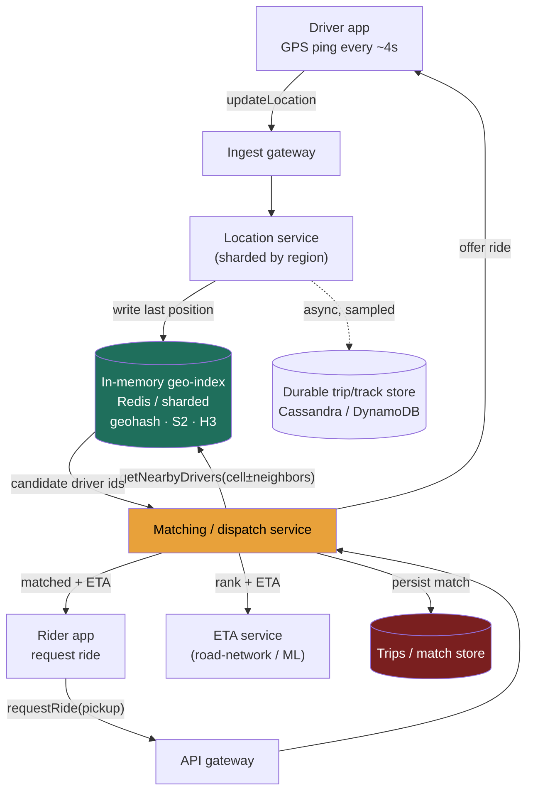

### Learning objectives
- Run the full **RESHADED** spine on a *write-dominated* geospatial problem, and recognize why that inversion (pings in ≫ nearby queries out) flips the read-heavy intuition from Twitter/Instagram.
- **Estimate** the headline number - **driver-location write QPS** - from active-driver count and ping interval, and show why the *live* index is a RAM/throughput problem, not a storage-capacity one.
- Choose a **geospatial index** from the access pattern, and explain why a uniform grid hot-spots in a dense city while an adaptive structure (quadtree / S2 / H3) does not.
- Design the **nearby-driver query** and the **matching/dispatch** service, then stress the design for hot regions, write amplification, and dispatch failure, fixing each with a named trade-off.
- Operate at **Director altitude**: tie every choice to a requirement, quantify the cost, and delegate the deep-dives (ETA, the index bake-off) with a stated prior.

### Intuition first
Picture a city carved into neighborhood squares on a giant board. Every few seconds, **every** taxi drops a pin in whatever square it's standing in. When a rider raises their hand, you don't search the whole city - you look only at *their* square and the eight touching it, and offer the ride to the closest cab. The whole system is two motions: **a firehose of pins being rewritten** (millions of cars, every few seconds) and **a tiny, cheap lookup** in one small patch of the board. The hard part isn't the lookup - it's that downtown at 6 p.m. one square holds *ten thousand* cabs while a suburban square holds three, so a board drawn with equal-sized squares has a few squares that melt and most that sit empty. The design problem: draw the squares so no single one melts, and absorb the pin firehose without it becoming the bottleneck.

That asymmetry - **a write firehose feeding a small, local read** - is the opposite of a social feed, and getting it backwards is the first thing this problem tests.

---

## R - Requirements

**Functional (the defensible core):**
1. A driver's app **reports its location** continuously while online (the write firehose).
2. A rider can **find nearby available drivers** for their pickup point (the nearby query).
3. The system **matches** a ride request to a driver and **dispatches** the offer (accept/decline, fallback to the next driver).
4. Return an **ETA / distance** for the matched driver.

**Explicitly CUT (scoping *is* the signal):** surge pricing, fares, payments, post-match live trip tracking, turn-by-turn navigation, onboarding/ratings, map rendering. Each is a real subsystem; including all of them is the "too high, hand-wavy" failure. I scope to **location ingest → index → nearby query → match/dispatch → ETA** and say so out loud.

**Clarifying questions I'd ask (and the assumptions I'll proceed on):**
- *How fresh must a driver's position be?* → **~4 s** staleness is fine (<60 m off at city speed). This sets the ping interval and therefore the write QPS.
- *Search radius / latency budget?* → radius ~**1-5 km**, p99 nearby-query latency **< 100-200 ms** (a human is on the "finding your driver" spinner).
- *Global or single-city?* → **global**, but matching is inherently **local** - a rider in Delhi is never matched to a driver in Berlin. This hands us a natural geographic shard and is the single most useful fact in the problem.
- *Consistency bar on positions?* → **eventual / best-effort.** Losing one ping is harmless (the next arrives in 4 s); the live location store needs **no durability or strong consistency**. Trips and payments (out of scope) do.

**Non-functional requirements:**
- **High write availability** for ingest - the ingest path must never block a driver's app.
- **Low read latency** (< ~200 ms p99) on the rider's critical path.
- **Eventual consistency** on positions; **no durability requirement** on live location (it's reconstructed every 4 s).
- **Geographic locality / regional isolation** - a city outage shouldn't take down another continent.
- **Elasticity for hot spots** - the design must survive a downtown cell 1000× denser than average.

**Read:write skew - the crux, stated up front.** Unlike a feed (≈100:1 *read*:write), this is **write-dominated**: every online driver writes every 4 s (~**0.5M writes/s**, derived next) while nearby queries fire only on ride requests (~**20K/s**) - roughly **25:1 write:read**, inverted. The architecture follows: the expensive thing to scale is *ingesting and indexing positions*, not serving reads.

---

## E - Estimation

*Enough math to make a defensible call - round hard, state assumptions, flex the knobs.*

**Driver-location write QPS (the headline number):**
- Registered drivers globally: assume **5M**; **~20% online at peak ≈ 1M concurrent active drivers**.
- Each pings every **4 s** → `1M ÷ 4 s =` **250K writes/s** baseline; peak/burst factor → **~0.5M location writes/sec**.
- *Flex:* if "all 5M online," it's `5M ÷ 4s ≈ 1.25M/s`. The formula `online_drivers ÷ ping_interval` is the thing to show. **Headline: ~500K write QPS, ~100% location pings.**

**Nearby-query (read) QPS:**
- **~100M rides/day** → `÷ 86,400 ≈ 1.2K/s` average; ~10× peak plus refreshes → **~20K nearby reads/sec**.
- **Confirms the inversion: 0.5M writes/s vs 20K reads/s ≈ 25:1 write:read.**

**Storage - the key realization that this is *not* a storage problem:**
- A live position is **ephemeral**: only the *latest* point matters; no history. One record ≈ `driverId + lat/lng + ts + status ≈ 40 B`, call it **~100 B** with overhead.
- `1M active drivers × 100 B =` **~100 MB** of hot location state - it fits in **RAM on one beefy node**. The live index is a **throughput/RAM** problem, not capacity. (Replicate and shard for QPS and blast-radius, not size.)
- *Durable* data (off the hot path): drivers ~5 GB; trips ~`100M/day × 1 KB × 365 ≈ 36 TB/yr` → a sharded durable store, but **not** what the matching path touches.

**Bandwidth:** ingest ≈ `0.5M/s × 100 B ≈ 50 MB/s ≈ 0.4 Gbps` of payload. Reads are negligible by comparison.

**Cache / working set:** the entire live index (~100 MB) *is* the working set and lives in memory - there's no cold tier to cache from.

**Instance count (ingest tier):** an in-memory location node sustains ~**10-50K ops/s**; `0.5M ÷ ~20K ≈` **~25 nodes**, sharded by region, each replicated. That fleet, not a database, is the spend.

**The one-line takeaway from E:** **~0.5M position writes/s into a ~100 MB in-RAM index, serving ~20K tiny local reads/s** - optimize the *write+index* path and keep the index in memory.

---

## S - Storage

Two data classes with opposite needs - matching them to stores is the S step.

**1. Live driver location + the geo-index (ephemeral, write-hot, read-local).**
- *Access pattern:* ~0.5M writes/s of last-known position; point-and-radius reads; no history; loss-tolerant; ~100 MB.
- *Choice:* an **in-memory store** - **Redis** (its geospatial commands `GEOADD`/`GEOSEARCH` encode points as geohash-scored sorted-set members) or an in-process sharded geo-index service. Positions in RAM, sharded by region, replicated async.
- *Rejected:* a disk-backed store (Postgres/Cassandra) as the *live* index - it would durably persist 0.5M writes/s of data we **explicitly don't need to keep**, paying write-amplification for a value overwritten 4 s later. The R step said positions are reconstructed every 4 s; persisting them is the classic over-engineering tell.

**2. Durable entities: drivers, riders, trips, match records (read-mostly, must persist).**
- *Choice:* a **partitioned key-value / wide-column store** (**DynamoDB** or **Cassandra**), or sharded **Postgres** if relational integrity on trips matters more than raw scale. The system of record, off the matching hot path.
- *Rejected:* the in-memory tier - losing trip records on a node failure is unacceptable (unlike positions). Different durability requirement → different store. *Also rejected:* a single unsharded Postgres at 36 TB/yr.

**The index *structure*** (geohash vs quadtree vs S2/H3) is the heart of the problem and is decided in **Evaluation**, where the dense-city hot spot forces the choice.

---

## H - High-level design



**Happy path, in prose:** drivers ping `updateLocation` every ~4 s; the regional **location service** shard overwrites that driver's position in the **in-memory geo-index**, re-bucketing them if they crossed a cell boundary - fire-and-forget, because it runs 0.5M times/sec. A rider's `requestRide` hits **matching**, which queries the geo-index for the pickup's **cell plus its neighbors** (a driver 50 m away in the adjacent cell must still be found), filters to available drivers, ranks by **ETA** (not straight-line distance - a driver 200 m away across a river is 15 min by road), and **offers** the ride - falling back to the next candidate on decline/timeout, persisting the match to the durable store on accept.

The asymmetry is visible in the diagram: the thick, hot edge is **driver → geo-index** (0.5M/s); the rider path is thin and local.

---

## A - API design

Kept deliberately small - the four functional requirements map to four calls.

```
# Driver ingest (the firehose) - tiny payload, fire-and-forget
POST /v1/drivers/{driverId}/location
  body: { lat, lng, ts, status }          # status: available | on_trip | offline
  → 202 Accepted                          # no body; never block the driver app

# Nearby query (internal, used by matching; also exposable for "cars near you")
GET  /v1/drivers/nearby?lat=&lng=&radius_m=2000&limit=20
  → 200 { drivers: [ { driverId, lat, lng, etaSeconds } ] }

# Rider requests a match (orchestrates nearby → rank → dispatch)
POST /v1/rides/request
  body: { riderId, pickup:{lat,lng}, dropoff:{lat,lng} }
  → 200 { rideId, driver:{ driverId, lat, lng }, etaSeconds }
  → 503 if no driver found in radius (caller widens radius / retries)

# Driver responds to an offer
POST /v1/rides/{rideId}/respond
  body: { driverId, decision }            # accept | decline
  → 200 { status }                        # confirmed | reoffered
```

**Design notes (each a choice with a rejected alternative):**
- `updateLocation` returns **202** - we **reject** any synchronous read-back on ingest; the driver app must never wait, and we won't serialize a response 0.5M times/sec.
- `requestRide` is a **single orchestrating call** - we **reject** client-side chaining of `nearby` → `respond`, because dispatch logic (fallback ordering, locking a driver) must be server-authoritative.
- Ingest is plain **HTTPS POST** in v1; a persistent **gRPC/WebSocket** stream removes per-ping handshake overhead and is the first ingest optimization (Design evolution).

---

## D - Data model

**Live position (in-memory):** `driverId → {lat, lng, cellId, status, ts}` plus the bucket map **`cellId` → set of drivers in that cell** - so a nearby query is "read these few cell buckets." In Redis this is a geo sorted-set per region.

**Partition / shard key = geographic region (a coarse cell, e.g. city or S2 level-8).** The load-bearing decision: because **matching is always local**, a nearby query hits **one shard**, and a city's traffic is isolated to its shard's blast radius. We **reject sharding by `driverId` hash** - it would scatter one neighborhood's drivers across every shard, turning a single local query into a fleet-wide scatter-gather.

**Durable entities (off the hot path):** `drivers` (keyed/sharded by `driverId`), `trips` (by `tripId` or city), `match_log` (by `rideId`) - in DynamoDB/Cassandra, with secondary indexes by `driverId`/`riderId` for history built lazily. We **reject** rich secondary indexing on the live store - it's a transient bucket map, not a query database. Positions live in RAM in regional shards; trips/profiles in the durable partitioned store.

---

## E - Evaluation

Re-check against the NFRs and break the design on purpose. Three bottlenecks, each fixed with a *named* trade-off.

**Bottleneck 1 - the dense-city hot spot (the central problem).**
A **uniform grid** (equal-sized cells, e.g. fixed-precision geohash) *hot-spots* because **driver density is wildly non-uniform**: a downtown cell at rush hour holds 10,000 drivers while a rural cell holds 3. The crowded cell's bucket is huge, its owning shard saturates, and a nearby query there scans thousands of candidates - while 95% of cells sit empty. *Equal-area cells, unequal load* - the grid choice is a **load-balancing** decision, not a geometry detail.

*Fix - an **adaptive, variable-resolution index** that matches cell size to density:* a **quadtree** (split a cell only when it exceeds a capacity threshold) or a hierarchical cell scheme - Google's **S2** or Uber's production choice **H3**, whose uniform hexagonal neighbors make k-ring "expand the search" queries clean. Trade: more machinery than a flat hash, bought so bucket sizes stay bounded regardless of density. We **reject** the fixed grid (hot-spots) and **reject** shrinking the grid globally (it just trades the dense hot spot for sparse-region read amplification).

<details>
<summary>Go deeper - quadtree vs S2 vs H3 geometry (IC depth, optional)</summary>

- **Quadtree:** recursively split a cell into 4 quadrants only when it exceeds a capacity threshold (say 100 drivers) - dense downtown subdivides deep, empty countryside stays one big cell. Cost: an in-memory tree that must be rebuilt/rebalanced as density shifts; every update pays a traversal.
- **S2 (Google):** projects the sphere via a **Hilbert curve** into hierarchical 64-bit cell ids, levels 0-30 (level-12 ≈ 3.3-6.4 km², level-16 ≈ ~150 m). Hilbert ordering keeps spatially-near cells numerically-near, so a radius query becomes a few range scans over id intervals, and you can mix levels (coarse where sparse, fine where dense) to bound bucket size. Cost: you manage a cell-covering per query.
- **H3 (Uber):** a hexagonal hierarchical grid. Square/geohash cells have non-uniform neighbors - edge neighbors at distance `d`, diagonal at `d√2` - so "expand the search ring" is ambiguous; hexagons have **6 neighbors all at equal distance**, making k-ring expansion and density/dispatch math uniform. Cost: hexes can't tile perfectly hierarchically (a parent's children are approximate subdivisions) - accepted for the adjacency win.
- **Why not just shrink a uniform grid globally:** uniformly tiny cells make a *sparse* nearby query touch hundreds of empty cells and explode the cell count - you trade the dense-city hot spot for a sparse-region scan. Variable resolution exists precisely so you never pick one global cell size.

</details>

**Bottleneck 2 - write amplification on cell crossings.**
A moving driver crossing a cell boundary must be removed from the old bucket and added to the new - and at fine resolution a driver near a boundary can flap between cells every few seconds, doubling index churn.
*Fix:* **coarse-enough cells for ingest** (churn is rare) while answering fine radius queries via the hierarchy, plus **hysteresis** (only move a driver clearly inside the new cell). Trade: slightly coarser buckets mean a few more candidates per query - cheap against constant re-bucketing at 0.5M/s.

**Bottleneck 3 - dispatch as a single point of failure / double-booking.**
Two riders must not be offered the same car, and a crashed matcher mid-dispatch shouldn't strand a ride.
*Fix:* matching is **stateless and regionally partitioned**, with a **short TTL'd lock/reservation** on a driver in the in-memory store the instant they're offered - a crashed matcher's lock auto-expires and the driver re-enters the pool. Trade: a lock adds a round-trip and brief driver under-utilization - accepted to prevent double-booking, with the TTL bounding crash damage.

**Re-check vs NFRs:** write availability (202, fire-and-forget, regionally sharded ✓); read latency (one-to-few in-memory shards, bounded buckets → well under 200 ms ✓); eventual consistency / no durability on positions (✓ by design); regional isolation (region = shard ✓); hot-spot survival (adaptive index + replication ✓).

---

## D - Design evolution

**At 10× (10M concurrent drivers, ~5M writes/s, ~200K nearby reads/s):**
- **Ingest becomes the dominant cost.** Move drivers to a **persistent gRPC/WebSocket stream** (kill the handshake tax) and/or front ingest with a **partitioned log (Kafka)** so bursts are absorbed. Trade: a log adds latency to position freshness - acceptable because positions are already ~4 s stale by spec.
- **Adapt the ping rate dynamically** - the cost lever: an idle or stationary driver backs off to 10-30 s, a fast-moving one stays at 4 s. This cuts write QPS by a large factor for free, at the price of client logic and variable freshness. Every second shaved off the ping interval multiplies write QPS linearly; the 4 s choice is a product decision (match quality) traded against fleet cost, and dynamic rate is how you escape the linear penalty.
- **A hot metro that outgrows its shard gets sub-divided across several nodes** and its index replicated for reads - accepting a small 2-4-shard fan-out on boundary queries (the 3.7 hot-key lesson, applied to geography).

**Hardest trade-offs to defend:**
- **Index granularity:** coarse cells minimize ingest churn but bloat candidate sets; fine cells bound query work but explode bucket-crossing writes. The honest answer is **variable resolution** - that's *why* Uber didn't ship a uniform grid.
- **Local sharding vs cross-border trips:** region sharding is the win, but airport/border cases force boundary fan-out. Accepted as a small minority of queries.

**What I'd revisit:** whether Redis-geo suffices or a purpose-built in-memory geo-service is warranted - benchmark before committing. Whether trips need a relational store (disputes, accounting) vs wide-column - a data-integrity call, not a scale call.

**Where I'd delegate (the Director move):**
- **ETA / routing:** the **Maps team owns ETA** behind a clean `etaSeconds(from, to)` interface with its own SLA - real drive-time needs a road graph, live traffic, and models, a discipline I scope out rather than whiteboard. Naming the boundary and the interface is the altitude signal.
- **Index bake-off (geohash vs S2 vs H3):** *"I'd have the platform team benchmark bucket-size distribution and query p99 under real density on the top-20 metros; my prior is H3 for the adjacency uniformity, but I want that measured, not asserted."*
- **Surge/pricing and fraud:** adjacent systems consuming the same location signal; scoped out and delegated.

---

### Trade-offs table - the pivotal decisions

| Decision | Option A | Option B | Option C | Use when… |
|---|---|---|---|---|
| **Geo-index structure** | **Uniform grid / fixed geohash** - dead simple | **Quadtree** - adaptive split on capacity | **S2 / H3** - hierarchical cells / hexagons | Grid: uniform density / prototype. Quadtree: skewed density, in-memory. **S2/H3: production geo at scale (H3 = Uber's choice).** |
| **Live-location store** | **In-memory (Redis-geo / sharded service)** | **Disk-backed durable DB** |, | In-memory: positions are ephemeral, rewritten every 4 s (the right call). Durable DB: only if you need position *history* (you don't, for matching). |
| **Shard key for the index** | **Geographic region / cell** | **`driverId` hash** |, | Region: matching is local → one-shard reads + regional isolation (the right call). driverId-hash: rejected - scatter-gathers every nearby query. |

---

### What interviewers probe here (Director altitude)

- **"What's the read:write ratio, and why does it matter?"** - *Strong signal:* names it **write-dominated** (~0.5M pings/s vs ~20K reads/s, ~25:1) and designs the ingest+index path as the thing to scale. *Red flag:* assumes read-heavy "like every web app" and over-builds a read cache.
- **"Why does a uniform grid fall over in a dense city?"** - *Strong:* equal-area cells, wildly unequal density → one bucket holds thousands, hot-spotting a shard; fix with **variable resolution** (quadtree/S2/H3), and knows a globally-tiny grid just swaps in a sparse-region scan. *Red flag:* "just add more cells."
- **"Do you persist driver locations? At what consistency?"** - *Strong:* **no durability, eventual consistency** - a position is rewritten every 4 s; keep it in RAM. *Red flag:* a durable, strongly-consistent write per ping at 0.5M/s.
- **"Where would you delegate, and how?"** - *Strong:* hands **ETA/routing** to the Maps team behind a clean interface, and proposes a **measured bake-off** for the index structure. *Red flag:* whiteboards Dijkstra and traffic modeling personally - or hand-waves "the ETA service computes it" with no interface.
- **"What does this cost to run?"** - *Strong:* the **ingest+index fleet**, driven by ping rate × online drivers - with **dynamic ping rate** and **streamed ingest** as the levers. *Red flag:* sizes a giant database and ignores that the live index is ~100 MB.

---

### Common mistakes

- **Treating it as read-heavy.** It's write-dominated; mis-sizing this mis-designs everything downstream.
- **A uniform grid / fixed geohash precision.** Guarantees a dense-city hot spot. Use quadtree/S2/H3 for variable resolution.
- **Persisting every ping durably.** Positions are ephemeral and rewritten every 4 s; durability here is pure waste.
- **Sharding the index by `driverId` instead of region.** Turns a one-shard local query into a fleet-wide scatter-gather.
- **No reservation/lock on dispatch.** Two riders get offered the same car. A short TTL'd lock prevents double-booking and self-heals on matcher crash.

---

### Interviewer follow-up questions (with model answers)

**Q1. Estimate the driver-location write QPS, and explain why that number drives the architecture.**
> *Model:* ~5M registered drivers, ~20% online at peak ≈ **1M concurrent**, pinging every **4 s** → `1M ÷ 4s = 250K/s`, ~**0.5M writes/s** peaked. Nearby reads are only ~**20K/s**, so it's **~25:1 write:read - write-dominated**, the inverse of a feed. That inversion is the whole architecture: keep the ~100 MB index **in RAM**, shard **by region**, and make the write path cheap (202 fire-and-forget, eventually streamed ingest with dynamic ping rate). No giant read cache - there's barely any read load.

**Q2. Why does a naive grid hot-spot, and what do you use instead?**
> *Model:* A uniform grid has equal-area cells but wildly unequal density - a downtown cell holds thousands of drivers, a rural one three, so one bucket saturates its shard while most sit empty. Shrinking the global cell size just makes sparse queries scan hundreds of empty cells. The fix is **variable resolution**: a quadtree that splits on capacity, or hierarchical cell schemes - S2, or H3, Uber's production choice, whose hexagons have six equidistant neighbors so ring-expansion is uniform. I'd pick via a measured bake-off on real metro density; my prior is H3.

**Q3. Do you store driver location in a database? Defend the consistency and durability choice.**
> *Model:* **No durable database for the live position** - in-memory (Redis-geo or a sharded geo-index), async-replicated, eventually consistent, loss-tolerant. From the requirements: a position is overwritten every 4 s, so it has no archival value and losing one ping is invisible. Paying durability and strong consistency on 0.5M writes/s of disposable data is the classic over-engineering trap. The durable store is reserved for trips, matches, and profiles - different durability requirement → different store.

**Q4. A driver is 50 m from the rider but in the next cell over and gets missed. What's wrong?**
> *Model:* The **cell-boundary problem** - a query reading only the rider's own cell misses closer drivers in adjacent cells. Fix: query the cell **plus its neighbor ring**, union the buckets, then rank by true ETA. H3's hexagonal k-ring makes this clean (6 equidistant neighbors, no edge-vs-corner asymmetry). Trade: a few extra buckets read per query - cheap and necessary for correctness.

---

### Key takeaways
- This problem is **write-dominated** (~0.5M pings/s vs ~20K nearby reads/s, ~25:1) - the *inverse* of a feed; design the **ingest + index** path. Derive the headline as `online_drivers ÷ ping_interval`.
- The live index is **~100 MB and ephemeral** - keep it **in RAM**, async-replicated, **eventually consistent, no durability**. Durable trips/profiles live in a separate partitioned store.
- A **uniform grid hot-spots** because density is non-uniform (equal-area cells, unequal load). Use **variable resolution** (quadtree / S2 / H3) and query the **cell + its neighbors** at boundaries.
- **Shard the index by geographic region**, never by `driverId` hash - matching is local, so region-sharding gives one-shard queries, regional isolation, and a path to sub-shard a hot metro.
- **Director moves:** the ingest fleet is the line item (dynamic ping rate + streamed ingest are the levers), a **TTL'd reservation lock** stops double-booking, and **ETA belongs to the Maps team** behind `etaSeconds(from,to)` - know where your depth ends.

> **Spaced-repetition recap:** Uber proximity = a **write firehose** (~0.5M pings/s) feeding a **tiny local read** (~20K/s) - **write-dominated, ~25:1**, the inverse of a feed. Live positions are **ephemeral → ~100 MB in RAM**, no durability. A **uniform grid hot-spots** in dense cities → **quadtree / S2 / H3** variable resolution, querying **cell + neighbors**. **Shard by region**, TTL-lock the dispatch, **delegate ETA** to the Maps team.

---

*End of Lesson 4.8. The geo-index here reuses consistent-hash sharding and the in-memory cache discipline, but inverts the read:write assumption that drove Twitter/Instagram - a reminder that **RESHADED's R and E steps decide the architecture before any box is drawn.** Next: 5.8 Dropbox/Drive - the large-file, sync-and-conflict problem.*
