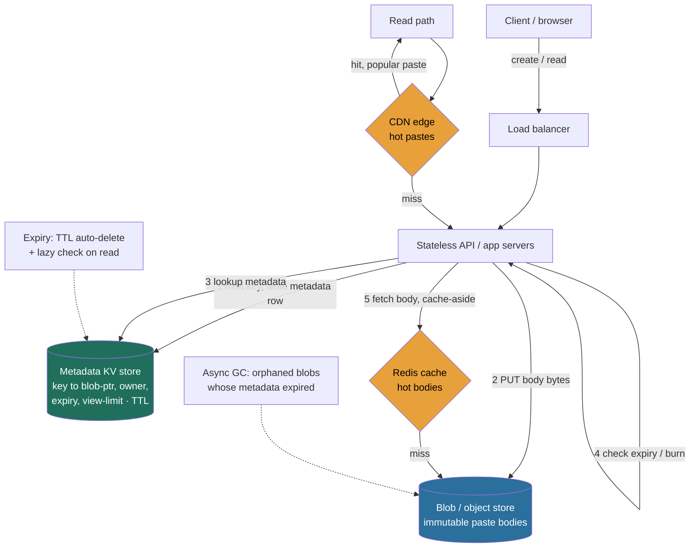

> The first full **RESHADED** problem of Module 5, deliberately *storage-shaped*. Pastebin looks trivial, "store some text, give back a link", and that's the trap. The single decision separating a Director answer from a junior one is whether you **split the metadata from the blob** or stuff both into one database. This walkthrough assembles four Module 3 building blocks, blob store (3.11), key-value store (3.4), CDN (3.5), sequencer (3.6), and treats the metadata-vs-blob split as the load-bearing decision it is.

### Learning objectives
- Run the full **RESHADED** spine on a storage-heavy problem and produce a defensible design in numbers, not adjectives.
- Justify the **metadata / blob split** against the rejected "everything in one DB" design.
- Size the system from first principles, **QPS, storage growth, bandwidth, cache working set**, and show the math.
- Design **TTL/expiry** and **one-time burn-after-read** correctly, including the consistency hazard the burn introduces.
- Identify the real bottlenecks and fix each, **naming the trade-off** every fix makes.

### Intuition first
A pasteboard is a **coat check**. You hand over a coat (the paste text) and get back a small numbered ticket (the short link). The cloakroom is two separate things: a tiny, perfectly-accurate **ticket book**, *ticket #4f3A9c → rack 7, expires 6pm, one pickup only*, and a vast **rack of hooks** that just holds coats and knows nothing about tickets or closing time. You'd never write the coat's full description into the ticket book; the book stays small and fast precisely because it holds **pointers, not coats**. Pastebin is that coat check: a small, strongly-consistent **metadata store** (key → where the bytes live, owner, expiry, views remaining) in front of a dumb **blob store** holding the actual text. TTL expires a ticket; "burn after reading" tears the stub out the instant the coat leaves.

---

## R: Requirements

RESHADED starts by bounding the problem, **scope before build** is the first thing a Director is scored on.

**Clarifying questions that change the design:**
- *Public product or internal snippet service?* Changes abuse-handling, auth, availability bar. **Assume public.**
- *Read:write skew?* **Assume ~100:1 read-heavy**, pastes are written once, read many times.
- *How big can a paste get?* *The* question for this problem. **Assume up to a few MB** (logs, config dumps), median ~10 KB, which makes the split mandatory.
- *Availability target?* **Four-nines (99.99%) on read** (the view path is the product); writes slightly weaker.

**Functional requirements:** create a paste → short URL; read by short key; **TTL expiry** (10 min / 1 day / 1 month / never); **burn-after-read** (one-time or N-time view limit).

**Non-functional:** low read latency (p99 well under ~200 ms), 99.99% read availability, durability until expiry, scale to billions of pastes and tens of thousands of reads/s, and **cost-efficiency**, we must not pay transactional-database $/GB for bulk text.

**CUT from v1 (say it out loud, scoping *down* is the signal):** syntax highlighting (client-side), full-text search (Lesson 3.12), editing/versioning (pastes are immutable; an "edit" is a new paste), accounts/folders/social, analytics. A Director who tries to build all of it in 45 minutes has misjudged altitude.

**Assumptions carried forward:** **10M new pastes/day**, **100:1 → 1B reads/day**, median **~10 KB**, immutable.

---

## E: Estimation

Enough math to make a defensible call. Round aggressively, state assumptions.

**QPS.** Writes: `10M/day ÷ 86,400 ≈ 116/s` → **~120/s avg, ~300/s peak**. Reads: `1B/day ÷ 86,400 ≈ 11,600/s` → **~12K/s avg, ~30K/s peak**. A **read-dominated** system by ~100×, the write path can be simple; the read path is where the engineering goes.

**Storage, two very different numbers, which is the whole point:**
- **Blob:** `10M/day × 10 KB = 100 GB/day` → **~37 TB/year**, order **~150-200 TB over 5 years**. Bulk, write-once, immutable.
- **Metadata:** ~200 B/row (key, owner, timestamps, blob pointer, view counts); round to ~0.5 KB with index overhead → **~5 GB/day, ~10 TB over 5 years**.
- **The ratio that decides the architecture:** the blob plane is **~20×** the metadata plane by volume, and an individual blob can be **MBs** against a **~200-byte** row, a ~10,000× per-record size gap. Putting a multi-MB body in the same row as its metadata is the mistake the split exists to avoid.

**Bandwidth.** Read egress: `12K/s × 10 KB ≈ 1 Gbps` average, **~2.4 Gbps peak**, the number that makes a **CDN non-optional**. Write ingest ~1.2 MB/s, ignore it.

**Cache working set.** Reads follow a power law. Top ~1M pastes × 10 KB = **~10 GB** → one Redis node serves ~90% of reads, with the truly viral handful absorbed by the CDN. A **10 GB cache fronting ~150 TB of blobs** is exactly why caching is cheap and effective here.

**Instances.** ~8 stateless app servers (30K peak ÷ ~5K/server, with headroom); a handful of metadata-store nodes sized for ~10 TB, not QPS; 1-3 Redis nodes; blob store + CDN are managed, you size *spend*, not boxes.

The headline: **a small-QPS, read-skewed, storage-tiered system.** The entire difficulty is modeling the data correctly (split + TTL + burn) and offloading the read tail (cache + CDN).

---

## S: Storage

Match each dataset to a store, there are two with opposite shapes, and the central decision is **two different systems**.

**Dataset 1, paste bodies.** Write-once, immutable, opaque, read by key, never queried by content. Textbook **blob/object-store** shape (3.11): **choose S3** (or GCS/equivalent).
- *Rejected, `BLOB`/`TEXT` column in the SQL DB:* the wrong tool. A relational engine is built for small rows and transactions (2.2-2.3, 3.4); multi-MB bodies bloat replication and backups and cost **transactional $/GB** for data written once and never updated. The ~10,000× per-record size gap is the whole argument, keep bytes out of the database.
- *Rejected, a DFS / raw disks we manage:* reinvents durability and tiering S3-class stores already solve.

**Dataset 2, metadata (key → location + policy).** Tiny rows, must be **strongly consistent** (a create must resolve immediately; a burn must take effect immediately), pure exact-key point lookup. Textbook **KV** shape (3.4): **choose DynamoDB / Cassandra**.
- *Why KV over relational:* O(1) lookups, horizontal scale, **native TTL**, AP-leaning availability for the four-nines read path. A **sharded Postgres** is a defensible alternative if the team runs it well, name the trade (operational familiarity vs effortless horizontal scale), don't pretend KV is the only answer.

**The split, stated as the decision:** metadata in a **strongly-consistent KV** (small, hot, TTL-aware) + bodies in a **dumb object store** (bulk, immutable), with the metadata row holding a **pointer** to the body.

---

## H: High-level design



**Create.** Client `POST`s the text; the API mints a base62 key, **writes the blob first**, then commits the metadata row (with native TTL set to `expires_at`), and returns `https://pb.io/{key}`. Order matters: a metadata row pointing at a missing blob is a broken paste; an orphaned blob is just garbage the GC reclaims.

**Read.** `GET /{key}` hits the **CDN** first, popular pastes never reach origin. On a miss, the API does a metadata lookup, **enforces policy** (expired → `410`; burn → atomic claim, see Evaluation), then fetches the body cache-aside via Redis, falling back to the blob store.

Two background loops keep it honest: **store-native TTL** deletes expired metadata, with a **lazy check on read** so we never serve an expired paste; **async GC** reclaims orphaned blobs.

---

## A: API design

A small, REST-shaped surface (2.10, REST fits resource-oriented CRUD).

```
POST /api/v1/pastes
  body: {
    "content":      "<text, up to a few MB>",
    "expiry":       "1d" | "10m" | "30d" | "never",   // optional, default e.g. 30d
    "view_limit":   1 | N | null,                      // optional; null = unlimited
    "visibility":   "public" | "unlisted"              // optional
  }
  -> 201 Created
     { "key": "4f3A9cQ", "url": "https://pb.io/4f3A9cQ", "expires_at": "...", "views_remaining": 1 }

GET  /api/v1/pastes/{key}        // or simply GET /{key} for the human URL
  -> 200 OK   { "content": "...", "created_at": "...", "expires_at": "...", "views_remaining": 0 }
  -> 410 Gone // expired, OR burn-after-read already consumed
  -> 404 Not Found

DELETE /api/v1/pastes/{key}      // owner-initiated delete (auth required)
  -> 204 No Content
```

Notes: **reads are idempotent except burn pastes**, a burn read has a side effect (it consumes a view), which is why that path needs an atomic claim; non-burn `GET`s are CDN-friendly. For multi-MB bodies, hand the client a **pre-signed upload URL** so bytes go straight to the object store (the 3.11 trick), mention it as the scaling option even if v1 proxies the bytes.

---

## D: Data model

The detail that decides whether this scales is the **partition key**. Primary access is point-lookup by `paste_key`, so `paste_key` is both the primary key and the **partition/shard key**, keys are effectively random, so hashing them spreads load with no hot shard (2.6). The row is ~200 B of pointer + policy: `blob_ptr`, owner, timestamps, `expires_at` (drives native TTL), `view_limit` / `views_remaining`, small scalars. The bytes live in the object store keyed by `blob_ptr`, immutable.

<details>
<summary>Go deeper, full metadata schema (IC depth, optional)</summary>

| Field | Type | Notes |
|---|---|---|
| `paste_key` | string (7 chars, base62) | **partition key**, every access is by exact key |
| `blob_ptr` | string | location in the object store (often = `paste_key` itself) |
| `owner_id` | string / null | null for anonymous |
| `created_at` | timestamp | |
| `expires_at` | timestamp / null | drives store-native **TTL**; null = never |
| `view_limit` | int / null | null = unlimited |
| `views_remaining` | int / null | for burn-after-read; decremented atomically on read |
| `size_bytes`, `content_type`, `visibility` | … | small scalars |

"List my pastes" (if accounts arrive) would need an index on `owner_id`, model it as a separate query-shaped table keyed by `owner_id` (denormalize rather than add a distributed secondary index, per 2.3), kept off the read-by-key path.

</details>

**Key generation (3.6):** a **7-char base62** key gives `62^7 ≈ 3.5 trillion` namespace against ~18B pastes over 5 years, random keys collide so rarely that a conditional-insert-with-retry is a non-event.
- *Chosen, random base62 + collision check:* keys are **unguessable**, which matters for unlisted pastes on a public product.
- *Rejected, counter/Snowflake → base62:* dense and sortable, but **sequentially enumerable**, scrapers can walk your pastes and competitors can count your volume. Unguessability is worth the cheap collision check.

**Where data lives, restated:** the **pointer and policy** in the KV store (source of truth for *whether and how* a paste may be read); the **bytes** in the object store (*what* it says).

---

## E: Evaluation

Stress the design against the NFRs; each fix names its trade-off.

**Bottleneck 1, the blob round-trip on every read.** A cache-miss read is two hops (metadata + object-store GET), and object-store GETs are metered. **Fix:** Redis cache-aside (~10 GB working set) + CDN; at 99% combined hit ratio origin GETs drop from 12K/s to ~120/s, the `R×(1−h)` math from 3.5. **Trade:** cache memory and CDN spend, but pastes are **immutable**, so a cached body is *never* wrong; expiry/burn are enforced at the metadata layer. That's why the split is so clean.

**Bottleneck 2, a viral paste hammers one metadata partition.** Classic hot key (2.5/2.6). **Fix:** it's the same URL for everyone, so the **CDN absorbs it at ~100% edge hit** and Redis takes the metadata lookups that leak through. **Trade:** expiry/burn must be enforced where the CDN can't short-circuit, give public pastes a **short edge TTL** (e.g. 60 s) bounded by `expires_at`, and mark burn/unlisted pastes **non-cacheable** (`Cache-Control: private`). Slightly lower hit ratio on exactly the pastes where correctness matters most.

**Bottleneck 3, burn-after-read is a race.** Two readers open a one-time paste; "read, check, serve, decrement" serves it **twice**. **Fix:** an **atomic conditional claim**, decrement only if `views_remaining > 0` (a conditional write); only the winner serves the body, the loser gets `410`. **Trade:** a strongly-consistent, serialized write on the read path and no CDN caching, isolated to burn pastes only, so the 99% of normal reads stay cheap. (On an eventually-consistent store, burn must use the strongly-consistent read/conditional-write mode, the tunable knob from 3.4/2.8.)

**Bottleneck 4, expiry at scale.** With ~18B rows, a cron scanning `expires_at < now` is a non-starter. **Fix:** **store-native TTL deletes in the background, and a lazy check on read enforces correctness immediately**, enforcement is instant, physical deletion is eventual.

<details>
<summary>Go deeper, TTL, GC, and orphaned-blob mechanics (IC depth, optional)</summary>

- Store-native TTL (DynamoDB TTL / Cassandra column TTL / Postgres partition-drop by date) deletes expired metadata with no scan, but **lags**, DynamoDB TTL can run up to ~48 h behind. The lazy read check (`if expires_at < now → 410` before serving) makes user-visible behavior correct in that window; only *physical reclamation* is delayed.
- Orphaned **blobs** (body present, metadata gone, from failed creates or expiry) are reclaimed by an async GC that deletes blob keys with no live metadata, or more simply a **lifecycle/TTL on the bucket** matching the max paste lifetime.
- The rejected alternative, a precise per-paste scheduled-deletion service (3.15), is far more machinery than TTL-with-lazy-check buys you; over-engineering for "the row eventually disappears."

</details>

**Re-check vs NFRs:** read p99 < 200 ms ✓ (CDN/Redis hits; cold reads add one object-store GET). 99.99% read availability ✓ (stateless API across AZs, AP-leaning KV, CDN `stale-if-error`). Durability ✓ (object store + replicated metadata; blob-before-metadata write order). Cost ✓ (bytes on cheap object storage, CDN offload, tiny metadata store). **No structural SPOF**; key-minting collision retries are bounded by the huge namespace and vanishingly rare.

---

## D: Design evolution

**At 10× (100M pastes/day, ~300K reads/s peak).** The read path scales essentially for free, CDN + cache + stateless app + sharded KV; the **lever is hit ratio, not origin capacity** (3.5). Storage becomes the budget line: ~370 TB/year of blob → **tier it**, recent pastes on standard storage, cold pastes (most are read in their first hours, then never) lifecycle to **IA/Glacier-class** for a ~10-23× per-GB drop, with **erasure coding** (40% overhead vs 200% replication) on the cold bulk, the 3.11 cost calculus. *This is the first place I'd delegate:* "I'd have the storage team model the retrieval-fee vs storage-saving break-even; my prior is lifecycle-to-IA at ~30 days based on the read-decay curve, but the exact age is a data question I'd hand them." Metadata at 10× is still small data, standard re-sharding (2.6), no architectural change.

**Hardest trade-offs worth naming aloud:**
- **Where the policy lives.** Keeping expiry/burn in metadata (not the immutable body) is what lets us cache bodies forever, at the price that **two systems must agree** (live row ⇒ blob exists; dead row ⇒ blob gets GC'd). The one-store alternative is simpler but reintroduces the cost problem the design exists to avoid. Keep the split, pay the GC tax.
- **Burn consistency.** A strongly-consistent conditional write on an otherwise cache-friendly read path, isolated to burn pastes so normal reads stay cheap. Forcing strong consistency on *all* reads would kill cacheability for a guarantee almost no paste needs.
- **Abuse at public scale**, rate-limit creation (3.10), scan for secrets/malware, honor takedowns, keep unlisted keys unguessable. *Delegate the content-safety pipeline:* "my prior is async scanning with a fast-path block on known-bad hashes; the classifier quality and false-positive budget belong to trust-and-safety, against a takedown SLA I set."

**What I'd revisit:** the single-region assumption. The CDN already gives **global read latency** (bodies are edge-cacheable), so the cheap win is CDN coverage and **read replicas** of the metadata store, *not* multi-region active-active writes, which drag in conflict resolution (2.4) for an immutable-data problem that barely needs it. Exhausting caching/replicas before multi-region writes is the Director instinct.

---

## Trade-offs table: the pivotal decisions

| Decision | Option A | Option B | Option C | Use when… |
|---|---|---|---|---|
| **Where the bytes live** | **Split: metadata in KV + body in blob store** *(chosen)* | Everything in one SQL DB (`TEXT`/`BLOB` column) | Everything in one KV/document store | **Split** for any paste that can exceed a few KB and any real scale. One-DB only for a toy/internal tool. |
| **Metadata store type** | **KV: DynamoDB/Cassandra** *(chosen for public scale)* | Sharded relational, Postgres/MySQL | Document store | **KV** for pure point-lookup, native TTL, effortless horizontal scale. **Relational** when the team runs it well and accepts a harder shard story. |
| **Short-key scheme** | **Random base62 + collision check** *(chosen, public)* | Counter/Snowflake → base62 | Hash of content (dedup-friendly) | **Random** when keys must be unguessable. **Counter** for internal tools where enumeration is fine. **Content-hash** for automatic dedup. |

---

## What interviewers probe here

At Director altitude they're listening for **trade-off articulation, cost ownership, and credible delegation**.

- **"Would you store the paste text in your database?"**, *Strong:* splits metadata from blob immediately and gives the size-ratio / $-per-GB argument. *Red flag:* "sure, a `TEXT` column," or splitting without being able to say *why*.
- **"How does burn-after-read stay correct under concurrency?"**, *Strong:* names the race, fixes it with an atomic conditional claim, notes burn pastes can't be CDN-cached. *Red flag:* the racy check-then-decrement.
- **"How do you expire billions of pastes without scanning?"**, *Strong:* native TTL + lazy read check; separates *enforcement* (instant) from *physical deletion* (eventual). *Red flag:* a cron table scan.
- **"What's the cost story?"**, *Strong:* bytes on cheap object storage, cold tiering, CDN offload (`R×(1−h)`), tiny metadata store, quantified. *Red flag:* can't name where the money goes.
- **"Where would you *not* go deep?"**, *Strong:* delegates the cold-tier cost model and content-safety pipeline while owning the requirement and SLA. *Red flag:* hand-waving "it scales," or rat-holing into B-tree tuning, both miss altitude.

---

## Common mistakes / misconceptions

- **Stuffing the body into the metadata DB**, the defining error: bulk write-once bytes at transactional $/GB.
- **Racy burn-after-read**, check-then-decrement double-serves a one-time paste; it needs an atomic claim.
- **CDN-caching burn/unlisted pastes**, defeats the one-time guarantee and leaks unlisted content; mark them `private`.
- **Scanning to expire pastes**, use store-native TTL + lazy read check, never a cron scan.
- **Sequential/enumerable keys on a public product**, lets scrapers walk every paste; random base62 keeps unlisted pastes unguessable.

---

## Interviewer follow-up questions (with model answers)

**Q1. A single paste goes viral and takes 80% of your read traffic. What saves you?**
> *Model:* It's a **hot key**, but it's the **same URL for everyone**, so the CDN serves it at ~100% edge hit and the body reads never reach origin; Redis absorbs the metadata lookups that leak through, `origin = R×(1−h)` with `h≈0.99` means origin sees ~1% of the spike. This works because the paste is public and immutable (cacheable). A **burn** paste is self-limiting (one reader wins); an **unlisted** one stays non-cacheable and rides Redis + the sharded store. The lever is hit ratio, never "add origin capacity."

**Q2. The PM wants paste *editing*. How does that change your design?**
> *Model:* I'd push back on mutating the body, **immutability is what lets me cache and tier bodies cheaply**. The clean model: an "edit" writes a **new immutable blob version** and the metadata row's pointer flips atomically (the 3.11 versioning pattern); the short key stays stable, the old version is GC'd. Cost I name: cache/CDN invalidation on edit (versioned blob key or purge). I would not turn the body into a mutable in-place record, that reintroduces every problem the split avoids.

**Q3. Your metadata store is eventually consistent. Where does that bite?**
> *Model:* Exactly two places: **read-your-writes on create** (the reader hits a replica that hasn't seen the new key → spurious 404) and **burn-after-read** (a stale replica could leak an extra read). Fixes: route the immediate post-create read to a strongly-consistent read for a short window; force burn pastes onto the **strongly-consistent read + conditional write** path (3.4/2.8) so the claim is serialized. Everything else tolerates eventual consistency happily, bodies are immutable and a few hundred ms of lag on a brand-new key is invisible.

**Q4. How do you stop Pastebin becoming a malware/secrets dump, and what do you own vs delegate?**
> *Model:* I **own the requirement and the SLA**, not the classifier: rate-limit creates (3.10), run new pastes through an **async content-safety pipeline** (secret-scanning, malware hashes), honor takedowns within a defined SLA, keep unlisted keys unguessable. I **delegate** the ML/heuristics to trust-and-safety, "my prior is async scanning with a fast-path block on known-bad hashes; model quality and the false-positive budget are theirs." I'd resist *synchronous* scanning on the create path, it adds latency and a dependency to every write, unless a legal requirement forces it.

---

## Key takeaways
- **The one decision that matters: split metadata from blob.** Tiny strongly-consistent metadata in a **KV store**; immutable bodies in a **cheap object store**. Bytes in the DB is the defining mistake.
- **Reason in numbers:** ~120 writes/s vs ~12K reads/s (100:1), ~100 GB/day blob vs ~5 GB/day metadata, ~2.4 Gbps peak egress → **CDN non-optional**; a ~10 GB cache fronts ~150 TB of storage.
- **TTL is two layers:** native TTL for background deletion + a lazy read check for instant enforcement, never a table scan.
- **Burn-after-read is an atomic-claim problem:** conditional decrement, strongly consistent, non-cacheable, isolated to burn pastes so normal reads stay CDN-friendly.
- **Director moves:** quantify and tier the cold-storage cost; exhaust CDN + read replicas before any multi-region write story; delegate content-safety and the cost model while owning requirement, SLA, and trade-offs.

> **Spaced-repetition recap:** Pastebin = coat check. Small strongly-consistent **metadata KV** (key → blob-ptr, owner, expiry, view-limit) over a dumb **blob store** of immutable bodies, never put bytes in the DB. ~12K reads/s vs ~120 writes/s; **CDN + Redis** make the read path cheap (`origin = R×(1−h)`). **TTL** = native-delete + lazy read check; **burn** = atomic conditional decrement (non-cacheable, strongly consistent). Random **base62** keys over enumerable counters. Tier cold blobs; delegate safety + cost-model.
