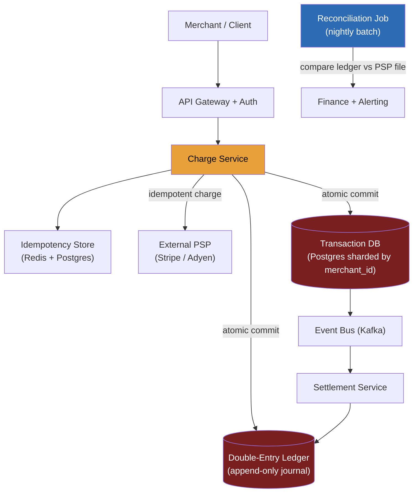

> **Why this problem separates Directors from ICs:** QPS is trivial, 1,000 transactions per second is nothing for a distributed system. The failure mode that ends careers is treating money movement like data movement. Two of eleven candidates passed a Stripe-style payments interview at one major fintech; the other nine were eliminated for the same reason: they built an eventually-consistent CRUD service. Money demands *exactly-once* effects on *at-least-once* infrastructure talking to *external rails that cannot roll back*. Get that wrong once in production and you have a regulatory incident, not a bug ticket. A Director must own that tension from the first sentence.

---

### Learning objectives

1. Articulate why payments are a **consistency-first, QPS-last** design, and quantify both.
2. Design **idempotency keys** as the mechanism that gives exactly-once semantics on at-least-once infrastructure; name the exact failure mode each layer of the stack prevents.
3. Model an **immutable double-entry ledger** at decision level and defend why append-only is non-negotiable for audit, reconciliation, and regulatory compliance.
4. Frame **reconciliation as a first-class operational process**, not error recovery but the owned admission that the system *will* drift, with jobs, alerting, and a finance partnership to close it.
5. Run a **RESHADED spine with inverted NFR priority**, consistency and auditability dominate; QPS is a footnote, and design-evolve into subscription/recurring billing.

---

### Intuition first

Imagine you walk up to an ATM, insert your card, and press "Withdraw $200." The ATM's network times out. Did the bank debit your account or not? You don't know. The ATM doesn't know. The bank's core might not know for a second or two. The right answer is: the ATM re-submits the exact same request with the exact same transaction ID, and the bank's job is to say "I already processed that; here's the same receipt" rather than debiting $400. That idempotency contract is the entire payment problem in miniature. Now scale it: thousands of merchants, hundreds of payment rails, external card networks that charge you per authorization attempt, and a regulator who wants a complete audit trail going back seven years. The interesting part is not "how do you serve 1K TPS." The interesting part is: **how do you guarantee that every dollar that leaves one account arrives in exactly one other account, exactly once, with a full paper trail, even when your own services crash, the card network times out, and the settlement batch runs at 2 AM.**

---

## R: Requirements

> Scope before build. The NFR priority here is **inverted** from the social-feed and search problems in this course, state that inversion out loud or the interviewer will think you missed it.

**Clarifying questions I'd ask (with assumed answers):**

- *Payment rails?* → **Card networks (Visa/Mastercard) via a PSP, plus ACH/bank transfer.** Stripe-style: we are the platform; merchants integrate with us; we integrate with the external rails.
- *Payout model?* → **Collect from buyer, hold in platform ledger, settle to merchant T+1 or T+2.**
- *Recurring billing?* → **Yes, subscriptions, dunning.** Cover in design evolution (D step).
- *Refunds?* → **Yes, partial and full.** Modeled as ledger entries, not deletes.
- *Multi-currency?* → **Yes, but treat FX as a delegated microservice.** Scope to single-currency core.
- *Fraud / AML?* → **Delegated to a fraud-scoring service.** I own the consistency boundary; I don't own the scoring model.

**Functional requirements:**

1. Accept a **charge** from a merchant: validate, route to the card network, persist the result.
2. **Refund** a prior charge (full or partial).
3. **Payout** to a merchant's bank account on a settlement schedule.
4. Expose a **transaction history** API for merchants and internal auditors.
5. Generate **reconciliation reports** against PSP and bank settlement files.

**Explicitly cut:** fraud ML, FX conversion, dispute/chargeback lifecycle, tokenization vault internals, compliance reporting UI, merchant onboarding/KYC. I'll name these and say "delegated" or "separate service."

**Non-functional requirements, priority order:**

| Priority | NFR | Target |
|---|---|---|
| 1 | **Exactly-once money effects** | Zero duplicate charges; zero lost payments |
| 2 | **Audit trail completeness** | Every state transition immutably persisted; 7-year retention |
| 3 | **Consistency** | Ledger debits = credits at all times; no phantom balances |
| 4 | **Durability** | RPO ≈ 0; synchronous replication before client ack |
| 5 | **Availability** | 99.99% (4 nines, ~52 min/yr downtime) for the charge path |
| 6 | **Latency** | Charge API p99 < 2 s end-to-end (card network RTT dominates) |
| 7 | **Throughput** | 1,000-5,000 TPS peak; **trivially served by any reasonable DB** |

**The inversion, stated explicitly:** in the URL shortener and Twitter problems we scaled read throughput. Here, **1,000 TPS is not the challenge, a single Postgres node handles 10K+ TPS on simple writes.** The challenge is correctness under partial failure. Every architectural decision flows from NFRs 1-4, not from NFR 7.

---

## E: Estimation

> Enough math to confirm the crux is correctness, not throughput.

**Assumptions:** 100M transactions/day; 1,000-5,000 TPS peak (Black Friday 5×); average transaction payload ~2 KB; 7-year retention.

**Transaction throughput:** `100M ÷ 86,400 ≈ 1,160 TPS average`; 5× peak → **~5,800 TPS**. A single well-tuned Postgres primary handles ~10K-30K simple inserts/s. With connection pooling (PgBouncer) and read replicas, this is **one small sharded cluster**, not a big-data problem.

**Storage:**
- Transactions: `100M/day × 2 KB × 365 days × 7 years ≈ 511 TB` over 7 years. Tiered storage, hot 90 days on NVMe, warm 1 year on standard SSD, cold archival on S3 Glacier, keeps the live DB at **~18 TB**. Manageable.
- Ledger entries: each transaction creates 2-4 journal entries; at ~500 B each → **~100 GB/day**, ~36 TB/year. Hot set <1 TB.

**Idempotency key store:** one Redis entry per in-flight request, TTL ~24 hours, ~50 B each; at 5,800 req/s peak with a 24-hour window → `5,800 × 86,400 × 50 B ≈ 25 GB`. **Fits comfortably in Redis**.

**Reconciliation job:** PSP settlement files arrive once per day, ~100M rows; a batch job at 2 AM comparing against our ledger at ~100K rows/s takes **~17 minutes**. Acceptable.

**What estimation decided:** throughput is a rounding error; storage is tierable; the hard problems are exactly-once writes and audit trail integrity, the numbers confirm the NFR ordering.

---

## S: Storage

> Four data classes; the consistency requirement of each determines the store.

**1. Transaction state machine (strongly consistent, write-critical).**

- Access pattern: insert a new transaction, atomically update its state (`PENDING → AUTHORIZED → CAPTURED → SETTLED`), idempotency check at write time. At most ~18 TB hot data.
- Choice: **PostgreSQL (sharded by `merchant_id`)** with synchronous replication (`synchronous_commit = on`). Row-level locking for state transitions; serializable isolation for the idempotency check + insert.
- Rejected, Cassandra/DynamoDB as the primary transaction store: eventual consistency under last-write-wins means two concurrent retries can both succeed and create a duplicate charge. DynamoDB conditional writes are defensible for the idempotency check alone, but multi-item consistency (transaction record + ledger entries in one atomic unit) wants real transactions. Use the store that makes the invariant cheap.

**2. The double-entry ledger (immutable, append-only, strongly consistent).**

- Access pattern: append journal entries (never update, never delete), range-scan by account and time for balances and reconciliation.
- Choice: **Append-only table in the same PostgreSQL cluster**, co-transactional with the transaction record. The write that captures a charge inserts the transaction row *and* the two ledger entries in one transaction, atomically. No separate ledger service means no distributed transaction.
- Rejected, a separate ledger microservice: the transaction record and ledger entries must be co-committed or you get a window where money moved but the ledger doesn't reflect it. If you insist on microservices, you need a saga with compensating transactions and a two-phase approach, adds latency and failure surface on the most critical path. I'd keep them in the same transactional boundary at this scale.

**3. Idempotency key store (fast lookup, TTL-managed).**

- Access pattern: point lookup by `(merchant_id, idempotency_key)` before every write; TTL ~24 hours to bound memory.
- Choice: **Redis with persistence (AOF flush-every-write)** as the fast path; back-filled into Postgres on successful completion as the durable record. Redis eviction is the risk, if Redis loses a key before the Postgres record is committed, a retry sees "new request" and could double-charge.
- Mitigation: write idempotency record to Postgres **before** calling the PSP. If Postgres has the key, it's safe to replay. Redis is a read-cache for speed; Postgres is the truth. This ordering is the key design point.

**4. Settlement and reconciliation store (append-only, analytical).**

- Choice: **S3 + Parquet** for PSP settlement files and our daily ledger snapshots; **Spark/Athena** for the reconciliation job. No need for a live DB, these are batch, append-only, range-scanned.

---

## H: High-level design

> The shape to make visible: a **thin stateless API layer** in front of a **strongly-consistent transaction + ledger core**, with external PSP calls wrapped in an idempotency + retry envelope, and a **reconciliation process** that runs out-of-band as a first-class operational concern.



**Happy path, a charge:**

1. Merchant calls `POST /v1/charges` with an **idempotency key** in the header.
2. Charge Service checks the idempotency store (Redis → Postgres). If the key exists and the result is final, **return the cached response immediately**, exactly-once enforced at the entry point.
3. If new: write a `PENDING` idempotency record to Postgres (durably, before any external call).
4. Call the PSP with its own idempotency key (derived from ours). Network timeout → **retry with the same key**, the PSP deduplicates.
5. On PSP success: in a **single database transaction**, write the transaction record (`AUTHORIZED`), append two ledger entries (debit buyer account, credit platform suspense), and mark the idempotency record `COMPLETE`. Commit. On failure: mark `FAILED`, return to merchant.
6. Kafka event emitted post-commit (transactional outbox). Settlement service reads and schedules payout.

**The critical ordering:** idempotency record written to Postgres *before* the PSP call. If the service crashes between writing the idempotency record and calling the PSP, a retry sees the pending record, calls the PSP again (which is idempotent), and completes cleanly. The alternative ordering (PSP call first, then write) creates a window where PSP succeeds but the crash prevents recording it, a charge the merchant sees as failed, the PSP sees as successful, and your ledger never captured. That is the "silent double-charge" failure mode.

---

## A: API design

> Keep to the calls the requirements demand. Idempotency semantics and status codes carry the correctness story.

```
# --- Charges ---
POST /v1/charges
  headers: { Idempotency-Key: <uuid>, Authorization: Bearer <key> }
  body: { amount, currency, source, merchant_id, description }
  -> 201 { chargeId, status:"authorized", amount, created_at }
  -> 200 { chargeId, status:"authorized", ... }  # idempotent replay — same key, same result
  -> 402 { error:"card_declined", decline_code }
  -> 422 { error:"invalid_amount" }

GET  /v1/charges/{chargeId}                    -> 200 { chargeId, status, events:[...] }

POST /v1/charges/{chargeId}/capture            # two-step auth+capture
  headers: { Idempotency-Key: <uuid> }
  -> 200 { chargeId, status:"captured" }
  -> 409 { error:"already_captured" }

POST /v1/charges/{chargeId}/refunds
  headers: { Idempotency-Key: <uuid> }
  body: { amount }                             # omit for full refund
  -> 201 { refundId, amount, status:"pending" }
  -> 422 { error:"refund_exceeds_original" }

# --- Payouts ---
POST /v1/payouts
  headers: { Idempotency-Key: <uuid> }
  body: { merchant_id, amount, currency, destination_account }
  -> 202 Accepted { payoutId, scheduled_at }

GET  /v1/balance/{merchant_id}                 -> 200 { available, pending, currency }

# --- Ledger / audit ---
GET  /v1/ledger/{account_id}?from=&to=&page=  -> 200 { entries:[{entryId,debit,credit,ref}] }
```

**Design notes (each with its rejected alternative):**

- **`Idempotency-Key` is mandatory on all mutating calls, enforced at the gateway.** Rejected: optional header, merchants will forget it on retry logic, and that is when you double-charge. Make it required; return 400 if absent.
- **201 vs 200 for idempotent replay.** RFC semantics: first successful call returns 201 Created; an idempotent replay returns 200 with the identical body. This lets clients distinguish "new" from "replayed" without parsing the body.
- **Auth+capture split.** Hotels, car rentals, and subscription trials pre-authorize but capture later. Capture carries its own idempotency key to prevent double-capture. Rejected: combined auth+capture only, too restrictive for common merchant workflows.
- **Refund as a new resource, not a DELETE.** Money never goes backwards in the ledger; a refund appends a new credit entry. `DELETE /charges/{id}` would imply the transaction never happened, wrong model, wrong audit trail.

---

## D: Data model

> Three tables carry the entire correctness story. The shard key and the idempotency uniqueness constraint are the two consequential decisions.

**`transactions`**, primary key `transaction_id` (UUID), shard key **`merchant_id`**. Columns: `status` (enum: PENDING / AUTHORIZED / CAPTURED / SETTLED / REFUNDED / FAILED), `amount`, `currency`, `idempotency_key`, `psp_charge_id` (external reference), `created_at`, `updated_at`. Unique index on `(merchant_id, idempotency_key)`, the database enforces deduplication even if the application layer is bypassed.

**`ledger_entries`**, append-only, never updated or deleted. Primary key `entry_id`; columns: `transaction_id` (FK), `account_id` (buyer / merchant / suspense / fee), `entry_type` (DEBIT / CREDIT), `amount`, `currency`, `created_at`. Partial index on `(account_id, created_at)` for balance queries. The invariant: for any completed transaction, `SUM(credits) = SUM(debits)` across all entries. This is asserted at commit time by the application; a DB constraint or a periodic reconciliation job catches any drift.

**`idempotency_records`**, primary key `(merchant_id, idempotency_key)`. Columns: `status` (PENDING / COMPLETE / FAILED), `response_body` (JSON-serialized final response), `created_at`, `expires_at`. Written before the PSP call; updated atomically with the transaction commit.

**Shard key = `merchant_id`. Why, and the trade-off named:**
All of a merchant's transactions, ledger entries, and idempotency records land on one shard. This gives us: merchant-scoped queries (balance, transaction history) are single-shard; the idempotency uniqueness index is local; multi-entry ledger commits are co-located. The risk: a very large merchant (e.g., Amazon on the platform) is a hot shard. Mitigation: a secondary sub-shard key for top-N merchants, splitting by `(merchant_id, date_bucket)`. Rejected: shard by `transaction_id` hash, scatters a merchant's data across all shards, making balance queries a scatter-gather and idempotency checks cross-shard. Locality beats even spread here.

<details>
<summary>Go deeper, double-entry journal-entry schema and balance computation (IC depth, optional)</summary>

A full journal entry for a $100 charge creates four rows in `ledger_entries`:

| entry_id | transaction_id | account_id | entry_type | amount |
|---|---|---|---|---|
| e1 | txn_abc | buyer_acct_123 | DEBIT | 100.00 |
| e2 | txn_abc | platform_suspense | CREDIT | 100.00 |
| e3 | txn_abc | platform_suspense | DEBIT | 97.00 |
| e4 | txn_abc | merchant_acct_456 | CREDIT | 97.00 |
| e5 | txn_abc | platform_suspense | DEBIT | 3.00 |
| e6 | txn_abc | platform_fee_pool | CREDIT | 3.00 |

Sum of all debits = sum of all credits = $100.00. The platform suspense account is debited and credited within the same transaction; it nets to zero. The merchant's ledger balance is the running sum of their CREDIT entries minus DEBIT entries (refunds, fees). Balance at time T: `SELECT SUM(CASE WHEN entry_type='CREDIT' THEN amount ELSE -amount END) FROM ledger_entries WHERE account_id=? AND created_at <= T`. For performance, a materialized balance snapshot updated via Kafka after each transaction commit avoids a full table scan; the ledger entries remain the source of truth for audit.

The immutability guarantee is enforced at the application level (no UPDATE/DELETE on `ledger_entries` except via a table-level permission revoked from the application role) and at the architectural level (the reconciliation job would immediately surface any tampered rows via hash-chain verification if that control is required by the regulator).

</details>

---

## E: Evaluation

> Re-check against the NFRs. The bottlenecks here are correctness failures, not throughput failures.

**Re-check vs NFRs:**

- Exactly-once money effects → idempotency record written before PSP call; unique DB index as a final backstop; PSP called with a derived idempotency key.
- Audit trail completeness → append-only ledger, never updated; 7-year tiered retention.
- Consistency → debits = credits enforced in every commit; reconciliation catches drift.
- Durability → `synchronous_commit = on`; writes replicated to at least one standby before ack.

Now the failure modes.

**Failure 1, Crash between PSP call and DB commit (the most dangerous race).**

PSP authorizes the charge; the service crashes before committing. Merchant retries with the same idempotency key. Service finds the record PENDING, re-calls the PSP with the same derived key; PSP returns the prior result. Service commits and marks COMPLETE. Money moved exactly once. This is why the ordering is load-bearing: **idempotency record to Postgres before PSP call**. Reverse it and you get a window where PSP succeeds but the crash prevents recording it.

**Failure 2, PSP succeeds but the HTTP response is lost (silent success).**

PSP charged the card; our service recorded the transaction as FAILED (timeout looked like a decline). Without a PSP-level idempotency key, the retry charges twice. With the derived key, the PSP returns the prior result on retry. If no retry arrives (merchant gave up), the reconciliation job catches it at 2 AM: PSP settlement file shows a captured charge; our ledger shows FAILED for that PSP charge ID. Alert → manual review → refund or close. **Reconciliation is the catch-all for the cases idempotency doesn't cover.**

**Failure 3, The double-entry invariant drifts.**

Application bug writes a transaction record but skips a ledger entry. The reconciliation job detects `SUM(credits) ≠ SUM(debits)`. Alert fires; a compensating entry is manually inserted with a full audit trail (this is a legitimate ledger operation). The invariant is never silently wrong, always detectable, always correctable with a paper trail.

**Reconciliation as a first-class operational process (the Director framing):**

Most candidates treat reconciliation as a bug-fix script. The Director framing: reconciliation is the **explicit architectural admission that your distributed system will drift.** PSPs double-charge. Settlement files arrive late. Clock skew puts a transaction in the wrong day's batch. It is the **operational contract** with the financial rails, not error recovery. It requires: a daily job comparing your ledger against PSP settlement files; alerting on any discrepancy > $0 within 2 hours; a finance-team SLA for resolution (typically 24 hours); an audit trail of every discrepancy and its resolution. Cost: one reconciliation engineer and a finance partnership. Without it, you fail your first SOC 2 audit. I'd delegate the job implementation to my data-engineering team with a stated requirement: zero unresolved discrepancies older than 24 hours.

---

## D: Design evolution

> Subscription / recurring billing as the primary evolution, because it adds a stateful dunning machine the happy path doesn't have.

**Subscription and recurring billing:**

A subscription is a charge that recurs on a schedule. The new components:

1. **Renewal scheduler.** A service that reads a `subscriptions` table and enqueues renewal jobs at the right time. The scheduler must be **exactly-once at the job level**, two scheduler instances must not both enqueue a renewal for the same billing period. Implementation: a distributed lock on `(subscription_id, billing_period)` before enqueueing, or a DB-level unique constraint on the renewal job record. The job enqueues a charge request with a deterministic idempotency key: `SHA256(subscription_id + billing_period)`. The charge path is already idempotent, the renewal scheduler just needs to enqueue once.

2. **Dunning state machine.** When a renewal charge fails (card declined, expired card), the subscription enters a dunning sequence: retry at T+1 day, T+3 days, T+7 days, then cancel. The state machine lives in the `subscription_billing_events` table (append-only, same ledger pattern). States: ACTIVE → PAST_DUE → DUNNING → CANCELED (or RENEWED on recovery). Each retry is a new charge attempt with a new idempotency key derived from `(subscription_id, billing_period, retry_number)`.

3. **The operational dimension Directors must name:** dunning is a customer experience and a revenue problem, not just a technical one. A 1% improvement in dunning recovery on $1B ARR is $10M. The dunning retry schedule, the copy in the "update your card" email, and the grace period before cancellation are business decisions that belong to product and finance, not engineering. The engineering contract is: expose a clean `dunning.retryCharge(subscriptionId, billingPeriod, retryN)` interface with idempotency, and fire events that the CRM can consume.

**At 10× throughput (50,000 TPS):**

50K TPS (~4.3B transactions/day) is where Postgres write throughput actually becomes a constraint (~30-50K TPS ceiling with pooling). Migration: **CockroachDB or Spanner** for horizontal transactional scaling, or aggressive `merchant_id`-based sharding with a routing layer. Ledger at 4 entries per transaction → 200K inserts/s; partition by `(account_id, month)` and tier aggressively. Move reconciliation from nightly Spark to near-real-time Flink streaming against PSP webhooks. **The consistency requirement does not change at 10×**, the design scales out; the invariant does not relax.

**Related topics:** distributed transactions and sagas (relevant if you split the transaction record and ledger into separate services); the distributed job scheduler (the renewal scheduler uses the same exactly-once job execution pattern); the fraud detection system (the fraud scoring service that feeds into the charge path).

---

### Trade-offs table: the pivotal decisions

| Decision | Option A | Option B | Option C | Use when... |
|---|---|---|---|---|
| **Idempotency key store (fast path)** | **Redis + Postgres (Redis as read-cache, Postgres as truth)** | Postgres only | Distributed KV (DynamoDB conditional write) | **A** for latency + durability at this scale. **B** if Redis ops cost is unjustified or you're early-stage. **C** if you're already all-in on AWS and want a single datastore. |
| **Ledger co-location** | **Ledger entries in the same Postgres txn as the transaction record** | Separate ledger microservice with saga | Event-sourced ledger (Kafka as truth) | **A** for atomic commit, no distributed transaction on the critical path (our choice). **B** when org boundaries force microservices (accept the saga complexity). **C** for high-throughput append-heavy workloads where Kafka is already the platform truth. |
| **Reconciliation timing** | **Nightly batch (Spark vs PSP settlement file)** | Near-real-time streaming (Flink vs PSP webhooks) | Manual, on-demand | **A** for most payment platforms where PSP settlement files are daily anyway. **B** at 10× scale or when the PSP supports webhooks with low latency. **C** never in production, this is a compliance requirement, not optional. |
| **Shard key** | **`merchant_id`**, locality for per-merchant queries and idempotency | `transaction_id` hash, even distribution | `(merchant_id, date_bucket)`, locality + hot-merchant mitigation | **A** as default. **C** for platforms with a handful of very large merchants. **B** rejected, scatters per-merchant queries and cross-shards idempotency checks. |

---

### What interviewers probe here (Director altitude)

- **"How do you prevent a double charge when the client retries?"**, *Strong signal:* names idempotency keys as the mechanism, explains the exact ordering (write idempotency record to Postgres *before* calling PSP; derive a PSP-level key from ours), and identifies the crash-between-PSP-and-commit as the hardest case. *Red flag:* "we deduplicate by checking if a transaction exists" (a check-then-act race), or "the client should not retry" (clients always retry).

- **"Why a double-entry ledger? Isn't a transaction table enough?"**, *Strong signal:* double-entry makes *every* money movement auditable and self-consistent, debits always equal credits; a bug that moves money without a matching entry is immediately detectable at reconciliation. Single transaction table has no cross-account consistency check. Also: regulators and auditors require double-entry for any platform that holds money. *Red flag:* "it's the accounting standard" without explaining the technical invariant it enforces.

- **"What is reconciliation for, and who owns it?"**, *Strong signal:* reconciliation is the architectural admission that distributed systems drift; it is a first-class operational process owned jointly by engineering and finance, not a bug-fix script. Names the specific failure modes it catches: silent PSP successes, settlement timing skew, ledger drift from application bugs. *Red flag:* "a cron job that fixes discrepancies", misses the operational and compliance dimensions.

- **"What breaks at 10× throughput?"**, *Strong signal:* identifies Postgres write throughput as the first thing that breaks (~30-50K TPS ceiling), proposes CockroachDB/Spanner or aggressive sharding, and notes that the consistency requirement *does not relax*, more shards, same invariant. *Red flag:* "we add more read replicas" (read replicas don't help write throughput) or "we switch to Cassandra" (giving up transactions to gain throughput in a domain where transactions are non-negotiable).

- **"How does the renewal scheduler guarantee exactly-once billing?"**, *Strong signal:* distributed lock or DB unique constraint on `(subscription_id, billing_period)` before enqueueing; deterministic idempotency key for the charge `SHA256(sub_id + billing_period)`; the charge path is already idempotent so the scheduler only needs to enqueue once. *Red flag:* "we use a cron job and check for duplicates", check-then-act race condition.

---

### Common mistakes

- **Treating money movement like data movement.** Storing a transaction and calling a PSP are both writes, but they are not the same write. The ordering (idempotency record → PSP call → DB commit) is load-bearing. Reversing it or parallelizing it creates a silent double-charge window.
- **Making idempotency keys optional.** "The client should generate them" without enforcing at the gateway means the first client who forgets generates a duplicate charge in production. Require and enforce.
- **Reconciliation as error recovery rather than architecture.** If reconciliation is not running nightly in production from day one, you will fail your first financial audit. It is not optional debt; it is a first-class operational requirement.
- **Scaling the ledger with caching.** A cached balance is a balance that can lie. Every balance presented to a merchant or auditor must be derived from the immutable ledger entries, not from a cached counter that could have drifted. Cache for read performance; always verify against the ledger.
- **Forgetting the PSP-level idempotency key.** Your service is idempotent, but if you call the PSP without a stable key derived from your idempotency key, a network retry calls the PSP twice and charges the card twice. Both layers, your service and the PSP integration, need idempotency.

---

### Practice questions with model answers

**Q1. Charge request times out at the client. How many times is the card charged?**

> *Model:* Exactly once. Client retries with the same `Idempotency-Key`. If COMPLETE in the idempotency store, return the cached response, PSP not called again. If PENDING, a prior attempt started but crashed; re-call the PSP with the same derived key; PSP returns the prior result; commit and mark COMPLETE. Any number of retries → exactly one PSP charge. The key invariant: the PSP-level idempotency key is deterministically derived from ours.

**Q2. An engineer proposes switching the ledger to Cassandra for write throughput. Evaluate.**

> *Model:* At 5,800 TPS, Postgres handles this comfortably, solving a problem we don't have. Cassandra's LWW model breaks the double-entry invariant: two concurrent writes can resolve via LWW to a balance that's wrong for both. The ledger needs atomic multi-row commits across multiple accounts. If we hit ~50K TPS, I'd move to CockroachDB or Spanner, ACID at horizontal scale. Cassandra is right for a different data class (append-only time-series, high-throughput wide-column reads); not for a ledger that requires transaction atomicity.

**Q3. Nightly reconciliation finds 47 transactions where PSP shows "captured" but our ledger shows "failed." What happened and how do you resolve it?**

> *Model:* Silent PSP success, PSP charged the card, HTTP response was lost, no retry arrived (retry budget exhausted or merchant gave up). Card was charged; merchant was not paid; buyer was not refunded. Resolution: (a) alert finance immediately; (b) create ledger correction entries, credit buyer, debit platform reserve; (c) root-cause the missing retry (idempotency key TTL, retry budget); (d) if a pattern, move toward near-real-time reconciliation against PSP webhooks. Every correction entry is itself an immutable ledger row with `reason: reconciliation_correction`, full audit trail preserved.

---

### Key takeaways

1. **QPS is a footnote; consistency is everything.** 1,000-5,000 TPS is trivial for any modern database. The hard problem is exactly-once money effects on at-least-once infrastructure. Every architectural decision flows from NFRs 1-4 (correctness, audit, consistency, durability), not from throughput.
2. **Idempotency keys have an exact ordering:** write the idempotency record to durable storage *before* calling the PSP. This ordering is what closes the crash-between-PSP-and-commit window. The PSP must also receive a derived idempotency key, or the second layer of protection is absent.
3. **The double-entry ledger enforces debits = credits as a hard invariant,** making every money-movement bug immediately detectable at reconciliation. Append-only means no quiet corrections; every fix is itself a ledger entry with a full audit trail. Regulators require it; your on-call team will thank you.
4. **Reconciliation is not error recovery, it is architecture.** Build it on day one, run it nightly, alert on every discrepancy > $0, and partner with finance on resolution SLAs. It is the explicit admission that distributed systems drift and the operational process that closes the loop.
5. **Design evolution toward subscriptions adds exactly one new problem:** exactly-once job enqueue for the renewal scheduler. Solve it with a deterministic idempotency key `SHA256(sub_id + billing_period)` and a distributed lock or DB unique constraint before enqueue. The charge path is already idempotent, reuse it.

> **Spaced-repetition recap:** Payments = **exactly-once money effects on at-least-once infra**. The triad: **idempotency keys** (write to Postgres before PSP call; derive a PSP-level key from yours) + **immutable double-entry ledger** (debits = credits, append-only, never delete) + **reconciliation as a first-class operational process** (nightly batch, alert on every discrepancy, finance partnership). QPS (1K-5K TPS) is trivial; correctness is everything. Subscription evolution adds a renewal scheduler with a deterministic idempotency key and a dunning state machine. Related: sagas, the job scheduler, fraud detection.

---

*End of Lesson 5.1. The payment problem inverts every instinct from the read-heavy, cache-everything modules: throughput is easy, correctness is hard, and reconciliation is not debt but architecture.*
