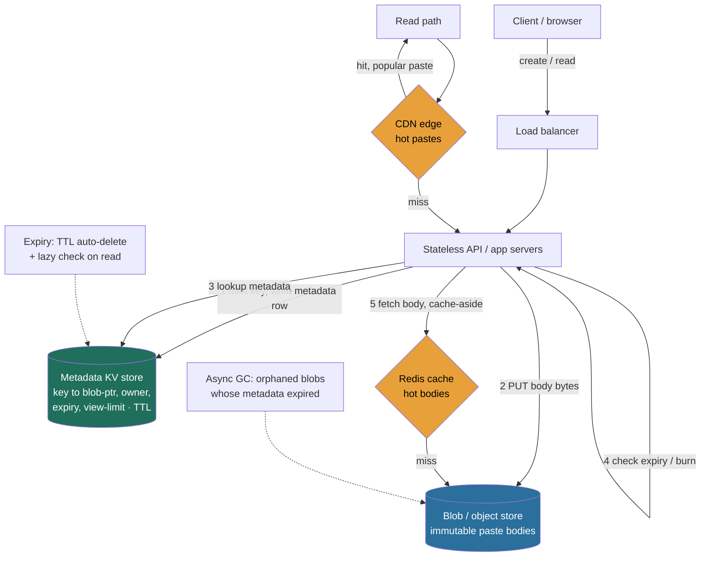

> This is the first full **RESHADED** problem of Module 5, and it is deliberately a *storage-shaped* problem, not a logic-shaped one. Pastebin looks trivial — "store some text, give back a link" — and that is exactly the trap. The single decision that separates a Director answer from a junior one is whether you **split the metadata from the blob** or stuff both into one database. Lesson 3.11 (Blob / Object Store) built the data plane this problem leans on; 3.4 (Key-Value Store) built the metadata store; 3.5 (CDN) built the read-offload tier; 3.6 (Sequencer) built the ID scheme. This walkthrough assembles all four into one design, and treats the metadata-vs-blob split as the load-bearing decision it is.

### Learning objectives
- Run the full **RESHADED** spine on a storage-heavy problem and produce a defensible design in numbers, not adjectives.
- Justify the **metadata / blob split** against the rejected "everything in one DB" design, using the row-size and buffer-pool argument.
- Size the system from first principles — **QPS, storage growth, bandwidth, cache working set, instance count** — and show the math.
- Design **TTL/expiry** and **one-time burn-after-read** correctly, including the consistency hazard the burn introduces.
- Identify the real bottlenecks (a hot/viral paste, the expiry sweep, the blob round-trip on the read path) and fix each, **naming the trade-off** every fix makes.

### Intuition first
A pasteboard is a **coat check**. You hand over a coat (the paste text) and get back a small numbered ticket (the short link). The cloakroom runs as two completely separate things, and the whole design depends on keeping them separate: a tiny, perfectly-accurate **ticket book** that records *ticket #4f3A9c → rack 7, hook 23, expires at 6pm, one pickup only* — a few dozen bytes per entry that must never be wrong — and a vast **rack of hooks** in the back that just holds coats and knows nothing about tickets, owners, or closing time. The clerk reads the ticket book to find *where* the coat is, then walks to the rack to fetch it. You would never write the coat's full description into the ticket book — the book stays small and fast precisely because it holds **pointers, not coats**. Pastebin is that coat check: a small, strongly-consistent **metadata store** that maps a short key to *where the bytes live, who owns it, when it expires, how many views remain*, sitting in front of a dumb **blob store** that holds the actual snippet text. Everything below — why we split them, how TTL expires a ticket, how "burn after reading" tears the stub out of the book the instant the coat leaves — is a literal feature of that cloakroom.

---

## R — Requirements

RESHADED starts by bounding the problem, because **scope before build** is the first thing a Director is scored on. The move is to separate functional from non-functional, ask the two or three clarifying questions that actually change the architecture, then **cut** to a defensible core out loud.

**Clarifying questions that change the design (ask these, don't assume silently):**
- *Is this a public product (like pastebin.com) or an internal snippet service?* It changes abuse-handling, auth, and the availability bar. **Assume public product.**
- *What's the read:write skew?* This decides whether we optimize the read path hard. **Assume ~100:1 read-heavy** — pastes are written once and read many times (you share a link, N people open it).
- *How big can a paste get?* This is *the* question for this problem. If pastes are always a few KB we *could* get away with one store; if they can be megabytes, the split becomes mandatory. **Assume up to a few MB** (logs, stack traces, config dumps), median ~10 KB.
- *What's the availability target on read vs write?* **Assume four-nines (99.99%) on read** (the redirect/view path is the product); writes can be slightly weaker.

**Functional requirements (the core):**
- **Create** a paste from text → return a short, shareable URL.
- **Read** a paste by its short key → return the text.
- **Expiry (TTL):** a paste can be set to expire after a duration (10 min, 1 day, 1 month, never).
- **Burn-after-read (view-limit):** an optional one-time (or N-time) paste that becomes unreadable after the limit is hit.

**Non-functional requirements:**
- **Low read latency** (p99 well under ~200 ms) and **high read availability** (99.99%).
- **Durability** of stored pastes (don't lose a paste before its expiry).
- **Scalable** to billions of stored pastes and tens of thousands of reads/s.
- **Cost-efficient** — text is cheap; we must not pay transactional-database $/GB to store it.

**CUT from v1 (state this explicitly — scoping *down* is the signal):** rich text/markdown rendering, syntax highlighting (client-side concern), full-text search across pastes (a separate distributed-search problem, Lesson 3.12), paste editing/versioning (pastes are immutable — an "edit" is a new paste), user accounts/folders/social features, and analytics dashboards. I'll mention where each *would* slot in, but they are not the core, and a Director who tries to build all of it in 45 minutes has misjudged altitude.

**The scale/skew assumptions I'm carrying forward** (everything in E depends on these): **10M new pastes/day** (writes), **100:1 read:write → 1B reads/day**, **median paste ~10 KB**, pastes **immutable** once written.

---

## E — Estimation

The goal here is **enough math to make a defensible call**, not a spreadsheet. Round aggressively, state assumptions, and let the numbers drive the store choices in S. (Reason in numbers — that's the E-step signal.)

**QPS (write and read).**
- Writes: `10M pastes/day ÷ 86,400 s ≈ 116/s` → call it **~120 writes/s** average, **~300/s peak** (assume ~2.5× peak-to-average).
- Reads: `1B reads/day ÷ 86,400 s ≈ 11,600/s` → call it **~12K reads/s** average, **~30K/s peak**.
- Takeaway: this is a **read-dominated** system by ~100×. The write path can be simple; the read path is where the engineering goes.

**Storage (with growth).** Two *very different* numbers, which is the whole point of this problem:
- **Blob (paste bodies):** `10M/day × 10 KB = 100 GB/day` → `× 365 ≈ ~37 TB/year`. Over 5 years (assuming a chunk of pastes are "never expire"), order **~150–200 TB** cumulative. This is bulk, write-once, immutable data.
- **Metadata (one small row per paste):** key (~8 B) + owner (~8 B) + created/expiry timestamps (~16 B) + blob pointer/key (~40 B) + view-count/view-limit (~16 B) + flags ≈ **~200 bytes/row**; round to **~0.5 KB/row** with index overhead. So `10M/day × 0.5 KB ≈ 5 GB/day` → **~1.8 TB/year**, ~**10 TB over 5 years**.
- **The ratio that decides the architecture:** the blob plane is **~20×** the metadata plane by volume (100 GB/day vs 5 GB/day), and an individual blob can be **MBs** while a metadata row is **~200 bytes** — a ~10,000× size gap per record. Putting a multi-MB body into the same row as its 200-byte metadata is the mistake the split exists to avoid.

**Bandwidth.**
- **Read egress:** `12K reads/s × 10 KB ≈ 120 MB/s ≈ ~1 Gbps` average; **peak ~30K/s × 10 KB = 300 MB/s ≈ ~2.4 Gbps**. This is the number that makes a **CDN non-optional** — serving 2.4 Gbps of popular-paste bytes straight from origin is wasteful when a handful of pastes account for most of it.
- **Write ingest:** `120 writes/s × 10 KB ≈ 1.2 MB/s` — trivial; ignore it.

**Cache working set.** Reads follow a power law — a viral paste (a leaked config, a popular code snippet) can take a large share of traffic. To serve ~90% of reads from cache, cache the hottest pastes: say the top **~1M pastes × 10 KB = ~10 GB** → fits comfortably in **one Redis node** (or a small cluster with headroom), and the truly viral handful are absorbed by the **CDN** above it. The point: the working set is **tiny relative to total storage** (10 GB of cache fronting ~150 TB of blobs), which is exactly why caching is cheap and effective here.

**Instance count (order-of-magnitude).**
- **Stateless app/API servers:** at, say, ~5K req/s each (a read is a metadata lookup + a cache/blob fetch), `30K peak ÷ 5K ≈ 6` → run **~8 app servers** with headroom across AZs. Stateless, so autoscale on QPS.
- **Metadata store:** ~30K read QPS + 300 write QPS is trivial for a sharded KV / SQL — a **handful of nodes** sized for the ~10 TB dataset and replication, not for QPS.
- **Cache:** **1–3 Redis nodes** for the ~10 GB working set + replicas.
- **Blob store + CDN:** managed (S3-class + CloudFront-class) — you size *spend*, not boxes.

The headline a Director states: **this is a small-QPS, read-skewed, storage-tiered system.** Nothing here needs exotic scale; the entire difficulty is **modeling the data correctly** (split + TTL + burn) and **offloading the read tail** (cache + CDN).

---

## S — Storage

Now match each kind of data to the right store — *match data to store* is the S-step signal. There are two distinct datasets with opposite shapes, and the central decision is to **store them in two different systems**.

**Dataset 1 — paste bodies (the blob).** Write-once, immutable, opaque text from a few hundred bytes to a few MB, read by key, never queried by content (we cut search). This is the textbook **blob/object-store** shape (Lesson 3.11): a dumb, append-only, capacity-scaled byte store. **Choose an object store — S3 (or GCS/Azure Blob, or an internal Colossus-class store).**
- *Rejected — store the body as a `BLOB`/`TEXT` column in the same SQL DB:* a relational engine is built for small rows, in-place updates, MVCC, and transactions (Lessons 2.2–2.3). Multi-MB bodies **wreck the buffer pool** (one big row evicts thousands of useful pages), bloat **replication and backups**, and cost **transactional-database $/GB** for data that is written once and never updated. This is the single decision the whole problem turns on, and the answer is to keep bytes out of the database.
- *Rejected — a distributed file system / raw disks managed by us:* reinvents durability, tiering, and multipart that S3-class stores already solve; no reason to build it.

**Dataset 2 — metadata (key → location + policy).** Tiny records (~200 B), enormous request rate relative to size, must be **strongly consistent** (the moment a create returns, the key must resolve; a burn must take effect immediately), and accessed by **exact-key point lookup** — no joins, no ad-hoc queries. This is the textbook **key-value** shape (Lesson 3.4). **Choose a KV store — DynamoDB / Cassandra (or a sharded Postgres/MySQL on the primary key if you want SQL ergonomics and native TTL).**
- *Why KV over relational for the metadata:* access is pure `key → row` with massive read skew and a four-nines availability need; KV gives O(1) lookups, horizontal scale, native **TTL** (DynamoDB TTL / Cassandra `TTL`), and AP-leaning availability. (This mirrors the TinyURL store choice in Lesson 2.2 — Pastebin's metadata table *is* TinyURL plus a blob pointer.)
- *Why not pure relational:* we'd pay B-tree/MVCC overhead and a harder horizontal-scale story for an access pattern that never needs joins or transactions across pastes. A single sharded Postgres is a perfectly defensible *alternative* if the team already runs Postgres well and wants `SERIAL`/SQL TTL — name it as the trade (operational familiarity vs. effortless horizontal scale), don't pretend KV is the only answer.

**The split, stated as the decision:** metadata in a **strongly-consistent KV** (small, hot, point-lookup, TTL-aware) + bodies in a **dumb object store** (bulk, immutable, capacity-scaled), with the metadata row holding a **pointer (blob key)** to the body. This is the same two-planes pattern as the object store itself (3.11) applied one level up.

---

## H — High-level design

Think in components. Here are the boxes and the happy paths.



**Happy-path: create a paste.**
1. Client `POST`s the text (+ optional expiry, view-limit) to the API via the load balancer.
2. API **mints a short key** (base62; see D) and **writes the body** to the blob store, getting back a blob key (or uses the paste key directly as the blob key).
3. API **writes the metadata row** to the KV store: `{key, blob_ptr, owner, created_at, expires_at, views_remaining, ...}`, with the store's native **TTL set to `expires_at`**.
4. API returns the short URL `https://pb.io/{key}`. (Order matters: write the blob *first*, then commit metadata — a metadata row that points at a missing blob is a broken paste; an orphaned blob with no metadata is just garbage the GC reclaims.)

**Happy-path: read a paste.**
1. `GET /{key}` hits the **CDN** first. For a popular paste it's a cache hit served from the edge — origin never sees it.
2. On a miss, the request reaches an **API server**, which does a **metadata lookup** in the KV store by `key`.
3. API **enforces policy**: if `expires_at` has passed → `404/410 Gone`; if it's a burn paste, atomically decrement/claim a view (see E — Evaluation) and serve-then-burn.
4. API **fetches the body** — cache-aside via Redis (hit: return; miss: read from the blob store, populate cache), then returns the text.

Two background loops keep it honest: **expiry** (store-native TTL deletes metadata; a lazy check on read also enforces it so we never serve an expired paste even before the sweep runs) and **async GC** (reclaim blob bytes whose metadata has expired/been deleted).

---

## A — API design

Define the interfaces. A small, REST-shaped surface is correct here (Lesson 2.10 — REST fits resource-oriented CRUD).

```
POST /api/v1/pastes
  body: {
    "content":      "<text, up to a few MB>",
    "expiry":       "1d" | "10m" | "30d" | "never",   // optional, default e.g. 30d
    "view_limit":   1 | N | null,                      // optional; null = unlimited
    "visibility":   "public" | "unlisted"              // optional
  }
  -> 201 Created
     { "key": "4f3A9cQ", "url": "https://pb.io/4f3A9cQ", "expires_at": "...", "views_remaining": 1 }

GET  /api/v1/pastes/{key}        // or simply GET /{key} for the human URL
  -> 200 OK   { "content": "...", "created_at": "...", "expires_at": "...", "views_remaining": 0 }
  -> 410 Gone // expired, OR burn-after-read already consumed
  -> 404 Not Found

DELETE /api/v1/pastes/{key}      // owner-initiated delete (auth required)
  -> 204 No Content
```

Notes that signal seniority:
- **Reads are idempotent except for burn pastes** — a burn read has a side effect (it consumes a view), which is why that one path needs an **atomic** claim, not a plain read (handled in Evaluation). For non-burn pastes, `GET` is cacheable and CDN-friendly.
- **Writes return the key and the canonical short URL** so the client doesn't construct it.
- **Large bodies:** for multi-MB pastes you can hand the client a **pre-signed upload URL** to `PUT` the body straight to the object store (bypassing your API for the bytes), then `POST` just the metadata — the same trick that keeps the object store's API tier thin (3.11). Mention it as the scaling option even if v1 proxies the bytes.

---

## D — Data model

Know where data lives — including the **partition key**, the one detail that decides whether this scales.

**Metadata row (KV store), partitioned by `paste_key`:**

| Field | Type | Notes |
|---|---|---|
| `paste_key` | string (7 chars, base62) | **partition key** — every access is by exact key |
| `blob_ptr` | string | location in the object store (often = `paste_key` itself) |
| `owner_id` | string / null | null for anonymous |
| `created_at` | timestamp | |
| `expires_at` | timestamp / null | drives store-native **TTL**; null = never |
| `view_limit` | int / null | null = unlimited |
| `views_remaining` | int / null | for burn-after-read; decremented atomically on read |
| `size_bytes`, `content_type`, `visibility` | … | small scalars |

**Body (object store):** the opaque paste bytes, keyed by `blob_ptr`, **immutable**, durability per the store's scheme (replication for hot/small, erasure coding for cold/bulk — 3.11).

**Keys, indexes, partition/shard key — the decisions:**
- **Primary access is point-lookup by `paste_key`**, so `paste_key` is both the primary key *and* the **partition/shard key**. A hash of the key spreads writes and reads evenly across shards (consistent hashing, 2.6) — no hot shard, because keys are effectively random.
- **Key generation:** a **7-character base62** key gives `62^7 ≈ 3.5 trillion` namespace — far above our ~18B pastes over 5 years (`10M/day × 365 × 5 ≈ 18B`), so collisions are a non-issue with random keys. Two viable schemes (Lesson 3.6):
  - *Random base62 + collision check:* generate a random 7-char key, conditional-`PUT` (insert-if-not-exists); on the astronomically rare collision, retry. Keys are **unguessable** (good for unlisted pastes) and carry no information. **Chosen** for a public product where enumeration is a concern.
  - *Counter/Snowflake → base62 encode:* dense, sortable, no collision check, but **sequentially enumerable** (a competitor can walk your pastes and count volume). *Rejected* for the public product precisely because enumerable keys leak data and let scrapers harvest pastes — the unguessability of random keys is worth the cheap collision check.
- **No secondary indexes in the hot path.** "List my pastes" (an owner view, if we add accounts) would need an index on `owner_id` — model it as a **separate query-shaped table** keyed by `owner_id` (denormalize rather than add a distributed secondary index, the 2.3 lesson), and keep it off the read-by-key path.
- **Where data lives, restated:** the **pointer and policy** live in the KV store (small, consistent, TTL-aware); the **bytes** live in the object store (bulk, immutable). The KV row is the source of truth for *whether and how* a paste may be read; the object store just holds *what* it says.

---

## E — Evaluation

Now stress the design against the NFRs and hunt the bottlenecks — *stress your own design* is the whole point of this step. Each fix names the trade-off it makes.

**Bottleneck 1 — the blob round-trip on every read (latency + cost).** A cache-miss read does *two* hops: metadata lookup, then object-store `GET`. Object-store reads are ~tens of ms and metered per request; at 12K reads/s that's a lot of paid GETs and added tail latency.
- **Fix:** **cache-aside on Redis** for hot bodies (~10 GB working set, computed in E) and a **CDN** in front for the viral tail. At a 90% cache hit ratio the origin/object-store read rate drops from 12K/s to `12K × (1 − 0.90) = 1,200/s`; push CDN+cache to 99% and it's `120/s` — a **100× reduction** in object-store GETs and egress (the `R × (1 − h)` math from 3.5).
- **Trade-off:** caching introduces **staleness** — but pastes are **immutable**, so a cached body is *never* wrong (the only "change" is expiry/burn, which is enforced at the **metadata** layer, not the body). This is why the split is so clean: we can cache bodies aggressively and forever because the policy lives elsewhere. The cost we accept is cache memory and CDN spend, both small.

**Bottleneck 2 — a hot/viral paste hammers one metadata partition.** A single leaked paste can pull a huge share of the 30K peak reads, all hitting the **one partition** that owns that key (the classic hot-key problem, 2.5/2.6).
- **Fix:** the **CDN absorbs the body reads** for that one key entirely (it's the same URL for everyone → ~100% edge hit), and Redis absorbs the metadata lookups, so the hot partition sees almost none of the storm. For non-cacheable burn pastes (see below) a viral burn is self-limiting — only one reader wins.
- **Trade-off:** the CDN serves the body, so **expiry/burn must be enforced on a path the CDN doesn't short-circuit.** We give CDN-cached public pastes a **short edge TTL** (e.g. 60 s) bounded by `expires_at` so an expired paste can't be served stale for long, and burn/unlisted pastes are marked **non-cacheable** (`Cache-Control: private`) so they always reach the API for the atomic claim. The trade is a slightly lower hit ratio on burn/short-lived pastes in exchange for correctness — exactly right, since those are the ones where correctness matters.

**Bottleneck 3 — burn-after-read is a concurrency hazard.** Two readers open a one-time paste at the same moment. A naive "read row, check `views_remaining > 0`, serve, then decrement" has a **race**: both read `1`, both serve, both decrement — the paste is served **twice**, violating the one-time guarantee.
- **Fix:** make the claim **atomic** — a single conditional update that decrements *only if* `views_remaining > 0` and returns whether *this* caller won (`UPDATE ... SET views_remaining = views_remaining - 1 WHERE key = ? AND views_remaining > 0`, or DynamoDB's conditional write / an atomic counter). Only the winning caller serves the body; the loser gets `410 Gone`. The body fetch happens **after** the claim succeeds.
- **Trade-off:** this forces a **strongly-consistent, serialized write on the read path** for burn pastes — more expensive than a plain cached read, and it means burn pastes **cannot** be CDN-cached. We accept that cost *only* for burn pastes (a small fraction), keeping the common public-paste read fully cacheable. (If the metadata store were eventually-consistent, a burn could leak an extra read across replicas — so burn pastes need the store's strongly-consistent read/conditional-write mode, the tunable knob from 3.4/2.8.)

**Bottleneck 4 — expiry at scale (don't scan billions of rows).** With ~18B rows, a cron job scanning for `expires_at < now` is a non-starter.
- **Fix:** **two layers.** (a) **Store-native TTL** — DynamoDB TTL / Cassandra column TTL / a Postgres partition-drop by date — deletes expired metadata **in the background, for free**, no scan. (b) A **lazy check on read** (`if expires_at < now → 410` *before* serving) guarantees we never serve an expired paste even in the window before the TTL sweep physically removes it. Orphaned **blobs** (body present, metadata gone) are reclaimed by an **async GC** that lists blob keys and deletes those with no live metadata, or simpler: put a **lifecycle/TTL on the object store itself** matching the max paste lifetime.
- **Trade-off:** store-native TTL is **eventually-deleted, not instantly** (DynamoDB TTL can lag by up to ~48 h) — fine because the **lazy read check** makes the user-visible behavior correct immediately; we only tolerate lag in *physical reclamation*, not in *enforcement*. The alternative — a precise scheduled-deletion service (Lesson 3.15) per paste — is far more machinery than a TTL-with-lazy-check, and we reject it as over-engineering for "the row eventually disappears."

**Re-check against NFRs:**
- **Read latency p99 < 200 ms:** met — most reads are CDN/Redis hits (single-digit to low-tens of ms); cold reads add one object-store GET (~tens of ms).
- **Read availability 99.99%:** met — stateless API behind a load balancer across AZs, AP-leaning KV (3.4), CDN as a shock absorber (`stale-if-error`, 3.5). The blob store is itself eleven-nines durable (3.11).
- **Durability:** met — object store durability + metadata replication; write blob-before-metadata avoids dangling pointers.
- **Cost:** met — bytes live on cheap object storage (and tier cold pastes to IA/Glacier-class), not in a transactional DB; CDN offload cuts egress; the metadata store is tiny.

**Single points of failure?** None structural: API is stateless (N replicas), metadata is replicated and sharded, blob/CDN are managed and multi-AZ. The one place to watch is the **key-minting collision-retry** under extreme write bursts — bounded by the huge base62 namespace, so retries are vanishingly rare.

---

## D — Design evolution

Think past v1: how it behaves at 10×, the hardest trade-offs, and where a Director **delegates** the deep-dive.

**Scaling to 10× (100M pastes/day, ~120K reads/s avg, ~300K/s peak).**
- **Read path:** essentially free to scale — it's CDN + cache + stateless app + sharded KV, every layer of which scales horizontally. Hit ratio matters more than ever: at 300K peak reads, a 99% CDN+cache hit ratio means origin sees ~3K/s. **Lever: hit ratio, not origin capacity** (3.5).
- **Storage:** blob grows to **~365 TB/year** (`100 GB/day × 10 × 365 ≈ 365 TB`… at 10× writes, ~370 TB/yr → multi-PB over years). This makes **tiering a real budget line:** hot/recent pastes on standard storage, cold/aged pastes (most pastes are read in their first hours then never again) lifecycle to **IA/Glacier-class** for a ~10–23× per-GB drop, and switch cold bulk to **erasure coding** (40% overhead vs 200% replication) — the exact 3.11 cost calculus. *This is the first place I'd delegate:* "I'd have the storage team benchmark the cold-tier cutover and model the retrieval-fee vs storage-saving break-even; my prior is lifecycle-to-IA at ~30 days based on the read-decay curve, but the exact age is a data question I'd hand them."
- **Metadata:** at 10× it's still small data (~100 TB over years) but the write rate (~1.2K writes/s) and shard count grow — standard re-sharding via consistent hashing (2.6); no architectural change.

**Hardest trade-offs (the ones worth naming aloud):**
- **Where the policy lives.** Keeping expiry/burn in the **metadata** (not baked into the immutable body) is what lets us cache bodies forever — but it means **two systems must agree** (a live metadata row must always have its blob, and a dead one must get its blob GC'd). The alternative (everything in one store) is simpler to reason about but reintroduces the buffer-pool/cost problem the whole design exists to avoid. I'd keep the split and pay the GC/consistency tax.
- **Burn-after-read consistency.** It forces a strongly-consistent conditional write on an otherwise eventually-consistent, cache-friendly read path — a genuine tension. I isolate it to burn pastes only, so the 99%+ of normal reads stay cheap. Pushing strong consistency onto *all* reads would be the wrong trade (it would kill cacheability for a guarantee almost no paste needs).
- **Abuse / security at public scale** (the thing that actually breaks a public Pastebin): rate-limit creation (Lesson 3.10), scan for secrets/malware/CSAM, handle DMCA/takedowns, and make unlisted-paste keys **unguessable** (why we chose random base62 over sequential). *Delegate the content-safety pipeline* to a trust-and-safety/ML effort — I'd own the requirement and the takedown SLA, not the classifier internals.

**What I'd revisit:** the **single-region** assumption. If reads must be fast globally, the **CDN already gives global read latency** (bodies are cacheable at the edge), so the cheap win is CDN coverage — *not* multi-region active-active metadata, which would drag in conflict resolution (2.4) for a problem that barely needs it (pastes are immutable; only burn/expiry mutate, and those are rare). I'd add **read replicas of the metadata store** in other regions before I'd ever consider multi-leader writes. That ordering — exhaust caching/replicas before multi-region writes — is the Director-altitude instinct.

**Where I'd delegate a deep-dive (the Director move):** the cold-tier storage-cost model and the content-safety pipeline (above), plus the **object-store key-prefix scheme** (so paste writes don't hot-spot one prefix — 3.11's per-prefix rate limit) — "I'd have the storage team confirm we're spreading blob keys across prefixes; my prior is a hashed prefix, but they own the throughput numbers."

---

## Trade-offs table — the pivotal decisions

| Decision | Option A | Option B | Option C | Use when… |
|---|---|---|---|---|
| **Where the bytes live** | **Split: metadata in KV + body in blob store** *(chosen)* | Everything in one SQL DB (`TEXT`/`BLOB` column) | Everything in one KV/document store | **Split** for any paste that can exceed a few KB and any real scale — keeps the DB small and bytes cheap. One-DB only for a toy/internal tool with tiny pastes and trivial volume. |
| **Metadata store type** | **KV — DynamoDB/Cassandra** *(chosen for public scale)* | Sharded relational — Postgres/MySQL | Document store | **KV** for pure point-lookup, huge read skew, native TTL, effortless horizontal scale. **Relational** when the team runs it well, wants SQL/`SERIAL` and native TTL, and accepts a harder shard story. |
| **Short-key scheme** | **Random base62 + collision check** *(chosen, public)* | Counter/Snowflake → base62 (sortable, dense) | Hash of content (dedup-friendly) | **Random** when keys must be **unguessable** (public, unlisted pastes — prevents enumeration/scraping). **Counter/Snowflake** for an internal tool where enumeration is fine and sortable keys help. **Content-hash** if you want automatic dedup of identical pastes. |

---

## What interviewers probe here

At Director altitude they are listening for **trade-off articulation, cost ownership, and credible delegation** — not whether you can write the SQL.

- **"Would you store the paste text in your database? Why or why not?"** — *Strong signal:* immediately splits metadata from blob and gives the **row-size / buffer-pool / $-per-GB** argument; notes the body is immutable so it belongs in cheap object storage. *Red flag:* "sure, a `TEXT` column" with no awareness that multi-MB rows destroy the DB, or splitting *without* being able to say *why*.
- **"How does burn-after-read stay correct under concurrency?"** — *Strong:* names the **race**, fixes it with an **atomic conditional decrement / claim**, and notes burn pastes therefore can't be CDN-cached and need a strongly-consistent read. *Red flag:* "check then decrement" (the racy version), or not realizing reads can have side effects.
- **"How do you expire billions of pastes without scanning?"** — *Strong:* **store-native TTL** for background deletion **plus a lazy read-time check** for immediate enforcement, and async GC / object-lifecycle for the bytes; explicitly separates *enforcement* (instant) from *physical deletion* (eventual). *Red flag:* a cron that scans the table, or thinking TTL deletion is instantaneous.
- **"What's the cost story, and what would you take to finance?"** — *Strong:* bytes on cheap object storage (tier cold → IA/Glacier, EC over replication), CDN offload cutting egress (`R×(1−h)`), tiny metadata store; quantifies the swing. *Red flag:* treats it as "just a database" and can't name where the money goes.
- **"Where would you *not* go deep, and who would you hand it to?"** — *Strong:* delegates the cold-tier cost model, the content-safety/abuse pipeline, and the blob key-prefix throughput, while **owning the requirement and SLA**. *Red flag:* either hand-waves the whole thing ("it scales") or rat-holes into B-tree tuning — both miss altitude.

---

## Common mistakes / misconceptions

- **Stuffing the body into the metadata DB** — the defining error; multi-MB rows wreck the buffer pool, replication, and backups, at transactional $/GB for write-once data.
- **Treating the read path as "just a DB lookup"** — missing the CDN + cache that make this read-heavy system cheap, and the `R×(1−h)` offload that the whole economics depend on.
- **Racy burn-after-read** — "check `views_remaining`, then decrement" double-serves a one-time paste; it needs an atomic claim.
- **Trying to CDN-cache burn/unlisted pastes** — defeats the one-time guarantee and leaks unlisted content; those must be `private`/non-cacheable.
- **Scanning to expire pastes** — use store-native TTL + lazy read check, not a cron table scan.
- **Sequential/enumerable keys on a public product** — lets scrapers walk every paste and estimate volume; random base62 keeps unlisted pastes unguessable.
- **Forgetting orphan cleanup** — failed creates and expired pastes leave blobs you keep paying for; GC them or put a lifecycle TTL on the bucket.
- **Over-engineering** — multi-region active-active metadata, a per-paste scheduler for expiry, or full-text search in v1 — all mis-judge altitude for a problem whose hard part is the data model.

---

## Interviewer follow-up questions (with model answers)

**Q1. A single paste goes viral and takes 80% of your read traffic. What happens, and what saves you?**
> *Model:* It's a **hot key** — all reads target the one metadata partition and one blob. What saves me is that it's the **same URL for everyone**, so the **CDN serves it from the edge at ~100% hit ratio** and the **body reads never reach origin**; Redis absorbs the few metadata lookups that get past the CDN. The hot partition sees a trickle, not the storm — `origin = R×(1−h)` with `h≈0.99` means origin handles ~1% of the spike. The caveat: this works because the paste is **public and immutable** (cacheable). If it were a **burn** paste, it's self-limiting anyway (one reader wins), and if **unlisted**, I keep it `private`/non-cacheable and rely on Redis + the sharded store, accepting a hotter partition for that one key. The lever is **hit ratio**, never "add origin capacity."

**Q2. The product manager wants paste *editing*. How does that change your design?**
> *Model:* I'd push back on mutating the body, because **immutability is what lets me cache and erasure-code bodies cheaply** (the body is never wrong in cache; expiry/burn live in metadata). The clean model: an "edit" writes a **new blob version** and the metadata row's pointer flips to it atomically (the object-store versioning pattern, 3.11) — old version reclaimed by GC. The short key stays stable; only `blob_ptr` and an updated CDN cache key (or a short TTL / purge) change. So editing becomes "new immutable version + pointer flip + cache invalidation," **not** in-place mutation. The cost I name: cache invalidation on edit (purge or versioned blob key) and keeping N versions briefly. I would *not* turn the body into a mutable, in-place record — that reintroduces every problem the split avoids.

**Q3. Your metadata store is eventually consistent. Where does that bite, and what do you do?**
> *Model:* It bites in exactly two places: **read-your-writes** on create (the author shares the link and the reader hits a replica that hasn't seen the new key → spurious 404) and **burn-after-read** (a stale replica could allow an extra read). Fixes: for **create**, route the immediate post-create read to the **leader / strongly-consistent read** for a short window, or have the writer confirm on a current replica before returning the URL. For **burn**, force the **strongly-consistent read + conditional write** path (the tunable knob from 3.4/2.8) so the one-time claim is serialized — burn pastes opt out of eventual consistency by design. Everything else (normal public reads) **tolerates** eventual consistency happily, because a paste body is immutable and a few hundred ms of replication lag on a brand-new key is invisible to the typical "open a link someone sent me an hour ago" read.

**Q4. How do you stop Pastebin from becoming a malware / secrets dumping ground — and what do you own vs delegate?**
> *Model:* As a Director I **own the requirement and the SLA**, not the classifier. The requirement: rate-limit creates per IP/account (3.10) to throttle automated abuse; run new pastes through a **content-safety pipeline** (secret-scanning, malware hashes, CSAM detection) async, quarantining/removing hits; honor **DMCA/legal takedowns** within a defined SLA; and keep unlisted keys **unguessable** so private pastes aren't enumerable. What I **delegate**: the ML/heuristics of the safety classifiers (to a trust-and-safety / ML team) and the threat-intel feeds — "my prior is async scanning with a fast-path block on known-bad hashes; the model quality and false-positive budget are theirs to own, against a takedown-latency SLA I set." I'd resist *synchronous* scanning on the create path (it adds latency and a dependency to every write) unless a specific legal requirement forces it — a clear cost/latency trade I'd name.

**Q5. Defend skipping a relational database entirely. When would you reverse that call?**
> *Model:* For the **public, point-lookup, TTL-driven, no-joins** access pattern, a KV store wins on horizontal scale, native TTL, and AP availability — relational buys nothing here and costs a harder shard story and B-tree/MVCC overhead. I'd **reverse it** if requirements changed to need **relational features**: complex owner dashboards with joins (pastes × users × teams × tags), transactional multi-paste operations, or rich ad-hoc reporting — at which point a **sharded Postgres** for metadata (still with the blob split intact) becomes defensible, trading effortless horizontal scale for SQL ergonomics and the team's operational familiarity. The blob/metadata **split is invariant either way**; only the metadata *engine* is up for debate, and I'd let the **query shape and the team's operational strength** break the tie — not dogma.

---

## Key takeaways
- **The one decision that matters: split metadata from blob.** Tiny strongly-consistent metadata (key → location, owner, expiry, view-limit) in a **KV store**; immutable bodies in a **cheap object store**. Stuffing bytes in the DB is the defining mistake — multi-MB rows wreck the buffer pool and cost transactional $/GB for write-once data.
- **Reason in numbers:** ~120 writes/s and ~12K reads/s (100:1), ~100 GB/day of blob vs ~5 GB/day of metadata (a ~20× split), ~1–2.4 Gbps read egress → **a CDN is non-optional**, and a ~10 GB cache working set fronts ~150 TB of storage.
- **TTL is two layers:** store-native TTL for free background deletion **plus** a lazy read-time check for instant enforcement — never a table scan. Separate *enforcement* (immediate) from *physical deletion* (eventual).
- **Burn-after-read is an atomic-claim problem:** a conditional decrement, strongly-consistent, non-cacheable — isolated to burn pastes so the 99% normal reads stay cheap and CDN-friendly.
- **Director moves:** quantify the cold-storage cost swing and tier it; exhaust **CDN + read replicas** before any multi-region write story; and **delegate** the content-safety pipeline and storage-cost model while owning the requirement, SLA, and the trade-offs.

> **Spaced-repetition recap:** Pastebin = coat check. Small strongly-consistent **metadata KV** (key → blob-ptr, owner, expiry, view-limit) over a dumb **blob store** of immutable bodies — never put bytes in the DB. Sizes: ~12K reads/s vs ~120 writes/s, ~100 GB/day blob; **CDN + Redis** make the read-heavy path cheap (`origin = R×(1−h)`). **TTL** = native-delete + lazy read check; **burn-after-read** = atomic conditional decrement (non-cacheable, strongly consistent). Random **base62** keys (unguessable) over enumerable counters. Tier cold blobs; delegate safety + cost-model.
