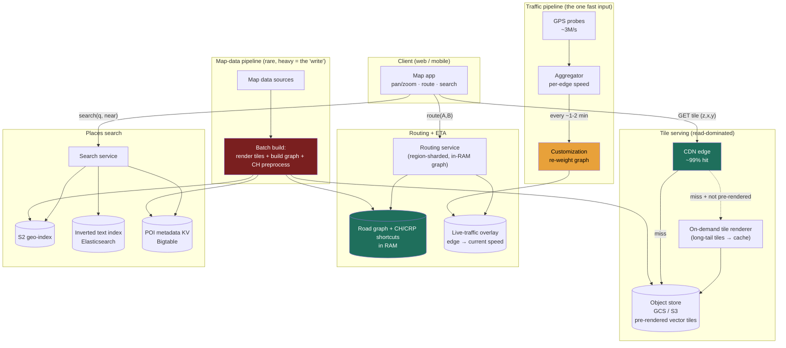

### Learning objectives
- Run the full **RESHADED** spine on a **read-dominated** serving + routing system, and recognize why this is the *inverse* of the Uber proximity problem (5.7): there the firehose was driver pings (write-heavy); here map data changes rarely and is read billions of times (read-heavy, massively cacheable).
- Make the **precompute-vs-query-time-compute** trade the through-line: it appears **twice** - **pre-rendered tiles** (cheap reads, storage cost) vs **render-on-demand** (cheap storage, compute cost); and **contraction-hierarchies shortcuts** (precomputed, sub-millisecond queries) vs **raw Dijkstra at query time** (no precompute, seconds per query). Same trade, two subsystems.
- **Estimate** the headline numbers - tile-fetch read QPS, the petabyte tile footprint that forces vector tiles, and the **CDN offload** that shrinks origin render QPS by ~50-100x - and show the subtraction.
- Explain precisely why **plain contraction hierarchies break under live traffic** (CH assumes static edge weights; traffic makes weights dynamic) and how the **three-phase customization split (CRP / customizable CH)** restores both fast queries *and* live traffic.
- Operate at **Director altitude**: tie each call to a requirement, quantify the cost, own the routing depth that 5.7 *delegated* to "the Maps team," and name where *this* problem delegates next (the exact router bake-off, the traffic-fusion ML).

### Intuition first
Two completely different machines wear one app. The first is a **printing press for pictures of the world.** The Earth is photographed and drawn once, sliced into millions of small square pictures (tiles) at every zoom level, and printed ahead of time. When you pan and zoom, you are not "rendering a map" - you are **fetching pre-printed squares** off the nearest shelf (a CDN edge), exactly as you fetch images from any website. The world barely changes day to day, so the same square is handed out to millions of people; the press runs rarely, the shelf does almost all the work. The second machine is a **road atlas with a shortest-path engine.** Every road is an edge in a giant graph, every intersection a node, and "navigate me there" is a shortest-path search. The naive way - explore the graph outward from your start until you hit the destination (Dijkstra) - is far too slow on a continent-sized graph to do live, so the trick is to **precompute a skeleton of expressway shortcuts** so a query only walks a handful of them instead of millions of streets. The twist that makes it *Google Maps* and not a textbook: the road weights aren't fixed - **a freeway at 6 p.m. is slower than at 6 a.m.** - so the precomputed shortcuts, built for static distances, are wrong the moment traffic moves. The whole interesting tension is the same in both machines: **how much do you compute ahead of time (and store/refresh) versus how much do you compute when the user asks?**

That single trade - **precompute now and store, or compute later on demand** - is the spine of this entire problem, and an interviewer is watching whether you make it twice (tiles *and* routing) and can name the cost on each side.

---

## R - Requirements

The first RESHADED move is to **scope hard**, because "build Google Maps" hides a dozen products (Street View, satellite imagery, indoor maps, transit, the Earth 3D globe, business listings/reviews, real-time location sharing). At Director altitude the signal is cutting to a defensible core, saying *why*, and stating the read:write skew and scale up front.

**Clarifying questions I'd ask the interviewer (and the assumptions I'll proceed on):**
- *What are the core jobs?* → **(1) Show the map** (pan/zoom on a 2D map), **(2) route A→B with an ETA** that reflects current traffic, **(3) search for a place** ("coffee near me", an address). I scope to these three and say the rest is out.
- *How fresh must the map *data* be?* → **Hours to days.** Roads, building footprints, and POIs change slowly; a nightly/periodic batch refresh is fine. This is the load-bearing fact: **the underlying data is near-static**, which is what makes tiles and route shortcuts cacheable/precomputable at all.
- *How fresh must *traffic* be?* → **~1-2 minutes.** ETA must reflect a jam that formed minutes ago. This is the *one* fast-moving input, and it's what stresses the routing precompute.
- *Latency budget?* → tile fetch **p99 < ~50 ms** (it's an image off a CDN edge - a human is panning), route compute **p99 < ~300 ms** (a spinner is acceptable but short), search **p99 < ~200 ms** (typeahead-ish).
- *Global?* → **Yes**, but a route is almost always **within one contiguous region/continent** - a query in India never needs the graph of South America. That gives a natural geographic shard for the routing graph (the same locality gift 5.7 exploited for matching).

**CUT from scope (stated out loud, with the reason):** Street View and satellite/aerial imagery (a separate blob+CDN imagery pipeline, same *serving* shape as tiles but a different capture problem), turn-by-turn voice nav and re-routing UX (a client + session concern), transit/bike/walk modes (additional graphs - mention as a multi-graph extension), business reviews/photos and the Places *write* side (a UGC + moderation system), and indoor/3D. Designing all of Maps in 45 minutes is the "too high, hand-wavy" failure; I scope to **tiles → CDN → client**, **road graph → routing+ETA**, and **places search**, and say so.

**Functional requirements (the core):**
1. **Serve map tiles** for any (latitude, longitude, zoom) the user pans/zooms to.
2. **Compute a route** A→B and an **ETA** that reflects current traffic.
3. **Search places** by text/category near a location, returning ranked POIs.

**Non-functional requirements (these drive every later decision):**
- **Read availability ≥ 99.99%** - the map must always draw; a routing brown-out degrades to last-known traffic, never a blank.
- **Low read latency** - tiles p99 < ~50 ms (CDN edge), route p99 < ~300 ms, search p99 < ~200 ms.
- **Massive read scale, modest write rate** - billions of tile/route/search reads/day; map-data writes are a *batch* job (rare, large), not a live stream.
- **Traffic freshness ~1-2 min** on the single dynamic input (live speeds), without re-running the expensive graph precompute every cycle.
- **Cost-efficiency** - at this read volume, **egress bandwidth and CDN/storage are the dominant line items**; the design must be cheap per read.

**Read:write skew - the crux, stated up front (and inverted from 5.7).** Uber was **write-dominated** (every driver pinging every 4 s). Google Maps is the **opposite: read-dominated and highly cacheable.** The map data (tiles, road graph) is written **rarely** (batch refresh) and read **billions of times**; the same tile and the same popular route are requested by millions, so caching does enormous work. The *only* fast input is live traffic, and even that is read far more than it's written. **So the architecture is "precompute + cache the near-static heavy artifacts, and treat traffic as a frequently-refreshed overlay" - not a write-ingest problem.** Getting this inversion right (vs reflexively reusing the 5.7 firehose framing) is the first thing this problem tests.

> **Continuity callback:** in 5.7 I *delegated* ETA/routing to "the Maps team behind an `etaSeconds(from,to)` interface, my prior being a contraction-hierarchies router." **This is that team's problem.** Now I have to own contraction hierarchies, and - the part 5.7 hand-waved - make them work under *live* traffic.

---

## E - Estimation

*Enough math to make a defensible call - round hard, state assumptions, expose where the cost actually is.*

**Assumptions:** ~**1B** daily active users (label it - public figures are ~1-2B MAU; I'll use 1B DAU as a round anchor). On a typical day a user opens the map a few times; say **~2B map sessions/day**. Each session pans/zooms and pulls **~20 tiles**. Routing is rarer than viewing - say **~10% of sessions** ask for a route → **~200M routes/day**. Search similar order - **~200M searches/day**.

**Tile-fetch read QPS (the headline read number):**
```
2B sessions/day × 20 tiles = 40B tile requests/day
40B ÷ 86,400 s ≈ 460K tiles/s average  → round to ~0.5M tile reads/s
peak (×3 diurnal/commute)               → ~1.5M tile reads/s
```

**The CDN offload - the subtraction that defines the cost (precompute/cache in action):**
- Tiles are **immutable and identical for everyone** at a given `(z,x,y,style,version)`. A small set of popular areas (cities, highways, low zooms) covers the overwhelming majority of fetches → a CDN edge hit rate of **~95-99%**.
- At 99% hit, the **origin** sees only `0.5M × 1% ≈ 5K tile reads/s` (avg), `~15K/s` peak - a **~100x reduction**. The CDN fleet absorbs ~0.5-1.5M/s of *cached* reads; the origin (object store + any on-demand render) sees thousands, not millions.
- **This is the whole serving design in one line:** push near-static tiles to the edge, and origin compute/storage is a rounding error against edge traffic.

**Tile storage - why you can't pre-render everything (the math that forces vector tiles):**
- Slippy-map scheme: at zoom level `z` the world is `2^z × 2^z = 4^z` tiles of 256×256 px.
  - `z=15: 4^15 ≈ 1.07B` tiles; `z=20: 4^20 ≈ 1.1 trillion` tiles.
  - All levels `0..20`: `Σ 4^z = (4^21 - 1)/3 ≈ 1.5 trillion` tiles.
- At **~10 KB/raster tile**: `1.5T × 10 KB ≈ 15 PB` - **per style, per version.** Multiply by ~10 map styles (default, satellite-label, dark, transit…) and you're at **hundreds of PB** of mostly-ocean, mostly-empty squares re-rendered on every map update.
- **Two consequences, both decisive:** (1) **don't pre-render all tiles** - most are empty ocean/desert; pre-render the populated, low-zoom, high-traffic set and render the long tail on demand (then cache it). (2) **Ship vector tiles, not raster** - a vector tile carries *geometry + feature tags* (~1-5 KB, often smaller and reusable across styles) and is rendered **on the client's GPU**, so one vector tile serves every style and the server stores/serves far less. Raster is simpler but multiplies storage by style and bloats egress.

**Road-graph size (the routing working set):**
- The global road network is on the order of **~10^8 nodes (intersections) and a few × 10^8 edges (road segments)**. At ~tens of bytes/node + edge attributes (length, speed class, turn restrictions), the graph + its precomputed **CH shortcuts** is on the order of **tens of GB** - it **fits in RAM** on a routing server (sharded by region). Routing is a **RAM + CPU** problem, not a storage-capacity one (same shape as the 5.7 in-memory index, different data).

**Routing QPS:** `200M routes/day ÷ 86,400 ≈ 2.3K/s` avg, `~7K/s` peak. Small - *because* CH makes each query sub-millisecond, a modest fleet handles it. (Naive Dijkstra at seconds/query would need orders of magnitude more machines - the precompute *is* the capacity plan.)

**Live-traffic ingest:** GPS speed probes from phones/drivers - say `100M active reporters × 1 probe / 30 s ≈ 3M probes/s`. These are **aggregated** into per-edge speed estimates (not stored per-probe forever), then folded into routing as a **periodic weight refresh** (the customization step). Order-of-magnitude similar to the 5.7 ping firehose, but here it feeds an *aggregate overlay*, not a per-entity index.

**Bandwidth (the real bill):** `0.5M tiles/s × ~5 KB (vector) ≈ 2.5 GB/s ≈ 20 Gbps` of payload at average, multiples at peak - **almost all served from CDN edges.** Egress, not compute, is the dominant cost; vector tiles + aggressive edge caching are the cost levers.

**The one-line takeaway from E:** **~0.5M tile reads/s that are ~99% CDN-absorbed, a tile corpus too large (~15 PB/style) to fully pre-render so you go vector + render-the-tail, and a tens-of-GB in-RAM road graph whose CH precompute turns seconds-per-route into sub-ms.** Read-dominated, cache-dominated, precompute-dominated.

---

## S - Storage

Three data classes with different shapes - matching each to a store is the S step. The **precompute-vs-query** trade shows up in the *first two*.

**1. Map tiles (immutable, versioned, read-billions, cacheable).**
- *Access pattern:* fetch by `(z, x, y, style, version)`; written only by a batch render job; read enormously; never updated in place (a new map version writes *new* tiles).
- *Choice:* an **object store** - **Google Cloud Storage / S3** - holding the pre-rendered set, fronted by a **CDN** (Cloud CDN / Cloudflare / Akamai) that does ~99% of reads at the edge. Tiles are **content-addressed by version** so a refresh writes new objects and **flips a pointer/version**, never mutating a cached URL (clean cache invalidation by changing the version in the key).
- *Rejected:* serving tiles **out of a database** (Postgres/Cassandra) - a tile is a static blob keyed by a tuple; a DB adds query overhead, connection limits, and replication cost for data that wants to be a dumb, cacheable file behind a CDN. Blobs belong in a blob store + CDN (the 3.x blob-store lesson), full stop. *Also rejected:* **pre-rendering 100% of tiles** to disk - the ~15 PB/style math kills it; pre-render the hot set, render the long tail on demand and cache it (the precompute/query split, made concrete).

**2. The road network graph + routing artifacts (near-static, in-RAM, region-sharded).**
- *Access pattern:* shortest-path traversal over an in-memory graph; rebuilt by a batch job when map data changes; *re-weighted* every ~1-2 min by the traffic overlay.
- *Choice:* the graph and its precomputed **contraction-hierarchy shortcuts** live **in RAM on routing servers, sharded by geographic region**, loaded from a durable copy in object/columnar storage. The **traffic overlay** (per-edge current speeds) is a separate, frequently-updated in-memory structure (think a per-region map `edgeId → speed`, refreshed from the aggregation pipeline) applied as the *metric* at query time.
- *Rejected:* doing shortest-path **against a disk database with a per-edge lookup at query time** - exploring a route can touch thousands-to-millions of edges; a disk round-trip per edge is fatal to the < 300 ms budget. The graph must be in memory. *Also rejected:* a generic **graph database (Neo4j)** as the live router - they're built for flexible traversal queries, not for the specialized, precompute-heavy CH/CRP shortest-path that this needs; you build (or use) a purpose-built routing engine (OSRM/GraphHopper-class) over the in-RAM graph.

**3. Places / POIs (read-mostly, text + geo search).**
- *Access pattern:* "find POIs of category X near (lat,lng)" and "search this text/address", ranked by distance + relevance + popularity.
- *Choice:* a **geospatial index** (S2 cell ids - reused from 5.7) to answer "near me", **plus an inverted text index** (Elasticsearch / a Lucene-based search service) for the name/category/address text, with **POI metadata in a KV / document store** (Bigtable/DynamoDB). The search service joins "near" (geo) ∩ "matches text" (inverted index) and ranks.
- *Rejected:* a single relational `WHERE name LIKE '%...%' AND ST_Distance(...)` scan - it can't serve typeahead-latency text search at this scale; full-text needs an inverted index and "near me" needs a spatial index, not a `LIKE` + a distance function over a table.

**The routing *algorithm* itself (CH vs CRP vs raw Dijkstra) is decided in Evaluation**, where live traffic forces the choice.

---

## H - High-level design



**Happy paths, in prose (three near-independent read paths over one shared batch pipeline):**

1. **View a map (tiles).** The app computes which `(z,x,y)` tiles cover the viewport and issues a `GET` per tile to the **CDN**. ~99% are edge hits (a few KB of vector geometry each), drawn on the client GPU. On a miss the CDN pulls from the **object store**; if that tile wasn't pre-rendered (long tail), an **on-demand renderer** generates it, returns it, and writes it back so the next request is a cache hit. The origin sees thousands of reads/s, not millions.

2. **Get a route + ETA.** The app calls `route(A, B)` on the **routing service** owning that region. The service runs a **contraction-hierarchies query** over the **in-RAM graph**, using the **live-traffic overlay** as the current edge weights, and returns the path + summed travel time (the ETA). Sub-millisecond graph work; the budget is mostly network + serialization.

3. **Search a place.** `search(q, near)` hits the **search service**, which intersects the **S2 geo-index** ("near me") with the **inverted text index** (name/category match), pulls **POI metadata**, ranks by distance/relevance/popularity, and returns the top N.

**The two background machines that feed all three:**
- **Map-data pipeline (the "write" path, rare + heavy):** a batch job ingests fresh map data and **(a)** re-renders changed tiles into the object store (new version), **(b)** rebuilds the road graph and **re-runs the expensive CH/topology preprocessing**, **(c)** rebuilds the geo + text indexes. This runs on a slow cadence (e.g., per region, periodically), *not* per request.
- **Traffic pipeline (frequent, light):** GPS probes are **aggregated** into per-edge current speeds and folded into the graph as a fast **customization** (re-weight) every ~1-2 min - *without* redoing the topology preprocessing. This split is the heart of the Evaluation section.

The asymmetry to call out: tile and route paths are **independent** (different stores, different scaling) and both are **reads against precomputed artifacts**; the only thing that changes often is the **traffic overlay**, deliberately isolated so it can refresh fast.

---

## A - API design

Kept small - the three functional requirements map to three read calls, plus the internal batch/refresh boundary.

```
# 1) Tiles - served from the CDN; immutable, versioned, cache-forever
GET /v{ver}/tiles/{style}/{z}/{x}/{y}.{fmt}     # fmt: pbf (vector) | png (raster)
  → 200  <tile bytes>
  Cache-Control: public, max-age=31536000, immutable   # version in path → safe to cache forever
  # version flip on map refresh changes the URL, so no explicit invalidation needed

# 2) Route + ETA
POST /v1/route
  body: {
    origin:      { lat, lng },
    destination: { lat, lng },
    mode:        "drive",            # drive | walk | transit (multi-graph; drive is core)
    depart_at:   "now",              # now → use live traffic; future → predicted traffic
    alternatives: true
  }
  → 200 {
      routes: [
        { polyline, distance_m, eta_seconds, traffic: "live", legs:[...] }
      ]
    }
  → 422 if no route exists (e.g., disconnected regions / over water)

# 3) Places search
GET /v1/places/search?q=coffee&lat=&lng=&radius_m=2000&limit=20
  → 200 { places: [ { placeId, name, lat, lng, category, rating, distance_m } ] }

# --- internal / control plane (not client-facing) ---
POST /internal/traffic/probes          # batched GPS probes → aggregator (the fast overlay)
POST /internal/maps/publish            # batch pipeline flips to a new tile+graph version
```

**Design notes (each a choice with a rejected alternative):**
- **Tiles are `GET` with `immutable` + a year-long `max-age` and a *version in the path*.** We **reject** short TTLs or cache-busting query params: tiles never change for a given version, so the correct primitive is "cache forever, change the URL on a new version." That's what makes the ~99% edge hit rate possible - the cost of the whole serving tier hinges on this header.
- **`route` is `POST`, returns the polyline + `eta_seconds` computed server-side with live traffic** - we **reject** returning raw graph edges for the client to sum, because ETA depends on the live overlay and the routing logic, which must be server-authoritative (and the client shouldn't hold the graph).
- **`depart_at` lets a future time use *predicted* traffic** (historical speed profiles by time-of-day) rather than current - we surface it because "leave at 8 a.m. tomorrow" is a real query and it's a different metric than `now`. We **reject** pretending all routing uses live traffic - prediction is a distinct, equally important metric.
- **No write API for tiles or graph in the data plane** - the only "write" is the **batch publish**, deliberately off the request path. We **reject** any per-request mutation of map data; freshness comes from versioned batch publishes + the traffic overlay, not live edits.

---

## D - Data model

**1. Tiles (object store + CDN):**

| Field | Type | Notes |
|---|---|---|
| key | string | `tiles/{version}/{style}/{z}/{x}/{y}.pbf` - the **content+version address** |
| bytes | blob | vector geometry + feature tags (~1-5 KB) or raster PNG |
| version | string | map-data version; **changing it is the cache invalidation** |

- **Partition / shard key = the tile key itself** (`z/x/y` + style + version); the object store and CDN both shard on this opaque key, which **spreads load by geography and zoom naturally** (a hot city tile is one key, replicated at edges). There's no relational structure - a tile is a pure blob addressed by a tuple. We **reject** any secondary indexing on tiles; the only access is by exact key.

**2. Road graph (in-RAM, region-sharded):**

| Structure | Shape | Notes |
|---|---|---|
| `nodes` | `nodeId → (lat, lng)` | intersections |
| `edges` | `edgeId → (fromNode, toNode, length, road_class, turn_restrictions)` | directed road segments |
| `ch_shortcuts` | precomputed shortcut edges + node contraction order | the **CH preprocessing artifact** (precompute) |
| `traffic_overlay` | `edgeId → current_speed` | the **fast-refreshed metric** (customization) |

- **Partition / shard key = geographic region** (e.g., a coarse S2 cell / metro / country). This is the load-bearing decision and mirrors 5.7: because **a route is almost always within one region**, region-sharding means a query hits **one shard's in-RAM graph**, and a region's load + blast radius is isolated. **Cross-region/long-haul routes** (rare) stitch via **boundary nodes** between adjacent region graphs (a higher-level "overlay graph" of inter-region connectors). We **reject** a single global graph on one machine (won't fit / single point) and **reject** sharding by `edgeId` hash (scatters a local route across every shard - a scatter-gather per query, the exact anti-pattern from 5.7's "shard by region, not driverId").
- **Where data lives:** the durable graph + CH artifacts sit in object/columnar storage (rebuilt by the batch job); the *live* copy is in RAM on each region's routing fleet; the traffic overlay is in RAM and refreshed independently.

**3. Places (geo + text + KV):**

| Table / index | Key | Shard key | Store |
|---|---|---|---|
| `poi_meta` | `placeId` | `placeId` hash | Bigtable / DynamoDB |
| `geo_index` | S2 cell → placeIds | S2 cell / region | spatial index |
| `text_index` | inverted (name/category/addr) | term-sharded | Elasticsearch |

- **Indexes that matter:** the **spatial** (S2) index for "near", the **inverted** index for text - the same dual-index pattern as the Typeahead/search lessons. POI metadata is keyed by `placeId`. We **reject** doing text search via a DB `LIKE` (no typeahead latency) and "near me" via a full-table distance scan (no spatial pruning).

---

## E - Evaluation

Re-check against the NFRs and break the design on purpose. The headline bottleneck is the **routing precompute under live traffic** - that's the part 5.7 delegated, and it's where strong separates from weak. Five bottlenecks, each fixed with a *named* trade-off.

**Bottleneck 1 - the routing precompute (the central problem): contraction hierarchies break under live traffic.**
This is the crux. **Raw Dijkstra** explores the graph outward from the origin; on a continental graph (~10^8 nodes) a single query touches millions of nodes and takes **~seconds** - far over the 300 ms budget and far too costly to run 7K times/s. **Contraction Hierarchies (CH)** fix this by *precomputing*: contract nodes in order of importance, adding **shortcut edges** that skip over less-important nodes, so a query bidirectionally walks only a **skeleton of shortcuts** - turning seconds into **sub-milliseconds**. *That's the precompute-vs-query trade in its purest form: pay hours of preprocessing once, get ~constant-time queries forever.*

**The trap:** classic **CH assumes *static* edge weights** - it bakes the "importance" ordering and shortcuts around fixed travel times. **Live traffic makes weights dynamic** (a freeway's cost changes every minute), and the moment weights change, the precomputed shortcuts are built for the *wrong* metric. Re-running full CH preprocessing every 1-2 minutes for live traffic is **impossible** - the preprocessing is the expensive part.

*Fix - split the precompute into two phases (Customizable Route Planning / Customizable Contraction Hierarchies):*
1. **Metric-independent preprocessing (topology only):** partition the graph and compute the contraction/shortcut *structure* from the **road network shape alone**, with **no travel times** baked in. Expensive (minutes-to-hours), but only redone when **roads** change (the batch map refresh) - rarely.
2. **Customization (apply a metric):** take the *current* edge weights (live traffic, or a predicted profile, or "shortest distance") and **stamp them onto the precomputed structure** - cheap, **~seconds**, run **every ~1-2 minutes** as traffic moves (and per-metric: live vs predicted vs walking).
3. **Query:** sub-millisecond over the customized structure.

*The trade:* CRP/CCH queries are typically **a bit slower than plain CH** and the machinery is more complex - but you **buy the ability to refresh the metric (traffic) in seconds without redoing topology**, which is exactly the requirement. This three-phase split **is** the precompute/query trade made concrete: *topology precompute is rare and expensive; metric customization is frequent and cheap; queries are instant.* We **reject** plain CH (can't do live traffic) and **reject** raw Dijkstra (too slow at query time) - the customization split is the only point on the curve that satisfies *both* fast queries *and* live traffic.

> **Director move - delegate the exact algorithm with a stated prior.** The precise production router at Google isn't public, and CH vs CRP vs CCH is a measured engineering call. *"I'd have the routing team bake off CH vs CRP/CCH on our real graph and traffic-refresh cadence; my prior is a **customization-split (CRP-style)** approach precisely because live traffic demands a cheap re-weight, and plain CH can't give that - but I want that decision benchmarked on query p99 and customization time, not asserted."* Naming the tension (CH can't do traffic) and the resolution (customization split) - while delegating the bake-off - is the altitude signal here.

**Bottleneck 2 - tile storage and the pre-render-everything trap.**
Pre-rendering all `~1.5T` tiles per style at ~10 KB = **~15 PB/style** - re-rendered on every map update, mostly empty ocean. A storage and render-cost disaster.
*Fix - hybrid precompute/on-demand + vector tiles:* **pre-render** only the **populated, low-zoom, high-traffic** set (a small fraction of all tiles covers ~the entire CDN hit rate); **render the long tail on demand** and cache it (so a rarely-viewed rural tile is computed once, then served from cache). And ship **vector tiles** - one vector tile renders to *any* style on the client, cutting storage by ~the number of styles and shrinking egress. *Trade:* on-demand rendering adds **first-hit latency** for cold tiles (a render before the cache fills) and a render fleet to operate; vector tiles push **rendering cost to the client GPU** (fine on modern devices, a consideration on very old ones). We **reject** all-pre-rendered (cost) and **reject** all-on-demand (every pan would render - latency + compute blowup); the hybrid is the point on the precompute/query curve.

**Bottleneck 3 - CDN cache effectiveness and the map-version flip.**
The entire serving cost depends on the ~99% edge hit rate; a botched cache invalidation (e.g., purging the whole CDN on every map refresh) would collapse it to ~0% and hammer the origin.
*Fix:* **version in the tile key** (`/v{N}/...`). A map refresh writes a **new version's** tiles and flips clients to `v{N+1}`; old `v{N}` tiles age out of the edge naturally. New tiles warm the cache gradually as users request them - **no mass purge**. *Trade:* during a version transition the edge holds **two versions** briefly (extra storage) and the first requests to `v{N+1}` are misses (a short origin bump). We **reject** TTL-based invalidation (either too short → low hit rate, or too long → stale maps) in favor of immutable-versioned URLs.

**Bottleneck 4 - hot regions / hot routes (skew across machines).**
A routing shard owning a dense metro (or a viral event) handles vastly more queries than a rural shard - a hot shard; likewise a few popular routes (a city's main commute) repeat constantly.
*Fix:* **replicate** hot-region graph shards for read scaling (the graph is read-only between refreshes, so replicas are trivial and cheap), and **cache popular route results** keyed by `(origin-cell, dest-cell, traffic-epoch)` so a repeated commute query is a cache hit until the next traffic refresh. *Trade:* the route cache is only valid for one traffic epoch (~1-2 min) - we accept a short TTL (a route can be ~minutes stale on traffic) to absorb repeated identical queries; cache more aggressively for *predicted* (future-time) routes, which don't change minute-to-minute. (Same hot-key lesson as 5.7 and 3.7, applied to regions and routes.)

**Bottleneck 5 - traffic-pipeline correctness/lag.**
Aggregating 3M probes/s into per-edge speeds can be noisy (a few stopped cars ≠ a jam) or lag, producing bad ETAs.
*Fix:* aggregate with **smoothing/outlier rejection** over a short window, fall back to **historical speed profiles** for edges with too few live probes (most minor roads), and treat the overlay as **best-effort** - if customization is late, routing uses the **last-good** overlay (degrade to slightly-stale traffic, never block). *Trade:* smoothing adds a little latency to detecting a fresh jam; the historical fallback can miss an unusual event on a low-probe road. We accept bounded traffic staleness to keep ETAs stable and routing always-available.

**Re-check vs NFRs:** read availability (CDN + read-only replicated graph + last-good overlay → no blank map ✓); latency (tiles from edge < 50 ms; CH/CRP query sub-ms → route well under 300 ms; dual-index search < 200 ms ✓); read scale + modest writes (batch publish off the path; ~99% CDN offload ✓); traffic freshness (customization every 1-2 min *without* topology re-preprocess ✓); cost (vector tiles + edge caching minimize egress, the dominant bill ✓).

---

## D - Design evolution

**At 10x (~10B sessions/day, ~5M tile reads/s, ~2B routes/day → ~70K route QPS, finer traffic):**
- **Egress dominates even harder.** Push **more aggressive vector-tile reuse** (one tile, all styles), **client-side caching** (a panned-away tile stays on the device), and **finer CDN tiering** (regional + metro edges). The origin stays tiny because the hit rate holds; the spend is the edge fleet and egress contracts. *Trade:* more client storage and CDN cost vs origin compute - the right side of the curve at this read volume.
- **Routing fleet scales with replicas, not shards.** Because the per-region graph is read-only between refreshes, scale read QPS by **adding replicas of hot-region shards** (cheap, stateless reads) rather than re-sharding. *Trade:* more memory copies of the graph (tens of GB × replicas) - acceptable; RAM is cheaper than recomputation.
- **Faster traffic + prediction.** Tighten the customization cadence (e.g., 1 min) and lean harder on **predicted traffic** (per-edge time-of-day/day-of-week speed models, and ML on live conditions) so ETAs are right for *future* departures and resilient to probe gaps. *Trade:* prediction is an ML system with its own training/serving cost and accuracy SLAs - a place to **delegate** (below).

**Hardest trade-offs to defend:**
- **Precompute vs query, on *both* axes simultaneously.** Tiles: pre-render (storage) vs on-demand (latency+compute) - resolved by the **hybrid** (pre-render the hot set, render+cache the tail). Routing: precompute shortcuts (CH, fast queries) vs compute-at-query (Dijkstra, no precompute) - resolved by the **customization split** so live traffic doesn't force a re-preprocess. The honest framing is that *neither extreme works*; the art is choosing the split point and naming what each side costs.
- **Traffic freshness vs cost/stability.** Every shortening of the customization interval multiplies pipeline + customization cost and can amplify noise; the 1-2 min choice trades ETA freshness against cost and stability. Predicted traffic is how you escape needing *everything* to be live.
- **Tile granularity / vector vs raster.** Vector minimizes storage/egress and enables styling but pushes render cost to the client and complicates very old devices; raster is dumb-simple but multiplies storage per style. Net: **vector for the modern client, raster fallback** where needed.

**What I'd revisit:** whether to render the long tail on-demand at all vs widening the pre-rendered set (a cost/latency benchmark on real access distributions); whether the route cache's traffic-epoch TTL is too coarse for arterial roads; and the region-shard boundaries (too coarse → hot shards, too fine → more cross-boundary stitching).

**Where I'd delegate the deep-dive (the Director move):**
- **The exact routing algorithm bake-off (CH vs CRP vs CCH)** - *"the routing team benchmarks query p99, customization time, and memory on our real graph and traffic cadence; my prior is a customization-split because live traffic demands a cheap re-weight, but it's a measured call."*
- **Traffic fusion + ETA prediction ML** - *"a dedicated team owns probe aggregation, outlier rejection, historical profiles, and the live-conditions model behind a clean `edgeSpeed(edge, time)` / `eta(route, depart_at)` interface; I'd specify the SLA (freshness, accuracy, fallback to historical) and let them own the model."* This is its own discipline; hand-rolling the ML on a whiteboard is the wrong altitude.
- **Tile rendering/cartography pipeline** - the styling, generalization (which features show at which zoom), and label placement are a cartography specialty I'd scope to the maps-rendering team behind "produce vector tiles for version N."
- **Imagery (satellite/Street View)** - an entire adjacent capture+serving system reusing the same blob+CDN serving shape; scoped out and delegated.

---

## Trade-offs table - the pivotal decisions

| Decision | Option A | Option B | Option C | Use when… |
|---|---|---|---|---|
| **Routing: precompute vs query** | **Raw Dijkstra at query** - no precompute, exact | **Plain Contraction Hierarchies** - precompute shortcuts, sub-ms query | **CRP / Customizable CH** - split: topology precompute (rare) + metric customization (frequent) | Dijkstra: tiny/dynamic graphs, no precompute budget. Plain CH: **static** weights (distance-only, no live traffic). **CRP/CCH: live-traffic routing at scale - the right call here, because CH alone can't re-weight cheaply.** |
| **Tiles: precompute vs query** | **Pre-render 100%** - all tiles stored, instant reads | **Render 100% on demand** - tiny storage, render every request | **Hybrid: pre-render hot set + on-demand-cache the tail** | Pre-render-all: small/static map (cost-prohibitive globally - ~15 PB/style). On-demand-all: low traffic, can't afford storage. **Hybrid: planet-scale - the right call.** Plus **vector** tiles to serve all styles from one tile. |
| **Tile store** | **Object store + CDN** (GCS/S3 + Cloud CDN) - dumb cacheable blobs | **Database-served tiles** (Postgres/Cassandra) | — | Object store + CDN: tiles are immutable blobs keyed by a tuple → ~99% edge hit, cheap egress (the right call). DB-served: never - adds query/replication cost to static blobs. |

---

## What interviewers probe here (Director altitude)

- **"What's the read:write ratio, and how is it different from Uber?"** - *Strong signal:* names it **read-dominated and highly cacheable** (map data is near-static, batch-written, read billions of times; ~99% CDN-served), the **inverse** of 5.7's write firehose - and designs precompute + caching as the spine, traffic as the lone fast overlay. *Red flag:* reuses the "ingest firehose" framing, over-builds a write path, or misses that the same tile/route is served to millions.
- **"Walk me through routing. Why not just run Dijkstra, and what breaks contraction hierarchies?"** - *Strong:* Dijkstra is **seconds** on a continental graph (too slow ×7K/s); CH precomputes shortcuts for **sub-ms** queries; **but CH assumes static weights and live traffic is dynamic**, so you split into **topology preprocessing (rare) + metric customization (every ~1-2 min) + query (instant)** - CRP/CCH. *Red flag:* "use contraction hierarchies" and stops (misses that CH alone can't do live traffic), or hand-rolls Dijkstra with no precompute awareness.
- **"Why can't you pre-render every tile, and what do you do instead?"** - *Strong:* the `4^z` math → **~15 PB/style** of mostly-empty tiles; instead **pre-render the hot set, render+cache the long tail, ship vector tiles** (one tile, all styles, client-rendered). *Red flag:* "store all the tiles" with no sense of the petabyte scale or the vector/raster trade.
- **"Where's the cost, and what are the levers?"** - *Strong:* **CDN egress + storage** dominate (compute is a rounding error behind a ~99% hit rate); levers are **vector tiles, immutable-versioned URLs for a high hit rate, client caching, and predicted-traffic caching** for routes. *Red flag:* sizes a giant compute/render fleet and ignores that the edge absorbs ~99% of reads.
- **"Where would you delegate, and how?"** - *Strong:* hands the **exact router bake-off** (CH vs CRP/CCH) and the **traffic-fusion/ETA-prediction ML** to specialist teams behind clean interfaces with stated priors and SLAs, while personally owning the *precompute-vs-query* decision and the customization-split insight. *Red flag:* tries to whiteboard the ML traffic model or asserts a specific production algorithm as fact ("Google uses X").

---

## Common mistakes

- **Treating it as write-heavy / reusing the Uber framing.** Maps is read-dominated and cacheable; the heavy artifacts (tiles, graph) are batch-written and precomputed, not ingested live. Mis-sizing this mis-designs everything.
- **"Use contraction hierarchies" and stopping.** Plain CH bakes **static** weights; **live traffic breaks it.** You must name the **customization split (CRP/CCH)** that re-weights cheaply without redoing topology preprocessing. This single point is the difference between an IC answer and a Director one.
- **Running Dijkstra at query time.** Seconds per query on a continental graph; the *whole reason* to precompute shortcuts is to make queries sub-ms. The precompute **is** the capacity plan.
- **Pre-rendering every tile.** ~15 PB/style of mostly-empty squares. Pre-render the hot set, render+cache the tail, and ship **vector** tiles to collapse per-style storage.
- **Serving tiles from a database.** A tile is an immutable blob keyed by a tuple - it belongs in an **object store + CDN**, not a query database.
- **Mass-purging the CDN on every map update.** Collapses the ~99% hit rate. Put the **version in the tile key** and flip clients; old tiles age out, new ones warm gradually.
- **Sharding the road graph by edge-id instead of region.** Turns a local route into a fleet-wide scatter-gather. Routes are regional - **shard by region**, stitch long-haul via boundary nodes.
- **Treating live and predicted traffic as the same thing.** "Now" uses the live overlay; "leave at 8 a.m. tomorrow" uses a **historical/predicted** profile - different metrics, both needed.

---

## Interviewer follow-up questions (with model answers)

**Q1. Estimate the tile-fetch QPS and explain why the CDN, not the origin, defines the cost.**
> *Model:* ~1B DAU, ~2B map sessions/day, ~20 tiles each → **~40B tile requests/day ≈ 0.5M/s avg, ~1.5M/s peak.** Tiles are **immutable and identical for everyone** at a given `(z,x,y,style,version)`, and a small popular set (cities, highways, low zooms) covers most fetches → a CDN edge hit rate of **~95-99%.** At 99%, the **origin sees only ~5K tiles/s** (avg) - a **~100x reduction.** So the serving tier is a **CDN + object store**, and the cost is **egress + edge storage**, not origin compute. That subtraction - 0.5M/s at the edge, ~5K/s at the origin - *is* the serving design, and it's only possible because tiles are versioned-immutable and cache-forever.

**Q2. Why isn't Dijkstra enough, what do contraction hierarchies buy, and what do they cost you under live traffic?**
> *Model:* **Dijkstra** explores outward from the origin; on a continental graph (~10^8 nodes) one query touches millions of nodes → **~seconds**, far over a 300 ms budget and far too expensive at thousands of QPS. **Contraction Hierarchies** *precompute* a hierarchy of **shortcut edges** (contract unimportant nodes, skip over them), so a query walks only a skeleton → **sub-millisecond.** That's the precompute/query trade: hours of preprocessing once, ~constant-time queries. **The cost under live traffic:** classic CH **bakes in static edge weights**; when traffic changes weights every minute, the precomputed shortcuts are built for the wrong metric, and you **cannot re-run full preprocessing every 1-2 min.** The fix is the **customization split (CRP / customizable CH):** do **topology-only preprocessing** rarely (when roads change), then a cheap **customization** (~seconds) to stamp the *current* traffic weights onto that structure every 1-2 min, then sub-ms queries. That gives you fast queries **and** live traffic - which plain CH can't.

**Q3. How do you keep ETAs reflecting live traffic without re-running the expensive routing precompute every minute?**
> *Model:* Separate the **slow** part from the **fast** part. The **topology preprocessing** (graph partition + contraction structure) depends only on the **road network shape**, so it's redone only on a map refresh (rare). The **traffic** is folded in as a **metric customization**: a GPS-probe pipeline aggregates ~3M probes/s into per-edge current speeds, and every ~1-2 min a **customization step (~seconds)** re-weights the precomputed structure with those speeds. Queries then run sub-ms against the freshly-customized graph. For edges with too few live probes, fall back to **historical speed profiles**; if a customization is late, route on the **last-good** overlay (degrade to slightly-stale traffic, never block). So freshness comes from cheap customization, not from redoing the expensive preprocessing - that's the entire point of choosing a CRP/CCH-style split over plain CH.

**Q4. Why pre-render some tiles but not all, and why vector over raster?**
> *Model:* Pre-rendering **all** tiles is `Σ 4^z ≈ 1.5 trillion` tiles per style; at ~10 KB that's **~15 PB/style**, re-rendered every map update, and **most tiles are empty ocean/desert.** So: **pre-render the populated, low-zoom, high-traffic set** (a small fraction that covers ~the whole CDN hit rate) and **render the long tail on demand, then cache it** - a cold rural tile is computed once and served from cache thereafter. That's the precompute/query trade applied to tiles. **Vector over raster** because a vector tile carries geometry + feature tags (~1-5 KB) and renders to **any style on the client GPU** - so one stored tile serves the default, dark, transit, etc., collapsing per-style storage by ~10x and shrinking egress (the dominant cost). The trade: vector pushes render cost to the client (fine on modern devices) and on-demand adds first-hit latency for cold tiles - both acceptable against the storage/egress savings.

**Q5. How would you build places search, and what would you delegate in this whole system?**
> *Model:* **Search** is a **dual-index join:** an **S2 geo-index** to prune to POIs **near** the point (reused from 5.7's geo work), intersected with an **inverted text index** (Elasticsearch) for the **name/category/address** match, then rank by distance + relevance + popularity, with POI metadata in a **KV/document store** (Bigtable). A DB `LIKE` + distance scan can't hit typeahead latency at this scale. **What I'd delegate:** (1) the **exact routing algorithm** (CH vs CRP vs CCH) to the routing team for a benchmarked decision, my prior being a customization-split; (2) **traffic fusion + ETA-prediction ML** behind an `eta(route, depart_at)` interface with a freshness/accuracy SLA and a historical fallback; (3) the **cartography/tile-rendering** pipeline (feature generalization, label placement). I personally own the **precompute-vs-query decision on both axes** and the **CH-can't-do-traffic → customization-split** insight - that's the architectural call; the ML and the algorithm bake-off are specialist depth I scope and delegate, not hand-roll.

---

### Key takeaways
- Google Maps is **read-dominated and cacheable** - the *inverse* of Uber's write firehose (5.7). Map data (tiles, road graph) is **batch-written/precomputed** and read billions of times; the **only fast input is live traffic**. Design **precompute + cache**, not ingest.
- The **precompute-vs-query-time-compute** trade is the spine and appears **twice**: **tiles** (pre-render hot set vs render-on-demand → **hybrid + vector tiles**, because all-pre-render is ~15 PB/style of mostly-empty squares) and **routing** (CH shortcuts vs raw Dijkstra). Name the cost on each side.
- **Routing:** raw Dijkstra is **seconds** on a continental graph; **contraction hierarchies precompute shortcuts → sub-ms** queries. But **plain CH assumes static weights and live traffic breaks it** - the fix is the **customization split (CRP / customizable CH):** rare **topology preprocessing** + cheap **metric customization** (~seconds, every 1-2 min) + instant queries. This single insight is the IC-vs-Director line.
- **Serving:** tiles are immutable blobs → **object store + CDN** with **version-in-the-key, cache-forever** URLs → **~99% edge hit**, so the **origin sees ~100x less** traffic. **Egress + storage dominate the bill**; vector tiles + edge/client caching are the levers. **Shard the road graph by region** (routes are local), never by edge-id.
- **Director moves:** own the **precompute-vs-query decision** and the **CH-can't-do-traffic** insight personally; **delegate** the exact router bake-off (CH vs CRP/CCH, with a stated customization-split prior) and the **traffic-fusion/ETA-prediction ML** behind clean interfaces with SLAs; quantify that the spend is **CDN egress**, not compute. Don't assert a specific production algorithm as fact.

> **Spaced-repetition recap:** Google Maps = two precompute machines. **Tiles:** pre-render the hot set + render-on-demand the long tail, ship **vector** (one tile, all styles, client-rendered), serve from **object store + CDN** with **versioned cache-forever** keys → **~99% edge hit**, origin sees ~100x less; egress is the bill. **Routing:** the road network is a graph; **raw Dijkstra is seconds**, **contraction hierarchies precompute shortcuts → sub-ms** - but **plain CH can't do live traffic** (static weights), so split into **topology preprocessing (rare) + traffic customization (every 1-2 min) + instant query** (CRP/CCH). **Read-dominated, cache-dominated, precompute-dominated**; shard the graph **by region**; **delegate** the algorithm bake-off and the ETA-prediction ML with stated priors. This is the team 5.7 delegated routing *to*.
