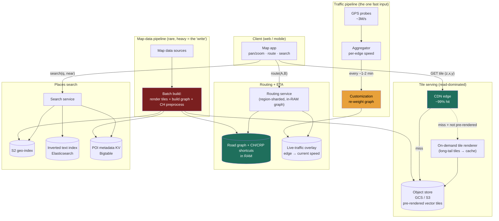

### Learning objectives
- Run the full **RESHADED** spine on a **read-dominated** serving + routing system - the *inverse* of Uber (5.7): there the firehose was driver pings; here map data changes rarely and is read billions of times (read-heavy, massively cacheable).
- Make the **precompute-vs-query-time-compute** trade the through-line: it appears **twice** - **pre-rendered tiles** vs render-on-demand, and **precomputed routing shortcuts** vs raw Dijkstra at query time. Same trade, two subsystems.
- **Estimate** the headline numbers - tile-fetch QPS, the petabyte tile footprint that forces vector tiles, and the **CDN offload** that shrinks origin traffic ~100x - and show the subtraction.
- Explain why **plain contraction hierarchies break under live traffic**, and how splitting topology preprocessing from metric customization restores both fast queries *and* fresh ETAs.
- Operate at **Director altitude**: tie each call to a requirement, quantify the cost, own the routing depth that 5.7 *delegated* to "the Maps team," and name what *this* problem delegates next.

### Intuition first
Two completely different machines wear one app. The first is a **printing press for pictures of the world**: the Earth is drawn once, sliced into millions of small square tiles at every zoom level, and printed ahead of time. When you pan and zoom you are **fetching pre-printed squares** off the nearest shelf (a CDN edge), exactly like fetching images from any website - the world barely changes, so the press runs rarely and the shelf does almost all the work. The second is a **road atlas with a shortest-path engine**: every road an edge, every intersection a node, "navigate me there" a shortest-path search. The naive search (Dijkstra) is far too slow on a continent-sized graph to run live, so you **precompute a skeleton of expressway shortcuts** a query only has to walk. The twist that makes it *Google Maps*: road weights aren't fixed - **a freeway at 6 p.m. is slower than at 6 a.m.** - so shortcuts built for static distances are wrong the moment traffic moves.

The whole interesting tension is the same in both machines: **how much do you compute ahead of time (and store/refresh) versus how much do you compute when the user asks?** An interviewer is watching whether you make that trade twice - tiles *and* routing - and can name the cost on each side.

---

## R - Requirements

"Build Google Maps" hides a dozen products; the first move is to **scope hard** and state the read:write skew up front.

**Clarifying questions I'd ask (and the assumptions I'll proceed on):**
- *Core jobs?* → **(1) Show the map** (pan/zoom), **(2) route A→B with a traffic-aware ETA**, **(3) search for a place.** I scope to these three.
- *How fresh must map *data* be?* → **Hours to days.** Roads and POIs change slowly; periodic batch refresh is fine. The load-bearing fact: **the underlying data is near-static**, which is what makes tiles and route shortcuts precomputable at all.
- *How fresh must *traffic* be?* → **~1-2 minutes.** The one fast-moving input - and what stresses the routing precompute.
- *Latency budget?* → tiles **p99 < ~50 ms** (an image off an edge), route **p99 < ~300 ms**, search **p99 < ~200 ms**.
- *Global?* → **Yes**, but a route is almost always **within one contiguous region** - a query in India never needs South America's graph. A natural geographic shard (the same locality gift 5.7 exploited).

**CUT from scope (stated, with the reason):** Street View / satellite imagery (a separate capture pipeline with the same blob+CDN serving shape), turn-by-turn voice nav and re-routing UX, transit/bike/walk modes (additional graphs - a multi-graph extension), business reviews and the Places *write* side (UGC + moderation), indoor/3D. I scope to **tiles → CDN → client**, **road graph → routing+ETA**, and **places search**, and say so.

**Functional requirements:** serve map tiles for any (lat, lng, zoom); compute a route A→B with a live-traffic ETA; search places near a location.

**Non-functional requirements:**
- **Read availability ≥ 99.99%** - the map must always draw; routing degrades to last-known traffic, never a blank.
- **Low read latency** - tiles < ~50 ms p99 (CDN edge), route < ~300 ms, search < ~200 ms.
- **Massive read scale, modest write rate** - billions of reads/day; map-data writes are a rare, large *batch* job.
- **Traffic freshness ~1-2 min** without re-running the expensive graph precompute every cycle.
- **Cost-efficiency** - at this read volume, **egress bandwidth and CDN/storage dominate the bill**.

**Read:write skew - the crux, inverted from 5.7.** Uber was **write-dominated**; Maps is the **opposite: read-dominated and highly cacheable.** Tiles and the road graph are written rarely (batch) and read billions of times; the same tile and the same popular route serve millions. The *only* fast input is live traffic, and even that is read far more than written. **The architecture is "precompute + cache the near-static heavy artifacts, treat traffic as a frequently-refreshed overlay"** - not a write-ingest problem. Getting this inversion right is the first thing this problem tests.

> **Continuity callback:** in 5.7 I delegated ETA/routing to "the Maps team behind `etaSeconds(from,to)`." **This is that team's problem.** Now I own routing - including the part 5.7 hand-waved: making precomputed shortcuts work under *live* traffic.

---

## E - Estimation

*Enough math to make a defensible call - round hard, state assumptions, expose where the cost actually is.*

**Assumptions:** ~**1B** DAU (round anchor; public figures ~1-2B MAU); ~**2B map sessions/day**, ~**20 tiles** pulled per session; routing in ~10% of sessions → **~200M routes/day**; search similar.

**Tile-fetch read QPS (the headline read number):**
```
2B sessions/day × 20 tiles = 40B tile requests/day
40B ÷ 86,400 s ≈ 460K tiles/s average  → round to ~0.5M tile reads/s
peak (×3 diurnal/commute)               → ~1.5M tile reads/s
```

**The CDN offload - the subtraction that defines the cost:**
- Tiles are **immutable and identical for everyone** at a given `(z,x,y,style,version)`; a small popular set (cities, highways, low zooms) covers the overwhelming majority of fetches → edge hit rate **~95-99%**.
- At 99%, the **origin** sees `0.5M × 1% ≈ 5K tile reads/s` (avg), ~15K/s peak - a **~100x reduction**. **This is the whole serving design in one line:** push near-static tiles to the edge; origin compute is a rounding error.

**Tile storage - the math that forces vector tiles:**
- At zoom `z` the world is `4^z` tiles of 256×256 px; summed over levels 0-20, `Σ 4^z ≈ 1.5 trillion` tiles.
- At ~10 KB/raster tile: **~15 PB - per style, per version.** Across ~10 styles, **hundreds of PB** of mostly-ocean squares re-rendered on every map update.
- **Two decisive consequences:** (1) **don't pre-render everything** - pre-render the populated, high-traffic set; render the long tail on demand and cache it. (2) **Ship vector tiles, not raster** - a vector tile carries geometry + feature tags (~1-5 KB), renders on the client GPU, and **one tile serves every style**, collapsing storage ~10x and shrinking egress.

**Road-graph size (the routing working set):** ~**10^8 nodes, a few × 10^8 edges**; with precomputed shortcuts, **tens of GB - it fits in RAM** on a routing server, sharded by region. Routing is a **RAM + CPU** problem, not storage (same shape as 5.7's in-memory index, different data).

**Routing QPS:** `200M/day ≈ 2.3K/s` avg, ~7K/s peak. Small - *because* precomputed shortcuts make each query sub-millisecond, a modest fleet suffices. Naive Dijkstra at seconds/query would need orders of magnitude more machines - **the precompute *is* the capacity plan.**

**Live-traffic ingest:** `100M reporters × 1 probe / 30 s ≈ 3M probes/s`, **aggregated** into per-edge speeds and folded into routing as a periodic weight refresh - an *aggregate overlay*, not a per-entity index (the contrast with 5.7's ping firehose).

**Bandwidth (the real bill):** `0.5M tiles/s × ~5 KB ≈ 20 Gbps` average payload, multiples at peak - **almost all from CDN edges.** Egress, not compute, dominates; vector tiles + edge caching are the levers.

**The one-line takeaway from E:** **~0.5M tile reads/s ~99% CDN-absorbed, a tile corpus too large (~15 PB/style) to fully pre-render so you go vector + render-the-tail, and a tens-of-GB in-RAM road graph whose precompute turns seconds-per-route into sub-ms.** Read-dominated, cache-dominated, precompute-dominated.

---

## S - Storage

Three data classes - the **precompute-vs-query** trade shows up in the first two.

**1. Map tiles (immutable, versioned, read-billions).**
- *Choice:* an **object store** (GCS / S3) fronted by a **CDN** doing ~99% of reads. Tiles are **addressed by version**: a refresh writes *new* objects and flips a pointer - cache invalidation by changing the key, never mutating a cached URL.
- *Rejected:* serving tiles from a database - a tile is a static blob keyed by a tuple; a DB adds query overhead and replication cost to data that wants to be a dumb cacheable file (3.11). *Also rejected:* pre-rendering 100% of tiles - the ~15 PB/style math kills it.

**2. The road graph + routing artifacts (near-static, in-RAM, region-sharded).**
- *Choice:* the graph and its precomputed **shortcut structure** live **in RAM on routing servers, sharded by region**, loaded from a durable copy in object storage. The **traffic overlay** (`edgeId → current speed`) is a separate, frequently-refreshed in-memory structure applied as the metric at query time.
- *Rejected:* shortest-path against a disk database - a route exploration touches thousands-to-millions of edges; a disk round-trip per edge is fatal to the 300 ms budget. *Also rejected:* a generic **graph database (Neo4j)** as the live router - built for flexible traversals, not the specialized precompute-heavy shortest-path this needs; use a purpose-built routing engine (OSRM/GraphHopper-class) over the in-RAM graph.

**3. Places / POIs (read-mostly, text + geo search).**
- *Choice:* an **S2 geo-index** (reused from 5.7) for "near me" **plus an inverted text index** (Elasticsearch) for name/category/address, with POI metadata in a KV store (Bigtable/DynamoDB). The search service intersects geo ∩ text and ranks.
- *Rejected:* a relational `LIKE` + `ST_Distance` scan - can't serve typeahead-latency search at this scale; full-text needs an inverted index, "near me" needs a spatial one.

**The routing *algorithm*** (precompute vs query-time, and what live traffic does to it) is decided in **Evaluation**.

---

## H - High-level design



**Three near-independent read paths over one shared batch pipeline:**

1. **View a map.** The app computes which `(z,x,y)` tiles cover the viewport and GETs each from the **CDN** - ~99% edge hits, drawn on the client GPU. A miss falls through to the object store; a not-pre-rendered long-tail tile is generated by the **on-demand renderer** and written back so the next request hits cache.
2. **Get a route + ETA.** `route(A, B)` hits the region's **routing service**, which runs a shortcut-based query over the **in-RAM graph** using the **live-traffic overlay** as the current edge weights - sub-millisecond graph work; the budget is mostly network.
3. **Search a place.** The search service intersects the **S2 geo-index** with the **inverted text index**, pulls POI metadata, ranks by distance/relevance/popularity.

**Two background machines feed all three:** the **map-data pipeline** (rare + heavy - re-renders changed tiles into a new version, rebuilds the graph and its expensive topology preprocessing, rebuilds the indexes) and the **traffic pipeline** (frequent + light - aggregates probes into per-edge speeds and re-weights the graph every ~1-2 min *without* redoing topology). That split is the heart of Evaluation. The asymmetry to call out: all three serve paths are **reads against precomputed artifacts**; the only thing that changes often is the traffic overlay, deliberately isolated so it can refresh fast.

---

## A - API design

Three read calls plus the internal batch/refresh boundary.

```
# 1) Tiles - served from the CDN; immutable, versioned, cache-forever
GET /v{ver}/tiles/{style}/{z}/{x}/{y}.{fmt}     # fmt: pbf (vector) | png (raster)
  → 200  <tile bytes>
  Cache-Control: public, max-age=31536000, immutable   # version in path → safe to cache forever

# 2) Route + ETA
POST /v1/route
  body: {
    origin:      { lat, lng },
    destination: { lat, lng },
    mode:        "drive",            # drive | walk | transit (multi-graph; drive is core)
    depart_at:   "now",              # now → live traffic; future → predicted traffic
    alternatives: true
  }
  → 200 { routes: [ { polyline, distance_m, eta_seconds, traffic: "live", legs:[...] } ] }
  → 422 if no route exists (e.g., disconnected regions)

# 3) Places search
GET /v1/places/search?q=coffee&lat=&lng=&radius_m=2000&limit=20
  → 200 { places: [ { placeId, name, lat, lng, category, rating, distance_m } ] }

# --- internal / control plane ---
POST /internal/traffic/probes          # batched GPS probes → aggregator (the fast overlay)
POST /internal/maps/publish            # batch pipeline flips to a new tile+graph version
```

**Design notes (each a choice with a rejected alternative):**
- **Tiles: `immutable` + year-long `max-age` + version in the path.** We **reject** short TTLs or cache-busting params: tiles never change for a given version, so the primitive is "cache forever, change the URL on a new version." The ~99% hit rate - and the cost of the whole serving tier - hinges on this header.
- **`route` returns the polyline + `eta_seconds` computed server-side** - we **reject** returning raw edges for the client to sum; ETA depends on the live overlay, which must be server-authoritative.
- **`depart_at` distinguishes live from *predicted* traffic** ("leave at 8 a.m. tomorrow" uses historical time-of-day profiles) - a different metric, both needed.
- **No write API for tiles or graph in the data plane** - the only "write" is the versioned batch publish, deliberately off the request path.

---

## D - Data model

**1. Tiles:** a pure blob addressed by `tiles/{version}/{style}/{z}/{x}/{y}.pbf` - **the key *is* the partition key**, spreading load by geography and zoom naturally, and **changing the version is the cache invalidation**. No relational structure, no secondary indexes - the only access is by exact key.

**2. Road graph (in-RAM, region-sharded):** `nodes` (intersections), `edges` (directed segments with length, road class, turn restrictions), the precomputed **shortcut structure** (the topology-preprocessing artifact), and the **`traffic_overlay`** (`edgeId → current speed`, the fast-refreshed metric). **Partition / shard key = geographic region** (coarse S2 cell / metro / country) - the load-bearing decision, mirroring 5.7: a route almost always stays in one region, so a query hits **one shard's in-RAM graph**, with rare **cross-region routes stitched via boundary nodes** between adjacent graphs (a higher-level overlay of inter-region connectors). We **reject** a single global graph on one machine, and **reject sharding by `edgeId` hash - it scatters a local route across every shard, a scatter-gather per query.** The durable graph lives in object storage; the live copy in RAM; the overlay refreshed independently.

**3. Places:** `poi_meta` keyed by `placeId` (Bigtable/DynamoDB), the **S2 geo-index** (cell → placeIds, region-sharded), and the **inverted text index** (term-sharded Elasticsearch) - the dual-index pattern from the search/typeahead lessons. We **reject** DB `LIKE` for text and full-table distance scans for "near me."

---

## E - Evaluation

Re-check against the NFRs and break the design on purpose. The headline bottleneck is the **routing precompute under live traffic** - the part 5.7 delegated, and where strong separates from weak.

**Bottleneck 1 - the routing precompute (the central problem).**
**Raw Dijkstra** on a continental graph (~10^8 nodes) touches millions of nodes per query - **~seconds**, far over the 300 ms budget at 7K QPS. **Contraction hierarchies (CH)** precompute a skeleton of shortcut edges so a query walks only the skeleton - **sub-millisecond**. That's the precompute-vs-query trade in its purest form: hours of preprocessing once, ~constant-time queries forever.

**The tension: plain CH assumes *static* edge weights - live traffic breaks them.** The shortcut structure is built around fixed travel times; the moment a freeway's cost changes, the precompute is built for the wrong metric, and you cannot re-run hours of preprocessing every 2 minutes. **The fix splits the precompute in two: topology preprocessing (rare - redone only when roads change) and metric customization (frequent - stamp the current traffic weights onto the precomputed structure in ~seconds, every ~1-2 min).** Queries stay sub-millisecond against the freshly-customized structure. This is the CRP / customizable-CH family. We **reject** plain CH (can't re-weight cheaply) and **reject** raw Dijkstra (too slow at query time) - the customization split is the only point on the curve satisfying *both* fast queries *and* live traffic. **The Director move: I'd have the routing team benchmark CH vs CRP/CCH on our real graph and refresh cadence - my prior is the customization split, precisely because live traffic demands a cheap re-weight - measured on query p99 and customization time, not asserted.**

<details>
<summary>Go deeper - why CH breaks and how the customization split works (IC depth, optional)</summary>

- **Why Dijkstra is slow:** it explores the graph outward from the origin in cost order; on a continental graph the search frontier before reaching a distant destination spans millions of nodes. A* with a good heuristic helps but not enough at this scale.
- **What CH precomputes:** contract nodes in order of "importance" (roughly: how much through-traffic they carry); each contraction adds **shortcut edges** that preserve shortest-path distances while skipping the contracted node. A query then runs a **bidirectional search that only goes "upward"** in the hierarchy from both ends - touching hundreds of nodes instead of millions. Preprocessing is minutes-to-hours; queries are sub-ms.
- **Why live traffic breaks it:** both the contraction *order* and the shortcut *weights* are derived from edge costs. Change the costs (traffic) and the shortcuts encode wrong distances; recomputing them is the expensive phase you can't afford every cycle.
- **The three-phase split (CRP / CCH):** (1) **metric-independent preprocessing** - partition the graph and build the contraction/shortcut *structure* from topology alone, no travel times baked in; redone only on road changes. (2) **Customization** - stamp a metric (live speeds, predicted profile, shortest-distance) onto that structure: ~seconds, run every ~1-2 min, one pass per metric. (3) **Query** - sub-ms over the customized structure. Cost: CRP/CCH queries are somewhat slower than plain CH and the machinery is more complex - the price of dynamic metrics.
- Open-source reference points: OSRM (CH-based), GraphHopper (CH + CCH modes), RoutingKit (CCH).

</details>

**Bottleneck 2 - tile storage and the pre-render-everything trap.**
~1.5T tiles × ~10 KB = **~15 PB/style**, re-rendered every update, mostly empty ocean.
*Fix - hybrid precompute + vector tiles:* **pre-render the populated, high-traffic set** (a small fraction covers ~the whole hit rate); **render the long tail on demand and cache it**; ship **vector tiles** so one tile serves every style. *Trade:* first-hit latency on cold tiles and a render fleet to operate; vector pushes render cost to the client GPU (fine on modern devices). We **reject** all-pre-rendered (cost) and all-on-demand (every pan renders - latency + compute blowup).

**Bottleneck 3 - CDN cache effectiveness and the version flip.**
The serving cost hinges on the ~99% hit rate; purging the CDN on every map refresh would collapse it.
*Fix:* **version in the tile key** - a refresh writes new objects and flips clients to `v{N+1}`; old tiles age out naturally, new ones warm as requested - **no mass purge**. *Trade:* two versions co-resident at the edge briefly, and a short origin bump as `v{N+1}` warms. We **reject** TTL-based invalidation (too short → low hit rate; too long → stale maps).

**Bottleneck 4 - hot regions / hot routes.**
A dense-metro routing shard and a few popular commute routes take disproportionate load.
*Fix:* **replicate** hot-region graph shards (the graph is read-only between refreshes - replicas are trivial), and **cache popular route results** keyed by `(origin-cell, dest-cell, traffic-epoch)`. *Trade:* the route cache lives one traffic epoch (~1-2 min) - acceptable staleness; cache harder for *predicted* (future-departure) routes, which don't change minute-to-minute. (The 3.7/5.7 hot-key lesson, applied to regions and routes.)

**Bottleneck 5 - traffic-pipeline correctness/lag.**
3M probes/s aggregated naively is noisy (a few stopped cars ≠ a jam).
*Fix:* smoothing/outlier rejection over a short window; **historical speed profiles** as fallback for low-probe edges; and the overlay is **best-effort** - if customization is late, route on the **last-good** overlay (slightly-stale traffic, never a blocked router). *Trade:* smoothing delays detecting a fresh jam; the historical fallback can miss an unusual event on a minor road. Bounded staleness for stable, always-available ETAs.

**Re-check vs NFRs:** read availability (CDN + replicated read-only graph + last-good overlay ✓); latency (edge tiles < 50 ms; sub-ms routing query ✓); read scale (batch publish off the path, ~99% offload ✓); traffic freshness (customization every 1-2 min without topology re-preprocess ✓); cost (vector tiles + edge caching minimize egress, the dominant bill ✓).

---

## D - Design evolution

**At 10x (~10B sessions/day, ~5M tile reads/s, ~70K route QPS):**
- **Egress dominates even harder.** More aggressive vector-tile reuse, **client-side tile caching**, finer CDN tiering. The origin stays tiny because the hit rate holds; the spend is the edge fleet and egress contracts.
- **Routing scales with replicas, not shards.** The per-region graph is read-only between refreshes - add replicas of hot regions. *Trade:* more RAM copies (tens of GB each) - cheaper than recomputation.
- **Faster traffic + prediction.** Tighten customization cadence and lean harder on **predicted traffic** (per-edge time-of-day models + ML on live conditions) - an ML system with its own SLAs, a place to delegate.

**Hardest trade-offs to defend:**
- **Precompute vs query, on both axes simultaneously - the unifying pattern.** Tiles: pre-render (storage) vs on-demand (latency+compute) → the hybrid. Routing: precomputed shortcuts vs query-time search → the customization split. Neither extreme works; the art is choosing the split point and naming what each side costs.
- **Traffic freshness vs cost/stability:** every shortening of the customization interval multiplies pipeline cost and amplifies noise; predicted traffic is how you escape needing everything live.
- **Vector vs raster:** vector minimizes storage/egress and enables styling but pushes render cost to the client; raster is dumb-simple but multiplies storage per style. **Vector for the modern client, raster fallback** where needed.

**What I'd revisit:** the on-demand-render threshold vs widening the pre-rendered set (benchmark on real access distributions); the route cache's epoch TTL; region-shard boundaries (too coarse → hot shards, too fine → more cross-boundary stitching).

**Where I'd delegate (the Director move):**
- **The router bake-off (CH vs CRP vs CCH)** - flagged in Evaluation: benchmarked on query p99, customization time, and memory; my prior is the customization split.
- **Traffic fusion + ETA-prediction ML** - a dedicated team behind `edgeSpeed(edge, time)` / `eta(route, depart_at)` with a freshness/accuracy SLA and a historical fallback. Hand-rolling the ML on a whiteboard is the wrong altitude.
- **Tile rendering / cartography** (generalization, label placement) - a specialty scoped to the maps-rendering team behind "produce vector tiles for version N."
- **Imagery (satellite/Street View)** - an adjacent capture+serving system reusing the blob+CDN shape; scoped out.

---

## Trade-offs table - the pivotal decisions

| Decision | Option A | Option B | Option C | Use when… |
|---|---|---|---|---|
| **Routing: precompute vs query** | **Raw Dijkstra at query** | **Plain CH** (precomputed shortcuts) | **CRP / customizable CH** (topology precompute + metric customization) | Dijkstra: tiny/dynamic graphs. Plain CH: **static** weights only. **CRP/CCH: live-traffic routing at scale - the right call here.** |
| **Tiles: precompute vs query** | **Pre-render 100%** | **Render 100% on demand** | **Hybrid: pre-render hot set + on-demand-cache the tail, as vector tiles** | Pre-render-all: small static map (~15 PB/style globally - prohibitive). On-demand-all: every pan renders. **Hybrid: planet-scale - the right call.** |
| **Tile store** | **Object store + CDN** | **Database-served tiles** | — | Object store + CDN: immutable blobs keyed by a tuple → ~99% edge hit (the right call). DB-served: never. |

---

## What interviewers probe here (Director altitude)

- **"What's the read:write ratio, and how is it different from Uber?"** - *Strong signal:* **read-dominated and cacheable** (near-static data, batch-written, read billions of times, ~99% CDN-served) - the inverse of 5.7's firehose - with traffic as the lone fast overlay. *Red flag:* reusing the ingest-firehose framing, or missing that the same tile/route serves millions.
- **"Why not just run Dijkstra, and what breaks contraction hierarchies?"** - *Strong:* Dijkstra is seconds on a continental graph; CH precomputes shortcuts for sub-ms queries; **but CH assumes static weights, and live traffic is dynamic** - so split topology preprocessing (rare) from metric customization (every ~1-2 min). *Red flag:* "use contraction hierarchies" and stopping - missing that CH alone can't do live traffic.
- **"Why can't you pre-render every tile?"** - *Strong:* the `4^z` math → ~15 PB/style of mostly-empty squares; pre-render the hot set, render+cache the tail, ship vector tiles (one tile, all styles). *Red flag:* "store all the tiles" with no sense of scale.
- **"Where's the cost, and what are the levers?"** - *Strong:* **CDN egress + storage** dominate (compute is a rounding error behind ~99% hit); levers are vector tiles, immutable-versioned URLs, client caching, predicted-traffic route caching. *Red flag:* sizing a giant render fleet while ignoring the edge.
- **"Where would you delegate?"** - *Strong:* the router bake-off and the traffic-fusion/ETA ML, behind clean interfaces with stated priors and SLAs - while personally owning the precompute-vs-query decision and the CH-can't-do-traffic insight. *Red flag:* whiteboarding the ML model, or asserting a specific production algorithm as fact.

---

## Common mistakes

- **Treating it as write-heavy / reusing the Uber framing.** Maps is read-dominated and cacheable; the heavy artifacts are batch-written and precomputed.
- **"Use contraction hierarchies" and stopping.** Plain CH bakes static weights; **live traffic breaks it.** Naming the customization split is the IC-vs-Director line on this problem.
- **Pre-rendering every tile.** ~15 PB/style of mostly-empty squares. Pre-render the hot set, render+cache the tail, ship vector.
- **Mass-purging the CDN on every map update.** Collapses the ~99% hit rate. Version the tile key; old tiles age out, new ones warm gradually.
- **Sharding the road graph by edge-id instead of region.** A local route becomes a fleet-wide scatter-gather. Shard by region, stitch long-haul via boundary nodes.

---

## Interviewer follow-up questions (with model answers)

**Q1. Estimate the tile-fetch QPS and explain why the CDN, not the origin, defines the cost.**
> *Model:* ~2B sessions/day × ~20 tiles → **~40B requests/day ≈ 0.5M/s avg, ~1.5M/s peak.** Tiles are immutable and identical for everyone at a given `(z,x,y,style,version)`, and a small popular set covers most fetches → **~95-99% edge hit rate**. At 99% the origin sees **~5K tiles/s - a ~100x reduction.** The serving tier is a CDN + object store; the cost is egress + edge storage, not origin compute. That subtraction *is* the serving design, and it's only possible because tiles are versioned-immutable and cache-forever.

**Q2. Why isn't Dijkstra enough, and how do you keep ETAs live without re-running the precompute every minute?**
> *Model:* Dijkstra touches millions of nodes per continental query - seconds, far over budget at thousands of QPS. Contraction hierarchies precompute shortcuts → sub-ms queries; but plain CH **bakes in static weights**, and traffic changes them every minute - you can't re-run hours of preprocessing per cycle. So **separate the slow part from the fast part**: topology-only preprocessing redone only when roads change, and a cheap **metric customization (~seconds, every ~1-2 min)** that stamps current per-edge speeds - aggregated from ~3M probes/s, with historical-profile fallback for low-probe edges and last-good overlay if a refresh is late - onto the precomputed structure. Queries stay sub-ms. I'd have the routing team benchmark CH vs CRP/CCH; my prior is the customization split, because live traffic demands a cheap re-weight.

**Q3. Why pre-render some tiles but not all, and why vector over raster?**
> *Model:* All tiles = `Σ 4^z ≈ 1.5T` per style ≈ **~15 PB/style**, mostly empty ocean, re-rendered every update. So pre-render the populated, high-traffic set and **render the long tail on demand, then cache it** - a cold rural tile is computed once. **Vector over raster** because a ~1-5 KB vector tile renders to *any* style on the client GPU - one stored tile serves all ~10 styles, collapsing storage ~10x and shrinking egress, the dominant cost. Trades: client-side render cost and first-hit latency on cold tiles - both acceptable against the storage/egress savings.

**Q4. How would you build places search, and what would you delegate in this whole system?**
> *Model:* Search is a **dual-index join**: an **S2 geo-index** prunes to POIs near the point, intersected with an **inverted text index** for name/category/address, ranked by distance + relevance + popularity, metadata from a KV store. A DB `LIKE` + distance scan can't hit typeahead latency. **Delegate:** the router bake-off (CH vs CRP/CCH, prior: customization split), traffic-fusion + ETA-prediction ML behind `eta(route, depart_at)` with an SLA and historical fallback, and the cartography/tile-rendering pipeline. I personally own the **precompute-vs-query decision on both axes** and the **CH-can't-do-traffic → customization-split** insight - that's the architectural call; the bake-off and the ML are specialist depth I scope and delegate.

---

### Key takeaways
- Google Maps is **read-dominated and cacheable** - the *inverse* of Uber's write firehose (5.7). Tiles and the road graph are **batch-written/precomputed** and read billions of times; the **only fast input is live traffic**. Design precompute + cache, not ingest.
- The **precompute-vs-query-time-compute** trade is the spine and appears **twice**: tiles (pre-render the hot set vs render-on-demand → hybrid + vector, because all-pre-render is ~15 PB/style) and routing (precomputed shortcuts vs Dijkstra). Name the cost on each side.
- **Routing:** Dijkstra is seconds on a continental graph; precomputed shortcuts are sub-ms - but **plain CH assumes static weights and live traffic breaks it**. The fix: **topology preprocessing (rare) + metric customization (~seconds, every 1-2 min) + instant queries.** This single insight is the IC-vs-Director line.
- **Serving:** immutable versioned tiles on an **object store + CDN** with cache-forever URLs → **~99% edge hit, origin sees ~100x less**. Egress + storage dominate the bill; vector tiles and edge/client caching are the levers. **Shard the graph by region**, never by edge-id.
- **Director moves:** own the precompute-vs-query decision and the CH-can't-do-traffic insight; **delegate** the router bake-off and the traffic/ETA ML behind clean interfaces with stated priors and SLAs; quantify that the spend is CDN egress, not compute.

> **Spaced-repetition recap:** Google Maps = two precompute machines. **Tiles:** pre-render the hot set + render-on-demand the tail, ship **vector** (one tile, all styles), serve from **object store + CDN** with versioned cache-forever keys → ~99% edge hit, origin ~100x smaller; egress is the bill. **Routing:** Dijkstra is seconds; **precomputed shortcuts are sub-ms - but plain CH can't do live traffic**, so split **topology preprocessing (rare) + traffic customization (every 1-2 min) + instant query** (CRP/CCH). Read-dominated, cache-dominated, precompute-dominated; **shard the graph by region**; delegate the bake-off and the ETA ML. This is the team 5.7 delegated routing *to*.
