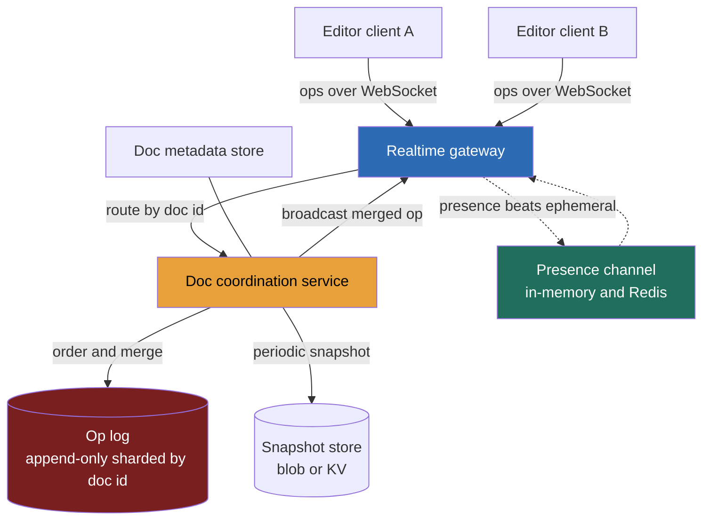

> **Attempt the capstone first - this lesson is the debrief, not the spoiler.** This is *exactly* the capstone problem, and the capstone hands you the empty whiteboard and a self-critique loop. Drive it yourself there before reading a worked answer here, or you burn the one chance to feel where your own design breaks. **This gets asked because it is the strongest cross-platform business-domain question on the senior loop**, and because it has a signature trap: convergence correctness (OT/CRDT) is genuinely IC-deep, so candidates either *hand-wave* "we use CRDTs" with no idea why, or *rat-hole* for fifteen minutes deriving transformation functions and never reach a design. **What separates a Director answer:** name all three concurrency strategies, decide one against *this* product's requirements, and **delegate the algorithm internals with a stated prior** - "I'd have the collaboration team prove convergence; my prior is a sequence CRDT for the offline story." Knowing the limit of your own depth, out loud, *is* the scored signal here.

### Learning objectives
- Run the **RESHADED** spine on a problem whose crux is **convergence correctness**, not a read:write ratio - and quantify the load that actually shapes it (presence dwarfs edits; concurrent editors per doc are *tens*, not thousands).
- Name the three concurrency-control strategies - **OT, CRDT, locking** - state the pros/cons of each, and **decide one for this product** against requirements, cost, and risk.
- Make the **delegation move** the model answer: name the pivotal convergence call, hand the algorithm proof to a specialist *with a stated prior*, and recognize that an honest depth limit is the signal, not a dodge.
- Carry the **document-representation** decision (op log vs materialized state) through Storage and Data-model, and place the **durable boundary** where it belongs.
- Fan out **presence/cursors** on a separate, cheap, ephemeral axis - never down the durable edit path.

### Intuition first
Picture a single whiteboard with ten people holding markers, all writing at once. The naive fix is a **talking stick** - one marker at a time, everyone else waits (a lock). It prevents collisions but destroys the product: collaborative editing means *simultaneous*, and a per-document lock turns ten writers into a queue of one. So you throw the stick away and let everyone write at once - which raises the only hard question in the problem: **if Alice and Bob edit the same word in the same instant, on two screens with network delay between them, how does the board end up showing the *same* sentence to both, with neither stroke silently erased?**

That is **convergence**: independent, concurrent, intention-carrying edits must merge **deterministically** into one shared state, regardless of arrival order. A different *class* of problem from the social-feed questions (Instagram, Twitter), where a few seconds of staleness is invisible - here a "stale read" means **two people see two different documents**, the cardinal failure. Two algorithm families solve it - **Operational Transformation (OT)** and **CRDTs** - and choosing between them, *not* deriving either, is the whole interview. Hold the picture: a small server that **orders and merges edits into one truth**, wrapped by a big cheap layer fanning out **presence and cursors** that need not be durable or even correct.

---

## R - Requirements

> Pin the scope, then say the load-bearing fact out loud: the crux is **convergence correctness**; the secondary axis is **presence fan-out** - two problems wearing one product.

**Clarifying questions I'd ask (with assumed answers):**
- *Plain or rich text?* → **Rich text** - harder data model, but the real product. I'll note where plain text would simplify.
- *Concurrent editors per doc?* → **Tens, not thousands.** 5,000 simultaneous typists isn't a document, it's a broadcast - treat huge view-only audiences as a *separate* fan-out problem.
- *Offline editing required?* → **Yes** - close the laptop, keep typing, reconnect and merge. The single requirement that most tilts the OT-vs-CRDT call.
- *Is a lost keystroke ever acceptable?* → **No.** Convergence is a correctness invariant: same edits → same final state on every replica.
- *Latency bar?* → Local echo **instant** (optimistic); remote edits visible **< ~200 ms** same-region.

**Functional requirements:**
1. **Open/load** a document and render current state fast.
2. **Edit** locally with instant echo; **propagate** to all active editors sub-second.
3. **Converge** concurrent edits into one consistent state - the crux.
4. **Presence:** who's here, where their cursor and selection are.
5. **Offline edit + reconnect merge.**
6. **Persistence + version history** (snapshots, restore, see-changes-since).

**Explicitly CUT (scoping *is* the signal):** access-control/sharing, comments/suggestions, rich-media embeds, cross-doc search, export, real-time spell/grammar. I scope to **load → edit → converge → present → persist**, and say so.

**Non-functional requirements:**
- **Convergence correctness** - *the* hard one. All replicas reach the same final state given the same edit set, any arrival order. A correctness invariant.
- **Low edit-propagation latency** - local echo instant; remote < 200 ms same-region.
- **Durability + versioning** - committed edits survive crashes; history is restorable.
- **AP at the client for editing** - a user whose network blips keeps typing offline and merges on reconnect (pushes toward **AP**).
- **Presence is best-effort** - ephemeral, lossy, cheap; never on the durable path.

**The skew, stated.** **Not** a read:write ratio problem. Two facts shape everything: (1) **presence/cursor traffic dwarfs edit traffic** - every keystroke and mouse move is a presence event, but only committed edits persist; and (2) **concurrent editors per doc are tens**, so the convergence algorithm runs over a *small* set of ops, not a million. The architecture follows: a **per-document coordination unit** ordering a handful of concurrent edits, fronted by a **cheap ephemeral presence layer** carrying the firehose nobody needs to keep.

---

## E - Estimation

> Enough math to make a defensible call. The headline isn't QPS - it's that **edits are rare and small, presence is constant and disposable**.

**Assumptions:** 100M docs; 10M DAU; ~2M docs with an *active* editing session at peak; ~3 concurrent editors per active doc.

**Concurrent connections (the real scale axis):** `2M active docs × 3 editors ≈ 6M live WebSocket connections` at peak. That - not edit volume - sizes the realtime tier. At ~50K connections/node → **~120 stateful gateway nodes**. The architecture problem is *connection fan-out*, not compute.

**Edit (op) rate:** ~10% of editors actively typing at ~5 ops/sec: `6M × 0.1 × 5 ≈ 3M ops/sec` broadcast through the realtime layer. But ops are tiny and **most never persist as individual rows** - they're coalesced.

**Durable write rate (what hits storage):** we **don't** persist every keystroke. Coalesce per doc into an op-batch every ~1-2 s: `2M docs ÷ 1.5 s ≈ 1.3M durable appends/sec` - large, but each is an **append-only log write** (the cheapest durable pattern), shardable by `doc_id`.

**Presence rate (the firehose we throw away):** every cursor move and keystroke is a presence beat. `6M conns × ~5/sec ≈ 30M presence events/sec` - **10× the edit op rate**, and growing with audience, not editors. This is the number that proves presence must be **a separate, ephemeral channel**: persisting data with a ~200 ms useful life would dominate the whole write budget.

**Storage:** materialized state is small: `100M docs × ~100 KB ≈ 10 TB`, ×3 → **~30 TB** - modest. The op log is the growth driver, bounded by **snapshot + log truncation**.

**What estimation decided:** the scale axis is **6M concurrent connections** (fan-out), not edit compute. Durable writes are a **shardable append log**. **Presence is 10× the edit firehose and disposable.** Convergence runs over **tens** of ops per doc - its *cost* is trivial; only its *correctness* matters.

---

## S - Storage

> Three data classes with different durability needs. The pivotal call here - **op log vs materialized state** - is the document-representation decision, named explicitly.

**1. The document itself - op log + snapshots (durable, the source of truth).**
- *Access pattern:* append small ops constantly; load current state on open; reconstruct any historical version. Natural fit: an **append-only op log** plus **periodic materialized snapshots** so opening a doc doesn't replay a million ops.
- *Choice:* **append-only log sharded by `doc_id`** (Kafka-style log or an LSM store like Cassandra/RocksDB) for ops, plus a blob/KV store (S3 or DynamoDB) for snapshots. Open = latest snapshot + replay the **tail**.
- *The representation decision, stated:* **op log is truth, snapshot is cache** - *not* materialized state as truth. *Rejected - store only current state:* loses version history, the ability to merge an offline client's old-baseline edits, and the audit trail. The op log *is* the feature; state-only is cheaper but throws away three requirements.

**2. Presence / cursors (ephemeral, best-effort, in-memory).** **In-memory in the gateway**, Redis pub/sub for cross-node fan-out. TTL'd, never durable - cursor-at-412 is worthless 200 ms later. *Rejected - persisting presence:* 30M events/sec with a ~200 ms shelf life would dominate the storage budget for nothing.

**3. Document metadata (title, owner, ACL, snapshot pointers) - small, relational.** A standard relational/KV store keyed by `doc_id`: tiny, read on open, rarely written. Not the interesting part.

The op log carries the convergence ops, and **OT vs CRDT changes what each op *is*** - which is why representation and concurrency strategy are decided together, next.

---

## H - High-level design

> The shape to make visible: a **big ephemeral fan-out layer** (connections, presence) wrapping a **small per-document coordination unit** (order + merge + persist) on a **durable op log**.



**Happy path, compressed:** a client opens a doc (latest **snapshot** + replay the op-log **tail**) and opens a **WebSocket** to a gateway, which routes it to the **doc coordination service** - the single authority for that `doc_id`, giving a deterministic ordering point. The client applies its edit **locally and instantly** (optimistic echo), then sends the op up; the coordinator **orders** it against concurrent ops, **merges** (CRDT merge), **appends** to the durable op log, and **broadcasts** the merged op to every other editor. On a totally separate channel, **presence beats** flow client → gateway → presence channel (in-memory / Redis pub/sub) → other clients - **never** touching the coordinator or the op log.

**The shape to notice:** the load-bearing wall runs between **presence + connection fan-out (ephemeral, AP, the 30M/sec firehose)** and **edit ordering + durable op log (the convergence point)**. The per-doc coordinator gives a clean ordering authority; presence is kept off that path.

---

## A - API design

> Mostly a **stateful WebSocket protocol**, not REST - the realtime calls are the interesting ones; metadata is plain HTTP.

```
# --- Load / metadata (HTTP) ---
GET  /v1/docs/{docId}                 -> 200 { snapshot, snapshotVersion, tailOps:[...], asOf }
GET  /v1/docs/{docId}/history         -> 200 { versions:[{version, ts, author}] }
POST /v1/docs/{docId}/restore         body:{ version } -> 200 { newVersion }

# --- Realtime editing (WebSocket: client <-> gateway <-> coordinator) ---
WS   /v1/docs/{docId}/connect
  -> server: { type:"sync", baseVersion, ops:[...] }       # catch you up on connect
  client -> { type:"op", baseVersion, op:{...}, opId }      # an edit, tagged with the version it was made against
  server -> { type:"ack", opId, serverVersion }            # committed + ordered
  server -> { type:"op", op:{...}, serverVersion }          # someone else's merged edit, pushed to you
  -> server: { type:"reject", opId, reason }                # stale baseline; client rebases and retries

# --- Presence (separate ephemeral channel, fire-and-forget) ---
  client -> { type:"presence", cursor, selection }          # NOT acked, NOT durable
  server -> { type:"presence", userId, cursor, selection }  # fanned out best-effort
```

**Design notes (each with its rejected alternative):**
- **Every client op carries `baseVersion`** - the version it was made against. *Rejected: a bare op with no baseline.* The coordinator needs the baseline to merge correctly against ops the client hadn't seen. The baseline **is** the convergence machinery's input.
- **`opId` makes ops idempotent.** Reconnects re-send unacked ops; the coordinator dedups on `opId`. *Rejected: trusting at-most-once delivery* - WebSockets drop; clients must safely re-send.
- **Presence is a separate message type, no ack, no persistence.** *Rejected: one unified event stream* - it would drag the 30M/sec presence firehose through the durable coordinator. The protocol split *is* the architectural split.
- **On reconnect the server sends a `sync` from the client's last-known version** - the offline-merge entry point.

---

## D - Data model

> This step carries the **pivotal decision of the whole problem**: the concurrency-control strategy (OT vs CRDT vs locking), which *also* fixes what an "op" is. I decide at **decision altitude** and delegate the internals.

**The three strategies, named with pros/cons (this is the interview):**

- **Locking (talking stick).** One writer at a time per doc/region. *Pro:* trivially correct, no merge algorithm. *Con:* **kills the product** - collaborative editing means simultaneous; a lock serializes everyone. *Rejected* for live co-editing (survives only in low-collaboration tools).

- **Operational Transformation (OT).** Each op is positional (`insert "x" at 7`); on conflict the server **transforms** one against the other so both apply consistently (two `insert at 7` → one shifts to 8). *Pro:* compact ops, mature (the original Docs/Wave approach). *Con:* the **transformation functions are notoriously hard to get right** across every op-pair, and OT **leans on a central server** to order ops - complicating the offline/peer story.

- **CRDT (Conflict-free Replicated Data Type).** Each element gets a **stable unique ID** and a position from a partial order, so merges are **commutative and associative** - any replica applying the same ops in any order converges, *no transform, no central authority*. *Pro:* converges without a coordinator, strong **offline-first** story, peer-to-peer friendly. *Con:* **metadata overhead** (ID + position per element), tombstones for deletes, historically heavier memory - largely tamed by modern sequence CRDTs (RGA, Yjs, Automerge).

**The decision, defended against *this* product's requirements:**
> **I'd choose a sequence CRDT, and the requirement that decides it is offline editing.** Close a laptop, keep typing, merge cleanly on reconnect is exactly what CRDTs make easy and OT makes painful: OT's central ordering authority means an offline client's stale-baseline ops need careful server-side transformation against everything that happened while it was gone, whereas CRDTs merge regardless of order or coordinator - so offline-then-reconnect is *the same code path* as normal editing. **The trade I accept:** CRDT metadata/memory overhead per element, mitigated by snapshotting and modern libraries. If offline were cut, I'd reconsider OT for smaller payloads - the call hinges on that one requirement.

**The delegation move (the model answer, not a dodge):**
> **The internals - proving the merge is commutative, tombstone GC, RGA vs Yjs vs Automerge - I'd delegate to the collaboration team to prove with property tests + a fuzzing harness.** My prior is **Yjs** for its mature offline support. I own the *decision and its justification*; I hand off the algorithm proof with a stated prior. **Hand-rolling a CRDT at the whiteboard is the altitude trap** - it signals IC, not Director. Naming the limit of my depth here is the point.

**What an op is, given the choice:** under the CRDT the op log stores **CRDT operations** (element insert with stable ID + position; delete as a tombstone), not raw positional inserts; snapshots persist the compacted CRDT state. (Under OT it would store positional ops + server-assigned sequence numbers - a different log shape, which is *why* this decision lives here.)

<details>
<summary>Go deeper - OT transformation vs CRDT merge mechanics (IC depth, optional)</summary>

**OT in one paragraph.** Operational Transformation maintains correctness by *transforming* operations against concurrent ones. If client A does `insert("X", 7)` and client B concurrently does `insert("Y", 7)`, the server picks an order (say A first), commits A, then transforms B's op against A: since A inserted at position ≤ 7, B's insert shifts to position 8, becoming `insert("Y", 8)`. Both replicas end with `...X Y...` in the same order. The hard part is the **transformation matrix** - a correct transform function for *every pair* of op types (insert vs insert, insert vs delete, delete vs delete, with formatting ops multiplying the cases), satisfying the TP1/TP2 transform properties. Getting TP2 right for more than two concurrent sites is famously where OT implementations have shipped subtle convergence bugs for years. This is precisely the IC-deep correctness work a Director names and delegates.

**CRDT in one paragraph.** A sequence CRDT (e.g., RGA, or the position-based scheme in Yjs/Automerge) gives every inserted character a **globally unique, immutable ID** and a **position drawn from a dense total order** (e.g., a fractional index or a tree path between its neighbors' IDs). Insert "between A and B" mints a new ID ordered between A's and B's positions; concurrent inserts at the "same" spot get distinct positions and a deterministic tie-break on ID, so every replica orders them identically. Delete is a **tombstone** (mark, don't remove) so a concurrent edit referencing the deleted element still resolves. Merge is just "union the operation sets" - commutative, associative, idempotent - which is why **no central coordinator is required** and offline merge is free. The costs you pay: per-element ID/position metadata (memory), tombstone accumulation (needs periodic GC/compaction), and snapshot complexity.

**Why offline tilts it:** OT needs the server to transform an offline client's stale-baseline ops against the entire intervening history on reconnect - correct but fiddly, and the server is a required ordering authority. CRDT reconnect is *identical* to online merge: replay the missed ops, merge yours, done. Same code path, no special case. That symmetry is the decisive engineering argument.

</details>

---

## E - Evaluation

> Re-check against the NFRs and hunt bottlenecks. **The model answer at this step is the delegation move itself** - naming the convergence call and handing the proof to a specialist, scored as strength, not evasion.

**Re-check vs NFRs:** convergence - CRDT merge (delegated proof); latency - optimistic echo + per-doc broadcast; durability - op log + snapshots; offline/AP - CRDT merges on reconnect; presence - ephemeral channel. Now the bottlenecks.

**Bottleneck 1 - convergence correctness (the cardinal risk, and the delegation move).**
*Fix:* the **CRDT merge** guarantees a concurrent same-word edit converges identically on both screens by construction (commutative ops, stable IDs). **The Director move:** name this as *the* pivotal call, choose CRDT for the offline requirement, and **delegate the convergence proof** - "the collaboration team owns the implementation and proves convergence with property tests + a multi-client fuzzer; my prior is Yjs." *Rejected:* hand-deriving transforms at the whiteboard - the IC rat-hole this question is built to expose. The honest depth limit *is* the signal.

**Bottleneck 2 - the per-doc coordinator as a single point.**
*Fix:* a **lightweight, sharded** authority - each doc's coordinator is tiny (tens of editors, tiny op rate), so thousands run across the fleet sharded by `doc_id`, with fast failover (re-elect, rehydrate from snapshot + op-log tail). *Trade-off:* a sub-second rehydrate stall on failover - accepted because per-doc state is small. *(With a CRDT the coordinator is "soft" - clients could merge peer-to-peer - but we keep it for durable ordering and broadcast efficiency.)*

**Bottleneck 3 - the connection fan-out (the real scale).**
*Fix:* a horizontally scaled **stateful gateway tier** (~120 nodes at 50K conns each) with per-doc subscription, so an op fans out only to that doc's editors (tens), not globally. *Trade-off:* stateful nodes are harder to operate (draining on deploy, sticky routing) - the accepted cost of realtime. This is the genuine scale axis; convergence compute is trivial beside it.

**Bottleneck 4 - op-log growth / slow doc open.**
*Fix:* **periodic snapshots + log truncation** - snapshot the CRDT state every N ops, drop the prefix; open = snapshot + short tail replay. *Trade-off:* snapshots cost storage and a compaction job. *Rejected:* unbounded op log - opens slow forever, history grows without limit.

**Bottleneck 5 - presence flooding the durable path.**
*Fix:* presence is a **protocol-separate, in-memory, fire-and-forget channel** (Redis pub/sub cross-node), TTL'd, lossy by design. *Trade-off:* a dropped beat means a cursor lags ~200 ms - invisible. *Rejected:* a unified durable event stream conflating the firehose with the source of truth.

**Closing re-check:** convergence by construction (delegated proof); coordinator sharded + failover-fast; fan-out horizontally scaled; doc-open bounded by snapshot+truncate; presence off the durable path. The durable surface stays a small append log; everything ephemeral stays ephemeral.

---

## D - Design evolution

> Push each dimension up an order of magnitude, find what breaks first, name what I'd delegate.

**At 10× (Figma-scale: 1000s viewing one doc, global editors):**
- **Split editors from viewers.** Convergence runs over the *editors* (still tens); a 1000-strong **view-only** audience is a **broadcast/CDN fan-out** problem - serve them snapshot+tail, not as CRDT replicas. *Trade-off:* viewers see edits a beat later - fine.
- **Global editing → regional coordinators.** A single per-doc owner across continents adds RTT per commit. Move to **regional CRDT replicas merging asynchronously** with a designated durable-log writer. *Trade-off:* cross-region convergence is eventually-consistent on the order of inter-region RTT - acceptable; the CRDT still converges.

**Hardest trade-offs to defend:**
- **CRDT vs OT.** Chosen on the offline requirement; I pay CRDT's metadata/memory cost and delegate GC/compaction. Drop offline and OT's smaller payloads might win - requirement-driven, not dogma.
- **Op log vs materialized state as truth.** The log buys history, restore, and offline merge; I pay storage growth, bought back by snapshot+truncation. State-only is cheaper but discards three requirements.
- **One coordinator per doc.** Buys a clean ordering authority and cheap convergence; costs a per-doc single point, mitigated by tiny rehydratable state and fast failover.

**What I'd revisit if requirements changed:** drop offline → reconsider OT; add suggestions mode → a permissions/review-state layer; add huge view-only audiences → the editor/viewer split becomes day-one.

**Where I'd delegate (the explicit Director move):**
- **Convergence algorithm:** *"Collaboration team owns the CRDT - implementation, tombstone GC, convergence proof via property tests + a multi-client fuzzer; my prior is Yjs. I own the decision, not the transform math."*
- **Rich-text data model:** *"Editor team owns mapping formatting onto CRDT ops; my prior is a tree-structured doc with block-level CRDT nodes."*
- **Realtime infra:** *"Infra owns the stateful gateway - connection draining, sticky routing, autoscaling 6M connections; my prior is a sharded gateway with per-doc subscriptions."* What I keep - the OT/CRDT decision, op-log-as-truth, the presence/edit split - and what I hand off with a stated prior, **is the altitude.**

---

### Trade-offs table - the pivotal decisions

| Decision | Option A | Option B | Option C | Use when... |
|---|---|---|---|---|
| **Concurrency control** | **CRDT** (stable IDs, commutative merge, no coordinator needed) | **OT** (positional transforms, central order) | **Locking** (one writer at a time) | **A** when **offline / peer-merge** matters - converges with no central authority (our choice). **B** when payload size + maturity matter and editing is always online. **C** only for low-collaboration tools - **rejected** for live co-editing. |
| **Document representation** | **Op log as truth + snapshots** | **Materialized state as truth** | **Snapshot-only, no op history** | **A** when you need history, restore, and offline merge (our choice). **B** cheaper but loses versioning. **C** loses both history and merge - rejected. |
| **Presence transport** | **Separate ephemeral channel** (in-mem + Redis pub/sub) | **Same durable stream as edits** | **Polling** | **A** - 30M/sec disposable firehose off the durable path (our choice). **B** buries storage. **C** too laggy for live cursors. |

---

### What interviewers probe here (Director altitude)

- **"OT or CRDT - and why?"** - *Strong:* names **all three** (incl. why locking kills the product), picks one **against a requirement** (CRDT *because* offline merge is required), states the trade (metadata overhead), and **delegates the proof with a stated prior** (Yjs). *Red flag:* "we use CRDTs" with no idea why - or fifteen minutes deriving transforms.
- **"How do two people editing the same word converge?"** - *Strong:* by construction - CRDT ops are commutative with stable per-element IDs and a deterministic tie-break, so every replica orders them identically with no lost keystroke. *Red flag:* "last write wins" (loses keystrokes) or "lock the paragraph" (kills co-editing).
- **"What's the real scale axis?"** - *Strong:* **6M concurrent connections** (fan-out), not edit compute; convergence runs over *tens* of ops per doc; **presence is 10× the edit firehose and disposable**. *Red flag:* sizing a giant transactional core, or "thousands of concurrent editors per doc."
- **"Where's your durable boundary?"** - *Strong:* durable = op log (truth) + snapshots; ephemeral = presence on a separate channel; metadata small/relational. Keeps the durable surface a small append log. *Red flag:* persisting presence, or storing only current state and losing history.
- **"What do you own vs delegate?"** - *Strong:* owns the OT/CRDT *decision* + representation + presence split; delegates the algorithm proof, rich-text schema, and gateway infra **each with a stated prior**. *Red flag:* hand-rolling the CRDT (IC), or hand-waving convergence (too high).

---

### Common mistakes

- **Hand-waving "we'll use CRDTs"** with no reason and no trade-off - or rat-holing on transform-function derivation. Both miss the altitude: **name three, decide one against a requirement, delegate the proof.**
- **Treating convergence as a staleness problem.** A stale read here means **two people see two different documents** - a correctness invariant, not a latency knob.
- **Putting presence on the durable edit path.** It's 10× the edit firehose with a ~200 ms shelf life; a separate ephemeral channel is mandatory.
- **Storing only the current document state.** Discards history, restore, *and* offline merge - three requirements. The **op log is truth**; the snapshot is a cache.
- **Sizing for thousands of concurrent editors per doc.** Real concurrency is *tens*; the scale axis is **connection fan-out**, not convergence compute.

---

### Interviewer follow-up questions (with model answers)

**Q1. OT or CRDT for this, and defend it.**
> *Model:* Three strategies: locking (rejected - it serializes co-editing and kills the product), OT, CRDT. I choose a **sequence CRDT**, and the deciding requirement is **offline editing** - under a CRDT, reconnect-and-merge is the *same code path* as online editing (commutative merge, no central ordering authority), whereas OT must transform an offline client's stale-baseline ops against all intervening history on reconnect. The trade I accept is CRDT metadata/memory overhead, mitigated by snapshotting and a mature library; if offline were cut I'd reconsider OT for smaller payloads. The convergence *proof* I delegate to the collaboration team with property tests and a fuzzer; my prior is **Yjs**. Owning the decision, delegating the internals, is the point.

**Q2. Alice and Bob both insert a character at position 7 at the same instant. What happens?**
> *Model:* Each inserted character gets a **globally unique, immutable ID** and a position from a dense order between its neighbors. The two inserts mint distinct IDs "around" 7, and every replica applies a **deterministic tie-break on those IDs** - so all replicas end with the same two characters in the same order: both screens identical, neither keystroke lost. There's no "winner"; both survive deterministically. Convergence by construction - exactly why I chose a CRDT over a hand-written transform.

**Q3. What's the durable write rate, and what do you actually persist?**
> *Model:* Not every keystroke as a row - I coalesce ops per doc into an append-batch every ~1-2 s, so with ~2M active docs that's ~**1.3M durable appends/sec**, an append-only op-log write sharded by `doc_id` (the cheapest durable pattern). Presence (~30M events/sec) is **never** persisted - separate in-memory channel, ~200 ms shelf life. Snapshot + truncate keeps doc-open fast and storage bounded. The durable surface is a small shardable append log plus snapshots, not a hot transactional core.

**Q4. 5,000 people open the same doc during a launch. Does your design hold?**
> *Model:* I'd reframe: 5,000 *editors* on one doc is a broadcast, not a document - a different problem. I **split editors from viewers**: convergence runs only over the handful editing (tens); the large **view-only** audience is served snapshot+tail over a read-optimized broadcast/CDN path, not as CRDT replicas (they see edits a beat behind - fine). The convergence algorithm never scales with audience; **connection fan-out** does, handled by the stateful gateway tier with per-doc subscriptions. So yes - by recognizing it's a fan-out problem in a convergence costume.

---

### Key takeaways
- The crux is **convergence correctness**, not a read:write ratio: concurrent edits must merge **deterministically** into one state with **zero lost keystrokes** - a correctness invariant, not a staleness tolerance.
- **Name all three strategies, decide one against a requirement:** locking (rejected - serializes co-editing), OT (positional transforms, central order), CRDT (stable IDs, commutative merge, no coordinator). **CRDT wins *because* offline editing is required**, and the algorithm proof is **delegated with a stated prior (Yjs)**. The honest depth limit is the scored signal, not a dodge.
- **Op log is truth; the snapshot is a cache.** Buys history, restore, and offline merge; growth bounded by **snapshot + log truncation**. The concurrency choice fixes what an "op" is.
- **The scale axis is connection fan-out** (~6M WebSockets), not edit compute - concurrency per doc is *tens*; the durable write rate is a **shardable append log** (~1.3M coalesced appends/sec).
- **Presence is 10× the edit firehose and disposable** - a separate ephemeral channel, never the durable path. Draw the durable boundary tight: op log + snapshots durable; presence ephemeral.

> **Spaced-repetition recap:** Google Docs = the **convergence** problem - many editors, one document, zero lost keystrokes, both screens identical. **Name three strategies (locking / OT / CRDT), pick CRDT because offline editing is required, delegate the convergence proof with a stated prior (Yjs)** - delegation is the model answer, not a dodge. **Op log = truth, snapshot = cache** (history + offline merge; bound with snapshot+truncate). Scale axis is **connection fan-out (~6M WS)**, not edit compute; concurrency per doc is *tens*. **Presence is a separate ephemeral channel** (10× the edit firehose). This is the **Capstone** problem - drive it yourself first.

---

*End of Lesson 5.10. Google Docs is the convergence question the social-feed problems let you dodge: the Director skill is to name the OT/CRDT/locking decision, decide it against the offline requirement, and **delegate the algorithm proof with a stated prior** rather than hand-roll a CRDT at the whiteboard. It is the capstone problem; this lesson is the debrief. Presence fan-out reuses the live-comments design; AP/CP reasoning is the standard consistency trade-off.*
