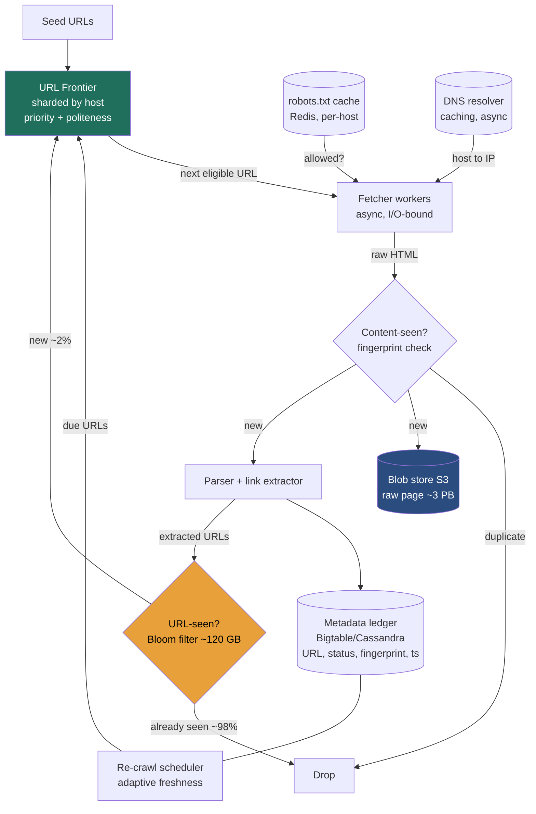

### Learning objectives
- Run the **RESHADED** spine end-to-end on a large-scale web crawler and defend every call against requirements, cost, and risk — not recite a parts list.
- Internalize the crux that separates a crawler from a `wget` loop: **the URL frontier**, which must simultaneously **prioritize**, enforce **politeness (per-host rate-limiting)**, and never re-fetch the billions of URLs already **seen** — cheaply.
- Quantify the system in numbers a Director can stand behind: **~30B pages/crawl over 30 days ≈ 12k pages/sec** sustained (peak ~25k), **~720k URL-seen checks/sec**, **~10 Gbps** ingest, **3 PB** raw storage, and a **~120 GB Bloom filter** — and show why each number is the one that picks a component.
- Explain why throughput comes from **host-diversity, not depth** (12k pages/s ÷ 1 req/s/host ⇒ **≥12k hosts crawled concurrently**), and why **partitioning the frontier by hostname** is the decision that makes politeness a *local* property requiring no cross-node coordination.
- Identify where a Director **goes deep** (the frontier design, the politeness-vs-throughput trade, the Bloom false-positive direction) and where they **delegate a benchmark** (SimHash near-dup tuning, the JS-render farm), naming the trade-off each fix makes.

### Intuition first
A web crawler is not a downloader — downloading is the easy 5%. It is a **politeness-constrained breadth-first search over a hostile graph**. Picture a single, very well-mannered librarian trying to photocopy the entire web. The work itself (fetch a page, photocopy it, write down the links you find on it, go fetch those next) is trivial. Three things make it brutally hard at scale. **First, manners**: you cannot hammer one website — if you fire 12,000 requests a second at one server you DDoS it and get banned, so you must cap yourself to roughly **one request per second per host** and obey each site's posted rules (`robots.txt`). That single rule has a violent consequence: to photocopy 12,000 pages a second while touching each *host* only once a second, you must be working on **at least 12,000 different websites at the same moment** — so your throughput is bought entirely with **breadth (how many hosts you juggle)**, never with depth. **Second, memory**: the web is one giant loop — page A links to B links back to A — so before you fetch anything you must ask "have I already seen this URL?" and you must ask it about **120 billion** discovered links without that lookup costing a disk seek each time. **Third, the web fights back**: there are infinite calendars ("next month → next month → forever"), session-id URLs that look new on every visit, and deliberate **spider traps** designed to drown a naive crawler. So the heart of the system is one component — the **URL frontier** — a giant, sharded, prioritized, politeness-aware to-do list, fronted by a **Bloom filter** that cheaply remembers what you've already seen. Everything else (the fetchers, the parser, the blob store) is plumbing around that to-do list. Get the frontier right and the crawler works; get it wrong and you either DDoS the web, fall into a trap, or re-crawl the same 100 pages forever.

Two framing notes before the spine. **One:** a crawler is the rare system that is almost **pure write** — it *produces* a corpus. There is no user issuing reads on the critical path; the "read" is a downstream batch job (the search indexer, Lesson 3.12 / 5's search) that consumes the output offline. So the usual read:write-skew question inverts: this is a **write-and-ingest** problem, sized by **fetch rate and storage growth**, not query QPS. **Two:** the entire design hangs off one tension — **maximize fetch throughput while never violating per-host politeness** — and the elegant resolution is **partition the frontier by hostname** so each host lives on exactly one worker, making "1 req/s for this host" a decision that worker makes alone, with **zero global coordination**. Hold those two ideas; every section below is a consequence of them.

---

## R — Requirements

RESHADED's first move is to scope hard, because "build a web crawler" hides several products (a search-engine corpus builder, a focused/vertical scraper, an archival crawler like the Wayback Machine, a malware scanner). At Director altitude the signal is **cutting to a defensible core and saying why**, then naming the read:write and scale assumptions the rest of the design rests on.

**Clarifying questions I'd ask the interviewer (and the answers I'll assume):**
- *What's the crawler **for**?* → **Building a fresh corpus for a search index** (the general case). This sets the scope: broad coverage, periodic re-crawl for freshness, store raw + extracted text. It rules out a focused/topical crawler (different prioritization) and a pure archiver (no link-following needed).
- *Scale and cadence?* → **~30 billion pages, re-crawled roughly monthly** (a 30-day budget). This single pair of numbers drives the entire E step — it sets the **fetch rate** (~12k/s) that everything else sizes from.
- *HTML only, or render JavaScript?* → **HTML fetch + parse in scope; full JS rendering (headless Chrome) is acknowledged but delegated** to a separate render tier. Rendering is 10–50× more expensive per page (a whole browser per fetch) — I scope the main crawler to raw HTML and treat the render farm as a bolt-on for the JS-heavy slice. Stating this cut is itself signal.
- *Just text, or media too?* → **Discover and record media URLs, but don't download bytes** on the crawl path. Images/video go to a blob pipeline if needed (Lesson 3.11); the crawler stores the *page* (~100 KB of HTML), not the ~2 MB of assets that hang off it.
- *Must it respect `robots.txt` and politeness?* → **Yes — non-negotiable.** This is the defining **non-functional** requirement, not a nicety: violate it and you get IP-banned, legally threatened, and you take sites down. I'll treat politeness as a first-class constraint the architecture is *built around*.

**CUT from scope (stated out loud, with the reason):** **JavaScript rendering** (delegated render tier — 10–50× cost), **deep content indexing / ranking / PageRank** (that's the *search* problem, Lesson 3.12 — the crawler's job ends at "store the page + extracted links"), **media byte download** (blob pipeline, orthogonal), **authenticated / paywalled / dark-web crawling** (policy + auth out of scope), and **real-time crawling** (this is a batch/continuous ingest, not a low-latency service). Trying to design all of this in 45 minutes is the red flag; the discipline to scope to *fetch → parse → dedup → store → re-enqueue, politely, at scale* is the signal.

**Functional requirements (the core):**
1. **Fetch** a page given a URL (HTTP GET), honoring `robots.txt` and per-host rate limits.
2. **Parse** the page and **extract outbound links**.
3. **Dedup**: never (re-)enqueue a URL already seen; never store a page already stored (content dedup).
4. **Store** the raw page (and extracted text/metadata) durably for downstream consumers.
5. **Prioritize**: crawl high-value/changed pages sooner (not pure FIFO).
6. **Re-crawl** for freshness on a schedule that adapts to how often a page changes.
7. **Avoid traps/loops**: bound depth/per-host budget, detect spider traps and near-duplicate pages.

**Non-functional requirements (these drive every later decision):**
- **Politeness (the headline NFR):** **≤ ~1 request/second/host** by default (tunable per-host from `Crawl-delay`), obey `robots.txt`. The system is *built around* this constraint.
- **Throughput / scalability:** sustain **~12k pages/sec** (derived next), scale horizontally to 10× by adding workers — no global bottleneck.
- **Robustness:** survive malformed HTML, timeouts, traps, and worker failures without losing the frontier or re-doing completed work.
- **Freshness:** important pages re-crawled frequently; stale-but-stable pages re-crawled rarely (adaptive, not uniform).
- **Extensibility:** new content types / new extractors pluggable without re-architecting.
- **Read:write skew:** **write-dominated / pure ingest** — the crawler emits ~12k page-writes/s and ~12k metadata-writes/s; there are **no external reads** on the hot path (downstream indexing reads the corpus offline in batch). Size for **write throughput and storage growth**, not query QPS.

The decisive requirement is **politeness × throughput**: ≤1 req/s/host *and* 12k pages/s together **force** a design that spreads work across **≥12k hosts at once** and partitions the frontier by host. That tension is the architectural fork everything else hangs off.

---

## E — Estimation

RESHADED's E step is "enough math to make a defensible call," not exhaustive arithmetic. I round hard and state assumptions. The goal is to size the **fetch rate**, **bandwidth**, **storage**, the **seen-set (Bloom filter)**, and the **worker fleet** — and to expose the numbers that *pick components*. **One consistency rule I'll hold throughout: ~100 KB per page over the wire** (the HTML document — not the ~2 MB of images/CSS/JS that render with it; we fetch the page, not the assets). Bandwidth and storage both derive from that single number.

**Assumptions:** 30B pages per crawl; 30-day crawl budget; **~100 KB/page** transferred (HTML doc, pre-compression); **~60 outbound links/page** (typical for content pages); **~120B distinct URLs discovered** (you discover more than you crawl — robots-blocked, budget-capped, and duplicate URLs get skipped, so discovered ≈ 3–4× crawled); diurnal **peak ≈ 2× average**.

**Fetch rate (the crux number everything sizes from):**
```
30B pages ÷ (30 days × 86,400 s) = 30e9 / 2.59e6 ≈ 11,600 pages/s
  → round to ~12k pages/s sustained
peak (×2)                        → ~25k pages/s
```

**Host concurrency (the politeness consequence — THE crawler insight):**
```
12k pages/s ÷ 1 request/s/host = 12,000 distinct hosts crawled *concurrently*
```
Throughput is bought with **breadth**, not depth: to fetch 12k pages/s while touching each host ≤1×/s, you must be actively working **12,000 different hosts** at any instant. A crawler stuck on a few big sites can never hit the target without violating politeness. This number is why the frontier is partitioned by host.

**A convergence worth naming (Little's Law).** Concurrency in flight = arrival rate × time in system. With ~1 s average fetch latency:
```
in-flight fetches = 12k/s × 1 s ≈ 12,000 concurrent fetches
```
The same **~12k**. That's not a coincidence: under "1 req/s/host," each host sustains ~1 in-flight fetch, so "12k active hosts" and "12k concurrent fetches" are the same constraint viewed two ways. Both the *politeness* limit and the *latency × throughput* limit land on ~12k — a clean, quantified sanity check.

**URL-seen checks/sec (the number that makes the Bloom filter non-optional):**
```
12k pages/s × 60 links/page = 720k URL-seen checks/s   (peak ~1.5M/s)
…but only ~12k/s of those are *new* and get enqueued.
```
This asymmetry is the whole point: you **check ~720k URLs/s** but **enqueue only ~12k/s**, because ~98% of discovered links are already seen. A disk or DB lookup at 720k/s is infeasible (it'd be ~720k random IOPS just to dedup) — so the seen-set **must be an in-RAM probabilistic filter**.

**Seen-set sizing — Bloom vs the rejected exact stores (quantified):**
```
Bloom filter, 120B URLs @ 1% false-positive ≈ 9.6 bits/key:
  120e9 × 9.6 bits = 1.15e12 bits = ~144 GB  → ~120-150 GB, sharded across the fleet
Exact 64-bit-hash set (reject):   120e9 × 8 B = ~960 GB RAM
Full-URL set (reject):            120e9 × ~100 B = ~12 TB
```
The Bloom filter fits a sharded RAM budget (**~120 GB**) where the exact alternatives (~1 TB hash-set, ~12 TB full-URL) do not — and that's *exactly* the decision the number drives.

**Bandwidth (derived from the same 100 KB):**
```
ingest = 12k/s × 100 KB = 1.2 GB/s = ~10 Gbps sustained  (peak ~20 Gbps)
```
A few tens of Gbps — meaningful but not exotic (a handful of well-connected boxes). If we *rendered* JS or downloaded the ~2 MB of page assets, this would be ~20× higher — another reason rendering/media is a separate, delegated tier.

**Storage (same 100 KB; this is where the real cost is):**
```
Raw HTML, one crawl:   30B × 100 KB = 3e15 B = ~3 PB raw
Compressed (gzip ~3×):                         ~1 PB compressed/crawl
Metadata (URL, status, fingerprint, ts ~1 KB/page):  30B × 1 KB = ~30 TB
```
**~3 PB raw (~1 PB compressed) per crawl** dominates — and with monthly re-crawls you either overwrite (keep ~latest) or retain history (×N). This is the number that says "blob store, not a database, for page bodies."

**Worker fleet (sized by the binding resource):**
```
Fetch concurrency: ~12k concurrent fetches. A tuned async fetcher (epoll/event-loop)
  holds ~2–3k concurrent slow HTTP fetches/box → ~5–8 fetcher boxes for raw fetch.
Parsing is the heavier CPU cost (HTML parse + link extract ≈ a few ms/page):
  12k pages/s × ~3 ms ≈ 36 core-seconds/s → ~40–60 cores → ~10–20 boxes for parsing.
Run ~30–50 mixed worker boxes for headroom + failure domains.
```
Fetching is **I/O-bound** (waiting on slow remote servers — hence async, high concurrency per box); parsing is **CPU-bound**. Naming that split picks the instance shapes and is Director-grade sizing.

**The one-line takeaway from estimation:** size for **~12k pages/s ⇒ ~12k concurrent hosts, ~720k seen-checks/s, ~10 Gbps, ~3 PB/crawl, ~120 GB Bloom.** The two numbers that *pick components* are **720k seen-checks/s** (⇒ RAM Bloom filter) and **3 PB** (⇒ blob store) — and the **12k-hosts** figure (⇒ partition-by-host frontier) is the one that defines the whole architecture.

---

## S — Storage

The S step names *what must persist*, matches each data shape to a **store type by access pattern**, and names real systems — each justified against its rejected alternative. There are four distinct data shapes here, and conflating them into one database is the classic mistake.

**1. Raw page bodies (the bulk — ~3 PB/crawl).** Access pattern: **enormous write volume, write-once, read-rarely-and-in-batch (by the downstream indexer), large immutable blobs, keyed by URL/content-hash.**
- **Choice: a blob/object store — Amazon S3 (or HDFS / GCS).** Page bodies are large immutable objects written once and swept later in bulk; that's precisely what object storage is for, at $/TB an order of magnitude below a database.
- **Rejected — a database (SQL or wide-column) for bodies:** databases are built for indexed point/range queries and updates, none of which we need on 100 KB blobs; you'd pay database $/GB and write-amplification to store data you only ever scan sequentially. *Trade-off accepted:* we give up per-page query/update (we don't need it) for cheap, infinite, durable bulk storage.

**2. URL / crawl metadata (~30 TB).** Access pattern: **one row per URL — status, last-crawled timestamp, content fingerprint, next-recrawl time, priority; high write rate (~12k/s), point-lookups and per-domain scans, read by the scheduler to decide re-crawls.**
- **Choice: a wide-column LSM store — Bigtable / Cassandra / HBase.** Write-optimized (LSM absorbs 12k+ writes/s — Lesson 2.3), horizontally partitioned by **domain hash**, with the fingerprint and timestamps as columns. This is the crawl's source-of-truth ledger of "what have we seen and when."
- **Rejected — Postgres / a B-tree relational store:** a single-leader relational DB can't absorb 12k+ churning writes/s across tens of billions of rows, and we need neither joins nor multi-row transactions here. *Trade-off:* we give up ad-hoc SQL for linear write scale and partition locality.

**3. The seen-URL set (dedup).** Access pattern: **~720k membership checks/s, tiny keys, "have I seen this URL?", approximate-OK, must be in RAM.**
- **Choice: an in-memory Bloom filter** (~120 GB sharded across the fleet; Lesson 2.9), optionally backed by the metadata store for an exact check on the ~1% of positives if a missed page is unacceptable.
- **Rejected — an exact hash-set in RAM (~960 GB) or a DB lookup per URL:** the exact set doesn't fit a reasonable RAM budget, and a DB lookup at 720k/s is ~720k random IOPS the system can't afford. *Trade-off:* the Bloom filter is *approximate* — a false positive silently **drops a new page** (detailed in Evaluation); we accept ~1% coverage loss for an 8× RAM saving, or layer an exact check behind positives where coverage matters.

**4. The URL frontier itself (the to-do list).** Access pattern: **the working set of URLs still to crawl — billions of small items, enqueued/dequeued constantly, prioritized, and grouped by host for politeness.**
- **Choice: a durable queue + a host-bucketed structure** — in practice **Kafka** (or a sharded persistent queue) for durability + a per-host buffering layer, with frontier *state* (which host-queue holds what, next-eligible time) in **Redis / the metadata store**. The Mercator-style two-tier queue design (D step) lives here.
- **Rejected — a single in-memory queue (e.g. one Redis list):** it isn't durable (a crash loses the entire crawl's progress), doesn't shard, and can't express *per-host* rate-limiting. *Trade-off:* a durable, sharded frontier is more moving parts than one list, but losing the frontier means re-crawling petabytes — durability is mandatory.

The Director framing: **four data shapes, four stores** — **S3** for cheap immutable bulk, **Bigtable/Cassandra** for the write-heavy metadata ledger, a **RAM Bloom filter** for the 720k/s dedup, and a **durable sharded queue** for the frontier. Forcing these into one database "for tidiness" is the anti-pattern; matching each to its access pattern is the signal.

---

## H — High-level design

The H step is a component diagram plus the happy-path narration. The architecture is a **pipeline around the frontier**: the frontier hands a polite, prioritized URL to a fetcher; the page flows through dedup → parse → extract → store; newly-discovered links pass the Bloom filter and re-enter the frontier. The **frontier is the heart**; everything else feeds or drains it.



**Happy path — one URL through the pipeline:**
1. The **frontier** selects the next **eligible** URL — one whose host is *not* in its politeness cool-down (≥1 s since that host's last fetch) and which sits highest in priority. Because the frontier is **sharded by host**, the worker owning that host's queue makes this decision *locally*, with no global lock.
2. Before fetching, the fetcher checks the **`robots.txt` cache** (Redis, per-host, TTL'd) — is this path allowed? — and resolves the host via the **caching async DNS resolver** (host→IP, usually a cache hit). Both are designed to *not* block the worker (see Evaluation).
3. The **fetcher** issues the HTTP GET (async — it's I/O-bound, waiting on a slow remote server), pulls down ~100 KB of HTML, and records the fetch in the metadata ledger (status, timestamp).
4. **Content-dedup:** compute a fingerprint (hash / SimHash) of the body and check the **content-seen** set. If this exact/near-duplicate page was already stored (mirror sites, syndicated content, session-id URL variants), **drop it** — don't store or re-parse. Otherwise continue.
5. The new page is written to the **blob store (S3)** — write-once — and handed to the **parser**, which extracts text/metadata and the **outbound links**.
6. Each extracted URL is normalized and checked against the **Bloom filter (URL-seen)**. ~98% are already seen → dropped. The **~2% genuinely new** URLs are added to the Bloom filter and **enqueued back into the frontier** (placed into the appropriate host-shard and priority band). The loop closes.
7. Separately, the **re-crawl scheduler** reads the metadata ledger and, when a page is *due* for freshness (its adaptive next-crawl time has arrived), re-injects its URL into the frontier — this is what keeps the corpus fresh between full crawls.

**The two design choices that define this diagram:** **(a)** the **frontier is sharded by host** so politeness ("1 req/s for *this* host") is a purely *local* decision — no global rate-limiter, no cross-node coordination; **(b)** a **RAM Bloom filter sits in front of the frontier** so the 720k-checks/s dedup never touches disk, and only the ~12k/s of new URLs ever hit the queue. Those two choices are what let a politeness-bound system still hit 12k pages/s.

---

## A — API design

The A step nails the interface — with one honest caveat that is itself signal: **a crawler is not a user-facing service**, so the "API" is mostly an **internal control plane** (operators submit seeds, configure policy, monitor progress) plus the **internal queue contract** between the frontier and the workers. There is no public read API; the *output* is the corpus in S3, consumed offline.

**Operator / control-plane API (REST/HTTPS — not latency-critical):**
```
POST /v1/seeds            { urls[], priority, crawl_id }       # inject seed URLs to start/extend a crawl
POST /v1/crawls           { name, scope_rules, recrawl_policy } # define a crawl job + scope (allow/deny domains)
GET  /v1/crawls/{id}/status                                    # pages fetched, queue depth, error rates, ETA
PUT  /v1/policy/host/{host} { crawl_delay_s, max_pages, enabled } # per-host politeness/budget override
POST /v1/recrawl          { url | domain }                     # force a freshness re-crawl
```

**Internal frontier ↔ worker contract (the hot path — an RPC/queue interface, not REST):**
```
frontier.next(worker_id) -> { url, host, priority, attempt }
        # returns the next *politeness-eligible* URL for a host this worker owns; blocks/returns empty if none eligible
frontier.add(url, source_url, priority)
        # enqueue a newly-discovered URL (already passed the Bloom filter)
frontier.complete(url, status, fetched_at, fingerprint)
        # mark done; updates metadata ledger + schedules next re-crawl
frontier.retry(url, reason, backoff)
        # transient failure (timeout/5xx) → requeue with backoff and attempt++
```

**Why a queue/RPC contract and not REST on the hot path:** the frontier↔worker exchange happens **~12k times/sec** and is internal; a durable queue (Kafka/sharded queue) gives **at-least-once delivery, back-pressure, and crash-safety** for free, which a stateless REST call would not. The **`attempt`/`retry` fields** make failure handling explicit (transient timeouts requeue with backoff; permanent 404s are recorded and dropped) — calling that out is Director-grade, because a crawler that doesn't distinguish transient from permanent failures either loses pages or retries dead URLs forever. *Rejected alternative — a public crawl-on-demand REST API* (`GET /crawl?url=...`): turns a batch ingest system into a synchronous service it isn't, invites abuse, and ignores that the real consumer is the offline indexer reading S3.

---

## D — Data model

The D step pins schemas, **keys, indexes, and the partition/shard key**, and says **where each table lives**. The partition keys are the most important decisions here — and the frontier's host-bucketing is *the* pivotal one, because it's what makes politeness coordination-free.

**The URL frontier — the Mercator two-tier design (durable queue + Redis/host state):**
```
FRONT QUEUES (priority):   F[1..k]   # k priority bands; a URL is routed to a band by priority score
BACK QUEUES (politeness):  B[1..n]   # each back-queue holds URLs for EXACTLY ONE host at a time
HOST TABLE:                host -> { back_queue_id, next_eligible_at }   # in Redis
HEAP:                      min-heap of (next_eligible_at, back_queue_id) # which host is ready next
```
This is the classic **two-stage frontier**: **front queues encode *priority*** (a URL is enqueued into a priority band), and **back queues encode *politeness*** (each back-queue is dedicated to a single host, drained no faster than 1/`crawl_delay`). A worker pops the host whose `next_eligible_at` is soonest from the heap, fetches one URL from that host's back-queue, then pushes the host back with `next_eligible_at = now + crawl_delay`. **Priority and politeness are cleanly separated into the two tiers** — that separation is the design's whole elegance.

**Frontier partitioning — the pivotal decision: shard by HOST.**
```
shard = hash(host) % num_frontier_nodes
```
**Shard/partition key = `host` (hostname).** All URLs for `example.com` live on one frontier node, so that node *alone* enforces "1 req/s for example.com" — **politeness becomes a local invariant requiring zero cross-node coordination.** *Rejected — partition by URL-hash:* it spreads load perfectly evenly, but a single host's URLs then **scatter across every node**, so enforcing per-host rate-limiting would need a **global, cross-node coordinator** on the hottest path — a distributed rate-limiter (Lesson 5.2) at 12k/s. We deliberately accept **slightly less perfect load-balance** (a giant host can hot-spot one node — fixed in Evaluation) to make politeness **free**. This is the crawler's `partition-by-recipient` analog and the strongest trade-off in the design.

**URL metadata ledger — Bigtable/Cassandra (wide-column LSM):**
```
TABLE url_meta (
  domain_hash   bigint,        -- PARTITION KEY → co-locate a domain's URLs, enable per-domain scans
  url_hash      bigint,        -- CLUSTERING KEY → point-lookup within a domain
  url           text,
  status        int,           -- 200 / 404 / 5xx / blocked-by-robots
  content_fp    blob,          -- SimHash / content fingerprint for dedup
  last_crawled  timestamp,
  next_crawl    timestamp,     -- adaptive freshness schedule
  priority      float,
  PRIMARY KEY ((domain_hash), url_hash)
)
```
**Shard key = `domain_hash`** (the read pattern is "all URLs for this domain" — for re-crawl scheduling and per-host budget), clustered by `url_hash` for point lookups. *Why not partition by `url_hash` alone?* — because the scheduler and budget logic operate **per domain**, and domain-partitioning keeps those scans on one partition.

**Seen-URL set — Bloom filter (in-RAM, sharded):**
```
Bloom bit-array, ~120 GB total, sharded by hash(url) % num_shards
  add(url): set k bit positions     check(url): all k bits set ⇒ "probably seen"
```
**Sharded by `url_hash`** so the 720k checks/s spread across the fleet. A miss (any bit unset) is a *certain* "never seen" → enqueue; an all-set result is "probably seen" → drop (with the ~1% false-positive caveat below).

**Content-seen set (page dedup) — fingerprint store:**
```
content_seen: hash(SimHash(body)) -> first_url, first_seen   # detects exact + near-duplicates
```
**Keyed by content fingerprint**, so syndicated/mirrored/near-identical pages (and session-id URL variants that yield identical bodies) are stored once. Near-dup detection (SimHash threshold) is the tunable knob delegated to a benchmark (Design Evolution).

**Where data lives, summarized:** the **frontier** = durable queue + Redis host-state (sharded by host); the **metadata ledger** = Bigtable/Cassandra (sharded by domain); the **seen-set** = RAM Bloom filter (sharded by url-hash); **raw pages** = S3. Four stores, four partition keys, each chosen for its access pattern — and **host-partitioning the frontier** is the decision the whole politeness story rests on.

---

## E — Evaluation

The second E step is where a Director earns the round: **stress your own design against the NFRs, find the bottlenecks — hot keys, single points, tail latency, write/space amplification — and fix each, naming the trade-off the fix makes.** I'll walk the failure list.

**Bottleneck 1 — a giant host hot-spots one frontier node (the cost of partition-by-host).**
We chose host-partitioning for free politeness, but a mega-site (a domain with billions of URLs — a wiki, a forum, a marketplace) lands its entire frontier on **one node**, which then can't keep up while other nodes idle.
- **Fix:** **cap per-host (and per-domain) page budget** and **depth** (a host gets at most *X* pages/crawl, *D* levels deep) — this bounds any one host's frontier footprint; for legitimately huge sites, **sub-shard the host** (e.g. by URL-path prefix) across a few back-queues while keeping the politeness *delay* coordinated for that host. *Trade-off:* a per-host cap means we may **not fully crawl** the largest sites in one pass (we get the most important *X* pages, by priority); we accept incomplete coverage of mega-sites to keep the fleet balanced — and the budget *also* doubles as trap defense (Bottleneck 4).

**Bottleneck 2 — DNS resolution stalls workers (a latency/blocking problem, not a QPS one).**
Every host needs a host→IP resolve, and a cold DNS lookup is **50–200 ms of synchronous wait**. At 12k fetches/s, if resolution blocks the worker, DNS *latency* — not its query rate — caps throughput (a worker blocked 100 ms on DNS does ~10 fetches/s, not 1000).
- **Fix:** a **dedicated caching, *asynchronous* DNS resolver** — most resolves hit the cache (hosts repeat constantly), and cache misses are issued async so the worker never blocks on them (it works other hosts meanwhile). Pre-resolve a host's IP once and reuse it for that host's whole back-queue. *Trade-off:* a cached IP can go **stale** (a site moves) → occasional failed fetch that we retry after re-resolving; we accept rare staleness for the ~10–100× throughput win of never blocking on DNS. Framing this as *latency/blocking, not QPS* is the Director-grade insight — naive answers "scale DNS QPS" and miss that the cache makes QPS trivial; *blocking* is the real enemy.

**Bottleneck 3 — the Bloom filter's false positives silently drop real pages (state the direction!).**
A Bloom filter has **no false negatives** but **~1% false positives**. The direction matters: a false positive says "seen" for a URL we've **never** crawled → we **silently skip a real page (lost coverage)**. It can *never* cause a double-crawl. At 120B URLs, ~1% is ~1.2B pages we might wrongly skip.
- **Fix:** if that coverage loss is unacceptable, **layer an exact check behind positives** — on a Bloom "probably seen," do *one* lookup in the metadata ledger to confirm; this turns ~1% false-skips into a real check at the cost of ~720k × 1% ≈ **7.2k extra DB lookups/s** (affordable, since it's only the positive ~1%, not all 720k). Or simply **raise the bit budget** (12 bits/key → ~0.3% FP, ~180 GB). *Trade-off:* exact-behind-positive costs extra DB load and latency on hits; more bits costs RAM. We tune FP rate against how much coverage loss the product tolerates — for a search corpus, ~1% missed is often fine; for an archival crawl, layer the exact check.

**Bottleneck 4 — spider traps, infinite spaces, and near-duplicate floods (robustness).**
Infinite calendars (`?date=...&date=...`), session-id URLs that look new forever, deliberately generated link-mazes, and mirror/syndication networks can drown the crawler in worthless or duplicate fetches.
- **Fix (multi-layer):** **(a)** per-host page **budget + depth limit** (Bottleneck 1's cap also caps trap damage — a trap can burn at most *X* of that host's budget); **(b)** **URL normalization** (strip session ids, sort query params, drop fragments) so trivially-different URLs collapse to one before the Bloom check; **(c)** **content fingerprint / SimHash dedup** so near-identical bodies (the calendar's every page) are detected and stopped even when URLs differ; **(d)** a **trap heuristic** (a host generating huge fan-out with near-identical content gets deprioritized/quarantined). *Trade-off:* aggressive normalization/dedup risks **collapsing two genuinely-different pages** (false dedup) and a budget risks **missing legit deep content** — we tune toward bounded loss because an unbounded trap is catastrophic (it can consume the entire fleet), while a slightly-incomplete crawl is merely suboptimal.

**Bottleneck 5 — losing the frontier or worker progress (durability / single point).**
The frontier *is* the crawl's progress; losing it means re-crawling petabytes. A worker dying mid-fetch must not lose its in-flight URLs.
- **Fix:** the frontier is a **durable, replicated queue** (Kafka/sharded persistent queue) — enqueues survive crashes; workers use **at-least-once** semantics with **`frontier.complete`** acking only after the page is safely in S3 + ledger, so a crash mid-fetch just **redelivers** the URL (and the content-dedup/idempotent write makes the re-fetch harmless). Checkpoint the Bloom filter periodically (it's rebuildable from the ledger if lost, but a snapshot avoids a full rebuild). *Trade-off:* at-least-once means an occasional **duplicate fetch** on crash — harmless and cheap, and far preferable to the at-most-once alternative that would **lose** URLs. We pay rare redundant fetches for crash-safety.

**Re-check against the NFRs:** politeness ✓ (host-partitioned frontier + per-host back-queues enforce ≤1 req/s/host with no global coordinator); throughput ✓ (~12k pages/s via 12k concurrent hosts, scales by adding host-shards); robustness ✓ (budgets/depth/normalization/SimHash defeat traps; durable queue + at-least-once survives failures); freshness ✓ (adaptive re-crawl scheduler off the metadata ledger); storage ✓ (S3 bulk + LSM ledger). The design survives its own stress test; the residual costs (mega-site under-coverage, DNS staleness, ~1% Bloom false-skips, bounded trap-loss, occasional crash-redundant fetches) are **named and priced** — which is the point of the E step.

---

## D — Design evolution

The final D step is forward-looking: **how it scales at 10×, the hardest trade-offs, what I'd revisit, and where I'd delegate a deep-dive** — the explicit Director move of going deep where the decision turns on it and credibly handing off the rest.

**Scaling to 10× (~300B pages, ~120k pages/s):**
- **The fetch/parse fleet scales linearly** — it's shared-nothing; add host-shards and workers. The pressure moves to **(a) the Bloom filter** (~120 GB → ~1.2 TB for ~1.2T discovered URLs) and **(b) global politeness + load-balance**. I'd keep the Bloom **sharded by url-hash** across more nodes (it shards cleanly), and consider a **two-level filter** (a small hot in-RAM filter per worker + a larger shared one) to cut cross-node check traffic. *Trade-off:* a two-level filter adds a staleness window where a URL briefly looks new on two workers (a rare double-enqueue, harmless via dedup) for a big cut in network chatter.
- **Geo-distribute the crawl** — run fetcher fleets in multiple regions so each crawls **geographically/network-near** sites (lower fetch latency, friendlier to regional sites), and **partition hosts to a home region**. *Trade-off:* a regional frontier shard must still enforce *one* global politeness budget per host if the same host is reachable from two regions — I'd pin each host to a single home region's shard to keep politeness local (the same partition-by-host principle, applied geographically).

**The hardest trade-offs (where I'd spend whiteboard time):**
1. **Politeness vs. throughput vs. coverage** — the system's central tension. Tighter politeness (or honoring a generous `Crawl-delay`) protects sites and our reputation but **caps throughput** and **starves coverage** of slow/large hosts; looser politeness risks **bans and outages**. The resolution — **partition by host so politeness is local, then buy throughput with host-*breadth*** — is the core architectural bet. The rejected alternative (a **global rate-limiter** over a URL-hash-partitioned frontier) would let us load-balance perfectly but puts a coordination service on the 12k/s hot path; I traded perfect balance for coordination-free politeness, and I'd revisit only if host-skew (a few hosts dominating) made the imbalance worse than the coordination cost.
2. **Freshness: uniform re-crawl vs. adaptive.** Re-crawling all 30B pages monthly is simple but wastes most fetches on pages that never change and **misses** fast-changing ones between passes. **Adaptive re-crawl** (estimate each page's change rate from history, schedule `next_crawl` accordingly — news hourly, an archived PDF yearly) spends the fetch budget where change actually happens. *Trade-off:* adaptive scheduling needs **change-history tracking and a prediction model** (more state, more complexity) — worth it because freshness-per-fetch is the metric that matters, but I'd start uniform and **evolve to adaptive** once the ledger has change history.
3. **Render JavaScript or not.** Much of the modern web renders content client-side, so an HTML-only crawler **misses content**. A **headless-Chrome render farm** sees it but costs **10–50× per page** (a whole browser per fetch) — at 12k/s that's an enormous, separate fleet. *Trade-off:* I'd **not render by default** and instead **classify** which pages need rendering (SPA-detection heuristics) and route only that slice to a bounded render tier — accepting some missed JS content on un-rendered pages to keep the main crawler cheap.

**Where I'd delegate a deep-dive (explicit Director hand-offs):**
- *"Have the data team **benchmark SimHash near-duplicate thresholds** against our real corpus — the false-dedup-vs-missed-dup curve. My prior is SimHash with a Hamming-distance-3 band, but I want the precision/recall numbers before we commit, because over-aggressive dedup silently drops real pages."*
- *"Have infra **benchmark the frontier queue** — Kafka vs a purpose-built sharded queue — for enqueue/dequeue at 12k/s with billions of items and durable host-state; my prior is Kafka for the durability + partitioning, but I want the per-host-eligibility latency measured."*
- *"Have a dedicated team own the **JS-render farm** — headless-browser pooling, per-render cost, and the SPA-classifier that decides what to render. This is a sub-system with its own scaling story; my job is to ensure the main crawler **routes** the JS slice to it and stays cheap on the HTML majority."*

That triad — **go deep on the frontier/politeness/Bloom-direction arguments, delegate the SimHash tuning, queue benchmark, and render farm with a stated prior** — is exactly the altitude the round is scoring.

---

## Trade-offs table — the pivotal decisions

| Decision | Option A | Option B | Option C | Use when… |
|---|---|---|---|---|
| **Frontier partitioning** | **Shard by host** (politeness is local, zero coordination) ✅ | Shard by URL-hash (perfect load-balance) | Single global queue + global rate-limiter | **Shard by host** for coordination-free politeness — the default; accept mega-host hot-spots (fix with budgets). **URL-hash** only if politeness were *not* required. **Single queue** never at this scale (no shard, no durability). |
| **Seen-URL dedup** | **In-RAM Bloom filter** (~120 GB, ~1% FP) ✅ | Exact hash-set in RAM (~960 GB) | DB lookup per URL | **Bloom** at 720k checks/s — fits RAM, accept ~1% false-skip (layer exact check if coverage critical). **Exact set** only if memory is free *and* zero false-skip is mandatory. **DB-per-URL** never — 720k random IOPS. |
| **Page-body storage** | **Blob store (S3/HDFS)** ✅ | Wide-column DB (Cassandra) | Relational DB (Postgres) | **Blob store** for ~3 PB of write-once, read-in-batch immutable HTML — cheapest $/TB. **Wide-column** is for the *metadata ledger*, not bodies. **Relational** rejected — wrong tool, wrong cost for blobs. |
| **Freshness re-crawl** | **Adaptive (per-page change rate)** ✅ | Uniform (re-crawl everything on a fixed cycle) | Crawl-once (no re-crawl) | **Adaptive** maximizes freshness-per-fetch — spend budget where pages change; needs change-history. **Uniform** to start (simple) and evolve. **Crawl-once** only for a one-shot archive. |

---

## What interviewers probe here

At Director altitude the probes are about **trade-off articulation, cost ownership, and delegation** — not whether you can recite an HTTP GET.

- **"How do you crawl 12k pages/sec without DDoSing any single website?"** — *Strong signal:* derives that **≤1 req/s/host ⇒ ≥12k concurrent hosts**, so throughput comes from **host-breadth**; **partitions the frontier by host** so politeness is a *local* decision (no global rate-limiter); names the per-host back-queue (Mercator). *Red flag:* "just add more workers" (would hammer the same hosts harder), or a global rate-limiter on the 12k/s hot path without acknowledging the coordination cost.
- **"You discover ~720k links/sec. How do you dedup that without melting a database?"** — *Strong:* recognizes the rate makes a DB lookup infeasible, puts an **in-RAM Bloom filter** in front (~120 GB), and notes the **check-720k/enqueue-12k asymmetry**; states the **false-positive direction** (silently *drops* a new page, never double-crawls) and offers exact-check-behind-positive. *Red flag:* "look it up in the database" (720k IOPS), or claiming Bloom can cause double-crawls (wrong — no false negatives).
- **"DNS — is that a real problem at this scale?"** — *Strong:* frames it as a **latency/blocking** problem (a synchronous 50–200 ms resolve stalls the worker and caps throughput), fixed by a **caching async resolver**, not as a QPS problem (cache makes QPS trivial). *Red flag:* "scale up DNS query capacity" — misses that blocking, not query rate, is the enemy.
- **"The web is full of traps. How does your crawler not fall in?"** — *Strong:* layers **per-host budget + depth limit**, **URL normalization** (strip session ids), and **content/SimHash dedup** (catch infinite-calendar near-dupes even when URLs differ), plus a trap-quarantine heuristic; names the **false-dedup vs. trap-damage** trade. *Red flag:* no trap awareness, or "I'd just blocklist bad sites" (doesn't scale, misses generated traps).
- **"What would you *not* build yourself, and what's your prior?"** — *Strong:* delegates **SimHash threshold tuning**, the **frontier-queue benchmark**, and the **JS-render farm** with a stated prior and a number to settle each. *Red flag:* claiming to personally tune SimHash Hamming distances on the whiteboard (too deep, wrong altitude) — or "it scales horizontally" (too high).

---

## Common mistakes

- **Treating it as a download loop.** The hard part is the **frontier** (priority + politeness + dedup), not the HTTP GET. Candidates who jump to "fetchers" and skip the frontier miss the entire problem.
- **Forgetting politeness — or bolting it on last.** ≤1 req/s/host is the *defining* NFR; it's why you need **12k concurrent hosts** and why the frontier is **host-partitioned**. Ignore it and you've designed a distributed DDoS.
- **Partitioning the frontier by URL-hash.** Perfect load-balance, but it **scatters each host across nodes**, forcing a **global rate-limiter** on the hot path. Partition by **host** so politeness is local.
- **Putting the seen-set in a database.** At **720k checks/s** that's ~720k random IOPS the system can't afford. It must be an **in-RAM Bloom filter**; the DB is for the metadata ledger, not per-URL dedup.
- **Getting the Bloom false-positive direction backwards.** A false positive **silently drops a new page** (lost coverage); it can **never** cause a double-crawl (no false negatives). Claiming the reverse signals not understanding the structure.
- **Storing page bodies in a database.** ~3 PB of write-once, read-in-batch HTML belongs in a **blob store (S3)**, not a database — wrong access pattern, ~10× the cost.
- **Inconsistent page-size math.** Pick **one** bytes-over-the-wire number (~100 KB) and derive **both** bandwidth (~10 Gbps) and storage (~3 PB) from it. Mixing 100 KB for storage and 500 KB for bandwidth is the classic self-inconsistency.
- **Uniform re-crawl.** Re-crawling everything on a fixed cycle wastes most fetches on unchanging pages and misses fast-changers; **adaptive** freshness spends the budget where change happens.
- **No DNS strategy.** Synchronous resolves stall workers; without a **caching async resolver**, DNS latency silently caps throughput.

---

## Interviewer follow-up questions (with model answers)

**Q1. Walk me through exactly how the frontier enforces "≤1 request per second per host" while still hitting 12k pages/sec — and why your partitioning choice matters.**
> *Model:* Two ideas. **First, the two-tier (Mercator) frontier:** **front queues** encode *priority* (a discovered URL is routed into a priority band), and **back queues** encode *politeness* — each back-queue is dedicated to **exactly one host** and is drained no faster than once per `crawl_delay`. A worker pops the host whose `next_eligible_at` is soonest (a min-heap), fetches **one** URL from that host's back-queue, then re-inserts the host with `next_eligible_at = now + 1 s`. So a single host is *physically* incapable of being fetched faster than its delay. **Second, partition the frontier by host:** `shard = hash(host) % nodes`, so all of `example.com` lives on **one node**, which enforces that host's rate-limit **locally — no global coordinator**. Throughput then comes from **breadth**: 12k pages/s ÷ 1 req/s/host means I'm draining **~12k different hosts' back-queues concurrently**. The partitioning choice is *the* decision: if I'd sharded by URL-hash instead, one host's URLs would scatter across all nodes and I'd need a **distributed rate-limiter at 12k/s** to enforce politeness — I traded perfect load-balance for **coordination-free politeness**, and I handle the resulting mega-host hot-spots with per-host budgets and path sub-sharding.

**Q2. Your Bloom filter is reporting a URL as "already seen," but you've actually never crawled it. What happened, what's the consequence, and how do you bound it?**
> *Model:* That's a **Bloom false positive** — the *k* bits for this new URL happen to all be set by *other* URLs. The direction is critical: Bloom filters have **no false negatives**, so a "seen" verdict on a never-seen URL means I **silently skip a real page** — **lost coverage**, never a double-crawl. At 120B URLs and 1% FP that's up to ~1.2B pages I might wrongly drop. To bound it I have three levers. **(a)** If ~1% coverage loss is acceptable (often fine for a search corpus), do nothing. **(b)** If not, **layer an exact check behind positives**: on a Bloom "probably seen," do one lookup in the metadata ledger to confirm — that's only ~1% of 720k ≈ **7.2k extra DB lookups/s**, very affordable, and it eliminates false-skips entirely. **(c)** **Raise the bit budget** (12 bits/key → ~0.3% FP at ~180 GB RAM). The trade is explicit: exact-behind-positive costs DB load and a touch of latency on hits; more bits costs RAM. I tune FP rate to how much coverage the product can lose — archival crawl → exact check; search corpus → live with ~1%.

**Q3. A single site has 5 billion URLs (a giant forum). Walk me through what breaks and how you handle it.**
> *Model:* It breaks the **load-balance** of my host-partitioned frontier: all 5B URLs hash to **one node**, which now holds a colossal back-queue while peer nodes idle — and at 1 req/s for that host, I could *never* drain 5B URLs in a 30-day crawl anyway (1 req/s × 30 days ≈ 2.6M pages, not 5B). So two fixes. **First, a per-host/per-domain budget + depth limit**: I crawl at most the top *X* (say a few million) pages of that host **by priority**, accepting that I **won't fully cover** the largest sites in one pass — a deliberate coverage-for-balance trade, and the budget *also* caps any trap on that host. **Second, for legitimately important huge sites, sub-shard the host** by URL-path prefix across a few back-queues to parallelize *storage/fan-out* — but I keep the **politeness delay coordinated** for the host so I still don't exceed 1 req/s in aggregate. The principle is unchanged: politeness stays a per-host property; I'm just bounding how much of any one host I take so the fleet stays balanced.

**Q4. How do you keep the corpus fresh — re-crawling 30B pages — without wasting most of your fetch budget?**
> *Model:* Uniform re-crawl (everything monthly) is simple but spends most fetches on pages that **never change** (an archived PDF) while **missing** fast-changers (a news homepage) between passes. I move to **adaptive re-crawl**: the metadata ledger records each page's change history (did the content fingerprint change since last crawl?), I estimate each page's **change rate**, and I set its `next_crawl` accordingly — news hourly, a stable doc yearly. The re-crawl scheduler reads `next_crawl` and re-injects due URLs into the frontier. This maximizes **freshness-per-fetch** — the metric that actually matters — by spending the budget where change happens. The trade-off is added state and a prediction model (change-history tracking per URL), so I'd **start uniform** (gets the system working) and **evolve to adaptive** once the ledger has accumulated change history. I'd delegate the change-rate model tuning to the data team with a prior of a simple exponential estimator.

**Q5. The crawler keeps fetching what looks like the same content under thousands of different URLs (an infinite calendar). How do you detect and stop it?**
> *Model:* This is a **spider trap** producing near-duplicate pages under endlessly-varying URLs (`?date=2026-06`, `?date=2026-07`, forever). URL-level dedup alone fails because **every URL is genuinely new** — the Bloom filter happily enqueues them all. So I defend in layers. **(a) URL normalization** before the Bloom check — strip session ids, sort query params, drop fragments — collapses trivial variants. **(b) Content fingerprinting / SimHash**: I fingerprint each fetched body and check a **content-seen** set; the calendar's pages are **near-identical**, so SimHash (Hamming distance within a small band) flags them as duplicates and I **stop storing/parsing** them even though the URLs differ. **(c) Per-host budget + depth limit** caps the blast radius — a trap can burn at most *X* of that host's budget, not the whole fleet. **(d) A trap heuristic**: a host emitting huge fan-out with consistently near-identical content gets **deprioritized/quarantined**. The trade-off is that aggressive near-dup dedup risks **false-deduping two genuinely different pages**, so I tune the SimHash threshold conservatively — and I'd delegate that precision/recall tuning to the data team, because an **unbounded trap is catastrophic** (it can consume the entire fleet) while a slightly-incomplete crawl is merely suboptimal.

---

## Key takeaways
- **A crawler is a politeness-constrained BFS, not a downloader.** The whole problem is the **URL frontier** — prioritize + rate-limit-per-host + dedup — and the binding constraint **≤1 req/s/host ⇒ ≥12k concurrent hosts**, so throughput is bought with **host-breadth, not depth**.
- **Partition the frontier by *host*** so politeness is a **local** invariant needing **zero global coordination** — the pivotal decision. Rejected URL-hash partitioning (perfect balance but forces a global rate-limiter on the 12k/s hot path); we accept mega-host hot-spots (bounded by per-host budgets) for coordination-free politeness.
- **The seen-set is an in-RAM Bloom filter (~120 GB), not a database** — at **720k checks/s** a DB is ~720k random IOPS. Note the **check-720k / enqueue-12k** asymmetry, and that a Bloom false positive **silently drops a new page** (lost coverage) and **never** double-crawls — layer an exact check behind positives if coverage is critical.
- **Match each data shape to its store:** **S3** for ~3 PB of write-once page bodies (not a DB), **Bigtable/Cassandra** for the write-heavy metadata ledger (sharded by domain), **RAM Bloom** for dedup, **durable sharded queue** for the frontier. And **DNS is a latency/blocking problem** (caching async resolver), not a QPS one.
- **Director altitude = go deep on the frontier/politeness/Bloom-direction arguments and the trap defenses; delegate** SimHash near-dup tuning, the queue benchmark, and the JS-render farm with a stated prior — and always keep the math **internally consistent** (one ~100 KB page size driving both ~10 Gbps and ~3 PB).

> **Spaced-repetition recap:** Politeness-constrained BFS, not a downloader. **≤1 req/s/host + 12k pages/s ⇒ 12k concurrent hosts** (throughput = breadth, not depth). **Partition the frontier by host** → politeness is local, no global coordinator (rejected URL-hash → needs a global rate-limiter). **Bloom filter in RAM** absorbs **720k seen-checks/s** (DB can't); false positive = **silently skip a page**, never double-crawl. Stores: **S3** for ~3 PB bodies, **Bigtable/Cassandra** ledger, durable queue frontier. **DNS = latency/blocking** (caching async resolver), not QPS. Traps → budgets + normalization + SimHash. Size: ~12k pages/s, ~10 Gbps, ~3 PB/crawl, ~120 GB Bloom. Go deep on the frontier; delegate SimHash + render farm.
