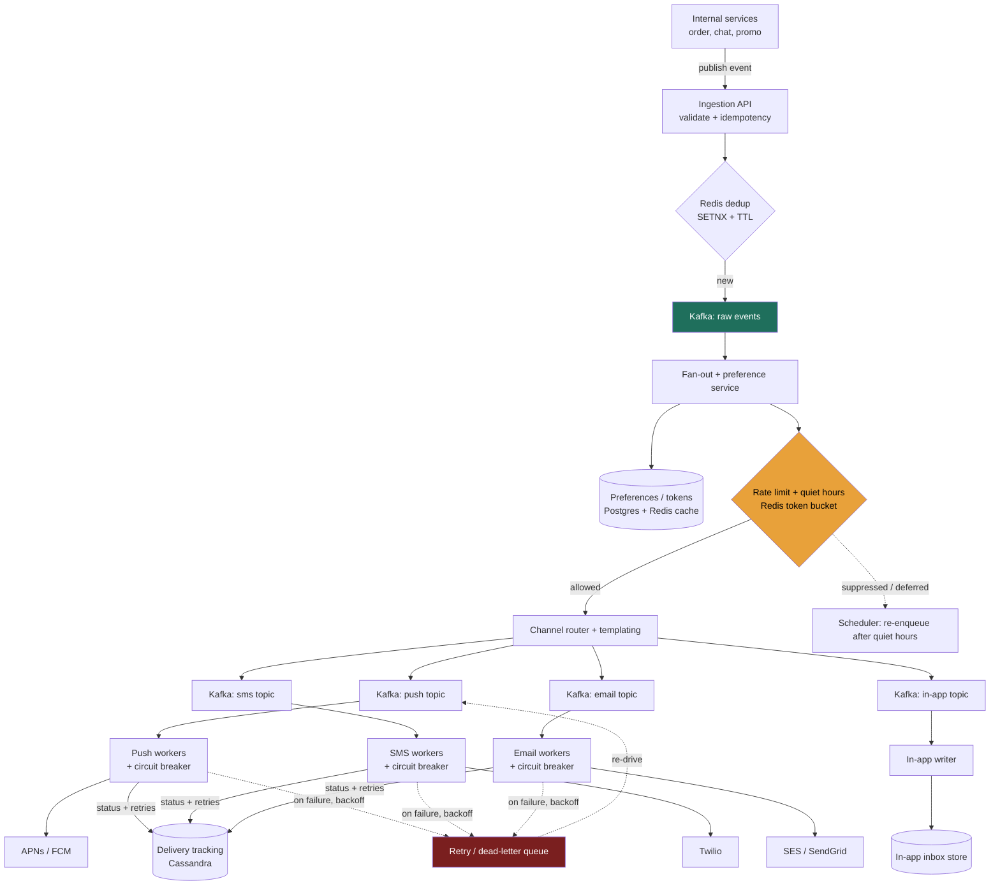

### Learning objectives
- Run the full **RESHADED** spine on a **write- and fan-out-dominated** problem — the mirror image of read-heavy systems like typeahead or feeds.
- Justify a **queue-decoupled, per-channel worker pipeline** as the answer to "delivery depends on third-party gateways I do not control and cannot trust to be up."
- Reason about the central trade — **at-least-once delivery with idempotent dedup, never exactly-once** — and the retry/backoff/circuit-breaker machinery that follows from it.
- Diagnose and fix the signature failure of this design: a **flaky gateway** (APNs/Twilio) stalling or melting the pipeline, plus a **campaign blast** as a self-inflicted thundering herd.
- Operate at Director altitude: name the **SMS cost lever** (~$82M/year), tie every choice to a requirement, quantify it, name the rejected alternative, and say where you would delegate the deep-dive.

### Intuition first
A notification system is not a database problem; it is a **mailroom for a giant company**. A single instruction comes in from one department — "tell everyone whose order shipped" — and the mailroom must explode that one instruction into **millions of individual envelopes**, each addressed to a specific person on a specific channel (push, SMS, email, in-app), each respecting that person's stated preferences ("no marketing", "don't disturb me at night"), each stamped and handed to an **outside courier** the mailroom does not own and cannot control. The couriers — Apple's push service, Twilio for SMS, a mail provider for email — are **flaky**: one is slow today, one is down for ten minutes, one silently drops 2% of envelopes. The mailroom's entire job is to be a **reliable buffer between one bursty internal instruction and many unreliable external couriers**: accept the instruction instantly, fan it out, hold envelopes in trays (queues) when a courier is jammed, **retry** the ones that bounce without re-sending the ones that already went, and keep a **delivery log** so anyone can ask "did Jane get it?". Everything hard in this problem — the queue, the per-channel worker pools, dedup, retries-with-backoff, circuit breakers, quiet-hours — is a consequence of that one shape: **bursty fan-out in, unreliable third parties out, and a promise of "we delivered it (at least once)" in the middle.**

---

## R - Requirements

RESHADED step 1. Pin the scope before building, and establish the skew that drives every later decision.

**Functional (the defensible core):**
- **Ingest** a notification request from internal services (order shipped, message received, promo) via an API or an event on a bus.
- **Fan out** one logical event to the right set of recipients, and for each recipient to the right **channels**: **push, SMS, email, in-app**.
- **Templating** — render a channel-appropriate body from a template id + variables (localized).
- **User preferences & quiet-hours** — honor per-user, per-channel, per-category opt-in/opt-out and a do-not-disturb window.
- **Rate-limiting / throttling** — cap how many notifications a user gets per window (anti-spam) and cap our own send rate into each gateway.
- **Dedup** — the same logical notification must not be delivered twice (idempotency).
- **Prioritization** — a 2FA/OTP code must not queue behind a marketing blast.
- **Retries with backoff** to flaky third-party gateways, and **delivery tracking** (sent → delivered → opened/clicked → failed).

**Cut from scope (state it out loud — scoping is the signal):**
- **Building the gateways themselves** (an SMTP server, a push-notification protocol stack). We **integrate** APNs/FCM, Twilio, SES — we do not reimplement them. Naming this boundary is the whole point of the design.
- **The notification *content* / ML targeting** (who should get a promo, send-time optimization). That is a separate recommendation system; we accept a recipient list.
- **In-app inbox UI / real-time websocket push** to an open client — that is the feed/WebSocket problem (Lesson 5.5/5.6 territory); we persist the in-app notification and expose a fetch API, and leave live delivery to that layer.
- **Hard, synchronous "exactly-once" delivery.** Explicitly traded away (see below) — it is impossible across third parties.

**Non-functional (these are the problem):**
- **Reliability / durability:** an **accepted** notification is **never silently lost** — at-least-once delivery, durable buffering, retries. This is the hard constraint.
- **Latency:** **tiered.** Transactional (OTP, "your driver is here") want **end-to-end seconds** (p99 < ~5 s). Marketing/digest are **best-effort minutes** — and may be *deliberately delayed* (quiet-hours, batching). So there is **no single latency SLO** — priority class sets it.
- **Throughput & burst tolerance:** must absorb **bursty** load — a campaign or a "your team scored" event can 10–100× the steady rate in seconds without dropping or melting.
- **Availability:** ~99.9% for ingestion (accepting work must almost never fail); delivery is **eventually** completed, gated by gateway uptime we don't own.
- **Cost:** a first-class NFR. SMS is **~$0.0075/message**; at our scale that is the **single largest line item** (computed in E). Directors own this number.

**Read:write skew — the headline, and it is the *inverse* of most problems.** This is **write- and fan-out-dominated**. There is essentially **no high-QPS read path** on the hot path — the "reads" are config lookups (preferences, templates) that we **cache to near-zero cost**, and an occasional "show me my in-app inbox" / "what's the status of notification X". The dominant flow is **write → fan-out → deliver → record**. Where typeahead was ~500:1 *reads*, this is effectively a **write/fan-out pipeline**: one ingested event can become **thousands of individual sends**, each itself a write (enqueue) plus an external call plus a status write. That single fact — *amplifying writes, not serving reads* — licenses the queue-first, worker-pool, throughput-oriented architecture and makes "throughput + reliability under unreliable downstreams," not "read latency," the spine of the design.

**Scale assumption to anchor estimation:** model a large consumer app — **500M registered users, 100M DAU** (Uber / DoorDash / a large social app tier). We will size for **~1B notifications/day** across all channels and verify the channel mix, the burst, and — critically — the **cost** fall out of it.

---

## E - Estimation

RESHADED step 2. Enough math to make a defensible call. Round hard; state every assumption.

**Assumption:** ~**10 notifications/active-user/day** across all channels (txn + social + marketing). 100M DAU × 10 = **1B notifications/day**.

**Throughput (the numbers that size the pipeline):**
- 1e9 / 86,400 s ≈ **~12k notifications/s average**.
- Notification traffic is **far burstier than request traffic** — time-of-day, scheduled campaigns, and event-driven blasts ("your team scored" to millions). Model **steady peak ≈ 5× avg = ~60k/s**, and call out **blast bursts separately**: a single broadcast of **5M subscribers in 60 s = ~83k/s from one event alone**, stacked on top. The design must **buffer**, not match, these spikes — which is *why* there is a queue.

**Per-channel mix (drives both worker sizing and cost):** assume in-app 50%, push 35%, email 12%, SMS 3%.

| Channel | Share | Per day | Avg/s | Cost driver |
|---|---|---|---|---|
| In-app | 50% | 500M | ~6k/s | our storage only (free egress) |
| Push (APNs/FCM) | 35% | 350M | ~4k/s | **free** gateway |
| Email (SES) | 12% | 120M | ~1.4k/s | cheap (~$0.10/1k) |
| SMS (Twilio) | 3% | 30M | ~350/s | **expensive — dominates cost** |

**Cost — the headline a Director leads with (RULE 1):**
- **SMS:** 30M/day × **$0.0075** = **$225k/day ≈ $82M/year**. The smallest channel by volume (3%) is **by far the largest by cost.** This single fact reshapes priorities: we aggressively gate SMS behind preferences, prefer push/email where possible, and treat "downgrade SMS → push when the device is reachable" as a real cost lever.
- **Email:** 120M/day × $0.10/1k ≈ **$12k/day ≈ $4.4M/year** — an order of magnitude cheaper than SMS at 4× the volume.
- **Push:** free (APNs/FCM charge nothing) — but rate-limited by Apple/Google, so it's a **throughput** constraint, not a cost one.
- **The framing:** 97% of volume (in-app + push + email) costs ~$4.4M/yr; the 3% that is SMS costs ~$82M/yr. **Cost is not proportional to volume — it is concentrated in one channel**, and that is the most important number in the room.

**Storage (delivery tracking — what must persist):**
- Per delivery record ≈ **300 bytes** (id, user, channel, template id, status, timestamps, gateway message id, error).
- 1e9/day × 300 B = **~300 GB/day**.
- Retain **30 days hot** for support/debugging/analytics → 300 GB × 30 ≈ **~9 TB hot**; older → cheap cold object storage. Modest and append-shaped.

**Preferences store (small, hot, cacheable):**
- 500M users × ~500 B of preferences/quiet-hours/device-tokens ≈ **~250 GB**. Read on **every** fan-out — so it **must be cached** (see S/E steps), not hit on the DB per send.

**Bandwidth:**
- Ingest payload ≈ ~1 KB/event. 12k/s × 1 KB ≈ **~12 MB/s average** internal ingest — trivial. The byte volumes are small; **the hard part is the *fan-out multiplier* and the *external call rate*, not bytes.**

**Worker / instance count (sized by *blocking external calls*, not CPU):**
- The binding resource is **concurrency against slow gateways.** A gateway call (push/SMS/email) takes ~**100–300 ms**. At 60k/s peak with ~200 ms/call, in-flight sends = 60,000 × 0.2 = **~12,000 concurrent calls**.
- With **async I/O** a worker holds ~**500 concurrent** in-flight calls → ~12,000 / 500 = **~24 workers**; with headroom + per-channel isolation, call it **~60–80 sender workers** across pools.
- **The rejected-alternative framing (RULE 2 + RULE 1):** *synchronous, thread-per-send* workers (one blocked thread per in-flight call) would need ~12,000 threads → with ~1k threads/box, **~12+ heavyweight boxes** across the per-channel sender pools, and the moment a gateway slows to 2 s/call the thread pool exhausts and **ingestion backs up**. Async I/O + a **buffering queue** lets ~a dozen-to-scores of workers absorb the same load and **decouple ingestion from delivery** so a slow courier never blocks the front door. That decoupling is the reason the queue exists.

---

## S - Storage

RESHADED step 3. What must persist, matched to access pattern, with real systems named. There are **four distinct storage roles** here — do not conflate them.

**Role 1 — the buffer / pipeline backbone (the load-bearing choice).**
- **Need:** durably absorb a bursty ~60k/s (spiking to ~150k/s under blasts) of fan-out work, **decoupling** ingestion from delivery; replay on worker crash; per-priority and per-channel separation; high sustained throughput.
- **Choice:** a **distributed log — Kafka** (or Pulsar). Producers (ingestion + fan-out) append; consumer groups of channel workers pull at their own pace; **partitions** give parallelism and ordering-within-key; **retention** gives replay if a worker dies mid-batch. Separate **topics per priority class** (`txn`, `marketing`) so OTPs never queue behind a campaign.
- **Rejected — a simpler managed queue (AWS SQS):** genuinely attractive (no brokers to run, auto-scales, dead-letter queues built in) and a perfectly good answer for **lower scale**. We reject it as the *primary* backbone at this scale because we want **replayable, ordered, high-throughput-per-partition** streams and the ability to have **many consumer groups** read the same stream (analytics + delivery) — Kafka's log model fits fan-out pipelines better, and per-message cost favors Kafka at billions/day. **Trade-off named:** Kafka is **operationally heavier** (you run/patch a cluster) — a real cost we accept for throughput, replay, and multi-consumer fan-out. (At a tenth the scale, I'd start on SQS/SNS and not apologize.)
- **Rejected — send synchronously, no queue at all:** couples ingestion to gateway uptime; one slow courier stalls the API. Non-starter given the reliability NFR.

**Role 2 — user preferences, quiet-hours, device tokens (config, read on every fan-out).**
- **Need:** point-lookup "for user U, which channels/categories are opted-in, what is their quiet-hours window, what are their device tokens?" — read **once per recipient per event**, so at fan-out rates of **thousands/s**.
- **Choice:** source of truth in **Postgres / DynamoDB** (small, structured, ~250 GB), fronted by a **Redis cache** that absorbs the read storm. Preferences change rarely and are read constantly → a textbook cache-aside case. **Rejected — read Postgres directly on every fan-out:** thousands of point reads/s on a blast would hammer the primary; the cache turns a DB problem into a memory lookup. **Rejected — embed preferences in the event payload:** keeps them stale and bloats every message; preferences are user-owned mutable state, not event data.

**Role 3 — delivery tracking / status (what must persist for "did Jane get it?").**
- **Need:** ~300 GB/day, append-heavy, status-updated a few times per record (queued→sent→delivered→opened/failed), queried by support (by user/notification id) and analytics (aggregate delivery rates), 30-day hot.
- **Choice:** a **wide-column / write-optimized store — Cassandra** (or DynamoDB / Bigtable). Append-and-update-heavy, time-partitioned, no joins, point + small-range reads → an LSM store's sweet spot (recall Lesson 2.3). **Rejected — Postgres:** the write/update volume (1B+ status writes/day) and the pure scan/point-read access pattern don't need OLTP transactions and would cost far more per TB; we use a relational store only for the *small* config data, not the *firehose* of status. **Rejected — Elasticsearch as primary:** great for the ad-hoc "search all failed SMS yesterday" query, but expensive and not a system-of-record; we'd **mirror** status into ES for ops search, not store it there authoritatively.

**Role 4 — dedup / idempotency keys (short-lived, hot).**
- **Need:** "have I already accepted/sent this exact (notification id, user, channel)?" — checked on the hot path, only needs to remember recent keys (a dedup window of minutes-to-hours).
- **Choice:** **Redis** with `SETNX` + TTL (or a Bloom filter for scale). O(1), in-memory, auto-expiring. **Rejected — a unique constraint in the tracking DB:** works but adds a synchronous DB round-trip on the hot path and couples dedup to the slower store; Redis keeps dedup at memory speed and self-cleaning via TTL.

---

## H - High-level design

RESHADED step 4. Components first, then the happy path in prose.



**Happy path (ingest → deliver):** an internal service (say *orders*) publishes `order_shipped(user=123, order=A9)` to the **Ingestion API**. Ingestion validates the request and computes an **idempotency key**; a `SETNX` against **Redis** confirms this exact notification hasn't been accepted already (dedup), then appends it to the **`raw events` Kafka topic** and immediately returns `202 Accepted` — the front door is decoupled from everything downstream. The **fan-out + preference service** consumes the event, resolves the recipient(s) and, for each, reads **preferences + device tokens** (from **Redis**, backed by Postgres): user 123 wants push + email for shipping, has opted out of SMS, and is inside quiet-hours until 8am. The **rate-limiter** (Redis token bucket) confirms the user is under their per-window cap; **quiet-hours** logic sees a non-urgent notification at night and **hands it to the scheduler to re-enqueue at 8am** rather than dropping it. The **channel router + templating** renders the channel-specific body from the template id + variables and emits one message onto each **per-channel Kafka topic** (`push`, `email`). **Per-channel worker pools** consume their topic, each guarded by a **circuit breaker**, and call the external gateway (**APNs/FCM** for push, **SES** for email). On success they write a `sent`/`delivered` row to **Cassandra** (delivery tracking). On a transient failure (gateway 5xx/timeout) they **retry with exponential backoff** via the **retry queue**, and after N attempts move the message to a **dead-letter queue** for inspection. The in-app copy is written straight to the **inbox store** for the client to fetch.

**Why each box earns its place:** the **two-stage queue** (raw events → per-channel topics) is what lets fan-out (1 event → many sends) happen asynchronously and lets a **slow SMS gateway** back-pressure *only the SMS topic* without touching push, email, or ingestion. The **circuit breaker per channel** stops a dead gateway from consuming all retry capacity. The **scheduler** is what makes quiet-hours and scheduled campaigns first-class instead of dropped work.

---

## A - API design

RESHADED step 5. The interface is small — one ingest endpoint carries essentially all write traffic; the rest are config and status.

**Ingest (the hot path — internal, called by other services):**
```
POST /v1/notifications
  body: {
    "idempotency_key": "order-A9-shipped-u123",   // REQUIRED — dedup
    "recipients":  ["user:123"],                   // or "topic:team-42" for broadcast
    "category":    "order_update",                 // maps to user opt-in + priority
    "priority":    "transactional",                // transactional | marketing
    "template_id": "shipping_v3",
    "variables":   { "order": "A9", "eta": "Tue" },
    "channels":    ["push","email","sms"],         // preference order; system filters
    "ttl_seconds": 86400                           // don't deliver if stale
  }
  -> 202 Accepted { "notification_id": "ntf_8f2..." }   // accepted, not yet delivered
```
- Returns **202 (accepted), not 200 (delivered)** — the API's contract is "I durably took responsibility," not "it arrived." That honesty is the design. **Rejected — a synchronous send that returns delivery status:** would couple the caller to gateway latency/uptime and defeat the buffering; non-starter.
- `idempotency_key` is **required** — the caller, not us, knows when two requests are "the same notification"; this is how we make retries safe end-to-end.
- `priority` selects the **topic / SLO class**; `ttl_seconds` lets us **drop stale work** ("driver arrived" is useless an hour late) instead of delivering it.

**Status & tracking (low-QPS reads):**
```
GET  /v1/notifications/{id}          -> { status, per_channel: [{channel, state, ts}] }
GET  /v1/users/{id}/inbox?cursor=…   -> in-app inbox page
```

**Preferences (user-facing, rare writes):**
```
GET  /v1/users/{id}/preferences
PUT  /v1/users/{id}/preferences
  body: { "order_update": {"push":true,"sms":false},
          "marketing":    {"push":false,"email":true},
          "quiet_hours":  {"start":"22:00","end":"08:00","tz":"Asia/Dubai"} }
POST /v1/users/{id}/devices  { "platform":"ios", "token":"…" }   # register push token
```

**Admin / safety (Director-grade):**
```
POST /v1/campaigns        { template_id, audience_query, schedule_at, rate_cap }  # throttled blast
POST /v1/channels/{c}/pause                                                       # kill switch
```
A **per-channel kill switch** and a campaign **rate cap** are operational must-haves: when a gateway is on fire or a bad campaign is going out, you need to stop the bleeding *now*, ahead of any code change.

---

## D - Data model

RESHADED step 6. Schema, keys, indexes, and — the decisions that matter — the **partition keys**.

**Preferences (Postgres source of truth; Redis cache).** Partition/lookup key: **`user_id`**.
```
user_preferences {
  user_id (PK), category, push_enabled, sms_enabled, email_enabled, inapp_enabled,
  quiet_start, quiet_end, timezone, updated_at
}
user_devices { user_id (PK), platform, push_token, last_seen, active }
```
Read by **`user_id`** on every fan-out → cache-aside in Redis; invalidate on `PUT`.

**Delivery tracking (Cassandra) — the firehose.** This is where the **partition key choice matters.**
```
notification_status {
  user_id          // partition key  -> all of a user's notifications co-located
  notification_id  // clustering key (time-ordered)
  channel, state, template_id, gateway_msg_id, error, created_at, updated_at
}
```
- **Chosen partition key: `user_id`.** The dominant query is **support/inbox: "show notifications for this user"**, which becomes a single-partition read. Status updates for a notification also land in that user's partition. **Trade-off named:** a single very-high-volume user (a system account, or a power user) could create a **hot partition / wide row**. *Mitigation:* bucket extreme partitions by `(user_id, month)` and keep per-partition rows bounded with TTL.
- **Rejected — partition by `notification_id`:** perfectly uniform load (it's a UUID) and great for the point lookup "status of notification X", but it **scatters a user's notifications across the ring**, making the common "this user's recent notifications" query a cross-partition scatter-gather. We optimize for the **frequent** query (per-user) and accept that "by notification id" needs a secondary lookup. **Rejected — partition by `(channel, day)`:** good for analytics ("all SMS today") but melts into a hot partition for the busy channel and is wrong for per-user reads; we serve analytics by **streaming status into a warehouse/ES** instead of shaping the primary table around it.

**Idempotency / dedup (Redis).** Key: **`idempotency_key` (or a hash of it)** → `SETNX` with a TTL equal to the dedup window. The key *is* the shard key (Redis hashes it across the cluster). Bounded to recent keys by TTL, so memory stays flat.

**Rate-limit counters (Redis).** Key: **`(user_id, window)`** for per-user anti-spam caps, and **`(gateway, window)`** for our outbound rate into each provider. Token-bucket via `INCR`/Lua. Co-located by key hash; naturally sharded.

**Where data lives, in one line:** config (preferences/devices) in **Postgres + Redis**, the work-in-flight in **Kafka**, dedup/rate state in **Redis**, the durable delivery log in **Cassandra**, analytics mirror in a **warehouse / Elasticsearch**.

---

## E - Evaluation

RESHADED step 7. Stress the design against the NFRs, find the bottlenecks, and **fix each — naming the trade-off the fix makes**.

**Re-check vs reliability (the hard NFR).** Once a notification is `202 Accepted` and on the `raw events` topic, it is **durable** (Kafka replication) and **replayable** — a worker crash mid-send re-processes from the last committed offset. Combined with **at-least-once** delivery and **idempotent dedup**, an accepted notification is never silently lost. The cost we paid for this is acknowledged below in "exactly-once."

**Bottleneck 1 — A flaky / slow third-party gateway (the signature failure).** Twilio starts timing out or 500ing. Without protection, SMS workers block on slow calls, retries pile up, the SMS topic backs up, and — if pools or retry capacity are shared — push/email starve too. *Fix:* (a) a **circuit breaker per gateway** — after an error-rate threshold, trip open and **fast-fail** (stop hammering a dead courier), then half-open to probe recovery; *trade-off:* while open, SMS is delayed (buffered in Kafka), which we accept because the alternative is a cascading stall. (b) **Isolated worker pools + topics per channel** so a melting SMS gateway **cannot** consume push/email capacity; *trade-off:* more pools to run and size. (c) **Exponential backoff with jitter** on retries so we don't synchronize a retry storm; *trade-off:* failed messages take longer to deliver, bounded by `ttl_seconds` after which we drop them. The combination means one dead courier degrades **only its channel**, gracefully, while Kafka holds the work until it recovers.

**Bottleneck 2 — Campaign blast / thundering herd (self-inflicted).** A marketing push to 50M users, or a "your team scored" broadcast, spikes to ~100k+/s and can (a) overrun a gateway's own rate limit (APNs/FCM throttle us) and (b) bury transactional traffic. *Fix:* (a) **separate priority topics** — `txn` consumers are never blocked by the `marketing` topic, so an OTP still goes out in seconds during a blast; *trade-off:* marketing is intentionally slower under load (acceptable per R). (b) **Outbound rate-limiting per gateway** (Redis token bucket keyed by gateway) so we feed each provider at/under its allowed rate and **let Kafka absorb the backlog**; *trade-off:* a 50M blast takes minutes to fully drain — by design, "buffer don't match." (c) **Campaign rate cap** at submission time. The blast becomes a controlled drain, not a flood that trips every gateway's throttle and self-DDoSes us.

**Bottleneck 3 — Preference-read storm on the DB.** Every fan-out reads preferences + tokens; a blast = millions of reads in seconds. *Fix:* **Redis cache** in front of Postgres (preferences change rarely, read constantly → very high hit-rate); *trade-off:* a preference change has **cache-staleness** up to the TTL/invalidation lag — bounded and acceptable (a user who just toggled off marketing might get one more for a few seconds). *Rejected* hitting Postgres per send (would topple the primary on a blast).

**Bottleneck 4 — Duplicate delivery (the exactly-once trap).** At-least-once + retries means we *will* occasionally attempt the same send twice (e.g., a worker sent, then crashed before committing the offset). *Fix:* **idempotency dedup at two layers** — at ingest (`SETNX` on the caller's key) and at the worker (check "did I already get a gateway message-id for this (notification, channel)?" before re-sending). *Trade-off:* dedup is **best-effort within a window**, not a global guarantee, and many gateways are themselves at-least-once — so we **minimize**, not eliminate, dupes. **We explicitly do not promise exactly-once**, because true exactly-once across a third party we don't control is **impossible**; we promise at-least-once + aggressive dedup, which is the honest and standard answer.

**Bottleneck 5 — Tracking-store hot partition / write amplification.** 1B+ status writes/day, and a system/power-user partition can go wide. *Fix:* Cassandra (LSM) absorbs the append/update volume; **bucket** extreme partitions by `(user_id, month)`; **TTL** old rows out of the hot table; stream a copy to a **warehouse/ES** for analytics so we never run heavy aggregate scans against the serving table. *Trade-off:* more pipelines (CDC → warehouse) and eventual-consistency on analytics — fine, analytics tolerates lag.

**Bottleneck 6 — Quiet-hours / timezone correctness.** A naïve "don't send 22:00–08:00 UTC" wrongs everyone outside UTC. *Fix:* store the user's **timezone** and evaluate quiet-hours **in their local time**; defer (re-enqueue via scheduler), don't drop, non-urgent notifications that land in the window. *Trade-off:* a scheduler + per-user tz math, and a decision rule for "urgent overrides quiet-hours" (OTP ignores DND; promo respects it) — a product call we encode explicitly.

---

## D - Design evolution

RESHADED step 8. How it holds at 10×, the hardest trade-offs, what to revisit, and where to delegate.

**At 10× (10B notifications/day → ~120k/s avg, blasts into the millions/s):**
- **Kafka scales horizontally** by adding partitions/brokers per topic; channel worker pools scale independently — the **decoupled, partitioned pipeline is the thing that makes 10× a capacity-add, not a redesign.** This is the architecture paying off.
- **SMS cost goes to ~$820M/year** at 10×. That is no longer a line item — it's a **strategy problem.** I'd push hard on **channel downgrade** (deliver via push when the device is reachable, fall back to SMS only when it isn't), **per-user SMS budgets**, and **negotiated carrier/aggregator rates** — the cost lever dwarfs the infra cost and is where a Director actually spends attention.
- **Gateway throughput becomes the ceiling**, not our compute. APNs/FCM/Twilio rate-limit us; at 10× we'd shard across **multiple provider accounts / regions**, add **secondary providers per channel** (failover from Twilio→a backup SMS provider when the circuit trips), and treat provider capacity as a managed quota.

**Hardest trade-offs (the ones an interviewer will push on):**
- **At-least-once + dedup vs exactly-once.** The honest position: exactly-once across third parties is impossible; we choose at-least-once and minimize duplicates. The residual is occasional dupes — acceptable for most notifications, *not* for, say, a "you were charged" alert, which needs extra idempotency at the *content* layer.
- **Buffer vs match on bursts.** We deliberately **buffer** (Kafka holds the backlog; blasts drain over minutes) rather than provision to **match** peak. This trades **delivery latency under load** for **massive cost savings and stability** — and is only acceptable because we've **classed priority** so urgent traffic isn't the stuff being buffered.
- **Per-channel isolation cost.** Separate topics, pools, breakers, and provider accounts per channel add operational surface; we pay it to guarantee a flaky courier degrades one channel, not all four.

**What I'd revisit:**
- **Smart send-time / channel selection** (cut from v1): an ML layer that picks the cheapest effective channel and the best moment — directly attacks the SMS cost and engagement at once.
- **Real-time in-app delivery** to open clients (websocket/SSE), bridging this pipeline to the connection-management problem of Lesson 5.5/5.6.
- **Exactly-once-ish for money-sensitive notifications** via a stronger idempotency/outbox pattern on the producing service.

**Where I'd delegate (the Director move):**
- "I'd have the **messaging-infra team benchmark Kafka vs Pulsar** for our fan-out + multi-consumer pattern and report the per-message cost and operational burden at 10B/day. My prior is Kafka for maturity, but I want the cost/ops trade defended with data, not my preference."
- "I'd have the **payments/finance partner own the carrier-rate negotiation and the SMS-budget policy** — the ~$82M (→$820M) SMS spend is a business lever I set the *target* for and delegate the *mechanism*."
- "I'd task **SRE with the circuit-breaker thresholds and the multi-provider failover** under a simulated gateway outage, and defend the delivery-SLO with the data — I own the SLO, they own the knob."
- "The **dedup-window sizing and the tracking-store partition/bucketing** at 10× is a focused study for the data-platform team; I set the dedup correctness bar and the 30-day retention SLO, they choose the layout."

That division — **own the SLOs, the reliability bar, the cost envelope, and the priority classes; delegate the broker benchmark, the carrier negotiation, the breaker tuning, and the storage layout** — is the altitude this round is scoring.

---

## Trade-offs table — the pivotal decisions

| Decision | Option A | Option B | Option C | Use when… |
|---|---|---|---|---|
| **Pipeline backbone** | **Synchronous send** (no queue) — simplest, but couples ingest to gateway uptime | **Managed queue (SQS/SNS)** — no ops, DLQ built-in, auto-scales | **Distributed log (Kafka/Pulsar)** — replay, ordering-per-partition, multi-consumer fan-out | A: never at scale; **B: low/mid scale, ops-light**; **C (chosen): billions/day, fan-out, replay** |
| **Delivery guarantee** | **At-most-once** (fire-and-forget) — no dupes, but drops on failure | **Exactly-once** — ideal but **impossible** across third parties | **At-least-once + idempotent dedup** — never lose, minimize dupes | A: pure best-effort telemetry; B: unattainable here; **C (chosen): the honest standard** |
| **Burst handling** | **Provision to match peak** — lowest latency, huge cost | **Buffer in queue + priority classes** — bounded latency, cheap, stable | **Drop overflow** — protects system, loses notifications | A: hard real-time only; **B (chosen): notifications tolerate seconds-minutes**; C: only the lowest-priority spillover |
| **Tracking partition key** | **`notification_id`** — uniform, point lookup, but scatters per-user reads | **`user_id`** — per-user/inbox reads are single-partition; hot-row risk | **`(channel, day)`** — analytics-shaped; hot partition on busy channel | A: status-by-id dominates; **B (chosen): per-user reads dominate**; C: serve analytics from a warehouse instead |

---

## What interviewers probe here

At Director altitude the probes are about **judgment, cost, and delegation**, not whether you can integrate APNs.

- **"Walk me through what happens when a gateway (say Twilio) goes down for 10 minutes."**
  *Strong signal:* the SMS topic **buffers in Kafka**, the **circuit breaker trips** so workers fast-fail instead of stalling, **isolated pools** mean push/email/in-app are untouched, and on recovery we **drain the backlog with backoff** — bounded by `ttl_seconds`. Names that **ingestion never blocks**. *Red flag:* "we retry" with no mention of decoupling, isolation, circuit breaking, or what happens to *other* channels; or assuming the gateway is reliable.
- **"Exactly-once or at-least-once? Defend it."**
  *Strong:* "**At-least-once + idempotent dedup.** Exactly-once across a third party we don't control is impossible, and many gateways are themselves at-least-once. We dedup at ingest (idempotency key) and at the worker, minimizing dupes, and add content-level idempotency for money-sensitive alerts." *Red flag:* claiming exactly-once with a straight face, or at-most-once for transactional notifications.
- **"What does this cost, and where?"**
  *Strong:* leads with **SMS ≈ $82M/yr (3% of volume, the dominant line item)**, contrasts ~$4.4M/yr email, notes push is free-but-rate-limited, and proposes **channel downgrade + SMS budgets** as the lever. *Red flag:* sizing compute and ignoring that the gateway bill dwarfs it; "it scales" with no dollar figure.
- **"A marketing blast and an OTP are in the system at the same time. Guarantee the OTP goes out fast."**
  *Strong:* **separate priority topics/consumers**, outbound rate-limit on the blast, OTP path never shares a queue with marketing. *Red flag:* one FIFO queue for everything — the OTP queues behind 50M promos.
- **Delegation:** *Strong:* "I own the delivery SLO, the priority classes, and the SMS cost target; I delegate the Kafka-vs-Pulsar benchmark, the breaker thresholds, the carrier-rate negotiation, and the partition layout — each with a stated prior." *Red flag:* either hand-waving the hard parts to "the team" with no opinion, or rat-holing into APNs payload-format minutiae with no decision.

---

## Common mistakes

- **Designing it as a read/database problem.** It's a **write/fan-out pipeline**; the hard parts are throughput, decoupling, and unreliable downstreams — not read latency. There is no high-QPS read path.
- **No queue / synchronous delivery.** Couples ingestion to gateway uptime; one slow courier stalls the front door. The buffering queue *is* the design.
- **Promising exactly-once.** It's impossible across third parties; the right answer is at-least-once + dedup. Claiming exactly-once signals a gap.
- **One queue for all priorities.** The OTP queues behind the marketing blast. Priority classes (separate topics) are mandatory.
- **No circuit breaker / shared worker pools.** A dead gateway then consumes all retry capacity and starves healthy channels.
- **Ignoring cost — especially SMS.** The smallest channel by volume is the largest by far in dollars; not naming the ~$82M lever (and channel-downgrade mitigation) misses the Director-altitude point.
- **Quiet-hours in UTC.** Must be the user's local timezone; and quiet-hours should **defer** (re-enqueue), not **drop**, non-urgent sends.
- **Matching peak instead of buffering.** Over-provisions massively; the queue exists precisely so you buffer bursts and drain them.

---

## Interviewer follow-up questions (with model answers)

**Q1. How do you stop a duplicate notification when your pipeline is at-least-once and retries?**
> *Model:* Two layers. At **ingest**, the caller supplies an `idempotency_key` and I `SETNX` it in Redis with a TTL equal to my dedup window — a replayed request is a no-op. At the **worker**, before re-sending after a crash/retry I check whether I already have a `gateway_msg_id` recorded for that `(notification_id, channel)` in the tracking store, so a "sent-but-didn't-commit-offset" case doesn't re-send. This **minimizes** dupes within a window; it is not a global exactly-once guarantee, because the gateways themselves are often at-least-once. For money-sensitive notifications ("you were charged"), I push idempotency up into the **producing** service's content so even a rare dupe is harmless. The honest framing is at-least-once + aggressive dedup.

**Q2. A campaign goes out to 50M users. Trace it, and protect the transactional traffic.**
> *Model:* The campaign is submitted with a **rate cap** and lands on the **`marketing` topic**, separate from `txn`. Fan-out resolves the 50M recipients, filters by **preferences** (many opted out of marketing — this also *saves cost*), checks **quiet-hours** (deferring night-time recipients via the scheduler), and emits per-channel messages. **Outbound rate-limiters** (Redis token bucket per gateway) feed each provider at/under its allowed rate, so the blast **drains over minutes** while Kafka holds the backlog — we **buffer, not match**. Crucially, **`txn` consumers run on their own topic/pool**, so an OTP submitted mid-blast is delivered in seconds, completely unblocked. The blast is a controlled drain; the OTP never queues behind it.

**Q3. Where is the money, and how would you cut it?**
> *Model:* **SMS dominates** — 3% of volume (~30M/day) but ~**$82M/year** at $0.0075/msg, versus ~$4.4M/yr for 4× the email volume and **$0 for push**. Levers, highest to lowest: (1) **channel downgrade** — deliver via free push when the device is reachable and registered, fall back to SMS only when it isn't; (2) **per-user SMS budgets** and tight preference/category gating so we don't SMS where push/email suffices; (3) **negotiated carrier/aggregator rates** at volume; (4) suppress SMS for low-value categories entirely. At 10× the SMS bill is ~$820M — so this is a *business strategy* lever I'd set targets for and delegate the carrier negotiation, not an infra tuning task.

**Q4. Your delivery latency spiked for push only. Diagnose.**
> *Model:* Push-specific means it's **downstream of the channel split**, so I look at the **push topic and pool**: (a) is **APNs/FCM throttling us** (we exceeded their rate) — check the outbound rate-limiter and 429s; (b) has the **push circuit breaker** tripped or is it flapping — gateway errors causing backoff; (c) is the **push consumer lag** climbing in Kafka (under-provisioned workers vs a blast); (d) a bad **device-token** cleanup issue causing futile retries. Fixes with their trades: scale push workers (more cost), tighten outbound rate to match APNs' limit (slower drain, fewer 429s), shard across **multiple provider accounts** (ops complexity), prune dead tokens (fewer wasted retries). Because channels are **isolated**, none of this touches SMS/email/in-app — which both confirms the diagnosis and contained the blast radius.

**Q5. Kafka or SQS for the backbone — when would you actually choose SQS?**
> *Model:* I'd choose **SQS/SNS** at **low-to-mid scale** (say <100M/day), or early in a product's life, where the priorities are **operational simplicity** (no brokers to run/patch), **built-in dead-letter queues**, and pay-per-use. SQS is a genuinely good answer there and I wouldn't over-engineer Kafka onto it. I move to **Kafka/Pulsar** when I need **replay** (reprocess after a bad deploy), **ordering within a partition**, **very high sustained per-partition throughput** at billions/day, and **multiple independent consumer groups** reading the same stream (delivery + analytics + audit) — which is exactly the fan-out shape at our scale, and where Kafka's per-message cost wins. The trade I'm accepting with Kafka is running the cluster; I'd delegate the final benchmark to messaging-infra with that prior.

---

### Key takeaways
- **It's a write/fan-out pipeline, not a read system** — one event explodes into thousands of per-user, per-channel sends; throughput + reliability under **unreliable third-party gateways** is the spine, not read latency.
- **A queue is the load-bearing decision** (Kafka): it **decouples** bursty ingestion from flaky delivery, buffers blasts (don't match peak), enables replay, and isolates a slow gateway to its own channel.
- **At-least-once + idempotent dedup, never exactly-once** — true exactly-once across third parties is impossible; dedup at ingest (Redis `SETNX`) and at the worker to minimize duplicates.
- **Reliability machinery is mandatory:** per-channel **circuit breakers**, **isolated worker pools + priority topics** (OTP never behind a marketing blast), **exponential backoff with jitter**, and a **dead-letter queue**.
- **Name the cost:** **SMS ≈ $82M/yr** — 3% of volume, the largest line item by far — versus free push and cheap email; channel-downgrade and SMS budgets are the lever a Director owns.

> **Spaced-repetition recap:** Notifications = a mailroom — fan one bursty internal event out to millions of envelopes, hand each to an **unreliable external courier** (APNs/Twilio/SES). A **Kafka queue** decouples ingest from delivery and **buffers** bursts; **per-channel worker pools** with **circuit breakers + backoff + DLQ** survive flaky gateways; dedup via Redis `SETNX` gives **at-least-once, not exactly-once**. **Priority topics** keep OTPs ahead of marketing. The dominant cost is **SMS (~$82M/yr at 1B/day)** — downgrade to push where you can.
