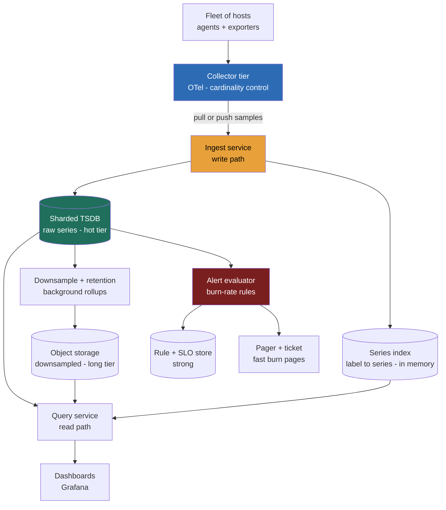

> **This gets asked because Directors own the two things this system is: the observability budget and the on-call rotation.** It's the most Director-authentic problem in the set, you are the customer of the thing you're designing. A Staff answer designs a clean ingest path and a TSDB. A Director answer treats **cardinality as the cost function of the entire system**, every label is a line item, and frames retention, downsampling, and sampling as **budget decisions with stated trade-offs**, then closes with the build-vs-buy crossover that decides whether this platform team should exist at all. This is the full-system assembly of the pillars and burn-rate alerting, plus the economics; the build-vs-buy memo is the worked example. The tell interviewers listen for: do you design for write volume, or do you design for *cardinality*, because they are not the same number.

### Learning objectives
- Run the **RESHADED** spine on a **write-heavy time-series** system whose dominant cost is not QPS but **cardinality**, and make the Estimation step the centerpiece: hosts × series/host × bytes/sample × resolution.
- Derive the **write-amplification math** out loud (a 10K-host fleet emitting at 10 s resolution is millions of samples/sec and tens of millions of active series) and show why the ingest rate and the active-series count are two different budgets.
- Treat **downsampling and retention tiers** as explicit budget decisions, raw at 10 s for days, rolled up to 1-minute and 1-hour for months and years, each stated as a trade-off, not a default.
- Decide **push vs pull at fleet scale** as an operational call, and place the **alerting/query path** as a separate read system from the ingest firehose.
- Own the **build-vs-buy crossover**: when the Datadog bill durably clears ~2× the loaded cost of the platform team that would replace it, make this the closing Director move, with a written trigger.

### Intuition first
A metrics platform is a **utility company's smart-meter grid**, and the trap is thinking the hard part is the electricity.

Every house (host) has a few hundred meters (series), each sending a reading (sample) every few seconds. With ten thousand houses you aren't reading "a lot of power", you're reading **millions of meters, ticking forever**. The cost of the grid isn't the wattage; it's the **number of distinct meters you've agreed to read and remember**. And a utility goes bankrupt not from a heat wave but from a billing bug that registers a *new meter per kilowatt-hour*, a thousand houses become a billion meters overnight. That is **cardinality explosion**: someone adds a `user_id` label and your meter count jumps from tens of millions to tens of billions in an afternoon, OOMing storage *and*, if a vendor bills per meter, detonating the invoice.

So the design splits cleanly. The **readings flowing in** are an append-only firehose, write-optimized, compressed hard, never updated. The **questions asked of them** are a separate, read-optimized system, because you can't serve dashboards off the raw firehose any more than a utility reads ten million live meters to answer one billing question, you **pre-aggregate** (downsample) and **forget old detail on a schedule** (retention tiers). Hold the picture: a compressed write firehose, a separate query/alert layer on pre-rolled aggregates, and one number, **cardinality**, governing the cost of all of it.

That asymmetry inverts the read-heavy, cache-everything social-feed problems: here the writes are the hard part, and cost is counted in *series*, not requests.

---

## R: Requirements

> Pin down what the platform ingests and serves, cut scope to a defensible core, and state the load-bearing fact out loud: this is a **write-heavy time-series** system whose cost is **cardinality**, not request rate.

**Clarifying questions I'd ask (with assumed answers):**
- *Metrics only, or all three pillars?* → **Metrics is the design driver** (the write-heavy TSDB). Logs and traces are sibling systems with their own cost models, volume and sampling; I scope to metrics.
- *Fleet size and emission rate?* → **~10,000 hosts × ~1,000 series at 10-second resolution**, the numbers that set the whole design.
- *Self-serve platform, or one team's monitoring?* → **A multi-tenant platform**, which is exactly why cardinality governance is a *platform* problem, not a per-team one.
- *Retention?* → **Raw for ~2 weeks; downsampled for 13 months** (year-over-year). The tiering is a budget decision I'll defend.
- *Latency bar?* → Ingest keeps up with the firehose with **no sample loss**; alert freshness **< a few seconds**; dashboard queries **p99 < ~2 s**.

**Functional requirements:**
1. **Ingest** metrics from a large fleet, counters, gauges, histograms.
2. **Store** time series durably with high compression.
3. **Query** for dashboards, aggregations, rate, percentiles over ranges.
4. **Alert** continuously on **SLO burn-rate** rules.
5. **Downsample and expire** by retention tier.
6. **Govern cardinality**, drop/limit high-cardinality labels at ingest.

**Explicitly CUT (scoping *is* the signal):** logs and traces as full subsystems, dashboard UI/rendering, anomaly-detection ML, synthetic monitoring, the agent's host-level collection internals, and incident-management workflow. I scope to **ingest → store → downsample → query → alert**, governed by cardinality control.

**Non-functional requirements:**
- **Write-availability above all**, losing monitoring during an incident is a compounding failure; ingest must never block the fleet. A deliberate **AP** posture for ingest.
- **Lossless ingest** at the firehose rate under load.
- **Query freshness**, alerts evaluate on data seconds old, not minutes.
- **Cost-bounded**, spend is itself an NFR, governed by cardinality and retention.
- **Multi-tenancy**, per-team cardinality limits so one team can't blow the shared budget.

**The skew, stated, and why the usual framing is a trap.** This looks like a write-heavy system (millions of samples/sec in, modest query rate out), and it is, but the *write rate* is not the cost driver. **Cardinality, the count of distinct active series, is.** Two fleets can ingest the same samples/sec and cost 100× differently if one smuggled a `user_id` label in. The architecture follows: a write-optimized firehose with cardinality enforced *at ingest*, a separate read/alert path on downsampled aggregates, and retention tiers that trade resolution for cost on a schedule.

---

## E: Estimation

> **Adaptation, said out loud:** in this problem E is the centerpiece, and it is not QPS, it's **cost-per-metric math**: hosts × series/host × bytes/sample × resolution. Two budgets fall out, the **ingest rate** (samples/sec) and the **active-series count**, and they are governed by different things. Get this section right and the rest of the design is bookkeeping.

**Assumptions:** 10,000 hosts; ~1,000 active series/host; 10-second resolution; raw retention 14 days; downsampled 13 months; raw sample compresses to **~1.5 bytes**.

**Active series (the cardinality budget, the headline):** `10,000 hosts × 1,000 = 10,000,000 active series.` Ten million series sizes memory, because each carries an in-memory index entry plus write buffer (low-KB of RAM each). **This, not samples/sec, is what makes a TSDB node fall over**, and it's the number a careless label multiplies.

**Ingest rate (the write budget):** `10M ÷ 10 s = 1,000,000 samples/sec`, sustained, forever. At ~1.5 B that's only ~1.5 MB/s of bytes, but a million append-*ops*/sec is the firehose the engine must absorb without backpressuring the fleet. Note the two budgets are different: write rate and active-series count are governed by different things.

**Raw storage (14 days):** `1M/s × 86,400 × 14 × 1.5 B ≈ 1.8 TB`, **×3 ≈ 5.4 TB** hot. Dominated by *sample count* = `series × resolution × time`, every retention lever pulls on that product.

**The downsampling win (why tiers exist):** 10-second resolution for 13 months would be `1M/s × 86,400 × 395 × 1.5 B ≈ 51 TB ×3 ≈ 150 TB`, and nobody queries year-old data at 10-second granularity. **Roll up to 1-minute after 14 days (6× fewer samples), 1-hour after 60 days (360× fewer).** The 13-month tier collapses to **single-digit TB**, a **30-360× reduction**, losing only sub-minute detail on old data, which is for trends, not forensics.

**The cardinality bomb:** add one unbounded label, `user_id`, ~1,000 distinct users seen per host, and active series jumps to `10M × 1,000 = 10 billion`, ingest to 1B/s, the index to **terabytes of RAM you don't have**. The system doesn't degrade, it dies. **This is why cardinality is the cost function and why governing it is a Director responsibility, not the on-call engineer's**.

**The SaaS framing (sets up build-vs-buy):** Datadog/New Relic bill **per custom metric = per unique series**, plus per-host. Ten million series is a **multi-million/yr** bill; a `user_id` blowup makes it nine figures overnight. **The same cardinality number that sizes our RAM sizes the vendor's invoice**, which is why the build-vs-buy crossover turns on it.

**Instance count:** ~a **handful of sharded TSDB nodes** (a single node strains in the low tens of millions of series, so shard by series); query/alert tier separate and read-sized; collector tier edge-scaled. **The spend is the active-series count and retention tiers, not raw compute.**

**What estimation decided:** active-series count (10M) *is* the cost; ingest rate (1M/s) sizes the write path; downsampling buys 30-360× on old data; an unbounded label is an extinction event; and the cardinality number is simultaneously our RAM budget and the vendor's invoice, making build-vs-buy a cardinality-economics question.

---

## S: Storage

> Three data classes with different access patterns; pick stores by what each is read for, not by fashion. The firehose and the questions asked of it are different systems.

**1. Raw + downsampled time series (write-heavy, append-only, compressed).**
- *Access pattern:* a million append-ops/sec in; range scans by `(series, time-window)` out; never an in-place update; massively compressible because consecutive samples are near-identical.
- *Choice:* a purpose-built **TSDB**, **Prometheus + a horizontally-scaled backend (Mimir/Cortex/Thanos)**, or a columnar TSDB (VictoriaMetrics, InfluxDB), sharded by series. These exploit time-series regularity to hit ~1.5 B/sample.
- *Rejected, Postgres as the TSDB:* a row per sample is 16+ bytes uncompressed with no delta-of-delta compression; it falls over an order of magnitude below the firehose rate. *Rejected, Cassandra as primary:* a wide-column store *can* hold time series, but you'd reimplement compression and downsampling on top.

**2. Series index / metadata (the cardinality map).**
- *Access pattern:* given label matchers (`{service="checkout", status="500"}`), find matching series, an inverted index over label→series. **This index is where cardinality cost concentrates** (one entry per active series); the 10M-series budget is *its* size.
- *Choice:* an **inverted index** native to the TSDB (Prometheus's postings index), held largely in memory. *Rejected, unbounded growth:* without a per-tenant cap enforced here, one team's blowup evicts everyone's working set.

**3. Alerting rules + SLO state (small, strongly-consistent).**
- *Choice:* a small **relational/KV store** for rule definitions, SLO targets, and error-budget state, tiny, but correct and durable (a lost burn-rate rule is a missed page). *Rejected, co-locating in the TSDB:* couples slow-changing config to the firehose; keep control plane and data plane separate.

**Cardinality enforcement** lives at the **ingest collector** (an OTel tier you own): drop/aggregate high-cardinality labels *before* they reach the index, the cheapest series is the one you never stored.

---

## H: High-level design

> The shape to make visible: a **write-optimized ingest firehose** (collector → sharded TSDB) feeding two separate read systems, a **query path** (dashboards) and an **alert path** (burn-rate rules), with downsampling and retention running as background tiers. The collector is the cardinality choke point.



**Happy path, compressed:** each host's agent emits ~1,000 series; the **collector tier** (one we own) is where **cardinality control** happens, dropping unbounded labels and enforcing per-tenant caps *before* anything is stored. Samples flow to the **ingest service** and the **sharded TSDB** (sharded by series), updating the **in-memory series index**. Background **downsample jobs** roll raw 10-second data into 1-minute and 1-hour aggregates and push old tiers to **object storage**, expiring per retention. Two independent reads sit on top: the **query service** serves dashboards (picking the resolution tier by range), and the **alert evaluator** runs **burn-rate rules** continuously, paging on fast burn, ticketing on slow burn. Rule/SLO state lives in a small strong store.

**The shape to notice:** the **write path and the two read paths are separate systems**. Ingest is sized for a million append-ops/sec and must never block the fleet (AP); the read paths serve dashboards and rules off downsampled tiers. Conflating them, serving dashboards off the raw firehose, is the classic failure.

---

## A: API design

> Keep to the calls the requirements demand; the ingest contract and the *cardinality limits enforced at it* are the correctness-and-cost story.

```
# --- Ingest (write firehose; pull or push) ---
# PULL model: the platform scrapes each target on an interval
GET  http://<host>:<port>/metrics            -> 200 (exposition format)
                                                # platform-initiated; failed scrape = up==0 (liveness)

# PUSH model: agent/collector sends a batch
POST /v1/ingest
  body: { samples: [ {series_id|labels, value, ts}, ... ] }
  -> 202 Accepted                              # async, never blocks the fleet
  -> 429 Too Many Requests                     # tenant over its cardinality/rate budget
  -> 200 { dropped: ["user_id"] }              # high-cardinality labels stripped at collector

# --- Query (read path; dashboards) ---
GET  /v1/query_range?expr=<promql>&start=&end=&step=
  -> 200 { series: [ {labels, points:[[ts,val],...]} ], resolution: "1m" }
                                                # resolution auto-selected by time range

# --- Alerting rules (control plane) ---
PUT  /v1/rules/{ruleId}
  body: { slo: "...", burnRate: 14.4, window: "1h", page: true }
  -> 200
GET  /v1/budget/{sloId}                        -> 200 { consumed: 0.42, remaining: "25m" }
```

**Design notes (each with its rejected alternative):**
- **Ingest is async, returns 202, never blocks.** *Rejected: synchronous, durable-before-ack ingest.* The monitoring system must never backpressure the fleet during an incident, a few seconds of buffered loss tolerance beats stalling the apps it watches. Write-availability over write-durability.
- **Cardinality limits are enforced *at the API*** (429 / dropped labels). *Rejected: accept everything, clean up later*, by "later" the index has OOMed. The limit is a hard gate, not a dashboard warning.
- **Query resolution auto-selects by range**, a 13-month query reads the 1-hour tier, not raw. *Rejected: always query raw*, scans 360× the data for a trend nobody needs at second-granularity.
- **Pull gives liveness for free** (`up==0` on a failed scrape); push is the exception for short-lived/NAT'd jobs. The API supports both, defaulting to pull.

---

## D: Data model

> The series key and the label set are the most consequential decisions, because **the label set *is* the cardinality**, the data model is the cost model.

**Series**, **metric name + sorted label set**, hashed to a `series_id`; sharded by `series_id` so 10M series spread across nodes; each a compressed stream of `(timestamp, value)` samples. **The label set is the cardinality unit:** cardinality = the product of distinct values across all labels, so the decision that matters most is *which labels are allowed*.

**Samples**, `(series_id, timestamp, value)`, delta-of-delta-compressed per series per time chunk; never updated in place.

**Rollups**, per series, per tier (10 s raw, 1 m, 1 h): a downsampled stream with `min/max/avg/count` so percentiles and rates stay queryable at coarse resolution.

<details>
<summary>Go deeper, TSDB internals: compression, chunks, and the index (IC depth, optional)</summary>

**Sample compression.** Consecutive samples in a series are near-identical: timestamps advance by a fixed scrape interval, values change little. TSDBs (Gorilla-style, as in Prometheus/InfluxDB) use **delta-of-delta on timestamps** (the *change* in the interval, usually zero → 1 bit) and **XOR on values** (store only the differing bits). A 16-byte `(int64 ts, float64 val)` sample compresses to **~1.3-2 bytes** amortized, the order-of-magnitude win that makes 1M samples/sec storable. This is *why* you use a TSDB, not a row store.

**Chunks and the head block.** Recent samples accumulate in an in-memory **head block** per series; when a chunk fills (e.g. ~120 samples) it's compressed and flushed; periodically the head is written to an immutable on-disk **block** (e.g. 2-hour blocks in Prometheus) with its own index. This append-only, immutable-block design is what gives high write throughput and cheap compaction.

**The inverted index (postings).** To resolve `{service="checkout", status="500"}` to series IDs, the TSDB keeps an **inverted index**: for each label-value pair, a posting list of matching series IDs; a query intersects posting lists. This index is in memory and is **where cardinality cost lives**, 10M series means 10M index entries plus posting lists per label value. An unbounded label explodes the *number of label values*, which explodes posting-list count and index memory. This is the mechanical reason cardinality kills.

**Sharding for scale.** A single TSDB node tops out in the low tens of millions of active series. Horizontal backends (**Mimir/Cortex/Thanos**) shard series across ingesters by hash, replicate for durability, and run a separate query layer that scatter-gathers and merges, the read/write split made physical.

</details>

**The label set is the load-bearing decision, and it cuts both ways.**
- *Why bounded labels are right:* labels are for **dimensions you'll group or filter by**, `service` (~50), `method` (~5), `status` (~10), `instance` (10K), `region` (~5). Bounded products stay tractable; index size and cost stay predictable.
- *Why one bad label is catastrophic:* a single **unbounded** label, `user_id`, `request_id`, raw URL, `email`, multiplies series by its cardinality, exploding the index into terabytes and the bill into nine figures. **Per-event identifiers belong in logs and traces, never in metric labels**.
- *Rejected: trusting teams to self-govern labels.* In a multi-tenant platform, one team's `user_id` evicts everyone's working set. Limits and label-drop rules are enforced **at the collector**, per tenant, as a hard gate, not advice.

---

## E: Evaluation

> Re-check against the NFRs and hunt the bottlenecks, fixing each while naming its trade-off.

**Re-check vs NFRs:** write-availability, async 202 ingest that never blocks the fleet; lossless-enough, buffered collectors absorb spikes; freshness, alert evaluator reads the hot tier; cost-bounded, cardinality gate + retention tiers; multi-tenancy, per-tenant series caps. Now the bottlenecks.

**Bottleneck 1, cardinality explosion (the cardinal cost risk).**
A team ships a `user_id` label; active series jumps 1,000× and the index OOMs.
*Fix:* **enforce cardinality at the collector**, drop/aggregate disallowed labels before storage, plus a **per-tenant active-series cap** (e.g. 1M/team) returning 429 when breached, isolating the blast radius to the offending tenant. *Rejected:* accept-then-alert, by the time the alert fires the index is gone. *Trade-off:* a hard cap can drop legitimately-needed series, so it's per-tenant and raisable on review, the explicit cost of multi-tenancy.

**Bottleneck 2, the write firehose saturating a TSDB node.**
A million append-ops/sec, concentrated on hot series, melts one node.
*Fix:* **shard by series across ingesters** (hash of `series_id`), replicate for durability, front with buffered collectors that batch and absorb spikes. *Trade-off:* a query spanning many series now scatter-gathers across nodes (merged at the query layer), query complexity traded for write scalability.

**Bottleneck 3, long-retention storage cost.**
13 months of 10-second raw is ~150 TB and nobody queries it at that resolution.
*Fix, **downsampling tiers as the budget mechanism**:* roll raw → 1-minute after 14 days, → 1-hour after 60 days, expire raw, cold tiers to object storage, **a 30-360× reduction** for data older than a fortnight. *Rejected:* keep everything raw "in case", pays 360× for unused resolution. *Trade-off:* you permanently lose sub-minute detail on old data, accepted because old data answers trend questions, not forensics.

**Bottleneck 4, alerting on stale or noisy data (on-call health).**
The evaluator either lags the firehose (misses a fast burn) or pages on causes and drowns on-call.
*Fixes:* (a) the alert evaluator reads the **hot tier directly** so burn-rate rules see seconds-old data; (b) **alert on SLO burn-rate symptoms, not causes**, fast burn (~14.4×/1h) pages, slow burn (~1×/3d) tickets, CPU/disk to dashboards. *Trade-off:* symptom-based alerting localizes the *cause* slower than a cause-level alert, accepted, because the managed metric is **pages/shift and % actionable**, and a muted pager is a worse reliability risk.

**Bottleneck 5, query path competing with ingest.**
A heavy dashboard query scans hot data and starves the write path.
*Fix:* **separate the read path from the write path**, a distinct query service reading replicas/cold tiers, ingest isolated; auto-select downsampled resolution by range so big queries hit small tiers. *Trade-off:* added components and seconds of read-replica lag, fine for dashboards, and the alert path keeps its own hot-tier read.

**Closing re-check:** cardinality bounded (collector gate + per-tenant cap); write firehose survivable (series-sharded, buffered); storage cost governed (downsampling tiers); alerts fresh and symptom-based; query isolated from ingest. The write path stays write-optimized; the read paths are separate; cost stays a function of cardinality and retention, both governed.

---

## D: Design evolution

> **Adaptation, said out loud:** evolution here is the **build-vs-buy crossover**, the design's center of gravity. Whether this platform team should exist *at all* is a capital-allocation decision, and the cardinality math from E is exactly the input that decides it. This is the closing Director move.

**At 10× (a 100,000-host fleet, ~100M active series, ~10M samples/sec):** the collector tier and sharding scale; the model doesn't change. Push collection to a regional collector mesh, shard the TSDB across many ingesters per region, tier retention more aggressively (raw for days, not weeks). The cardinality gate becomes *more* central, at 100M series, one bad label is a multi-region outage. *Trade-off:* cross-region queries scatter-gather and global aggregations lag, accepted for horizontal write scale.

**The build-vs-buy crossover, the worked example:**
The decision a Director actually owns, and it turns on the cardinality math from E. The vendor bills **per host × per custom metric (= per unique series)**: at 10K hosts and 10M series, **multi-million/yr**, a `user_id` blowup spikes it to nine figures. Run it both ways:
- **Buy:** capability **live today**, zero engineers consumed, bill a *negotiable trajectory*, a 3-year commit lands ~25-30% off, and an **OTel collector tier you own** (dropping unqueried series) cuts **30-50%**. Realistic governed 3-year TCO: **single-digit millions**.
- **Build:** a credible Prometheus/Mimir + Grafana platform team is **~6 engineers × ~$250K loaded ≈ $1.5M/yr forever**, plus ~$0.5-0.7M/yr infra and a ~$1.5M v1 year, with a never-ending maintenance tail (agents break on every runtime upgrade). 3-year build TCO ≈ **$7-8M**, *plus* an on-call rotation for the tool that supports on-call.

**The crossover, written down (the Director move):** build wins only when **governed vendor spend durably clears ~2× the loaded cost of the replacing team** (~$4-5M/yr here). Below it, **buy and govern the pipe**; the deciding number is opportunity cost, six platform engineers are two product teams not shipping a commodity that wins zero customers. The trigger goes in the memo: *"if governed observability spend exceeds $4.5M/yr after negotiation and pipeline controls, we commission the build."* The **cardinality lever governs cost on both paths**, drop unqueried series whether you build or buy, which is precisely why it's a Director's problem, not the on-call engineer's.

**Where I'd delegate (the explicit Director move):**
- **TSDB bake-off:** *"Platform benchmarks Mimir vs VictoriaMetrics vs Thanos on our cardinality and query-shape; my prior is the Prometheus ecosystem for operational familiarity, escalating only if active-series counts exceed what it shards cleanly."*
- **Collector/contract terms:** *"The observability team owns the OTel collector and label-drop rules, my prior is aggressive drop of unqueried series, where 30-50% of the bill hides; procurement and counsel own the paper, with per-series egress rights, a renewal price cap, and a wind-down clause as non-negotiables so the crossover trigger stays exercisable"*.

What I keep, the cardinality-as-cost-function framing, the retention budget, the crossover number and its written trigger, and what I hand off, with stated priors, is the altitude.

---

### Trade-offs table: the pivotal decisions

| Decision | Option A | Option B | Option C | Use when... |
|---|---|---|---|---|
| **Collection model** | **Pull** (scrape `/metrics`), free liveness `up==0`, server-side discovery | **Push** (agent/OTel sends), works for short-lived & NAT'd jobs | **Hybrid** (pull default + push-gateway exception) | **C** in practice, **A** default for the free liveness signal, **B** only for ephemeral/firewalled jobs (push-gateway as exception). |
| **Cardinality control** | **Hard cap + label-drop at collector** (per-tenant) | **Alert-and-clean-up after ingest** | **Unbounded, scale storage** | **A**, the only safe choice on a multi-tenant platform; **B** OOMs before cleanup; **C** is the extinction event. |
| **Long-term retention** | **Downsampling tiers** (10 s → 1 m → 1 h, expire raw) | **Keep all raw forever** | **Drop old data entirely** | **A**, 30-360× cheaper, loses only sub-minute detail nobody queries; **B** pays 360× for unused resolution; **C** kills year-over-year trends. |
| **Store choice** | **Purpose-built TSDB** (Prometheus/Mimir, VictoriaMetrics) | **Wide-column** (Cassandra) | **Relational** (Postgres) | **A**, delta-of-delta compression + downsampling built in; **B** reimplements the TSDB; **C** falls over far below the firehose rate. |

---

### What interviewers probe here (Director altitude)

- **"What actually drives the cost of this system?"**, *Strong:* **cardinality, the active-series count** (hosts × series/host), not the request rate; it sizes the index memory *and* the per-series SaaS bill; an unbounded label (`user_id`, raw URL) is an extinction event; governed at the collector. *Red flag:* "it's a write-heavy system, so we scale writes", designs for samples/sec and misses that two fleets at the same write rate cost 100× differently on cardinality.
- **"How do you store 13 months without going broke?"**, *Strong:* **downsampling tiers**, raw 10 s for ~2 weeks, roll to 1 m then 1 h, expire raw, cold tiers to object storage; a 30-360× reduction; you lose only sub-minute detail on old data nobody queries at that resolution. *Red flag:* "keep it all in the TSDB", pays 360× for unused resolution.
- **"Pull or push at 10,000 hosts, and why?"**, *Strong:* **pull by default** for free liveness (`up==0`) and server-side discovery, push-gateway for short-lived/NAT'd jobs as an exception; ingest is async 202 so it never backpressures the fleet. *Red flag:* "push, it's simpler" with no mention of losing dead-vs-silent detection.
- **"Build or buy this platform?"**, *Strong:* a **cardinality-driven crossover**, buy and govern the pipe until governed vendor spend durably clears ~2× the loaded team cost (~$4-5M/yr here), with a written trigger and the opportunity-cost framing (six engineers = two product teams). *Red flag:* "build, it's cheaper" with no TCO, or quoting a hyperscaler's in-house build at mid-size scale.
- **"How do you alert so on-call doesn't drown?"**, *Strong:* **SLO burn-rate on symptoms**, fast burn pages, slow burn tickets, causes to dashboards; the managed metric is pages/shift and % actionable. *Red flag:* "alert on CPU > 80% and every error", the pager-muting machine.

---

### Common mistakes

- **Designing for write rate instead of cardinality.** Samples/sec sizes the write path; **active-series count** sizes the cost and the memory. Two fleets at the same ingest rate cost 100× differently, cardinality is the cost function.
- **Letting an unbounded label in.** `user_id`, `request_id`, raw URL paths, `email` as metric labels multiply series into the billions, OOMing the index *and* detonating per-series SaaS bills. Per-event IDs go in logs/traces; enforce the drop at the collector.
- **Keeping everything raw forever.** No downsampling means paying 30-360× for old-data resolution nobody queries. Retention tiers are a budget decision, not an afterthought.
- **Serving dashboards off the raw firehose.** The write path and the read/alert paths are separate systems; conflating them lets a heavy query starve ingest. Separate them and auto-select downsampled tiers by range.
- **Quoting a hyperscaler's in-house build at mid-size scale.** Netflix builds observability because its crossover is behind it; at 10K hosts yours is likely ahead of you. Run the cardinality-driven TCO, don't import the verdict.

---

### Interviewer follow-up questions (with model answers)

**Q1. What's the single number that drives this system's cost, and why?**
> *Model:* **Cardinality, the count of distinct active series**, which is `hosts × series-per-host`, here 10K × 1K = **10M series**. It's the cost driver because each active series carries an in-memory index entry (low-KB of RAM), so 10M series sizes the TSDB memory, and on a SaaS billed per unique series it sizes the invoice too. Crucially it's *not* the same as the write rate: two fleets emitting the same 1M samples/sec cost 100× differently if one smuggled a `user_id` label in. That's why I govern cardinality at the collector with a hard per-tenant cap, the cheapest series is the one I never admit.

**Q2. A team adds `user_id` to their main counter. Walk me through what happens.**
> *Model:* **Cardinality explosion.** `user_id` is unbounded, ~1,000 distinct users per host, so active series goes from 10M to **10 billion**, ingest from 1M/s to 1B/s, and the index alone is terabytes I don't have. It doesn't degrade; it OOMs. On a per-series SaaS bill, the same blowup turns a multi-million bill into nine figures overnight. The fix is structural: the collector drops the label before storage, and a per-tenant series cap returns 429 so the blast radius is one team, not the platform. `user_id` belongs in a trace span attribute or log field, never a metric label.

**Q3. Justify your retention design. Why not just keep everything?**
> *Model:* 13 months of 10-second raw is `1M/s × 86,400 × 395 × 1.5 B ≈ 150 TB ×3`, and nobody queries year-old data at second granularity. So I tier: raw 10 s for ~14 days (forensics), roll to **1-minute after 14 days, 1-hour after 60 days**, expire raw, cold tiers to object storage, the 13-month tier collapses to single-digit TB, a 30-360× reduction. The explicit trade: I permanently lose sub-minute detail on old data, acceptable because old data answers *trend* questions ("is p99 worse than last quarter?"), not forensics, and the query layer auto-selects the tier by range, so a 13-month dashboard reads the 1-hour rollup, not the firehose.

**Q4. Build this in-house or buy Datadog? Walk me through the decision.**
> *Model:* A cardinality-driven capital-allocation call, not a tech preference. The vendor bills per host × per unique series, so at 10K hosts and 10M series the bill is multi-million/yr, but it's a *negotiable trajectory*: a 3-year commit is 25-30% off, and an OTel collector I own (dropping unqueried series) cuts 30-50%, landing governed spend in the low-single-digit millions. Build is ~6 engineers × $250K loaded = $1.5M/yr *forever*, plus infra and a $1.5M v1 year and a maintenance tail, ~$7-8M over 3 years, plus on-call for the monitoring tool itself. So the crossover: build only when governed spend durably clears ~2× the team cost (~$4-5M/yr). We're below it, so I **buy, govern the pipe, and write the trigger into the memo**. The deciding number is opportunity cost, six platform engineers are two product teams not shipping a commodity that wins zero customers. Cardinality governance pays off either way, which is why I own it regardless of the verdict.

---

### Key takeaways
- **Cardinality is the cost function**, active series = hosts × series/host (10K × 1K = **10M**), sizing both index memory *and* the per-series SaaS bill. It is **not** the write rate: two fleets at the same samples/sec cost 100× differently. Govern it at the collector with a hard per-tenant cap; an unbounded label (`user_id`, raw URL) is an extinction event.
- **The write firehose and the read/alert paths are separate systems.** Ingest is async, write-optimized, AP, ~1M append-ops/sec, never backpressuring the fleet; dashboards and burn-rate alerts read separately off downsampled tiers (and the hot tier for alert freshness).
- **Retention tiers are a budget decision:** raw 10 s for ~2 weeks, roll to 1 m then 1 h, expire raw, a **30-360× storage reduction**, losing only sub-minute detail on old data nobody queries at that resolution.
- **Pull by default** for free liveness (`up==0`); push-gateway is the exception for short-lived/NAT'd jobs. Use a **purpose-built TSDB** (Prometheus/Mimir, VictoriaMetrics), delta-of-delta compression and downsampling are why it's not Postgres.
- **Build-vs-buy is a cardinality-driven crossover**: buy and govern the pipe until governed vendor spend durably clears **~2× the loaded team cost** (~$4-5M/yr here); the deciding number is opportunity cost (six engineers = two product teams), and the trigger goes in the memo in writing.

> **Spaced-repetition recap:** Metrics platform = **write-heavy time-series where cardinality is the cost function**. The meter-grid: cost is the *number of meters (series)*, not the wattage (write rate), active series = hosts × series/host (10K×1K = **10M**), sizing both RAM and the per-series bill; one unbounded label (`user_id`) explodes it to billions (extinction). Write firehose (async, AP, ~1M samples/s, sharded TSDB) is **separate** from the read/alert paths. **Retention tiers** (10 s → 1 m → 1 h, expire raw) buy a 30-360× storage cut. **Pull** by default (free liveness); **purpose-built TSDB** (delta-of-delta compression). Alert on **SLO burn-rate symptoms**, not causes. Close on the **build-vs-buy crossover**: buy + govern the pipe until spend clears ~2× team cost (~$4-5M/yr), trigger written down, and cardinality governs cost on both paths.

---

*End of Lesson 5.12. The metrics platform is the full-system assembly of the pillars and burn-rate alerting plus the economics that make it a Director problem: a write-heavy compressed firehose where **cardinality is the cost function**, retention tiers are budget decisions, and the build-vs-buy crossover, decided by that same cardinality math, determines whether this platform team should exist. You own the observability budget and the on-call rotation; this question asks you to design the thing you're the customer of, at the altitude of someone who pays for it.*
