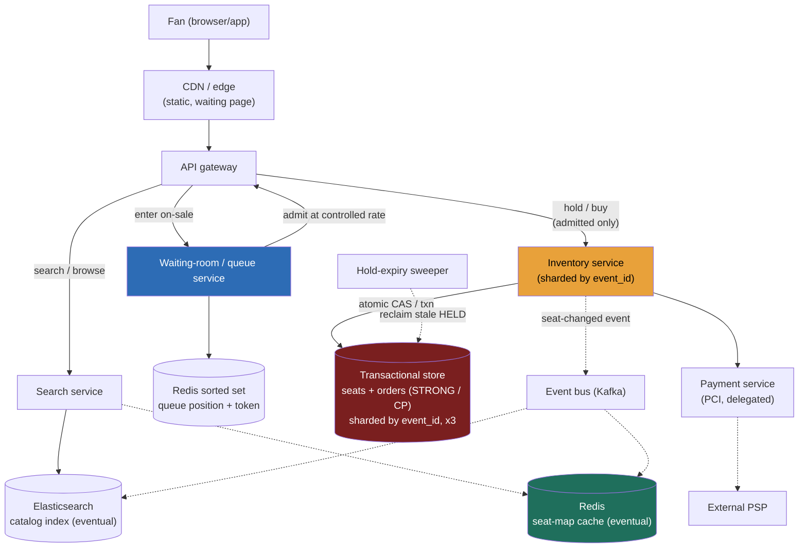

### Learning objectives
- Run the full **RESHADED** spine on a problem whose crux is **contention, not a read:write ratio** - recognize that steady-state traffic is boring and the entire design exists for a single-event **flash crowd** (millions of fans, tens of thousands of seats, one instant).
- Prevent **oversell / double-booking** with an **atomic seat-state transition** (`AVAILABLE -> HELD(ttl) -> SOLD`), and choose the concurrency idiom - **optimistic conditional write / CAS** over pessimistic `SELECT FOR UPDATE` - against the contention shape (callbacks to consistency, quorums, conditional writes from Lessons 2.7-2.8).
- Design **temporary holds with a TTL** and the **lazy-expiry** reclaim that keeps them correct without depending on a sweeper, and place the **payment flow** so a slow processor never causes an oversell.
- Design a **virtual waiting room** and see its real job: not fairness garnish but the **device that caps the admitted rate**, bounding the per-event write rate so the strongly-consistent inventory shard doesn't thrash.
- Draw the **strong-vs-eventual consistency boundary** exactly where money and seats demand strong, and keep catalog, search, and the *displayed* seat map eventual - and operate at **Director altitude**: tie every choice to a requirement, quantify the cost, name where you'd delegate (payments/PCI, fraud/anti-scalper).

### Intuition first
Picture a stadium with **60,000 seats** going on sale at exactly 10:00:00, and **two million** fans hammering refresh to be first. Demand outnumbers supply **33 to 1**, and almost all of it arrives in the *same second* - not spread over a minute, a spike at `t=0`. That is the whole problem in one image: not "how do I serve a lot of traffic" (steady state is a sleepy ~115 bookings/sec), but **"how do two million people fight over sixty thousand seats without the same seat being sold twice, and without the stampede flattening the system."** Two mechanisms carry the design, and the trick is that they are *partners*. First, **a seat is a thing that can be claimed by exactly one person at a time** - you put a temporary **hold** on it (a 10-minute reservation that auto-expires if you don't pay), and the moment of claiming has to be **atomic**: of the thousand people who click the same green seat in the same instant, the database lets **exactly one** win and tells the rest "gone, pick another." Second, you don't let two million people onto the buying floor at once - you put them in a **virtual waiting room** (an orderly line) and admit them a **controlled trickle** at a time. And here is the insight most people miss: the line isn't there to be polite. **The line is what makes the atomic-claim core survivable** - by capping how many people reach the seats per second, it bounds how fast the strongly-consistent inventory is being hammered, so the part of the system that absolutely cannot get the count wrong is never asked to handle the full firehose. Hold that picture: a tiny strongly-consistent core (the seats, the money) protected behind a big, cheap, edge-scalable front gate (the queue).

That asymmetry - **a massive flash crowd funneled down to a controlled trickle hitting a small strongly-consistent inventory** - is the opposite of the read-heavy, cache-everything intuition from Instagram/Twitter, and getting it backwards (caching your way out of a *correctness-under-contention* problem) is the first thing this question tests.

---

## R - Requirements

> **What the step is for:** pin down *what you're building and for whom*, then **cut scope** to a defensible core so a sprawling product doesn't drown the answer. **How to approach it generally:** separate **functional** from **non-functional**, ask 2-3 sharp clarifying questions, and state the skew/scale assumptions out loud - but here the load-bearing fact isn't a ratio, it's the **contention profile of a flash sale**.

**Clarifying questions I'd actually ask (and the answers I'll assume so we can proceed):**
- *Is the headline case a steady stream of bookings, or flash on-sales where millions hit one event at once?* → **Flash on-sales are the design driver.** Steady state is easy; one event with **2M fans for 60K seats** is the problem. If they say "no flash crowds," this becomes a much smaller system and I'd say so.
- *Reserved seating (you pick seat 14F) or general admission (any spot in the pit)?* → **Both**, and they have *different* contention shapes - per-seat rows vs one hot counter. I'll design reserved as the main case and show GA as a variant.
- *How long does a fan get to complete payment?* → A **hold TTL of ~10 minutes**; long enough to enter card details and clear a payment processor, short enough that abandoned seats return to the pool fast.
- *Is overselling ever acceptable (airline-style)?* → **No. Selling the same seat twice is the cardinal sin** - a correctness invariant, not a nice-to-have. (Contrast airlines, which deliberately oversell and bump; we don't.)
- *Latency bar?* → Browse/search **p99 < ~200 ms**; the seat-claim transaction **< ~500 ms** even under contention (a human is staring at a spinner during the most stressful purchase of their year).

**Functional requirements (the defensible core):**
1. **Browse / search** events by artist, venue, city, date.
2. **View the seat map** for an event with current availability.
3. **Hold** one or more seats temporarily (a TTL reservation) while the fan checks out.
4. **Purchase** held seats (confirm payment, convert hold to a sold ticket) - **never overselling**.
5. **Release** a hold (explicitly, or automatically on TTL expiry) so the seat returns to the pool.
6. **Admission control:** a virtual waiting room that meters the flash crowd onto the buying floor.

**Explicitly CUT (scoping *is* the signal):** dynamic/surge pricing, the secondary resale marketplace, fan-to-fan transfers, seat recommendations, the venue map *rendering* engine, refunds/exchanges UX, season-ticket packages, fraud/identity onboarding. Each is a real subsystem; piling them all in is the "too high, hand-wavy" failure. I scope to **search -> seat map -> hold -> pay -> release**, gated by **the waiting room**, and say so.

**Non-functional requirements (where the design pressure lives):**
- **Strong consistency on inventory and money** - the seat-claim and the order/payment state must be **linearizable** at the seat level: no oversell, no double-charge, no lost sale. This is a **CP** choice (Lesson 2.7) for the inventory core, made deliberately.
- **High availability for browse/search** - fans browsing must not be blocked by the on-sale storm; this tier is **AP**, cache-fronted, eventually consistent.
- **Flash-crowd tolerance** - the system must absorb a **33:1 demand spike on a single event** without the inventory core collapsing or overselling.
- **Low latency** - browse p99 < 200 ms; seat-claim p99 < 500 ms under contention.
- **Fairness + abuse resistance** - the queue should be roughly first-come, and the system must resist **bots/scalpers** hoovering inventory (the security NFR people forget).

**The skew, stated up front - and why the usual framing is a trap.** In *steady state* this is **read-heavy, ~200:1 browse:book** (people browse constantly, buy rarely). But that ratio is **not** what drives the architecture - unlike TinyURL or Uber, the crux is **contention concentration**, not a steady ratio. The defining number is a single event where **2M fans converge on 60K seats in one second** (~33K req/s onto *one event's inventory* at the spike). The design follows from that concentration: protect a small **strongly-consistent** inventory core behind a big **eventually-consistent, edge-scalable** front, and use a queue to bound the rate at which the two meet.

---

## E - Estimation

> **What the step is for:** reason about size *in numbers* so the design is "enough math to make a defensible call," never "it scales." **How to approach it generally:** compute QPS (read/write), storage with growth, bandwidth, cache working set, and a rough instance count - round hard, state assumptions. Here the headline isn't an average; it's the **flash-sale spike** and the **admission rate** that tames it.

**Assumptions (stated, then used):** 500K events on sale at a time; ~5K avg seats/event (mix of clubs and stadiums); 10M DAU; a fan browses ~20 event pages/day and buys rarely; ~1M tickets sold/day overall; a hold TTL of ~10 min.

**Steady browse/search QPS (read).**
`10M DAU x 20 browses ÷ 86,400 s ≈ 2,300 reads/s` average → **~2.3K/s**, peak ~5x → **~12K reads/s.** Modest; a cached catalog/search tier eats this without breaking a sweat.

**Steady booking QPS (write).**
`1M tickets/day ÷ 86,400 s ≈ 12 writes/s` average → **~12/s**, even a 10x steady peak is **~115 writes/s.** *Tiny.* So in steady state the strongly-consistent write path is trivial - which is exactly why the naive answer ("just use one Postgres") *feels* fine and then dies on the flash sale.

**Steady skew:** `~12K reads/s ÷ ~115 writes/s ≈ 100-200:1` read-heavy. Real, but **not the driver** - the next number is.

**The flash sale (the real headline).**
- One stadium event: **60K seats.** Fans competing at on-sale: **~2M.** → **33:1 demand:supply.**
- If 2M arrive within the first 60 s **unthrottled**: `2M ÷ 60 ≈ 33K req/s` onto a **single event's inventory** - and the arrival is a **spike at `t=0`, not a smooth 60-second average**, so the instantaneous peak is well above 33K/s. That is the load one strongly-consistent shard would face *with no queue*. It would thrash (lock contention / hot partition) and risk oversell.
- **The waiting room is the lever.** Admit fans onto the buying floor at a **controlled ~2,000/s** (a tunable knob). At ~2K admits/s, the 60K seats sell out in roughly `60K ÷ 2K ≈ 30 s` of *buying-floor* time, while the 2M-deep queue simply **drains over ~15-17 min** (most fans never reach the floor because the seats are gone). The number that matters is therefore **not** 33K/s - it's **the admission rate we choose**, because that is the actual write rate the inventory core must sustain.

**Storage (with growth).**
- **Seat inventory:** `500K events x 5K seats x ~200 B/row ≈ 0.5 TB` raw; with **3x replication ~1.5 TB.** Small.
- **Orders/tickets:** `1M/day x 365 x ~1 KB ≈ 0.37 TB/yr` (sold tickets + order records). A few TB over years - **modest.** Both fit comfortably in a **sharded relational/transactional store**; this is *not* a big-data problem. The hardness is **contention and consistency**, not volume.

**Bandwidth.** Browse responses (event JSON, seat-map deltas) are small; `12K reads/s x ~5 KB ≈ 60 MB/s` peak egress - negligible, CDN-absorbable. Inventory writes are tiny. Bandwidth is not a constraint (contrast YouTube, where it *is* the system).

**Cache working set.** Only **hot events** matter. Say ~10K events are "live/hot" at once; a cached seat-map at ~50 B/seat → `10K x 5K x 50 B ≈ 2.5 GB`. **Fits in RAM** on a couple of cache nodes. The catalog/search index and these hot seat-maps are the cache; the *authoritative* seat state stays in the transactional store.

**Instance count (order of magnitude).** Browse/search tier: ~12K reads/s over cache ⇒ **~10-15 stateless app nodes + a cache cluster + a search cluster.** Inventory tier: at a metered ~2K writes/s it's **a handful of shards** of a transactional store, replicated. Waiting-room/queue tier: edge + a Redis-class queue, **scaled for the spike, not the average.** The spend is the **front gate and the search tier**, not the inventory database.

**What the estimation *decided*:** steady load is trivial (don't over-build for it); the **flash spike on one event** is everything, and the **admission rate (~2K/s)** - not the raw 33K/s - is the write rate the strongly-consistent core must serve; storage is small (sharded SQL, not Hadoop); the hot working set fits in RAM (cache browse, never the authoritative seat state). The numbers, not taste, drew the strong/eventual line.

---

## S - Storage

> **What the step is for:** decide **what must persist** and pick the **store type(s)** matching the data shape and access pattern - then name real systems. **How to approach it generally:** describe the access pattern, choose the simplest store that serves it, and reject alternatives on the access pattern, not fashion. Here the system splits cleanly into **three** data classes with different consistency needs.

**1. Seat inventory + orders + payment state (strongly consistent, transactional, write-contended).**
- *Access pattern:* read a seat's state, then **atomically flip** `AVAILABLE -> HELD` (one winner under contention); multi-seat purchases must be **all-or-nothing** (4 adjacent seats succeed together or not at all); orders and payment status must be **durable and linearizable**. Volume is small (~1.5 TB) but correctness is absolute.
- *Choice:* a **relational / NewSQL transactional store** - **PostgreSQL/MySQL** sharded **by `event_id`**, or a distributed SQL store (**CockroachDB / Spanner / Aurora**) for transactions across shards. Justification: the access pattern *needs* the two things relational stores are best at - **row-level atomic conditional updates** (`UPDATE ... WHERE status='AVAILABLE'`) and **multi-row transactions** (the adjacent-seat case). This is precisely where a transactional store **earns its place over a plain KV store**.
- *Rejected - an eventually-consistent KV/wide-column store (Cassandra/DynamoDB) as the inventory source of truth:* *why considered* - it shards trivially and writes cheaply. *Why rejected* - last-write-wins / eventual replication can **oversell** (two replicas both accept the same seat, converge later - too late, you've sold it twice). DynamoDB's **conditional writes** can do single-item CAS, so a *single-seat* DynamoDB design is defensible - but **multi-seat atomicity** (adjacent seats, all-or-nothing) wants real transactions, and "never oversell" wants **strong** consistency, which is a CP posture (Lesson 2.7). We choose the store that makes the invariant cheap to hold, not the one that scales most easily for data we don't have much of.

**2. Event catalog + search (read-heavy, eventually consistent, AP).**
- *Access pattern:* search/browse by artist, venue, city, date; high read QPS; staleness of seconds is fine (a new event appearing a few seconds late is invisible).
- *Choice:* an **inverted-index search engine - Elasticsearch / OpenSearch** (Lesson 3.13) for full-text + faceted search, fed from the catalog store, fronted by **Redis/CDN** caching. Eventually consistent by design.
- *Rejected - serving search from the transactional inventory store:* it couples your sleepy-but-sacred inventory DB to the 12K-reads/s browse firehose and to `LIKE '%query%'` scans it's terrible at. Keep browse load off the core entirely.

**3. The displayed seat map (best-effort, cached, eventually consistent).**
- *Access pattern:* render "which seats look available" to a browsing fan - read-heavy, refreshed via deltas; **does not need to be authoritative.**
- *Choice:* a **cached seat-map** (Redis) updated from inventory-change events, served at the edge. **It is expected and correct** that two fans see the same seat as green and one *loses the CAS* at claim time - the cache is a hint; the **transaction** is the truth.
- *Rejected - making the displayed map strongly consistent:* you'd serialize every seat-map read against the inventory core under flash load - pointless, because the authoritative check happens at claim anyway. Strong consistency belongs on the *claim*, not the *picture*.

**The queue/waiting-room state** lives in a **Redis sorted set** (position = score) or a token bucket - low-state, fast, edge-near; detailed in H/Evaluation.

---

## H - High-level design

> **What the step is for:** show the **components and the happy path** so the interviewer sees you think in boxes and flows. **How to approach it generally:** draw the request entering, the layers it crosses, and the key flows - minimal labels. The shape to make visible here: a **big eventually-consistent front** (CDN, search, queue) protecting a **small strongly-consistent core** (inventory, orders, payments).



**Happy path, in prose:**
1. **Browse (the calm, read-heavy path).** A fan searches; the request hits the **CDN/gateway -> search service -> Elasticsearch**, with the catalog and **seat-map served from cache** (Redis/CDN). This whole tier is eventually consistent and never touches the inventory core.
2. **Enter the on-sale (the flash gate).** When the fan opens a hot event at on-sale time, they're routed to the **waiting-room service**, which seats them in a **Redis sorted set** and shows a CDN-served "you're in line, position N" page. Crucially, **almost no one reaches the inventory yet.**
3. **Admission (the rate cap).** The queue service **releases tokens at a controlled rate** (~2K/s). A fan holding a valid token may proceed to the buying floor; everyone else waits. *This is the step that bounds the inventory write rate.*
4. **Hold (the atomic claim).** The admitted fan selects seats; the **inventory service** runs an **atomic conditional update** per seat - `UPDATE seats SET status='HELD', hold_id=?, expires_at=now()+10m WHERE event_id=? AND seat_id=? AND (status='AVAILABLE' OR (status='HELD' AND expires_at<now()))`. For multiple seats it's **one transaction, all-or-nothing.** Exactly one fan wins each seat; losers get **"seat gone, pick another"** instantly (a cheap failure - no lock held).
5. **Pay (convert hold to sale).** Within the TTL, the fan submits payment; the inventory service calls the **payment service** (delegated, PCI-scoped) with an **idempotency key**. On success it **transactionally** flips the held seats `HELD -> SOLD` and writes the **order** in the same transaction. On payment failure or TTL expiry, the hold is **released** and the seat returns to the pool.
6. **Propagate (eventual).** Each seat-state change emits a **`seat-changed` event** to **Kafka**, which updates the **seat-map cache** and search index so other browsers see the seat fill in - asynchronously, best-effort.

**The shape to notice:** the load-bearing wall runs between **WR/search/cache (eventual, scales at the edge)** and **inventory/orders/payments (strong, deliberately small and protected)**. The queue is what keeps traffic crossing that wall at a rate the strong side can serve.

---

## A - API design

> **What the step is for:** define the **interface contract** - endpoints, inputs/outputs, status codes that carry the semantics. **How to approach it generally:** keep it to the calls the functional requirements demand, and be explicit about status codes and idempotency, because for a booking system those *are* the correctness story.

```
# --- Browse (eventual, cached) ---
GET  /v1/events?artist=&city=&date=            -> 200 { events:[...] }
GET  /v1/events/{eventId}/seatmap              -> 200 { sections:[{seatId,status}], asOf: <ts> }
                                                  # status is a HINT (cached, eventual)

# --- Enter the on-sale (waiting room) ---
POST /v1/events/{eventId}/queue                -> 200 { queueToken, position, etaSeconds }
GET  /v1/queue/{queueToken}                    -> 200 { position, admitted: false }
                                                  -> 200 { admitted: true, accessToken }  # your turn

# --- Hold (atomic claim; admitted fans only) ---
POST /v1/events/{eventId}/holds                 # requires valid accessToken
  body: { seatIds: ["14F","14G"], accessToken }
  -> 201 { holdId, seatIds, expiresAt }         # all-or-nothing
  -> 409 { takenSeats: ["14G"] }                # at least one lost the CAS -> pick another
  -> 403                                         # no/expired admission token

# --- Purchase (convert hold -> sold, with payment) ---
POST /v1/holds/{holdId}/purchase
  headers: { Idempotency-Key: <uuid> }
  body: { paymentToken }
  -> 200 { orderId, tickets:[...] }
  -> 410 Gone                                    # hold expired before payment (TTL)
  -> 402                                         # payment declined; hold released

# --- Release (explicit cancel; TTL also auto-releases) ---
DELETE /v1/holds/{holdId}                        -> 204
```

**Design notes (each a choice with its rejected alternative):**
- **Hold and purchase are two calls, not one.** *Rejected: a single "buy seat" call.* Seats must be **locked while the human enters payment** - a process that takes seconds and can fail. Splitting hold (instant, atomic) from purchase (slow, external PSP) is what lets the fan check out under a TTL without holding a DB lock the whole time.
- **`Idempotency-Key` on purchase is mandatory.** A fan double-clicks "Buy," or the client retries a timed-out request - **without idempotency that double-charges and could double-book.** The key makes the purchase **exactly-once** from the client's view (the server dedups retries). *Rejected: relying on the client not to retry* - clients always retry.
- **The seat-map `status` is explicitly a hint** (`asOf` timestamp), not a guarantee. *Rejected: implying the map is authoritative* - it would force strong reads we decided against; the **409 on hold is the real arbiter.**
- **Admission is a token (`accessToken`), separate from the queue token.** Reaching the front of the line grants *permission to try*, **not a seat** - the seat is still won or lost at the atomic hold. (This separation is the single most common point of confusion; see Common mistakes.)

---

## D - Data model

> **What the step is for:** nail the **schema, keys, indexes, and the partition/shard key** - *where each row physically lives.* **How to approach it generally:** define the primary key from the dominant access pattern, choose the shard key so the hot operation hits a single partition, and call out secondary access. Here the shard key is the **most consequential decision in the problem**, because it interacts directly with the flash crowd.

**`seats` - the contended inventory (transactional store):**

| Field | Type | Notes |
|---|---|---|
| `event_id` | int64 | **partition / shard key** |
| `seat_id` | string | e.g. `"S12-R14-14F"`; `(event_id, seat_id)` = primary key |
| `status` | enum | `AVAILABLE` / `HELD` / `SOLD` |
| `hold_id` | uuid (nullable) | current holder, when `HELD` |
| `expires_at` | timestamp (nullable) | TTL of the current hold (drives lazy reclaim) |
| `price_tier` | int | section/price band |
| `version` | int64 | optimistic-concurrency token (CAS) |

**`orders` (same transactional store, same `event_id` shard):**

| Field | Type | Notes |
|---|---|---|
| `order_id` | uuid | primary key |
| `event_id` | int64 | shard key (colocated with the seats it bought) |
| `user_id` | int64 | buyer |
| `seat_ids` | string[] | seats sold |
| `payment_status` | enum | `PENDING` / `PAID` / `REFUNDED` |
| `idempotency_key` | string | unique; dedups retried purchases |
| `created_at` | timestamp | |

**Partition / shard key = `event_id`. This is the load-bearing decision - and it cuts both ways.**
- *Why it's right:* the two hot operations - **render a seat map** and **transact over multiple adjacent seats** - are both **scoped to a single event.** Sharding by `event_id` **colocates all of an event's seats on one shard**, so a seat-map read and a multi-seat transaction hit **one shard, one node** - no cross-shard 2-phase commit, no scatter-gather. Orders share the shard, so order+inventory commit together.
- *Why it looks like a disaster - and why it isn't:* sharding by event means **one mega-event's entire inventory lives on one shard**, which would be a textbook **hot shard** under a 33K/s flash crowd. **The waiting room is precisely what rescues this.** By capping admission to ~2K/s, the queue **bounds the write rate onto that single event-shard** to something a strongly-consistent node sustains. *The shard key and the queue are co-designed:* event-sharding is only viable **because** the queue caps the per-event rate; the queue's real architectural job is to make event-sharding survivable. Name that link - it's the heart of the problem.
- *Rejected: shard by `seat_id` hash (spread one event's seats across all shards).* *Why considered* - it would scatter a hot event's write load evenly across the fleet, defusing the hot shard. *Why rejected* - it **shatters multi-seat atomicity**: buying 4 adjacent seats now spans 4 shards → a **distributed transaction (2PC)** on the hottest path in the system, far slower and more failure-prone than a single-shard transaction. We **reject distributing the seats to keep the transaction local**, and lean on the **queue** (not the shard layout) to tame the per-event heat. Different tool for each problem: shard key buys transaction locality; queue buys rate control.

**General-admission variant (different contention shape, called out):** GA has no per-seat rows - it's **one availability counter** per section. That counter is a **single hot row**: `UPDATE ga SET avail = avail - 1 WHERE event_id=? AND section=? AND avail > 0` (a conditional decrement that can't go negative). At extreme contention the single row serializes, so you **shard the counter** (Lesson 3.16): split the section's capacity across N counter shards, decrement a random shard, sum on read. *Trade-off:* sharded counters make the **exact remaining count approximate to read** (you sum shards) in exchange for **N× the write throughput** - acceptable, because "is it sold out" only needs all shards drained, and the precise count is a display nicety.

**Indexes:** on `seats`, the primary key `(event_id, seat_id)` serves the point CAS; a secondary index on `(event_id, status)` (or a partial index on `status='AVAILABLE'`) speeds seat-map builds and the expiry sweep. On `orders`, a **unique index on `idempotency_key`** is the mechanism that makes purchase exactly-once. Search lives entirely in **Elasticsearch**, off this store.

---

## E - Evaluation

> **What the step is for:** turn on yourself - **re-check against the NFRs and hunt the bottlenecks** (hot keys, single points, tail latency, contention, write amplification), and **fix each fix naming its trade-off.** This step (with D-evolution) is where Director signal concentrates.

**Re-check vs the NFRs:** no-oversell - met by the **atomic seat transition** (below); flash-crowd tolerance - met by the **queue capping admission**; strong consistency on money - met by **single-shard transactions** on `event_id`; browse availability/latency - met by the cache/search tier being fully decoupled. Now the bottlenecks.

**Bottleneck 1 - oversell / double-booking (the cardinal correctness risk).**
Two fans claim seat 14F in the same millisecond. If both reads see `AVAILABLE` and both write `HELD`, you've oversold.
*Fix - an **atomic conditional write (optimistic CAS)** as the primary idiom:* the claim is a **single statement** that both tests and sets - `UPDATE seats SET status='HELD', hold_id=?, expires_at=? WHERE event_id=? AND seat_id=? AND status='AVAILABLE'`. The database serializes row writes, so **exactly one update affects 1 row; the rest affect 0 rows and fail fast.** The loser gets an instant 409 "pick another seat" - **no lock is held, the failure is cheap.** Multi-seat = the same inside **one transaction**, all-or-nothing.
*Trade-off & rejected alternative:* I **reject pessimistic `SELECT ... FOR UPDATE`** as the *default*, because under raw 33:1 contention it makes every loser **hold a row lock and block**, serializing the contenders and inflating tail latency (lock convoys). Optimistic CAS lets losers fail immediately and retry on a *different* seat. *Caveat:* the very reason even pessimistic locking *would* survive here is that **the queue has already capped contention** - so the choice is about *failure cost*, and optimistic wins because most contenders should bounce to other seats cheaply, not queue on a lock. (This is the conditional-write / quorum lineage from Lessons 2.7-2.8: on a quorum store you'd express the same invariant as a conditional put with **W+R>N** to guarantee the claim is read-your-write; on SQL it's the `WHERE status='AVAILABLE'` clause.)

**Bottleneck 2 - the hot event-shard (the flash crowd on one partition).**
Sharding by `event_id` puts a mega-event's whole inventory on one node; 33K/s would melt it.
*Fix:* the **virtual waiting room caps admission at ~2K/s**, so the actual write rate onto that shard is bounded to what a strongly-consistent node serves; additionally, **replicate the hot event-shard** for the (eventual) seat-map reads, and if a single event still exceeds one node's write budget, **split that one event across a few shards by section** (section-level sub-sharding) so different sections' transactions land on different nodes - accepting that a cross-section purchase (rare) then spans shards.
*Trade-off:* the queue trades **immediacy for survivability** - fans wait in line instead of getting instant access, which is the explicit cost of protecting the core. Section sub-sharding trades **single-shard simplicity** for headroom on the very largest events.

**Bottleneck 3 - stale holds (the abandoned-cart leak).**
A fan holds 2 seats then closes the tab; without expiry those seats are **dead inventory** during the one sale that matters.
*Fix - **lazy expiry as the correctness mechanism**, a sweeper only for hygiene.* The claim condition already reclaims expired holds **at write time**: `... WHERE status='AVAILABLE' OR (status='HELD' AND expires_at < now())`. So a stale hold is **reclaimable by the next claimant without waiting for any background job** - correctness never depends on a timer. A background **sweeper** additionally flips long-expired `HELD -> AVAILABLE` so the **seat-map cache repaints** and the seat looks free again.
*Trade-off & rejected alternative:* I **reject a sweeper-only design** (where seats only return when a periodic job runs), because a held-then-crashed seat would sit **dead until the next sweep** - intolerable mid-flash-sale. Lazy reclaim costs a slightly more complex `WHERE` clause in exchange for **zero dependence on a background job for correctness.**

**Bottleneck 4 - the payment race (slow PSP vs the TTL).**
The fan pays, but the external processor takes 8 s and the **hold expired at 10 min** just as payment succeeds - now you might sell a seat you already resold.
*Fixes:* (a) **size the hold TTL safely above worst-case PSP latency** (10 min ≫ a few seconds), so the common case never races; (b) make purchase **idempotent** (unique `idempotency_key`) so retries don't double-charge; (c) at the moment of `HELD -> SOLD`, **re-assert the hold is still valid in the same transaction** (`WHERE hold_id=? AND status='HELD' AND expires_at>now()`) - if it expired and the seat was resold, the conversion **fails and triggers an automatic refund/reconcile** (rare). (d) Delegate **payment + PCI** behind a clean interface.
*Trade-off:* a generous TTL means **abandoned seats are locked longer** (less inventory churn during the sale) - we accept that to make the payment race vanishingly rare; the reconcile path absorbs the residual.

**Bottleneck 5 - the waiting room itself as a single point of failure / fairness + abuse.**
If the queue dies, either the gate fails open (stampede hits the core) or fails closed (no one buys).
*Fixes:* run the queue on a **replicated Redis** (sorted set) deliberately kept **low-state and edge-scalable** - it must survive the spike that would kill the origin, so it lives in front of, and decoupled from, the stateful core. **Fail closed** on queue loss (throttle to a safe trickle) rather than open. For **fairness + anti-scalper** (the security NFR): **verified-fan pre-registration** (only pre-approved accounts get queue tokens), **per-account/IP rate limits**, **CAPTCHA/bot detection** at the gate, and **purchase caps** (e.g. 4 tickets/account/event enforced in the transaction).
*Trade-off:* fan verification and CAPTCHA add **friction and a fraud-vendor dependency** on the entry path - acceptable because the alternative (bots draining inventory in seconds, the actual Ticketmaster failure mode) is existential to the product. *Delegate the fraud/anti-bot detail to a trust-and-safety team* with a stated prior (verified-fan + behavioral bot scoring).

**Re-check, closing:** oversell impossible (atomic CAS + re-assert on convert); flash spike survivable (queue caps rate onto the event-shard); money correct (single-shard txn + idempotency); holds self-heal (lazy reclaim); browse unaffected (decoupled eventual tier). The CP core stays small; everything that *can* be AP *is*.

---

## D - Design evolution

> **What the step is for:** show you **think past v1** - how it holds at 10x or under new constraints, the hardest trade-offs, what you'd revisit, and **where you'd delegate.** **How to approach it generally:** push each dimension up an order of magnitude, find what breaks first, and name what you'd hand to a specialist (depth where the decision turns on it; credible delegation elsewhere).

**At 10x (a global mega-tour: 10M fans on one on-sale, multiple stadiums, ~20K admits/s):**
- **The queue, not the database, is the thing that scales.** Push the waiting room **fully to the edge** (CDN-hosted waiting page + regional queue shards), and admit per-region so no single queue node is global. The inventory core barely changes - because admission still caps its rate; you simply **raise or lower the admission knob** to match how fast seats actually sell. *Trade-off:* regional queues complicate **global fairness** (whose line is "first"?) - you accept approximate cross-region fairness for the ability to scale the gate horizontally.
- **Hot-event sub-sharding becomes routine:** the very largest single events get **section-level sharding** by default, and the seat-map read replicas multiply. *Trade-off:* cross-section purchases span shards (2PC) - rare enough to accept.
- **Read path goes global/edge:** seat-maps and catalog are served from regional caches/CDN; the `seat-changed` Kafka stream fans out per region. *Trade-off:* a fan in another region sees a seat fill in a beat later - fine, the map was always a hint.

**Hardest trade-offs to defend:**
- **Strong vs eventual boundary (the core decision).** We drew it tight around **inventory + orders + payments** (CP) and left everything else AP. The hard part is resisting the urge to make the *displayed map* strong - it feels safer but it's pointless, because the **claim** is the only place the truth must hold, and forcing strong reads on the map would re-couple the browse firehose to the CP core. *The discipline is keeping the strongly-consistent surface as small as the invariant demands - no larger.*
- **Queue admission rate.** Admit too fast and you re-expose the inventory core to a stampede and lock contention; admit too slow and fans rage at a frozen line for seats that are actually still available. It's a **live tuning knob** set from real sell-through telemetry, not a static constant - and arguably the single most operationally important dial in the system.
- **Event-sharding vs seat-distribution.** We chose event-sharding for **transaction locality** and paid for it with hot-shard risk that **only the queue makes safe** - a genuine coupling between two subsystems that a naive design treats as independent.

**What I'd revisit first if requirements changed:** if **resale / transfers** become first-class, the inventory model grows a whole ownership-and-provenance layer (who holds the ticket *now*, transfer atomicity) - a design of its own. If **airline-style controlled oversell** were ever wanted (it isn't here), the invariant inverts and the whole CP core relaxes. If **dynamic pricing** lands, price becomes a hot, fast-changing field and you'd separate price from seat-state to avoid contention on the same row.

**Where I'd delegate (the explicit Director move):**
- **Payments / PCI:** *"I'd have the payments team own the PSP integration and PCI scope behind a clean `charge(idempotencyKey, amount, token)` interface; my prior is tokenized cards + an idempotent capture with an async reconcile for the rare post-expiry race - but they own the SLA and the compliance surface, which I will not hand-roll on a whiteboard."*
- **Fraud / anti-scalper:** *"I'd have trust-and-safety own bot detection and verified-fan gating; my prior is pre-registration tokens plus behavioral scoring at the queue, but the detection model and vendor are theirs to benchmark."*
- **Search relevance:** *"Ranking events by relevance/personalization is a search-team problem behind the `search()` interface; my prior is Elasticsearch with learned ranking, measured, not asserted."*
- **The store bake-off:** *"I'd have the storage team benchmark sharded Postgres vs CockroachDB/Spanner on our exact seat-claim contention and multi-seat-transaction p99 under a simulated on-sale - my prior is sharded Postgres for operational familiarity, escalating to distributed SQL only if cross-shard transactions become common."* Naming what I keep (the strong/eventual boundary, the queue-as-rate-limiter, the atomic claim) and what I hand off, *with a stated prior*, is the altitude - not personally tuning Postgres lock timeouts at the board.

---

## Trade-offs table - the pivotal decisions

| Decision | Option A | Option B | Option C | Use when... |
|---|---|---|---|---|
| **Seat-claim concurrency** | **Optimistic conditional write / CAS** (`UPDATE ... WHERE status='AVAILABLE'`; loser fails fast, no lock) | **Pessimistic `SELECT FOR UPDATE`** (lock the row, then write) | **Distributed lock** (Redis/ZooKeeper per seat) | **A** as the default - losers bounce cheaply to other seats, no lock convoy (our choice). **B** only when most contenders genuinely need *that one* seat and must serialize. **C** only if the seat truth lives outside one transactional store (avoid here). |
| **Inventory shard key** | **`event_id`** - colocates an event's seats; single-shard seat-map + multi-seat txn | **`seat_id` hash** - spreads one event across all shards | **Section-level sub-shard** of one event | **A** as default - transaction locality, with the **queue** taming the hot shard (our choice). **B** trades that away for even spread but forces **2PC** on multi-seat buys. **C** for the very largest single events that exceed one node's write budget. |
| **Inventory store** | **Transactional SQL / NewSQL** (sharded Postgres, CockroachDB, Spanner) | **KV w/ conditional writes** (DynamoDB single-item CAS) | **Eventually-consistent wide-column** (Cassandra LWW) | **A** - needs row-atomic CAS *and* multi-row transactions for adjacent seats (our choice). **B** defensible for single-seat-only inventory. **C** **rejected** - LWW/eventual can oversell. |

---

## What interviewers probe here (Director altitude)

- **"What actually prevents two people buying the same seat?"** - *Strong signal:* **the atomic conditional write** (`UPDATE ... WHERE status='AVAILABLE'`) - the DB serializes the row, exactly one update hits 1 row, the rest hit 0 and fail fast; multi-seat is one transaction. Names that this is a **CP** choice (Lesson 2.7) and that the *queue does not* prevent oversell - admission ≠ a seat. *Red flag:* "the queue handles it" (the queue meters load, it doesn't arbitrate seats), or an eventually-consistent store that can oversell.
- **"What's the real job of the waiting room?"** - *Strong:* it **bounds the per-event write rate** (~2K/s admit) so the strongly-consistent inventory shard - which is sharded by `event_id` and would otherwise be a hot partition - is never asked to serve the full 33K/s spike; it's the device that makes **event-sharding survivable**, not just a fairness UX. *Red flag:* treats the queue as cosmetic, or doesn't connect it to the inventory shard's survival.
- **"Where exactly is your strong/eventual boundary, and why there?"** - *Strong:* **strong/transactional** on seat inventory + orders + payments; **eventual/cached** on catalog, search, and the *displayed* seat map (a hint; the claim is the truth). Justifies keeping the CP surface **as small as the invariant requires.** *Red flag:* "strong consistency everywhere" (melts under the flash crowd) or "eventual everywhere" (oversells).
- **"How do holds expire without leaking inventory, and what if the sweeper is down?"** - *Strong:* **lazy reclaim at write time** (`OR (status='HELD' AND expires_at<now())`) so correctness never depends on the sweeper; the sweeper only repaints the cache. *Red flag:* sweeper-only (dead seats until the job runs).
- **"What does this cost, what's the dominant line item, and what would you delegate?"** - *Strong:* the spend is the **edge/queue + search/cache tier**, not the (small, ~1.5 TB) inventory DB; delegates **payments/PCI** and **anti-scalper/fraud** behind clean interfaces with stated priors, and proposes a **measured store bake-off**. *Red flag:* sizes a giant database, ignores the queue/edge cost, or insists on hand-tuning the DB.

---

## Common mistakes

- **Thinking the queue prevents oversell.** Admission to the buying floor grants **permission to try**, not a seat. Oversell is prevented **only** by the atomic seat-state transition. Conflating the two is the single most common error.
- **Caching your way out of a contention problem.** This isn't read-heavy-at-the-core like Instagram; the crux is **correctness under write contention**. The cache serves *browse*; it must never be the seat's source of truth.
- **Eventually-consistent inventory.** An AP store with last-write-wins **will** oversell under concurrent claims. Seats are a **CP** invariant.
- **Pessimistic locks as the default.** `SELECT FOR UPDATE` on every contender creates **lock convoys** and tail-latency blowups under contention; prefer **optimistic CAS** where losers fail fast and try another seat.
- **Sharding inventory by `seat_id`** to spread load - it **shatters multi-seat atomicity** into a distributed transaction on the hottest path. Shard by `event_id` and let the **queue** tame the heat.
- **No hold TTL, or sweeper-only expiry.** Abandoned carts become dead inventory during the one sale that matters; use a TTL with **lazy reclaim at write time**.
- **No idempotency on purchase.** A double-clicked "Buy" or a client retry **double-charges / double-books**. An idempotency key is mandatory.
- **Forgetting bots/scalpers.** Without verified-fan gating, rate limits, and purchase caps, bots drain inventory in seconds - the real-world failure mode.

---

## Interviewer follow-up questions (with model answers)

**Q1. Two fans click the same seat in the same instant. Walk me through exactly what stops a double-sell.**
> *Model:* The claim is a **single atomic conditional update**, not a read-then-write: `UPDATE seats SET status='HELD', hold_id=?, expires_at=now()+10m WHERE event_id=? AND seat_id=? AND (status='AVAILABLE' OR (status='HELD' AND expires_at<now()))`. The transactional store **serializes writes to that row**, so of the two concurrent statements, **exactly one affects 1 row (the winner) and the other affects 0 rows (the loser)**. The loser detects "0 rows updated" and immediately returns **409 - pick another seat**, holding **no lock**. For a multi-seat purchase it's the **same predicate inside one transaction**, so 4 adjacent seats are claimed all-or-nothing. This is a **CP** posture (Lesson 2.7): I deliberately chose a strongly-consistent store for inventory precisely so this single-statement CAS is the whole oversell defense. The queue is **not** part of this - it only controls *how many* such attempts arrive per second.

**Q2. Justify the virtual waiting room beyond "fairness." What does it actually buy you architecturally?**
> *Model:* Its real job is **rate control on the strongly-consistent core.** I shard inventory by `event_id` for transaction locality, which colocates a mega-event's whole inventory on **one shard** - a textbook hot partition that a 33K/s flash spike would melt. The waiting room **admits fans at a controlled ~2K/s**, so the **actual write rate onto that one event-shard is bounded** to what a CP node sustains. In other words, **event-sharding is only safe *because* the queue caps the per-event rate** - they're co-designed. Fairness and bot-gating are real bonuses, but architecturally the queue is a **rate limiter protecting the core.** It's also deliberately **low-state and edge-scalable** (Redis sorted set behind a CDN page) so it survives the very spike that would kill the origin, and it **fails closed** (throttle to a trickle) if it degrades.

**Q3. A fan holds seats, starts paying, and your payment processor takes 9 seconds. What can go wrong and how do you handle it?**
> *Model:* The risk is a **race between the hold TTL and payment completion**. I defuse it three ways. (1) The **hold TTL (10 min) is set far above worst-case PSP latency (seconds)**, so the common case never races. (2) Purchase is **idempotent** via a unique `idempotency_key`, so a client retry after a timeout doesn't double-charge or double-book. (3) At the `HELD -> SOLD` conversion I **re-assert the hold inside the same transaction** (`WHERE hold_id=? AND status='HELD' AND expires_at>now()`); if the hold had expired and the seat was resold, the conversion **fails and triggers an automatic refund/reconcile** - rare, and the reconcile path absorbs it. Payment + PCI themselves I **delegate** behind `charge(idempotencyKey, amount, token)`; the trade-off is a generous TTL locks abandoned seats longer, which I accept to make the race vanishingly rare.

**Q4. General admission - any spot in the pit, 10,000 capacity. How does the design change from reserved seating?**
> *Model:* The contention shape flips from **many seat-rows** to **one hot counter.** There are no per-seat rows; there's a single `avail` count per section, claimed with a **conditional decrement that can't go negative**: `UPDATE ga SET avail=avail-1 WHERE event_id=? AND section=? AND avail>0`. Same CAS principle - exactly one decrement succeeds per unit, "0 rows" means sold out. The new problem is that **one row** is now the entire section's write hotspot, so under extreme contention I **shard the counter** (Lesson 3.16): split 10,000 capacity into, say, 10 shards of 1,000, decrement a **random shard**, and **sum shards on read**. The trade-off: the **exact remaining count becomes approximate to read** (you sum N shards, and a shard can be empty while others aren't) in exchange for **~N× write throughput** - acceptable because "sold out" only needs all shards drained, and the precise live count is a display nicety, not an invariant.

**Q5. Why not just one big Postgres for everything? Steady-state is only ~115 writes/s.**
> *Model:* Steady state **is** trivial - that's the trap. One Postgres dies on **two** things the average hides. (1) The **flash spike**: ~33K/s onto a single event's rows would saturate one node and create brutal lock contention - which is why the **queue caps admission** and why even then I shard by `event_id` (and sub-shard the biggest events by section). (2) **Mixing workloads**: the 12K-reads/s browse/search firehose and `LIKE` queries have no business touching the sacred inventory DB - they belong in **Elasticsearch + cache** (eventual). So I keep a **small, strongly-consistent, sharded** transactional store for **inventory + orders + payments only**, and push catalog, search, and the displayed seat-map to an **eventually-consistent, edge-scalable** tier. One Postgres conflates a CP correctness core with an AP read firehose - the whole design is about keeping those apart.

---

### Key takeaways
- The crux is **contention, not a read:write ratio.** Steady state is sleepy (~115 bookings/s, ~200:1 read-heavy); the design exists for a **single-event flash crowd** - 2M fans, 60K seats, **33:1**, a ~33K/s spike on **one event** at one instant. The lever that tames it is the **admission rate (~2K/s)** we choose, not the raw spike.
- **Oversell is prevented by an atomic seat transition, full stop:** `AVAILABLE -> HELD(ttl) -> SOLD` via a **conditional write / CAS** (`UPDATE ... WHERE status='AVAILABLE'`), one winner per seat, multi-seat = one transaction. This is a deliberate **CP** choice (2.7-2.8). Prefer **optimistic CAS** over `SELECT FOR UPDATE` so losers fail fast instead of forming lock convoys.
- **The waiting room's real job is rate control**, not fairness: it **bounds the per-event write rate** so the inventory shard - sharded by `event_id` for transaction locality - survives. **Event-sharding is only safe because the queue caps the rate**; the two are co-designed. Admission ≠ a seat.
- **Holds self-heal via lazy reclaim at write time** (`OR (status='HELD' AND expires_at<now())`), so correctness never depends on a sweeper; **idempotency keys** make purchase exactly-once and a **generous TTL** beats the PSP race.
- **Draw the strong/eventual boundary tight:** strong/transactional on **inventory + orders + payments**; eventual/cached on **catalog, search (Elasticsearch), and the displayed seat-map** (a hint). **Director moves:** quantify (the spend is the edge/queue + search tier, not the ~1.5 TB DB), and **delegate** payments/PCI and anti-scalper/fraud behind clean interfaces with stated priors.

> **Spaced-repetition recap:** Ticketmaster = **high-contention seat reservation** - the problem is **2M fans fighting over 60K seats in one instant** (33:1), not a steady ratio. Prevent oversell with an **atomic CAS** seat transition `AVAILABLE->HELD(ttl)->SOLD` (one winner; multi-seat = one txn; **CP**, optimistic over pessimistic locks). Holds use a **TTL with lazy reclaim** (correctness independent of any sweeper) + **idempotent** purchase. A **virtual waiting room** admits a controlled ~2K/s - its real job is to **bound the write rate** so the **`event_id`-sharded** inventory core survives (queue and shard-key are co-designed). Strong on **inventory/orders/payments**; eventual on **search + the displayed seat-map** (a hint). Delegate **payments/PCI** and **anti-scalper**.

---

*End of Lesson 5.13. Ticketmaster inverts the cache-everything reflex of the social-feed problems: the hard part is **correctness under write contention**, solved by a tiny strongly-consistent core (atomic CAS + TTL holds) protected by a big eventually-consistent front gate (the waiting room as rate limiter) - reusing conditional writes and quorum reasoning from 2.7-2.8, sharded counters from 3.16, and search from 3.13. Next: 5.14 Distributed Job Scheduler - the at-least-once / exactly-once execution and time-wheel problem.*
