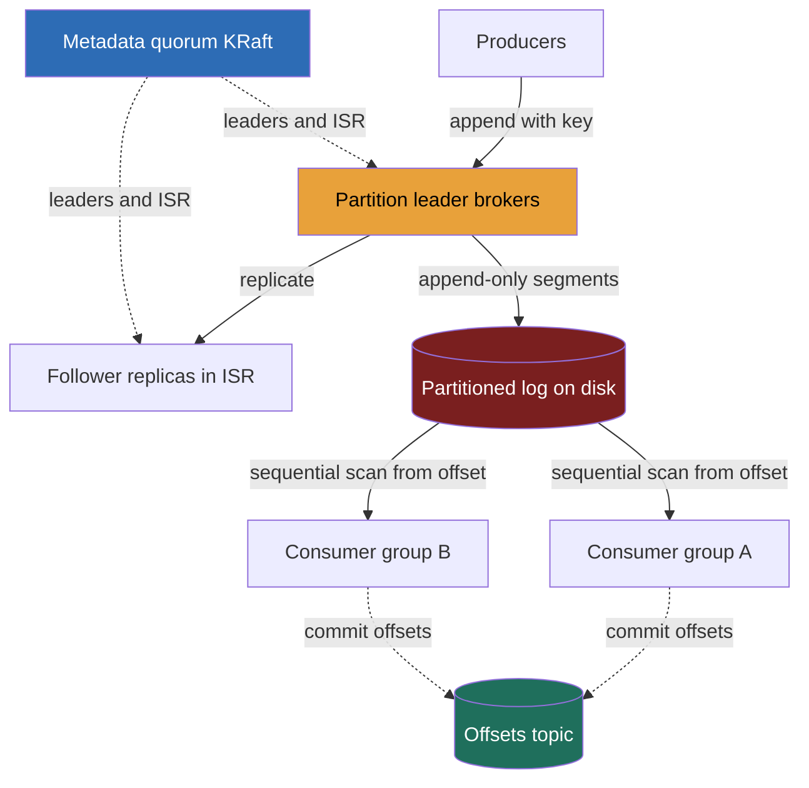

> **Why this gets asked and what separates a Director answer.** Senior loops (E6+) ask you to design the thing you normally pick off the shelf, Kafka itself, because the test isn't whether you can name it, it's whether your mental model is *real*. This course leans on Kafka in nearly every problem; the interviewer wants to know you understand the contracts you've been depending on. A Director answer treats durability, ordering, and delivery semantics as **API contracts** (partitions, consumer groups, replication factor, acks), decides where each knob sits and what it costs, then **delegates the storage-engine internals** (log segments, page-cache, zero-copy) with a stated prior, rather than hand-tuning a B-tree for 15 minutes. The fatal tell is claiming "Kafka gives you ordering" without the qualifier that makes it true: **ordering is per-partition only.**

---

### Learning objectives

1. Define a distributed message queue as a **partitioned, replicated, append-only log**, and explain why one data structure gives you durability, throughput, and replay at once.
2. Surface the three load-bearing trade-offs, **durability** (`acks`/ISR), **ordering** (per-partition scope), **delivery semantics** (at-most/at-least/exactly-once), as **API contracts the caller chooses**, not internal magic.
3. Reason about **consumer groups and rebalancing**: how partitions map to consumers, what a rebalance costs, why partition count caps parallelism.
4. Stress the design at **broker and partition failure**: leader election, **ISR shrink**, and the `acks=all` + `min.insync.replicas` contract that decides whether you lose data or availability.
5. Operate at Director altitude: decide the contracts, quantify cost, **delegate the log-segment / page-cache internals** with a credible prior.

---

### Intuition first

Think of a **shared notebook on a spike** at a busy diner kitchen. Every order ticket gets **appended to the bottom**, never inserted in the middle, never erased. Cooks (consumers) read down the page at their own pace; each remembers the line number they last cooked. Because the page is **append-only**, three things fall out for free: it's **durable** (the ticket stays on the spike after it's cooked), **fast** (writing is just "add to the bottom," the cheapest thing a disk does), and **replayable** (a new cook starts from line 1 and catches up).

Now the kitchen gets too busy for one notebook. You split orders across **several spikes by table number**. Within a single spike, tickets stay in strict order. But **across spikes, there is no global order**: a ticket on spike 3 and one on spike 7 have no defined "which came first." That is the entire ordering story of Kafka in one image, **order holds inside a partition; across partitions, none.** If you need all of one table's tickets in order, put them on the *same* spike (the same partition key). Most people who say "Kafka is ordered" have never been forced to say the rest of that sentence, and the interviewer is waiting for it.

The whole design is an **append-only log, split into partitions for throughput, copied to other brokers for durability**, with readers tracking their own position. Everything else, acks, consumer groups, exactly-once, is a knob on top of that one structure.

---

> **RESHADED adaptation (stated out loud).** This is a building-block, not a product, so the spine bends: **A (API design)** and **E (Evaluation)** carry the weight. The "API" isn't REST endpoints, it's the **producer/consumer contract**: the `acks` durability knob, the partition-key ordering contract, consumer-group semantics, the delivery-guarantee choice. Evaluation is where the design earns its keep: **what breaks when a broker dies or the ISR shrinks.** Storage (S) and Data model (D) compose the **distributed-messaging-queue** and **publish-subscribe** building blocks, reference, not re-teach. R and estimation stay short; the log is cheap to size.

---

## R: Requirements

> Define the building block crisply and cut to the contract that matters: durable, ordered-where-it-counts, replayable, multi-consumer.

**Clarifying questions I'd ask (with assumed answers):**
- *Point-to-point queue or pub-sub?* → **Both, via one mechanism**, the log with consumer groups (the queue vs pub-sub distinction; Kafka unifies them).
- *Durability bar, can we ever drop a message?* → **No silent loss for the durable tier.** Acknowledged writes survive a single-broker failure, the headline NFR.
- *Ordering, global, or per-key?* → **Per-key (per-partition) ordering is the contract.** Global ordering is out of scope (it means one partition = no parallelism).
- *Delivery semantics?* → **At-least-once by default; exactly-once available** for the paths that pay for it.
- *Retention, drain-on-read or keep-and-replay?* → **Keep-and-replay** (time/size-bounded). Replay is a first-class feature, not a side effect.

**Functional requirements:**
1. **Produce**: append a message (with optional key) to a named topic.
2. **Consume**: read messages in order within a partition, tracking position (offset).
3. **Topics & partitions**: a topic is a named log split into N partitions for parallelism.
4. **Consumer groups**: many consumers share a topic's partitions; within a group, a message goes to exactly one member.
5. **Retention & replay**: messages persist for a configured window; consumers can reset to any offset.

**Explicitly CUT (scoping is the signal):** the exact wire protocol, schema registry, stream-processing layer (Kafka Streams / ksqlDB), tiered cloud storage, cross-cluster replication, ACL/auth internals. I scope to the **broker, the log, partitions, replication, and the consumer-group contract**, and say so.

**Non-functional requirements:**
- **Durability**: acknowledged messages survive one broker loss (RF=3, `acks=all`), traded against write latency.
- **High throughput**: ~**1M messages/s**, the append-only log makes it cheap.
- **Per-partition ordering**: strict within a partition; no global order.
- **Scalability**: add brokers/partitions for throughput.
- **Tunable delivery**: at-least-once default; exactly-once opt-in; at-most-once for the lossy path.
- **Availability**: a broker failure triggers a sub-second leader election, not data loss or an outage.

**The shape, stated:** this is a **write-then-replay** system, not a read:write-ratio one. The hard parts live on the **contract surface**, how durable, how ordered, how many times delivered, all *caller-chosen*, which is why API design dominates.

---

## E: Estimation

> Enough math to size the cluster and prove the log is cheap. The headline is that the bottleneck is network and disk *sequential* bandwidth, not IOPS.

**Assumptions:** 1M messages/s aggregate, ~1 KB average message, replication factor **3**, 7-day retention.

**Write bandwidth:** `1M/s × 1 KB = 1 GB/s` of producer ingress. With RF=3, each message hits 3 brokers, so **disk write load is ~3 GB/s aggregate**. Critically, these are **sequential appends**, a commodity NVMe SSD sustains ~1-2 GB/s sequential vs a tiny fraction for random writes. That's what makes it affordable.

**Storage:** `1 GB/s × 86,400 × 7 days × 3 (RF) ≈ 1.8 PB`. Round to **~2 PB**. Large but mundane, bulk sequential disk, the cheapest storage there is.

**Broker count:** one broker sustains ~**1 GB/s** sequential disk and ~10 Gbps NIC, so ~3 GB/s of replicated writes plus consumer fan-out needs **~10 brokers** with headroom for the durable tier. The spend is **disk and network bandwidth**, not CPU.

**Partition count:** if one partition sustains ~10 MB/s, 1 GB/s of ingress needs **~100+ partitions** per high-volume topic, and partition count also sets the **max consumer parallelism** in a group. Over-partitioning costs (open files, longer rebalances), so it's a sized decision, not "crank it up."

**Consumer fan-out:** 5 independent groups each reading the full stream is `5 × 1 GB/s = 5 GB/s` of reads, why Kafka leans on the **OS page cache**: recent writes are still in RAM, so most reads never hit disk.

**What estimation decided:** the log is **bandwidth-bound, not IOPS-bound**, validating the append-only design; storage is large-but-cheap sequential disk; partition count is the throughput *and* parallelism knob. None of this is the hard part, the contracts are.

---

## S: Storage

> One data structure does almost everything; pick it for the access pattern, append-and-scan, never random-update.

**The log itself (the only storage that matters).**
- *Access pattern:* **append to the tail, scan sequentially from an offset.** Never update in place, never random-read by key, the rare workload where a plain file beats a database.
- *Choice:* an **append-only log on local disk per partition**, split into segment files, replicated to followers, the queue/log substrate. Sequential writes hit raw disk bandwidth; recent reads hit the **page cache**, not disk.
- *Rejected, a B-tree / RDBMS as the message store:* it optimizes for random point-reads and in-place updates, paying for an index we never query and write-amplification we don't want. Messages are immutable and read in order; the offset *is* the index. Slower, costlier, solving a problem we don't have.
- *Rejected, an in-memory queue (RabbitMQ-style):* loses replay and risks data loss on restart. The whole value proposition is durable replay; RAM-only forfeits it.

**Cluster metadata** (topics, partitions, leaders, ISR membership) lives in a **small strongly-consistent coordination store**, historically ZooKeeper, now Kafka's built-in Raft quorum (KRaft). Tiny (kilobytes) but it must be linearizable: every broker must agree on *who leads partition 7* or risk split-brain.

**Consumer offsets** (each group's position per partition) are stored **in a Kafka topic** (`__consumer_offsets`), durable, replayable, self-hosting. The last committed position is just another durable message, getting the same guarantees as data.

<details>
<summary>Go deeper, log segments, page cache, and zero-copy (IC depth, optional)</summary>

A partition's log is split into **segment files** (e.g., 1 GB each). The active segment is appended to; older segments are sealed and eventually deleted (time/size retention) or compacted. Each segment has an **offset index** (sparse: offset → file position) so a consumer seeking offset 5,000,001 does one binary search in a small index, then a sequential scan, no full-file walk.

Two OS-level tricks make Kafka fast and are pure delegation material:
- **Page cache exploitation:** producers write through the page cache; consumers reading recent data are served *from RAM* because the data is still resident. Kafka deliberately does **not** maintain its own in-process cache, it lets the OS do it, which is why a well-provisioned broker serves most reads without a disk seek.
- **Zero-copy (`sendfile`):** when shipping log bytes to a consumer or follower, Kafka uses `sendfile` to move data from page cache to socket **without copying through user space**. Fewer copies, fewer context switches, this is a big part of how one broker pushes gigabytes per second.

This is exactly the layer a Director **names and hands off**: "The storage engine team owns segment sizing, retention/compaction, and the page-cache tuning; my prior is default segment sizes with `sendfile` on and a page-cache-first read path, we benchmark before touching it."

</details>

---

## H: High-level design

> The shape to make visible: producers append to **partition leaders**, leaders replicate to **followers (the ISR)**, **consumer groups** read partitions in parallel, coordinated by a small metadata quorum.



**Happy path, compressed:** a producer chooses a partition, `hash(key) % N` for keyed messages (per-key order) or round-robin for keyless, and sends a batch to that partition's **leader broker**. The leader **appends to its local log** and replicates to the **follower replicas in the in-sync replica set (ISR)**. Under `acks=all`, the leader acknowledges only after `min.insync.replicas` replicas have the message, the durability contract. Consumers in a group are each assigned a subset of partitions; they **pull** batches, process, and **commit their offset** to the offsets topic. A new consumer triggers a **rebalance**. The metadata quorum tracks leadership and ISR so failover is fast and consistent.

**The shape to notice:** three planes, **data** (producers → leaders → logs → consumers, where bandwidth lives), **replication** (leader → ISR, where durability lives), and **control** (the metadata quorum, deliberately tiny, where *who-leads-what* must be consistent). Conflating them is the classic mistake; keeping them separate is the design.

---

## A: API design

> The heart of the problem. The "API" is the producer/consumer contract, and **each knob is a trade-off the caller chooses.** Get these contracts right and the rest follows.

**Producer contract:**
```
produce(topic, key, value, acks)
  acks=0     -> fire-and-forget; no wait. Fastest, lossy (at-most-once).
  acks=1     -> wait for leader write only. Fast; loses data if leader dies
                before replicating.
  acks=all   -> wait for all in-sync replicas. Durable; highest latency.
  partition  = key ? hash(key) % N : round_robin   # key sets ordering scope
  returns: (partition, offset)                      # the message's address
```

**Consumer contract:**
```
subscribe(topic, groupId)        # join a group; get assigned partitions
poll() -> [records]              # pull a batch from assigned partitions
commit(offset)                   # advance this group's position (durable)
seek(partition, offset)          # replay: jump to any retained offset
```

**Design notes (each with its rejected alternative):**
- **`acks` is the durability dial, the producer's call, not the cluster's.** `acks=all` + `min.insync.replicas=2` is the no-loss contract; `acks=1` trades a small loss window for latency; `acks=0` is lossy-OK telemetry. *Rejected: a single fixed durability level.* Topics value loss differently; forcing `acks=all` on a metrics firehose burns latency nobody needs.
- **The partition key *is* the ordering contract.** Same key → same partition → strict order; no key → round-robin → no order. *Rejected: implicit global ordering*, it forces a single partition, capping the topic at one consumer. Ordering is bought with the key, paid for in parallelism (developed in Data model).
- **Consumers pull; the broker does not push.** *Rejected: broker-push.* Pull lets each consumer read at its own pace, makes replay trivial (just seek), and stops a slow consumer being overwhelmed, the broker tracks no per-consumer in-flight state. Cost: poll latency, which batching hides.
- **Offset commit is the delivery-semantics lever.** Commit *after* processing → at-least-once (a crash re-delivers); *before* → at-most-once. Exactly-once needs the commit and side-effect **transactional together** (below).

<details>
<summary>Go deeper, achieving exactly-once (IC depth, optional)</summary>

"Exactly-once" in a distributed log is really **idempotent produce + transactional commit**, not magic:

- **Idempotent producer:** each producer gets a producer ID and a per-partition sequence number. The broker dedups retries (a network retry of an already-written message is dropped), so a producer-side retry doesn't create duplicates. This gives exactly-once *into* the log.
- **Transactional consume-process-produce:** for the common "read from topic A, process, write to topic B" pattern, Kafka can wrap the consume-offset-commit and the produce into a single atomic transaction. Either both happen or neither does, so downstream sees no duplicates even across a crash.
- **The catch worth naming:** this is exactly-once *within the Kafka boundary*. The moment your side effect leaves Kafka (charge a card, send an email), you're back to needing an **idempotency key** at that external system, Kafka can't make a non-transactional external API exactly-once. A Director states this limit explicitly rather than promising end-to-end exactly-once.

Cost: exactly-once adds latency (transaction coordination) and throughput overhead. Default to at-least-once + downstream idempotency; reach for exactly-once only where duplicate side effects are genuinely unacceptable and can't be made idempotent.

</details>

---

## D: Data model

> Three things to model, all simple: the message, the partition assignment, the offset. The cleverness is that there's almost no schema, the log *is* the model.

**Message (a log record):** `(offset, key, value, timestamp, headers)`. The **offset** is a monotonically increasing per-partition sequence number, both the message's address and the index. No primary key, no secondary index; you locate a message by `(topic, partition, offset)`.

**Topic → partition → broker mapping** (metadata): a topic has N partitions; each has one **leader** broker and R−1 **followers**; the **ISR** is the subset currently caught up. This is the linearizable metadata in the KRaft quorum.

**Consumer group state:** per `(groupId, topic, partition)`, the **committed offset**, the next message this group reads. Stored durably in the offsets topic, so a restart resumes exactly where it left off.

**The partition-key decision is the single most consequential one in the design.** It determines three things at once:
- **Ordering scope:** all messages with key K land on one partition, strictly ordered relative to each other. Pick the key = the entity whose order you care about (`user_id`, `order_id`).
- **Parallelism ceiling:** a partition is consumed by at most one member of a group, so **partition count caps consumer parallelism**, 100 partitions → at most 100 parallel consumers per group.
- **Hot-partition risk:** a skewed key (one whale, one mega-event) concentrates traffic on one partition, the hot-shard failure mode. *Mitigation:* a compound key or salt for known-hot keys, trading strict per-original-key order for spread.

*Rejected, no key / pure round-robin everywhere:* maximizes spread but **forfeits all ordering**, breaking any consumer that needs a user's events in sequence. Pick keying per topic based on whether order matters, not globally.

---

## E: Evaluation

> Re-check the NFRs, then stress the design where it breaks: a broker dies, the ISR shrinks, a consumer joins. Where the building-block question is won.

**Re-check vs NFRs:** durability, `acks=all` + RF=3 + `min.insync.replicas`; throughput, sequential appends + partitioning; ordering, the partition-key contract; replay, retention + `seek`. Now the failures.

**Bottleneck / failure 1, a broker (partition leader) dies.**
The leader for partition 7 crashes mid-stream.
*Behavior:* the metadata quorum detects it and **elects a new leader from the ISR**, a caught-up replica. Producers and consumers transparently redirect; the gap is a **sub-second election**, not an outage. *What makes this safe:* only an **in-sync** replica can be elected, so the new leader already has every acknowledged message. *Trade-off:* you must wait for an ISR member; allowing "unclean" election of an out-of-sync replica (a config knob) trades **data loss for availability**, a deliberate choice, not a default.

**Bottleneck / failure 2, the ISR shrinks (the subtle one).**
A follower falls behind (slow disk, GC pause, network) and drops out of the ISR, now 2 replicas, then 1.
*Behavior:* with `min.insync.replicas=2`, if the ISR shrinks **below 2**, the leader **refuses new `acks=all` writes** rather than acknowledge a write it can't durably replicate. **The durability contract holds the line: unavailability over silent data loss.** *Trade-off, plainly:* `acks=all` + `min.insync.replicas=2` means a topic can become **write-unavailable** during a replica failure, a deliberate **CP-leaning** posture for the durable tier. Lowering the floor to 1 buys availability at the cost of a data-loss window. Naming this knob and its consequence is the strongest signal in this problem.

<details>
<summary>Go deeper, the acks / ISR / min.insync.replicas interaction (IC depth, optional)</summary>

The three settings form one contract; you can't reason about them separately:

- **Replication factor (RF=3):** how many copies exist. Sets the *ceiling* on durability.
- **`acks=all`:** the producer waits for all *in-sync* replicas (not all RF copies, just the ones currently caught up) to write before the leader acknowledges.
- **`min.insync.replicas=2`:** the floor. If fewer than 2 replicas are in-sync, `acks=all` writes are rejected.

The interaction: RF=3 with `min.insync.replicas=2` tolerates **one** replica failure and still accepts writes (ISR=2 ≥ floor). A second failure (ISR=1) makes the topic write-unavailable, on purpose, because a single copy isn't durable enough to honor the no-loss promise. This is exactly the standard quorum logic: you're choosing W and N such that an acknowledged write survives the failures you've decided to tolerate.

The common misconfiguration: RF=3 but `min.insync.replicas=1`. Now `acks=all` is a lie, it acknowledges with one copy when two replicas are down, and a leader crash at that instant loses acknowledged data. Match the floor to the durability you actually promised.

</details>

**Bottleneck / failure 3, consumer rebalance (the read-side availability cost).**
A consumer joins or leaves the group (deploy, crash, scale-up).
*Behavior:* the group **rebalances**, partitions reassign across the new membership. In a classic ("stop-the-world") rebalance, **all consumers pause** until reassignment completes, a few hundred ms to seconds, proportional to partition count. *Fixes, each with its trade:* **cooperative/incremental rebalancing** (only moved partitions pause) cuts the stall at the cost of more rounds; **static membership** (stable consumer IDs) skips a rebalance for a quick restart, trading slower detection of a genuinely dead consumer. *Director framing:* over-partitioning makes every rebalance more expensive, partition count is a throughput *and* rebalance-cost decision.

**Bottleneck / failure 4, the hot partition.**
A skewed key concentrates load on one partition's leader.
*Fix:* salt or compound-key the known-hot keys to spread them (accepting weaker per-original-key order), or isolate the whale onto its own topic. *Trade-off:* strict ordering of the hot key for load spread, the same hot-shard trade seen throughout the course, as a keying decision.

**Closing re-check:** acknowledged data survives one broker loss (ISR election from caught-up replicas); the durability/availability line is explicit and tunable; throughput scales with partitions; ordering holds per-partition by contract; replay is free via retention + seek. The control plane stays tiny and strongly consistent; the data plane stays big, cheap, sequential.

---

## D: Design evolution

> Push each dimension up an order of magnitude, find what breaks first, name what you'd hand to a specialist.

**At 10× (10M messages/s, hundreds of brokers, thousands of partitions):**
- **Partition count becomes the operational pain, not throughput.** Brokers scale linearly with sequential bandwidth, but **thousands of partitions** mean longer leader elections, heavier metadata, costlier rebalances. *Response:* the metadata layer must scale, this is why Kafka moved from ZooKeeper to **KRaft**: the old metadata bottleneck capped partition counts. *Trade-off:* more brokers spread load but multiply the failure surface.
- **Storage cost dominates the budget.** ~2 PB at 7-day retention grows to ~20 PB at 10×. *Response:* **tiered storage**, recent segments on local SSD, older offloaded to object storage (S3). Cold-replay gets slower but cost drops an order of magnitude. *Trade-off:* cold-replay latency for cost, a call a Director makes by looking at how often old data is actually replayed.

**Hardest trade-offs to defend:** the **durability/availability line** (`acks=all` + `min.insync.replicas`), drawn *per topic*, because a metrics firehose and a payments stream want opposite answers, and resisting one global setting is the discipline; **partition count**, too few caps parallelism, too many inflates rebalance time and metadata, a sized per-topic decision; and **exactly-once scope**, real only *within* the Kafka boundary, so promising end-to-end exactly-once is the trap and naming the boundary is the altitude.

**Where I'd delegate (the explicit Director move):**
- **Storage-engine internals:** *"The storage team owns log-segment sizing, retention/compaction, page-cache tuning, and the zero-copy read path; my prior is default segments with a page-cache-first path and `sendfile` on, we benchmark before touching it. I own the durability contract, not the disk layout."*
- **The metadata/consensus layer:** *"KRaft (or legacy ZooKeeper) is a solved consensus problem the infra team operates; my prior is KRaft for new clusters to lift the partition-count bottleneck. I care that *who-leads-what* is linearizable, not how Raft elects."*
- **Client tuning (batch, linger, compression):** *"A per-workload knob the producing teams own against a target; my prior is batch + lz4 for high-volume topics."* What I keep, the contracts and the failure-mode reasoning, and what I hand off with a stated prior is the altitude.

---

### Trade-offs table: the pivotal decisions

| Decision | Option A | Option B | Option C | Use when... |
|---|---|---|---|---|
| **Durability (`acks`)** | **`acks=all` + `min.insync.replicas=2`** (no loss; may go write-unavailable) | **`acks=1`** (leader-only; small loss window, lower latency) | **`acks=0`** (fire-and-forget; lossy) | **A** for the durable tier, payments, orders (our default there). **B** when a tiny loss window is acceptable for latency. **C** for lossy-OK telemetry/metrics firehoses. |
| **Ordering scope** | **Key → one partition** (strict per-key order) | **Round-robin / no key** (no order, max spread) | **Single partition** (global order, no parallelism) | **A** when an entity's events must be sequential, the common case (our default). **B** when order is irrelevant and throughput is king. **C** essentially never, it forfeits all parallelism. |
| **Delivery semantics** | **At-least-once** (commit after process; cheap) | **Exactly-once** (idempotent + transactional; costly, Kafka-boundary only) | **At-most-once** (commit before process; lossy) | **A** as default, with **downstream idempotency** (our choice). **B** only where duplicate side effects are unacceptable *and* can't be made idempotent. **C** when occasional loss beats any duplicate. |

---

### What interviewers probe here (Director altitude)

- **"Does Kafka guarantee ordering?"**, *Strong:* "**Per-partition only.** Same key → same partition → strict order; across partitions, none. Global ordering forces a single partition and caps throughput at one consumer, you buy ordering with the key and pay in parallelism." *Red flag:* "Yes, Kafka is ordered," no qualifier. The single most diagnostic answer.
- **"What exactly does `acks=all` promise, and when does it fail?"**, *Strong:* waits for all *in-sync* replicas (not all RF copies) bounded by `min.insync.replicas`; if the ISR shrinks below the floor, the topic goes **write-unavailable rather than lose data**, a deliberate CP-leaning choice, tunable per topic. *Red flag:* "acks=all never loses data," no mention of the ISR floor.
- **"A broker dies mid-stream, what happens?"**, *Strong:* leader election from the **ISR** (a caught-up replica), sub-second, no acknowledged loss; names unclean election as the availability-over-durability escape hatch. *Red flag:* "the cluster goes down."
- **"Where's the storage-engine depth, and what do you delegate?"**, *Strong:* names the append-only log, segments, page-cache, zero-copy, then **hands them off with a prior** and a benchmark-first stance. *Red flag:* hand-waving the log, or burning 15 minutes tuning segment sizes.
- **"At-least-once or exactly-once?"**, *Strong:* at-least-once default + downstream idempotency; exactly-once only where side effects can't be made idempotent, **scoped to the Kafka boundary**. *Red flag:* promising end-to-end exactly-once for an external effect.

---

### Common mistakes

- **Claiming global ordering.** Ordering is **per-partition only.** Forgetting the qualifier is the classic tell that the mental model is borrowed, not built.
- **Misreading `acks=all`.** It waits for the *in-sync* set, not all RF copies, and goes **write-unavailable below `min.insync.replicas`** rather than lose data. RF=3 with `min.insync.replicas=1` makes `acks=all` a lie.
- **Treating partition count as free.** It caps consumer parallelism *and* inflates rebalance time and metadata. Over-partitioning makes every failover slower.
- **Promising end-to-end exactly-once.** Real only *within* Kafka; external side effects still need a downstream idempotency key.
- **Putting the log in a database.** Messages are immutable and read in order, an append-only file beats a B-tree; a database adds an index and write-amplification you never use.

---

### Interviewer follow-up questions (with model answers)

**Q1. Two messages for the same user must be processed in order. How do you guarantee it?**
> *Model:* Set the **partition key to `user_id`.** That user's messages all hash to one partition, strictly ordered by offset, and a partition is consumed by exactly one member of a group, so a single consumer sees them in order. The cost: ordering holds *only* within that key; different users have no relative order, fine since I only need per-user sequence. A hot whale I'd salt to spread load, accepting weaker ordering for that key. The thing I'd never claim is global ordering, it needs one partition and caps the topic at one consumer.

**Q2. `acks=all`, replication factor 3. A follower lags and drops out of the ISR. What happens to producers?**
> *Model:* While the ISR stays at or above `min.insync.replicas` (say 2), producers are unaffected. If a second replica drops and the ISR falls **below** the floor, the leader **rejects new `acks=all` writes** and that partition goes write-unavailable, the contract refusing to acknowledge a write it can't durably replicate, choosing unavailability over silent loss. Lowering the floor to 1 restores availability but opens a data-loss window if the last leader then dies. A CP-vs-AP choice I make per topic: strict for payments, relaxed for metrics.

**Q3. A consumer crashes after processing a message but before committing its offset. What does the next consumer see?**
> *Model:* It **re-reads** the un-committed message, **at-least-once**, the default. The offset commit is the lever: committing *after* processing gives at-least-once (a crash re-delivers); *before* gives at-most-once (a crash skips). Since duplicates are possible, processing must be **idempotent**, dedup on a message ID or a naturally idempotent side effect. I reach for exactly-once only where duplicates are unacceptable and can't be made idempotent, and only *within* the Kafka boundary.

**Q4. Why an append-only log instead of a database for the message store?**
> *Model:* The access pattern is **append-to-tail, scan-from-offset, never random-update**, the exact workload a sequential file is best at and a B-tree is worst at. Appends hit raw disk bandwidth (~1-2 GB/s on NVMe vs a fraction for random writes), the offset *is* the index, and immutability means no write-amplification or locking. A database adds a point-lookup index we never query and update machinery we never use. At 1 GB/s ingress, sequential appends make a ~10-broker cluster sufficient; random-write storage would need far more spindles for the same throughput.

**Q5. How do you scale from 1M to 10M messages/s?**
> *Model:* Throughput scales by **adding brokers and partitions**, sequential bandwidth is roughly linear. What *breaks* first is the control plane: thousands of partitions strain leader election and rebalances, which is why Kafka moved to **KRaft** to lift the old ZooKeeper partition-count ceiling. Second, storage cost (~2 PB → ~20 PB) pushes me to **tiered storage**, recent segments on local SSD, old offloaded to S3, trading cold-replay latency for an order-of-magnitude cost cut. I delegate the segment/tiering policy with a benchmark-first prior, keeping the partition-count and durability contracts.

---

### Key takeaways
- A distributed message queue is a **partitioned, replicated, append-only log**, one structure delivering durability, throughput, and replay at once. It's **bandwidth-bound (sequential disk + network), not IOPS-bound**: ~1 GB/s ingress fits ~10 brokers because appends are cheap.
- **Ordering is per-partition only.** Same key → same partition → strict order; across partitions, none. You buy ordering with the key and pay in parallelism, stating the qualifier is the core signal.
- **Durability is the `acks` contract, chosen per topic.** `acks=all` + `min.insync.replicas=2` is no-loss but goes **write-unavailable when the ISR shrinks below the floor**, a deliberate CP-leaning choice. RF=3 with `min.insync.replicas=1` makes `acks=all` a lie.
- **Partition count is the throughput, parallelism, *and* rebalance-cost knob**, a sized per-topic decision. Consumer groups cap parallelism at the partition count; rebalances pause the group.
- **Delivery is at-least-once + downstream idempotency by default**; exactly-once is real only *within* the Kafka boundary. **Delegate the log-segment / page-cache / zero-copy internals** with a stated prior, keep the contracts and failure-mode reasoning.

> **Spaced-repetition recap:** Kafka = **partitioned, replicated, append-only log**, sized by sequential bandwidth (~1 GB/s → ~10 brokers, ~2 PB at 7-day retention). **Ordering is per-partition only**, the key sets the partition and the ordering scope, at the cost of parallelism. **Durability = `acks` + ISR + `min.insync.replicas`**: `acks=all` chooses write-unavailability over silent loss when the ISR shrinks; tune per topic. **At-least-once + downstream idempotency** by default; exactly-once only within the Kafka boundary. Broker death → sub-second ISR leader election, no acknowledged loss. **Delegate segments/page-cache/zero-copy; keep the contracts.** Composes the messaging-queue and pub-sub building blocks.

---

*End of Lesson 5.13. Design-Kafka is the senior-loop building-block question: you design what you usually pick off the shelf, and the test is whether your mental model is real. The whole design is one structure, an append-only log, partitioned for throughput, replicated for durability, with the hard parts surfaced as **caller-chosen contracts**: `acks` for durability, the partition key for ordering scope, offset-commit timing for delivery semantics. The diagnostic probe is **ordering-is-per-partition-only**; the strongest signal is naming how the ISR + `min.insync.replicas` contract chooses unavailability over silent loss. Composes the messaging-queue and pub-sub building blocks; delegates the storage-engine internals with a prior.*
