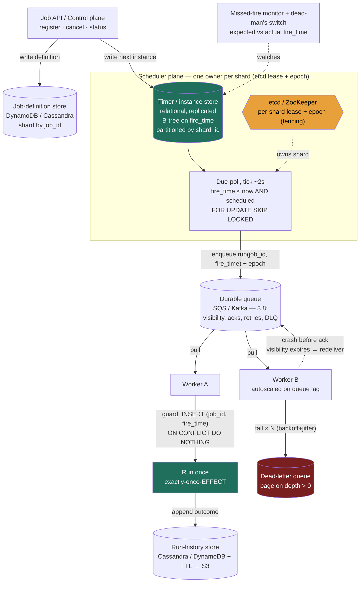

> This is the system-design *assembly* of the building block from Lesson 3.15 (Distributed Task Scheduler). 3.15 derived the hard primitives — the scheduler/executor split, leader election and its **failover gap**, **fencing with epochs**, and the thesis that **exactly-once-*effect* = at-least-once everywhere + idempotency on `(job_id, fire_time)`**. This lesson does the thing the interview actually asks: run the full **RESHADED** spine end-to-end, **size it in numbers** (jobs/sec, due-poll load, storage growth, fleet count), put a real **API and schema** on it, and stress the assembled design. Where 3.15 *derived* a primitive, here we *use* it and reference it by name — the value added is estimation, the data model, and the bottleneck math, not re-deriving the two "once"s.

### Learning objectives
- Run the full **RESHADED** spine on a control-plane problem whose load is **not** dominated by user traffic but by the **due-poll** (the "what's due now?" scan) and the **execution fan-out** — and recognize why that makes the timer-instance table, not the read path, the thing to size.
- **Estimate** the headline numbers from first principles: live timers, **fires/sec** (steady vs the midnight spike), **due-poll QPS** against the store, instance-table storage with growth, and the worker fleet — showing the math and rounding hard.
- Choose the **durable store** and the **scheduling structure** (relational time-index + poll vs Redis ZSET vs hierarchical timing wheel) from the access pattern, and place the in-memory structure correctly as an *acceleration index over* the durable source of truth.
- Put a concrete **API, schema, partition key, and indexes** on the design, then stress it: the **thundering herd**, the **due-poll hot scan**, the **leader as a single point**, and **write amplification** on status churn — fixing each with a named trade-off.
- Operate at **Director altitude**: tie every choice to a requirement, quantify the cost, default to **catch-up firing + idempotency**, and name where you'd **delegate the deep-dive** (the consensus layer, the queue).

### Intuition first
A job scheduler is the **dispatch desk of a 24-hour delivery depot.** Three things happen at that desk, and they are genuinely separate jobs. First, there is a **ledger bolted to the floor** that lists every delivery and the minute it is due to leave — written in permanent ink, because if the desk catches fire and is rebuilt, every future delivery must still be on the list (the durable store; a scheduler that keeps its timetable only in someone's head loses every future job the instant they go home). Second, **one dispatcher at a time** runs a finger down the ledger every few seconds asking "what is due in the next minute?" and calls those out — *one* dispatcher, because if two of them call the same delivery you load the same parcel onto two trucks (the elected **leader** doing the **due-poll**). Third, a **yard full of drivers** actually takes the parcels out, and trucks break down, get a flat, and come back — so the same delivery sometimes goes out twice (the **worker pool**, executing **at-least-once**). The entire craft is: keep the ledger in permanent ink, let exactly one dispatcher read it at a time, and — because both the calling-out *and* the driving can happen twice — **stamp every parcel with its delivery-number-and-slot so the warehouse refuses to load a duplicate** (idempotency on `(job_id, fire_time)`).

The thing this problem tests that the social-feed problems do not: the load here is not a crowd of users reading. It is the **dispatcher's finger running down the ledger** (the due-poll) and the **spike when half the deliveries are all scheduled for 9 a.m. sharp** (the midnight herd). Size *those*, not a read cache.

---

## R - Requirements

**Functional (the defensible core):**
1. **Register / cancel a job** — a one-shot ("run once at time T" or "in N minutes") or a recurring rule (a `cron` expression), with a payload, an owner, and a retry policy.
2. **Fire each job when due** — move it from `scheduled` to `enqueued` at (or shortly after) its `fire_time`, once per scheduled instant.
3. **Execute the job reliably** — run the work, with **retries + backoff** on failure and a **dead-letter** path for poison jobs.
4. **Report status / history** — let an owner query a job's state (`scheduled / running / succeeded / failed`) and recent runs.

**Explicitly CUT (scoping *is* the signal):** the **business logic of the jobs themselves** (we run an opaque handler / enqueue an opaque payload — we are the scheduler, not the work), DAG / inter-job dependencies (that's a workflow engine like Airflow/Temporal — a deliberate level up), sub-second / real-time scheduling (we target second-granularity; hard-real-time is a different machine), and the **execution runtime** (container packing, autoscaling internals — we hand work to a queue + worker pool and treat them as a reusable substrate from 3.8/3.15). Saying these out loud is the difference between a scoped Director answer and the "build all of cron + Airflow + Kubernetes" hand-wave.

**Clarifying questions I'd ask (and the assumptions I'll proceed on):**
- *How precise must firing be?* → **second granularity, a few seconds of slack is fine.** A nightly report that fires at 00:00:04 instead of 00:00:00 is correct. This permits a **poll-based** design (a tick every 1–5 s) instead of a hard real-time timer, and it is what makes the whole thing tractable.
- *What's the firing guarantee — exactly-once, at-least-once, at-most-once?* → the honest answer (from 3.15): **exactly-once *firing* across a leader death does not exist.** I'll deliver **at-least-once firing (catch-up) + idempotency on `(job_id, fire_time)`** = **exactly-once-*effect***, and offer at-most-once (skip-on-recovery) only where a stale run is worthless.
- *Scale?* → I'll size for **~100M live timers** firing at **tens of thousands/sec** steady — the number that forces the instance table to shard and forces me to confront the midnight herd.
- *Multi-tenant?* → **yes** — many owners, so I need per-tenant isolation/quotas later (one tenant's 50M-job backfill must not starve another's nightly billing). Flag it; it shapes partitioning.

**Non-functional requirements:**
- **Durability is the headline NFR.** A scheduled job must survive a process restart, a node loss, and an AZ outage. If a reminder is set for next Tuesday, it fires next Tuesday even if every scheduler process is replaced twice before then. Timers live in a **replicated store, never RAM-only.**
- **At-least-once execution with no *missed* must-run jobs**, de-duplicated to **exactly-once-effect** by idempotency.
- **Bounded firing lag** — p99 fire latency within a few seconds of `fire_time` under steady load; the **failover gap** (≈ lease TTL) is the one allowed exception, and it's covered by catch-up.
- **Visibility on the *non-event*** — a job that silently fails to fire must raise an alarm (the silent-miss problem; the operational NFR a Director owns).
- **Horizontal scale + tenant isolation** — add capacity to handle more timers/fires without re-architecting, and keep one tenant from starving another.

**Read:write skew — and why the usual framing is the wrong lens.** There is no big external read crowd here; status queries are a trickle. The load is **internal and self-generated**: every live timer produces, over its life, a small burst of writes (`scheduled → enqueued → running → succeeded`), and the **due-poll** scans the store on every tick whether or not anything is due. So the dominant cost is **write + scan throughput on the instance table**, not read QPS. The skew to state is **fires/sec and due-poll/sec**, both derived next — that inversion (control-plane, not user-facing) is the first thing this problem tests.

---

## E - Estimation

*Enough math to make a defensible call — round hard, state assumptions, show the knobs.*

**Live timers and fires/sec (the headline numbers):**
- Assume **100M live timers** (a mix of one-shots and the *next* instance of each recurring rule). This is the number the interviewer hands you, or you derive it: e.g. 50M users × ~2 active reminders/automations each.
- Spread perfectly uniformly across a day, the steady fire rate is `100M ÷ 86,400 s ≈ 1,160 fires/s` — call it **~1.2K/s average**. That is *small*; the average is a lie and naming why is the signal.
- **Fires are not uniform — they clump at round cron times.** Suppose **30%** of recurring jobs are pinned to a popular instant (midnight UTC, top of the hour): `0.30 × 100M = 30M` fires want the **same second**. Against a fleet draining at, say, **50K/s**, that backlog takes `30M ÷ 50K = 600 s = 10 minutes` to clear if fired naively — a once-a-day cliff. The *instantaneous* demand (30M fires in one second) is **~4 orders of magnitude above the 1.2K/s average**, and even a sane drain rate is **~40× the average**. **Headline: ~1.2K/s average, but a ~30M-fire midnight spike that must be smeared (see Evaluation).** The peak, not the average, sizes the system.
- Steady non-spike peak (excluding the herd): round to **~10K fires/s** to size the worker fleet and queue against realistic bursts.

**Due-poll QPS against the store (the cost the read-heavy framing misses):**
- The leader (or each shard owner) polls "give me everything with `fire_time ≤ now AND status='scheduled'`" every **tick = 2 s**. That's **0.5 queries/s per scanning node** — trivial in count, but each is an **indexed range scan** over a 100M-row table that returns a batch (`LIMIT N`, e.g. 1–10K rows) under `FOR UPDATE SKIP LOCKED`.
- With **16 shards**, that's `16 × 0.5 = 8 poll-scans/s` total, each touching its shard's slice. The cost is **not** the query *count*; it's the **lock + scan pressure** of repeatedly range-scanning the time index and claiming rows. This is the metric to watch, and it's why the store choice in S is load-bearing.

**Instance-table storage (with growth):**
- One **job-instance row** ≈ `job_id(8) + fire_time(8) + status(1) + attempt(2) + epoch(8) + worker_lease(16) ≈ 43 B`, call it **~100 B** with index and row overhead.
- **Live** instances (next firing per timer): `100M × 100 B = 10 GB`. Tiny — fits in a single node's buffer pool. The **live working set is not the problem.**
- **History** is the problem if you keep it. *Cumulative* storage tracks the **average** fire rate, not the burst: ~100M timers → ~100M fires/day → ~1.2K/s. A full run-history row (~200 B with timing, result code, worker id) accrues `1.2K/s × 200 B × 86,400 s/day ≈ 20 GB/day ≈ 7 TB/year`. That still **dwarfs the 10 GB live set ~700×** and grows **unbounded**, so it **must be tiered / TTL'd** (drop or archive run-history after, say, 30–90 days to S3) — otherwise the instance table that the hot poll scans bloats forever and the scan slows. *This is the real storage decision, and it falls straight out of E.*
- **Job definitions** (the recurring rules, payloads): `100M × ~1 KB = 100 GB` — modest, sharded, read on registration and to compute `next_fire_time`.

**Bandwidth:**
- Firing enqueues a tiny message (`job_id`, `fire_time`, epoch ≈ ~100 B) per fire: `10K/s × 100 B = 1 MB/s ≈ 8 Mbps` steady — negligible. Even the 30M-fire midnight smear at ~50K/s peaks at ~5 MB/s. **Bandwidth is a non-issue; this is a state-and-scan problem, not a byte-moving one.**

**Worker fleet (the executor):**
- The fleet sizes to the **fire rate × per-job CPU/IO**, not to the scheduler. If a job averages **200 ms** of work and one worker core handles `1 / 0.2 = 5 jobs/s`, then at the **1.2K/s average** the steady-state need is only `1.2K ÷ 5 ≈ 240 cores` — but the fleet must absorb **bursts**: at a **10K/s peak**, `10K ÷ 5 = ~2,000 worker cores`. The unsmeared midnight herd at ~50K/s would need ~5× *that* transiently — which is exactly why we **smear the herd and autoscale on queue lag** rather than provision the fleet for the raw peak (Evaluation). Fleet sizing tracks the *peak*, not the average; the job runtime is an *assumption to state* and the interviewer dials it.

**Scheduler/scanning fleet:** the scanning tier is cheap — **one scanning owner per shard** (16 shards → ~16 scanner processes, plus standbys), each doing a 2 s indexed poll. The spend is the **worker fleet and the durable store**, not the scanners.

**The one-line takeaway from E:** ~100M live timers = a **~10 GB live set (trivial)** but a **~7 TB/yr history firehose that must be tiered**, firing at **~1.2K/s average that hides a ~30M-fire midnight spike**, served by a worker fleet that's ~240 cores at the average but must burst to **~2,000 cores** at peak (autoscaled on lag) — so size the **instance table + herd + fleet**, and ignore the (tiny) read path.

---

## S - Storage

Three data classes with different needs; matching each to a store is the S step. (The structural primitives — why durable-not-RAM, why an in-memory index is *over* the store — were argued in 3.15; here I make the concrete picks and justify them against the E numbers.)

**1. Job definitions — the recurring rules (read-mostly, must persist, modest volume).**
- *Access pattern:* keyed by `job_id`; written on register/update; read to (re)compute `next_fire_time`. ~100 GB, low write rate.
- *Choice:* a **partitioned key-value / wide-column store** — **DynamoDB** or **Cassandra** — sharded by `job_id`. Durable, horizontally scalable, and we never need cross-row transactions on definitions.
- *Rejected:* a single relational instance — at 100M definitions across many tenants it must shard anyway, and we get no payoff from relational joins on opaque payloads. Use relational only if a tenant needs transactional definition+instance updates (most don't).

**2. Job instances / the timer store — the hot path (write-hot status churn, scanned every tick, must persist).**
- *Access pattern:* the **due-poll** (`WHERE fire_time ≤ now AND status='scheduled' ORDER BY fire_time LIMIT N FOR UPDATE SKIP LOCKED`), plus per-fire status writes (`scheduled→enqueued→running→done`). 10 GB live, must survive crashes, must support claim-without-double-claim.
- *Choice:* a **relational store with a B-tree index on `fire_time`** (**PostgreSQL**, or a sharded **MySQL/Aurora**), **partitioned by `shard_id` (= hash of `job_id`)**. Two reasons it wins here: (a) `FOR UPDATE SKIP LOCKED` gives **multiple scanners safe, contention-bounded claiming** of the same table without double-firing — the exact primitive Airflow 2.0 HA and Quartz clustering use; (b) the live set is only 10 GB, so the time index sits in RAM and the range scan is cheap. The **durable instance table is the source of truth.**
- *Optional acceleration:* a **Redis sorted set (ZSET) per shard** scored by `fire_time` (`ZRANGEBYSCORE timers -inf now`) as a **hot index *over*** the relational table, rebuilt from it on startup, for sub-second due-set lookup at extreme fire rates. **Rejected as the *only* copy:** Redis is AP-leaning (3.7) — async replication can lose a just-written timer, which for a scheduler means a **silently dropped future job**. ZSET-as-index, yes; ZSET-as-record, never. A **hierarchical timing wheel** (O(1) insert/tick, what Kafka uses for millions of delayed ops) is the move only at Kafka-scale timer counts — overkill here, and likewise an in-memory index rebuilt from the store.
- *Rejected for the timer store:* keeping timers **only** in an in-memory structure (timing wheel / ZSET) — a restart or replica-loss drops every future job. The cardinal sin of 3.15, restated.

**3. Run history — the firehose (write-once, append-only, read-rarely, must tier).**
- *Access pattern:* one row per fire outcome at the **average ~1.2K/s** (history accrues continuously, so it tracks the average, not the burst) = ~7 TB/yr; read only for debugging/audit; never on the hot path.
- *Choice:* an **append-optimized store with TTL** — **Cassandra** (LSM, write-optimized; recall 2.3 — this is the textbook write-heavy/append shape) or **DynamoDB with TTL**, **rolling cold rows to S3/Parquet** after 30–90 days. **Rejected:** keeping history in the relational instance table — it would bloat the very table the hot poll scans, slowing every due-poll. Separate the firehose from the index; this is the same "don't let the log live in the index" discipline as the metadata/blob split in 5.1.

**The scheduling *structure* choice** (relational poll vs ZSET vs timing wheel) is decided here against the access pattern; the **topology** (single leader vs decentralized vs sharded) is a High-level/Evaluation decision, below.

---

## H - High-level design



**Happy path, in prose:**
1. **Register.** An owner calls the **Job API** with a schedule (cron or one-shot) and payload. The control plane writes the **definition** to the definition store and computes the **first `fire_time`**, writing one **instance row** (`status='scheduled'`) to the timer store, partitioned by `shard_id = hash(job_id) % P`.
2. **Due-poll.** Each shard has exactly one **owner** (holding a per-shard **lease** in etcd, carrying a monotonic **epoch** for fencing). Every ~2 s the owner runs the due-poll against its shard: `SELECT … WHERE fire_time ≤ now() AND status='scheduled' ORDER BY fire_time LIMIT N FOR UPDATE SKIP LOCKED`, claiming a batch without double-claiming.
3. **Fire = enqueue.** For each claimed instance, the owner flips it to `enqueued` and puts a `run(job_id, fire_time)` message — **stamped with its lease epoch** — onto the durable queue. The scheduler does **no business logic**; firing is just "move from `scheduled` to the queue." For a recurring job, it also computes the *next* `fire_time` and writes the next instance row.
4. **Execute.** Stateless **workers** pull from the queue (all of 3.8's machinery: visibility timeout, acks, exponential backoff + jitter, DLQ). The worker's **first action is the idempotency guard** — `INSERT INTO job_runs(job_id, fire_time) … ON CONFLICT DO NOTHING` — so a redelivery (lost ack) or a duplicate fire (catch-up after a failover gap) collapses to **one effect**. It runs the handler, then appends the outcome to run-history and acks.
5. **Observe.** A **missed-fire monitor** compares each job's `expected_fire_time` to its `actual_enqueue_time`/run row and alarms on overdue; a **dead-man's switch** pages if a critical job's success ping never arrives — because a job that *didn't* fire is otherwise silent.

The split is visible: the **scheduler plane** only moves jobs `scheduled → enqueued`; the **queue + worker plane** owns the messy execution. A flood of slow jobs backs up in the queue (loud, autoscale on lag) and **does not stall the clock**.

---

## A - API design

Kept small — the four functional requirements map to a tight control-plane surface. Scheduling is a *write-then-callback* API, not a request/response data API.

```
# Register a job (one-shot or recurring). Idempotent by client-supplied key.
POST /v1/jobs
  body: {
    schedule:  { type: "cron", expr: "0 0 * * *", tz: "UTC" }    # OR
               { type: "once", at: "2026-07-01T09:00:00Z" }      # OR { type:"delay", seconds: 3600 }
    target:    { kind: "queue", topic: "billing" | "http", url: "..." }
    payload:   { ... },                                          # opaque to us
    retry:     { max_attempts: 5, backoff: "exponential", base_ms: 1000, jitter: true },
    fire_policy: "catch_up" | "skip",                            # at-least-once vs at-most-once firing
    idempotency_key: "<client-uuid>"                             # dedupe duplicate registrations
  }
  → 201 { job_id, next_fire_time }

# Cancel / pause / resume
DELETE /v1/jobs/{job_id}                  → 204
POST   /v1/jobs/{job_id}/pause            → 200 { status: "paused" }
POST   /v1/jobs/{job_id}/resume           → 200 { status: "scheduled", next_fire_time }

# Inspect a job and its recent runs (the trickle read path)
GET /v1/jobs/{job_id}                      → 200 { job_id, schedule, status, next_fire_time }
GET /v1/jobs/{job_id}/runs?limit=20        → 200 { runs: [ { fire_time, status, attempt, started, ended, result } ] }

# (Internal) worker callback if target.kind = "http": we POST the payload and treat 2xx as success
POST {target.url}   body: { job_id, fire_time, payload }   ← we expect 2xx; non-2xx → retry/backoff → DLQ
```

**Design notes (each a choice with its rejected alternative):**
- **`idempotency_key` on register** — a client retrying `POST /jobs` after a timeout must not create *two* recurring jobs. We **reject** non-idempotent creation: at 100M jobs, duplicate registrations are a real source of double-fires *before* any scheduler logic runs.
- **`fire_policy` is a first-class field, not a global mode** — different jobs want different firing guarantees (billing wants `catch_up`; "emit the current price" wants `skip`). We **reject** a single platform-wide policy because the right choice is **per-job and requirements-driven** (3.15).
- **The target is a *queue topic* or an *HTTP callback*, not inline execution** — we hand work to the executor substrate. We **reject** running the handler inside the scheduler call (monolithic cron): it couples firing accuracy to job duration and kills independent scaling/backpressure/DLQ.
- **No "list all due jobs" public endpoint** — the due-poll is internal and privileged; exposing it would invite a tenant to scan the global timer space. We **reject** leaking the scan as an API.

---

## D - Data model

**Job definition (the recurring rule) — definition store, sharded by `job_id`:**

| Field | Type | Notes |
|---|---|---|
| `job_id` | uuid / int64 | **partition key** |
| `tenant_id` | int64 | for isolation / quotas |
| `schedule` | json | cron expr + tz, or one-shot timestamp |
| `target` | json | queue topic or HTTP callback |
| `payload` | blob | opaque |
| `retry_policy` | json | max attempts, backoff, jitter |
| `fire_policy` | enum | `catch_up` / `skip` |
| `status` | enum | `active` / `paused` / `cancelled` |

**Job instance / run (one row per scheduled firing) — timer store, the hot table:**

| Field | Type | Notes |
|---|---|---|
| `job_id` | uuid / int64 | **part of the idempotency key** |
| `fire_time` | int64 (epoch s) | **the other half of the key**; **B-tree indexed** |
| `shard_id` | int16 | `hash(job_id) % P` — **partition key** |
| `status` | enum | `scheduled → enqueued → running → succeeded / failed` |
| `attempt` | int16 | execution attempt count |
| `epoch` | int64 | fencing token from the owning lease |
| `worker_lease` | uuid | who's running it (visibility) |
| `enqueued_at` / `started_at` / `ended_at` | int64 | timing for the missed-fire monitor |

- **Primary key / uniqueness:** **`(job_id, fire_time)`** is the **unique constraint that *is* the idempotency guard** — the worker's `INSERT … ON CONFLICT DO NOTHING` on this key is what makes a retry (same `fire_time`) a no-op while the next recurrence (different `fire_time`) is a distinct row. *The scheduled instant must be in the key* — `job_id` alone would suppress the legitimate next recurrence; a fresh per-attempt id would double-run on retry (3.15's central point, now enforced as a schema constraint).
- **Hot index:** a **B-tree on `(shard_id, fire_time)`** so the due-poll is an indexed range scan within a shard. This is the only index that matters on the hot path. We **reject** secondary indexes on `status`/`tenant` *on the hot table* — each taxes every status write (2.3's secondary-index tax) at 10K writes/s; filter `status` inline in the scan instead.
- **Partition / shard key = `shard_id = hash(job_id) % P`.** This is the load-bearing decision: hashing `job_id` spreads timers evenly across `P` shards so **each shard owner scans only its slice with no cross-shard contention**, and adding shards remaps only `~1/P` of jobs (consistent hashing, 2.6). We **reject sharding by `fire_time`** (e.g. a partition per hour) — it would make the *current* hour's partition a **monstrous hot shard** (every due job lives in one partition) while future partitions sit idle: the textbook time-as-partition-key anti-pattern.
- **Where data lives:** live instances in the replicated relational timer store (10 GB, RAM-resident index); definitions in the partitioned KV store; **run-history rolled to Cassandra/DynamoDB with TTL → S3** so the hot table never carries the ~7 TB/yr firehose.

---

## E - Evaluation

Re-check against the NFRs, then break the design on purpose. Five bottlenecks, each fixed with a *named* trade-off.

**Bottleneck 1 — the thundering herd at round cron times (the signature failure).**
From E: **30M fires** clustered at midnight UTC against a fleet draining **50K/s** = a **600-second (10-minute) cliff** of latency *and* a synchronized load spike on every downstream those jobs touch (DB, payment gateway, email provider). The average rate (~1.2K/s) is irrelevant; the instantaneous spike is **~4 orders of magnitude above it** and it recurs daily.
*Fix — **jitter / a fire window**:* spread each job's actual fire across a window by hashing `job_id` into a sub-window offset (e.g. randomize within a **5-minute** window). 30M fires then smear across **300 s at ~100K/s** — or widen to a 30-minute window for **~17K/s**, a flat curve the steady fleet handles with no autoscale spike. **Trade:** we give up a few minutes of fire *precision* — irrelevant for the jobs that cluster (a nightly report or bill cares about the *date*, not 00:00:00.000). **Rejected alternative:** provision the worker fleet *and* every downstream for the 50K/s peak — multiples of idle capacity the other 86,000+ seconds of the day, at multiples of the cost. This is a pure Director cost/risk call and it's the gem that signals you've operated a scheduler.

**Bottleneck 2 — the due-poll hot scan (the cost the read-framing misses).**
A single leader range-scanning a 100M-row table every tick, claiming rows under `FOR UPDATE`, is the scaling ceiling: one node's scan + lock throughput caps the whole platform, and the scan slows as the table (especially if history leaked into it) grows.
*Fix:* **partition the timer space** — `P` shards by `hash(job_id)`, one owner per shard (per-shard etcd lease), each polling only its slice. 16 shards → **16× scan/claim throughput**, each scanning ~6M rows, and a failure confines to 1/16th of timers. Keep history out of this table (S) so the index stays RAM-resident. **Trade:** **rebalancing on churn** — a dead owner's shards must be reassigned, with a brief per-shard failover gap during handoff. **Rejected alternative:** a single global leader scanning everything — simplest to reason about, but a SPOF whose scan/lock throughput is a hard ceiling and whose failover gap stalls *all* firing, not 1/16th. (Decentralized contention — many schedulers racing `FOR UPDATE SKIP LOCKED` on one store, Airflow-2.0-HA style — is the middle option: no failover gap, but the **shared lock** becomes the contention point at extreme fire rates. Pick sharding when you must scale past one store; pick decentralized when availability matters more than peak throughput.)

**Bottleneck 3 — the leader as a single point + the failover gap + the zombie (correctness under failure).**
If the shard owner dies, no one fires that shard's due jobs for up to the **lease TTL** (say **10 s**) — the **failover gap**. Worse, a paused-then-resumed owner (long GC) can wake up still believing it owns the shard and **double-fire** across the handoff.
*Fix:* (a) the gap is covered by **catch-up firing** — the new owner re-fires anything whose `fire_time` passed but never enqueued; (b) the double-fire is stopped by **epoch fencing** — every enqueue carries the lease epoch, and the store rejects an enqueue/claim stamped with a stale epoch (a CAS on the epoch). Both are *delegated*: election and leases to **etcd/ZooKeeper**, not hand-rolled. **Trade:** shorten the TTL to shrink the gap and you risk **false failovers** (a GC pause looks like death → unnecessary election, the same timeout-tuning trade as replica failover in 2.4). You **cannot** make firing exactly-once-on-time across a death; you choose the gap length and let **idempotency absorb the resulting duplicates**. **Rejected alternative:** no fencing — a zombie double-fires; or a tighter TTL with no false-failover budget — flapping leadership.

**Bottleneck 4 — duplicate execution (at-least-once on *both* sides).**
Firing is at-least-once (catch-up + possible zombie). Execution is at-least-once (a worker finishes then crashes before ack → visibility timeout → redelivery → runs twice). **Two independent duplicate sources.**
*Fix:* **idempotency keyed on `(job_id, fire_time)`** — the unique constraint + `INSERT … ON CONFLICT DO NOTHING` in the data model — collapses duplicates from *either* source to **exactly-once-effect**, while the next recurrence stays distinct. **Trade:** the guard is an extra write on the hot path (a conditional insert per execution) — cheap insurance, and the *only* thing that survives at-least-once on both sides. **Rejected alternative:** chasing true exactly-once *delivery/firing* — it doesn't exist across failures (3.15/3.8); pretending it does is the single most common altitude miss here.

**Bottleneck 5 — write amplification on status churn (the per-fire write tax).**
Each fire writes the instance row 3–4 times (`scheduled→enqueued→running→done`) plus a history row — at 10K fires/s that's **~40K instance writes/s + 10K history writes/s**, and on a B-tree (2.3) each in-place status update is random I/O + index maintenance.
*Fix:* keep the hot instance table **lean** (no secondary indexes, minimal columns), push the **append-only history to an LSM/Cassandra+TTL** store (write-optimized, sequential — 2.3) rather than the relational table, and **batch** status transitions where possible (claim a batch, enqueue, single `UPDATE … WHERE id IN (…)`). **Trade:** batching widens the window in which a claimed-but-not-yet-enqueued row sits locked (slightly more failover-gap exposure on a crash mid-batch) — acceptable for the write-amplification relief. **Rejected alternative:** one fat table holding live instances *and* full history with rich indexes — every status write maintains every index and the scan walks bloated pages; the design grinds at 10K/s.

**Re-check vs NFRs:** durability (replicated relational source of truth, never RAM-only ✓); no missed must-run jobs (catch-up firing + idempotency ✓); bounded fire lag (2 s tick + sharded poll keeps p99 within seconds; failover gap is the named exception ✓); silent-miss visibility (missed-fire monitor + dead-man's switch ✓); horizontal scale + isolation (shard by `hash(job_id)`, per-tenant quotas next ✓); midnight herd (jitter window ✓).

---

## D - Design evolution

**At 10× (1B live timers, ~100K fires/s steady, a ~300M-fire midnight herd):**
- **Shard the timer store far wider** — from 16 to ~**160 shards** (each ~6M rows, the same per-shard scan cost), each with its own lease and owner. Throughput scales ≈linearly in shard count; the per-shard design is unchanged, which is the point of partitioning by `hash(job_id)`.
- **The herd dominates** — a 300M-fire spike needs an even **wider jitter window** (e.g. 30–60 min) and/or a **token-bucket admission** in front of fragile downstreams (the payment gateway can absorb only X/s regardless of how fast we fire). Trade: more fire imprecision and a queue that holds the smeared backlog — fine, because the queue is durable and the *date*-level precision is what matters.
- **Promote the hot due-set to an in-memory index per shard** (Redis ZSET or a timing wheel) *over* the durable table when the relational poll's lock throughput saturates — rebuilt from the store on restart (3.15). Trade: a second moving part and a rebuild-on-failover cost, taken only when the poll is provably the bottleneck.
- **Tier history aggressively** — at 1B fires/day (~11.6K/s average), history is **~70 TB/yr**; TTL to 14–30 days hot, roll to **S3/Parquet** for audit. The hot table never carries it.

**Under a new constraint — strict per-tenant fairness (multi-tenant noisy neighbor):**
- A single tenant scheduling a 200M-job backfill must not starve another tenant's nightly billing. Add **per-tenant queues / weighted fair queuing** in the executor and **per-tenant due-poll quotas** so one tenant's herd can't monopolize a shard's scan budget. Trade: more scheduling machinery and per-tenant accounting; the alternative (one global FIFO) lets the loudest tenant set everyone's latency.

**Hardest trade-offs to defend:**
- **Firing precision vs load flatness** — the jitter window is a genuine dilemma: tight windows give punctual fires but a midnight cliff; wide windows flatten load but blur fire time. The honest answer is *requirements-driven per job* — clustered batch jobs get a wide window (date matters, not the second), the rare must-fire-now job opts out. This is *why* you expose `fire_window` per job rather than picking one global value.
- **Single leader vs decentralized vs sharded** — availability (decentralized, no gap) vs peak throughput (sharded) vs simplicity (single leader). Named in Evaluation; the call follows from whether your pain is the failover gap or the store's lock ceiling.
- **History retention vs cost vs auditability** — ~7 TB/yr (or ~70 TB at 10×) forces a TTL, but compliance/billing may demand long retention. Resolve by **tiering** (hot relational-adjacent for days, cold S3/Parquet for years), not by bloating the hot table.

**What I'd revisit:** whether the relational poll suffices or a per-shard in-memory timing wheel is warranted — **I'd benchmark the due-poll's lock throughput under real fire rates before committing**, not assert it. And whether to adopt a workflow engine (Temporal/Airflow) if DAG dependencies creep into scope — that's a build-vs-buy I'd surface early rather than grow our scheduler into one.

**Where I'd delegate the deep-dive (the Director move):**
- **Consensus / leader election** — *"I delegate election and leases to **etcd or ZooKeeper** behind a lease+epoch interface; I will not hand-roll Raft on the whiteboard. My prior is etcd for the lighter operational footprint, but I'd let the platform team own the consensus SLA and the TTL tuning."* Naming the boundary beats deriving Paxos two levels too low.
- **The queue / executor substrate** — *"Execution is the consumer side of 3.8 — SQS or Kafka with visibility timeouts, retries, and a DLQ. I'd have the messaging team own queue capacity and the worker autoscaler keyed on lag; the scheduler just enqueues `(job_id, fire_time)`."*
- **Cron-expression parsing & timezone/DST correctness** — deceptively deep (DST transitions, leap seconds, `0 0 * * *` across a spring-forward). *"I'd use a battle-tested library and have a small owner verify DST edge cases against a test matrix, not improvise timezone math live."*

---

## Trade-offs table — the pivotal decisions

| Decision | Option A | Option B | Option C | Use when… |
|---|---|---|---|---|
| **Scheduling structure ("what's due now?")** | **Relational time-index + poll** — B-tree on `fire_time`, `FOR UPDATE SKIP LOCKED` per tick | **Redis ZSET** — `ZRANGEBYSCORE`, O(log N + M), sub-second | **Hierarchical timing wheel** — O(1) insert/tick (Kafka-style) | **A: durability + transactional claim first (the default — Airflow/Quartz).** B: hot *index over* a durable store; need sub-second due-set; back it durably (AP loss risk). C: millions of in-flight short timers; rebuild-from-store on restart is fine. |
| **Scheduler topology (where firing is serialized)** | **Single elected leader** (etcd lease + epoch) | **Decentralized contention** (`FOR UPDATE SKIP LOCKED`, Airflow-2.0-HA / Quartz cluster) | **Partitioned / sharded by `job_id`** (per-shard lease) | A: modest scale, simplest correct design, one place to reason about firing (but SPOF + failover gap). B: availability matters, fire rate within one store's lock throughput (no gap, but the shared lock is the ceiling). **C: 100M+ timers, must scale past one store (≈linear, cost is rebalancing on churn).** |
| **Firing guarantee** | **At-least-once (catch-up)** + idempotency | **At-most-once (skip-on-recovery)** | — | **A: the run *must* happen — billing, reports, pipelines (the default); duplicates absorbed by idempotency on `(job_id, fire_time)`.** B: a *stale* run is worse than no run — "emit the current price/metric"; skip what you missed. (Exactly-once firing across a death **does not exist** — don't offer it.) |

---

## What interviewers probe here (Director altitude)

- **"What actually drives the load — where's the cost?"** — *Strong signal:* names it as a **control-plane** problem: not a read crowd but the **due-poll scan** + **execution fan-out**, with a **~1.2K/s average that hides a ~30M-fire midnight herd** and a **~7 TB/yr history firehose** — and sizes those, not a read cache. *Red flag:* sizes it like a web app (giant read tier, ignores the herd and the scan).
- **"How do you guarantee a job runs exactly once?"** — *Strong:* "Exactly-once *firing* across a leader death doesn't exist — a failover gap can miss, a zombie can double. Both firing and execution are **at-least-once**; I make the worker **idempotent on `(job_id, fire_time)`** — a unique constraint — for exactly-once-*effect*. The fire-time is *in* the key, so a retry dedupes but the next recurrence doesn't." *Red flag:* "I elect a leader, so it fires once" — the checkbox fallacy, missing that firing *and* execution are two duplicate sources.
- **"Everything's scheduled for midnight — what breaks, and the number?"** — *Strong:* **thundering herd**; quantifies (e.g. 30M fires ÷ 50K/s ≈ 600 s) and **smears with a jitter window**, trading fire precision for a flat curve and a far smaller fleet + downstream capacity. *Red flag:* doesn't see the clustering, or "we'll autoscale the workers" with no numbers and no jitter.
- **"How do you scale past one scheduler / one store?"** — *Strong:* **partition the timer space by `hash(job_id)`** (one owner per shard, per-shard lease), ≈linear throughput, names **rebalancing on churn** as the cost; knows the decentralized `FOR UPDATE SKIP LOCKED` option and that the **shared lock** is its ceiling; and **shards by `job_id`, never by `fire_time`** (which makes the current bucket a hot shard). *Red flag:* "add scheduler instances" with no double-fire or lock-bottleneck story; or partitions by time.
- **"A nightly job silently didn't run — how would you have caught it?"** — *Strong:* a **missed-fire monitor** (expected vs actual fire) + a **dead-man's switch** for critical jobs — a missed run is *silent* and must be alarmed proactively, not discovered by the customer/finance days later. *Red flag:* relies on logs/luck; no observability for the non-event.
- **"What's the dominant cost, and where do you delegate?"** — *Strong:* the **worker fleet (~2,000 cores) + the durable store + history tiering** are the line items; the levers are the **jitter window** (smaller peak fleet) and **autoscaling on lag**; delegates **consensus to etcd/ZK** and the **queue to the messaging team** behind clean interfaces, with stated priors. *Red flag:* hand-rolls Raft/queue internals on the whiteboard (too deep), or hand-waves "it scales horizontally" (too high).

---

## Common mistakes

- **Sizing it like a read-heavy web service.** The load is the **due-poll + execution fan-out**, not external reads; the costs are the **midnight herd** and the **history firehose**. Mis-sizing this mis-designs everything.
- **"Leader election gives exactly-once firing."** It gives no *concurrent* double-fire — nothing more. Failover gaps miss; zombies double (without fencing). Net correctness needs **idempotency on `(job_id, fire_time)`** (3.15).
- **Keying idempotency on `job_id` alone** (suppresses the legitimate next recurrence) **or a fresh per-attempt id** (double-runs on retry). The key must include the **scheduled instant**.
- **Partitioning the timer store by `fire_time`/hour.** Makes the *current* bucket a monstrous hot shard while future buckets idle. Shard by **`hash(job_id)`** for even spread.
- **In-memory- or Redis-only timers.** A restart or async-replica loss silently drops future jobs; the durable store is the source of truth (3.7).
- **Letting run-history live in the hot instance table.** ~7 TB/yr (growing unbounded) bloats the very table the due-poll scans. Tier history to an append store + TTL → S3 (2.3's write-heavy shape).
- **Coupling firing to execution (monolithic cron).** One slow job blocks the next minute's fires; no independent scaling, backpressure, or DLQ. Split scheduler from executor via a queue (3.8).
- **No fencing on the lease.** A paused-then-resumed owner double-fires across the handoff; epoch fencing tokens (2.4) are mandatory.
- **No missed-fire observability.** A job that *didn't* run is silent; without a dead-man's switch the customer finds the bug first.

---

## Interviewer follow-up questions (with model answers)

**Q1. Estimate the fires/sec and the due-poll load for 100M live timers, and say why the *average* is misleading.**
> *Model:* Spread uniformly, `100M ÷ 86,400 s ≈ 1.2K fires/s` — *small*. But fires **clump at round cron times**: if 30% pin to midnight UTC, that's **30M fires in one second** — ~4 orders of magnitude above the 1.2K/s average — and against a fleet draining ~**50K/s** the backlog clears in `30M ÷ 50K = 600 s`, a daily 10-minute cliff. So I size for the **peak (the herd), not the average**, and smear it with a jitter window. The **due-poll** itself is cheap in *count* — one indexed range scan every ~2 s per shard (16 shards → ~8 scans/s total) — but each is a `FOR UPDATE SKIP LOCKED` claim over the time index; the cost is **lock + scan pressure**, which is why I shard the timer table by `hash(job_id)` and keep history out of it. The storage that matters isn't the **10 GB live set** (trivial) — it's the **~7 TB/yr run-history firehose** (one row per fire at the ~1.2K/s average, growing unbounded), which must be tiered.

**Q2. A teammate says "we'll elect a leader scheduler, so each job fires exactly once." Pressure-test that.**
> *Model:* Leader election only stops *two schedulers firing the same job simultaneously* — it does **not** give exactly-once firing. Two gaps remain: (1) when the owner dies, there's a **failover window** ≈ the lease TTL where *no one* fires, so jobs due then are **late or missed**; (2) a **zombie leader** — paused, lost its lease, resumed thinking it still owns the shard — **double-fires** unless every enqueue is **fenced with a monotonic epoch** the store rejects when stale. So firing is at-least-once at best, and execution (the queue, 3.8) is *also* at-least-once. The real guarantee is **exactly-once-*effect***: make the worker **idempotent on `(job_id, fire_time)`** via a unique constraint + `INSERT … ON CONFLICT DO NOTHING`, so duplicates from either source collapse to one effect while the next recurrence (a different `fire_time`) still runs. That, plus epoch fencing and a chosen catch-up policy, is the correct claim — not "the leader makes it exactly-once."

**Q3. Why shard the timer table by `hash(job_id)` and not by `fire_time`? Walk through what breaks.**
> *Model:* The due-poll always asks for rows whose `fire_time ≤ now`. If I **partition by time** (say one partition per hour), then **every due job at any instant lives in the single *current* partition** — that partition is a screaming hot shard taking all the scan, lock, and write load, while every future partition sits idle. I've concentrated load instead of spreading it: the textbook time-as-partition-key anti-pattern. **Hashing `job_id`** spreads the 100M timers evenly across `P` shards, so each shard owner scans only its ~`100M/P` slice with **no cross-shard contention**, throughput scales ≈linearly in `P`, and adding a shard remaps only `~1/P` of jobs (consistent hashing, 2.6). The `fire_time` index still does the time-ordering *within* each shard's scan — I just don't make time the partition key. The cost I name is **rebalancing on churn** (a dead owner's shards get reassigned with a brief per-shard gap), which is far cheaper than a permanent hot shard.

**Q4. When would you choose at-most-once firing (skip) over at-least-once (catch-up)? Give a concrete case of each.**
> *Model:* **At-least-once / catch-up** when the run *must happen* and a late run still has value — **billing, report generation, data pipelines**: if a failover gap missed the nightly billing fire, I want the recovered owner to fire it late; idempotency on `(account_id, billing_date)` makes any duplicate a no-op, so catch-up is safe. **At-most-once / skip** when a *stale* run is worse than no run — **"emit the current price/metric every minute"**: a 5-minute-old price emitted after recovery is misleading, so I skip the missed fires and resume from now. Kubernetes CronJob exposes exactly this knob and even refuses to start if it finds **>100 missed schedules** — a guard against stampeding with a backlog of stale runs. The decision is purely *requirements*: does a delayed run still carry value (catch up), or is freshness the point (skip)? That's why `fire_policy` is a **per-job** field, not a global mode.

**Q5. The run-history table is growing ~7 TB/year (and unbounded) and your due-poll is slowing down. Diagnose and fix.**
> *Model:* The likely cause is **history bloating the hot instance table** — if outcomes are appended to the same table the due-poll scans, the B-tree pages and the `fire_time` index grow without bound, so every indexed range scan walks more pages and the scan (and `FOR UPDATE` lock hold) slows. The fix is to **separate the firehose from the index**: keep the **live instance table lean** (only `scheduled`/in-flight rows, minimal columns, the `(shard_id, fire_time)` index, **no secondary indexes**), and write run **outcomes to an append-optimized store** — Cassandra (LSM, write-friendly — 2.3) or DynamoDB — with a **TTL** that drops rows after 14–90 days and **rolls cold history to S3/Parquet** for audit. I'd also **purge or archive completed instance rows** out of the hot table promptly so its working set stays ≈ the live set (~10 GB, RAM-resident). Trade-off: history queries now hit a separate, slower-to-query store and audit reads cross to S3 — acceptable, because history is read rarely and the **hot due-poll latency is the thing on the critical firing path**. This is the same "don't let the log live in the index" discipline as the metadata/blob split in 5.1.

---

### Key takeaways
- This is a **control-plane** problem: the load is the **due-poll scan** + **execution fan-out**, not a user read crowd. Size the **timer-instance table, the midnight herd, and the worker fleet** — `100M live timers ≈ 10 GB live (trivial)` but `~7 TB/yr history, unbounded (must tier)`, firing at `~1.2K/s average that hides a ~30M-fire midnight spike`, served by a fleet that bursts to `~2,000 cores` at peak, autoscaled on lag.
- **Timers live in a durable, replicated store as the source of truth** — a **relational time-index + `FOR UPDATE SKIP LOCKED`** is the default (durable, transactional, safe multi-scanner claim); a Redis ZSET or timing wheel is only an **in-memory acceleration index rebuilt on restart**, never the only copy (3.7).
- **Exactly-once-*effect* = at-least-once everywhere + idempotency keyed on `(job_id, fire_time)`** — enforced as a **unique constraint** so a retry dedupes against its own firing while the next recurrence is distinct. Leader election (delegate to **etcd/ZK**) prevents *concurrent* double-fire and nothing more; the **failover gap** misses and a **zombie double-fires unless fenced with epochs** (2.4). Firing is a per-job choice: **catch-up (default)** vs **skip**.
- **Scale by partitioning the timer space by `hash(job_id)`** (≈linear, cost = rebalancing on churn) — and **never by `fire_time`** (which makes the current bucket a hot shard). **Quantify the thundering herd** and **smear it with a jitter window**, trading fire precision for a flat load curve and a smaller fleet.
- **Director moves:** quantify the cost (worker fleet + store + history tiering; levers are the jitter window and autoscaling on lag), build the **dead-man's switch** for the silent-miss non-event, **default to catch-up + idempotency**, and **delegate** consensus (etcd/ZK), the queue (3.8), and cron/DST parsing behind clean interfaces with stated priors — know where your depth ends.

> **Spaced-repetition recap:** Delivery-depot dispatch desk — **ledger in permanent ink** (durable timer store, never RAM-only), **one dispatcher reads it at a time** (elected per-shard leader doing the due-poll, fenced by epoch so a zombie can't double-call), **drivers take parcels out at-least-once** (queue + workers = 3.8). Size the **control plane**: ~100M timers = ~10 GB live but ~7 TB/yr history, unbounded (tier it), ~1.2K/s average hiding a ~30M-fire **midnight herd** (smear with a jitter window), fleet bursting to ~2,000 cores. The guarantee is **exactly-once-*effect* = idempotency on `(job_id, fire_time)`** (the scheduled instant must be *in* the key); **shard by `hash(job_id)`, never by `fire_time`**; and **alarm the silent miss** with a dead-man's switch.

---

*End of Lesson 5.14. This assembles the building block from 3.15 into a full RESHADED design — and the lesson is that **the R and E steps reframe the whole problem**: a scheduler is not a read-serving system but a control plane whose load is the due-poll and the herd, which is why we size the timer table and the midnight spike, not a cache. Next: 5.15 ChatGPT / LLM serving — the GPU-bound, batched-inference problem.*
