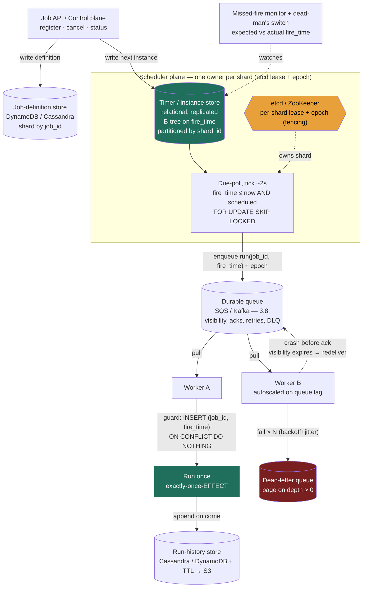

> This is the system-design *assembly* of the building block from Lesson 3.15 (Distributed Task Scheduler). 3.15 derived the hard primitives, the scheduler/executor split, leader election and its **failover gap**, **fencing with epochs**, and the thesis that **exactly-once-*effect* = at-least-once everywhere + idempotency on `(job_id, fire_time)`**. This lesson runs the full **RESHADED** spine, sizes it in numbers, and stresses the assembled design, using the primitives by name, not re-deriving them.

### Learning objectives
- Run **RESHADED** on a control-plane problem whose load is the **due-poll** and the **execution fan-out**, not user traffic, and size the timer-instance table accordingly.
- Estimate fires/sec (steady vs the **midnight spike**), due-poll load, storage growth, and the worker fleet from first principles.
- Choose the durable store and scheduling structure from the access pattern, placing any in-memory structure as an *acceleration index over* the durable source of truth.
- Stress the design: thundering herd, due-poll hot scan, leader as single point, status-churn write amplification, fixing each with a named trade-off.
- Operate at Director altitude: default to **catch-up firing + idempotency**, and delegate the consensus layer and the queue.

### Intuition first
A job scheduler is the **dispatch desk of a 24-hour delivery depot.** Three genuinely separate jobs happen there. A **ledger bolted to the floor** lists every delivery and its due minute, in permanent ink, if the desk burns down and is rebuilt, every future delivery is still on the list (the durable store; a scheduler keeping its timetable in RAM loses every future job on restart). **One dispatcher at a time** runs a finger down the ledger asking "what's due in the next minute?", one, because two dispatchers calling the same delivery loads the same parcel onto two trucks (the elected **leader** doing the **due-poll**). And a **yard of drivers** takes parcels out, trucks break down and come back, so the same delivery sometimes goes out twice (the **worker pool**, **at-least-once**). The craft: permanent ink, one reader, and, because the calling-out *and* the driving can both happen twice, **stamp every parcel with its delivery-number-and-slot so the warehouse refuses a duplicate** (idempotency on `(job_id, fire_time)`).

What this problem tests that the social-feed problems don't: the load isn't a crowd of users reading. It is the dispatcher's finger on the ledger (the due-poll) and the **spike when half the deliveries are scheduled for 9 a.m. sharp** (the midnight herd). Size *those*, not a read cache.

---

## R - Requirements

**Functional (the defensible core):**
1. **Register / cancel a job**, one-shot or recurring (cron), with payload, owner, retry policy.
2. **Fire each job when due**, `scheduled → enqueued` at its `fire_time`, once per scheduled instant.
3. **Execute reliably**, retries + backoff, a **dead-letter** path for poison jobs.
4. **Report status/history**, owners query state and recent runs.

**Explicitly CUT (scoping *is* the signal):** the jobs' **business logic** (we run an opaque handler, we are the scheduler, not the work), DAG/inter-job dependencies (that's Airflow/Temporal, a deliberate level up), sub-second/real-time scheduling (we target second granularity), and the execution runtime internals (we hand work to a queue + worker pool, the 3.8/3.15 substrate).

**Clarifying questions (with assumptions):**
- *Firing precision?* → **second granularity, a few seconds of slack is fine**, which permits a poll-based design (tick every 1-5 s) and makes the whole thing tractable.
- *Firing guarantee?* → the honest answer (3.15): **exactly-once firing across a leader death does not exist.** I deliver **at-least-once firing (catch-up) + idempotency on `(job_id, fire_time)` = exactly-once-effect**, with at-most-once (skip) where a stale run is worthless.
- *Scale?* → **~100M live timers**, tens of thousands of fires/sec at peak, forces sharding and the midnight-herd confrontation.
- *Multi-tenant?* → **Yes**, per-tenant isolation/quotas later; one tenant's 50M-job backfill must not starve another's billing.

**Non-functional requirements:**
- **Durability is the headline NFR.** A job set for next Tuesday fires next Tuesday even if every scheduler process is replaced twice. Timers live in a **replicated store, never RAM-only**.
- **At-least-once execution, no missed must-run jobs**, de-duplicated to exactly-once-effect.
- **Bounded firing lag**, p99 within a few seconds of `fire_time`; the failover gap (≈ lease TTL) is the named exception, covered by catch-up.
- **Visibility on the non-event**, a silently missed fire must alarm (the operational NFR a Director owns).
- **Horizontal scale + tenant isolation.**

**Read:write skew, the wrong lens here.** Status queries are a trickle; the load is **internal and self-generated**: status-transition writes per fire plus the due-poll scanning the store every tick. The dominant cost is **write + scan throughput on the instance table**, not read QPS. That inversion, control plane, not user-facing, is the first thing this problem tests.

---

## E - Estimation

*Enough math to make a defensible call, round hard, state assumptions.*

**Live timers and fires/sec (the headline):**
- **100M live timers** (one-shots + the *next* instance of each recurring rule).
- Uniformly spread: `100M ÷ 86,400 ≈ 1.2K fires/s average`. Small, and **the average is a lie**.
- **Fires clump at round cron times.** If 30% pin to midnight UTC, **30M fires want the same second**, ~4 orders of magnitude above the average. Against a fleet draining 50K/s, the naive backlog takes `30M ÷ 50K = 600 s`, a daily 10-minute cliff. **The peak, not the average, sizes the system** (smeared in Evaluation).
- Steady non-spike peak: round to **~10K fires/s** to size fleet and queue.

**Due-poll load (the cost the read-heavy framing misses):** each shard owner polls `fire_time ≤ now AND status='scheduled'` every ~2 s, with 16 shards, ~8 poll-scans/s total. Trivial in *count*; the cost is the **lock + scan pressure** of repeatedly range-scanning the time index and claiming rows under `FOR UPDATE SKIP LOCKED`. That's the metric to watch, and why the store choice is load-bearing.

**Instance-table storage:**
- Live instances: `100M × ~100 B = 10 GB`, fits in one node's buffer pool. **The live set is not the problem.**
- **History is.** It accrues at the *average* rate: ~100M fires/day × ~200 B ≈ **20 GB/day ≈ 7 TB/year, unbounded**, ~700× the live set. It **must be tiered/TTL'd** (30-90 days hot, then S3), or the table the hot poll scans bloats forever. *This is the real storage decision.*
- Job definitions: `100M × ~1 KB = 100 GB`, modest, sharded.

**Bandwidth:** fire messages are ~100 B; even the smeared herd peaks at ~5 MB/s. **A state-and-scan problem, not a byte-moving one.**

**Worker fleet:** sized by fire rate × per-job work. At ~200 ms/job (5 jobs/s/core): average needs ~240 cores, but the **10K/s peak needs ~2,000 cores**, and the unsmeared herd ~5× that, which is exactly why we **smear the herd and autoscale on queue lag** rather than provision for the raw peak. The scanning tier is cheap (~16 scanner processes + standbys); the spend is the **worker fleet and the durable store**.

**One-line takeaway:** ~100M timers = a trivial 10 GB live set but a ~7 TB/yr history firehose to tier, ~1.2K/s average hiding a ~30M-fire midnight spike, a fleet bursting to ~2,000 cores, size the **instance table + herd + fleet**, ignore the tiny read path.

---

## S - Storage

Three data classes (the structural primitives, durable-not-RAM, index-over-store, were argued in 3.15; here are the concrete picks against the E numbers).

**1. Job definitions (read-mostly, modest).** Keyed by `job_id`, ~100 GB, low write rate. **Choice: DynamoDB/Cassandra sharded by `job_id`.** *Rejected:* a single relational instance, must shard anyway at 100M rows, and joins buy nothing on opaque payloads.

**2. Job instances / the timer store (the hot path).** The due-poll (`WHERE fire_time ≤ now AND status='scheduled' ORDER BY fire_time LIMIT N FOR UPDATE SKIP LOCKED`) plus per-fire status writes; 10 GB live; must support claim-without-double-claim.
- **Choice: a relational store with a B-tree on `fire_time`** (Postgres / sharded MySQL/Aurora), **partitioned by `shard_id = hash(job_id)`**. Two reasons: `FOR UPDATE SKIP LOCKED` gives multiple scanners safe, contention-bounded claiming (the primitive Airflow 2.0 HA and Quartz clustering use), and the 10 GB live set keeps the time index RAM-resident. **The durable instance table is the source of truth.**
- *Optional acceleration:* a **Redis ZSET per shard** scored by `fire_time` as a hot index *over* the table, rebuilt on startup. **Rejected as the only copy:** Redis is AP-leaning (3.7), async replication can silently drop a just-written future job. ZSET-as-index, yes; ZSET-as-record, never. A **hierarchical timing wheel** (O(1), Kafka-style) is the move only at Kafka-scale timer counts.
- *Rejected:* RAM-only timers, the cardinal sin of 3.15.

**3. Run history (the firehose).** Append-only, ~7 TB/yr, read rarely. **Choice: Cassandra/DynamoDB with TTL, rolling to S3/Parquet** after 30-90 days. *Rejected:* history in the relational instance table, it bloats the very table the hot poll scans. **Separate the firehose from the index** (the same metadata/blob discipline as 5.1).

---

## H - High-level design



**Happy path, compressed:** register writes the definition plus one instance row (`status='scheduled'`, `shard_id = hash(job_id) % P`). Each shard's single **owner** (etcd lease + epoch) runs the ~2 s due-poll, claims a batch under `FOR UPDATE SKIP LOCKED`, flips rows to `enqueued`, and puts `run(job_id, fire_time)`, **stamped with its lease epoch**, on the durable queue, writing the next instance row for recurring jobs. Workers pull with all of 3.8's machinery (visibility timeout, acks, backoff + jitter, DLQ); the **first action is the idempotency guard**, `INSERT INTO job_runs(job_id, fire_time) … ON CONFLICT DO NOTHING`, so redeliveries and catch-up duplicates collapse to one effect. A **missed-fire monitor** alarms on expected-vs-actual fire time, and a **dead-man's switch** pages when a critical job's success ping never arrives, a job that *didn't* fire is otherwise silent.

The split is the design choice: the scheduler plane only moves jobs `scheduled → enqueued`; the queue + worker plane owns execution. Slow jobs back up in the queue (loud, autoscaled on lag) and **never stall the clock**.

---

## A - API design

Scheduling is a *write-then-callback* API, not a request/response data API.

```
# Register a job (one-shot or recurring). Idempotent by client-supplied key.
POST /v1/jobs
  body: {
    schedule:  { type: "cron", expr: "0 0 * * *", tz: "UTC" }    # OR
               { type: "once", at: "2026-07-01T09:00:00Z" }      # OR { type:"delay", seconds: 3600 }
    target:    { kind: "queue", topic: "billing" | "http", url: "..." }
    payload:   { ... },                                          # opaque to us
    retry:     { max_attempts: 5, backoff: "exponential", base_ms: 1000, jitter: true },
    fire_policy: "catch_up" | "skip",                            # at-least-once vs at-most-once firing
    idempotency_key: "<client-uuid>"                             # dedupe duplicate registrations
  }
  → 201 { job_id, next_fire_time }

# Cancel / pause / resume
DELETE /v1/jobs/{job_id}                  → 204
POST   /v1/jobs/{job_id}/pause            → 200 { status: "paused" }
POST   /v1/jobs/{job_id}/resume           → 200 { status: "scheduled", next_fire_time }

# Inspect a job and its recent runs (the trickle read path)
GET /v1/jobs/{job_id}                      → 200 { job_id, schedule, status, next_fire_time }
GET /v1/jobs/{job_id}/runs?limit=20        → 200 { runs: [...] }

# (Internal) worker callback if target.kind = "http": POST payload; non-2xx → retry/backoff → DLQ
```

**Design notes:**
- **`idempotency_key` on register**, a client retrying `POST /jobs` after a timeout must not create two recurring jobs; duplicate registrations double-fire before any scheduler logic runs. *Rejected:* non-idempotent creation.
- **`fire_policy` is a first-class per-job field**, billing wants `catch_up`; "emit the current price" wants `skip`. *Rejected:* one platform-wide policy, the right choice is requirements-driven per job (3.15).
- **The target is a queue topic or HTTP callback, never inline execution.** *Rejected:* running the handler inside the scheduler call (monolithic cron), couples firing accuracy to job duration, kills independent scaling/backpressure/DLQ.
- **No public "list all due jobs"**, the due-poll is internal and privileged.

---

## D - Data model

**Job definition** (definition store, partition key **`job_id`**): tenant, schedule (cron + tz or one-shot), target, opaque payload, retry policy, **`fire_policy` (`catch_up`/`skip`), the per-job guarantee knob**, status.

**Job instance** (timer store, the hot table): partition key **`shard_id = hash(job_id) % P`**, unique key **`(job_id, fire_time)`**, status machine `scheduled → enqueued → running → succeeded/failed`, attempt count, **fencing `epoch`**, and timing columns for the missed-fire monitor.

<details>
<summary>Go deeper, full schemas (IC depth, optional)</summary>

**Job definition:**

| Field | Type | Notes |
|---|---|---|
| `job_id` | uuid / int64 | **partition key** |
| `tenant_id` | int64 | isolation / quotas |
| `schedule` | json | cron expr + tz, or one-shot timestamp |
| `target` | json | queue topic or HTTP callback |
| `payload` | blob | opaque |
| `retry_policy` | json | max attempts, backoff, jitter |
| `fire_policy` | enum | `catch_up` / `skip` |
| `status` | enum | `active` / `paused` / `cancelled` |

**Job instance / run:**

| Field | Type | Notes |
|---|---|---|
| `job_id` | uuid / int64 | **part of the idempotency key** |
| `fire_time` | int64 (epoch s) | **the other half**; B-tree indexed |
| `shard_id` | int16 | `hash(job_id) % P`, **partition key** |
| `status` | enum | `scheduled → enqueued → running → succeeded / failed` |
| `attempt` | int16 | execution attempt count |
| `epoch` | int64 | fencing token from the owning lease |
| `worker_lease` | uuid | who's running it |
| `enqueued_at` / `started_at` / `ended_at` | int64 | timing for the missed-fire monitor |

</details>

- **The unique constraint on `(job_id, fire_time)` *is* the idempotency guard**, `INSERT … ON CONFLICT DO NOTHING` makes a retry (same `fire_time`) a no-op while the next recurrence (different `fire_time`) is a distinct row. *The scheduled instant must be in the key:* `job_id` alone suppresses the legitimate next recurrence; a fresh per-attempt id double-runs on retry, 3.15's central point, enforced as schema.
- **Hot index: B-tree on `(shard_id, fire_time)`**, the only index that matters. *Rejected:* secondary indexes on `status`/`tenant` on the hot table, each taxes every status write (2.3) at 10K writes/s; filter inline in the scan.
- **Partition key = `hash(job_id)`, never `fire_time`.** Hashing spreads timers evenly so each shard owner scans only its slice; adding shards remaps ~1/P of jobs (2.6). *Rejected, sharding by `fire_time`/hour:* every due job lives in the single *current* partition, a monstrous hot shard while future partitions idle. The textbook time-as-partition-key anti-pattern.

---

## E - Evaluation

Re-check against the NFRs, then break the design on purpose.

**Bottleneck 1, the thundering herd at round cron times (the signature failure).**
From E: **30M fires at midnight** against a 50K/s drain = a **600-second cliff** plus a synchronized spike on every downstream those jobs touch. The spike recurs daily and is ~4 orders of magnitude above the average.
*Fix, jitter:* **smear fires across a per-job jitter window, with the window width tuned from telemetry**, a 30-minute window flattens 30M fires to ~17K/s, a curve the steady fleet absorbs with no autoscale spike. **Trade:** a few minutes of fire *precision*, irrelevant for the jobs that cluster (a nightly bill cares about the date, not 00:00:00.000), so `fire_window` is per-job and the rare must-fire-now job opts out. **Rejected:** provisioning the fleet *and* every downstream for the 50K/s peak, multiples of idle capacity the other 86,000 seconds of the day. A pure Director cost/risk call, and the gem that signals you've operated a scheduler.

<details>
<summary>Go deeper, deterministic jitter mechanics (IC depth, optional)</summary>

Smearing must be deterministic, not random-per-fire, or catch-up logic re-fires at a different time than the original attempt and the missed-fire monitor can't compute "expected." Standard trick: offset each job by `hash(job_id) % window` seconds from its nominal fire time, so a job pinned to 00:00 with a 30-min window always fires at, say, 00:13:42. The effective fire rate becomes `cluster_size / window_seconds` (30M / 1,800 s ≈ 17K/s); widen the window until that flattens below the steady fleet's drain rate. The monitor then alarms on `nominal_fire_time + jitter_offset + slack`, keeping the silent-miss detection exact.

</details>

**Bottleneck 2, the due-poll hot scan.**
A single leader range-scanning 100M rows every tick caps the platform at one node's scan + lock throughput.
*Fix:* **partition the timer space**, P shards by `hash(job_id)`, one owner per shard (per-shard etcd lease), each polling its slice: 16 shards → 16× scan/claim throughput, failures confined to 1/16th. Keep history out of this table so the index stays RAM-resident. **Trade:** rebalancing on churn, a dead owner's shards reassign with a brief per-shard gap. **Rejected:** a single global leader, simplest, but a SPOF whose failover stalls *all* firing. (Decentralized contention, many schedulers racing `SKIP LOCKED` on one store, Airflow-2.0-HA style, is the middle option: no failover gap, but the shared lock is the ceiling. Shard when you must scale past one store; go decentralized when availability beats peak throughput.)

**Bottleneck 3, the leader as a single point + the failover gap + the zombie.**
A dead shard owner means no fires for up to the **lease TTL** (~10 s); a paused-then-resumed owner can wake believing it still owns the shard and **double-fire**.
*Fix:* (a) the gap is covered by **catch-up firing**, the new owner re-fires anything due-but-never-enqueued; (b) the zombie is stopped by **epoch fencing**, every enqueue carries the lease epoch and the store rejects stale epochs. Both **delegated**: election and leases to **etcd/ZooKeeper**, never hand-rolled. **Trade:** shorter TTL shrinks the gap but risks false failovers on GC pauses (the same timeout trade as 2.4). You cannot make firing exactly-once-on-time across a death; you choose the gap length and let **idempotency absorb the duplicates**.

**Bottleneck 4, duplicate execution (at-least-once on *both* sides).**
Firing duplicates (catch-up, zombie) and execution duplicates (worker crashes after finishing, before ack → redelivery) are **two independent sources**.
*Fix:* **idempotency on `(job_id, fire_time)`**, the unique constraint, collapses duplicates from either source to **exactly-once-effect** while the next recurrence stays distinct. **Trade:** one conditional insert per execution, cheap insurance, and the only thing that survives at-least-once on both sides. **Rejected:** chasing true exactly-once delivery, it doesn't exist across failures (3.15/3.8); pretending it does is the most common altitude miss here.

**Bottleneck 5, write amplification on status churn.**
Each fire writes the instance row 3-4 times plus a history row, ~50K writes/s at the 10K/s peak on a B-tree. *Fix:* keep the hot table lean (no secondary indexes), and **separate the status firehose from the hot table**, history goes to the LSM/TTL store, completed rows are purged promptly. **Rejected:** one fat table holding live instances, full history, and rich indexes, the design grinds at 10K/s.

**Re-check vs NFRs:** durability ✓ (replicated relational truth); no missed must-runs ✓ (catch-up + idempotency); bounded lag ✓ (2 s tick, sharded poll; failover gap named); silent-miss visibility ✓ (monitor + dead-man's switch); scale + isolation ✓ (`hash(job_id)` shards, per-tenant quotas next); midnight herd ✓ (jitter window).

---

## D - Design evolution

**At 10× (1B live timers, ~100K fires/s steady, a ~300M-fire herd):**
- **Shard wider**, 16 → ~160 shards, each the same per-shard design; throughput scales ≈linearly, which is the point of partitioning by `hash(job_id)`.
- **The herd dominates**, a wider jitter window (30-60 min) and/or **token-bucket admission** in front of fragile downstreams (the payment gateway absorbs only X/s no matter how fast we fire). Trade: more fire imprecision and a durable queue holding the smeared backlog, fine at date-level precision.
- **Promote the hot due-set to a per-shard in-memory index** (ZSET or timing wheel) *over* the durable table, only when the relational poll's lock throughput is provably the bottleneck; rebuilt from the store on restart.
- **Tier history aggressively**, ~70 TB/yr at 10×; 14-30 days hot, S3/Parquet for audit.

**Under strict per-tenant fairness:** per-tenant queues / weighted fair queuing in the executor and per-tenant due-poll quotas, so one tenant's 200M-job backfill can't starve another's billing. Trade: more scheduling machinery vs a global FIFO where the loudest tenant sets everyone's latency.

**Hardest trade-offs to defend:**
- **Firing precision vs load flatness**, tight windows fire punctually but cliff at midnight; wide windows flatten load but blur fire time. Requirements-driven per job, which is *why* `fire_window` is a per-job field, not a global constant.
- **Single leader vs decentralized vs sharded**, simplicity vs availability (no gap) vs peak throughput; the call follows from whether your pain is the failover gap or the store's lock ceiling.
- **History retention vs cost vs audit**, resolve by tiering, never by bloating the hot table.

**What I'd revisit:** whether the relational poll suffices, **I'd benchmark the due-poll's lock throughput under real fire rates before committing to the in-memory index**, not assert it. And build-vs-buy on a workflow engine (Temporal/Airflow) if DAG dependencies creep into scope.

**Where I'd delegate (the Director move):**
- **Consensus / leader election**, *"etcd or ZooKeeper behind a lease+epoch interface; I will not hand-roll Raft. My prior is etcd for the lighter operational footprint; the platform team owns the consensus SLA and TTL tuning."*
- **The queue / executor substrate**, *"The consumer side of 3.8, the messaging team owns queue capacity and the lag-keyed worker autoscaler; the scheduler just enqueues `(job_id, fire_time)`."*
- **Cron parsing & timezone/DST correctness**, deceptively deep; *"a battle-tested library plus a DST edge-case test matrix, not improvised timezone math."*

---

## Trade-offs table: the pivotal decisions

| Decision | Option A | Option B | Option C | Use when… |
|---|---|---|---|---|
| **Scheduling structure ("what's due now?")** | **Relational time-index + poll**, B-tree on `fire_time`, `FOR UPDATE SKIP LOCKED` | **Redis ZSET**, `ZRANGEBYSCORE`, sub-second | **Hierarchical timing wheel**, O(1) insert/tick (Kafka-style) | **A: durability + transactional claim first (the default, Airflow/Quartz).** B: hot *index over* a durable store when sub-second due-sets matter. C: millions of in-flight short timers; rebuild-from-store on restart. |
| **Scheduler topology** | **Single elected leader** (etcd lease + epoch) | **Decentralized contention** (`SKIP LOCKED`, Airflow-2.0-HA / Quartz) | **Partitioned by `job_id`** (per-shard lease) | A: modest scale, simplest correct design (but SPOF + failover gap). B: availability first, fire rate within one store's lock throughput. **C: 100M+ timers, scale past one store (≈linear; cost = rebalancing).** |
| **Firing guarantee** | **At-least-once (catch-up)** + idempotency | **At-most-once (skip-on-recovery)** |, | **A: the run must happen, billing, reports, pipelines (default); duplicates absorbed by `(job_id, fire_time)`.** B: a stale run is worse than none, "emit the current price"; skip what you missed. Exactly-once firing across a death **does not exist**. |

---

## What interviewers probe here (Director altitude)

- **"What actually drives the load?"**, *Strong:* names the **control-plane** reframe, the due-poll scan + execution fan-out, a ~1.2K/s average hiding a ~30M-fire midnight herd, a ~7 TB/yr history firehose, and sizes those. *Red flag:* sizes it like a web app with a giant read tier.
- **"How do you guarantee a job runs exactly once?"**, *Strong:* "Exactly-once firing across a leader death doesn't exist, gaps miss, zombies double. Both firing and execution are at-least-once; idempotency on **`(job_id, fire_time)`** gives exactly-once-*effect*; the fire-time is *in* the key so retries dedupe but recurrences don't." *Red flag:* "I elect a leader, so it fires once."
- **"Everything's scheduled for midnight, what breaks?"**, *Strong:* quantifies the herd (30M ÷ 50K/s ≈ 600 s) and smears it with a jitter window, trading precision for a flat curve and a smaller fleet. *Red flag:* "we'll autoscale" with no numbers and no jitter.
- **"How do you scale past one scheduler?"**, *Strong:* partition by `hash(job_id)` with per-shard leases (≈linear, names rebalancing as the cost), knows the decentralized `SKIP LOCKED` option and its lock ceiling, and **never shards by `fire_time`**. *Red flag:* "add instances" with no double-fire story, or partitions by time.
- **"A nightly job silently didn't run, how would you have caught it?"**, *Strong:* missed-fire monitor (expected vs actual) + dead-man's switch, the non-event must alarm proactively. *Red flag:* relies on logs and luck.
- **"What's the dominant cost, and where do you delegate?"**, *Strong:* worker fleet (~2,000 cores) + store + history tiering; levers are the jitter window and lag-based autoscaling; delegates consensus and the queue with stated priors. *Red flag:* hand-rolls Raft (too deep) or "it scales horizontally" (too high).

---

## Common mistakes

- **Sizing it like a read-heavy web service.** The load is the due-poll + fan-out; the costs are the midnight herd and the history firehose.
- **"Leader election gives exactly-once firing."** It only prevents *concurrent* double-fire. Gaps miss; zombies double without fencing. Correctness needs idempotency on `(job_id, fire_time)`.
- **Wrong idempotency key.** `job_id` alone suppresses the next recurrence; a per-attempt id double-runs on retry. The scheduled instant must be in the key.
- **Partitioning the timer store by `fire_time`.** The current bucket becomes a monstrous hot shard. Shard by `hash(job_id)`.
- **RAM/Redis-only timers, or history living in the hot table.** The first silently drops future jobs; the second bloats the table the due-poll scans, tier history to an append store + TTL → S3.

---

## Interviewer follow-up questions (with model answers)

**Q1. Estimate fires/sec and due-poll load for 100M live timers, why is the average misleading?**
> *Model:* Uniform: `100M ÷ 86,400 ≈ 1.2K fires/s`, small. But fires clump at round cron times: 30% pinned to midnight is **30M fires in one second**, ~4 orders of magnitude above average; against a 50K/s drain that's a 600 s daily cliff. So I size for the herd and smear it with a jitter window. The due-poll is cheap in count (~8 scans/s across 16 shards) but each is a `SKIP LOCKED` claim over the time index, the cost is lock + scan pressure, which is why I shard by `hash(job_id)` and keep history out of the table. The storage that matters isn't the 10 GB live set; it's the ~7 TB/yr history firehose, which must be tiered.

**Q2. "We'll elect a leader, so each job fires exactly once." Pressure-test that.**
> *Model:* Election only stops two schedulers firing *simultaneously*. Two gaps remain: a **failover window** ≈ the lease TTL where no one fires (jobs late or missed), and a **zombie leader** that resumes after a pause and double-fires unless every enqueue is **fenced with a monotonic epoch** the store rejects when stale. Execution is *also* at-least-once (crash-before-ack → redelivery). The correct claim is **exactly-once-effect**: idempotency on `(job_id, fire_time)` via a unique constraint, so duplicates from either source collapse while the next recurrence still runs, plus epoch fencing and a chosen catch-up policy. Not "the leader makes it exactly-once."

**Q3. Why shard by `hash(job_id)` and not by `fire_time`?**
> *Model:* The due-poll always asks for `fire_time ≤ now`. Partitioned by time, **every due job at any instant lives in the single current partition**, a screaming hot shard taking all scan, lock, and write load while future partitions idle. Hashing `job_id` spreads 100M timers evenly across P shards, each owner scans only its ~100M/P slice with no cross-shard contention, throughput scales ≈linearly, and adding a shard remaps only ~1/P of jobs (2.6). The `fire_time` index still time-orders *within* each shard, time just isn't the partition key. The cost I name is rebalancing on churn, far cheaper than a permanent hot shard.

**Q4. When would you choose at-most-once (skip) over at-least-once (catch-up)?**
> *Model:* **Catch-up** when the run must happen and a late run still has value, billing, reports, pipelines: if the failover gap missed the nightly billing fire, the recovered owner fires it late, and idempotency on `(account_id, billing_date)` makes duplicates a no-op. **Skip** when a stale run is worse than none, "emit the current price every minute": a 5-minute-old price emitted after recovery is misleading, so skip the missed fires and resume from now. The decision is purely requirements, does a delayed run carry value, or is freshness the point? That's why `fire_policy` is a per-job field, not a global mode.

**Q5. Run-history is growing ~7 TB/year and the due-poll is slowing. Diagnose and fix.**
> *Model:* History is bloating the hot instance table, if outcomes append to the table the due-poll scans, the `fire_time` index grows unbounded and every range scan (and its lock hold) slows. Fix: **separate the firehose from the index.** Keep the live table lean, only scheduled/in-flight rows, the `(shard_id, fire_time)` index, no secondary indexes, write outcomes to an append-optimized store (Cassandra/DynamoDB) with a 14-90-day TTL rolling to S3/Parquet, and purge completed instance rows promptly so the working set stays ~10 GB and RAM-resident. Trade: history queries hit a slower store, fine, history is read rarely; the due-poll is on the critical firing path.

---

### Key takeaways
- A **control-plane** problem: the load is the **due-poll + execution fan-out**. Size `100M timers ≈ 10 GB live (trivial)` but `~7 TB/yr history (must tier)`, a `~1.2K/s average hiding a ~30M-fire midnight spike`, and a fleet bursting to ~2,000 cores, autoscaled on lag.
- **Timers live in a durable, replicated store**, a relational time-index + `FOR UPDATE SKIP LOCKED` is the default; a ZSET/timing wheel is only an acceleration index rebuilt on restart, never the only copy.
- **Exactly-once-effect = at-least-once everywhere + idempotency on `(job_id, fire_time)`** as a unique constraint. Leader election (delegated to etcd/ZK) prevents only *concurrent* double-fire; the failover gap misses and a zombie double-fires unless **epoch-fenced**. Firing policy is per-job: **catch-up (default)** vs **skip**.
- **Shard by `hash(job_id)`, never by `fire_time`** (the current bucket becomes a hot shard). **Quantify the herd and smear it with a jitter window**, trading fire precision for a flat load curve.
- **Director moves:** quantify the cost (fleet + store + history tiering; levers = jitter window, lag autoscaling), build the **dead-man's switch** for the silent miss, and **delegate** consensus, the queue, and cron/DST parsing with stated priors.

> **Spaced-repetition recap:** Dispatch desk, **ledger in permanent ink** (durable timer store, never RAM-only), **one dispatcher per shard** (lease + epoch fencing so a zombie can't double-call), **drivers at-least-once** (queue + workers). ~100M timers = ~10 GB live but ~7 TB/yr history (tier it); ~1.2K/s average hides a ~30M-fire **midnight herd** (smear with a jitter window). Guarantee = **exactly-once-effect via idempotency on `(job_id, fire_time)`** (the instant must be in the key); **shard by `hash(job_id)`, never `fire_time`**; **alarm the silent miss** with a dead-man's switch.

---

*End of Lesson 5.14. This assembles the building block from 3.15 into a full RESHADED design, and the lesson is that **the R and E steps reframe the whole problem**: a scheduler is not a read-serving system but a control plane whose load is the due-poll and the herd, which is why we size the timer table and the midnight spike, not a cache. Next: 5.15 ChatGPT / LLM serving, the GPU-bound, batched-inference problem.*
