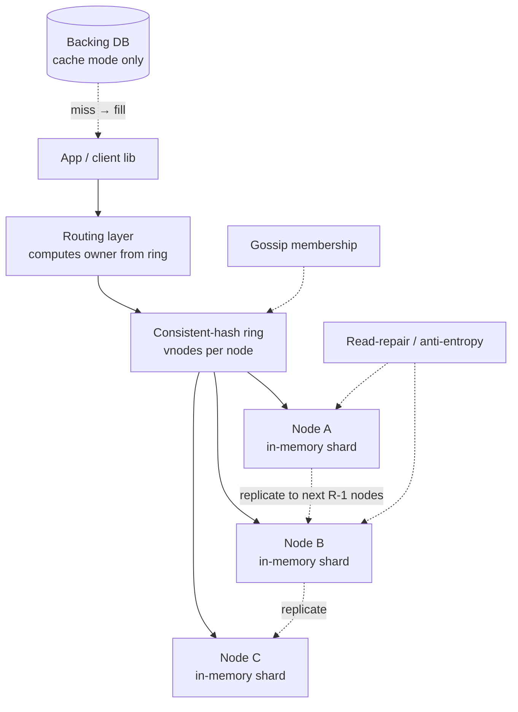

import ConsistentHashingRing from '@components/widgets/ConsistentHashingRing.jsx';
import QuorumCalculator from '@components/widgets/QuorumCalculator.jsx';

> **Why this gets asked at Director level:** "Design Memcached" / "Design a distributed cache" / "Design a Dynamo-style KV store" is a Tier-1 question across Meta, Stripe, Walmart, Anthropic, Canva, Databricks, and Snowflake, and it is increasingly run as a **dedicated component round** alongside the broad system-design round. It is the **technical-credibility gate for leaders**: a single component, no product to hide behind, where the interviewer can dig until they hit the floor of your depth. The Director signal is *not* reciting the Dynamo paper. It is **defending one consistency posture against the use case and the cost**, narrating the operational failure modes you have actually seen, hot keys, thundering herd, resharding pain, and stating crisply **where your depth ends and the cache team's benchmark begins.** Too shallow ("it's just a hash map over the network") reads as not technical enough to lead infra; too deep (20 minutes tuning the LRU clock hand) reads as not operating at level.

### Learning objectives

1. Run the RESHADED spine on a **single component**, treating it as the **capstone that assembles** partitioning, consistent hashing, and quorums plus a cache and replication into one coherent design, **assemble, don't re-teach**.
2. Defend the **load-bearing decision**: eventual + read-repair vs strong quorum, tied to the use case (look-aside cache vs durable session store) and the latency/cost it buys.
3. Name and mitigate the **three operational failure modes** that separate a Director from a textbook answer: **hot keys**, **thundering herd / cache stampede**, and **resharding**.
4. Place the **strong/weak boundary** deliberately and quantify what each posture costs in tail latency and node count.
5. State explicitly **what you keep and what you delegate**, the eviction internals, the membership protocol, the benchmark, with a stated prior.

### Intuition first

A distributed cache is a **coat check that grew too big for one counter.** One counter (a single Redis box) is simple: ticket in, coat out. Serve a stadium and you split it into **many counters, where the ticket number tells you which counter holds your coat**, that mapping is the whole game. Two truths fall out. First, when a counter closes (a node dies) or you add one (scale out), you do **not** want every coat reassigned, move as few as possible. That is **consistent hashing**, and it's why we never use plain `hash(key) % N`. Second, if one celebrity's coat (a **hot key**) is requested ten thousand times a second, that one counter melts while the rest idle, no amount of "add more counters" fixes a single coat everyone wants.

Now the consistency picture: a cache is a **photocopy, not the original.** You keep copies on a few counters so one fire doesn't lose the coat, but two clerks might hand back slightly different copies. **How fresh must the copy be?** For a look-aside cache fronting a database, "a few seconds stale" is invisible, so you optimize for speed and survival (eventual + read-repair). For a session store or a rate-limit counter that *is* the source of truth, a stale read is a logged-out user or a breached limit, so you pay for **strong quorum**. The whole interview turns on naming which one you're building and defending the cost: **a partitioned, replicated photocopy machine whose hardest decisions are how to map keys, how fresh the copies must be, and what to do when one coat is suddenly the only coat anyone wants.**

---

## R: Requirements

> Pin the *use case* first, "a cache" and "a KV store" are different products with different consistency floors. The load-bearing fact here isn't a read:write ratio; it's **what breaks when a read is stale.**

**Clarifying questions I'd ask (with assumed answers):**
- *Is this a look-aside cache fronting a database, or the durable source of truth?* → **Both modes exist; I'll design the cache mode as the base and call out where a durable KV diverges.** This single answer sets the consistency floor.
- *What's the data?* → **Opaque values up to ~1 MB** (serialized objects, rendered fragments, session blobs). No range scans, no secondary indexes, pure point `GET`/`SET` by key. That constraint is a gift: it's why partitioning is simple.
- *Eviction or durability?* → For cache mode, **eviction (LRU/TTL) and memory-bounded**; losing the cache is a latency event, not a data-loss event. For KV mode, **durable, no silent eviction.**
- *Acceptable staleness?* → For cache mode, **seconds of staleness is fine**; for KV/session mode, **read-your-writes is required.** This is the whole ballgame.
- *Latency bar?* → **p99 < 1 ms intra-AZ** for the cache; single-digit ms cross-AZ. A cache that adds 10 ms isn't a cache.

**Functional requirements:**
1. `GET(key)`, `SET(key, value, ttl)`, `DELETE(key)`, point operations only.
2. **Partition** keys across N nodes; route a request to the right node in one hop.
3. **Replicate** each key to R nodes so a single node loss doesn't lose (cache) or doesn't lose-and-can-recover (KV) the data.
4. **Evict** under memory pressure (cache mode): TTL + LRU.
5. **Rebalance** with minimal key movement when nodes join/leave.

**Explicitly CUT (scoping is the signal):** range queries, secondary indexes, transactions, multi-key atomicity, cross-region active-active (called out as evolution), pub/sub, Lua scripting. I scope to **a partitioned, replicated point-lookup store with a defensible consistency posture**, and say so.

**Non-functional requirements:**
- **Latency:** p99 < 1 ms intra-AZ, p999 < 5 ms. The reason this thing exists.
- **Consistency:** **tunable, defaulting to eventual + read-repair for cache mode; strong quorum available for KV mode.** The decision this lesson is built to defend.
- **Availability:** survive a single node loss with no client-visible outage; an AZ loss degrades, doesn't die.
- **Scalability:** add capacity by adding nodes with **bounded reshuffle** (move ~K/N of keys, not all).
- **Operability/cost:** memory is the budget line, RAM is ~10-20× the per-GB cost of SSD. Sizing the working set *is* the cost conversation.

**The skew, stated:** read-heavy (a cache is typically 10:1-100:1 read:write), but the architecture is driven by **the consistency floor and the failure modes**, not the ratio. Two million reads/sec is easy to fan out; *one* hot key at two million reads/sec is the problem.

---

## E: Estimation

> Enough math to make a defensible call on **node count, RAM cost, and replication overhead**, the three numbers a Director actually owns.

**Assumptions:** 1 TB hot working set; avg value 10 KB; 1M GET/s peak, 100K SET/s peak; replication factor 3.

**Memory (the cost line):**
- Working set `1 TB`, replicated ×3 → **~3 TB RAM** to hold all copies, plus ~20-30% overhead for metadata, fragmentation, and slack → call it **~4 TB RAM**.
- At ~256 GB/node usable, that's **~16 nodes** for capacity alone; round up for headroom and failure domains → **~20-24 nodes** across ≥3 AZs.
- **Cost framing for the panel:** ~4 TB RAM at roughly $5-8/GB-month of provisioned in-memory capacity is on the order of **$20-30K/month** just for the cache tier. The ×3 replication *triples* that line, which is exactly why we'll question whether cache mode needs RF=3 or survives on RF=2.

**Throughput per node:** 1M GET/s ÷ ~20 nodes ≈ **50K GET/s per node**, trivially within a single in-memory node's budget (Memcached/Redis sustain 100K+ ops/s/core). So **CPU is not the bottleneck; memory and hot-key skew are.**

**Bandwidth:** `1M GET/s × 10 KB ≈ 10 GB/s` aggregate read egress, ~500 MB/s/node, well within a 25 GbE NIC. Fine *unless* it concentrates on one hot key (the failure mode, not the average).

**Replication write amplification:** 100K SET/s × RF 3 = **300K replica writes/s** spread across the ring, ~15K/node, negligible. The cost of replication is **memory (×3), not write throughput.**

**What estimation decided:** ~20 nodes, ~4 TB RAM, and a **memory-and-skew-bound** system, not a CPU- or throughput-bound one. The two expensive knobs are **replication factor** (each +1 is another full copy of 1 TB of RAM) and **hot-key handling**. The math says the panel conversation is about RAM dollars and tail latency, not QPS.

---

## S: Storage

> One data class, two consistency modes. The store *is* RAM; the design question is the **partition + replication topology**, which assembles partitioning, consistent hashing, and replication rather than re-deriving them.

**The value store (in-memory, point-access).**
- *Access pattern:* point `GET`/`SET`/`DELETE` by key; no scans, no indexes. Values opaque, ≤1 MB.
- *Choice:* **in-memory hash table per node** (Memcached-style slab allocator, or Redis dict), partitioned across nodes by consistent hashing, replicated to RF copies. This is the entire storage layer, there's no separate index because point lookup *is* the access pattern. (Cache internals, slab classes, LRU clock, are delegated; see Go-deeper.)
- *Rejected, a B-tree / LSM on disk (RocksDB-backed):* buys durability and range scans we don't need, and pays ~100 µs-1 ms disk latency that defeats the p99 < 1 ms bar. Correct for a durable KV at scale where the working set exceeds RAM; **wrong for a latency-first cache** where the whole point is staying in memory.
- *Rejected, eventually-consistent wide-column (Cassandra) as the cache:* over-built, we don't need its write path or its disk durability for ephemeral cache data, and its tail latency is milliseconds, not microseconds.

**The membership/topology state (who owns which key range).**
- *Choice:* a small, **gossip-propagated ring membership** (Dynamo-style) or a thin coordination service (etcd/ZooKeeper) holding the node list and token assignments. Tiny, kilobytes, but its **consistency matters more than the data's**: clients must agree on *who owns a key* or they route to the wrong node.
- *Rejected, a centralized router that every request hops through:* adds a network hop (kills the p99) and a single point of failure. We want **clients (or a thin proxy) to compute ownership locally** from the ring.

**KV (durable) mode diverges here:** add a **write-ahead log + periodic snapshot to disk/S3** so a node restart reloads state. The access pattern is identical; only durability is added. That's the one storage change between cache mode and KV mode.

---

## H: High-level design

> The shape to make visible: a **thin routing layer** that turns a key into a node via consistent hashing, fronting a ring of **replicated in-memory shards**, with read-repair (or quorum) doing the consistency work. This composes the ring + replication + quorum, assembled, not re-taught.



**Happy path, compressed.** The client library hashes the key, looks up the owner on the **consistent-hash ring** (vnodes for smooth load) without a central router, and sends `GET` directly to the owning node, **one hop**. The node returns the value from its in-memory hash table. Writes go to the owner and **replicate to the next R−1 nodes on the ring**; the client's consistency mode decides whether it waits for those replicas. On a **cache miss** (cache mode), the client reads the backing DB, then `SET`s the value back, a **look-aside** pattern. **Gossip** propagates membership so every client converges on the same ring; **read-repair and background anti-entropy** reconcile divergent replicas.

**The shape to notice:** there is **no central coordinator on the data path**, routing is computed client-side from the ring, which is what keeps p99 under a millisecond. Everything expensive (membership, repair) is **off the hot path.** The load-bearing wall in this design is the **consistency mode**, configured per request, not the topology.

<ConsistentHashingRing client:load />

The widget above is the routing layer made concrete: add or remove a node and watch that only **~K/N of keys remap** (the bounded-reshuffle property), and raise the vnode count to see load even out across nodes. That smoothing is precisely what makes the **resharding failure mode** (below) survivable, and why we never use `hash(key) % N`, which remaps *almost every key* when N changes.

---

## A: API design

> Three calls. The interesting design isn't the verbs, it's that **consistency level is a per-request parameter**, which is the whole defense in API form.

```
GET    /v1/kv/{key}?consistency=eventual|quorum
       -> 200 { value, version }            # version = vector clock or generation
       -> 404                                # miss (cache) / not found (KV)

SET    /v1/kv/{key}
       body: { value, ttlSeconds, consistency=eventual|quorum }
       -> 200 { version }
       -> 503                                # quorum mode: couldn't reach W replicas

DELETE /v1/kv/{key}?consistency=eventual|quorum
       -> 204
```

**Design notes (each with its rejected alternative):**
- **`consistency` is a per-request knob, not a cluster-wide setting.** *Rejected: one fixed consistency for the whole cluster.* The same cluster serves look-aside cache reads (eventual, fast) and session reads (quorum, correct); forcing one mode either slows the cache or risks the session. Tunable per request is the Dynamo insight and the core of the defense.
- **`version` is returned on every read.** Lets the client do **read-repair** (write the freshest version back to stale replicas) and detect conflicts. *Rejected: opaque values with no version*, then you can't tell which of two divergent copies is newer, and read-repair is impossible.
- **`ttlSeconds` on write, not a separate expiry API.** TTL is the primary eviction lever; coupling it to the write keeps it atomic with the value. *Rejected: a sweeper-only expiry*, lazy TTL check on read plus background sweep is strictly better (no key outlives its TTL on the next read).
- **No multi-key / transaction API.** Deliberately cut in R; exposing it would force cross-shard coordination and break the one-hop latency promise.

---

## D: Data model

> Trivial on purpose, but the **version metadata** and the **replica placement rule** are the two load-bearing fields, because they're what make eventual consistency *converge* instead of *drift.*

**The value record** (per key, per node): `key → { value: bytes, version, ttl_expires_at }`. The `version` is a **vector clock** (or a simpler last-writer-wins timestamp for cache mode), it's the metadata that lets divergent replicas reconcile. For pure cache mode where staleness is harmless, **LWW by timestamp** is enough and cheaper; for KV mode where two clients may write concurrently, **vector clocks** preserve the conflict for the application to resolve.

**Replica placement:** key `k` lives on the node that owns `hash(k)` on the ring, **plus the next R−1 distinct physical nodes walking clockwise** (skipping vnodes of the same physical node, and preferably landing in different AZs). This placement rule is the single most consequential line in the data model, it's what turns "a node died" from an outage into a non-event.

<details>
<summary>Go deeper, vector clocks, read-repair, and the version metadata (IC depth, optional)</summary>

A vector clock is a map `{node_id → counter}`. On each write, the coordinating node increments its own counter. Comparing two clocks: if every counter in A is ≥ the matching counter in B (and at least one is strictly greater), A **dominates** B (A is strictly newer) and B can be discarded. If neither dominates, the writes are **concurrent**, a genuine conflict the cache can't auto-resolve, so it either keeps both siblings (Dynamo's approach, resolved on next read) or falls back to LWW.

**Read-repair**: on a quorum read, the coordinator gathers responses from R replicas, picks the dominating version, returns it to the client, and **asynchronously writes the winning version back** to any replica that returned a stale one. This is the cheap, on-the-read-path half of anti-entropy. **Merkle-tree anti-entropy** is the background half: each node keeps a Merkle tree over its key ranges; neighbors compare tree roots, and only diverging sub-ranges are exchanged, so a full sync transfers kilobytes of hashes, not gigabytes of data. The full LWW-vs-vector-clock and Merkle mechanics are IC depth; the Director keeps *which* one and *why*, and hands the implementation to the cache team.

</details>

---

## E: Evaluation

> Re-check against the NFRs, then hunt the bottlenecks, and here the bottlenecks **are** the interview. Hot keys, thundering herd, and resharding are the three places the panel will push, each fixed with its trade-off named.

**Re-check vs NFRs:** one-hop latency, client-side ring routing; single-node-loss survival, RF≥2 with AZ-aware placement; bounded reshuffle, consistent hashing with vnodes; tunable consistency, per-request `quorum`/`eventual`. Now the failure modes.

**The consistency decision, made explicit.** Cache mode defaults to **eventual + read-repair**: write to the owner, replicate async, reads take the first/fastest replica and repair stragglers. This buys **sub-millisecond reads and survival under partition** (the cache stays up even if replicas diverge for seconds) at the cost of **possibly stale reads**, which for a look-aside cache fronting a DB is *invisible*, because a stale cache entry is just a slightly-old copy of data the DB still holds.

For **KV/session mode**, switch to **strong quorum: W + R > N**. With N=3, W=2, R=2 guarantees a read overlaps a write, **read-your-writes**, no stale logout, at the cost of **higher tail latency** (you wait for the 2nd-fastest replica, not the fastest) and **lower availability under partition** (if you can't reach 2 of 3, the write fails). The quorum widget makes the W/R/N trade-off tangible:

<QuorumCalculator client:load />

Drag N, W, R: when `W + R ≤ N` the read and write sets can miss each other → the rose "may read stale" state (correct for cache mode). Push to `W + R > N` and the overlap turns amber → strong, read-your-writes (correct for KV mode), and you can watch availability drop as W climbs. **That single inequality is the decision this whole lesson defends**, and the right answer is "it depends on the use case," shown, not asserted.

**Bottleneck 1, hot keys (the #1 thing a Director must name).** One celebrity key (`user:elonmusk/profile`) draws 30% of all reads → its owning node saturates while the rest idle; consistent hashing does **not** help, because the key is singular. *Fixes, layered:* (a) **client-side / near-cache**, a tiny local LRU on each app server absorbs repeat reads of the same hot key, so they never hit the ring; (b) **key replication/splitting**, store the hot key on *extra* replicas and read from a random one to spread load; (c) **detect and quarantine**, track per-key request rate, auto-promote hot keys to a replicated set. *Trade-off:* the near-cache reintroduces staleness (a second TTL layer), and splitting a key multiplies its memory, accepted because **the alternative is one node melting.** *Rejected: "add more nodes"*, it does nothing for a single key everyone wants.

**Bottleneck 2, thundering herd / cache stampede.** A hot key's TTL expires; in the same millisecond 10,000 clients miss, all stampede the backing DB to refill it, and the DB falls over. *Fixes:* (a) **request coalescing / single-flight**, the first miss takes a short lock and refills; the rest wait for that one result instead of all hitting the DB; (b) **probabilistic early expiration**, refresh a hot key slightly *before* its TTL, jittered, so it never hard-expires under load; (c) **stale-while-revalidate**, serve the slightly-stale value while one request refreshes in the background. *Trade-off:* single-flight adds a tiny per-key lock and a coordination point; stale-while-revalidate serves known-stale data briefly, both accepted because **a synchronized 10,000-way DB stampede is an outage.** *Rejected: just shorter TTLs*, makes stampedes *more* frequent, not less.

**Bottleneck 3, resharding (the operational scar tissue).** Adding nodes or recovering from a node loss moves key ranges; during the move, requests can hit a node that doesn't yet have the data, or two nodes both think they own it. *Fixes:* **consistent hashing with vnodes** caps movement at ~K/N (the widget above shows this); **hand-off with a brief dual-read window**, during migration, read from both old and new owner and merge; **gossip convergence** so all clients adopt the new ring within seconds. *Trade-off:* a transient window of extra reads and slightly-elevated miss rate during rebalancing, accepted because the alternative (`mod N` rehashing, which remaps ~all keys and cold-starts the whole cache) is catastrophic: a full cache cold-start can multiply backing-DB load 10-100× until the cache re-warms. *Rejected: `hash % N`*, for exactly that reason.

**Closing re-check:** latency held (one hop, in-memory); single-node loss survived (RF + AZ placement); consistency *chosen per use case* and defended; the three failure modes each have a layered fix with its cost named. The expensive knob remains **RAM × replication factor.**

---

## D: Design evolution

> Push each dimension up an order of magnitude, find what breaks first, and name what you'd hand to a specialist.

**At 10× (10 TB working set, multi-region, 10M GET/s):**
- **Memory cost forces a tiering decision.** 10 TB ×3 in RAM is ~$200-300K/month, at that point you question RF=3 for cache data and consider **RF=2 + fast re-warm**, and tier cold-but-not-evictable keys to **local NVMe** (a Memcached-extstore / Redis-on-flash pattern). *Trade-off:* NVMe-tier reads are ~100 µs not ~10 µs, fine for the cold tail, and it roughly halves the RAM bill. The hot tier stays in RAM.
- **Multi-region goes active-active eventual.** Each region owns a full ring; writes replicate cross-region async (CRDT-friendly LWW for cache data). *Trade-off:* cross-region staleness of tens to hundreds of ms, acceptable for cache, **not** for a global session store, which would need a region-pinned strong-consistency tier or a consensus layer (consensus-layer territory). Name that the consistency posture **can't** be uniform across regions and the cost of making it so.

**Hardest trade-offs to defend:**
- **The consistency posture itself**, eventual + read-repair for cache, quorum for KV, *in the same cluster*, chosen per request. The discipline is **keeping the strong-consistency surface as small as the use case demands**, every key forced to quorum is tail latency and availability you spent for correctness you didn't need.
- **Replication factor**, RF=3 is reflexive but for *ephemeral cache data* RF=2 plus a fast re-warm path may be the right cost call; for durable KV, RF=3 across AZs is non-negotiable. The number is a **cost-vs-durability dial**, not a default.
- **Near-cache staleness**, the client-side hot-key cache that saves a melting node also creates a second, shorter staleness window. Worth it for hot keys; a bug magnet if applied universally.

**Where I'd delegate (the explicit Director move):**
- **The eviction internals:** *"The cache team owns whether we run Memcached slab/LRU or Redis with LFU eviction; my prior is Memcached for a pure look-aside cache because its memory efficiency and operational simplicity win, Redis only if we need its data structures. I want their benchmark on our value-size distribution before we commit."*
- **The membership protocol:** *"Whether ownership lives in gossip (Dynamo-style) or a thin etcd/ZooKeeper control plane is a reliability-engineering call; my prior is gossip for the data ring to avoid a coordination dependency on the hot path, with a control plane only for admin operations."*
- **The benchmark that settles the consistency cost:** *"I'd have the team run our real read:write mix through eventual vs W=R=2 quorum and measure the actual p99 delta and the stale-read rate under induced partition, I'll set the policy from those numbers, not from the paper."* **What I keep, the consistency posture, the placement rule, the three failure-mode mitigations, and what I hand off, with a stated prior, is the altitude.**

---

### Trade-offs table: the pivotal decisions

| Decision | Option A | Option B | Option C | Use when... |
|---|---|---|---|---|
| **Consistency posture** | **Eventual + read-repair** (LWW, fastest) | **Strong quorum** (W+R>N) | **Per-request tunable** (both, client picks) | **C** as the design (our choice), cache reads eventual, session reads quorum, same cluster. **A** for a pure look-aside cache. **B** only for the keys that are a source of truth. |
| **Key→node mapping** | **Consistent hashing + vnodes** | **`hash(key) % N`** | **Directory / lookup service** | **A** as default (our choice), bounded reshuffle, smooth load via vnodes. **B** never at scale, remaps ~all keys on resize. **C** when ownership needs explicit control or non-uniform placement. |
| **Replication factor** | **RF=2** (cheaper, cache) | **RF=3** (durable, KV) | **RF=1** (no replication) | **A** for ephemeral cache where re-warm is cheap (halves the RAM bill). **B** for durable KV / session across AZs. **C** **rejected**, one node loss = data loss. |

---

### What interviewers probe here (Director altitude)

- **"Eventual or strong consistency, and defend it."**, *Strong:* "Depends on the use case, and I'd make it per-request. Look-aside cache → eventual + read-repair, because a stale cache entry is just an old copy the DB still holds, and I'm buying sub-ms reads and partition survival. Session/KV → strong quorum W+R>N for read-your-writes. Forcing one posture on the whole cluster either slows the cache or risks the session." Names the cost of each. *Red flag:* "strong everywhere" (melts latency and availability) or "eventual, caches are always eventual" (loses the session).
- **"One key gets 30% of your traffic. What happens?"**, *Strong:* names it a **hot key**, says consistent hashing *doesn't* help, then layers near-cache → key replication/splitting → detection. *Red flag:* "add more nodes" (does nothing for a singular key) or doesn't recognize the failure mode.
- **"The hot key's TTL expires. Now what?"**, *Strong:* **thundering herd**; fixes with single-flight coalescing, probabilistic early expiry, stale-while-revalidate; knows shorter TTLs make it *worse.* *Red flag:* doesn't see the synchronized-miss stampede onto the backing DB.
- **"Why not `hash % N`?"**, *Strong:* it remaps ~all keys on resize → full cache cold-start → 10-100× backing-DB load spike; consistent hashing caps movement at ~K/N. *Red flag:* uses mod-N or can't quantify the cold-start blast radius.
- **"What does this cost, and what would you delegate?"**, *Strong:* the spend is **RAM × replication factor** (~$20-30K/month at 1 TB×3), questions whether cache needs RF=3, delegates eviction internals / membership protocol / the benchmark with stated priors. *Red flag:* hand-tunes the LRU clock, or can't put a dollar figure on the tier.

---

### Common mistakes

- **One fixed consistency for the whole cluster.** The Dynamo insight, and the Director answer, is **tunable per request**: eventual for cache reads, quorum for the keys that are a source of truth. Conflating the two is the central error.
- **Using `hash(key) % N`.** It remaps almost every key when N changes, cold-starting the entire cache and slamming the backing DB. Consistent hashing with vnodes is the only acceptable answer at scale.
- **Ignoring hot keys.** "Add more nodes" is the reflex and it's wrong, a single key everyone wants saturates one node regardless of cluster size. Near-cache + key splitting are mandatory.
- **No thundering-herd defense.** A naive cache with synchronized TTL expiry turns a hot-key miss into a 10,000-way DB stampede. Single-flight + jittered/early expiry are not optional at scale.
- **Treating it as "just a hash map over the network."** The whole interview is the **consistency posture and the three failure modes**, the hash map is the easy 10%.

---

### Interviewer follow-up questions (with model answers)

**Q1. Eventual or strong consistency for this cache, defend your choice.**
> *Model:* I make it **per-request**, defaulting by use case. For a **look-aside cache** fronting a database, eventual + read-repair: I write to the owner, replicate async, read the fastest replica, and repair stragglers. A stale read here is just a slightly-old copy of data the DB still authoritatively holds, invisible to correctness, and I'm buying sub-millisecond p99 and survival when replicas diverge under partition. For a **session store or rate-limit counter that is itself the source of truth**, I switch to strong quorum with W+R>N (N=3, W=2, R=2) for read-your-writes, a stale read there is a logged-out user or a breached limit. The cost of quorum is real: higher tail latency (wait for the 2nd-fastest replica) and lower availability under partition (fail if you can't reach W). So I keep the strong surface as small as the use case demands. The wrong answer is one fixed posture, it either slows the cache or breaks the session.

**Q2. One key, a celebrity's profile, takes 30% of your reads. Walk me through it.**
> *Model:* That's a **hot key**, and the trap is that consistent hashing does nothing for it, the key is singular, so it always lands on one node, which now saturates while the rest idle. I layer three fixes. First, a **near-cache**: a tiny LRU on each app server absorbs repeat reads so they never reach the ring, this alone often kills the problem, at the cost of a second short staleness window. Second, **key replication**: store the hot key on extra replicas beyond RF and read from a random one, spreading the load, costs extra memory for that key. Third, **detection**: track per-key request rate and auto-promote hot keys into the replicated set so we don't depend on knowing them in advance. "Add more nodes" is the reflex answer and it's useless here, N doesn't matter when everyone wants one key.

**Q3. That hot key's TTL expires. What happens at the next millisecond?**
> *Model:* **Thundering herd.** Ten thousand clients miss simultaneously and all stampede the backing DB to refill the same key, and the DB falls over. Three defenses: **single-flight coalescing** (the first miss takes a brief lock and refills; the rest await that one result instead of all hitting the DB), **probabilistic early expiration** (refresh hot keys slightly before TTL with jitter, so they never hard-expire under load), and **stale-while-revalidate** (serve the slightly-stale value while one background request refreshes). Note shorter TTLs make this *worse*, not better, more frequent stampedes. The trades: single-flight adds a per-key lock; stale-while-revalidate briefly serves known-stale data, both cheap next to a synchronized DB outage.

**Q4. Why not just `hash(key) % N` to pick the node?**
> *Model:* Because changing N, adding a node or losing one, remaps **almost every key**, not just a fraction. Every remapped key becomes a miss, so the cache effectively **cold-starts**, and all that traffic falls through to the backing DB at once, a 10-100× load spike until the cache re-warms, which can take minutes and can itself take down the DB. **Consistent hashing** with virtual nodes caps movement at ~K/N (K keys, N nodes) and keeps load smooth, the rest of the keys keep hitting warm cache. That bounded-reshuffle property is the entire reason consistent hashing exists; `mod N` is only safe when N never changes, which in a system designed to scale it always does.

**Q5. This is one component. Where does your depth stop, and what do you hand off?**
> *Model:* I keep the decisions that shape the system: the **consistency posture** (per-request, eventual-vs-quorum by use case), the **replica placement rule** (RF copies on the next distinct physical nodes, AZ-aware), and the **three failure-mode mitigations** (hot key, herd, resharding). I delegate the internals with a stated prior: **eviction**, Memcached slab/LRU vs Redis LFU is the cache team's call, my prior is Memcached for a pure look-aside cache on memory efficiency, pending their benchmark on our value-size distribution; **membership**, gossip vs an etcd control plane is a reliability call, my prior is gossip off the hot path; and the **consistency-cost benchmark**, I'd have them measure the real p99 delta and stale-read rate of eventual vs quorum on our traffic and set policy from those numbers. Keeping the policy and handing off the mechanism with a prior is the altitude.

---

### Key takeaways

- A distributed cache / KV store is a **partitioned, replicated point-lookup store** whose hard parts are **the consistency posture and the operational failure modes**, not the hash map. It's the **capstone that assembles** consistent hashing, quorums, partitioning, cache, and replication, assemble, don't re-teach.
- **The load-bearing decision is consistency, made per-request:** eventual + read-repair for a look-aside cache (sub-ms, partition-tolerant, staleness invisible) vs strong quorum **W+R>N** for a source-of-truth KV/session (read-your-writes, paid in tail latency and availability). Defend by use case, not dogma.
- **Three failure modes separate a Director from a textbook answer:** **hot keys** (near-cache + key splitting; "add nodes" does nothing), **thundering herd** (single-flight + early/jittered expiry; shorter TTLs make it worse), **resharding** (consistent hashing + vnodes caps movement at ~K/N; never `mod N`, which cold-starts the cache and 10-100×'s the DB).
- **The cost line is RAM × replication factor** (~$20-30K/month at 1 TB×3), the two expensive knobs are **RF** (each +1 is another full copy of RAM) and **hot-key handling**. CPU and QPS are not the bottleneck; memory and skew are.
- **Keep the policy, delegate the mechanism with a prior:** own the consistency posture, placement rule, and failure-mode mitigations; hand off eviction internals, membership protocol, and the benchmark that settles the consistency cost.

> **Spaced-repetition recap:** Distributed cache / KV = **partitioned + replicated point store** assembled from a consistent-hash ring (vnodes, never `mod N`), replication (replicate to next R−1 nodes, AZ-aware), quorum (W+R>N), and look-aside caching (+ stampede defense). **Defend consistency per-request:** eventual + read-repair for cache, strong quorum for source-of-truth KV. **Name the three failure modes:** hot keys (near-cache + splitting), thundering herd (single-flight + jittered early expiry), resharding (bounded reshuffle). **Cost = RAM × RF.** Keep the posture and placement rule; delegate eviction, membership, and the benchmark with a stated prior.

---

*End of Lesson 5.14. The distributed cache is the **single-component credibility gate**: one box, nowhere to hide, where the panel digs to the floor of your depth. The Director answer assembles the core distributed-systems spine into one coherent design, defends a per-request consistency posture against the use case and the RAM bill, and narrates hot keys / thundering herd / resharding from operational experience, then states crisply where the policy ends and the cache team's benchmark begins.*
