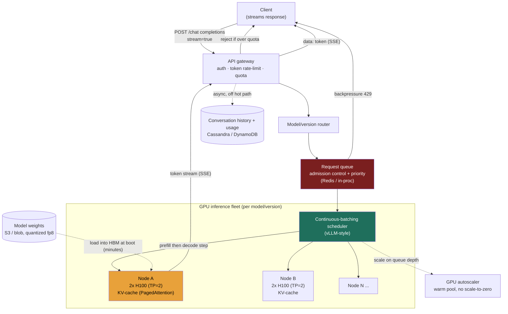

### Learning objectives
- Run the full **RESHADED** spine on a problem where the bottleneck is not storage or network I/O but **GPU compute and HBM (high-bandwidth memory)** - and recognize that this inversion changes which numbers matter.
- **Estimate** the headline figure - **output tokens/sec across the fleet** - from DAU and tokens-per-response, then convert it to a **GPU/node count and a cost floor** ($/GPU-hour, $/1M tokens), showing the math.
- Explain why the **KV-cache** is the resource that bounds batch size (and therefore throughput), and why **continuous (in-flight) batching** is the single biggest utilization lever - each named against its rejected alternative.
- Design the **token-streaming** path over **SSE**, the **request queue / admission control** in front of the fleet, **model/version routing**, **context-length limits**, and **token-based rate-limiting** - and articulate the **TTFT-vs-throughput** trade that governs the whole system.
- Operate at **Director altitude**: tie every choice to a requirement, quantify the cost (GPUs are the budget), name the autoscaling cold-start problem, and say where you'd delegate the deep-dive (the kernel/inference-engine team, the model-quality eval).

### Intuition first
Imagine a small fleet of extraordinarily expensive chefs (the GPUs), each of whom can cook for many diners at once - but only if their prep counter (the **KV-cache**, a slab of fast memory) has room. Every diner's order arrives as a sentence the chef must first **read in full** (the prompt - cheap and fast, done in one parallel glance: *prefill*) and then **answer one word at a time, out loud, while the diner listens** (the response - slow, sequential, one token per step: *decode*). The genius trick is that a chef doesn't cook one order start-to-finish before taking the next; on **every** word-step they glance around the counter, drop a word into each in-progress order, **clear finished orders the instant they're done**, and **slide a new order into the freed spot mid-stream**. That is *continuous batching*, and it's the difference between a chef idling between orders and a chef whose hands never stop. The hard constraints are physical: the chef's prep counter only holds so many simultaneous orders (KV-cache memory caps the batch), and there's a tug-of-war between **answering the diner already at the table faster** (low time-to-first-word) and **packing more diners around the counter** (high total throughput) - serve too few and the costly chef is mostly idle; pack too many and everyone waits longer for their first word.

That asymmetry - **a cheap parallel read (prefill) feeding a slow sequential generation (decode), both fighting for a fixed slab of GPU memory** - is the crux. There's no read:write database skew here; the skew that matters is **prefill vs decode**, and the resource that runs out first is **HBM**, not disk. Getting *that* right is the first thing this problem tests.

---

## R - Requirements

**Functional (the defensible core):**
1. A client **submits a prompt** (a chat completion request, optionally with conversation history and a target `model`) and gets a generated response.
2. The response is **streamed token-by-token** as it's generated (the user watches words appear; they should not wait for the whole answer).
3. The system **routes** the request to the correct **model and version** and **enforces context-length limits** (max input + output tokens for that model).
4. The system **rate-limits / meters** usage per API key or user - measured in **tokens**, not just requests - and applies **quotas** and tiered priority.

**Explicitly CUT (state the cut - scoping *is* the signal):** model *training* and fine-tuning, RLHF, the data pipeline, the model architecture itself, multimodal (image/audio) input, tool-calling / function-calling orchestration, retrieval-augmented generation, safety/moderation classifiers, and the chat *UI*. Each is a real subsystem; trying to cover all of them is the "too high, hand-wavy" failure. I scope to **API → queue/admission → GPU inference (batching + KV-cache) → token streaming**, plus the operational concerns (routing, limits, autoscaling, cost), and I say so out loud.

**Clarifying questions I'd ask the interviewer (and the assumptions I'll proceed on):**
- *Which model size, and how is it served?* → assume a **~70B-parameter** model, served on a **2-GPU node** (it doesn't fit on one - derived in S/E). Model size is the single biggest cost driver, so I pin it.
- *What latency does the user feel?* → two distinct SLOs: **TTFT (time-to-first-token) < ~1 s p95** (the "is it alive?" moment) and **ITL (inter-token latency) ~30-50 ms** (a comfortable reading pace, ~20-30 tokens/sec, i.e. faster than a person reads). These two budgets, not a single latency number, drive the design.
- *Typical prompt and response length?* → assume **~1,000 input tokens** (a question plus some conversation context) and **~500 output tokens** per response. This 2:1 input:output ratio sets the prefill-vs-decode balance.
- *Consistency / durability bar?* → generation is **best-effort and idempotent on retry**; a dropped in-flight request is regenerated, not recovered. Conversation history must persist (durable), but it sits **off the inference hot path**.

**Non-functional requirements:**
- **High GPU utilization** - GPUs are the budget; idle GPU-seconds are burned money. The entire design exists to keep the fleet busy.
- **Low TTFT** (< ~1 s p95) on the interactive path *and* **high aggregate token throughput** - these two pull against each other (the central trade).
- **Streaming delivery** - tokens reach the client incrementally over a long-lived connection.
- **Graceful overload** - at capacity, the system **queues and sheds with backpressure** (429 / "at capacity"), never melting the fleet or returning corrupt output.
- **Elastic but cold-start-aware** - GPU capacity scales with load, but a node takes **minutes to load weights**, so you cannot scale to zero and react instantly (the operational crux, handled in Evolution).
- **Cost-bounded** - a per-1M-token cost floor the business can defend against the price it charges.

**The skew that matters - stated up front.** This problem has **no read:write database skew** - there's almost no durable write on the hot path. The asymmetry is **prefill vs decode**: a request's **1,000 input tokens are processed in one parallel compute burst** (prefill - GPU-compute-bound, hundreds of ms), then its **500 output tokens are generated one at a time** (decode - memory-bandwidth-bound, ~30-50 ms *each*, so ~15-25 s of wall-clock streaming). Decode dominates wall-clock and is where batching pays off; prefill dominates the TTFT budget. The architecture follows from that split, and the resource that saturates first is **GPU HBM** (which holds the model weights *and* the KV-cache), not storage or bandwidth.

---

## E - Estimation

*Enough math to make a defensible call - round hard, state assumptions, flex the knobs.*

**Demand (the headline: output tokens/sec):**
- Assume **30M DAU** (state it: real ChatGPT scale is higher; the *formula* is the signal, the constant is a dial), **~10 messages/user/day** → `30M × 10 =` **300M requests/day**.
- `300M ÷ 86,400 s ≈` **~3,500 requests/sec average**; peak factor ~5× → **~17,500 ≈ ~20K requests/sec peak**.
- Each response is ~500 output tokens, so **output token rate = `300M × 500 ÷ 86,400 ≈ 1.7M output tokens/sec` average**, **~9M (round ~10M) tokens/sec at peak**. *This is the number the whole fleet is sized against.*
- Prefill (input) work is **`300M × 1,000 ÷ 86,400 ≈ 3.5M input tokens/sec`** average - 2× the output rate, but processed in parallel bursts, so it shows up as a TTFT cost, not a sustained throughput cost.

**The serving unit (decide it once, use it everywhere):**
- A **70B-parameter** model in **fp16** is `70B × 2 bytes =` **140 GB of weights** - which does **not** fit in one 80 GB H100. So the **serving unit = one node = 2× H100 (80 GB) = 160 GB HBM**, tensor-parallel (TP=2). Every number below is **per node**, not per GPU. (This is the consistency trap: if you size throughput "per GPU" but the model needs two, your GPU count and cost are off by 2×.)

**KV-cache - why it bounds the batch (the heart of the estimate):**
- The KV-cache stores the attention keys+values for every token already seen, so generating token *N+1* is cheap (no re-reading tokens 1..*N*). Its size per token = `2 (K and V) × layers × kv-dim × bytes`. For a 70B model (80 layers): with full attention (MHA) that's **~2.5 MB/token**; with **GQA (grouped-query attention)**, the modern default, the KV-dimension shrinks ~8× → **~320 KB/token**.
- A 4,096-token sequence therefore needs `320 KB × 4,096 ≈` **~1.3 GB of KV-cache (GQA)** - or ~10 GB with MHA. **This is the binding constraint on how many sequences run concurrently.**
- **fp16 weights leave almost no room:** `160 GB − 140 GB = 20 GB` free → only **~15 concurrent 4K sequences**. That batch is too small to keep the GPUs busy.
- **Quantize the weights to fp8/int8** (~70 GB) → `160 − 70 = 90 GB` free for KV → **~60-67 concurrent 4K sequences**. *Now* the batch is large enough to saturate the node. (This is a real decision with a rejected alternative - see S and Trade-offs. fp8 trades a small, usually-acceptable accuracy loss for ~4× the batch size.)

**Per-node throughput, and the node count:**
- At a batch of **~64** sequences with **ITL ≈ 33 ms** (~30 tokens/sec *per sequence*), aggregate node decode ≈ `64 × 30 ≈` **~2,000 output tokens/sec per node**. (Decode is memory-bandwidth-bound; the batch shares each weight-matrix load across all 64 sequences, which is *why* batching multiplies throughput.)
- **Nodes for average load** = `1.7M ÷ 2,000 ≈` **~850 → round ~1,000 nodes**. **Nodes at peak** = `9M ÷ 2,000 ≈` **~4,500 nodes ≈ ~9,000 GPUs**.
- *Flex:* a smaller (e.g. 8-13B) model fits on one GPU and serves several× the tokens/sec/GPU - the node count drops by an order of magnitude. **The formula `fleet_token_rate ÷ per_node_token_rate` is the thing to show; model size dials it hard.**

**Cost (the line item a Director owns):**
- At **~$3/GPU-hour** (cloud H100-class), a node is **~$6/node-hour** and produces `2,000 × 3,600 =` **7.2M output tokens/node-hour**.
- **Cost floor ≈ `$6 ÷ 7.2M × 1M ≈` ~$0.85 per 1M output tokens** (compute only). This is a *floor*, model-size-dependent; it sits well below public API prices (~$10-15/1M for a frontier model), which carry margin, input-token cost, and smaller/larger model economics - so the floor reads as defensible, not invented.
- **Peak fleet cost ≈ `4,500 × $6 ≈` ~$27K/hour ≈ ~$0.65M/day**. Sizing for peak 24/7 is **~$0.2B/year** - which is exactly why **autoscaling** and **utilization** are not optional; the gap between peak and average provisioning is the whole budget conversation.

**Storage & bandwidth (small, by design):**
- Model weights: **~70-140 GB per version** in a blob store - trivial to store, but *loading* them into HBM takes **minutes** (the autoscaling cold-start tax).
- Conversation history: `300M msgs/day × ~2 KB ≈ 600 GB/day ≈ ~220 TB/year` - a sharded durable store, **off the hot path**.
- Streaming bandwidth: `10M tokens/s × ~4 bytes/token ≈ 40 MB/s ≈ 0.3 Gbps` of payload - negligible. The cost is **GPU-seconds**, not bytes.

**One-line takeaway from E:** the system is **~1.7M output tokens/sec (≈10M peak) served from ~1,000-4,500 two-GPU nodes**, bounded by **KV-cache memory** (hence quantization + batching) at a **compute floor of ~$0.85/1M tokens** - so optimize **GPU utilization**, and treat the **peak-vs-average fleet gap** as the budget.

---

## S - Storage

The binding resource here is **GPU HBM**, not disk - so the S step is mostly about *what lives in fast memory vs what lives off the hot path*. Four data classes with sharply different needs.

**1. The KV-cache (ephemeral, in HBM, the real "hot store").**
- *Access pattern:* written every decode step for every in-flight sequence; read on every subsequent step; discarded the instant the sequence finishes; **~1.3 GB per 4K sequence (GQA)**; lives **only in GPU HBM**.
- *Choice:* keep it in HBM, managed by **PagedAttention** (vLLM) - the KV-cache is stored in fixed-size **pages** (like OS virtual memory) instead of one contiguous per-sequence block, which **eliminates fragmentation** and lets you pack ~2-4× more concurrent sequences into the same HBM. This is the store that bounds batch size, so its layout *is* the throughput lever.
- *Rejected:* contiguous per-sequence KV allocation (pre-PagedAttention / naive Orca). It must reserve for the *max* sequence length up front, so a 4K-capacity slot holding a 200-token reply wastes ~95% of its memory to internal fragmentation - you'd fit a fraction of the sequences and torch your throughput. We reject it because HBM is the scarce resource and fragmentation is pure waste of it.

**2. Model weights (read-mostly, large, must load fast into HBM).**
- *Access pattern:* written rarely (a new model/version), read into HBM once at node startup (~70-140 GB), then resident for the node's life.
- *Choice:* a **blob store - S3 / GCS** (or a fast read-through cache / local NVMe on the node) for the weight files; loaded into HBM at boot. Quantized (fp8/int8) to **halve** the HBM footprint and double the KV budget (the decision from E).
- *Rejected:* serving weights from fp32 (4 bytes/param = 280 GB, needs *four* GPUs and leaves zero KV room) - rejected for cost and HBM. *Also rejected:* re-downloading weights from blob storage on every scale-up with no local cache - it makes the cold-start tax worse (minutes → many minutes).

**3. The request queue (in-memory, transient, backpressure point).**
- *Access pattern:* every inbound request lands here, dequeued by the batching scheduler the instant a KV slot frees; transient; must apply **admission control / priority**.
- *Choice:* an **in-memory broker / queue - Redis** or a lightweight in-process priority queue per inference replica, with depth-based backpressure. Holds requests for **milliseconds-to-seconds**, not for durability - if a queued request is lost, the client retries (idempotent).
- *Rejected:* a durable log (**Kafka**) as the *primary* request queue. Generation is interactive and ephemeral - a request older than its TTFT budget is useless - so durable, replayable queuing buys a guarantee the use case doesn't need and adds latency. (Kafka *is* the right tool for the async/batch-completions API, a separate path - see Evolution.)

**4. Conversation history + prompt/response logs (durable, off the hot path).**
- *Access pattern:* keyed by `conversationId`, append-mostly, read to rebuild context; ~220 TB/year; must survive crashes; not latency-critical to *generation*.
- *Choice:* a **partitioned key-value / document store - DynamoDB or Cassandra** (or Postgres sharded, if relational reporting matters), sharded by `userId`/`conversationId`. This is the system of record for chats, billing usage, and audit - genuinely durable, but the inference path only *reads* the assembled context, it doesn't block on this store for writes.
- *Rejected:* putting conversation history in the in-memory tier - we'd lose user chat history on a node crash, which is unacceptable (unlike the KV-cache, which is disposable). Different durability requirement → different store.

---

## H - High-level design



**Happy path, in prose:**
1. **Ingress + metering.** The client opens a streaming request (`POST /v1/chat/completions`, `stream: true`) to the **API gateway**, which authenticates the API key, checks the **token-based rate limit / quota** (estimating the request's token cost up front), and rejects over-quota callers immediately with `429`.
2. **Route.** The **model/version router** maps the requested `model` (e.g. `gpt-x`, or a pinned version / an A/B variant) to the correct **GPU fleet** - each model+version is its own pool because each loads different weights into HBM.
3. **Admission.** The request enters that pool's **queue**. If the fleet is saturated (queue depth over threshold), admission control applies **backpressure** (429 "at capacity" or a priority-tiered wait) rather than overloading the GPUs.
4. **Prefill.** The **continuous-batching scheduler** pulls the request the moment a KV slot is free and runs **prefill**: the full prompt is processed in one parallel pass, populating the KV-cache and producing the **first token**. The time to here is the **TTFT** (dominated by queue wait + prefill).
5. **Decode (streamed).** On every subsequent step the scheduler runs a **decode** pass across the *whole current batch* - one new token per in-flight sequence - and each new token is pushed to its client over **SSE** as `data:` events. Finished sequences are **evicted immediately**, freeing their KV slot for a waiting request (continuous batching). Streaming continues at ~30 tokens/sec/sequence until the model emits a stop token or hits the output-length cap.
6. **Finalize.** On completion the gateway closes the SSE stream, and **asynchronously** (off the hot path) records the conversation turn and the **token usage** for billing/quota into the durable store.

The asymmetry is visible: the hot, expensive edge is **scheduler ↔ GPU nodes** (decode steps at ~10M tokens/sec fleet-wide); everything else - history, billing - hangs off the side, asynchronous and cheap.

---

## A - API design

Kept deliberately small - the four functional requirements map to a tiny surface, mirroring the OpenAI-style contract candidates will recognize.

```
# Streaming chat completion (the hot path)
POST /v1/chat/completions
  headers: { Authorization: Bearer <api-key> }
  body: {
    model: "gpt-x",                 # routed to that model+version's fleet
    messages: [ {role, content}... ],  # conversation context (counts toward input tokens)
    stream: true,                   # SSE token streaming
    max_tokens: 500,                # caps output length (and KV growth → cost)
    temperature, top_p, stop        # sampling controls
  }
  → 200  Content-Type: text/event-stream
     data: {"delta":{"content":"Hel"}}      # one chunk per token (or few)
     data: {"delta":{"content":"lo"}}
     ...
     data: {"usage":{"prompt_tokens":1000,"completion_tokens":500}}
     data: [DONE]
  → 429  if over rate limit / quota, or fleet at capacity (with Retry-After)
  → 400  if input + max_tokens exceeds the model's context window

# Non-streaming variant (returns the whole completion once done)
POST /v1/chat/completions   (stream:false)  → 200 { choices:[...], usage:{...} }

# List models / versions available for routing
GET  /v1/models  → 200 { data: [ { id, context_window, ... } ] }

# Async / batch completions (high-throughput, latency-relaxed; separate path)
POST /v1/batches   body: { input_file_id }   → 202 { batch_id, status:"queued" }
GET  /v1/batches/{batch_id}                  → 200 { status, output_file_id? }
```

**Design notes (each a choice with a rejected alternative):**
- **Streaming over SSE**, not WebSocket. Generation is **server→client only** (the client said everything up front); SSE is one-directional, rides plain HTTP/2, auto-reconnects, and needs no custom framing. We **reject WebSocket** (bidirectional, heavier, needs its own keep-alive/protocol) because we don't need client→server messages mid-generation, and we **reject buffering the full response** (return-when-done) on the interactive path because it throws away the entire UX win of watching tokens appear and inflates perceived latency from TTFT to total-generation-time.
- **`max_tokens` is required-in-spirit** and enforced. It's not just a UX knob - it **bounds KV-cache growth**, and KV is the scarce resource, so an unbounded generation is a cost and capacity hazard. We **reject** letting requests run to the full context window by default.
- **Token-based rate limiting** (TPM - tokens-per-minute - alongside RPM), not request-counting alone. A "request" can be 50 tokens or 50,000; metering by **tokens** is the only way to bound actual GPU consumption. We **reject** request-count-only limits because they let a few huge-context requests starve the fleet while looking "within limits."
- **A separate async `/batches` path** for non-interactive workloads (bulk classification, evals). It has **no TTFT SLO**, so it can be queued durably (Kafka) and run at **giant batch sizes / off-peak** for a much lower price. We **reject** forcing batch traffic through the interactive path, which would either blow the TTFT budget or waste the cheaper-throughput opportunity.

---

## D - Data model

**KV-cache (in HBM, per in-flight sequence) - the hot, ephemeral structure:**

| Field | Type | Notes |
|---|---|---|
| `sequenceId` | int | one per active generation |
| `K, V tensors` | fp16/fp8 pages | per-layer keys/values for tokens seen so far |
| `block table` | list of page ids | PagedAttention: maps logical positions → physical HBM pages |
| `tokens_generated` | int | progress; compared to `max_tokens` |
| `priority / tier` | enum | scheduling class (interactive vs batch) |

- **Layout:** PagedAttention stores KV in fixed-size **blocks** (e.g. 16 tokens each) referenced by a per-sequence **block table** - so memory is allocated on demand as the sequence grows, not reserved for the max length. **There is no shard/partition key here** - the KV-cache is node-local and disposable; it never leaves the GPU that owns the sequence.

**Routing + control-plane data (small, fast, mostly read):**

| Table | Key | Where it lives | Notes |
|---|---|---|---|
| `model_registry` | `model+version` | config store / etcd | maps a `model` to its fleet, context window, weight blob |
| `rate_limits` | `apiKey` | **Redis** | TPM/RPM counters, sliding window; the quota hot path |
| `routing_table` | `model` → pool | gateway memory / etcd | which GPU pool serves which version (A/B weights) |

**Durable entities (off the hot path):**

| Table | Key | Shard key | Store |
|---|---|---|---|
| `conversations` | `conversationId` | `userId` hash | DynamoDB / Cassandra |
| `messages` | `(conversationId, ts)` | `conversationId` | DynamoDB / Cassandra |
| `usage_ledger` | `(apiKey, window)` | `apiKey` hash | durable KV; source of truth for billing |

- **Partition / shard keys:** durable chat data shards by **`userId` / `conversationId`** (a user's history is co-located and never cross-shards a read); rate-limit counters key by **`apiKey`** in Redis. The **GPU fleet "shards" by `model+version`** - the load-bearing operational fact: each version is a *separate pool* because it holds *different weights in HBM*, so you cannot freely mix versions on one node. We **reject** a single undifferentiated GPU pool serving all models - it would force constant multi-GB weight swaps in/out of HBM (catastrophic for utilization).
- **Indexes:** on durable chats, a secondary index by `userId` for "list my conversations" (built lazily, off the generation path). The KV-cache deliberately has **no secondary indexing** - it's a transient compute scratchpad, not a query store.

---

## E - Evaluation

Re-check against the NFRs and break the design on purpose. Five bottlenecks, each fixed with a *named* trade-off.

**Bottleneck 1 - GPU under-utilization from naive (static) batching (the central problem).**
With **static batching**, you assemble a batch of *N* requests, run them all to completion, *then* take the next batch. But generations have wildly different lengths - one sequence emits 20 tokens, another 800 - so the whole batch is held hostage by the **longest** sequence, and finished sequences sit idle occupying KV slots. GPU utilization craters (often <30%), and at ~$6/node-hour that idle time *is* the budget bleeding out.
*Fix - **continuous (in-flight) batching** (vLLM / Orca-style):* the scheduler operates at **per-token granularity** - on every decode step it can **evict** a finished sequence and **admit** a waiting one into the freed KV slot, so the batch is continuously refilled and the GPU never waits for the slowest sequence. This typically lifts throughput **2-4×** at the same hardware. *Trade:* the scheduler is far more complex (it interleaves prefill and decode, manages a dynamic batch, and must avoid prefill steps starving decode of latency); we accept that complexity because it's the single biggest cost lever in the system. *Rejected:* static batching (simple, but leaves most of the GPU - and most of the budget - idle).

**Bottleneck 2 - KV-cache exhaustion caps the batch (HBM runs out before compute does).**
Even with continuous batching, you can only run as many sequences as fit in HBM KV. At fp16 weights that was ~15 sequences - far too few to saturate the node, so you're memory-bound, not compute-bound, and throughput is low.
*Fix:* (a) **quantize weights to fp8/int8** to free ~70 GB of HBM for KV (~15 → ~65 sequences); (b) **PagedAttention** to eliminate KV fragmentation (another ~2-4× effective capacity); (c) **GQA** models to cut KV bytes/token ~8×. *Trade:* fp8 costs a small accuracy degradation (usually acceptable, must be eval-gated), and PagedAttention adds indirection (a block-table lookup per access). We accept both to turn a memory-bound node into a compute-bound one - which is the only way the throughput/cost numbers in E hold. *Rejected:* buying more/bigger-HBM GPUs to brute-force capacity - it linearly inflates the most expensive line item; quantization+paging get the capacity nearly for free.

**Bottleneck 3 - the TTFT-vs-throughput tension (the trade you must name).**
The two SLOs fight. **Bigger batches** amortize weight loads across more sequences → higher **throughput** and lower $/token, *but* each new request waits longer for a KV slot **and** large prefills (a 1,000-token prompt) block the decode loop → **higher TTFT**. **Smaller batches** → snappy TTFT but low utilization (expensive).
*Fix:* (a) cap batch size / set an admission deadline so TTFT stays within budget; (b) **chunked prefill** - split a long prompt's prefill into smaller pieces interleaved with decode steps, so a big new prompt doesn't stall everyone's streaming; (c) **separate interactive vs batch pools** (interactive runs smaller batches for TTFT; the async `/batches` path runs giant batches for throughput). *Trade:* you deliberately leave some throughput on the table on the interactive fleet to protect TTFT - a product decision (responsiveness) paid in slightly higher $/token. *Rejected:* a single global batch size optimized purely for throughput (cheapest per token, but TTFT blows past 1 s and the product feels broken) - or purely for TTFT (snappy but burns money on idle GPUs).

**Bottleneck 4 - autoscaling cold start (you can't scale to zero, can't react in seconds).**
GPUs are too expensive to over-provision for peak 24/7 (~$0.2B/yr), but a new node takes **minutes** to pull 70-140 GB of weights and load them into HBM - so reactive autoscaling lags a traffic spike badly, and naive "scale to zero off-peak" means cold users wait minutes.
*Fix:* scale on **queue depth / pending-token backlog** (a leading indicator) rather than CPU; keep a **warm pool** of pre-loaded standby nodes for the next increment; **never scale to zero** for an active model - keep a floor of warm capacity and absorb spikes with the queue + backpressure while the pool spins up. *Trade:* the warm pool and the warm floor are **idle GPU cost you pay for responsiveness** - the explicit cost-vs-latency lever a Director owns. *Rejected:* scale-to-zero (cheapest, but minutes-long cold starts make the interactive product unusable after any lull) and peak-provisioning-always (responsive, but the most expensive option and the reason the bill is a headline).

**Bottleneck 5 - a noisy/abusive tenant or a huge-context request starves the fleet.**
One client firing 100K-token prompts, or a flood from a single key, can monopolize KV and decode cycles, degrading everyone (a hot key, in tokens).
*Fix:* **token-based rate limits (TPM)** per key in Redis, **per-request context caps** (reject at `400` over the window), **priority tiers** in the queue (paid > free), and **fair-share scheduling** so no single tenant's sequences dominate the batch. *Trade:* enforcing fairness adds scheduling overhead and can delay a legitimate burst from a heavy user; we accept bounded per-tenant throughput to protect aggregate fleet health. *Rejected:* request-count-only limiting (a few giant-context requests slip through and saturate HBM while "within limits").

**Re-check vs NFRs:** utilization (continuous batching + quantization + paging turn the node compute-bound ✓); TTFT < 1 s *and* high throughput (separate pools + chunked prefill + bounded interactive batch ✓); streaming (SSE per token ✓); graceful overload (queue + backpressure 429, never melt the GPUs ✓); elasticity with cold-start awareness (queue-depth scaling + warm pool, no scale-to-zero ✓); cost floor (~$0.85/1M tokens, with the warm-pool idle cost named as the responsiveness premium ✓).

---

## D - Design evolution

**At 10× (≈100M tokens/sec peak, tens of thousands of GPUs):**
- **Disaggregate prefill and decode onto separate fleets.** Prefill is compute-bound and bursty; decode is memory-bandwidth-bound and steady. Running them on one node makes them contend (Bottleneck 3). At scale, a **prefill cluster** produces the KV-cache and hands it to a **decode cluster** (the emerging *disaggregated serving* pattern - e.g. Splitwise/DistServe-style). *Trade:* you must ship the KV-cache between fleets over a fast interconnect (NVLink/InfiniBand) - real engineering and bandwidth cost - bought to let each stage scale and tune independently and hit both SLOs.
- **Prefix-cache shared context.** Many requests share a long system prompt or common conversation prefix; **cache that prefix's KV** and reuse it across requests instead of re-running prefill every time (a large prefill saving for chat). *Trade:* a KV prefix cache to manage and invalidate (it's keyed by exact prefix); worth it because prefill is the TTFT cost.
- **Multi-region + GPU-supply routing.** GPUs are scarce and priced differently across regions/clouds; route by **capacity and cost**, not just latency, and keep weights pre-staged regionally to dodge the cold-start tax. *Trade:* operational complexity and cross-region weight management.

**Hardest trade-offs to defend:**
- **TTFT vs throughput vs cost** is the genuine trilemma - you cannot maximize all three. The honest answer is **segment the traffic**: interactive (TTFT-first, smaller batches, warm pools, higher $/token) vs async-batch (throughput-first, giant batches, off-peak, cheapest) - *that's why a serious LLM API exposes both a streaming and a `/batches` endpoint.*
- **Quantization vs quality:** fp8/int8 (and beyond) double or quadruple the effective fleet for a small accuracy hit - but "small" must be **measured per model on real evals**, not assumed. This is a data-quality call gated by an eval suite, not a pure systems decision.
- **Warm-pool size:** every warm standby node is idle money; too few and spikes hit cold starts and TTFT breaks. The floor is a direct **$/responsiveness** dial, set from the spikiness of real traffic.

**What I'd revisit:** whether the model still fits the 2-GPU unit (a larger frontier model may need 4-8-way tensor/pipeline parallelism, changing every number); and whether **speculative decoding** (a small draft model proposes tokens a big model verifies in batch) is worth its complexity to cut ITL - I'd benchmark before committing.

**Where I'd delegate the deep-dive (the Director move):**
- **The inference engine / CUDA kernels** are a specialist discipline. *"I'd have the inference-systems team own the serving engine behind a clean `generate(prompt, params) → token_stream` interface - my prior is a vLLM/TensorRT-LLM-class stack with PagedAttention and continuous batching, and I'd have them benchmark fp8 vs fp16 throughput and the TTFT/ITL curve on our real traffic before standardizing - but I'm not hand-writing attention kernels on the whiteboard."* Naming the boundary and the interface is the altitude signal.
- **Model quality / quantization eval** belongs to the **ML/eval team**: *"they own the accuracy SLO and sign off on fp8 vs fp16 per model; my job is to give them the throughput/cost delta so it's an informed trade, not to assert the model is 'good enough' quantized."*
- **Capacity/GPU-supply procurement** (reservations, spot, multi-cloud) is a finance+infra partnership - the single biggest cost decision, owned jointly, not whiteboarded.

---

## Trade-offs table - the pivotal decisions

| Decision | Option A | Option B | Option C | Use when… |
|---|---|---|---|---|
| **Batching strategy** | **Static batching** - fixed batch run to completion; simple | **Continuous / in-flight batching** - per-token admit/evict (vLLM/Orca) | **Disaggregated prefill+decode** - separate fleets per stage | Static: never, for interactive (kills utilization). **Continuous: the default - 2-4× utilization (the right call).** Disaggregated: only at very large scale, when prefill/decode contention dominates. |
| **Weight precision** | **fp16** - full quality, 140 GB, ~15 KV seqs/node | **fp8 / int8** - ~70 GB, ~65 KV seqs/node, small accuracy hit | **int4** - smallest, biggest batch, larger accuracy hit | fp16: when quality SLO forbids any loss and you'll pay the GPUs. **fp8: usual sweet spot - ~4× batch for a small, eval-gated loss (the right call).** int4: extreme cost pressure, loss-tolerant tasks. |
| **Overload handling** | **Queue + backpressure (429)** - shed gracefully, protect the fleet | **Unbounded queue** - accept everything, latency blows up | **Drop/auto-scale only** - rely purely on adding GPUs | **Queue+backpressure + warm-pool autoscale: the right call** - bound latency, never melt GPUs, scale on queue depth. Unbounded queue: never (TTFT → minutes). Scale-only: cold start (minutes) makes it too slow alone. |

---

## What interviewers probe here (Director altitude)

- **"What's the bottleneck resource, and what's the relevant 'skew'?"** - *Strong signal:* it's **GPU compute + HBM**, not disk/network; the skew that matters is **prefill (cheap parallel burst) vs decode (slow sequential, ~30-50 ms/token)**, and **KV-cache memory caps the batch** → caps throughput. *Red flag:* reaching for a read:write database ratio and a giant read cache, as if this were a CRUD app.
- **"Walk me through continuous batching and why it matters."** - *Strong:* static batching wastes the GPU because the batch waits for the longest generation and finished sequences hold KV slots; continuous batching admits/evicts at **per-token granularity**, lifting utilization 2-4× - the single biggest cost lever. *Red flag:* "just send bigger batches" with no awareness of the variable-length / idle-slot problem or the TTFT cost.
- **"Estimate the GPU count and the cost per million tokens."** - *Strong:* derives output-token rate from DAU (~1.7M/s, ~10M peak), pins the **serving unit (2-GPU node for a 70B model)**, divides by per-node throughput (~2,000 tok/s) → **~1,000-4,500 nodes**, and lands a **~$0.85/1M-token compute floor** - then names the **peak-vs-average gap** as the budget. *Red flag:* sizes "per GPU" while the model needs two (off by 2×), or quotes a number with no formula behind it.
- **"How do you autoscale GPUs that cost this much?"** - *Strong:* scale on **queue depth**, keep a **warm pool**, **never scale to zero** (weights take minutes to load), absorb spikes with the queue + backpressure - and names the warm-pool idle cost as the **explicit $/responsiveness trade**. *Red flag:* "autoscale on CPU like any service" or "scale to zero off-peak" (cold-start makes the product unusable).
- **"Where would you delegate?"** - *Strong:* hands the **CUDA kernels / inference engine** to a systems team behind `generate()` (with a defensible prior: vLLM/TensorRT-LLM + PagedAttention), and the **quantization quality eval** to the ML team, while owning the **capacity/cost** decision. *Red flag:* tries to whiteboard attention-kernel math personally (too deep) - or hand-waves "the GPU serves it" with no engine, no interface, no cost.

---

## Common mistakes

- **Treating it like a CRUD/read-heavy service.** There's no meaningful read:write DB skew; the bottleneck is **GPU HBM + compute**, and the relevant asymmetry is **prefill vs decode**. Mis-framing this mis-sizes everything.
- **Sizing throughput "per GPU" for a model that needs several.** A 70B fp16 model is 140 GB > 80 GB HBM → **2 GPUs/node**; ignoring this makes the GPU count and cost off by 2×.
- **Forgetting the KV-cache is what bounds the batch.** Throughput is capped by how many sequences' KV fit in HBM, not by raw FLOPs - which is *why* quantization, PagedAttention, and GQA matter.
- **Static batching.** Leaves the GPU idle waiting on the longest sequence; **continuous batching** is the default and the biggest utilization win.
- **Buffering the whole response instead of streaming.** Throws away the UX win and inflates perceived latency from TTFT to total generation time; **stream tokens over SSE**.
- **Request-count rate limits only.** A request can be 50 or 50,000 tokens - meter by **tokens (TPM)**, or a few huge requests starve the fleet.
- **Scaling GPUs to zero / reacting in seconds.** Weights take **minutes** to load - keep a **warm pool**, scale on **queue depth**, never to zero for an active model.
- **Ignoring `max_tokens` / context caps.** Unbounded generation = unbounded KV growth = a cost and capacity hazard; cap output length and context window.

---

## Interviewer follow-up questions (with model answers)

**Q1. Estimate the fleet size and the cost floor, and explain what drives the numbers.**
> *Model:* Assume **30M DAU × 10 msgs/day = 300M requests/day**; at ~500 output tokens each that's `300M × 500 ÷ 86,400 ≈` **1.7M output tokens/sec average**, ~**10M at peak**. Pin the **serving unit**: a 70B fp16 model is **140 GB > 80 GB**, so it runs on a **2-GPU node (TP=2), 160 GB HBM**. A node does ~**2,000 output tok/s** (batch ~64 at ~30 tok/s each), so **~850 nodes average → ~4,500 at peak (~9K GPUs)**. At ~$3/GPU-hr that's ~$6/node-hr producing 7.2M tokens/hr → **~$0.85 per 1M output tokens** as a compute floor (below the ~$10-15/1M public price, which adds margin + input tokens). The two things that move it most are **model size** (a 8-13B model fits on one GPU and cuts the fleet ~10×) and the **peak-vs-average gap** (~5×), which is exactly why autoscaling and utilization are the budget conversation.

**Q2. Why is the KV-cache the thing that limits throughput, and what do you do about it?**
> *Model:* Generating token *N+1* needs the attention keys/values of all prior tokens; caching them (the **KV-cache**) makes each step O(1) instead of re-reading the whole sequence - but that cache lives in **GPU HBM** alongside the weights, and you can only run as many concurrent sequences as fit. For a 70B model the KV is ~**320 KB/token (GQA)**, so a 4K-token sequence is ~**1.3 GB**. With **fp16 weights (140 GB)** only ~20 GB is left → ~**15 sequences** - too few to keep the GPU busy (memory-bound). Fixes: **quantize weights to fp8** (~70 GB → ~90 GB free → ~65 sequences), **PagedAttention** to kill fragmentation (~2-4× more), and **GQA** to shrink KV/token ~8×. Together they turn a memory-bound node into a compute-bound one, which is the only way the throughput numbers hold. The trade is a small, **eval-gated** accuracy loss from quantization.

**Q3. Explain the TTFT-vs-throughput trade and how you'd hit both SLOs.**
> *Model:* **TTFT** (time-to-first-token) is queue wait + prefill; **throughput** comes from large batches that amortize weight loads. They fight: bigger batches raise throughput and lower $/token but make new requests wait for a KV slot, and a big prompt's prefill blocks the decode loop → worse TTFT. I hit both by **segmenting**: an **interactive pool** runs **smaller, latency-bounded batches** with **chunked prefill** (split a long prompt so it doesn't stall everyone's streaming) to keep TTFT < ~1 s; and a separate **async `/batches` pool** runs **giant batches off-peak** for the cheapest throughput where there's no TTFT SLO. I deliberately leave some throughput on the table on the interactive fleet - a product decision (responsiveness) paid in slightly higher cost per token. A single global batch size can't satisfy both.

**Q4. How do you autoscale a fleet where each node costs ~$6/hour and takes minutes to start?**
> *Model:* Not like a stateless web service. Weights are **70-140 GB** and take **minutes** to load into HBM, so reactive scaling lags spikes and you **can't scale to zero** for an active model. I scale on **queue depth / pending-token backlog** (a leading indicator, not CPU), keep a **warm pool** of pre-loaded standby nodes to add capacity in the next increment, and keep a **warm floor** always running; spikes are absorbed by the **queue + backpressure (429)** while the pool spins up. The warm pool and floor are **idle GPU cost I pay for responsiveness** - that's the explicit cost-vs-latency dial, and I'd set its size from how spiky real traffic is. Provisioning for peak 24/7 would be ~$0.2B/yr, so the entire point is to ride between average and peak, not pin at peak.

**Q5. Why stream over SSE rather than WebSocket or just returning the full response?**
> *Model:* During generation the data flow is **server→client only** - the client already sent the whole prompt - so I don't need a bidirectional channel. **SSE** gives exactly that: one-way, over plain HTTP/2, with auto-reconnect and no custom framing, so each token goes out as a `data:` event as it's produced. I **reject WebSocket** because bidirectionality is unused weight (its own protocol, keep-alives, framing). I **reject buffering the full response** on the interactive path because it discards the core UX - watching words appear - and inflates perceived latency from **TTFT (~1 s)** to **total generation time (~15-25 s for 500 tokens)**. The one wrinkle SSE adds is operational: long-lived streams complicate load-balancer connection draining and make autoscaling/rollout trickier (you must let in-flight streams finish), which I'd handle with graceful drain.

---

### Key takeaways
- The bottleneck is **GPU compute + HBM**, not disk - there's no read:write DB skew; the asymmetry is **prefill (cheap parallel burst) vs decode (slow sequential, ~30-50 ms/token)**. Size the fleet against **output tokens/sec** (~1.7M avg, ~10M peak), and **pin the serving unit** (a 70B model = a **2-GPU node**, or your GPU count and cost are 2× wrong).
- The **KV-cache** (~320 KB/token GQA → ~1.3 GB per 4K sequence) lives in HBM and **bounds the batch size, hence throughput**. **Quantize weights to fp8** (~15 → ~65 concurrent sequences), use **PagedAttention** (no fragmentation) and **GQA** (smaller KV) to turn a memory-bound node into a compute-bound one.
- **Continuous (in-flight) batching** is the single biggest utilization lever - per-token admit/evict so the GPU never waits for the longest sequence (2-4× over static batching). **Stream tokens over SSE** (one-way; reject WebSocket and reject buffering the full response).
- The governing trade is **TTFT vs throughput vs cost**: segment traffic into an **interactive pool** (smaller batches, chunked prefill, warm pools, low TTFT) and an **async `/batches` pool** (giant batches, off-peak, cheapest). Meter by **tokens (TPM)**, not requests, and cap **context length / `max_tokens`** to bound KV and cost.
- **Director moves:** the cost is **~$0.85/1M output tokens** (compute floor) and **~$27K/hr at peak**, so **utilization and the peak-vs-average gap are the budget**; autoscale on **queue depth** with a **warm pool** and **never scale to zero** (minutes-long weight loads); and **delegate the inference kernels** to a systems team behind `generate()` and the **quantization eval** to the ML team - own the cost decision, not the CUDA.

> **Spaced-repetition recap:** LLM serving = a **GPU/HBM-bound** problem, not an I/O one. The skew is **prefill (fast parallel) vs decode (slow, ~30-50 ms/token)**; size on **output tokens/sec** (~1.7M avg, ~10M peak) over **2-GPU nodes** (~1,000 avg → ~4,500 peak), at a **~$0.85/1M-token floor**. The **KV-cache in HBM caps the batch** → **quantize (fp8) + PagedAttention + GQA** to enlarge it; **continuous batching** keeps the GPU full (2-4×). **Stream over SSE**, meter by **tokens**, cap context. Autoscale on **queue depth** with a **warm pool**, **never to zero**. Segment **interactive (low TTFT)** vs **async batch (cheap throughput)** - that's the TTFT-vs-throughput-vs-cost trilemma resolved.

---

*End of Lesson 5.15. This problem breaks the read:write framing that drove Twitter (5.5) and Instagram (5.4): here the scarce resource is **GPU HBM**, the "index" that bounds throughput is the **KV-cache**, and the cost line is **GPU-hours**, not storage - a reminder that **RESHADED's R and E steps decide the architecture before any box is drawn.** This concludes Module 5's problem set; next is Module 6 - the capstone, where you drive and the AI critiques.*
