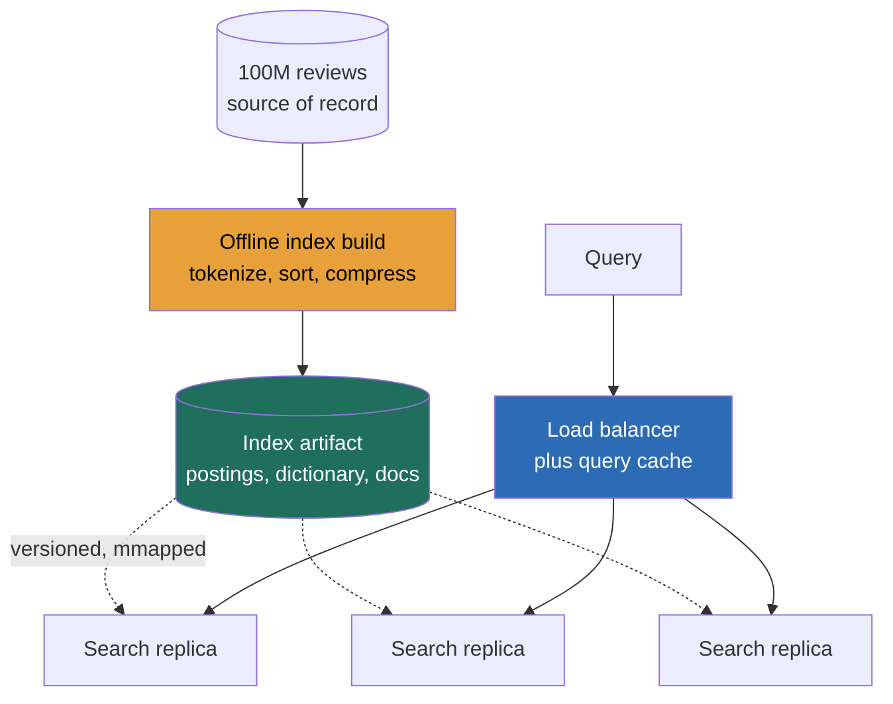

> **Why this gets asked at Director level:** "Search 100M restaurant reviews by keyword" is a **scale-illusion test**. The number 100M triggers the cluster reflex, and the reflex is wrong by two orders of magnitude: ten-word reviews make a **~1 GB compressed index that fits in RAM on one machine**. It is also a **requirements test**, since "all reviews with all the terms" means boolean AND with **no ranking at all**, and the query `Best italian fo fod` smuggles in typo correction. The Director signal is doing the arithmetic before drawing boxes, then saying out loud that read-only deletes most of a search engine's complexity.

### Learning objectives

1. Do the **index arithmetic** (1B postings, ~4 GB raw, ~1 GB compressed, ~2.6 MB term dictionary) and let it kill the sharding reflex before you draw a single box.
2. Read "output all reviews with all the terms" as **conjunctive boolean retrieval with no relevance ranking**, and name what that requirement buys you and what it costs the product.
3. Design **query-time typo correction** against the 130k-term dictionary (deletion neighborhoods vs BK-tree vs Levenshtein automaton), and defend why correction never happens at index time.
4. Order a multi-term intersection **rarest-first**, and pick the postings encoding (Roaring bitmaps vs delta-varint) from term density.
5. Name the **read-only superpower**: no write path means no segments, no refresh interval, no merges, no consistency problem, and an index that ships like a compiled binary.

### Intuition first

Picture a **recipe-card box**. Every review is one index card with about ten words on it. "100 million cards" sounds like a warehouse, but ten words is a single sentence, so the whole pile is roughly the text of a few thousand paperbacks. That is a bookshelf, not a warehouse. **The corpus is small. It only sounds big.**

Next to the cards sits a second, much smaller box: **the tab box**. One tab per English word, 130,000 tabs, and behind each tab a strip of paper listing the card numbers where that word appears. To answer "which cards say *italian* and *food*?" you never touch the cards. You pull two tabs and find the numbers that appear on both strips. The tab box is the inverted index, and the reason this problem is easy is that **the tab box is about a gigabyte and the cards are about five**, so both live in memory on one machine and you replicate for traffic rather than shard for size.

Now the typo. Someone asks for `fod`. There is no *fod* tab. The instinct of a junior designer is to go re-file the cards so that misspellings are findable, which means touching all 100 million of them. The correct move is the cheap one: **you fix the request against the tab labels, never the cards.** 130,000 labels is a list you can scan in milliseconds and index for microseconds, and the correction policy becomes something you can change on a Tuesday afternoon instead of a rebuild.

Hold three things through the rest of the lesson: **the pile is smaller than it sounds; the tab box answers the query without reading a card; and you correct against the tabs, never re-file the cards.**

---

## R: Requirements

> Two clarifying questions carry this entire design: *is there ranking?* and *what does "all the terms" mean when one of the terms is garbage?* Both are decided in R, and both collapse enormous amounts of machinery.

**Clarifying questions I would ask (with assumed answers):**

- *"Output list of all reviews with all the terms", so this is boolean AND with no relevance ranking?* → **Correct.** The load-bearing answer. No ranking means **no BM25, no term frequencies, no document-length normalization, no top-K early termination**, and the postings lists collapse to bare sorted document IDs. It also leaves the result set unordered and potentially in the millions, which becomes a bottleneck later.
- *The example query is `Best italian fo fod`, so typo correction is in scope?* → **Yes, at query time.** Note the second half of the example: `best italian restaurant` is explicitly a **non-match**, so the requirement is **lexical**, not semantic. Nobody is asking for *restaurant* to satisfy *food*, and saying that early is worth a lot, because semantic recall is a different system with a different cost curve.
- *Phrase or proximity queries?* → **No.** Terms may appear anywhere, in any order, which kills the positional index that would have been three to five times larger.
- *Read-only, truly?* → **Yes.** The strongest gift in the problem statement, unpacked in Storage.
- *Query rate and latency budget?* → Not given, so I assume **1,000 queries per second (QPS) peak, p99 under 100 ms**. Yelp-scale review search sits well under this.

**Functional requirements:**

1. **Search:** given a free-text query, return the document IDs of every review containing all query terms.
2. **Query analysis:** tokenize, lowercase, strip punctuation, stem, and drop stopwords consistently with how the index was built.
3. **Spelling correction:** map out-of-dictionary tokens to in-dictionary terms, and surface what was corrected.
4. **Pagination:** the match set can be millions of documents, so return a page, a cursor, and a total count.
5. **Snippets:** enough review text to render a result, which implies a document store next to the index.

**Explicitly CUT (scoping is the signal):** relevance ranking and personalization, phrase and proximity queries, filters and facets (cuisine, city, rating, geo), multi-language analysis, autocomplete, real-time indexing, synonym and semantic expansion. I scope to **analyze, correct, intersect, page.**

**Non-functional requirements:** p99 under 100 ms end to end including correction; cost bounded to a handful of replicas rather than a cluster; **availability through replication only**, since a read-only immutable artifact makes every replica byte-identical and leaves **no consistency problem in this system at all**, not eventual, not strong, none; recall under typos without wrecking precision; and **rebuild plus rollback as a routine operation**, because a read-only index is a deploy artifact whose failure mode is a bad build, not a bad write.

**The load-bearing tension, named:** **the scale illusion.** The requirement says 100 million documents, which sounds like a sharded cluster; the arithmetic says one gigabyte, which is a single process. Everything downstream depends on doing the estimation before committing to an architecture.

---

## E: Estimation

> **This is the step that decides the architecture,** not background sizing. The whole point of the question is that the numbers disagree with the instinct.

**Token and postings count.** `100M documents × 10 words = 1B token occurrences`. Distinct `(term, document)` pairs are slightly fewer, since a ten-word review occasionally repeats a word, so call it **~1B postings entries**. Round up, do not compute precisely.

**Document IDs.** 100M documents needs 27 bits, so IDs are **dense 4-byte integers assigned at build time**, `0` through `10^8`. Raw uncompressed postings are therefore `1B × 4 B = 4 GB`.

**Compression.** Postings lists are **sorted ascending integers**, which is the single most compressible thing in computing. Delta-encode consecutive IDs, then variable-byte or bit-pack the gaps, or use Roaring bitmaps for dense terms. A 3x to 4x ratio is routine. **The index is ~1 to 1.5 GB.**

**Term dictionary.** 130,000 terms × roughly 20 B (the term itself, a postings offset, a document frequency) ≈ **~2.6 MB**. The dictionary is not a scaling concern; it is a rounding error, and that fact is what makes query-time correction cheap.

**The document store.** Ten words at roughly 6 bytes each is **~60 B of text per review**, plus metadata (restaurant ID, rating, timestamp) at ~100 B. `100M × 160 B ≈ 16 GB` raw, and text compresses roughly 3x, so **~5 GB stored**.

| Component | Size | Note |
|---|---|---|
| Postings, uncompressed | **~4 GB** | 1B entries × 4 B document IDs |
| Postings, compressed | **~1 to 1.5 GB** | delta + varint, or Roaring for dense terms |
| Term dictionary | **~2.6 MB** | 130k terms; effectively free |
| Spell-correction table | **~20 to 200 MB** | deletion neighborhoods, distance 1 or 2 |
| Document store | **~5 GB** | compressed review text plus metadata |
| **Total serving footprint** | **~7 GB** | **fits in RAM on one machine, nine times over on a 64 GB box** |

**Average postings list length** is `1B / 130k ≈ 7,700 documents per term`, but that average lies, because English is Zipfian: the top ~100 words are roughly half of all running text. **"the" alone lands in ~50 to 60M documents**, a single postings list of ~60 million entries, while the median term sits in a few hundred. **The cost of this system lives entirely in the head of the Zipf curve**, and that observation drives both the stopword policy and the encoding choice.

**Query cost.** Take `best ∧ italian ∧ food`, with plausible document frequencies in a restaurant corpus of *italian* ≈ 3M, *best* ≈ 8M, *food* ≈ 15M. Intersecting **rarest-first** by walking the 3M-entry list and probing the others with galloping search costs `3M × 2 × log(15M) ≈ 150M` comparisons, tens of milliseconds, too slow. With **Roaring bitmap containers on the dense terms** the same intersection is a word-parallel AND over `100M bits / 64 = 1.6M` machine words per pair, **well under a millisecond**. The encoding choice is worth two orders of magnitude, so it is a real decision, not an implementation detail.

**Fleet sizing, the punchline.** At ~2 ms of CPU per query, **1,000 QPS needs about two cores.** The binding constraint is memory (~7 GB, so 16 to 32 GB per replica for headroom and page cache), not compute and not storage. **Three replicas across availability zones (AZs) is the whole production fleet**, roughly $1,000 per month, with an order of magnitude of headroom.

**What estimation decided:** the index fits in memory on one machine, so **do not shard**. Replicate for availability and query throughput. A 50-shard Elasticsearch cluster for 100M ten-word documents is paying scatter-gather tail latency and operational cost for a size problem that does not exist.

---

## S: Storage

> Read-only is not a minor detail. It converts the search index from a live, mutable, consistency-managed database into a **build artifact that ships like a compiled binary**, which deletes most of the machinery a general search engine exists to provide.

**1. The index is an immutable artifact, built offline.** A batch job (Spark, or plain MapReduce over the corpus) tokenizes 1B tokens, groups by term, sorts document IDs, compresses, and emits one index file plus a dictionary file. Serving replicas **memory-map the artifact** and never write to it. Deploy is a file copy and a pointer flip; rollback flips the pointer back.

**What this deletes is a long list:** no write-ahead log, no in-memory buffer, no segment files, no **refresh interval** trading indexing throughput against search freshness, no background merges, no delete tombstones, no replica write path, and **no consistency model**. Roughly half of what makes Elasticsearch complicated exists to serve a requirement this problem explicitly does not have, and naming that trade is the strongest single move in the question.

**2. Postings encoding, chosen by term density.** Use **Roaring bitmaps**, which pick a container per 64k-document block: a sorted array for sparse blocks, a bitmap for dense ones, run-length for runs. A 15M-document term costs ~12 MB and ANDs word-parallel; a 200-document term stays a small array. *Rejected: delta plus variable-byte everywhere.* Marginally smaller on sparse lists, but it forces the sequential merge-walk on dense ones, the 150M-comparison path above. *Rejected: raw 4-byte IDs.* 4 GB still fits, but you give up the word-parallel AND and quadruple memory bandwidth for nothing.

**3. Dense integer document IDs, assigned at build time.** Because nothing is ever inserted, **you get to choose the numbering**, and dense ascending integers are what make delta encoding and bitmaps work at all. *Rejected: using the source review UUID as the postings entry.* 16 bytes per entry, no delta compression, and the index goes from ~1 GB to ~16 GB for zero benefit. A side-table maps dense ID back to external review ID.

**4. The document store and the correction table**, both memory-mapped locally: compressed review text keyed by dense ID (~5 GB) for snippets, and a hash map from deletion variants to dictionary terms (tens to low hundreds of megabytes) for correction, both emitted by the same offline job. *Rejected: fetching snippets from the primary review database per result.* Fifty results per page becomes fifty round trips and makes an in-memory search service latency-bound on someone else's database.

**The build-versus-buy statement, said explicitly:** for a real product I would ship this on OpenSearch in a week and spend the engineering budget on ranking, which is where the product value is. I design the internals here because the question asks for the mechanism, and because the read-only one-gigabyte shape is a genuine case where a purpose-built in-memory service beats a cluster on latency and cost. **Postgres with a GIN (generalized inverted index) on a `tsvector` column is also legitimate at low query rates**, and it strains exactly where you would expect: an AND of three common lexemes over 100M rows.

---

## H: High-level design

> Two planes that share nothing at runtime: an **offline build plane** that produces a versioned artifact, and an **online serving plane** of identical stateless replicas that memory-map it.


```mermaid
flowchart TB
    CORPUS[("100M reviews<br/>source of record")] --> BUILD["Offline index build<br/>tokenize, sort, compress"]
    BUILD --> ART[("Index artifact<br/>postings, dictionary, docs")]

    ART -.->|"versioned, mmapped"| R1["Search replica"]
    ART -.-> R2["Search replica"]
    ART -.-> R3["Search replica"]

    Q["Query"] --> LB["Load balancer<br/>plus query cache"]
    LB --> R1
    LB --> R2
    LB --> R3

    style ART fill:#1f6f5c,color:#fff
    style BUILD fill:#e8a13a,color:#000
    style LB fill:#2d6cb5,color:#fff
```

**The query path inside one replica:**


```mermaid
flowchart LR
    IN["Best italian fo fod"] --> AN["Analyze<br/>lowercase, stem, stopwords"]
    AN --> SP["Correct unknown terms<br/>vs 130k dictionary"]
    SP --> PL["Fetch postings<br/>rarest term first"]
    PL --> IX["Intersect<br/>AND of OR candidates"]
    IX --> PG["Page plus snippets"]

    style SP fill:#e8a13a,color:#000
    style IX fill:#1f6f5c,color:#fff
```

**Happy path, compressed.** `Best italian fo fod` analyzes into `best, italian, fo, fod`, two of which miss the dictionary. `fod` is three characters, so it corrects within edit distance 1 to a candidate set ranked by corpus document frequency, which in a restaurant corpus puts **food** far ahead of *fog* or *fad*. `fo` is two characters, below the correction threshold, and is **dropped as noise**. The replica fetches postings for the survivors, orders them **rarest-first** (*italian* at 3M, then *best* at 8M, then the *food* candidate union at ~15M), intersects, and pages the result with local snippets. `This is the best italian food in the city` matches; `This is the best italian restaurant in the city` fails for lack of any `fod` candidate, exactly as the example specifies.

**The shape to notice:** every replica is a **complete, identical, read-only copy**, so there is no scatter, no gather, no coordinator, no cross-node tail latency, and no rebalancing. That is the dividend of doing the arithmetic first.

---

## A: API design

> A small surface. The meaningful decisions are that **the system reports its own interpretation of the query**, and that paging is cursor-based over a materialized match set.

```
# --- Search ---
GET /v1/search?q=Best+italian+fo+fod&limit=50&cursor=<opaque>&exact=false
  -> 200 {
       interpretation: {
         terms:      ["best", "italian", "food"],
         corrected:  [{ from: "fod", to: ["food","fad"], distance: 1 }],
         dropped:    [{ token: "fo", reason: "too_short_to_correct" }],
         stopwords:  []
       },
       totalMatches: 12843,
       results: [ { reviewId, snippet } ],
       nextCursor: "<opaque>"
     }

# --- Escape hatch: no correction, no stopword removal ---
GET /v1/search?q=fod&exact=true
  -> 200 { interpretation: { terms:["fod"] }, totalMatches: 0, results: [] }
```

**Design notes (each with its rejected alternative):**

- **The response returns the interpretation, not just the results**, so the caller learns that `fod` became `food` and `fo` was discarded. *Rejected: silently rewriting the query.* Silent correction is a trust bug and makes zero-result debugging impossible, which is why every real search product ships a "Showing results for…" line.
- **`exact=true` disables correction and stopword removal.** *Rejected: correction as an unconditional stage.* Someone eventually searches for a restaurant literally named *Fod*.
- **Cursor pagination, not `offset`.** The cursor encodes the last document ID emitted, so the next page resumes the intersection walk. *Rejected: `offset=50000`*, which re-runs the intersection and discards the prefix, making deep pages linearly slower.
- **`totalMatches` is exact**, affordable only because the intersection is fully materialized in RAM. At ten times the corpus it becomes a capped estimate, a real degradation to name rather than a footnote.

---

## D: Data model

> Four structures. The decisions that matter are the ID assignment, the per-term encoding switch, and the shape of the correction table.

**Term dictionary:** `term -> { documentFrequency, postingsOffset, encoding }`, a flat hash map of 130k entries in ~2.6 MB. `documentFrequency` is the field that makes rarest-first ordering possible, so it is load-bearing metadata, not statistics.

**Postings blob:** for each term, an ascending list of dense document IDs, encoded as Roaring containers for dense terms and delta-plus-varint arrays with skip pointers for sparse ones. **No term frequencies and no positions**, because there is no ranking and there are no phrase queries. That absence is the requirement paying a dividend, and it is roughly a 3x size saving over a general-purpose index.

**Document store:** `denseDocId -> { externalReviewId, compressedText, restaurantId }`, memory-mapped, for snippets and for mapping back to the caller's ID space.

**Correction table:** a map from **deletion variants** to the dictionary terms that produce them. Deleting one character from `food` yields `ood, fod, fod, foo`, so `fod -> {food}` is a direct hash probe. Building this for every dictionary term at distance 1 costs roughly `130k × 8 ≈ 1M` entries, about 20 MB. Extending to distance 2 costs roughly 5M entries, low hundreds of megabytes. **On a box holding a 7 GB working set, that memory is free, and it converts correction from milliseconds of CPU into a microsecond hash probe.**

**Dense document IDs assigned at build time is the load-bearing modeling decision**, since it is what makes every compression and bitmap technique above possible. The free option worth taking: **assign IDs in descending order of a static quality score** (review helpfulness, restaurant popularity). It costs nothing today, and the day ranking becomes a requirement, the postings lists are already ordered best-first and early termination becomes available without a re-encode.

<details>
<summary>Go deeper, the three ways to find candidates within edit distance k (IC depth, optional)</summary>

**Brute-force Levenshtein against the dictionary.** For each of 130k terms, run the dynamic-programming edit-distance table, roughly 8×8 = 64 cell updates for typical word lengths, so ~8.3M cell updates per unknown term, about 5 to 10 ms. At 1,000 QPS with one unknown term per query that is 5 to 10 cores burned on typos. It works, and it is the wasteful baseline the other two beat.

**Deletion neighborhoods (the SymSpell approach), chosen here.** Precompute every string obtained by deleting up to `k` characters from every dictionary term, storing `variant -> {terms}`. At query time, generate the query token's deletion variants and probe the map. Because deletions alone are sufficient to connect any two strings within edit distance `k` through their common deletion variants, this finds all candidates with pure hash lookups, roughly a thousand times faster than brute force. The cost is precomputed memory that grows quickly with `k`, which is fine at `k ≤ 2` on a 130k dictionary and would not be fine on a multi-million-term vocabulary.

**BK-tree.** A metric tree over edit distance that uses the triangle inequality to prune: from a node at distance `d` from the query, only children in the distance band `[d-k, d+k]` can contain matches. Typically visits 5 to 15 percent of nodes, tens of microseconds, and adds almost no memory over the dictionary itself. The right pick when memory is tight rather than abundant.

**Levenshtein automaton over a finite state transducer (FST), what Lucene does.** Compile the query term into a deterministic finite automaton (DFA) accepting all strings within edit distance `k`, then intersect that automaton with the FST-encoded term dictionary, enumerating matches in a single pass. It is the most elegant and scales to enormous vocabularies. At 130k terms it is over-engineering, and I would say so rather than reach for the most sophisticated option available.

</details>

---

## E: Evaluation

> Re-check against the NFRs (p99 under 100 ms, bounded cost, availability by replication, recall under typos, routine rebuilds) and then hunt the bottlenecks, naming each trade.

**Re-check vs NFRs:** latency, sub-millisecond intersections plus microsecond correction leaves the 100 ms budget almost untouched. Cost, three replicas at roughly $1,000 per month. Availability, identical immutable replicas behind a load balancer with no consistency question to answer. Recall, correction handles non-word typos. Rebuilds, artifact swap plus pointer flip. Now what actually breaks.

**Bottleneck 1, the head of the Zipf curve.** `the` sits in ~60M documents, a single 60-million-entry postings list contributing essentially zero selectivity. *Fix:* **drop stopwords from the query** using the same list the index was built with, unless every query term is a stopword. *Trade-off:* `the who` becomes unanswerable, the classic stopword bug, acceptable here precisely because phrases are out of scope and unacceptable the moment they are not. *Rejected: keeping stopwords and relying on skip pointers.* It works, and it pays memory bandwidth on every query for a term that changes no result.

**Bottleneck 2, intersection order.** Intersecting left-to-right in query order costs the length of whichever list you happened to start with. *Fix:* **sort terms by document frequency ascending and intersect rarest-first**, bounding the walk by the smallest list. Starting from *italian* at 3M rather than *food* at 15M is a 5x difference before any encoding trick, which is why `documentFrequency` lives in the dictionary.

**Bottleneck 3, the short-token correction explosion.** `fo` is two characters, and nearly every short English word is within edit distance 1 of it, so correcting it yields dozens of candidates and turns a precise query into a vague one. *Fix:* **cap edit distance by token length** (Lucene's rule: length ≤ 2 gets distance 0, 3 to 5 gets distance 1, 6 or more gets distance 2), then cap candidates to the **top 3 by corpus document frequency**. Under that rule `fo` is dropped and `fod` maps to `food`, exactly the example's behavior. *Related fix:* **only correct out-of-dictionary tokens**, so `form` is never silently rewritten to `from`. *Trade-off, stated honestly:* real-word errors (`fo` for `of`, `their` for `there`) become uncorrectable, since resolving them needs sentence context and a language model. A deliberate scope boundary, not an oversight.

**Bottleneck 4, the unranked million-result page.** `best food` might match 20M reviews, and the requirement says return all of them. *Fix:* cursor pagination with an exact total. *The real finding is a product one:* page 1 of an **unranked** 20-million-result set is arbitrary, so the requirement is satisfiable and the product built on it is not usable. **Ranking will be the next requirement within a month.** Surfacing that, then showing the design absorbs it cheaply (term frequencies in the postings, BM25, early termination on quality-ordered IDs), beats both ignoring it and ranking uninvited.

**Bottleneck 5, my own vocabulary assumption.** The stated 130k is what a dictionary holds; what 100M pieces of **user-generated text** hold is proper nouns, brands, misspellings, and emoji, more like 1M to 5M distinct tokens. *Impact:* the dictionary grows from 2.6 MB to ~100 MB and the correction table grows with it. **The architecture does not change.** Stress-testing your own assumption and showing it does not move the decision is worth more than the assumption being right.

**Bottleneck 6, the bad build.** With no write path, the only way this system serves wrong data is a bad artifact. *Fix:* version every artifact, validate against a golden query set, canary one replica, keep the previous artifact on disk so rollback is a pointer flip. *The operational trade of read-only:* zero write-path incidents in exchange for a deploy pipeline that has to be trustworthy.

---

## D: Design evolution

> Push each axis and name what breaks first, then name what I hand to a specialist.

**At 10x corpus (1B reviews):** the index goes to ~10 to 15 GB and the document store to ~50 GB. The index still fits on one machine; the document store no longer comfortably does. **Split them:** index in memory on the search replicas, snippets behind a separate document service or cache-fronted blob store. If the index eventually outgrows a box, shard **by document** and accept scatter-gather. *Trade-off:* p99 becomes the p99 of the slowest shard, the exact tail-latency cost I avoided at 100M and would now be buying deliberately. *Rejected: term-partitioning*, whose only advantage is narrow single-term reads, which multi-term AND queries erase while keeping its write-fan-out pain.

**At 100x queries (100,000 QPS):** still not a sharding problem. Replicas are free to create from an immutable artifact, so add them linearly and put a query cache in front; query distributions are Zipfian too, so a modest cache absorbs a large share.

**When the requirement changes, and it will:**
- **Ranking arrives** → term frequency and document length in the postings, BM25, early termination on the quality-ordered IDs. Index grows ~1.5x, cheap because the ID ordering was chosen for free at build time.
- **Phrase queries arrive** → a positional index, 3x to 5x larger. A real cost, and now genuinely multi-machine.
- **Read-only ends** (reviews stream in live) → an in-memory delta index, periodic merges, and a freshness-versus-throughput refresh knob. **At that point you have reinvented Lucene, and that is the moment to stop building and buy.** Naming the precise condition under which my own design should be discarded is the Director move here.
- **Semantic matching arrives** (`restaurant` should satisfy `food`) → embeddings plus an approximate-nearest-neighbor (ANN) index, hybrid with the lexical path. A product decision about precision, not an engineering upgrade.

**Where I would delegate:** *"Search quality owns the stemmer, stopword list, and edit-distance thresholds against a labeled query set; my prior is Porter stemming, Lucene's length-based rule, and three candidates ranked by corpus frequency."* *"The team benchmarks Roaring against delta-varint on our real term distribution; my prior is Roaring for the dense head, and I care about the benchmark, not the codec."* *"Data engineering owns the rebuild job and its validation gate; my prior is nightly with golden-query validation and one-flip rollback."* What I keep is the shape: **do not shard, correct at query time, intersect rarest-first, and know the exact requirement change that makes buying beat building.**

---

### Trade-offs: the pivotal decisions

| Decision | Option A | Option B | Option C | Use when… |
|---|---|---|---|---|
| **Where search runs** | **Purpose-built in-memory index** (our pick) | **Elasticsearch / OpenSearch** | **Postgres GIN on `tsvector`** | **A** when the corpus fits in RAM and is read-only, skipping a cluster and its tail latency. **B** the production default the moment writes, ranking, facets, or multi-language arrive. **C** up to a few million documents at low QPS, when the data already lives in Postgres. |
| **Typo correction** | **Query-time, deletion neighborhoods** (our pick) | **Query-time, BK-tree or Levenshtein automaton** | **Index-time expansion of misspellings** | **A** when memory is abundant and the dictionary small, buying microsecond correction for ~100 MB. **B** when memory is tight (BK-tree) or the vocabulary runs to millions of terms (automaton over an FST). **C** essentially never: it inflates the index, freezes the correction policy into the artifact, and destroys exact matching. |
| **Postings encoding** | **Roaring bitmaps** (dense terms) | **Delta plus variable-byte with skips** (sparse terms) | **Raw 4-byte IDs** | **A** for high-frequency terms, where word-parallel AND is two orders of magnitude faster than a merge walk. **B** for the long tail, where arrays are smaller and skips suffice. **C** prototypes only: 4x memory, no parallel AND. |
| **Partitioning** | **None, replicate only** (our pick) | **Document-partitioned shards** | **Term-partitioned shards** | **A** whenever the index fits in RAM on one machine, which at 100M ten-word documents it emphatically does. **B** once the index genuinely exceeds one box, buying scatter-gather tail latency deliberately. **C** almost never here: narrow single-term reads are its only advantage, and multi-term AND erases it. |

---

### What interviewers probe here (Director altitude)

- **"How many machines does this need?"** *Strong:* does the arithmetic out loud first, 1B postings at 4 B is 4 GB raw and ~1 GB compressed, plus ~5 GB of documents, so **one machine holds it and three replicas are the fleet**; sizes the CPU (about two cores at 1,000 QPS) and the bill (~$1,000 per month). *Red flag:* reaching for a sharded cluster because the word "100 million" appeared, without ever computing the index size.
- **"Does the requirement need ranking?"** *Strong:* reads "all reviews with all the terms" as **boolean AND with no ranking**, states what that removes (BM25, term frequencies, positions, top-K termination, roughly a third of the index), then flags the unranked 20-million-result page as the product problem that arrives next. *Red flag:* implementing BM25 nobody asked for, or never noticing the result set is unbounded and unordered.
- **"Where does typo correction live, and why?"** *Strong:* **query time, against the 130k-term dictionary**, because the dictionary is 2.6 MB and the corpus is 100M documents, so you correct the request rather than re-file the corpus; adds the length-based distance cap and corpus-frequency candidate ranking. *Red flag:* index-time expansion of misspellings, or brute-force Levenshtein per query with no cost estimate.
- **"Walk me through `Best italian fo fod`."** *Strong:* analyze, detect both out-of-dictionary tokens, drop `fo` on the length rule, expand `fod` to a frequency-ranked candidate set, intersect `best ∧ italian ∧ (food ∨ …)` **rarest-first**, and explain why `best italian restaurant` correctly fails. *Red flag:* silent correction with no reporting, or ANDing an uncorrectable token and returning zero results with no explanation.
- **"What does read-only buy you, and when would you throw this design away?"** *Strong:* names the deleted machinery (segments, refresh interval, merges, tombstones, write path, consistency model entirely), then names the condition that inverts the decision, **live writes mean rebuilding Lucene, so buy instead**. *Red flag:* treating read-only as a minor simplification, or defending the custom build past the point it stops making sense.

---

### Common mistakes

- **Sharding by reflex.** 100M documents at 10 words each is a one-gigabyte index. Compute the size before choosing an architecture; the number of documents is not the number that matters.
- **Correcting typos at index time.** It multiplies the index, freezes a policy into an artifact, and wrecks exact matching. Correct the query against the 130k-term dictionary instead, which is 2.6 MB and revisable any afternoon.
- **Intersecting postings in query order.** Always sort by document frequency and start with the rarest term, which is why the dictionary stores `df`. Ignoring the Zipf head (`the` in ~60M documents) is the same mistake wearing a different hat.
- **Silently rewriting the user's query.** Return the interpretation (corrected, dropped, stopworded) and offer an `exact=true` escape hatch, or zero-result debugging becomes impossible and the product loses trust.
- **Building the general-purpose engine the requirement excluded.** No ranking, no phrases, and no writes means no term frequencies, no positional index, and no segment machinery. Building them anyway is the classic altitude failure: paying for capability nobody asked for.

---

### Practice questions (with model answers)

**Q1. Before drawing anything, size the index for 100M reviews of 10 words each over a 130k-word dictionary. What does the number tell you to do?**

<details>
<summary>Model answer, try yours out loud first</summary>

> *Model answer:* `100M × 10 = 1B` token occurrences, so roughly **1B postings entries**. Document IDs are dense 4-byte integers, so raw postings are **4 GB**, and because postings are sorted ascending integers they delta-compress 3x to 4x, giving **~1 to 1.5 GB**. The term dictionary is `130k × ~20 B ≈ 2.6 MB`, effectively free. The reviews are ~60 B of text plus metadata, so ~16 GB raw and **~5 GB compressed**. Total working set **~7 GB**, which fits in RAM on a single 32 GB machine with room to spare. The number tells me **not to shard**: replicate three ways across AZs for availability and throughput, and the fleet is about two cores of real work at 1,000 QPS. A 50-shard cluster buys scatter-gather tail latency to solve a size problem that does not exist.

</details>

**Q2. Walk through `Best italian fo fod` and explain why `This is the best italian restaurant in the city` is correctly excluded.**

<details>
<summary>Model answer, try yours out loud first</summary>

> *Model answer:* Analysis gives `best, italian, fo, fod`, and both `fo` and `fod` miss the dictionary. Edit distance is capped by token length, so `fo` at two characters gets distance 0, produces no candidates, and is **dropped as noise** rather than ANDed into oblivion. `fod` at three characters gets distance 1; a deletion-neighborhood probe returns `food`, `fad`, `fog`, ranked by **document frequency in this corpus** (restaurant reviews make `food` dominant), top three OR-ed. The query becomes `best ∧ italian ∧ (food ∨ fad ∨ fog)`, intersected rarest-first from `italian`. The restaurant sentence has `best` and `italian` but no `fod` candidate, so it fails the AND. That is the requirement working correctly: this is **lexical** retrieval, and making `restaurant` satisfy `food` needs embeddings and hybrid retrieval, a different system and a different product decision.

</details>

**Q3. The system is read-only. What does that actually remove from a search engine, and what would put it back?**

<details>
<summary>Model answer, try yours out loud first</summary>

> *Model answer:* It removes the entire write path and everything supporting it: the write-ahead log, the in-memory buffer, immutable segment files, the **refresh interval** trading indexing throughput against search freshness, background merges, delete tombstones. It also removes the consistency model completely, since every replica memory-maps a byte-identical artifact, so this system is neither eventually nor strongly consistent, it simply has no consistency question. The index becomes a **build artifact**: versioned, validated against golden queries, canaried, rolled back with a pointer flip. What puts it all back is **live writes**. The moment new reviews must be searchable within seconds I need a delta index, periodic merges, and a freshness knob, at which point I am rebuilding Lucene badly and should run OpenSearch instead. Knowing that threshold is more useful than the custom design itself.

</details>

**Q4. In what order do you intersect the postings lists, and what encoding do you use? Show the difference it makes.**

<details>
<summary>Model answer, try yours out loud first</summary>

> *Model answer:* **Rarest-first**, sorted by the document frequency stored in the term dictionary, because a conjunction's cost is bounded by the smallest list, not the largest. For `best ∧ italian ∧ food` at 8M, 3M, and 15M, I start at `italian`, a 5x difference before any other trick. Encoding follows term density: **Roaring bitmaps for the dense head**, where the AND is word-parallel over `100M bits / 64 ≈ 1.6M` machine words and finishes well under a millisecond, against roughly 150M comparisons (tens of milliseconds) for a galloping merge walk. The sparse tail stays delta plus variable-byte with skip pointers. Separately I drop stopwords, since `the` sits in ~60M documents and adds no selectivity, accepting that `the who` degrades, which is acceptable only because phrases are out of scope.

</details>

---

### Key takeaways

1. **Do the arithmetic before the architecture.** `100M × 10 words = 1B postings ≈ 4 GB raw ≈ 1 GB compressed`, plus ~5 GB of text and a 2.6 MB dictionary, so **the whole system fits in RAM on one machine**: replicate for availability and throughput, do not shard. The scale illusion is the question.
2. **"All reviews with all the terms" is boolean AND with no ranking**, deleting BM25, term frequencies, positions, and top-K termination, roughly a third of a general index. It also guarantees an unranked, unbounded result set, so name ranking as the next requirement rather than ignoring it or building it uninvited.
3. **Correct typos at query time against the 130k-term dictionary, never at index time.** The dictionary is 2.6 MB and the corpus is 100M documents, so you fix the request instead of re-filing the corpus, and the policy stays revisable. Cap distance by token length (`fo` dropped, `fod` becomes `food`), rank candidates by corpus frequency.
4. **Intersect rarest-first and pick the encoding by term density.** Document frequency lives in the dictionary for exactly this reason; Roaring makes the dense-term AND word-parallel and sub-millisecond where a merge walk is tens of milliseconds. Drop stopwords, since `the` sits in ~60M documents and changes no result.
5. **Read-only is the gift, and it has a precise expiry date.** No write path means no segments, no refresh interval, no merges, and no consistency model, with the index shipping like a compiled binary. Live writes mean rebuilding Lucene, and that is the condition under which buying beats building.

> **Spaced-repetition recap:** Review keyword search is the **scale-illusion problem**: `100M × 10 words = 1B postings ≈ 4 GB raw ≈ 1 GB compressed`, plus ~5 GB documents and a 2.6 MB dictionary, so **one machine holds it and three replicas are the fleet**, no sharding. The requirement is **boolean AND, no ranking**, stripping term frequencies, positions, and phrase support from the index and leaving an unranked result set that will demand ranking within a month. **Typo correction is query-time only**: deletion neighborhoods over the 130k dictionary, distance capped by token length (`fo` dropped, `fod` becomes `food`), candidates ranked by corpus frequency and OR-expanded inside the AND. **Intersect rarest-first**, Roaring for the Zipf head, delta-varint for the tail, stopwords dropped. **Read-only deletes the write path, segments, refresh interval, merges, and the consistency model entirely**, shipping the index as a versioned artifact with pointer-flip rollback. Live writes are the exact trigger to buy instead of build.

---

*End of Lesson 5.15. Review keyword search is the course's arithmetic-before-architecture problem: the corpus size is a decoy, and a Director who computes the index before drawing boxes lands on a single-machine, three-replica system where the reflex answer was a fifty-node cluster. The two requirement reads that carry the round are **no ranking** (which strips a third of the index) and **read-only** (which strips the entire write path and the consistency model with it). Everything interesting then lives in one place: correcting the query against a 2.6 MB dictionary instead of re-filing a 100M-document corpus. Related: the distributed-search building block, which covers the same inverted index when you buy rather than build it, and the typeahead problem, which is the prefix-matching sibling of the same corpus.*
