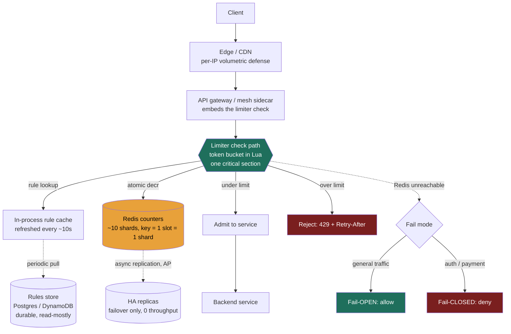

### Learning objectives
- Run a rate-limiting **service** (not a single counter) through all eight **RESHADED** steps, scoping it to a defensible core and quantifying every layer.
- Recognize that a rate limiter is the **opposite of a read-heavy system** - the counter path is **~100% writes** - and let that one fact drive estimation, store choice, and where the bottleneck lives.
- Split the design into **two planes with opposite characteristics** - a read-mostly **rules/config** store and a write-heavy **counter** store - and justify a different technology for each.
- Make the Director calls: **where to enforce** (sidecar/gateway vs central service), **how to break the hot-key ceiling** (local leasing vs sharded counters), and **what to defer** to a delegated deep-dive.

### Intuition first
You are not designing *a* rate limiter - Lesson 3.10 already built the bouncer with the clicker. You are designing the **rate-limiting service the whole company calls**: thousands of gateway pods asking "can this request through?" against limits configured per user, key, and route. The crux is that this service is **almost entirely writes**. Every "can I?" is really "decrement the counter and tell me if it went negative" - a read-modify-write, never a plain read. That forbids the two reflexes of read-heavy design: you **cannot** add read replicas (a stale counter is a *wrong* limit) and you **cannot** cache the answer (it changes on every request). The only knob is splitting the keyspace across shards - until a single global limit forces every request onto **one** key on **one** shard that **cannot be split**. So the problem is: keep per-request cost near zero, never let the limiter outlive the service it protects, and have a real answer for the one counter you can't shard.

---

## R - Requirements

**Framing.** A standalone rate-limiting capability that any caller (API gateway, mesh sidecar, edge node) consults before admitting a request. Operators define **rules**; the service **enforces** them with very low added latency and **never** becomes the reason an endpoint is down.

**Functional requirements.**
- **Configurable rules** scoped by **user / API-key / route**, each a **sustained rate + burst** (the two-number limit from 3.10) - e.g. `route=/search, tier=pro → 1,000 req/min, burst 200`.
- **An allow/deny decision** per request, returning **HTTP 429 + `Retry-After`** and `X-RateLimit-Remaining` so good clients self-throttle.
- **Rule management** with changes effective within a bounded propagation window.

**Non-functional requirements (where the design turns).**
- **Very low added latency** - the limiter sits on the hot path of *every* request: budget **< 1-2 ms p99 added**. A 10 ms limiter is a tax that gets ripped out.
- **Horizontal scale** to **~1M decisions/s** at peak.
- **Fail-open by default** - if the backing store is unreachable, **allow** general traffic; **fail-closed** only on auth/payment/abuse endpoints where an open door is the bigger risk (the 3.10 split).
- **Approximate is fine** - a brief over-admit after a failover is harmless. We will **not** pay for exact, strongly-consistent enforcement.

**Clarifying questions (scope before build):** sustained + burst → **token bucket** default; per-key precise + per-IP coarse; **single-region v1** (multi-region active-active is the hardest part - deferred deliberately to step D); rules propagate in **seconds**, not real time → cache and pull, no hot config path.

**CUT for v1:** rule-authoring admin UI, real-time rule push, usage analytics/billing, multi-region active-active. **Kept:** the rules/config plane scoped per user/key/route - the functional substance that makes this a *service* rather than 3.10's single counter.

**Read:write skew - the load-bearing assumption.** **The counter path is ~100% writes.** Every decision mutates a counter; there is no read half to serve from a replica or cache, because a stale counter produces a wrong limit. The only reads are **rule lookups** - tiny, low-cardinality, staleness-tolerant, trivially cacheable. **Rules are read-heavy and cacheable; counters are write-heavy and uncacheable.** That sentence pre-decides the store choice (S), the bottleneck (Evaluation), and why replicas buy availability but **zero** throughput.

**Scale assumptions:** peak **~1M decisions/s**; **~10M active keys**; thousands of distinct **rules** (tiers × routes, not per-user).

---

## E - Estimation

Enough math to make a defensible call; round hard, state assumptions.

**Decision QPS.** Peak **≈ 1M decisions/s = ≈ 1M writes/s** to the counter store. Counter reads ≈ 0. **Rule reads** are ~1M/s *logically* but served from a per-instance in-memory cache refreshed every ~10 s → single-digit-thousand ops/s to the rules store. Negligible.

**Storage - counters.** Token-bucket state per key = two numbers (tokens + last-refill timestamp); assume **~100 B/key** with overhead. 10M keys × 100 B ≈ **~1-2 GB resident**. **Growth is bounded, not cumulative**: counters carry a TTL and expire when their window lapses, so storage tracks the **active keyset**, not time - the opposite of a content/log store (5.1, 3.13). 10× users → ~10-20 GB, still one Redis cluster.

**Storage - rules.** Thousands of rows × a few hundred bytes = **single-digit MB**. Durable, tiny, read-mostly. Per-instance rule cache: low-MB, fits in-process.

**Bandwidth.** ~150 B per decision round-trip × 1M/s ≈ **150 MB/s ≈ 1.2 Gbps** east-west - routine for a datacenter fabric, ~120 Mbps/shard across ~10 shards.

**Instances - two separate tiers.**
- **Counter store shards from *write* throughput.** Assume **~100k ops/s per Redis node** (stated assumption). 1M ÷ 100k ≈ **~10 shards**. Replicas add **zero throughput** - they are **failover warmth only**. So ~10 primaries + ~10 replicas ≈ 20 nodes; do *not* imply 20 nodes = 20× capacity.
- **Limiter tier sizes from request rate:** at ~25-50k decisions/s per thin instance (assumption; mostly network-wait), **~20-40 instances**.

**Headline numbers:** ~1M writes/s, ~1-2 GB counter RAM bounded by active keys, ~10 shards + ~10 HA replicas, ~20-40 limiter instances, < 1-2 ms p99 added. Everything hangs on "**it's all writes**."

---

## S - Storage

R/E already split the problem; S names the two stores and justifies each.

**Plane 1 - Counters: in-memory, write-optimized, AP → Redis.**
- *Access pattern:* ~1M atomic read-modify-writes/s, tiny TTL-bounded state, best-effort consistency, sub-ms latency.
- *Why Redis:* in-memory (~0.5-1 ms same-AZ), single-threaded per shard so the token-bucket update runs as **one atomic Lua script - never a separate read then write** (the over-admission race from 3.10); native TTL; AP-leaning, which is exactly what a best-effort limiter wants.
- *Rejected - Postgres:* a durable ACID disk store on every request adds milliseconds and pays for durability **wasted** on counters that expire in a minute. Reject on latency + pointless durability.
- *Rejected - a CP/consensus store (etcd, Spanner):* exact enforcement, but quorum latency on every request and lost availability under partition - the limiter becomes slower and more fragile than the service it guards, buying exactness that R declared a non-requirement. Reject on latency + availability for zero benefit.

**Plane 2 - Rules/config: durable, read-mostly → Postgres (or DynamoDB).**
- *Access pattern:* thousands of small rows, read-mostly, must survive restarts, queried by scope.
- *Why durable store + per-instance cache:* rules are the opposite of counters - cold, small, persistent, staleness-tolerant. Each limiter instance caches the full rule set in process with a short-TTL refresh, so rule reads cost **zero** network hops on the hot path.
- *Rejected - rules in Redis too:* couples cold durable config to the hot ephemeral counter store and risks **eviction** under counter memory pressure, for nothing (rules don't need sub-ms reads). Reject on coupling + eviction risk.
- *Rejected - hardcoded config files:* a limit change needs a redeploy, violating the seconds-to-propagate requirement. Reject on operability.

The split is the whole insight: **two stores, opposite characteristics, two technologies.**

---

## H - High-level design



**Where the limiter lives - the key H decision.** The check runs **embedded in the gateway/sidecar**, not as a central rate-limiter service the caller dials.
- *Why embedded:* the NFR is very low added latency. The decision already costs one Redis hop (~0.5-1 ms); a standalone central limiter adds a **second network hop**, roughly **doubling** added latency for no benefit. So the limiter is a library/sidecar co-located with the caller, sharing the Redis backend - the **Envoy `ratelimit`** model.
- *Rejected - standalone central limiter microservice:* simpler to own and language-agnostic, but the extra hop violates the latency budget on every request. Reasonable only if callers are too heterogeneous to embed a library.

**Happy path (admit).** Edge drops obvious floods → gateway extracts identity + route → embedded limiter resolves the rule from its **in-process cache** (no network hop) → one **atomic Lua script** against the counter's Redis shard updates the bucket and answers → under limit: admit with `X-RateLimit-Remaining`; over: **429 + `Retry-After`**. If Redis is unreachable, the fail-mode branch decides: open for general traffic, closed for auth/payment.

---

## A - API design

Two surfaces: the hot **decision API** and the cold, operator-facing **rules API**.

```
check_rate_limit(
    key:    string,    // the limiter key, e.g. "key:acct_42:route:/search"
    cost:   int = 1     // tokens to consume; cost-weighted endpoints pass >1
) -> {
    allowed:    bool,
    remaining:  int,      // tokens left → X-RateLimit-Remaining
    retry_after: int       // seconds until next token → Retry-After (0 if allowed)
}
```
- *`cost`, not a fixed 1:* an expensive route (an LLM call) consumes more tokens, so the limit reflects **load**. *Rejected - one request = one token:* lets a client pin you with expensive calls while staying "under the limit."
- *Returns `retry_after`, not a bare boolean:* otherwise clients blind-retry and amplify the storm.

```
PUT  /rules/{rule_id}        // upsert: {scope, sustained_rate, burst, window}
GET  /rules?scope=...         // list/inspect rules
DELETE /rules/{rule_id}
```
- *Scope* is the composite `{user?, api_key?, route?}`. Writes go to the durable rules store; propagation SLA is "seconds" via the instances' pull cycle. *Rejected - synchronously pushing every rule change to thousands of instances:* a fan-out and consistency problem for staleness the R step already accepted.

---

## D - Data model

**Counter records (Redis) - keyed by the limiter key itself.** The key (e.g. `tb:{acct_42}:{/search}`) **is the partition/shard key**: Redis maps `key → slot → shard`, and because the key encodes `{identity}:{route}`, distinct users/routes spread naturally across shards. That is *why* per-key limiting scales. State per key is two fields (tokens + last-refill timestamp) with a TTL, stored together so one atomic script updates both.

- *Rejected - sliding-window log (a ZSET of every request timestamp):* exact, but O(limit) entries per key → multi-GB at 10M keys for accuracy the tiers don't need. Keep it only for low-volume high-value limits ("3 password resets/hour"). Reject as the default on memory.

<details>
<summary>Go deeper, the atomic token-bucket update in Redis (IC depth, optional)</summary>

The Lua script does refill-check-decrement in one critical section: read `{tokens, ts}`, add `(now − ts) × rate` tokens capped at `burst`, check `tokens ≥ cost`, decrement if so, write back, and set the TTL **in the same call**. Single-threaded Redis makes the script a natural critical section, eliminating both 3.10 races: the read-modify-write over-admission race (Race B - two concurrent checks both see one remaining token) and the orphaned-key race from a separate `EXPIRE` (Race A). Fractional tokens from lazy refill are kept so low rates accrue correctly. Never implement this as GET → compute → SET from the client: the gap between read and write is exactly where concurrent over-admission lives.

</details>

**Rule records (Postgres/DynamoDB) - keyed by scope.** One row per rule: `rule_id` (PK), `scope` (indexed, e.g. `{tier: pro, route: /search}`), `sustained_rate`, `burst`, `window_s`. Rules are **low cardinality** - tiers × routes, a thousand rows covering millions of users; the `user → tier` mapping lives in the identity system. *Rejected - one rule row per user:* explodes a thousand-row table into 10M rows for no benefit.

**Where data lives:** counters in **Redis RAM** (ephemeral, ~1-2 GB, sharded by limiter key); rules in a **durable store** (tiny, replicated, cached in every instance's RAM).

---

## E - Evaluation

Re-check against the NFRs and hunt bottlenecks. Each fix names its trade-off.

**Bottleneck 1 - the hot key (the one that doesn't shard).** Per-key limits spread beautifully - but a **single global limit** funnels every request onto **one key → one slot → one shard**. You cannot shard your way out; at 1M/s that shard melts. **Fix - local token-leasing:** each limiter instance **leases a batch of budget** from the central counter ("grant me 500 tokens"), serves requests locally from its lease, and reconciles periodically. One change retires three bottlenecks at once: tail latency (most decisions become in-process), write amplification (one Redis write per lease, not per request), and hot-key concentration. *Trade-off:* you give up **global accuracy and cross-instance fairness** - an instance sitting on an unused lease strands budget another instance needs, and the global limit can drift by the outstanding leased amount. The lease batch size is the dial: smaller → tighter accuracy but more Redis round-trips; larger → lower latency but looser fairness. Precision is the currency, and R said we can spend it. *Alternative - sharded counters (3.16):* split the logical counter into K sub-keys, increment one at random, sum to read - tighter global visibility than leasing, at the cost of a K-key read. **Leasing when latency and hot-key relief dominate; sharded counters when global accuracy must stay tight.**

**Bottleneck 2 - tail latency from the Redis hop.** One network round-trip per request puts Redis on the p99 critical path. **Fix:** leasing removes most hops; co-locate Redis same-AZ; optionally a per-instance pre-check that rejects keys already known far over limit without touching Redis. *Trade-off:* the pre-check can be slightly stale - acceptable under best-effort.

**Bottleneck 3 - Redis as a single point of failure.** If the counter store is down, naively the whole API is down. **Fix - fail-open** for general traffic (the edge backstops volumetric abuse), **fail-closed** for auth/payment/abuse. *Trade-off:* during an outage, general traffic is briefly unthrottled - deliberately accepted, because the limiter must never down the service it protects. Replica promotion after a primary loss briefly over-admits (async replication lost the last updates) - harmless for best-effort.

**Bottleneck 4 - write amplification at 1M writes/s.** **Fix:** leasing (fewer, batched writes), plus plain fixed-window `INCR` instead of the token-bucket script on endpoints that don't need burst shaping. *Trade-off:* fixed window reintroduces the ~2× boundary burst (3.10) - fine where a momentary 2× is survivable.

**Re-check vs NFRs:** latency < 1-2 ms ✔ (one same-AZ hop, mostly elided by leasing); 1M/s ✔ (keyspace shards; global limits via leasing/sharded counters); fail-open ✔ (with the auth split); approximate-OK ✔. **Every fix spends the same currency - accuracy - which the requirements said we have to spend.**

---

## D - Design evolution

**At 10× (10M decisions/s, 100M active keys).** ~100 shards (keyspace shards linearly); ~10-20 GB resident, still RAM and bounded by active keys; limiter tier grows with the gateway fleet. **Leasing becomes mandatory** - at 10M/s you cannot afford a Redis hop per request, so most decisions are in-process from leases and Redis sees only reconciliation. The accuracy loss is now a deliberate, tuned parameter, not a side effect.

**Under a new constraint - global, multi-region active-active.** This is the hardest trade-off and where v1 deliberately stopped. A "1,000/min globally" key cannot make every request cross an ocean to one counter. The pragmatic default is **regional enforcement with async cross-region reconciliation** - effectively leasing extended across regions - accepting transient global over-admission between syncs. Static per-region sub-limits are simpler but strand budget when traffic is skewed; **synchronous global consensus** is rejected outright - cross-region quorum latency per request and lost availability under partition, the same CP rejection from S at higher stakes.

**Where I'd delegate (the Director move).** I would not hand-tune this in the room: *"Have the infra team model the **lease-window-vs-accuracy curve** at our QPS and pick the batch size that meets the fairness SLO at the lowest latency."* My prior is **leasing + per-region async reconciliation**, because it preserves the latency NFR and rate limiting tolerates the approximation - but the exact batch size is a measurement, not a guess.

---

## Trade-offs table - the pivotal decisions

| Decision | Option A | Option B | Option C | Use when… |
|---|---|---|---|---|
| **Where to enforce** | Embedded in gateway/sidecar (one Redis hop) | **Standalone central limiter service** (extra hop) | Edge-only (coarse) | **A** for low latency (Envoy model); B only if callers too heterogeneous to embed a lib; C for volumetric defense as one layer |
| **Counter store** | **Redis (in-memory, AP)** | Postgres (durable, ACID) | CP/consensus (etcd, Spanner) | **A** always - ephemeral write-heavy best-effort counters; B/C waste durability/consensus latency the workload doesn't need |
| **Global-limit scaling** | **Local leasing** (batch budget, reconcile) | Sharded counters (K sub-keys, 3.16) | Single hot key (none) | **A** when latency + hot-key relief dominate (accept fairness loss); **B** when you need tighter global accuracy; **C** never above low QPS |

---

## What interviewers probe here (Director altitude)

- **"Read-heavy or write-heavy, and why does it matter?"** - *Strong:* **write-heavy - ~100% writes** on the counter path, so you scale by sharding the keyspace, replicas buy HA not throughput, and the bottleneck is write-concentration (the hot key). *Red flag:* "cache the answers / add read replicas" - a stale counter is a wrong limit; this misframes the entire design.
- **"How do you keep added latency under a millisecond?"** - *Strong:* embed the check (no extra service hop), one same-AZ Redis op, lease budget locally so most decisions never touch Redis - naming the fairness/accuracy you trade. *Red flag:* a central limiter service adding a second hop.
- **"Walk me through cost and on-call."** - *Strong:* ~10 shards + ~10 failover-only replicas, ~20-40 limiter instances, ~1-2 GB RAM bounded by active keys; on-call risk is Redis availability, mitigated by fail-open and the auth fail-closed split. *Red flag:* sizing replicas as capacity, or failing closed on general traffic.
- **"Where does this break, and what would you delegate?"** - *Strong:* the unshardable single global limit (→ leasing or sharded counters) and multi-region active-active as the genuinely hard part, scoped as a benchmarked deep-dive (lease-window-vs-accuracy curve) with a stated prior. *Red flag:* "just add Redis shards" for one hot key.

---

## Common mistakes

- **Designing it as a read-heavy store** - read replicas or response caching. The counter path is all writes; a stale count is a wrong decision.
- **One store for everything** - cramming rules into Redis couples cold config to the hot counter store and risks eviction. Two planes, two technologies.
- **A standalone central limiter on the hot path** - the extra hop doubles added latency; embed the check, share the backend.
- **Ignoring the hot key** - a global limit pins one shard and is unshardable; you need leasing or sharded counters. Treating replicas as added capacity is the same sizing error.
- **Forgetting the client contract** - no 429 / `Retry-After` / `X-RateLimit-*` means clients blind-retry and amplify load.

---

## Interviewer follow-ups (with model answers)

**Q1. You said the counter path is ~100% writes. Defend that, and say what it rules out.**
> Every decision is "consume a token and tell me the result" - a read-modify-write. There is no separable read: reading a counter without decrementing tells you nothing actionable, and reading from a replica gives a stale value that produces a wrong limit. So it rules out both read-heavy reflexes: replicas add zero throughput (HA only) and caching the decision is impossible (it changes every request). The only reads are rule lookups - tiny and staleness-tolerant, cached in-process. You scale by **sharding the write keyspace**, and the bottleneck is write-concentration, not read fan-out.

**Q2. Enforce a single company-wide limit of 10,000 req/s against a third-party API. Where does it break and what do you do?**
> The **hot-key ceiling**: every request increments one counter → one slot → one shard; "add more shards" does nothing. Two fixes. **(1) Local leasing:** instances lease slices of the 10k budget, serve locally, reconcile - removes the per-request hot-key write entirely, at the cost of looser global accuracy and stranded budget on idle instances. **(2) Sharded counters (3.16):** K sub-keys, increment one at random, sum to read - near-real-time global visibility at the cost of a costlier read. I'd pick by how tight the third-party ceiling is: leasing if slack is fine and latency matters most; sharded counters if the global count must stay tight.

**Q3. Walk me through Redis failing - and why your answer isn't "the API goes down."**
> The limiter must never down the service it protects. On Redis-unreachable I **fail open for general traffic** - unthrottled briefly, with the edge still backstopping volumetric abuse - because that beats 503-ing the API over a limiter dependency. I **fail closed only for auth/payment/abuse**, where an open credential-stuffing door is the worse outcome. Separately, a primary loss promotes a replica (failover-only, not capacity); async replication means the promoted node lost the last few updates, so we briefly over-admit - harmless, because rate limiting is best-effort and subordinate to the service.

**Q4. Leasing cuts latency. What exactly do you give up, and how do you bound it?**
> **Global accuracy and cross-instance fairness.** The true admitted count can drift from the configured limit by up to the total outstanding leased-but-unused budget, and a quiet instance strands budget a busy one needs - you can reject in one instance while another holds idle tokens. The bound is the **lease batch size**: smaller leases → tighter accuracy, more reconciliation traffic; larger → lower latency, looser fairness. It's a latency-vs-fairness dial I'd set by measuring against a fairness SLO - exactly the benchmark I'd delegate to infra rather than tune in the interview.

---

### Key takeaways
- Designing the *service* (not 3.10's single counter) means **RESHADED**: scope to rules-per-key/route + enforcement; cut the admin UI, real-time push, and multi-region to a defensible core.
- The load-bearing fact: the **counter path is ~100% writes** - scale by sharding the keyspace, replicas give **HA not throughput**, and the bottleneck is write-concentration. A replica-read counter is a wrong limit.
- **Two planes, two stores:** Redis for counters (in-memory, AP, TTL-bounded → ~1-2 GB / ~10 shards) and Postgres/DynamoDB + in-process cache for rules (durable, tiny, read-mostly).
- **Embed** the check in the gateway/sidecar (one same-AZ hop) - a central limiter doubles added latency. **Local leasing** is the master lever: it cuts latency, write amplification, and hot-key pressure at once, trading global accuracy/fairness.
- The **single global limit** is the unshardable hot key → leasing or sharded counters (3.16); multi-region active-active is the delegated deep-dive. **Fail-open** general, **fail-closed** auth/payment.

> **Spaced-repetition recap:** It's the rate-limit *service*, run through **RESHADED**. The counter path is **all writes** (no cacheable read - a stale count is a wrong limit), so shard the keyspace and treat replicas as HA-only. **Two stores:** Redis for ephemeral TTL-bounded counters (~1-2 GB, ~10 shards), durable Postgres/Dynamo + local cache for rules. **Embed** the check (one hop, not a second service); **lease budget locally** to kill latency + the hot key, trading global fairness. A single **global limit** is the unshardable hot key → leasing or sharded counters; multi-region is the **delegated** deep-dive. **Fail-open** general, **fail-closed** auth.
