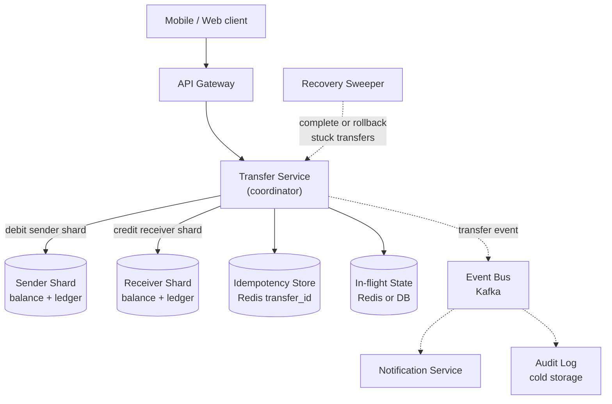
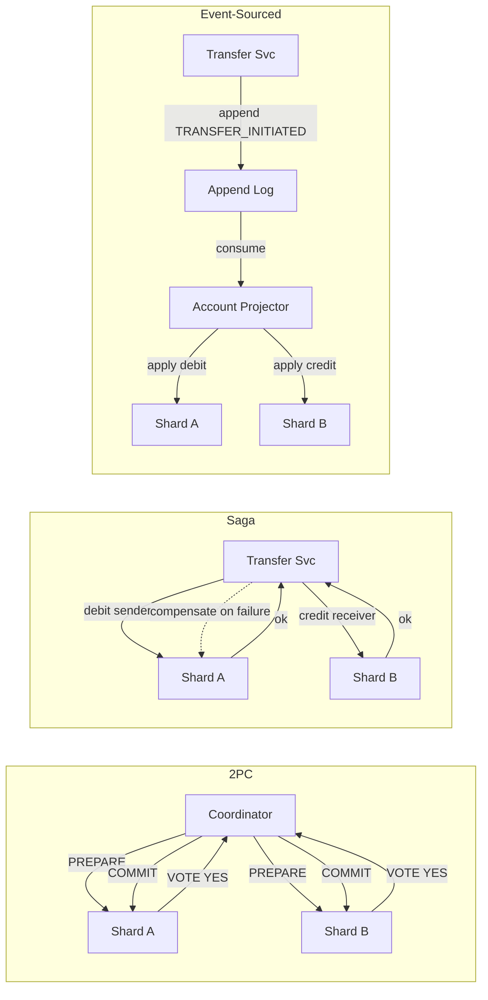

> **Why this appears in Director loops:** P2P money movement (Venmo, Cash App) is asked because it isolates the hardest distributed-systems problem in payments, **atomic debit + credit across two accounts that may live on different database shards**, with no external payment rail to hide behind. The junior answer draws a single-database transaction and calls it done. The Director answer **sizes TPS first, chooses the simplest consistency mechanism the number justifies, quantifies the failure cost of each approach, and names where money can go missing mid-transfer**. Unlike the full payment platform (card rails, PSPs, global interchange), this problem is purely internal-ledger money movement. The cross-shard atomicity question is the load-bearing tension here; that is where the interview lives.

### Learning objectives

- Size a P2P wallet's **write TPS and storage** before reaching for distributed-transaction machinery.
- Articulate the **three mechanisms** for cross-shard atomicity, 2PC, saga, event-sourced ledger, with their failure modes and cost drivers, in a trade-off table that doubles as your interview answer.
- Identify exactly where money can **"exist on neither shard"** mid-transfer under each mechanism, and design the recovery path.
- Prevent **double-spend** under concurrent withdrawals from the same account, choosing the right concurrency primitive.
- Operate at Director altitude: delegate ledger-consistency deep-dives to storage specialists; state a prior on the right mechanism for a given TPS band.

### Intuition first

Imagine moving cash between two safe-deposit boxes in the same vault. If they are in the same room, the teller opens both, takes from one, puts in the other, and locks them, one action, one witness, zero ambiguity. Now imagine the boxes are in **two separate vaults, across town**. The teller must carry the cash outside. For a brief moment, the cash is neither in Box A (it was withdrawn) nor in Box B (it hasn't arrived yet). If the courier crashes, the money is in limbo. The whole problem is: **how do you make that "in-transit" window safe, auditable, and recoverable**, without requiring the two vaults to hold their doors open, frozen, until the other vault confirms?

That is the cross-shard transfer problem. The three mechanisms, 2PC, saga, and event-sourced ledger, are three different answers to "how do you handle the courier crashing?" They trade coordinator complexity, availability, and recovery time against each other.

---

## R: Requirements

> **Adaptation:** Standard R step. The key scoping move is declaring what is **out of scope**: external bank rails, card processing, and fraud scoring (those live in the full payment platform). This lesson is pure internal-ledger.

**Clarifying questions I'd ask (with assumed answers):**

- *What is the transfer scope?* → **Internal wallet-to-wallet only.** No ACH, no card, no external rails. Balance debit on sender + credit on receiver, both in our system.
- *What consistency guarantee does the business require?* → **No money created or destroyed.** Every transfer must be atomic: sender balance decreases by exactly X and receiver increases by exactly X, or neither happens. A temporary "in-flight" state is tolerable if it is bounded and recoverable.
- *Idempotency on retry?* → **Yes, mandatory.** Network timeouts cause client retries; a retry must not double-debit.
- *What is the expected TPS?* → **~500 peak internal transfers/sec, ~50 average.** (Venmo/Cash App scale; we will size from this.)
- *Latency bar?* → **P99 < 1 second end-to-end for a transfer acknowledgment.**
- *Multi-currency?* → **Single currency (USD) for now.** Multi-currency is a scope extension.

**Functional requirements:**

1. **Debit sender** and **credit receiver** atomically, no partial transfer, no money creation.
2. **Idempotent transfer**, retrying with the same transfer ID produces the same outcome.
3. **Balance read**, real-time, consistent balance visible to the account holder.
4. **Transfer history**, queryable ledger per account.
5. **Insufficient-funds check**, reject before debit, not after.

**Explicitly out of scope:** card rails, ACH/wire, fraud scoring, KYC/AML, currency conversion, fee calculation, interest, reversals (beyond a compensating transfer). These belong to a broader payments platform.

**Non-functional requirements:**

- **Atomicity**, the cardinal invariant: sum of all balances is conserved across every transfer.
- **Durability**, committed transfers survive node failure.
- **Idempotency**, exactly-once semantics end-to-end.
- **Availability**, 99.99% uptime for reads; transfers can tolerate brief degradation under partition.
- **Auditability**, every balance change has a corresponding ledger entry, immutable after write.

---

## E: Estimation

> **Enough math to choose a mechanism.** The headline is TPS and shard count, those two numbers determine whether 2PC's coordinator is the bottleneck, whether a saga's asynchrony is overkill, and how big the hot-account problem is.

**Assumptions:** 50M active users, average 2 transfers/day per active user, 10% of users active on a given day.

**Average transfer TPS:** `50M × 10% × 2 ÷ 86,400 ≈ 116 transfers/s`. Peak is 4-5× → **~500 transfers/s**. Call it **500 write TPS** at the ledger layer.

**Storage:** one ledger entry per side of a transfer (debit + credit = 2 rows per transfer). At 500 TPS: `500 × 2 × ~200 B ≈ 200 KB/s`, or **~6 GB/day**, **~2 TB/year**. Compressible; retention-tiered to cold storage after 90 days. Not a big-data problem. A handful of shards holds years of history.

**Account shards:** 50M accounts × ~500 B per account row ≈ **25 GB** of hot account state. Comfortably fits in 4-8 shards at ~3-6 GB each. This is the number that determines how often a transfer crosses shard boundaries.

**Cross-shard transfer rate:** with 8 shards and random account distribution, ~`1 - 1/8 = 87.5%` of transfers cross shards. **Most transfers are cross-shard**, this is not an edge case, it is the common path. The atomicity mechanism must be on the fast path.

**Hot-account problem:** celebrity or business accounts can receive thousands of transfers per second. A single account row becomes a write hotspot. At 500 system-wide TPS a naive per-account lock is fine on average, but a single hot account at 1,000 TPS → serialized writes on one row. This is the double-spend / overdraft adjacency.

**What estimation decided:** 500 write TPS is a **moderate load**, not high enough to rule out 2PC on technical grounds alone, but high enough that coordinator availability matters. The shard count means cross-shard is the common path. Storage is small. The hot-account problem is real at celebrity scale.

---

## S: Storage

> **Three data classes with different access patterns.** Choose stores that make the invariants cheap to hold.

**1. Account balances (strongly consistent, write-contended).**

- *Choice:* **relational/NewSQL, Postgres or CockroachDB, sharded by `account_id` hash.** Row-level atomic conditional updates and multi-row transactions (within a shard) are exactly what SQL stores do cheaply.
- *Rejected, Cassandra LWW:* last-write-wins can create or destroy money under concurrent writes. Even with Cassandra LWT, cross-partition atomicity requires application-level coordination. Invariant is cheap on SQL; expensive on Cassandra.

**2. Ledger / transaction log (append-only, immutable).**

- *Choice:* **colocated with balances in the same transactional store, sharded by `account_id`.** Alternatively, a separate append-only store (DynamoDB, Cassandra) is tolerable for ledger entries since they are written once and never mutated.
- *Rejected, single global ledger table:* write hotspot and cross-shard join for every balance check.

**3. In-flight transfer state.**

- *Choice:* **Redis with TTL** for saga stage tracking (fast, self-cleaning). For 2PC, the coordinator log lives in the transactional DB (durability required). *Trade-off:* Redis loses state on restart, requiring the saga recovery sweeper; the DB is durable but adds write overhead.

---

## H: High-level design

> The shape: **a transfer service as the single coordinator**, sitting between the client and two account shards. It is the only writer; it is responsible for atomicity and idempotency.



**Happy path:** client sends `POST /v1/transfers` with an idempotency key. Transfer Service checks idempotency store, if already committed, return cached response. Writes an in-flight record. Executes the atomicity mechanism (detailed in D). On commit, marks idempotency record COMMITTED, publishes to Kafka (notifications, audit).

**Recovery:** a background sweeper scans in-flight records older than a TTL (~30 s) and either completes or rolls back. Transfer Service is **stateless**, horizontally scaled; the sweeper handles mid-crash recovery.

---

## A: API design

> Keep to the calls the requirements demand. Idempotency key and transfer status are the correctness story.

```
# --- Initiate transfer ---
POST /v1/transfers
  headers: { Idempotency-Key: <uuid> }
  body: { senderId, receiverId, amount, currency, note? }
  -> 201 { transferId, status: "PENDING" | "COMPLETED", createdAt }
  -> 400 { error: "INSUFFICIENT_FUNDS" }
  -> 409 { error: "DUPLICATE_TRANSFER", transferId }   # idempotency hit

# --- Query transfer status ---
GET /v1/transfers/{transferId}
  -> 200 { transferId, status, senderId, receiverId, amount, completedAt? }
  -> 404

# --- Account balance (consistent read) ---
GET /v1/accounts/{accountId}/balance
  -> 200 { accountId, balance, currency, asOf: <ts> }

# --- Transfer history (eventual, paginated) ---
GET /v1/accounts/{accountId}/transfers?limit=20&cursor=
  -> 200 { transfers: [...], nextCursor }
```

**Design notes:**

- **Idempotency-Key is mandatory on POST.** The client generates a UUID; on retry the server returns the original response. *Rejected: server-generated IDs only*, the client cannot correlate a timeout with a previous attempt without a client-supplied key.
- **`status: PENDING` is a valid response.** Async saga paths mean the transfer may not be committed when we respond. The client polls `/v1/transfers/{transferId}` or receives a push notification. *Rejected: always blocking until commit*, under cross-shard saga, this can hold the HTTP connection for seconds.
- **Balance read is strongly consistent** (reads from primary shard). Stale balance causes phantom overdrafts. *Rejected: read from replica*, the savings in read load (~500 balance reads/s is trivial) do not justify an overdraft risk.

---

## D: Data model

> The ledger model and the cross-shard mechanism ARE the lesson. We cover the schema briefly, then spend the depth on the atomicity mechanisms.

**`accounts`**, shard key `account_id` (hash); columns: `account_id`, `balance` (integer, in cents, no floating point for money), `version` (optimistic concurrency), `updated_at`.

**`ledger_entries`**, shard key `account_id`; columns: `entry_id` (UUID), `account_id`, `transfer_id`, `type` (DEBIT / CREDIT), `amount`, `balance_after`, `created_at`. Append-only after write; `(account_id, created_at)` index for history scans.

**`transfers`**, shard key `transfer_id`; columns: `transfer_id`, `sender_id`, `receiver_id`, `amount`, `status` (PENDING / COMPLETED / FAILED / ROLLING_BACK), `idempotency_key` (unique index), `created_at`, `completed_at`.

**The integer-cents invariant:** balances are stored as integer cents (or the smallest currency unit). Floating-point arithmetic on money creates rounding drift that violates balance conservation over millions of transfers. *This is the single most common schema bug in payments systems.*

### The cross-shard atomicity mechanisms

This is the lesson's load-bearing question. Three approaches; the right choice depends on TPS, team size, and tolerance for operational complexity.



**Two-Phase Commit (2PC):** the coordinator sends PREPARE to both shards; both lock and vote YES/NO; coordinator sends COMMIT or ABORT. The shards remain locked between PREPARE and COMMIT, this is the **blocking problem**: if the coordinator crashes after PREPARE but before COMMIT, shards are locked until recovery. At 500 TPS with cross-shard on the fast path, a coordinator crash during peak locks money for the duration of coordinator recovery (seconds to minutes). *Rejected for high-TPS hot-path* unless using a distributed SQL system (CockroachDB, Spanner) that handles 2PC internally with Raft-based coordinator recovery, those systems make 2PC viable by keeping commit latency under ~10 ms p99 and eliminating the single-coordinator SPOF.

**Saga (choreography / orchestration):** debit sender first (local transaction on sender's shard), then credit receiver (local transaction on receiver's shard). If credit fails, issue a compensating debit on the receiver and a compensating credit on the sender. Each step is independently atomic. The in-flight window is real: between the debit commit and the credit commit, **money exists on neither shard**, it is "in transit" in the saga state. Recovery is the sweeper: it finds PENDING sagas older than a TTL and re-drives or compensates. *Trade-off:* no coordinator lock, high availability, forward-progress under partition, but the compensating transaction must be idempotent and retryable, and you must handle the case where compensation itself fails (compensation of the compensation). Operationally complex but well-understood at Uber, Airbnb, and similar scale.

**Event-sourced ledger:** transfer intent is appended to an immutable log first; account projectors consume the log and apply debits/credits to balance snapshots. The log is the source of truth; balances are derived state. At-least-once delivery from log to projectors means a projector must be idempotent (deduplicate by `transfer_id`). *Trade-off:* the cleanest audit trail, naturally append-only, easy replay, but **balance reads require either a snapshot + log replay (latency) or a maintained projection (an extra moving part)**. Best fit when auditability and replay are primary requirements; adds engineering overhead that is only justified beyond ~2,000 TPS or when regulatory audit requirements demand it.

<details>
<summary>Go deeper, 2PC coordinator recovery and the blocking window (IC depth, optional)</summary>

The canonical 2PC failure is the coordinator crashing **between** the PREPARE and COMMIT phases. Both participants have voted YES and are holding locks (or blocking on their in-doubt rows). They cannot unilaterally commit or abort because they do not know if the coordinator sent COMMIT to the other participant before it crashed.

Recovery requires the coordinator to log its decision **durably before sending COMMIT**, if the log says COMMIT, re-send COMMIT to all participants on restart; if the log says PREPARE (no COMMIT recorded), abort. This is why CockroachDB and Spanner implement 2PC with a **Raft-replicated coordinator record**: the coordinator "crashes" only if a majority of replicas fail simultaneously, which is rare. The lock window is then bounded by Raft log replication latency (~2-5 ms on LAN), not by coordinator restart time.

For application-level 2PC (coordinator in your service, not in the DB), the blocking window is bounded by your coordinator's restart time, typically 10-30 s for a Kubernetes pod restart. At 500 TPS, a 30-second block freezes ~15,000 in-flight transfers. That is the operational risk that pushes teams toward sagas or distributed SQL at this scale.

</details>

<details>
<summary>Go deeper, double-spend under concurrent withdrawals (IC depth, optional)</summary>

**The problem:** two concurrent transfers both pass the balance check (`balance >= amount`) before either commits, causing a combined debit exceeding the actual balance.

**The fix:** an **optimistic conditional update**, the debit SQL includes the balance check in the WHERE clause:

```sql
UPDATE accounts
SET balance = balance - :amount,
    version = version + 1
WHERE account_id = :sender_id
  AND balance >= :amount
  AND version = :expected_version
```

If 0 rows are affected, the balance check failed (concurrent transfer already debited), return INSUFFICIENT_FUNDS and abort. No lock held; the loser fails fast. This is the same CAS pattern as the seat claim, applied to account balances.

**The hot-account variant:** a celebrity account receiving 1,000 credits/second causes write serialization on one row. The mitigation is **balance sharding** (split the balance across N sub-rows, aggregate on read), the same counter-sharding pattern. Trade-off: exact real-time balance becomes an aggregate read, tolerable for display but not for the debit check (which must sum all sub-rows in one transaction).

</details>

---

## E: Evaluation

> Re-check against NFRs and stress the design at each failure mode.

**Re-check vs NFRs:**

- *Atomicity:* covered by whichever mechanism is chosen; the in-flight window is bounded and recoverable.
- *Idempotency:* enforced by the idempotency store (Redis key on `transfer_id`; TTL of 24 h).
- *Durability:* both account shards replicate ×3; the in-flight store durability depends on mechanism choice.
- *Latency:* saga with local transactions ≈ 2 DB round-trips + network; p99 < 200 ms on LAN shards. 2PC adds ~10-30 ms for prepare-vote-commit.

**Failure mode 1, coordinator crashes mid-saga (money in transit).**

Saga in state DEBIT_COMMITTED / CREDIT_PENDING. Sweeper finds the record after TTL (~30 s), retries the credit (idempotent). If the receiver shard is permanently down, the sweeper compensates: re-credits the sender; transfer marked FAILED. *Trade-off:* the sender sees money returned after a delay, acceptable vs leaving both shards locked under 2PC.

**Failure mode 2, double-spend (concurrent debits).**

Optimistic CAS on `balance + version`, one winner commits; the other sees 0 rows updated and returns INSUFFICIENT_FUNDS. *Rejected: Redis SETNX per account*, adds a distributed lock dependency on the fast path; CAS has no external dependency.

**Failure mode 3, idempotency store miss (Redis restart).**

Unique index on `idempotency_key` in the `transfers` table is the backstop, DB insert fails with constraint violation, mapped to DUPLICATE_TRANSFER. Redis is the fast path; the unique index is the correctness guarantee.

**Failure mode 4, receiver shard permanently unavailable.**

Saga compensates; money returns to sender; transfer FAILED. Under 2PC the shards would remain locked until the failed shard recovers, worse.

**Bottleneck, hot accounts at celebrity TPS.**

At 500 system TPS, no single account is a problem. A business account at ~1,000 writes/s serializes CAS on one row and p99 climbs. Mitigation: balance sub-sharding (counter pattern). Operational tuning per-account, not a re-architecture, I'd have the storage team instrument and apply above a threshold.

---

## D: Design evolution

> Push each dimension, find the first thing that breaks, and name the specialist handoff.

**At 5× (2,500 TPS):** Transfer Service scales horizontally (stateless, ~20 pods). Shards handle 2,500 TPS across 8 nodes (~300 TPS each). 2PC coordinator latency starts to matter; this is the inflection where teams migrate from CockroachDB 2PC to saga, not because 2PC is wrong, but because the blocking coordinator is an availability risk above ~2,000 TPS.

**At 50× (25,000 TPS, super-app scale):** Saga sweeper throughput becomes the bottleneck. The event-sourced ledger earns its complexity: Kafka's append log scales to millions of events/s; projectors maintain balance snapshots cheaply; audit is free. The engineering tax (snapshot management, projector idempotency) is now justified.

**At global multi-region:** Cross-region 2PC (~100 ms RTT) is untenable on the fast path. The pattern: **region-affinity routing** (~70% of transfers are intra-region) + async saga for cross-region. The sender sees PENDING; the credit completes asynchronously.

**Hardest trade-offs to defend:**

- **Saga vs 2PC:** TPS-dependent. Below ~2,000 TPS with CockroachDB, 2PC is simpler and the blocking window is bounded by Raft. Above that, saga wins on availability. State the threshold; don't present one as universally correct.
- **PENDING response vs synchronous commit:** saga correctly returns PENDING for async cross-shard paths. Push notifications make it invisible to the user, this is the product mitigation, not an architectural flaw.
- **Compensation complexity:** compensating transactions must themselves be idempotent and retryable. If the team is small, 2PC on CockroachDB is less total code, that is a valid engineering trade-off.

**What I'd delegate (the explicit Director move):**

- *"The storage team benchmarks saga vs CockroachDB 2PC at our peak TPS on the actual shard topology. My prior is CockroachDB 2PC under 2,000 TPS, simpler operational model, lower compensation-code surface, and saga above that. They own the SLA on commit latency."*
- *"The fraud / AML team owns the transfer-velocity checks (N transfers/hour per account, unusual amount thresholds). I expose a synchronous `fraud.check(transferId)` call in the transfer service; they own the model. I treat it as a latency budget item: if they need >100 ms, we make it async and hold in PENDING."*
- *"The ledger reconciliation job is a daily batch that verifies sum(all balances) = constant. The storage team writes it; it runs on a read replica. I want an alert if it detects drift > $0.01."*

---

### Trade-offs table: the three atomicity mechanisms

| Mechanism | Availability under partition | Latency on fast path | Recovery complexity | Audit clarity | Use when |
|---|---|---|---|---|---|
| **2PC (distributed SQL, CockroachDB / Spanner)** | Degrades if coordinator region fails | ~10-30 ms commit overhead | Low, DB handles it | Moderate | TPS < 2,000; team prefers simpler code; using distributed SQL already |
| **Saga (orchestrated)** | High, no global lock; forward progress under shard failure | Low, 2 local txns in sequence | Medium, compensating txns must be idempotent; sweeper required | Good, explicit state machine | TPS 500-10,000; cross-region required; team can maintain compensation logic |
| **Event-sourced ledger** | Very high, append log decouples writers from projectors | Higher write latency (log append + async apply); reads from projection | High, snapshot + replay, projector idempotency | Excellent, log is the truth | TPS > 5,000; regulatory audit mandatory; team has event-sourcing expertise |

**Our choice for this problem:** **saga** at 500 TPS with a distributed SQL store (CockroachDB) as a viable alternative. At 500 peak TPS, either works. Saga wins if cross-region is on the roadmap; CockroachDB 2PC wins if the team is small and compensation code is the risk.

---

### What interviewers probe here (Director altitude)

- **"How do you ensure the sender is debited and the receiver is credited atomically across two shards?"**, *Strong signal:* names all three mechanisms, immediately scopes to TPS to eliminate non-starters, picks one with a stated reason. Calls out that saga has an in-flight window and describes the sweeper recovery. *Red flag:* "use a single database" (doesn't engage the shard question) or "use Kafka" with no explanation of how the balance update becomes atomic.

- **"Where does the money go if your service crashes mid-transfer?"**, *Strong signal:* explains the in-flight state record, the sweeper TTL, and the two recovery paths (complete credit, or compensate with re-debit). Quantifies the window ("the sweeper runs every 30 s, so maximum exposure is ~30 s in-flight"). *Red flag:* "it doesn't happen" or "the DB handles it."

- **"Two concurrent transfers both read a balance of $100 and both try to debit $80. How do you prevent both succeeding?"**, *Strong signal:* the CAS conditional update (`WHERE balance >= amount AND version = :v`), one wins, one sees 0 rows and returns INSUFFICIENT_FUNDS. Names this as optimistic concurrency. *Red flag:* application-level lock on account_id (correct but adds distributed lock dependency), or no answer for the race.

- **"Why not just use Kafka for all of this?"**, *Strong signal:* Kafka guarantees at-least-once delivery to the projector; the projector must be idempotent (deduplicate by `transfer_id`). Kafka does not give you a read-your-writes balance without a maintained projection. The latency to see your own balance after a transfer increases by the Kafka lag. This is acceptable at high TPS / event-sourced architectures; at 500 TPS it adds engineering complexity for no scalability gain. *Red flag:* "Kafka gives you consistency", it does not; it gives you ordering within a partition and at-least-once.

- **"What does this cost, and where would you spend engineering budget?"**, *Strong signal:* names that the DB is small (~25 GB hot state, easily hosted); the cost is in the Transfer Service redundancy, Redis idempotency store, and Kafka if used. Engineering budget goes to the sweeper, compensation logic, and reconciliation job, not to database tuning. Delegates the TPS bake-off and fraud model. *Red flag:* proposes event sourcing at 500 TPS without justifying the engineering overhead.

---

### Common mistakes

- **Floating-point balances.** Storing balances as `DECIMAL` or `FLOAT` instead of integer cents causes rounding drift that violates balance conservation at millions of transfers. Always integers in the smallest currency unit.
- **Idempotency only at the API layer.** Redis TTL expires; a unique constraint on `idempotency_key` in the transfers table is the durable backstop. Both layers are required.
- **Treating saga as "eventual consistency."** A saga guarantees that the system eventually reaches a consistent state, but the path runs through compensating transactions that must themselves be idempotent and retryable. "We'll just re-run it" is not a recovery plan.
- **Event sourcing at 500 TPS.** Reasonable engineers reach for the event-sourced ledger because it is elegant. At 500 TPS it is over-engineered. Size the mechanism to the TPS; start simple. The lesson is not "don't use event sourcing", it is "justify the complexity with numbers."
- **Forgetting the reconciliation job.** Even a correct implementation accumulates drift from hardware failures, clock skew, and bugs. A daily reconciliation that verifies the global balance sum is unchanged is not optional, it is the operational backstop that gives finance the confidence to trust the system.

---

### Practice questions (with model answers)

**Q1. Sender has $100. Two concurrent transfers of $80 each are submitted simultaneously. Walk through exactly what happens.**

> *Model:* Both transfers start, both read balance $100 and pass the funds check (in the application layer). Both attempt the conditional UPDATE: `SET balance = balance - 80 WHERE account_id = :id AND balance >= 80 AND version = :v`. The DB serializes the row writes. One succeeds: balance becomes $20, version increments. The second sees 0 rows updated (balance is now $20, < $80, OR version mismatch) and returns INSUFFICIENT_FUNDS immediately, no lock held. The losing transfer is marked FAILED; the client returns a 400. The winning transfer proceeds to credit the receiver. Total debit: exactly $80. This is optimistic CAS on the account row, the same pattern as the seat claim.

**Q2. Your saga's credit step fails permanently (receiver shard is down for 2 hours). What happens to the sender's money?**

> *Model:* The saga is in state DEBIT_COMMITTED, CREDIT_FAILED. The Transfer Service marks the transfer ROLLING_BACK and issues a compensating credit to the sender's shard (same shard, local transaction, idempotent by `transfer_id + COMPENSATION` key). The sender's balance is restored; the transfer is marked FAILED. The receiver never receives the funds. The sweeper monitors for ROLLING_BACK records and retries the compensation if it hasn't committed. *Trade-off:* the sender sees their money return after a delay (bounded by sweeper interval, ~30 s). The business must surface this as a "transfer failed" notification, not a silent PENDING that resolves itself. The compensation itself is a simple local credit on the sender's shard; its failure mode is a DB error, which the sweeper retries.

**Q3. When would you choose 2PC over saga for this problem?**

> *Model:* I'd choose 2PC (via a distributed SQL system like CockroachDB or Spanner) when: (1) TPS is below ~2,000, so coordinator latency is not a bottleneck; (2) the team is small and the compensation-logic surface is a larger risk than coordinator availability; and (3) we are already running CockroachDB for other reasons. CockroachDB's 2PC uses Raft-replicated transaction records, so the coordinator SPOF is eliminated, commit latency is ~10-30 ms on LAN, bounded by Raft, not by a single pod restart. Above ~2,000 TPS or in cross-region deployments where cross-region 2PC latency (~100 ms) is untenable, saga wins on availability. The decision is a TPS threshold and a team-capability question, not a correctness one.

**Q4. A journalist reports that Venmo "created" money, some users see inflated balances. What likely went wrong, and how would your design prevent it?**

> *Model:* Three likely causes: (1) **floating-point arithmetic drift**, balances stored as FLOAT or DECIMAL with rounding errors, accumulated over millions of transfers; fix: integer cents. (2) **Failed compensation double-credited**, a saga compensation ran twice without idempotency; fix: unique constraint on `(transfer_id, entry_type)` in ledger_entries. (3) **Replay of ledger events without deduplication**, an event-sourced projector applied an event twice; fix: projector deduplication by `transfer_id`. In all cases, the reconciliation job catches the drift within 24 hours, without it, the drift compounds undetected. The fix is both the coding invariant (integer, idempotency) and the operational invariant (daily reconciliation run, alert on any drift).

---

### Key takeaways

- **Size TPS before choosing an atomicity mechanism.** At 500 TPS, saga and CockroachDB 2PC are both viable; at 5,000 TPS, saga wins on availability; at 25,000 TPS, the event-sourced ledger earns its complexity. The mechanism choice is a quantitative decision.
- **The in-flight window in a saga is not a bug, it is a bounded, recoverable state.** The sweeper closes it; the transfer state machine is the contract. "Money exists on neither shard" for at most one sweeper interval.
- **Optimistic CAS on account balance is the double-spend defense:** `WHERE balance >= amount AND version = :v`, one winner, one instant INSUFFICIENT_FUNDS, no lock. The same pattern as seat-claim.
- **Idempotency requires two layers:** Redis for speed (TTL cache), DB unique constraint on `idempotency_key` for durability. Redis expiry cannot be the only guard.
- **The reconciliation job is not optional.** A daily balance-sum check is the operational backstop that makes the business trust the ledger. Without it, drift accumulates silently until a journalist finds it.

> **Spaced-repetition recap:** Digital wallet = **cross-shard atomic transfer** (debit A, credit B, different shards). Three mechanisms: **2PC** (distributed SQL, simple, blocks on coordinator failure, viable < 2k TPS), **saga** (local txns + compensation, high availability, in-flight window, default at 500 TPS), **event-sourced ledger** (append log + projection, best audit, most complex, justified at > 5k TPS or mandatory audit). Double-spend: **CAS conditional update** (`WHERE balance >= amount AND version = :v`). Idempotency: **Redis fast path + DB unique constraint backstop**. Always integers for money. Daily reconciliation job = required operational backstop. Related: the full payment platform, quorum, the CAS pattern, counter sharding for hot accounts.

---

*End of Lesson 5.2. The cross-shard transfer problem isolates the distributed-transaction question that the full payment platform glosses over behind external rails.*
