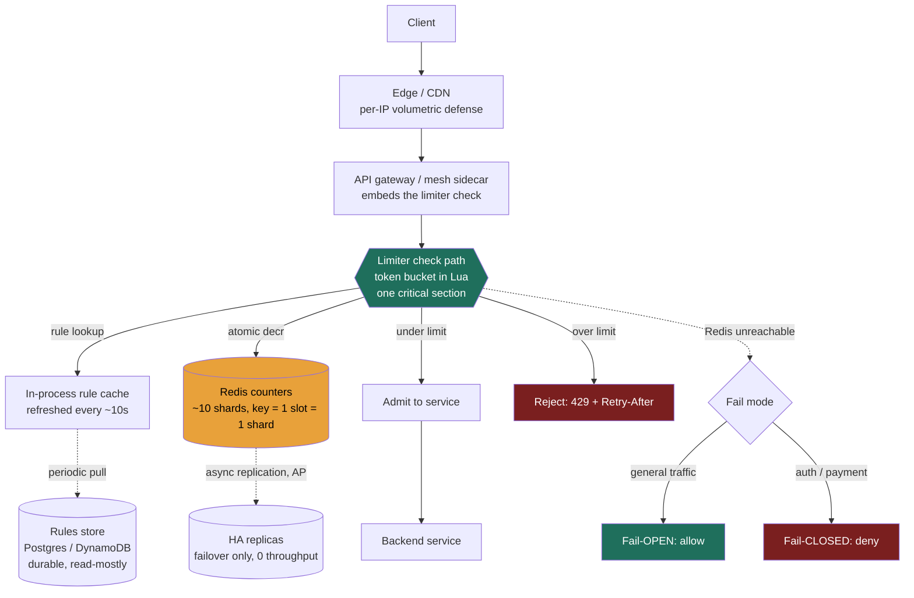

### Learning objectives
- Run a rate-limiting **service** (not a single counter) through all eight **RESHADED** steps, scoping it to a defensible core and quantifying every layer.
- Recognize that a rate limiter is the **opposite of a read-heavy system** - the counter path is **~100% writes** - and let that one fact drive estimation, store choice, and where the bottleneck lives.
- Split the design into **two planes with opposite characteristics** - a read-mostly **rules/config** store and a write-heavy **counter** store - and justify a different technology for each.
- Make the Director calls: **where to enforce** (sidecar/gateway vs central service), **how to break the hot-key ceiling** (local leasing vs sharded counters), and **what to defer** to a delegated deep-dive.

### Intuition first
You are not designing *a* rate limiter - Lesson 3.10 already built the bouncer with the clicker. You are designing the **rate-limiting service the whole company calls**: thousands of gateway pods and sidecars asking "can this request through?" tens of thousands of times a second, against limits an operator configured per user, per API key, and per route. The crux is that this service is **almost entirely writes**. Every "can I?" is really "decrement the counter and tell me if it went negative" - a read-modify-write, never a plain read. That sounds like a small distinction until you realize what it forbids: you **cannot** scale this by adding read replicas (a stale counter is a *wrong* limit), and you **cannot** cache the answer (it changes on every request). The only knob is splitting the keyspace across shards - until a single global limit forces every request onto **one** key, which lives on **one** shard, which **cannot be split**. So the whole problem is: keep the per-request cost near zero, keep the limiter from ever outliving the service it protects, and have a real answer for the one counter you can't shard. RESHADED is how we get there in order.

---

## R - Requirements

**Framing.** A standalone rate-limiting capability that any caller (API gateway, service mesh sidecar, edge node) consults before admitting a request. Operators define **rules**; the service **enforces** them with very low added latency and **never** becomes the reason an endpoint is down.

**Functional requirements (the core).**
- **Configurable rules** scoped by **user / API-key / route** (and combinations), each rule a **sustained rate + burst** (the two-number limit from 3.10) - e.g. `route=/search, tier=pro → 1,000 req/min, burst 200`.
- **An allow/deny decision** per request, returning the standard contract: **HTTP 429 + `Retry-After`** and `X-RateLimit-Remaining` so good clients self-throttle.
- **Rule management**: create/update/delete rules and have changes take effect within a bounded propagation window.

**Non-functional requirements (where the design actually turns).**
- **Very low added latency** - the limiter sits on the hot path of *every* request, so its budget is **< 1-2 ms p99 added**, ideally ≤ 1 ms. If the limiter adds 10 ms, it's a tax on every call and gets ripped out.
- **Horizontal scale** - to **~1M decisions/s** at peak across the fleet, growing with traffic.
- **Fail-open by default** - if the limiter's backing store is unreachable, **allow** general traffic (the limiter must never down the service); **fail-closed** only on the auth/payment/abuse endpoints where an open door is the bigger risk (the 3.10 split).
- **Approximate is fine** - rate limiting is **best-effort**; a brief over-admit after a failover is harmless. We will **not** pay for exact, strongly-consistent enforcement.

**The clarifying questions I'd ask (scope before build).**
1. *Sustained-rate + burst, or just a flat cap?* → both knobs, which selects **token bucket** as the default algorithm.
2. *Authenticated keys, anonymous IPs, or both?* → both, but **per-key** is the precise dimension; **per-IP** is coarse anonymous-only defense (NAT bunches users, attackers rotate IPs).
3. *Single-region or global?* → start single-region for v1; **multi-region active-active counter coordination is the hardest part and I'd defer it to a deliberate deep-dive** (step D).
4. *Do rules change in real time?* → no - **seconds-to-propagate is acceptable**, which lets us cache rules and avoid a hot config path.

**CUT to a defensible core.** Out of scope for v1: a rule-authoring **admin UI**, **real-time rule push** (we pull + cache with a short TTL instead), **usage analytics/billing dashboards**, and **multi-region active-active**. **Kept** because the prompt names it: the **rules/config plane** scoped per user/key/route - that's the functional substance that makes this a *service* rather than the single counter of 3.10.

**Read:write skew - the load-bearing assumption.** Here is the inversion that drives everything downstream. **The counter path is ~100% writes.** Every decision is a read-modify-write on a counter (token-bucket refill-check-decrement, run atomically); there is **no read half** you could serve from a replica or a cache, because a stale counter produces a *wrong* limit. The **only** reads in the system are **rule lookups** - and those are tiny, low-cardinality, and staleness-tolerant, so they cache trivially. So the skew is two-sided: **rules are read-heavy and cacheable; counters are write-heavy and uncacheable.** That single sentence pre-decides the store choice (S), where the bottleneck is (Evaluation), and why replicas buy us availability but **zero** throughput.

**Scale assumptions (stated, used in E).** Peak **~1M rate-limit decisions/s** across the fleet; **~10M active keys** (distinct user/key/route counters live in the largest window); thousands of distinct **rules** (low cardinality - tiers × routes, not per-user).

---

## E - Estimation

Enough math to make a defensible call; round hard, state assumptions.

**Decision QPS (read vs write).**
- Peak **≈ 1M decisions/s**. Per the R step, **≈ 1M writes/s** to the counter store (every decision mutates a counter). **Counter reads ≈ 0** as a separate operation.
- **Rule reads**: also ~1M/s *logically*, but these are served from a **per-instance in-memory cache** (rules change in seconds, not per request), so they generate **~0 ops** to the rules store - only a periodic refresh (every instance pulls the rule set every ~10 s). Thousands of rules pulled by tens of instances every 10 s is **single-digit-thousand ops/s** to the rules store. Negligible.

**Storage - counters (the working set, not a log).**
- State per key for token bucket = **two numbers** (token count + last-refill timestamp). With Redis key + value + overhead, treat as **~100 bytes/key** (assumption).
- 10M active keys × 100 B = **~1 GB**. Round to **~1-2 GB resident**.
- **Growth is bounded, not cumulative.** Counters carry a **TTL** (a key expires once its window lapses), so storage tracks the **active keyset in the largest window** - it grows with **active-user count**, *not* with time. A 10× user base → ~10-20 GB, still trivially one Redis cluster. This is the opposite of a content/log store (Lessons 5.1, 3.13) whose storage grows forever.

**Storage - rules.**
- Thousands of rules × a few hundred bytes each = **single-digit MB**. Durable, tiny, read-mostly.

**Cache working set (both planes).**
- **Rules cache, per instance**: thousands of rules × ~hundreds of bytes ≈ **low-MB**, fits comfortably **in-process** on every limiter instance - no network hop to read a rule.
- **Counter resident set**: the **~1-2 GB** above, held in Redis RAM across the cluster.

**Bandwidth.**
- Each counter op is small: request (key + script args) ~**100 B**, response ~**50 B** → ~150 B/decision. 1M/s × 150 B ≈ **150 MB/s ≈ 1.2 Gbps** of east-west traffic to the counter store. Non-trivial but routine for a datacenter fabric; spread across ~10 shards it's ~**120 Mbps/shard**.

**Server / instance count - two separate tiers.**
- **Counter store (Redis) shards from *write* throughput.** Assume **~100k simple ops/s per Redis node** (the 3.10 figure; Lua scripts somewhat less, pipelining more). 1M writes/s ÷ 100k ≈ **~10 shards**. Replicas add **zero throughput** - they exist for **HA/failover warmth only** (a replica can't take counter writes; promoting one is the failover path). So ~**10 primaries + ~10 replicas ≈ 20 Redis nodes**. *Do not* imply 20 nodes = 20× capacity - that's the one inconsistency a sharp reviewer catches.
- **Limiter tier sizes from request rate.** A thin check-path instance doing one Redis hop sustains ~**25-50k decisions/s** (assumption; mostly network-wait, not CPU). 1M/s ÷ ~30k ≈ **~20-40 limiter instances** - a tier **separate** from the Redis cluster.

**The headline numbers:** ~1M writes/s, ~1-2 GB counter RAM (bounded by active keys), ~10 Redis shards + ~10 HA replicas, ~20-40 limiter instances, < 1-2 ms p99 added. Everything hangs on "**it's all writes**."

---

## S - Storage

The R/E steps already split the problem; S just names the two stores and justifies each against its access pattern.

**Plane 1 - Counters: an in-memory, write-optimized, AP store → Redis.**
- *Access pattern:* ~1M atomic read-modify-writes/s, tiny per-key state, **TTL-bounded**, **best-effort** consistency, sub-ms latency required.
- *Why Redis:* in-memory (~**0.5-1 ms** same-AZ), **single-threaded per shard** so a Lua script is a natural critical section (the only safe way to run token-bucket's read-modify-write without the over-admission race - 3.10, Race B), ships native TTL and atomic counters, and is **AP-leaning** which is exactly what a best-effort limiter wants.
- *Rejected - a relational/disk store (Postgres):* a durable, ACID, disk-backed store on the hot path of every request adds milliseconds and write-amplifies counters we don't need to keep; durability is **wasted** on ephemeral counters that expire in a minute. Reject on **latency + pointless durability**.
- *Rejected - a CP/consensus store (etcd, ZooKeeper, Spanner):* enforces the limit *exactly* but pays **quorum-consensus latency on every single request** and **loses availability under partition** (CP sacrifices A). You'd make the limiter slower and more fragile than the service it guards - the cardinal sin. The exactness it buys is a **non-requirement** (R said approximate is fine). Reject on **latency + availability for zero benefit**.

**Plane 2 - Rules/config: a durable, read-mostly, low-cardinality store → Postgres (or DynamoDB).**
- *Access pattern:* thousands of small rule rows, **read-mostly** (writes only when an operator changes a rule), must **survive restarts**, queried by scope (key/route/tier).
- *Why a durable store + per-instance cache:* rules are the **opposite** of counters - cold, small, must persist, tolerate seconds of staleness. Postgres is the obvious fit (rich queries on scope, transactional rule edits); **DynamoDB** is an equally good pick if we want managed scaling and key-value lookups. Each limiter instance **caches the full rule set in process** with a short TTL refresh, so rule reads cost **zero** network hops on the hot path.
- *Rejected - putting rules in Redis too:* it couples **cold config** to the **hot, ephemeral** counter store, risks the rules being **evicted** under counter memory pressure, and gains nothing (rules don't need sub-ms reads - they're cached locally). Reject on **coupling + eviction risk**.
- *Rejected - hardcoding rules in each instance's config file:* changing a limit then needs a **redeploy**, violating the "rules take effect in seconds" requirement. Reject on **operability**.

The split is the whole insight: **two stores, opposite characteristics, two technologies** - durable-read-mostly for rules, in-memory-write-heavy for counters.

---

## H - High-level design

**Component diagram.**



**Where the limiter lives - the key H decision.** The check runs **embedded in the gateway/sidecar**, not as a separate central rate-limiter service the caller makes a network call to.
- *Why embedded:* the NFR is **very low added latency**. The decision already costs one Redis hop (~0.5-1 ms); a **standalone central limiter** would add a **second network hop** (caller → limiter service → Redis → back), roughly **doubling** the added latency for no benefit. So the limiter is a **library/sidecar** co-located with the caller, sharing the Redis backend. This is the **Envoy `ratelimit`** model: the proxy embeds the check, a shared store holds the counts.
- *Rejected - a standalone central rate-limiter microservice:* simpler to own and language-agnostic (one service, one codebase), but the **extra hop violates the latency budget** on every request. Reject on **latency**; note it's a reasonable choice only if callers are too heterogeneous to embed a library.

**Happy path (admit).** ① Request hits the edge (volumetric per-IP defense drops obvious floods). ② It reaches the gateway/sidecar, which extracts identity (API key) and route. ③ The embedded limiter looks up the matching rule from its **in-process cache** (no network hop - the cache was pulled from the rules store seconds ago). ④ It runs **one Lua script** against the counter's Redis shard: refill the token bucket by elapsed time, check ≥ 1 token, decrement, write back - **atomically**, so no over-admission race. ⑤ Under limit → admit to the backend, return `X-RateLimit-Remaining`. ⑥ Over limit → reject with **429 + `Retry-After`**. If Redis is unreachable, the **fail-mode branch** decides: allow for general traffic, deny for auth/payment.

---

## A - API design

Two surfaces: the **decision API** (hot path, called per request) and the **rules management API** (cold, operator-facing).

**Decision API (in-process call, or a thin RPC if embedded as a sidecar).**

```
check_rate_limit(
    key:    string,    // the limiter key, e.g. "key:acct_42:route:/search"
    cost:   int = 1     // tokens to consume; cost-weighted endpoints pass >1
) -> {
    allowed:    bool,
    remaining:  int,      // tokens left → X-RateLimit-Remaining
    retry_after: int       // seconds until next token → Retry-After (0 if allowed)
}
```
- *`cost` parameter, not a fixed 1:* an expensive route (`POST /search`, an LLM call) consumes **more tokens** than a cheap `GET`, so the limit reflects **load**, not request count. *Rejected - one request = one token always:* lets a client pin you with expensive calls while staying "under the limit." Reject on **cost-blindness**.
- *Returns `retry_after`, not just a boolean:* lets clients back off intelligently. *Rejected - bare allow/deny:* clients then blind-retry and amplify the storm. Reject on **retry behavior**.

**Rules management API (operator-facing, low QPS).**

```
PUT  /rules/{rule_id}        // upsert: {scope, sustained_rate, burst, window}
GET  /rules?scope=...         // list/inspect rules
DELETE /rules/{rule_id}
```
- *Scope* is the composite `{user? , api_key? , route?}` that selects which requests the rule governs. *Rejected - a single flat global limit only:* can't express per-tier-per-route policy, which is the functional core. Reject on **expressiveness**.
- These writes go to the **durable rules store**; the **propagation SLA is "seconds"** (instances pull on their refresh cycle). *Rejected - synchronously pushing every rule change to every instance:* turns a config edit into a fan-out to thousands of instances and a consistency problem; the cache-pull model is simpler and the staleness is acceptable (R step). Reject on **complexity for no real benefit**.

---

## D - Data model

**Counter records (Redis) - keyed by the limiter key itself.**

| Field | Example | Notes |
|---|---|---|
| **key** | `tb:{acct_42}:{/search}` | the **partition/shard key** - see below |
| tokens | `137.5` | current bucket level (fractional from lazy refill) |
| ts | `1718040000.123` | last-refill timestamp (epoch ms) |
| TTL | `120 s` | auto-expiry → storage bounded by active keys |

- **Shard key = the limiter key.** Redis maps `key → slot = CRC16(key) mod 16384 → shard`. Because the key encodes `{identity}:{route}`, **distinct users/routes land on different shards** - the keyspace spreads naturally across the ~10 shards. This is *why* per-key limiting scales: independent keys, independent shards.
- **State is two fields**, stored together (a small hash or a packed string) so the **single Lua script** reads and writes them in one atomic step - no read-modify-write race (3.10, Race B), and no separate-`EXPIRE` orphaned-key race (Race A) because the script sets the TTL in the same call.
- *Rejected - sliding-window log (a ZSET of every timestamp):* exact, but **O(limit) entries per key** → multi-GB at 10M keys for accuracy the tiers don't need. Keep it only for **low-volume high-value** limits (e.g. "3 password resets/hour"), where the log is tiny and exactness matters. Reject as the **default** on memory.

**Rule records (Postgres/DynamoDB) - keyed by scope.**

| Column | Example | Index |
|---|---|---|
| rule_id | `r_pro_search` | PK |
| scope | `{tier: pro, route: /search}` | indexed for lookup by route+tier |
| sustained_rate | `1000` (per 60 s) | - |
| burst | `200` | - |
| window_s | `60` | - |

- **Partitioned by scope/tier**, not by individual user - rules are **low cardinality** (tiers × routes), so a handful of rows cover millions of users. The mapping `user → tier` lives in the auth/identity system; the limiter resolves `tier + route → rule` from its cached rule set.
- *Rejected - one rule row per user:* explodes a thousand-row table into a 10M-row table for no benefit (users in a tier share a rule). Reject on **cardinality**.

**Where data lives:** counters in **Redis RAM** (ephemeral, ~1-2 GB, sharded by limiter key); rules in a **durable store** (tiny, replicated for safety, cached in every limiter instance's RAM).

---

## E - Evaluation

Re-check against the NFRs (latency, horizontal scale, fail-open, approximate-OK) and hunt the bottlenecks. Each fix **names its trade-off**.

**Bottleneck 1 - the hot key (the one that doesn't shard).** Per-key limits spread across shards beautifully - but a **single global limit** (or one massively-abused key) funnels **every** request onto **one** key → **one slot → one shard**. You **cannot shard your way out of a single hot key**; at 1M/s that one shard melts and becomes a blast-radius risk. **Fix - local token-leasing** (the centerpiece): instead of every request hitting Redis, each limiter instance **leases a batch of budget** from the central counter (e.g. "grant me 500 tokens"), **serves requests locally** from its lease, and **reconciles** with Redis periodically. This single change retires **three** named bottlenecks at once - it slashes **tail latency** (most decisions are now in-process, zero network hops), **write amplification** (one Redis write per lease instead of per request → ~1M/s drops by the lease-batch factor), and **hot-key concentration** (writes to the hot key drop by the same factor). *Trade-off:* you lose **global accuracy and cross-instance fairness** - an instance holding an unused lease "wastes" budget another instance could use, and the global limit can be over- or under-shot by up to the outstanding leased amount. You're trading **precision for latency + survivability** - the same accept-approximate bargain from 3.10, applied as the primary scaling lever. *Alternative considered - sharded counters (3.16):* split the one logical counter into K sub-counters on K keys, increment a random one, sum to read. Spreads writes across K slots **without** giving up real-time global visibility, but the **read (sum of K keys) is costlier** and precision still loosens. *Use sharded counters when you need tighter global accuracy than leasing gives; use leasing when latency and hot-key relief dominate.*

**Bottleneck 2 - tail latency from the Redis hop.** Even for per-key limits, one network round-trip per request puts Redis on the **p99 critical path** - a slow shard or a GC pause spikes every request through it. **Fix:** (a) the **leasing** above removes most hops; (b) **pipeline** and co-locate Redis in the **same AZ** (~0.5-1 ms, vs ~10× cross-region); (c) a tiny **per-instance local pre-check** that rejects a key already known to be far over its limit **without** touching Redis. *Trade-off:* the local pre-check can be **slightly stale** (admit a request the central count would reject) - acceptable under the best-effort NFR.

**Bottleneck 3 - Redis as a single point of failure.** The counter store gates every throttled endpoint; if it's down, naively the whole API is down. **Fix - fail-open** for general traffic (serve unthrottled; the edge layer backstops volumetric abuse), **fail-closed** for auth/payment/abuse. *Trade-off:* during a Redis outage, general traffic is **briefly unthrottled** (an abuser gets through) - deliberately accepted, because the limiter **must not be the thing that downs the service**. Replicas give **failover warmth only** (they add **zero throughput** - they can't take counter writes), so a primary loss promotes a replica and **briefly over-admits** (async replication lost the last few updates) - harmless for a best-effort limiter.

**Bottleneck 4 - write amplification on the counter store.** At 1M writes/s, even cheap atomic ops are real CPU + network. **Fix:** leasing (fewer, batched writes) and, where exactness allows, **fixed-window `INCR`** (one atomic op) over token-bucket Lua (a script execution) for endpoints that don't need burst shaping. *Trade-off:* fixed window reintroduces the **~2× boundary burst** (3.10) - fine where a momentary 2× is survivable, not where the burst itself is the threat.

**Re-check against NFRs:** latency < 1-2 ms ✔ (one same-AZ hop, mostly elided by leasing); horizontal scale to 1M/s ✔ (keyspace shards; global limits handled by leasing/sharded counters); fail-open ✔ (with the auth fail-closed split); approximate-OK ✔ (leasing and AP replication both lean on it). The design holds because **every fix spends the same currency - accuracy - which the requirements said we have to spend.**

---

## D - Design evolution

**At 10× (10M decisions/s, 100M active keys).**
- **Counter store:** scale from ~10 to ~**100 shards** (keyspace shards linearly for per-key limits); resident set ~1-2 GB → ~**10-20 GB** across the cluster, still RAM-resident and **bounded by active keys** (TTL'd), not cumulative. **Leasing becomes mandatory**, not optional - at 10M/s you cannot afford a Redis hop per request, so most decisions are in-process from leases and Redis sees only periodic reconciliation. The trade (global-accuracy loss) is now a deliberate, tuned parameter: **larger lease batches = lower latency + worse fairness**.
- **Limiter tier:** ~20-40 → ~**200-400 instances**, co-located with gateways/sidecars - scales with the fleet, not as a separate bottleneck.

**Under a new constraint - global, multi-region, active-active.** This is the **hardest trade-off** and where v1 deliberately stopped. A key limited to "1,000/min **globally**" now has callers in us-east, eu-west, ap-south - and you cannot make every request cross an ocean to one counter (that's hundreds of ms, violating the latency NFR outright). The options, each with a named cost:
- **Per-region sub-limits** (give each region `global / num_regions`): zero cross-region coordination, **simple and fast** - but **over-restricts** when traffic is skewed (a quiet region's unused budget is stranded while a busy region rejects). *Reject when traffic is highly uneven.*
- **Async cross-region reconciliation** (regions enforce locally, gossip aggregate counts every interval): closer to a true global limit, but **converges late** - a burst in one region isn't seen elsewhere until the next sync, so you **transiently over-admit globally**. *The pragmatic default* - it's regional leasing extended across regions.
- **Synchronous global consensus** (one CP counter all regions agree on): exact, but pays **cross-region quorum latency per request** and **loses availability under a region partition** - the same CP rejection as the S step, now even more expensive. *Reject* outside the rare case where exact global enforcement is a hard external contract.

**What I'd revisit:** whether **token bucket** is even the right algorithm fleet-wide, or whether **GCRA / `redis-cell`** (the one-timestamp leaky bucket from 3.10) gives smoother pacing at lower per-op CPU - it matters at 10M/s where Lua-script CPU per op becomes a line item.

**Where I'd delegate (the Director move).** I would **not** hand-tune this in the room. I'd scope two deep-dives: *"Have the infra team benchmark `redis-cell`/GCRA vs Lua token-bucket for **CPU cost per op** at our QPS, and model the **lease-window-vs-accuracy curve** so we can pick the batch size that meets our fairness SLO at the lowest latency."* My prior is **leasing + per-region async reconciliation**, because it preserves the latency NFR and rate limiting tolerates the resulting approximation - but the exact batch size and algorithm are a measurement, not a guess.

---

## Trade-offs table - the pivotal decisions

| Decision | Option A | Option B | Option C | Use when… |
|---|---|---|---|---|
| **Where to enforce** | Embedded in gateway/sidecar (one Redis hop) | **Standalone central limiter service** (extra hop) | Edge-only (coarse) | **A** for low latency (Envoy model); B only if callers too heterogeneous to embed a lib; C for volumetric defense as one layer |
| **Counter store** | **Redis (in-memory, AP)** | Postgres (durable, ACID) | CP/consensus (etcd, Spanner) | **A** always - ephemeral write-heavy best-effort counters; B/C waste durability/consensus latency the workload doesn't need |
| **Global-limit scaling** | **Local leasing** (batch budget, reconcile) | Sharded counters (K sub-keys, 3.16) | Single hot key (none) | **A** when latency + hot-key relief dominate (accept fairness loss); **B** when you need tighter global accuracy; **C** never above low QPS |

---

## What interviewers probe here (Director altitude)

- **"Is this a read-heavy or write-heavy system, and why does it matter?"** - *Strong signal:* **write-heavy - ~100% writes** on the counter path (every decision is a read-modify-write; there's no cacheable/replicable read half), so you scale by **sharding the keyspace**, replicas buy **HA not throughput**, and the bottleneck is **write-concentration (the hot key)**, not read fan-out. *Red flag:* "it's read-heavy, cache the answers / add read replicas" - a stale counter is a **wrong limit**; this misframes the entire design.
- **"How do you keep added latency under a millisecond on every request?"** - *Strong:* embed the check (no extra service hop), one **same-AZ** Redis op, and **lease budget locally** so most decisions never touch Redis at all - naming the **fairness/accuracy** you trade for it. *Red flag:* a standalone central limiter service adding a second hop, or unaware that the per-request round-trip is the latency budget.
- **"Walk me through cost and on-call."** - *Strong:* ~10 Redis shards + ~10 HA replicas (replicas are **failover-only, zero throughput**), ~20-40 limiter instances, ~1-2 GB RAM **bounded by active keys** (not cumulative); on-call risk is **Redis availability**, mitigated by **fail-open** (so a Redis blip doesn't page as a full outage) and the **auth fail-closed** split. *Red flag:* sizing replicas as added capacity, or failing the limiter **closed** on general traffic (a Redis hiccup then hard-downs the product).
- **"Where does this break at scale, and what would you delegate?"** - *Strong:* the **single global limit** (unshardable hot key) - fix with **leasing or sharded counters** - and **multi-region active-active** as the genuinely hard part, which I'd **scope as a benchmarked deep-dive** (GCRA vs Lua CPU/op; lease-window-vs-accuracy curve) rather than hand-tune. *Red flag:* "just add Redis shards" for a single hot key, or claiming exact global enforcement with no awareness of the cross-region latency cost.

---

## Common mistakes

- **Designing it as a read-heavy store** - reaching for read replicas or response caching. The counter path is **all writes**; a cached/stale count is a wrong decision.
- **One store for everything** - cramming rules into Redis couples cold durable config to the hot ephemeral counter store and risks eviction. **Two planes, two technologies.**
- **A standalone central limiter service on the hot path** - the extra network hop doubles added latency for no benefit; **embed** the check (sidecar/gateway), share the backend.
- **Treating replicas as capacity** - Redis replicas add **zero** counter throughput; they're failover warmth. Shards come from **write** load.
- **Ignoring the hot key** - per-key limits shard fine, but a **global** limit pins one shard and is unshardable; you need **leasing or sharded counters**.
- **Reaching for a CP store "so the limit is never violated"** - pays consensus latency on every request for an exactness rate limiting **doesn't require**; the limiter must never be slower/more fragile than the service it guards.
- **Forgetting the client contract** - no **429 / `Retry-After` / `X-RateLimit-*`** means clients blind-retry and amplify load.

---

## Interviewer follow-ups (with model answers)

**Q1. You said the counter path is ~100% writes. Defend that, and say what it rules out.**
> Every limiter decision is "consume a token and tell me the result" - a **read-modify-write** that mutates state (token-bucket refill-check-decrement, or `INCR` which mutates-and-returns). There is **no read you could serve separately**: reading a counter without decrementing it tells you nothing actionable, and reading it from a **replica** gives a **stale** value that produces a **wrong limit**. So it rules out the two reflexes you'd apply to a read-heavy system: **read replicas add zero throughput** (HA only), and **caching the decision is impossible** (it changes every request). The *only* reads are **rule lookups**, which are tiny, low-cardinality, and staleness-tolerant, so they cache in-process. That's why you scale this by **sharding the write keyspace**, and why the bottleneck is **write-concentration** (the hot key), not read fan-out. Misframing it as read-heavy is the tell that someone hasn't thought about what a counter actually does.

**Q2. Storage - won't 1M decisions/s blow up your store quickly?**
> No, and the reason is the distinguishing point: counters are **TTL'd**, so storage is **bounded by the active keyset in the largest window, not cumulative over time**. State per key is **two numbers** (~100 B); ~10M active keys ≈ **~1-2 GB** resident, and a key vanishes when its window lapses. It grows with **active-user count** (10× users → ~10-20 GB), never with elapsed time - the opposite of a log or content store that grows forever. So this fits comfortably in **Redis RAM** across ~10 shards; the scaling pressure is **write QPS** (→ shard the keyspace), not storage volume. The rules plane is separate and tiny - thousands of rows, single-digit MB, durable in Postgres.

**Q3. Enforce a single company-wide limit of 10,000 req/s against a third-party API you don't own. Where does it break and what do you do?**
> The **hot-key ceiling**. A single global limit means **every** request increments **one** counter → **one** Redis key → **one** hash slot → **one** shard (`CRC16(key) mod 16384`). You **cannot shard a single hot key** - "add more Redis shards" does nothing - so that one node eats all 10k/s plus rejected overage and becomes the bottleneck and a blast-radius risk. Two fixes. **(1) Local leasing:** each instance leases a slice of the 10k budget, serves locally, reconciles periodically - removes the per-request hot-key write entirely, at the cost of **looser global accuracy and cross-instance fairness** (an idle instance strands its lease). **(2) Sharded counters (3.16):** split the logical counter into K sub-keys, increment a random one, sum to read - spreads writes across K slots while keeping near-real-time global visibility, at the cost of a **costlier read** and slightly looser precision. I'd pick by how tight the third-party ceiling is: **leasing** if a little slack is fine and latency matters most; **sharded counters** if I need the global count tighter. Both lean on rate limiting tolerating approximation.

**Q4. Walk me through what happens when Redis fails - and why your answer isn't "the API goes down."**
> The limiter depends on Redis, but it must **never be the thing that downs the service it protects**. So on Redis-unreachable I **fail open for general traffic** - serve requests unthrottled, with the **edge/CDN layer** still backstopping volumetric abuse - because briefly unthrottled traffic is far better than 503-ing the whole API over a limiter dependency. I **fail closed only for auth/payment/abuse** endpoints, where an open credential-stuffing door during the outage is the worse outcome - the **split** is the answer, justified per endpoint by what it protects. Separately, a Redis **primary loss** promotes a **replica** (which exists for **failover only, not throughput**); because replication is **async (AP)**, the promoted node lost the last few counter updates, so we **briefly over-admit** - harmless, because rate limiting is best-effort. The principle threading all of it: **the limiter is approximate and subordinate to the service**, never a fragile gate in front of it.

**Q5. You're proposing local leasing to cut latency. What exactly do you give up, and how do you bound it?**
> I give up **global accuracy and cross-instance fairness**. Each instance holds a lease (say 500 tokens); the **true global admitted count can drift** from the configured limit by up to the **total outstanding leased-but-unused budget** across instances, and an instance sitting on an unused lease **strands** budget a busier instance could use - so under skewed traffic you can simultaneously **reject** in one instance while another holds idle budget. I bound it with the **lease batch size**: smaller leases → tighter global accuracy and fairness but **more frequent Redis reconciliation** (back toward a hop per request); larger leases → lower latency and less hot-key pressure but looser fairness. So it's a tunable **latency-vs-fairness dial**, and I'd set it by measuring against a fairness SLO rather than guessing - which is exactly the kind of **lease-window-vs-accuracy benchmark I'd delegate** to infra rather than tune in the interview.

---

### Key takeaways
- Designing the *service* (not the single counter of 3.10) means running it through **RESHADED**: scope to rules-per-key/route + enforcement, **cut** the admin UI / real-time push / multi-region to a defensible core.
- The load-bearing fact: the **counter path is ~100% writes** - the opposite of a read-heavy system - so you scale by **sharding the keyspace**, replicas give **HA not throughput**, and the bottleneck is **write-concentration**, not reads. Reading a counter from a replica is a **wrong limit**.
- **Two planes, two stores:** **Redis** for counters (in-memory, write-heavy, AP, **TTL-bounded** so storage tracks active keys not time → ~1-2 GB / ~10 shards) and **Postgres/DynamoDB + in-process cache** for rules (durable, read-mostly, tiny). Don't cram rules into Redis; don't put counters on disk or a CP store.
- **Embed** the check in the gateway/sidecar (one same-AZ Redis hop, ~0.5-1 ms) - a standalone central limiter adds a second hop and **blows the latency budget**. **Local leasing** is the master scaling lever: it cuts tail latency, write amplification, and hot-key concentration at once, trading **global accuracy/fairness**.
- The **single global limit** is the unshardable hot key (one key → one shard) - fix with **leasing or sharded counters (3.16)**; **multi-region active-active** is the hardest trade and the **delegated deep-dive** (benchmark GCRA vs Lua CPU/op; tune the lease-vs-accuracy curve). **Fail-open** general, **fail-closed** auth/payment.

> **Spaced-repetition recap:** It's the rate-limit *service*, run through **RESHADED**. The counter path is **all writes** (no cacheable read - a stale count is a wrong limit), so shard the keyspace and treat replicas as HA-only. **Two stores:** Redis for ephemeral TTL-bounded counters (~1-2 GB, ~10 shards), durable Postgres/Dynamo + local cache for rules. **Embed** the check (one ~0.5-1 ms hop, not a second service); **lease budget locally** to kill latency + the hot key, trading global fairness. A single **global limit** is the unshardable hot key → leasing or sharded counters; multi-region is the **delegated** deep-dive. **Fail-open** general, **fail-closed** auth.
